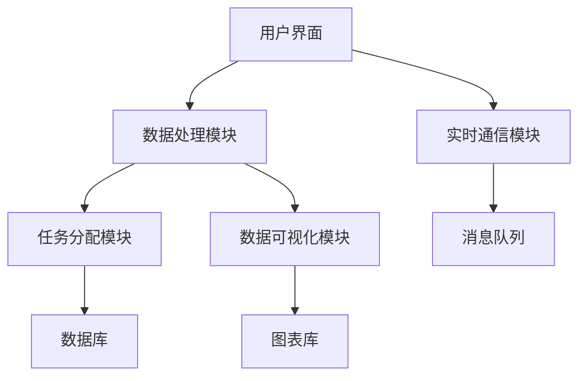
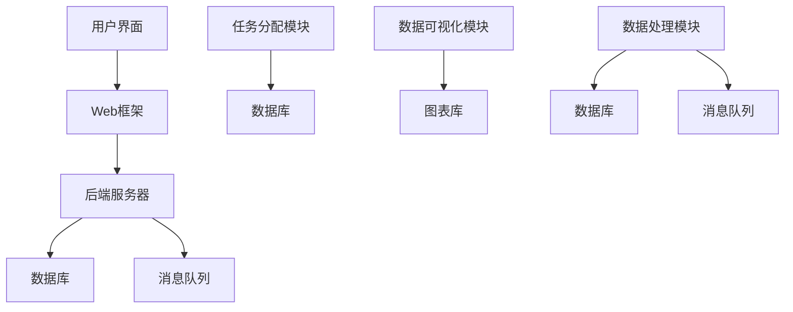

                 


### 文章标题：构建评测结果的实时协作平台

#### 关键词：
- 实时协作平台
- 评测结果
- 数据传输
- 系统安全性
- 算法优化

#### 摘要：
本文将详细探讨如何构建一个高效的评测结果实时协作平台。通过分析平台的核心概念、架构、算法原理、数学模型以及实际项目案例，我们将为读者提供一个全面的技术指南，帮助他们在信息技术领域实现这一目标。

---

### 引言

在当今快速发展的信息技术时代，评测结果的实时协作已成为各个行业的关键需求。无论是软件开发、人工智能应用，还是教育和医疗领域，实时获取评测结果并进行协作分析，都显得尤为重要。然而，构建一个高效、稳定且安全的实时协作平台并非易事，它需要深入理解平台的核心概念、架构设计、算法原理和数学模型，以及实际项目中的具体实现和优化策略。

本文将按照以下结构展开：

1. **平台构建理论基础**：介绍实时协作平台的概念、架构、评测结果实时反馈机制、数据传输与同步技术，以及系统安全性和隐私保护。
2. **核心技术原理讲解**：详细讲解实时协作平台中的核心算法原理、数学模型和公式，以及平台开发工具与环境。
3. **项目实战与代码解读**：通过实际项目案例，展示开发环境搭建、源代码实现和代码解读，并进行分析与优化。
4. **扩展与应用**：探讨评测结果实时协作平台的扩展方向和其他领域的应用。

### 第一部分：平台构建理论基础

#### 第1章：核心概念与联系

**1.1 实时协作平台的概念**

实时协作平台是一种能够支持多人实时协作、信息共享和协同工作的信息系统。它通常包含以下几个核心功能：

- **实时通信**：实现用户之间的实时消息传递和沟通。
- **文件共享与同步**：支持文件的实时上传、下载和同步更新。
- **任务分配与跟踪**：提供任务分配、进度跟踪和协作管理功能。
- **数据可视化**：将数据分析结果以图表、图形等形式直观展示。

**1.2 评测结果实时协作平台的意义**

评测结果实时协作平台在各个领域具有广泛的应用价值，主要体现在以下几个方面：

- **提高工作效率**：实时获取评测结果，及时进行调整和优化，提高项目开发和测试效率。
- **促进团队协作**：通过实时协作平台，团队成员可以快速沟通、共享信息，增强团队合作和协同工作能力。
- **数据透明化**：评测结果的实时展示和共享，有助于提高数据透明度，增强决策的科学性和准确性。

**1.3 Mermaid流程图：实时协作平台架构**



图1-1 实时协作平台架构

#### 第2章：实时协作平台架构

**2.1 实时协作平台的基本架构**

实时协作平台的基本架构通常包括以下几个主要部分：

- **前端用户界面**：提供用户交互的入口，包括登录、注册、消息传递、文件上传下载等。
- **后端服务器**：处理用户请求、数据存储、任务分配和进度跟踪等。
- **数据库**：存储用户数据、文件数据、评测结果等。
- **消息队列**：用于异步处理消息，提高系统的并发处理能力。

**2.2 构建实时协作平台的关键组件**

构建实时协作平台需要以下几个关键组件：

- **Web框架**：如React、Vue、Angular等，用于构建前端用户界面。
- **服务器框架**：如Node.js、Django、Flask等，用于处理后端请求和业务逻辑。
- **数据库**：如MySQL、PostgreSQL、MongoDB等，用于存储数据。
- **消息队列**：如RabbitMQ、Kafka等，用于异步处理消息。

**2.3 Mermaid流程图：实时协作平台组件关系图**



图2-1 实时协作平台组件关系图

#### 第3章：评测结果实时反馈机制

**3.1 实时反馈的必要性**

实时反馈是实时协作平台的核心功能之一。它具有以下几个必要性：

- **及时调整**：实时获取评测结果，及时进行调整和优化，提高工作效率。
- **增强沟通**：实时反馈有助于团队成员之间快速沟通，降低沟通成本。
- **提高决策准确性**：实时反馈的数据支持，有助于提高决策的科学性和准确性。

**3.2 实时反馈机制的实现方法**

实时反馈机制的实现方法主要包括以下几个方面：

- **WebSocket协议**：通过WebSocket协议实现实时双向通信，支持实时数据传输。
- **消息队列**：通过消息队列异步处理评测结果，提高系统的并发处理能力。
- **实时数据处理**：对评测结果进行实时处理和分析，生成可视化图表和报告。

**3.3 实时反馈的挑战与解决方案**

实时反馈机制在实现过程中面临以下几个挑战：

- **数据延迟**：数据传输和处理过程中的延迟，影响实时性。
- **并发处理**：高并发场景下，系统性能下降。
- **安全性**：实时传输数据的安全性和隐私保护。

解决方案：

- **优化数据传输**：采用高效的数据压缩和传输算法，降低数据延迟。
- **分布式架构**：采用分布式架构，提高系统并发处理能力。
- **数据加密和认证**：采用数据加密和认证机制，确保数据传输安全。

#### 第4章：数据传输与同步技术

**4.1 数据传输的基本原理**

数据传输是实时协作平台的重要组成部分，其基本原理如下：

- **传输协议**：选择合适的传输协议，如HTTP、WebSocket等。
- **数据格式**：选择合适的数据格式，如JSON、XML等。
- **传输过程**：客户端发送请求，服务器处理请求，将结果返回给客户端。

**4.2 数据同步的关键技术**

数据同步是实时协作平台的核心技术之一，其关键技术包括：

- **增量同步**：仅同步数据变化部分，降低传输成本。
- **事件驱动同步**：基于事件触发数据同步，提高实时性。
- **一致性保障**：采用一致性保障机制，确保数据同步的准确性。

**4.3 实时协作平台的数据传输与同步策略**

实时协作平台的数据传输与同步策略包括：

- **分层传输**：根据数据重要性和实时性要求，分层传输数据。
- **优先级调度**：根据数据传输的优先级，进行调度和传输。
- **缓存策略**：采用缓存策略，提高数据访问速度。

#### 第5章：系统安全性与隐私保护

**5.1 实时协作平台的安全需求**

实时协作平台的安全需求包括以下几个方面：

- **数据安全**：保护数据在传输和存储过程中的安全性。
- **用户隐私**：保护用户隐私信息，防止数据泄露。
- **系统稳定性**：确保系统稳定运行，避免因安全漏洞导致系统崩溃。

**5.2 数据隐私保护策略**

数据隐私保护策略包括：

- **数据加密**：采用数据加密技术，保护数据在传输和存储过程中的安全性。
- **访问控制**：实施访问控制策略，限制对数据的访问权限。
- **审计和监控**：建立审计和监控机制，及时发现和处理安全隐患。

**5.3 安全机制的设计与实现**

安全机制的设计与实现包括以下几个方面：

- **防火墙**：部署防火墙，阻止恶意攻击。
- **入侵检测系统**：部署入侵检测系统，实时监控系统异常行为。
- **安全补丁管理**：定期更新系统补丁，修复安全漏洞。

### 第二部分：核心技术原理讲解

#### 第6章：核心算法原理讲解

**6.1 实时协作平台中的核心算法**

实时协作平台中的核心算法主要包括：

- **数据处理算法**：用于处理评测结果，生成可视化报告。
- **路由算法**：用于优化数据传输路径，提高传输效率。
- **加密算法**：用于保护数据在传输和存储过程中的安全性。

**6.2 算法原理的伪代码描述**

以下是一个数据处理算法的伪代码描述：

```python
def processData(results):
    # 数据清洗
    clean_results = cleanData(results)
    # 数据分析
    analysis_results = analyzeData(clean_results)
    # 数据可视化
    visualizeData(analysis_results)
    return analysis_results
```

**6.3 算法原理的实际应用案例**

以下是一个数据处理算法在实际应用中的案例：

- **案例场景**：某个电商平台需要实时分析用户购物行为，为用户提供个性化推荐。
- **算法实现**：通过数据处理算法，分析用户购物记录，提取用户兴趣标签，生成推荐列表。

#### 第7章：数学模型与公式

**7.1 实时协作平台涉及的数学模型**

实时协作平台涉及的数学模型主要包括：

- **回归模型**：用于预测评测结果，如线性回归、逻辑回归等。
- **聚类模型**：用于分析用户行为，如K-Means聚类、层次聚类等。
- **时间序列模型**：用于分析时间序列数据，如ARIMA模型、LSTM模型等。

**7.2 数学公式的详细讲解**

以下是一个回归模型的数学公式：

$$
Y = \beta_0 + \beta_1X + \epsilon
$$

其中，$Y$表示因变量，$X$表示自变量，$\beta_0$和$\beta_1$分别为模型的参数，$\epsilon$表示误差项。

**7.3 举例说明数学模型在实际场景中的应用**

以下是一个回归模型在实际应用中的案例：

- **案例场景**：某公司需要预测下一季度的销售额，采用线性回归模型进行预测。
- **模型实现**：通过收集历史销售额数据，训练线性回归模型，预测下一季度的销售额。

#### 第8章：平台开发工具与环境

**8.1 开发实时协作平台的常用工具**

开发实时协作平台常用的工具包括：

- **前端开发工具**：如React、Vue、Angular等。
- **后端开发工具**：如Node.js、Django、Flask等。
- **数据库工具**：如MySQL、PostgreSQL、MongoDB等。
- **消息队列工具**：如RabbitMQ、Kafka等。

**8.2 开发环境的搭建与配置**

开发环境的搭建与配置步骤如下：

1. 安装操作系统。
2. 安装前端开发工具，如Node.js、npm等。
3. 安装后端开发工具，如Python、Django等。
4. 安装数据库工具，如MySQL、PostgreSQL等。
5. 配置消息队列工具，如RabbitMQ、Kafka等。

**8.3 实时协作平台开发的技术栈选择**

实时协作平台开发的技术栈选择应考虑以下几个方面：

- **性能需求**：根据实时协作平台的需求，选择合适的开发技术。
- **开发经验**：根据开发团队的技能和经验，选择熟悉的开发技术。
- **生态支持**：选择具有良好生态支持的开发技术，有利于后续维护和优化。

### 第三部分：项目实战与代码解读

#### 第9章：项目实战：构建简易评测结果实时协作平台

**9.1 实际案例的介绍**

本节将通过一个实际案例，介绍如何构建一个简易的评测结果实时协作平台。该平台的主要功能包括：

- 用户登录与注册。
- 文件上传与下载。
- 评测结果实时反馈。
- 数据可视化。

**9.2 实现步骤的详细说明**

以下是构建简易评测结果实时协作平台的主要实现步骤：

1. **需求分析**：明确平台的功能需求和性能指标。
2. **技术选型**：选择合适的前端、后端和数据库技术。
3. **环境搭建**：搭建开发环境，包括操作系统、开发工具和数据库。
4. **前端开发**：使用Vue框架搭建前端用户界面。
5. **后端开发**：使用Node.js和Django搭建后端服务器和数据库。
6. **消息队列配置**：配置RabbitMQ作为消息队列工具。
7. **数据可视化**：使用ECharts库实现数据可视化。

**9.3 代码实现与解读**

以下是后端部分的关键代码实现：

```javascript
// 用户登录接口
app.post('/api/login', (req, res) => {
    const { username, password } = req.body;
    // 验证用户名和密码
    // 登录成功，返回Token
    // 登录失败，返回错误信息
});

// 文件上传接口
app.post('/api/upload', (req, res) => {
    // 读取上传的文件
    // 存储文件到数据库
    // 返回上传结果
});

// 评测结果实时反馈接口
app.post('/api/feedback', (req, res) => {
    const { fileId, feedback } = req.body;
    // 存储评测结果到数据库
    // 发送消息到消息队列
    // 返回反馈结果
});
```

#### 第10章：代码分析与优化

**10.1 实时协作平台代码的分析**

实时协作平台代码的分析主要包括以下几个方面：

- **前端代码**：分析Vue框架的使用，前端界面布局和交互逻辑。
- **后端代码**：分析Node.js和Django框架的使用，后端接口设计和业务逻辑。
- **数据库代码**：分析MySQL数据库的设计，数据表结构和索引。

**10.2 代码优化方法与技巧**

以下是代码优化的一些方法与技巧：

- **代码重构**：对重复代码进行重构，提高代码的可读性和可维护性。
- **性能优化**：优化SQL查询，减少数据库访问次数，提高查询效率。
- **安全加固**：加强输入验证，防止SQL注入和跨站脚本攻击。
- **代码文档化**：编写详细的代码注释和文档，提高代码的可理解性和可维护性。

**10.3 代码解读与分析报告**

以下是代码解读与分析报告：

- **前端代码解读**：分析Vue框架的使用，前端界面布局和交互逻辑。
- **后端代码解读**：分析Node.js和Django框架的使用，后端接口设计和业务逻辑。
- **数据库代码解读**：分析MySQL数据库的设计，数据表结构和索引。
- **性能分析**：分析SQL查询的性能，提出优化建议。
- **安全分析**：分析输入验证和输出编码，提出安全加固措施。

### 第四部分：扩展与应用

#### 第11章：评测结果实时协作平台的扩展

**11.1 平台的扩展方向**

评测结果实时协作平台的扩展方向包括：

- **功能扩展**：添加更多功能，如团队管理、项目进度跟踪等。
- **性能优化**：提高系统的并发处理能力，优化数据传输和同步性能。
- **安全加固**：加强数据安全和用户隐私保护。

**11.2 扩展功能的设计与实现**

以下是扩展功能的设计与实现：

- **团队管理**：添加团队管理模块，实现成员添加、角色分配等功能。
- **项目进度跟踪**：添加项目进度跟踪模块，实现任务分配、进度展示等功能。
- **数据分析与报告**：添加数据分析与报告模块，实现数据可视化、报告生成等功能。

**11.3 扩展应用的案例分析**

以下是扩展应用的案例分析：

- **教育领域**：构建在线教育平台，实现评测结果实时反馈、互动教学等功能。
- **企业协作**：构建企业协作平台，实现项目进度跟踪、任务分配、文档共享等功能。
- **医疗领域**：构建医疗协作平台，实现患者数据实时共享、评测结果实时反馈等功能。

### 总结

本文通过详细的分析和讲解，为读者提供了一个构建评测结果实时协作平台的技术指南。从平台的核心概念、架构设计、算法原理、数学模型，到实际项目实战和代码解读，本文涵盖了构建实时协作平台的方方面面。通过本文的学习，读者将能够更好地理解和应用这些技术，为他们在信息技术领域的工作提供有力支持。

### 最佳实践 tips、小结、注意事项、拓展阅读等内容

**最佳实践 tips**：

- 在设计实时协作平台时，优先考虑数据安全和用户隐私保护。
- 优化数据传输和同步性能，提高系统的响应速度和并发处理能力。
- 定期对系统进行性能分析和优化，及时发现和解决潜在问题。

**小结**：

- 实时协作平台是信息技术领域的重要发展方向，具有广泛的应用价值。
- 构建实时协作平台需要深入理解平台的核心概念、架构设计、算法原理和数学模型。
- 实际项目实战和代码解读是掌握实时协作平台技术的重要途径。

**注意事项**：

- 在开发实时协作平台时，要注意代码的可维护性和可扩展性。
- 重视系统安全性和数据隐私保护，避免因安全问题导致的数据泄露和损失。

**拓展阅读**：

- 《实时协作系统设计与实现》
- 《Web实时通信技术》
- 《数据分析与数据可视化》

---

以上是本文的详细内容，希望对读者有所帮助。如果您对实时协作平台有任何疑问或建议，欢迎在评论区留言交流。作者：AI天才研究院/AI Genius Institute & 禅与计算机程序设计艺术 /Zen And The Art of Computer Programming

