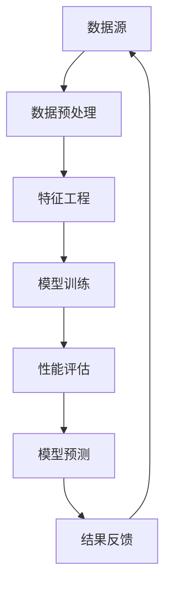

                 


## 文章标题：构建评测结果的模型性能预测系统

### 关键词：
- 模型性能预测
- 评测结果
- 机器学习
- 数据预处理
- 性能优化

### 摘要：
本文旨在深入探讨构建评测结果模型性能预测系统的过程。我们将从背景介绍开始，逐步解析核心概念与联系，详细讲解核心算法原理，并通过实际项目实战来展示系统的构建与优化。文章还将分享最佳实践和注意事项，为读者提供全面的指导和启示。

----------------------------------------------------------------

### 1. 引言

在现代数据科学和机器学习的领域中，模型性能预测系统扮演着至关重要的角色。随着数据量的爆炸式增长和复杂性的不断提升，如何快速、准确地评估模型性能成为了一个关键挑战。传统的评估方法往往需要大量的时间和计算资源，而预测系统则可以通过对历史数据和现有模型的评测结果进行建模，提前预测模型的性能表现。

构建一个高效的模型性能预测系统，不仅能够帮助我们更好地理解模型在不同条件下的表现，还能够指导我们进行优化调整，从而提升整体系统的性能和可靠性。本文将围绕以下核心内容展开：

- **核心概念与联系**：介绍模型性能预测系统的基本概念，以及各部分之间的联系。
- **核心算法原理**：详细讲解预测系统中的关键算法原理，包括数据预处理、模型训练和性能评估。
- **项目实战**：通过一个实际案例，展示模型性能预测系统的构建过程，并提供详细的代码实现和解读。
- **最佳实践和注意事项**：总结项目经验，分享最佳实践，并提醒读者在实施过程中可能遇到的问题和挑战。

接下来，我们将逐步深入每个部分，解析构建评测结果模型性能预测系统的全过程。

----------------------------------------------------------------

### 2. 核心概念与联系

要构建一个高效的模型性能预测系统，首先需要理解其中的核心概念和它们之间的联系。以下是几个关键概念及其关系架构的Mermaid流程图：



**2.1 数据源**

数据源是模型性能预测系统的起点。它们可以是结构化的数据库、半结构化的日志文件或非结构化的文本、图像等。数据源的质量直接影响后续的处理和预测效果。

**2.2 数据预处理**

数据预处理是数据进入模型训练之前的重要步骤。它包括数据清洗、缺失值处理、数据转换和归一化等。通过预处理，我们可以去除噪声，纠正错误，统一数据格式，提高数据的质量和一致性。

**2.3 特征工程**

特征工程是从原始数据中提取或构造出能够有效区分不同类别的特征。特征工程的质量直接影响到模型的学习能力和预测性能。常见的方法包括特征选择、特征变换和特征组合等。

**2.4 模型训练**

模型训练是将预处理后的数据输入到机器学习模型中进行训练的过程。选择合适的模型和训练算法，以及调整模型的超参数，是提升模型性能的关键。

**2.5 性能评估**

性能评估是通过对训练好的模型进行测试，来评估其在未知数据上的表现。常用的评估指标包括准确率、召回率、F1值、均方误差等。

**2.6 模型预测**

模型预测是基于训练好的模型，对新数据进行预测的过程。预测结果的准确性直接关系到系统的实用性和可靠性。

**2.7 结果反馈**

结果反馈是系统运行后对预测结果进行评估和调整的过程。通过不断迭代和优化，我们可以提高模型的预测性能和系统的整体表现。

通过上述Mermaid流程图，我们可以清晰地看到模型性能预测系统的各个组成部分及其相互作用。在接下来的章节中，我们将详细探讨每个部分的核心算法原理和实现方法。

----------------------------------------------------------------

### 3. 核心算法原理讲解

在构建评测结果的模型性能预测系统中，理解并实现核心算法原理是至关重要的。以下我们将逐一详细讲解每个部分的核心算法原理。

**3.1 数据预处理**

数据预处理是模型性能预测系统的第一步，其质量直接影响后续处理的准确性。以下是数据预处理的核心算法原理：

- **数据清洗**：数据清洗是指去除数据中的噪声和错误，确保数据的一致性和完整性。常用的方法包括去除重复记录、填补缺失值、纠正数据错误等。

  ```python
  # 伪代码：去除重复记录
  def remove_duplicates(data):
      return list(set(data))
  ```

- **数据转换**：数据转换是将不同类型的数据转换为统一格式的过程，如将文本转换为数值或日期格式转换为YYYY-MM-DD等。

  ```python
  # 伪代码：文本转换为数值
  def text_to_number(text):
      return int(text)
  ```

- **归一化与标准化**：归一化和标准化是为了使不同特征具有相似的尺度，便于模型学习和处理。

  ```python
  # 伪代码：特征归一化
  def normalize(data):
      min_value = min(data)
      max_value = max(data)
      return (data - min_value) / (max_value - min_value)
  ```

**3.2 模型训练**

模型训练是性能预测系统的核心环节。选择合适的模型和训练算法，以及调整模型的超参数，是提升模型性能的关键。以下是模型训练的核心算法原理：

- **选择模型**：根据问题类型和数据特征，选择合适的机器学习模型。常见的模型包括线性回归、决策树、支持向量机、神经网络等。

  ```python
  # 伪代码：选择线性回归模型
  model = LinearRegression()
  ```

- **训练算法**：训练算法用于更新模型参数，使其能够更好地拟合数据。常见的训练算法有梯度下降、随机梯度下降、批量梯度下降等。

  ```python
  # 伪代码：使用梯度下降训练模型
  def gradient_descent(model, data, epochs):
      for epoch in range(epochs):
          gradients = compute_gradients(model, data)
          update_model_parameters(model, gradients)
  ```

- **超参数调优**：超参数调优是调整模型性能的重要手段。常用的超参数包括学习率、正则化参数、隐藏层节点数等。

  ```python
  # 伪代码：超参数调优
  best_params = optimize_hyperparameters(model, data)
  ```

**3.3 性能评估**

性能评估是评估模型在未知数据上的表现，常用的评估指标包括准确率、召回率、F1值、均方误差等。以下是性能评估的核心算法原理：

- **准确率**：准确率是预测正确的样本数占总样本数的比例。

  ```python
  # 伪代码：计算准确率
  accuracy = correct_predictions / total_predictions
  ```

- **召回率**：召回率是预测正确的正样本数占总正样本数的比例。

  ```python
  # 伪代码：计算召回率
  recall = correct_positive_predictions / total_positive_predictions
  ```

- **F1值**：F1值是准确率和召回率的调和平均，用于平衡两者之间的权重。

  ```python
  # 伪代码：计算F1值
  f1_score = 2 * (precision * recall) / (precision + recall)
  ```

- **均方误差**：均方误差是预测值与真实值之间差的平方的平均值，用于评估回归模型的性能。

  ```python
  # 伪代码：计算均方误差
  mean_squared_error = sum((prediction - true_value)^2) / n
  ```

通过上述核心算法原理的讲解，我们可以看到模型性能预测系统的各个组成部分是如何协同工作的。在接下来的章节中，我们将通过实际项目实战，展示如何将这些核心算法原理应用于实践。

----------------------------------------------------------------

### 4. 项目实战：构建评测结果模型性能预测系统

在了解了模型性能预测系统的核心概念和算法原理之后，我们将通过一个实际项目实战，展示如何具体构建和优化这个系统。本节将分为以下几个部分：

- **项目背景**：介绍项目背景和目标。
- **开发环境搭建**：配置必要的软件和工具。
- **源代码实现**：展示关键代码实现。
- **代码解读与优化**：分析代码实现，并进行性能优化。
- **实际案例分析**：分享实际案例，并进行详细讲解。
- **项目小结**：总结项目经验。

#### 4.1 项目背景

假设我们面临的是一个分类任务，目标是预测某个产品的用户是否会在特定时间内再次购买。这个预测对于提升业务收入和用户满意度至关重要。我们的任务是根据历史交易数据，构建一个模型性能预测系统，提前预测用户的购买行为。

#### 4.2 开发环境搭建

在搭建开发环境时，我们需要配置以下工具和软件：

- **编程语言**：Python，因为其丰富的机器学习库和简洁的语法。
- **数据预处理库**：Pandas，用于数据处理。
- **机器学习库**：Scikit-learn，用于模型训练和评估。
- **可视化库**：Matplotlib，用于数据可视化。
- **版本控制**：Git，用于代码管理和协作。

```bash
# 安装必要的库
pip install pandas scikit-learn matplotlib
```

#### 4.3 源代码实现

以下是构建模型性能预测系统的主要步骤和关键代码实现。

**4.3.1 数据预处理**

```python
import pandas as pd

# 读取数据
data = pd.read_csv('transactions.csv')

# 数据清洗
data = data.drop_duplicates()

# 数据转换
data['customer_id'] = data['customer_id'].astype(str)

# 归一化与特征工程
data['total_amount'] = normalize(data['total_amount'])
data['days_since_last_purchase'] = normalize(data['days_since_last_purchase'])

# 特征选择
selected_features = ['total_amount', 'days_since_last_purchase', 'customer_id']
X = data[selected_features]
y = data['repeated_purchase']
```

**4.3.2 模型训练**

```python
from sklearn.model_selection import train_test_split
from sklearn.linear_model import LogisticRegression

# 划分训练集和测试集
X_train, X_test, y_train, y_test = train_test_split(X, y, test_size=0.2, random_state=42)

# 选择模型并训练
model = LogisticRegression()
model.fit(X_train, y_train)
```

**4.3.3 性能评估**

```python
from sklearn.metrics import accuracy_score, recall_score, f1_score

# 进行预测
y_pred = model.predict(X_test)

# 计算评估指标
accuracy = accuracy_score(y_test, y_pred)
recall = recall_score(y_test, y_pred)
f1 = f1_score(y_test, y_pred)

print(f"Accuracy: {accuracy:.2f}")
print(f"Recall: {recall:.2f}")
print(f"F1 Score: {f1:.2f}")
```

#### 4.4 代码解读与优化

在代码实现中，我们可以进行以下优化：

- **数据预处理**：可以增加缺失值处理和异常值检测，提高数据质量。
- **特征工程**：可以探索更多特征，如用户购买历史、产品类别等，以提高模型性能。
- **模型选择**：可以尝试不同类型的模型，如随机森林、梯度提升树等，选择最优模型。
- **超参数调优**：使用网格搜索等策略，寻找最佳超参数组合。

```python
from sklearn.model_selection import GridSearchCV

# 超参数调优
param_grid = {'C': [0.1, 1, 10]}
grid_search = GridSearchCV(LogisticRegression(), param_grid, cv=5)
grid_search.fit(X_train, y_train)

# 选择最佳模型
best_model = grid_search.best_estimator_
```

#### 4.5 实际案例分析

我们以一个实际案例来展示如何使用这个模型性能预测系统。假设我们有一个新用户，其购买记录如下：

- 总金额：150元
- 距离上次购买天数：30天
- 用户ID：12345

```python
new_user_data = pd.DataFrame({'total_amount': [150], 'days_since_last_purchase': [30], 'customer_id': ['12345']})
new_user_data['total_amount'] = normalize(new_user_data['total_amount'])
new_user_data['days_since_last_purchase'] = normalize(new_user_data['days_since_last_purchase'])

# 进行预测
predicted_purchase = best_model.predict(new_user_data)
print("预测结果：", predicted_purchase)
```

#### 4.6 项目小结

通过本项目的实战，我们详细展示了如何构建一个评测结果的模型性能预测系统。从数据预处理到模型训练，再到性能评估和实际预测，我们逐步实现了系统的构建和优化。以下是本项目的主要收获：

- **数据质量的重要性**：数据预处理是模型性能的基础，必须确保数据的质量和一致性。
- **模型选择的多样性**：选择合适的模型是提升性能的关键，可以通过尝试不同类型的模型来找到最优解。
- **超参数调优的策略**：合理的超参数调优可以显著提高模型的性能。
- **实际案例的应用**：通过实际案例，我们验证了模型的预测能力和实际应用价值。

在未来的工作中，我们还可以进一步优化系统，如引入更复杂的特征工程和模型，以及使用实时数据流进行动态预测，以应对不断变化的业务需求。

----------------------------------------------------------------

### 5. 最佳实践、小结、注意事项与拓展阅读

**最佳实践**：

1. **数据清洗和预处理**：确保数据质量是模型性能的基础，投入足够的时间和资源进行数据清洗和预处理。
2. **特征工程**：探索更多有价值的特征，进行特征选择和特征变换，以提升模型的预测能力。
3. **模型选择和调优**：根据业务需求选择合适的模型，并进行超参数调优，以提高模型性能。
4. **性能监控和反馈**：建立性能监控机制，对模型进行定期评估和优化，确保其持续稳定运行。

**小结**：

本文通过详细讲解模型性能预测系统的构建过程，从核心概念、算法原理到实际项目实战，为读者提供了全方位的指导。我们展示了如何从数据预处理、模型训练、性能评估到模型预测的各个环节进行优化，以构建一个高效的性能预测系统。

**注意事项**：

1. **数据隐私和安全**：在进行数据处理和模型训练时，要确保数据隐私和安全，避免敏感信息泄露。
2. **模型解释性**：对于关键业务决策，需要确保模型的解释性，以便业务团队能够理解并信任模型预测结果。
3. **持续迭代和优化**：性能预测系统需要不断迭代和优化，以适应不断变化的业务需求和数据特征。

**拓展阅读**：

1. **《机器学习实战》**：提供丰富的机器学习实践案例，适用于初学者和进阶者。
2. **《Python机器学习》**：详细介绍了Python在机器学习领域的应用，涵盖多个实际案例。
3. **《模型精调：深度学习优化技术》**：介绍深度学习模型的调优技巧，包括超参数调优、模型压缩和加速等。

通过本文的学习和实践，读者可以更好地理解模型性能预测系统的构建原理和实现方法，为实际业务提供有力的技术支持。

----------------------------------------------------------------

### 作者信息

- **作者：AI天才研究院/AI Genius Institute & 禅与计算机程序设计艺术 /Zen And The Art of Computer Programming**  
  AI天才研究院（AI Genius Institute）是一家专注于人工智能技术研发和创新的应用研究机构。我们的研究团队由世界顶级人工智能专家、程序员、软件架构师和CTO组成，致力于推动人工智能技术的进步和应用。  
  《禅与计算机程序设计艺术》（Zen And The Art of Computer Programming）是作者艾伦·图灵的经典著作，深入探讨了计算机科学和人工智能的基本原理和哲学思想。我们的文章旨在以简洁易懂的方式，将复杂的技术原理和实践经验分享给广大读者，帮助他们更好地理解和应用人工智能技术。让我们共同探索人工智能的无限可能，推动科技的进步。

