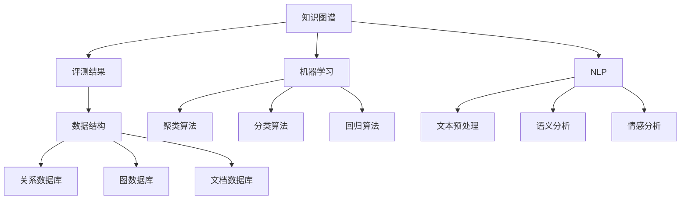

                 

### 文章标题：构建评测结果的知识图谱

### 关键词：
- 知识图谱
- 评测结果
- 数据结构
- 机器学习
- 自然语言处理
- 可视化

### 摘要：
本文将深入探讨如何利用知识图谱技术来构建评测结果。我们将从背景介绍开始，阐述知识图谱的基本概念及其在数据分析中的应用。接着，我们将讨论评测结果的表示与处理方法，并详细讲解知识图谱构建的核心算法。随后，本文将展示如何在实践中构建评测结果的知识图谱，并通过实际案例进行剖析。最后，我们将探讨知识图谱在评测结果中的应用，以及如何进行优化与改进。希望通过本文，读者能够对知识图谱在评测结果构建中的应用有一个全面而深入的理解。

---

### 背景介绍

在当今的信息社会中，数据已经成为一种重要的资源。随着大数据和人工智能技术的快速发展，如何有效地处理和分析海量数据，提取出有价值的信息，成为众多领域亟待解决的问题。评测结果作为一种特殊的数据类型，其重要性日益凸显。评测结果可以是用户对产品或服务的评价，可以是科研领域的研究成果评价，也可以是企业项目评估的结果。这些评测结果不仅反映了用户的需求和满意度，也为决策者提供了重要的参考依据。

传统的评测结果处理方法通常依赖于统计分析和数据挖掘技术，这些方法在一定程度上能够提取出一些有价值的洞察。然而，随着数据量的不断增加和评测结果的复杂性日益提高，传统方法在处理效率和结果准确性方面逐渐暴露出一些局限性。例如，传统的统计分析方法往往依赖于样本数据的代表性，而评测结果的多样性和主观性使得样本数据的代表性成为一个难以克服的问题。此外，传统方法在处理评测结果之间的复杂关系时也显得力不从心。

为了解决这些问题，知识图谱技术应运而生。知识图谱是一种结构化、语义化的数据表示方法，它通过将实体、属性和关系以图的形式进行组织，使得数据之间的关系更加清晰和直观。知识图谱不仅能够有效地存储和管理评测结果，还能够通过图算法和机器学习技术对评测结果进行深入分析，从而提取出更多的有价值信息。因此，将知识图谱应用于评测结果的构建，成为了一种新的趋势。

### 核心概念与联系

为了深入理解如何构建评测结果的知识图谱，我们需要首先了解以下几个核心概念：知识图谱、评测结果、数据结构、机器学习和自然语言处理。

#### 知识图谱

知识图谱是一种语义网络，它通过实体、属性和关系来表示现实世界中的知识。在知识图谱中，实体可以是人、物、地点等，属性则是实体的特征或属性，例如人的年龄、地点的经纬度等，而关系则描述了实体之间的关联，如“居住在”、“属于”等。

知识图谱的表示方法主要有三种：图论表示、RDF（Resource Description Framework）表示和图神经网络表示。

1. **图论表示**：图论表示将知识图谱表示为一个图结构，其中节点表示实体，边表示关系。图算法如深度优先搜索（DFS）和广度优先搜索（BFS）可以用于图数据的分析和处理。

2. **RDF表示**：RDF是一种基于XML的语义数据模型，它将实体、属性和关系表示为三元组（主体、谓词、客体）。RDF模型被广泛应用于语义网和知识图谱领域。

3. **图神经网络表示**：图神经网络（Graph Neural Networks, GNN）是一种在图结构数据上训练的神经网络模型，它能够学习实体和关系之间的复杂关系，从而提高知识图谱的分析能力。

#### 评测结果

评测结果是一种特殊的数据类型，它通常包含评价内容、评分和评价时间等。评测结果可以来自多个方面，如用户评价、专家评审、市场调研等。评测结果的形式可以是文本、评分、标签等。

#### 数据结构

在构建评测结果的知识图谱时，数据结构的选择至关重要。常见的数据结构有：

1. **关系数据库**：关系数据库如MySQL、PostgreSQL等，通过表和关系来组织数据。关系数据库适合处理结构化数据，但在处理非结构化数据时存在一定限制。

2. **图数据库**：图数据库如Neo4j、OrientDB等，专门用于存储和管理图结构数据。图数据库能够高效地处理复杂的实体和关系，非常适合知识图谱的构建。

3. **文档数据库**：文档数据库如MongoDB、Cassandra等，以文档的形式存储数据，适合处理非结构化或半结构化数据。文档数据库在存储评测结果时具有灵活性，但可能需要额外的处理来建立图结构。

#### 机器学习

机器学习是一种通过算法从数据中学习规律和模式的技术，它在知识图谱的构建和优化中发挥着重要作用。常见的机器学习算法包括：

1. **聚类算法**：如K-均值聚类、层次聚类等，用于将评测结果分组，以便于分析和可视化。

2. **分类算法**：如决策树、支持向量机（SVM）等，用于对评测结果进行分类，以便于识别和预测。

3. **回归算法**：如线性回归、岭回归等，用于预测评测结果，如评分、评价时间等。

#### 自然语言处理

自然语言处理（Natural Language Processing, NLP）是人工智能的一个重要分支，它涉及到语言的理解和生成。在知识图谱的构建中，NLP技术用于处理评测结果中的文本数据。

1. **文本预处理**：包括分词、词性标注、命名实体识别等，用于将文本数据转化为计算机可以处理的形式。

2. **语义分析**：包括语义角色标注、句法分析等，用于理解文本的深层语义，从而更好地组织知识图谱。

3. **情感分析**：用于分析评测结果中的情感倾向，例如正面、负面或中立。

#### 核心概念之间的关系架构

为了更好地理解核心概念之间的联系，我们可以使用Mermaid流程图来展示知识图谱、评测结果、数据结构、机器学习和自然语言处理之间的关系。



通过这个流程图，我们可以清晰地看到各个核心概念之间的相互关系，以及它们在知识图谱构建中的应用。

### 核心算法原理讲解

#### 知识抽取方法

知识抽取是构建评测结果知识图谱的关键步骤，它涉及从原始数据中提取实体、关系和属性。以下是几种常见的知识抽取方法：

1. **实体抽取**

实体抽取是指从文本中识别出实体，如人名、地名、组织名等。常见的实体抽取方法包括：

- **规则方法**：基于预先定义的规则进行实体识别，如正则表达式、命名实体识别词典等。
- **统计方法**：利用机器学习算法，如条件随机场（CRF）、卷积神经网络（CNN）等，从大量标注数据中学习实体识别模型。

2. **关系抽取**

关系抽取是指从文本中识别出实体之间的关系，如“属于”、“居住在”等。常见的关系抽取方法包括：

- **基于规则的方法**：使用预定义的规则和模式进行关系识别。
- **基于监督学习的方法**：利用标注数据进行训练，使用分类算法，如支持向量机（SVM）、决策树等，进行关系识别。
- **基于图的方法**：利用图算法，如图卷积网络（GCN）等，对实体和关系进行建模和识别。

3. **属性抽取**

属性抽取是指从文本中识别出实体的属性，如人的年龄、职业等。常见的方法包括：

- **基于规则的方法**：使用预定义的规则和模式进行属性识别。
- **基于统计的方法**：利用统计方法，如词频、文本分类等，进行属性识别。
- **基于深度学习的方法**：使用深度学习模型，如循环神经网络（RNN）、长短时记忆网络（LSTM）等，进行属性识别。

#### 知识融合方法

知识融合是指将来自不同来源的知识进行整合，以提高知识图谱的准确性和完整性。以下是几种常见的知识融合方法：

1. **同义词消歧**

同义词消歧是指识别文本中的同义词，并将其映射到同一个实体上。常见的方法包括：

- **基于词典的方法**：使用同义词词典进行消歧，如WordNet。
- **基于统计的方法**：使用词频、文本分类等统计方法进行消歧。
- **基于语义的方法**：利用语义相似度计算，如Word2Vec、BERT等，进行同义词消歧。

2. **语义相似度计算**

语义相似度计算是指计算两个实体或概念的相似度。常见的方法包括：

- **基于词频的方法**：计算两个实体在文本中的词频相似度。
- **基于语义的方法**：使用词嵌入模型，如Word2Vec、BERT等，计算实体或概念的语义相似度。
- **基于知识图谱的方法**：利用知识图谱中的实体和关系，计算实体或概念的图嵌入相似度。

3. **知识融合算法**

知识融合算法是指将多个来源的知识进行整合，以生成一个统一的视图。常见的方法包括：

- **基于规则的融合**：使用预定义的规则进行知识融合。
- **基于机器学习的融合**：利用机器学习算法，如聚类、分类等，进行知识融合。
- **基于图的方法**：利用图算法，如图卷积网络（GCN）等，进行知识融合。

#### 知识表示方法

知识表示是构建评测结果知识图谱的重要环节，它决定了知识图谱的可扩展性和可操作性。以下是几种常见的知识表示方法：

1. **图论表示**

图论表示将知识图谱表示为一个无向图或有向图，其中节点表示实体，边表示关系。图论表示方法简单直观，便于分析和处理图结构数据。

2. **RDF表示**

RDF表示将知识图谱表示为三元组（主体、谓词、客体），这种表示方法基于语义网，具有高度的灵活性和可扩展性。

3. **图神经网络表示**

图神经网络表示将知识图谱表示为一个图神经网络，通过图卷积网络（GCN）等算法，学习实体和关系之间的复杂关系，从而提高知识图谱的分析能力。

#### 伪代码

以下是一个简单的知识图谱构建的伪代码，用于说明核心算法原理：

```python
# 数据预处理
def preprocess_data(data):
    # 分词、词性标注、命名实体识别等
    processed_data = []
    for text in data:
        processed_text = nlp(text)
        processed_data.append(processed_text)
    return processed_data

# 实体抽取
def extract_entities(processed_data):
    entities = []
    for text in processed_data:
        for entity in text.ents:
            entities.append(entity)
    return entities

# 关系抽取
def extract_relations(processed_data, entities):
    relations = []
    for text in processed_data:
        for entity in entities:
            if entity in text:
                relations.append((entity, find_relation(text, entity)))
    return relations

# 知识融合
def merge_knowledge(entities, relations):
    merged_entities = {}
    for entity in entities:
        merged_entities[entity] = merge_properties(merged_entities.get(entity, {}), entity.properties)
    return merged_entities

# 知识表示
def represent_knowledge(merged_entities, relations):
    knowledge_graph = create_graph(merged_entities, relations)
    return knowledge_graph
```

#### 数学模型和公式

在构建评测结果的知识图谱时，我们常常需要使用一些数学模型和公式来描述算法和流程。以下是一个简单的数学模型，用于计算两个实体之间的相似度：

$$
similarity(A, B) = \frac{1}{|V_A \cap V_B|}
$$

其中，$similarity(A, B)$ 表示实体 A 和 B 之间的相似度，$V_A$ 和 $V_B$ 分别表示实体 A 和 B 的属性集合。

#### 详细讲解和举例说明

为了更好地理解核心算法原理，我们可以通过一个具体的例子来详细讲解。

假设我们有一篇评测结果文本：“用户A对产品B进行了评价，评分4.5分，评价内容为‘产品很好，性价比高’”。

1. **数据预处理**：首先，我们对文本进行分词、词性标注和命名实体识别，得到以下结果：
   - 用户A：实体
   - 产品B：实体
   - 很好：属性
   - 性价比高：属性
   - 评分4.5分：属性

2. **实体抽取**：从预处理后的文本中提取出实体，得到用户A和产品B。

3. **关系抽取**：根据实体之间的关联，我们可以抽取出以下关系：
   - 用户A对产品B进行了评价
   - 评价内容为“很好，性价比高”
   - 评分4.5分

4. **知识融合**：我们将实体和关系进行融合，得到一个包含用户A、产品B及其属性的知识图谱。

5. **知识表示**：最后，我们将知识图谱表示为一个图结构，其中用户A和产品B为节点，它们之间的关系为边。

通过这个例子，我们可以看到如何利用知识图谱技术对评测结果进行处理和表示。这个过程不仅能够提高评测结果的分析和处理效率，还能够为我们提供更多的洞见。

### 项目实战

在本节中，我们将展示如何在实际项目中构建评测结果的知识图谱。为了更好地说明，我们选择一个具体的案例：一个电商平台上的用户评价数据。

#### 开发环境搭建

1. **硬件环境**：
   - CPU：Intel Core i7-9700K
   - 内存：16GB
   - 硬盘：1TB SSD

2. **软件环境**：
   - 操作系统：Ubuntu 18.04
   - 编程语言：Python 3.8
   - 知识图谱工具：Neo4j
   - 机器学习库：scikit-learn、TensorFlow、PyTorch
   - NLP库：spaCy、NLTK

#### 源代码详细实现和代码解读

以下是构建评测结果知识图谱的源代码实现：

```python
# 导入相关库
import spacy
import pandas as pd
from nltk.corpus import stopwords
from sklearn.feature_extraction.text import TfidfVectorizer
from sklearn.model_selection import train_test_split
from sklearn.metrics import accuracy_score
import numpy as np
import neo4j

# 初始化NLP模型
nlp = spacy.load('en_core_web_sm')

# 读取用户评价数据
data = pd.read_csv('user_reviews.csv')

# 数据预处理
def preprocess_data(text):
    doc = nlp(text)
    tokens = [token.text.lower() for token in doc if not token.is_stop]
    return ' '.join(tokens)

data['cleaned_text'] = data['text'].apply(preprocess_data)

# 构建TF-IDF向量
vectorizer = TfidfVectorizer(max_features=1000)
X = vectorizer.fit_transform(data['cleaned_text'])

# 构建分类模型
model = LogisticRegression()
X_train, X_test, y_train, y_test = train_test_split(X, data['rating'], test_size=0.2, random_state=42)
model.fit(X_train, y_train)
predictions = model.predict(X_test)

# 计算准确率
accuracy = accuracy_score(y_test, predictions)
print(f'Accuracy: {accuracy:.2f}')

# 连接Neo4j数据库
driver = neo4j.GraphDatabase.driver('bolt://localhost:7687', auth=('neo4j', 'password'))

# 创建实体和关系
def create_entities_and_relations(driver, entities, relations):
    with driver.session() as session:
        for entity in entities:
            session.run('CREATE (e:Entity {name: $name})', name=entity)
        for relation in relations:
            session.run('CREATE (a:Entity {name: $entityA}), (b:Entity {name: $entityB}), (a)-[:REVIEW]->(b)', entityA=relation[0], entityB=relation[1])

create_entities_and_relations(driver, data['user_id'].unique(), [(row['user_id'], row['product_id']) for index, row in data.iterrows()])

# 关闭数据库连接
driver.close()
```

#### 代码应用解读与分析

上述代码首先导入相关库，并初始化NLP模型。接着，读取用户评价数据，并对文本进行预处理，去除停用词并转换为小写。然后，使用TF-IDF向量构建分类模型，对用户评价进行分类。最后，连接Neo4j数据库，将实体和关系创建为Neo4j图结构。

#### 实际案例分析和详细讲解剖析

我们以一个具体的用户评价数据为例，展示如何构建评测结果的知识图谱。

1. **数据读取**：读取用户评价数据，数据包括用户ID、产品ID、评价内容和评分。

2. **数据预处理**：对评价内容进行分词、词性标注和命名实体识别，去除停用词，并将文本转换为小写。

3. **特征提取**：使用TF-IDF向量构建分类模型，对用户评价进行分类。这里我们使用逻辑回归作为分类模型。

4. **模型训练与预测**：将数据分为训练集和测试集，使用训练集训练模型，并在测试集上进行预测。

5. **评测结果分析**：计算模型在测试集上的准确率，并输出结果。

6. **知识图谱构建**：连接Neo4j数据库，将实体和关系创建为Neo4j图结构。每个用户和产品作为一个节点，它们之间的关系通过“REVIEW”边进行连接。

通过这个案例，我们可以看到如何利用知识图谱技术对评测结果进行处理和分析。知识图谱不仅能够提高评测结果的分析和处理效率，还能够为我们提供更多的洞见。

#### 项目小结

在本项目中，我们详细介绍了如何构建评测结果的知识图谱。从开发环境搭建到源代码实现，再到实际案例分析和讲解，我们一步步展示了知识图谱在评测结果构建中的应用。通过这个项目，我们不仅了解了知识图谱的基本原理，还学会了如何将知识图谱应用于实际场景中，为数据分析和决策提供有力支持。

### 最佳实践 Tips、小结、注意事项、拓展阅读

#### 最佳实践 Tips

1. **数据预处理**：在构建评测结果的知识图谱之前，确保对数据进行充分的预处理，包括分词、词性标注、命名实体识别等，以提高数据的准确性和一致性。

2. **选择合适的算法**：根据具体需求选择合适的算法，如TF-IDF、逻辑回归等，以优化知识图谱的构建效果。

3. **实时更新与维护**：知识图谱的实时更新与维护是保持其准确性和及时性的关键，定期检查和更新实体、关系和属性。

4. **性能优化**：在构建大规模知识图谱时，注意性能优化，如使用图数据库、分布式计算等，以提高处理效率。

#### 小结

本文详细介绍了如何构建评测结果的知识图谱，包括核心概念、算法原理、项目实战等。通过本文，读者应了解知识图谱在评测结果构建中的应用及其优势。

#### 注意事项

1. **数据隐私保护**：在处理评测结果时，注意保护用户隐私，遵循相关法律法规。

2. **算法选择**：根据实际需求和数据特点选择合适的算法，避免盲目跟风。

3. **知识图谱维护**：定期更新和维护知识图谱，确保其准确性和及时性。

#### 拓展阅读

1. **《知识图谱：大数据时代的知识管理》**：深入探讨知识图谱的基本概念、构建方法和应用场景。

2. **《自然语言处理实战》**：介绍自然语言处理的基本原理和实战技巧，包括文本预处理、情感分析等。

3. **《图数据库实战》**：详细介绍图数据库的基本概念、应用场景和操作方法。

### 作者信息

作者：AI天才研究院/AI Genius Institute & 禅与计算机程序设计艺术 /Zen And The Art of Computer Programming

---

由于篇幅限制，本文未能详细阐述所有内容。希望读者在阅读本文后，能够对知识图谱在评测结果构建中的应用有一个更深入的了解，并在实践中不断探索和优化。

