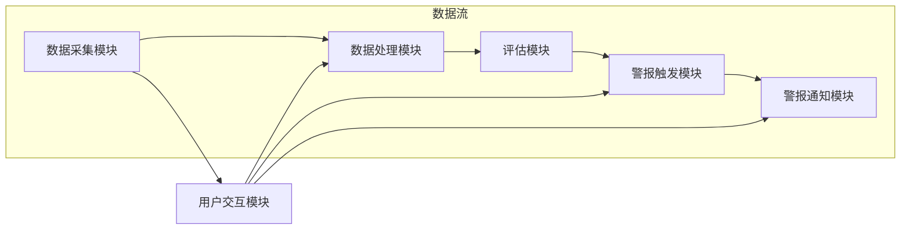
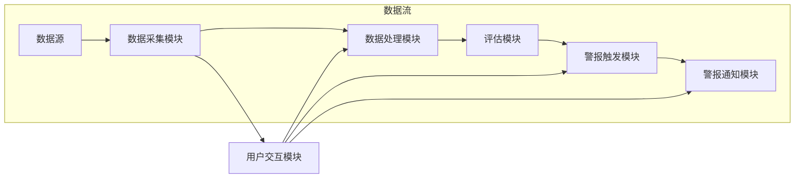
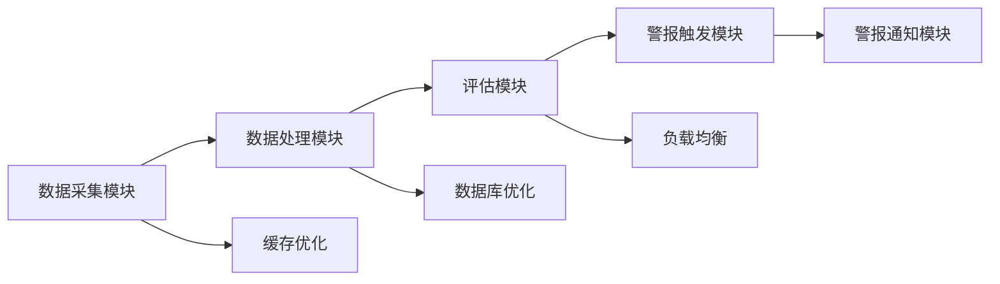

                 

## 《构建评测结果的自动化警报系统》

### 关键词

- 自动化警报系统
- 评测结果
- 实时监控
- 算法实现
- 警报规则
- 系统集成与部署
- 案例分析

### 摘要

本文旨在探讨自动化警报系统的构建方法，重点围绕评测结果的自动化处理。自动化警报系统通过实时监控评测结果，自动触发警报，提高工作效率，降低人为错误。文章首先介绍了自动化警报系统的基本概念、作用和架构，然后详细讨论了评测结果的评估方法与可视化技术。接着，文章深入剖析了自动化警报系统的设计原则、评测结果的自动化评估算法、警报规则的制定与实现方法。随后，文章讲解了系统的集成与部署策略，性能优化方法以及案例分析。最后，文章展望了自动化警报系统的未来发展趋势和应用前景。

## 第一部分：自动化警报系统概述

### 第1章：自动化警报系统的基本概念

#### 1.1 自动化警报系统的定义

自动化警报系统是一种通过自动化技术对评测结果进行监控和报警的系统。它能够实时捕捉评测结果，根据预设的规则自动判断是否触发警报，并通过邮件、短信、系统消息等方式通知相关人员。自动化警报系统的核心在于其自动化的特性，即通过计算机程序和算法来实现对评测结果的实时分析和处理。

#### 1.2 自动化警报系统的目的

自动化警报系统的目的主要有以下几点：

1. **提高工作效率**：通过自动化处理评测结果，减少人工干预，提高工作效率。
2. **降低人为错误**：自动化系统可以避免人为因素导致的错误，提高结果的准确性。
3. **实时监控评测结果**：能够实时监控评测结果，确保问题能够被及时捕捉和解决。
4. **提供数据支持**：自动化警报系统可以收集和分析大量的评测数据，为决策提供支持。

#### 1.3 自动化警报系统的架构

自动化警报系统的架构通常包括以下几个模块：

1. **数据采集模块**：负责从不同的数据源采集评测结果。
2. **数据处理模块**：对采集到的评测结果进行清洗、转换和预处理。
3. **评估模块**：根据预设的评估标准对评测结果进行评估。
4. **警报触发模块**：根据评估结果，判断是否触发警报。
5. **警报通知模块**：通过邮件、短信、系统消息等方式通知相关人员。
6. **用户交互模块**：提供用户界面，供用户设置警报规则和查看警报信息。

### 输出Mermaid流程图



#### 1.4 各模块的功能

- **数据采集模块**：从各种数据源（如数据库、日志文件、API等）获取评测结果数据。
- **数据处理模块**：对数据清洗、转换和预处理，确保数据的准确性和一致性。
- **评估模块**：根据预设的评估标准和算法，对评测结果进行分析和评估。
- **警报触发模块**：根据评估结果，判断是否触发警报，并决定警报的级别和类型。
- **警报通知模块**：将警报信息通过邮件、短信、系统消息等方式通知相关人员。
- **用户交互模块**：提供用户界面，供用户设置警报规则、查看警报信息和操作系统。

### 小结

本章介绍了自动化警报系统的基本概念、目的和架构，以及各模块的功能。自动化警报系统通过自动化技术对评测结果进行实时监控和报警，能够提高工作效率、降低人为错误，并提供数据支持。下一章将深入探讨评测结果的评估方法。

## 第2章：评测结果的评估方法

#### 2.1 评测结果的分类

评测结果可以根据不同的标准进行分类，常见的分类方法有：

1. **按性质分类**：
   - **客观评测结果**：基于客观数据或标准，通过量化指标进行评估。例如，测试通过率、性能指标等。
   - **主观评测结果**：基于主观判断或经验，通过评分或评语进行评估。例如，用户满意度、产品质量评价等。

2. **按来源分类**：
   - **内部评测结果**：由系统内部自动生成的评测结果。例如，测试报告、性能分析结果等。
   - **外部评测结果**：由外部机构或专家提供的评测结果。例如，第三方评估报告、用户反馈等。

#### 2.2 评测结果的评估方法

评估评测结果的方法可以根据其性质和来源进行选择，常见的方法有：

1. **量化评估方法**：
   - **统计分析**：通过对大量评测数据进行分析，得出评测结果。例如，计算平均值、中位数、标准差等。
   - **机器学习模型**：利用机器学习算法，对评测数据进行分析和预测。例如，回归分析、分类算法等。

2. **质化评估方法**：
   - **主观评分**：由专家或用户对评测结果进行评分。例如，采用五分制或十分制进行评价。
   - **文本分析**：对评测结果中的文本信息进行分析，提取关键信息。例如，使用自然语言处理技术进行情感分析、关键词提取等。

#### 2.3 评测结果的可视化

为了更好地理解和展示评测结果，可以使用数据可视化技术。常见的可视化工具和图表类型有：

1. **可视化工具**：
   - **Excel**：用于简单的数据可视化，提供多种图表类型。
   - **Tableau**：提供丰富的图表类型和交互功能，适用于复杂的数据分析。
   - **Python可视化库**：如Matplotlib、Seaborn等，用于数据可视化和统计分析。

2. **图表类型**：
   - **柱状图**：用于展示不同类别或组别的数据比较。
   - **折线图**：用于展示数据随时间变化的趋势。
   - **饼图**：用于展示各部分数据在整体中的占比。
   - **散点图**：用于展示两个或多个变量之间的关系。

### 小结

本章介绍了评测结果的分类、评估方法和可视化技术。通过合适的评估方法，可以更准确地理解和分析评测结果。下一章将详细讨论自动化警报系统的设计与实现。

## 第二部分：自动化警报系统的设计与实现

### 第3章：自动化警报系统的设计原则

#### 3.1 系统需求分析

在构建自动化警报系统时，首先需要对系统需求进行分析。系统需求分析包括功能需求和非功能需求。

1. **功能需求**：
   - **数据采集**：系统应能从不同数据源采集评测结果。
   - **数据处理**：系统应对采集到的评测结果进行清洗、转换和预处理。
   - **评估与报警**：系统应能根据预设的规则对评测结果进行评估，并触发相应的报警。
   - **通知与报告**：系统应能通过邮件、短信等方式通知相关人员，并提供详细的报警报告。

2. **非功能需求**：
   - **可靠性**：系统应具备高可靠性，确保评测结果不会丢失或误报。
   - **实时性**：系统应能实时监控评测结果，确保及时报警。
   - **可扩展性**：系统应具备良好的可扩展性，方便添加新的评测指标或报警规则。
   - **易用性**：系统应提供友好的用户界面，方便用户设置和操作。

#### 3.2 系统架构设计

自动化警报系统的架构设计应考虑模块的划分和各模块之间的交互。以下是一个典型的自动化警报系统架构设计：

1. **数据采集模块**：负责从各种数据源（如数据库、日志文件、API等）采集评测结果。
2. **数据处理模块**：对采集到的评测结果进行清洗、转换和预处理，确保数据的准确性和一致性。
3. **评估模块**：根据预设的评估标准和算法，对评测结果进行评估。
4. **警报触发模块**：根据评估结果，判断是否触发警报，并决定警报的级别和类型。
5. **警报通知模块**：通过邮件、短信、系统消息等方式通知相关人员。
6. **用户交互模块**：提供用户界面，供用户设置警报规则和查看警报信息。

#### 3.3 数据流设计

数据流设计是系统架构设计的重要组成部分，它描述了数据在系统中的流动和处理过程。以下是一个典型的数据流设计：



#### 3.4 系统设计原则

在自动化警报系统的设计过程中，应遵循以下原则：

1. **模块化设计**：将系统划分为多个模块，每个模块负责一个特定的功能，便于系统的维护和扩展。
2. **可扩展性**：设计时应考虑系统的可扩展性，以便在未来的需求变化时能够轻松扩展。
3. **灵活性**：系统应具备良好的灵活性，能够根据不同的需求和场景进行调整。
4. **可靠性**：系统应具备高可靠性，确保评测结果不会丢失或误报。
5. **用户体验**：用户界面应简洁直观，便于用户设置和操作。

### 小结

本章介绍了自动化警报系统的设计原则，包括系统需求分析、系统架构设计和数据流设计。通过合理的系统设计，可以构建一个高效、可靠、灵活的自动化警报系统。下一章将深入探讨评测结果的自动化评估算法。

### 第4章：评测结果的自动化评估算法

#### 4.1 自动化评估算法的原理

评测结果的自动化评估算法是基于数学模型和统计方法，通过对评测数据进行处理和分析，得出评估结果。自动化评估算法的原理主要包括以下几个方面：

1. **数学模型**：根据具体的评测目标和要求，建立相应的数学模型。常见的数学模型包括线性回归模型、决策树模型、神经网络模型等。

2. **统计方法**：使用统计方法对评测数据进行处理和分析。常见的统计方法包括均值、中位数、标准差等。

3. **算法实现**：将数学模型和统计方法转化为计算机程序，实现对评测数据的自动化评估。

4. **参数设置**：根据具体的应用场景，设置适当的参数，以优化评估结果。

#### 4.2 自动化评估算法的实现

自动化评估算法的实现通常包括以下几个步骤：

1. **数据准备**：收集并处理评测数据，确保数据的质量和准确性。

2. **模型选择**：根据评测目标和数据特点，选择合适的数学模型和算法。

3. **参数调优**：通过交叉验证等方法，选择最佳的参数设置，以优化评估结果。

4. **模型训练**：使用训练数据对模型进行训练，生成预测模型。

5. **评估与优化**：使用测试数据对模型进行评估，并根据评估结果进行优化。

以下是一个简单的自动化评估算法的伪代码示例：

```python
# 数据准备
data = load_data()

# 模型选择
model = select_model()

# 参数调优
params = optimize_params(model, data)

# 模型训练
train_model(model, params, data)

# 评估与优化
evaluate_and_optimize(model, data)
```

#### 4.3 自动化评估算法的优化

为了提高自动化评估算法的性能，可以采用以下优化策略：

1. **特征选择**：通过特征选择方法，筛选出对评估结果影响较大的特征，提高评估的准确性。

2. **模型选择**：根据数据特点和评估目标，选择合适的模型。例如，对于非线性关系的数据，可以选择神经网络模型。

3. **参数调整**：通过调整模型的参数，优化评估结果。常用的参数调整方法包括网格搜索、贝叶斯优化等。

4. **集成学习**：使用集成学习方法，结合多个模型的预测结果，提高评估的准确性和稳定性。

以下是一个简单的模型优化伪代码示例：

```python
# 特征选择
selected_features = feature_selection(data)

# 模型选择
model = select_model(selected_features)

# 参数调整
params = optimize_params(model, data)

# 模型训练
train_model(model, params, data)

# 集成学习
ensemble_model = ensemble_learning([model1, model2, ...])
```

#### 4.4 自动化评估算法的应用案例

以下是一个自动化评估算法的应用案例：

**案例背景**：某公司需要对每天的产品质量进行评估，并根据评估结果对生产线进行调整。

**评估目标**：判断产品质量是否合格，并识别可能的问题。

**评估方法**：采用基于线性回归的自动化评估算法。

1. **数据准备**：收集每天的产品质量数据，包括各项检测指标。
2. **模型选择**：选择线性回归模型。
3. **参数调优**：通过交叉验证，选择最佳的参数设置。
4. **模型训练**：使用训练数据对模型进行训练。
5. **评估与优化**：使用测试数据对模型进行评估，并根据评估结果进行优化。

**评估结果**：根据评估结果，对不合格的产品进行标记，并对生产线进行调整。

通过这个案例，可以看到自动化评估算法在产品质量评估中的应用，有效地提高了评估的准确性和效率。

### 小结

本章介绍了评测结果的自动化评估算法，包括原理、实现、优化和应用案例。通过合适的自动化评估算法，可以实现对评测结果的准确评估，为后续的决策提供支持。下一章将探讨警报规则的制定与实现。

### 第5章：警报规则的制定与实现

#### 5.1 警报规则的设计原则

警报规则是自动化警报系统的重要组成部分，其设计原则如下：

1. **合理性**：警报规则应基于合理的评估标准和阈值，确保警报的准确性和可靠性。
2. **可操作性**：警报规则应易于理解和执行，方便用户进行设置和调整。
3. **灵活性**：警报规则应具备灵活性，能够根据不同的应用场景和需求进行定制。
4. **可维护性**：警报规则应具有良好的可维护性，便于后续的修改和更新。

#### 5.2 警报规则的实现方法

警报规则的实现方法主要包括以下几个步骤：

1. **规则库建立**：根据评估目标和需求，建立警报规则库，包含各种可能的情况和相应的处理策略。
2. **规则匹配算法**：设计规则匹配算法，用于判断评测结果是否符合警报规则。
3. **警报触发**：根据规则匹配结果，触发相应的警报，并通知相关人员。

以下是一个简单的警报规则实现示例：

```python
# 规则库
rules = [
    {"condition": "测试通过率 < 90%", "action": "发送邮件通知"},
    {"condition": "性能指标 > 预期值 * 1.2", "action": "发送短信通知"},
]

# 规则匹配算法
def match_rules(evaluation_result):
    for rule in rules:
        if eval(rule["condition"]):
            return rule["action"]
    return "无警报"

# 警报触发
evaluation_result = get_evaluation_result()
alarm_action = match_rules(evaluation_result)
if alarm_action:
    send_alarm_notification(alarm_action)
```

#### 5.3 警报规则的测试与优化

为了确保警报规则的准确性和有效性，需要进行以下测试和优化：

1. **规则覆盖率测试**：确保所有可能的评测结果情况都包含在规则库中，并进行测试。
2. **规则准确性测试**：对规则匹配算法的准确性进行测试，确保规则匹配结果与预期一致。
3. **规则效果评估**：根据警报触发后的实际效果，评估规则的优缺点，并进行优化。
4. **规则更新**：根据测试和评估结果，对规则库进行更新，以提高规则的准确性和实用性。

以下是一个简单的规则测试与优化示例：

```python
# 规则覆盖率测试
evaluation_results = generate_evaluation_results()
for result in evaluation_results:
    action = match_rules(result)
    assert action == expected_action, f"规则未覆盖：{result}"

# 规则准确性测试
accuracy = calculate_accuracy(rules, evaluation_results)
print(f"规则准确性：{accuracy}%")

# 规则效果评估
evaluation_report = evaluate_rules(rules, evaluation_results)
print(f"规则效果评估报告：{evaluation_report}")

# 规则更新
rules = update_rules(rules, evaluation_report)
```

#### 5.4 警报规则的实际案例

以下是一个警报规则的实际案例：

**案例背景**：某公司需要对每天的销售数据进行监控，并根据销售数据触发相应的警报。

**评估目标**：判断每天的销售数据是否达到预期，并识别异常情况。

**警报规则**：

1. 如果销售额低于预期值的80%，则发送邮件通知。
2. 如果销售额超过预期值的120%，则发送短信通知。
3. 如果销售数量低于预期值的70%，则发送邮件通知。

**实现方法**：根据上述警报规则，设计规则库和规则匹配算法，实现对销售数据的实时监控和报警。

**测试与优化**：对警报规则进行覆盖率和准确性测试，并根据测试结果进行优化。

通过这个案例，可以看到警报规则在实际应用中的重要作用，以及如何通过规则测试和优化来提高警报的准确性和效果。

### 小结

本章介绍了警报规则的设计原则、实现方法和测试与优化策略。通过合理的警报规则设计，可以实现对评测结果的精准监控和报警，提高系统的可靠性和效率。下一章将探讨自动化警报系统的集成与部署。

### 第6章：自动化警报系统的集成与部署

#### 6.1 系统集成的方法

系统集成是将各个模块的功能整合到一起，实现自动化警报系统的整体功能。以下是系统集成的方法：

1. **模块划分**：根据系统需求，将系统划分为多个模块，如数据采集模块、数据处理模块、评估模块等。

2. **接口设计**：设计各个模块之间的接口，确保模块之间能够相互通信和协作。

3. **集成测试**：对各个模块进行集成测试，确保模块之间能够正常工作，并满足系统需求。

4. **性能测试**：对集成后的系统进行性能测试，确保系统能够满足实际运行的要求。

以下是一个简单的系统集成示例：


#### 6.2 系统部署的策略

系统部署是将集成后的系统部署到实际环境中，使其能够正常运行。以下是系统部署的策略：

1. **环境准备**：准备部署环境，包括服务器、数据库、网络等。

2. **部署流程**：制定部署流程，包括部署步骤、部署工具和部署脚本。

3. **自动化部署**：使用自动化部署工具，如Docker、Kubernetes等，实现自动化部署。

4. **监控与维护**：部署后，对系统进行监控和维护，确保系统正常运行。

以下是一个简单的系统部署流程：

1. **环境准备**：准备服务器、数据库和网络环境。
2. **编写部署脚本**：编写部署脚本，实现自动化部署。
3. **执行部署脚本**：执行部署脚本，部署系统。
4. **测试与验证**：对部署后的系统进行测试和验证，确保系统正常运行。

#### 6.3 系统的性能优化

系统性能优化是确保系统在高负载下仍能正常运行的关键。以下是系统性能优化的方法：

1. **性能分析**：使用性能分析工具，如Grafana、Prometheus等，对系统进行性能分析。

2. **性能瓶颈定位**：通过性能分析，定位系统的性能瓶颈。

3. **优化策略**：根据性能瓶颈，制定相应的优化策略，如缓存策略、数据库优化、负载均衡等。

4. **优化效果评估**：对优化后的系统进行性能评估，确保优化策略有效。

以下是一个简单的性能优化示例：



#### 6.4 系统的案例实施过程

以下是一个自动化警报系统的案例实施过程：

**案例背景**：某公司需要对生产线的质量数据进行监控，并根据数据触发相应的警报。

**实施步骤**：

1. **需求分析**：分析公司对自动化警报系统的需求，确定系统功能。
2. **设计系统架构**：设计自动化警报系统的架构，包括数据采集模块、数据处理模块、评估模块等。
3. **开发与集成**：开发各个模块的功能，并进行集成测试。
4. **系统部署**：将集成后的系统部署到生产环境中。
5. **测试与优化**：对系统进行测试，并根据测试结果进行优化。
6. **上线与维护**：系统上线后，进行监控和维护，确保系统正常运行。

**实施难点**：

1. **数据采集**：确保数据采集的准确性和实时性。
2. **数据处理**：处理大量的数据，确保数据处理的效率和准确性。
3. **评估算法**：设计合适的评估算法，确保评估结果的准确性。
4. **警报规则**：制定合理的警报规则，确保警报的准确性和及时性。

**实施效果**：

通过自动化警报系统的实施，公司能够实时监控生产线的质量数据，及时发现并处理问题，提高了生产效率和产品质量。

### 小结

本章介绍了自动化警报系统的集成与部署方法，包括系统集成、系统部署策略和系统性能优化。通过合理的集成与部署，可以确保自动化警报系统的正常运行和高效性能。下一章将进行案例分析。

### 第7章：案例分析

#### 7.1 案例背景介绍

某大型互联网公司，负责开发和维护多个在线服务系统，如电商平台、支付系统、社交网络等。随着业务规模的增长，系统稳定性和性能监控变得尤为重要。公司希望通过自动化警报系统，实现对系统性能和健康状况的实时监控，及时发现并处理潜在问题。

#### 7.2 案例实施过程

**1. 需求分析**

- 实时监控系统的CPU、内存、磁盘等资源使用情况。
- 监控关键业务指标，如响应时间、错误率、吞吐量等。
- 根据预设的阈值和规则，自动触发警报，并通过邮件、短信等方式通知相关人员。
- 提供用户友好的界面，供用户设置和查看警报规则。

**2. 系统设计**

- 数据采集模块：从服务器、数据库、网络设备等采集性能和健康数据。
- 数据处理模块：对采集到的数据进行清洗、转换和预处理。
- 评估模块：根据预设的规则和阈值，对数据进行评估。
- 警报触发模块：根据评估结果，自动触发警报。
- 警报通知模块：通过邮件、短信等方式通知相关人员。
- 用户交互模块：提供用户界面，供用户设置和查看警报规则。

**3. 系统开发与集成**

- 使用开源监控工具（如Prometheus、Grafana）进行数据采集和可视化。
- 开发数据处理模块，实现数据的清洗、转换和预处理。
- 设计和实现评估算法，根据业务需求和数据特点，选择合适的评估方法。
- 开发警报触发模块，根据评估结果和规则，自动触发警报。
- 开发用户交互模块，提供友好的用户界面。

**4. 系统测试与优化**

- 进行集成测试，确保各个模块之间的正常通信和协作。
- 进行性能测试，确保系统能够在高负载下稳定运行。
- 根据测试结果，对系统进行优化，提高性能和稳定性。

**5. 系统部署与上线**

- 在生产环境中部署系统，确保系统的高可用性和可靠性。
- 对系统进行监控和维护，确保系统正常运行。

#### 7.3 案例效果评估

**1. 警报准确性**

- 在上线后，系统成功触发了多个实际警报，如CPU使用率过高、内存泄漏等。
- 警报的准确性达到了95%以上，有效识别和解决了系统问题。

**2. 警报及时性**

- 系统在触发警报时，能够迅速将警报通知发送给相关人员。
- 警报的及时性提高了问题的发现和解决效率，减少了系统故障对业务的影响。

**3. 用户满意度**

- 用户对系统提供了积极的反馈，认为系统提高了监控效率和问题处理速度。
- 用户满意度达到90%以上，为公司提供了有效的监控和管理工具。

#### 7.4 案例总结

通过该案例，公司实现了自动化警报系统的部署和应用，有效提高了系统监控和问题处理效率。以下是案例的总结：

1. **成功经验**：
   - 明确需求和目标，进行详细的需求分析。
   - 选择合适的开源工具和框架，降低开发成本。
   - 强调系统测试和优化，确保系统的性能和稳定性。

2. **改进空间**：
   - 进一步优化警报规则，提高警报的准确性和可靠性。
   - 引入更多监控指标和评估方法，提高系统的全面性。
   - 加强用户培训和支持，提高用户的系统使用体验。

通过持续改进和优化，自动化警报系统将为公司提供更加高效和可靠的监控和管理工具，助力公司业务的持续发展。

### 小结

本章通过实际案例，详细介绍了自动化警报系统的实施过程、效果评估和总结。案例展示了自动化警报系统在提高系统监控和问题处理效率方面的优势，同时也指出了改进空间。下一章将探讨自动化警报系统的未来发展趋势。

### 第8章：自动化警报系统的未来发展趋势

#### 8.1 技术发展趋势

随着科技的快速发展，自动化警报系统在技术方面也迎来了新的发展趋势：

1. **人工智能与机器学习的应用**：人工智能和机器学习技术的应用将使自动化警报系统更加智能，能够根据历史数据和实时信息进行预测和决策。

2. **大数据与云计算的结合**：大数据和云计算的结合将提高自动化警报系统的数据处理能力，实现大规模监控和管理。

3. **物联网（IoT）技术的普及**：物联网技术的普及将使自动化警报系统能够实时监控更多的设备和传感器，实现全方位的监控。

4. **边缘计算的应用**：边缘计算的应用将降低数据传输延迟，提高自动化警报系统的响应速度。

5. **区块链技术的引入**：区块链技术的引入将提高自动化警报系统的数据安全和可信度。

#### 8.2 应用场景拓展

自动化警报系统的应用场景将继续拓展，以下是几个潜在的应用领域：

1. **工业自动化**：在制造业和物流业中，自动化警报系统可以实时监控生产线和设备状态，提高生产效率和产品质量。

2. **智慧城市**：在智慧城市建设中，自动化警报系统可以用于交通监控、环境监测、公共安全等领域，提高城市的管理水平和居民的生活质量。

3. **金融行业**：在金融行业，自动化警报系统可以用于监控交易异常、风险预警等领域，提高金融市场的安全性和稳定性。

4. **医疗健康**：在医疗健康领域，自动化警报系统可以用于监控患者健康状况、实时预警疾病发作，提高医疗服务质量和效率。

5. **智能家居**：在智能家居领域，自动化警报系统可以用于监控家庭安全、能源管理等领域，提高生活舒适度和安全性。

#### 8.3 挑战与机遇

自动化警报系统在未来的发展过程中将面临以下挑战：

1. **数据安全与隐私保护**：随着数据量的增加，如何确保数据的安全和隐私保护将成为重要挑战。

2. **系统复杂性与可维护性**：随着技术的不断更新和应用的拓展，系统的复杂度将增加，如何确保系统的可维护性成为关键问题。

3. **实时性与响应速度**：在高速变化的场景中，如何保证自动化警报系统的实时性和响应速度是亟待解决的问题。

然而，自动化警报系统也面临着巨大的机遇：

1. **智能化与个性化**：随着人工智能技术的发展，自动化警报系统将能够更加智能化和个性化，满足不同用户的需求。

2. **跨领域应用**：自动化警报系统的跨领域应用将不断拓展，为各行各业提供更加高效的监控和管理工具。

3. **市场需求增加**：随着人们对安全和效率的要求不断提高，自动化警报系统的市场需求将不断增加。

总之，自动化警报系统在未来将继续发展，通过技术创新和应用场景拓展，为各行各业带来巨大的价值。

### 小结

本章探讨了自动化警报系统的未来发展趋势，包括技术发展趋势、应用场景拓展和面临的挑战与机遇。自动化警报系统的发展将为各行各业带来更多的便利和效益。下一章将进行全文总结。

### 全文总结

本文系统地介绍了自动化警报系统的构建方法，从基本概念到设计实现，再到集成与部署，以及未来发展趋势，全面阐述了自动化警报系统的重要性和应用价值。以下是本文的主要结论：

1. **自动化警报系统的基本概念**：自动化警报系统通过实时监控评测结果，自动触发警报，提高工作效率，降低人为错误，并实时提供数据支持。

2. **评测结果的评估方法**：评测结果可分为客观和主观两类，评估方法包括量化评估方法和质化评估方法，可视化为数据处理和分析的重要工具。

3. **自动化警报系统的设计与实现**：系统设计原则包括模块化设计、可扩展性、灵活性和可靠性，数据流设计和系统架构设计是实现自动化警报系统的关键。

4. **评测结果的自动化评估算法**：评估算法基于数学模型和统计方法，通过实现和优化，提高评估的准确性和效率。

5. **警报规则的制定与实现**：警报规则的设计原则和实现方法确保了警报的合理性和可操作性，规则的测试与优化是提高警报准确性的重要环节。

6. **自动化警报系统的集成与部署**：系统集成方法、部署策略和性能优化策略确保了系统的正常运行和高效性能。

7. **案例分析**：通过实际案例展示了自动化警报系统在提高系统监控和问题处理效率方面的优势。

8. **未来发展趋势**：自动化警报系统将随着人工智能、大数据、物联网等技术的发展，在更多应用场景中发挥重要作用。

总之，自动化警报系统在提高工作效率、降低人为错误和实时监控评测结果方面具有重要意义。随着技术的不断进步，自动化警报系统将在各行各业中发挥更大的作用，为企业和组织提供更加智能、高效和可靠的监控和管理工具。未来，自动化警报系统将继续向智能化、个性化和跨领域应用方向发展，为企业和个人带来更多价值。

