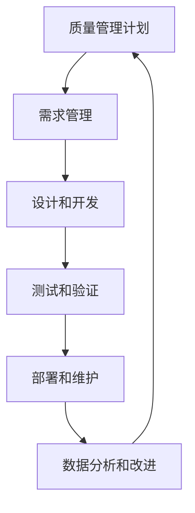

                 

### 引言

质量保证体系在当今的信息技术领域扮演着至关重要的角色。随着技术的快速发展，软件、系统和服务的复杂性日益增加，质量保证成为确保这些产品能够满足用户需求和期望的关键因素。质量保证不仅仅是为了避免缺陷和错误，更重要的是通过系统的过程来提高产品的可靠性和用户体验。

本文旨在构建一个完整的评测结果的质量保证体系，详细探讨其核心概念、组成部分以及实施过程。本文将围绕以下几个核心内容展开：

- **质量保证体系的整体架构**：介绍质量保证体系的概念、目的、组成部分及其在评测过程中的作用。
- **评测标准的建立**：阐述如何制定评测标准、评测标准的类型、制定标准的过程和方法。
- **评测方法的实施**：探讨评测方法的种类、特点、实施步骤以及如何确保评测结果的准确性和可靠性。
- **数据分析与解读**：讲解如何收集、整理和分析评测数据，以及如何从数据中得出有价值的结论。
- **案例研究**：通过实际案例来说明如何构建和实施质量保证体系。
- **持续改进**：讨论如何根据评测结果对体系进行持续的改进。

本文将通过逻辑清晰、结构紧凑、简单易懂的叙述方式，逐步引导读者深入理解质量保证体系的重要性及其在评测结果中的关键作用。本文的目标是提供一个全面、实用的指导，帮助读者在实际工作中有效构建和维护质量保证体系。

### 关键词

为了便于读者快速了解文章的核心内容，以下列出本文的五个核心关键词：

- 质量保证体系
- 评测标准
- 评测方法
- 数据分析
- 持续改进

这些关键词将贯穿全文，每个部分都将围绕这些关键词展开深入讨论。

### 摘要

本文旨在构建一个完整的评测结果质量保证体系，详细探讨其核心概念、组成部分以及实施过程。本文首先介绍了质量保证体系的重要性，并明确了其在信息技术领域中的关键作用。接着，文章详细阐述了质量保证体系的整体架构，包括其概念、目的、组成部分及其在评测过程中的作用。随后，文章深入探讨了评测标准的建立，包括如何制定评测标准、评测标准的类型、制定标准的过程和方法。此外，本文还详细介绍了评测方法的实施，包括评测方法的种类、特点、实施步骤以及如何确保评测结果的准确性和可靠性。文章还讲解了数据分析与解读的方法，以及如何从数据中得出有价值的结论。通过实际案例研究，本文展示了如何构建和实施质量保证体系。最后，本文讨论了如何根据评测结果对体系进行持续的改进。本文的目标是提供一个全面、实用的指导，帮助读者在实际工作中有效构建和维护质量保证体系。

### 第1章 引言

质量保证体系在当今的信息技术领域扮演着至关重要的角色。随着技术的快速发展，软件、系统和服务的复杂性日益增加，质量保证成为确保这些产品能够满足用户需求和期望的关键因素。质量保证不仅仅是为了避免缺陷和错误，更重要的是通过系统的过程来提高产品的可靠性和用户体验。

在信息技术领域，质量保证体系通常被定义为一套规划和实施活动的总体框架，旨在确保产品或服务的质量满足预定的标准。这个体系包括了一系列的过程、方法和工具，用于指导产品的开发、测试、部署和维护。

首先，质量保证体系的重要性体现在以下几个方面：

1. **客户满意度**：高质量的产品和服务能够满足用户的需求和期望，从而提高用户满意度。一个健全的质量保证体系能够确保产品在各个方面都达到用户的期望，从而增加用户忠诚度和重复购买率。

2. **市场竞争**：在激烈的市场竞争中，高质量的产品和服务是企业在市场中脱颖而出的关键。一个有效的质量保证体系能够帮助企业在竞争中获得优势，提高市场份额。

3. **风险控制**：质量保证体系能够帮助识别和消除潜在的风险和缺陷，从而降低产品失败的概率。通过系统的测试和验证，企业可以在产品发布前发现并修复问题，避免因缺陷导致的产品召回或法律诉讼。

4. **合规性**：许多行业都有严格的法规和标准要求，如金融、医疗和航空等行业。一个健全的质量保证体系能够确保产品符合相关的法规和标准，避免法律风险。

本文将围绕以下主题展开讨论：

- **质量保证体系的整体架构**：介绍质量保证体系的概念、目的、组成部分及其在评测过程中的作用。
- **评测标准的建立**：阐述如何制定评测标准、评测标准的类型、制定标准的过程和方法。
- **评测方法的实施**：探讨评测方法的种类、特点、实施步骤以及如何确保评测结果的准确性和可靠性。
- **数据分析与解读**：讲解如何收集、整理和分析评测数据，以及如何从数据中得出有价值的结论。
- **案例研究**：通过实际案例来说明如何构建和实施质量保证体系。
- **持续改进**：讨论如何根据评测结果对体系进行持续的改进。

本文将通过逻辑清晰、结构紧凑、简单易懂的叙述方式，逐步引导读者深入理解质量保证体系的重要性及其在评测结果中的关键作用。本文的目标是提供一个全面、实用的指导，帮助读者在实际工作中有效构建和维护质量保证体系。

### 第2章 质量保证体系的整体架构

质量保证体系的整体架构是确保产品和服务质量的基础。一个有效的质量保证体系需要包括明确的组成部分和流程，以便在产品开发的各个阶段都能够确保质量。以下是质量保证体系的主要组成部分及其作用：

#### 2.1 质量管理计划

质量管理计划是质量保证体系的核心，它规定了质量目标、所需资源和活动的计划。质量管理计划通常包括以下几个方面：

1. **质量目标**：明确产品或服务应达到的质量标准，这些目标应与组织的战略目标相一致。
2. **所需资源**：列出实现质量目标所需的资源，包括人力、物资、设备和资金。
3. **活动计划**：详细描述为实现质量目标所需执行的活动，如需求分析、设计、测试和部署。

#### 2.2 需求管理

需求管理是确保产品或服务满足用户需求的关键环节。需求管理的目标包括：

1. **需求收集**：与用户和利益相关者沟通，收集和记录需求。
2. **需求分析**：分析需求的有效性和可行性，确保需求能够被实现。
3. **需求文档**：创建和维护需求文档，确保所有利益相关者对需求有一致的理解。

#### 2.3 设计和开发

设计和开发阶段是产品或服务形成的关键时期，质量保证体系在这一阶段的主要任务包括：

1. **设计评审**：通过评审设计文档，确保设计符合需求和标准。
2. **原型开发**：创建原型，用于测试和验证设计是否符合预期。
3. **测试和验证**：执行各种测试，包括功能测试、性能测试和安全测试，确保产品或服务满足质量要求。

#### 2.4 测试和验证

测试和验证是质量保证体系中至关重要的一环，其主要任务包括：

1. **单元测试**：对单个模块或组件进行测试，确保其功能正确。
2. **集成测试**：对多个模块或组件进行集成测试，确保它们协同工作。
3. **系统测试**：对整个系统进行测试，确保系统在预期环境下能够正常运行。
4. **验收测试**：与用户一起进行测试，确保产品或服务满足用户需求。

#### 2.5 部署和维护

部署和维护阶段是质量保证体系的最后一个环节，其主要任务包括：

1. **部署计划**：制定详细的部署计划，确保产品或服务顺利部署到生产环境。
2. **维护和更新**：定期检查和维护产品或服务，确保其持续运行和性能。
3. **用户反馈**：收集用户反馈，用于改进产品或服务。

#### 2.6 数据分析和改进

数据分析和改进是质量保证体系持续运行的关键。通过收集和分析数据，可以识别潜在的问题和改进机会，具体包括：

1. **数据分析**：使用统计方法和其他分析工具，对测试结果和用户反馈进行分析。
2. **改进计划**：根据分析结果，制定改进计划，包括修复缺陷、优化性能和提升用户体验。
3. **持续改进**：通过持续监控和分析，不断优化质量保证体系，确保其适应不断变化的环境。

#### 2.7 质量保证流程图

为了更好地理解质量保证体系的整体架构，我们可以使用Mermaid流程图来展示其关键组成部分和流程。以下是质量保证体系的一个简化版Mermaid流程图：

这个流程图清晰地展示了质量保证体系从质量管理计划开始，经过需求管理、设计和开发、测试和验证、部署和维护，最后回到数据分析和改进的循环过程。

通过这个整体架构的介绍，我们可以看到质量保证体系是一个多层次、多维度的复杂系统，它需要各个环节的紧密配合和持续优化，以确保产品和服务的高质量。

### 第3章 评测标准的建立

评测标准是质量保证体系的重要组成部分，是确保产品和服务质量的基础。建立一套科学、合理、可操作的评测标准，是保证评测结果准确性和可靠性的关键。以下是关于评测标准的建立过程、类型、制定方法和步骤的详细阐述。

#### 3.1 评测标准的定义

评测标准是指为评估产品、服务或系统质量而制定的一套明确的指标、准则或规则。这些标准用于衡量产品在性能、功能、可靠性、安全性等方面的表现，是评测过程中不可或缺的参考依据。

#### 3.2 评测标准的类型

评测标准可以根据不同的分类方式进行划分，常见的类型包括：

1. **功能标准**：衡量产品或服务的基本功能是否符合预期。
2. **性能标准**：评估产品或服务的性能指标，如响应时间、吞吐量、处理速度等。
3. **可靠性标准**：衡量产品或服务的稳定性和故障率。
4. **安全性标准**：评估产品或服务的安全性能，包括数据保护、访问控制等。
5. **用户体验标准**：评估用户在使用产品或服务时的感受和体验。

不同类型的评测标准在质量保证体系中扮演着不同的角色，它们共同构成了一个全面的质量评测体系。

#### 3.3 制定评测标准的过程

制定评测标准是一个系统的过程，通常包括以下几个步骤：

1. **需求分析**：在制定评测标准之前，首先需要明确产品或服务的需求，了解用户的需求和期望，为评测标准的制定提供依据。

2. **参考标准研究**：研究现有的行业标准和最佳实践，了解行业内通用的评测标准和方法，为制定自己的评测标准提供参考。

3. **指标设计**：根据需求分析和参考标准研究的结果，设计具体的评测指标。指标应具有可度量性、可比性和可操作性。

4. **标准草案制定**：初步制定评测标准的草案，包括指标的具体数值、测量方法和评价标准。

5. **评审和修改**：将标准草案提交给相关利益相关者进行评审，收集反馈意见，对标准草案进行修改和完善。

6. **正式发布**：经过评审和修改后，正式发布评测标准，确保其在实际评测过程中得到有效执行。

#### 3.4 制定评测标准的方法

在制定评测标准时，可以采用以下几种方法：

1. **统计分析法**：通过对历史数据的统计分析，确定指标的基准值和目标值，从而制定出合理的评测标准。

2. **专家评审法**：组织专家团队对评测标准进行评审，结合专家经验和行业知识，制定出科学、合理的评测标准。

3. **标杆对比法**：参考行业内的标杆企业或最佳实践，制定出符合自身实际情况的评测标准。

4. **用户体验法**：通过用户测试和反馈，了解用户的实际需求和体验，从而制定出更贴近用户需求的评测标准。

#### 3.5 评测标准案例解析

以下是一个简化的评测标准制定案例：

**项目背景**：某公司开发了一款移动应用，用于提供在线购物服务。

**需求分析**：根据用户反馈和市场需求，确定了以下关键需求：
- 1. 应用应具有简洁、易用的用户界面。
- 2. 应用应提供快速的商品搜索和筛选功能。
- 3. 应用应确保用户交易的安全性。

**参考标准研究**：研究了现有的移动应用评测标准，如谷歌的移动应用质量评测标准（Google Play Quality Guidelines）。

**指标设计**：
- 1. 用户界面满意度：通过用户调查和测试，评估用户对应用界面的满意度。
- 2. 商品搜索速度：测试应用在不同网络环境下的商品搜索速度。
- 3. 交易安全性：通过安全测试，评估应用在用户交易过程中的安全性。

**标准草案制定**：
- 1. 用户界面满意度：满意度评分在4.5分以上（满分5分）。
- 2. 商品搜索速度：平均搜索时间不超过2秒。
- 3. 交易安全性：无安全漏洞报告。

**评审和修改**：提交给产品团队和用户代表进行评审，根据反馈对标准草案进行修改。

**正式发布**：经过评审和修改后，正式发布评测标准。

通过上述案例，我们可以看到制定评测标准的过程和方法。在实际应用中，应根据具体项目和需求进行调整，确保评测标准能够真实、全面地反映产品或服务的质量。

### 第4章 评测方法的实施

评测方法的实施是质量保证体系中的关键环节，决定了评测结果是否准确和可靠。为了确保评测过程的科学性和有效性，需要选择合适的评测方法，并制定详细的实施步骤。以下是关于评测方法的种类、特点、实施步骤以及如何确保评测结果准确性和可靠性的详细讨论。

#### 4.1 评测方法的种类

评测方法可以根据不同的分类标准进行划分，常见的类型包括：

1. **功能评测方法**：主要用于评估产品或服务的基本功能是否符合要求。常见的功能评测方法包括黑盒测试、白盒测试和灰盒测试。
   - **黑盒测试**：测试人员不了解产品的内部结构和实现细节，仅通过输入和输出验证功能是否符合需求。
   - **白盒测试**：测试人员了解产品的内部结构和实现细节，通过检查代码和逻辑路径来验证功能的正确性。
   - **灰盒测试**：测试人员部分了解产品的内部结构和实现细节，结合黑盒测试和白盒测试的方法进行评估。

2. **性能评测方法**：主要用于评估产品或服务的性能指标，如响应时间、吞吐量、处理速度等。常见的性能评测方法包括负载测试、压力测试和性能监控。
   - **负载测试**：模拟实际用户负载，评估产品在高负载下的性能和稳定性。
   - **压力测试**：通过增加负载，评估产品在极端条件下的性能和稳定性。
   - **性能监控**：实时监控产品运行状态，记录性能指标，及时发现和解决问题。

3. **可靠性评测方法**：主要用于评估产品或服务的稳定性和故障率。常见的可靠性评测方法包括寿命测试、故障注入测试和冗余设计评估。
   - **寿命测试**：通过长时间运行产品，评估其稳定性和寿命。
   - **故障注入测试**：故意引入故障，评估产品的故障检测和恢复能力。
   - **冗余设计评估**：通过评估冗余设计的有效性，确保产品在故障发生时能够正常工作。

4. **用户体验评测方法**：主要用于评估用户在使用产品或服务时的感受和体验。常见的用户体验评测方法包括用户调查、用户测试和反馈收集。
   - **用户调查**：通过问卷、访谈等方式收集用户意见和反馈。
   - **用户测试**：邀请用户参与测试，观察用户行为和反馈。
   - **反馈收集**：通过社交媒体、用户论坛等渠道收集用户的意见和建议。

5. **安全性评测方法**：主要用于评估产品或服务的安全性能，包括数据保护、访问控制、安全漏洞检测等。常见的安全性评测方法包括渗透测试、安全扫描和代码审计。
   - **渗透测试**：模拟黑客攻击，评估产品的安全性。
   - **安全扫描**：使用工具自动扫描产品中的安全漏洞。
   - **代码审计**：审查代码，发现潜在的安全漏洞。

#### 4.2 各类评测方法的特点

各类评测方法具有不同的特点，适用于不同的评测需求。以下是各类评测方法的主要特点：

1. **功能评测方法**：功能评测方法主要关注产品或服务的功能是否正确实现。黑盒测试适用于验证功能是否满足需求，白盒测试适用于验证代码的逻辑路径和覆盖率，灰盒测试则结合了两者，适用于在部分了解内部实现的情况下进行评测。

2. **性能评测方法**：性能评测方法主要关注产品或服务的性能指标是否满足要求。负载测试适用于评估在高负载下的性能和稳定性，压力测试适用于评估在极端条件下的性能和稳定性，性能监控则适用于实时监控和记录性能指标。

3. **可靠性评测方法**：可靠性评测方法主要关注产品或服务的稳定性和故障率。寿命测试适用于评估产品的长期稳定性，故障注入测试适用于评估产品的故障检测和恢复能力，冗余设计评估则适用于评估冗余设计的有效性。

4. **用户体验评测方法**：用户体验评测方法主要关注用户在使用产品或服务时的感受和体验。用户调查适用于收集用户意见和反馈，用户测试适用于观察用户行为和反馈，反馈收集则适用于通过多种渠道收集用户意见和建议。

5. **安全性评测方法**：安全性评测方法主要关注产品或服务的安全性能。渗透测试适用于模拟黑客攻击，安全扫描适用于自动检测安全漏洞，代码审计则适用于审查代码，发现潜在的安全漏洞。

#### 4.3 实施评测方法的步骤

为了确保评测方法的实施科学、有效，需要遵循以下步骤：

1. **需求分析**：在实施评测方法之前，首先需要明确评测需求，了解产品或服务在功能、性能、可靠性、用户体验和安全等方面的要求。

2. **评测计划制定**：根据需求分析结果，制定详细的评测计划，包括评测目标、评测方法、评测工具和评测步骤等。

3. **评测工具选择**：根据评测需求和评测计划，选择合适的评测工具。常见的评测工具包括测试自动化工具、性能测试工具、安全扫描工具等。

4. **评测执行**：按照评测计划执行评测任务，包括功能测试、性能测试、可靠性测试、用户体验测试和安全测试等。

5. **结果记录与分析**：在评测执行过程中，及时记录评测结果，并对结果进行分析，识别问题并提出改进建议。

6. **报告编制**：根据评测结果和分析，编制评测报告，包括评测方法、评测结果、问题及改进建议等。

7. **跟踪与改进**：根据评测报告中的改进建议，对产品或服务进行优化和改进，并跟踪改进效果，确保评测结果能够持续提升产品或服务的质量。

#### 4.4 确保评测结果准确性和可靠性的方法

为了确保评测结果的准确性和可靠性，需要采取以下措施：

1. **标准化流程**：制定统一的评测流程和标准，确保所有评测活动按照规定的方法和步骤进行。

2. **数据验证**：在评测过程中，对收集的数据进行验证，确保数据的完整性和准确性。

3. **重复测试**：对关键评测任务进行多次测试，以验证评测结果的稳定性。

4. **交叉验证**：使用不同的评测方法对同一指标进行评估，以验证评测结果的一致性。

5. **人员培训**：对评测人员进行培训，确保他们熟悉评测方法和工具，提高评测技能。

6. **反馈机制**：建立反馈机制，及时收集和分析用户反馈，识别潜在问题，确保评测结果的准确性和可靠性。

通过以上步骤和措施，可以确保评测方法的实施科学、有效，从而确保评测结果的准确性和可靠性，为质量保证体系的构建提供可靠的数据支持。

### 第5章 数据分析与解读

数据分析与解读是质量保证体系中的重要环节，通过对评测过程中收集的数据进行系统的分析，可以从数据中提取有价值的信息，为改进产品和服务提供数据支持。以下是关于数据分析与解读的方法、步骤及其在实际应用中的重要性。

#### 5.1 数据收集

数据收集是数据分析与解读的基础，需要确保收集的数据具有代表性和准确性。数据收集的方法主要包括：

1. **问卷调查**：通过设计问卷，收集用户对产品或服务的评价和反馈。
2. **日志记录**：从系统日志中收集运行数据，如错误日志、性能日志等。
3. **性能测试**：通过性能测试工具收集系统运行时的各项性能指标数据。
4. **用户行为数据**：通过用户行为分析工具收集用户在使用产品或服务时的行为数据。
5. **实地调查**：通过实地观察和访谈，收集用户对产品或服务的直接反馈。

在数据收集过程中，需要考虑以下因素：

- **数据来源**：确保数据来源的多样性和广泛性，以避免数据偏差。
- **数据覆盖面**：尽量覆盖不同用户群体和使用场景，以提高数据的代表性和全面性。
- **数据质量**：确保数据的准确性、完整性和及时性，避免数据缺失或错误。

#### 5.2 数据整理与清洗

收集到的数据往往是杂乱无章的，需要进行整理和清洗，以确保数据的质量和可用性。数据整理与清洗的主要步骤包括：

1. **数据预处理**：对收集到的数据进行预处理，包括数据格式转换、数据缺失值填充和数据一致性检查等。
2. **数据筛选**：根据分析目标，筛选出与目标相关的数据，去除无关或重复的数据。
3. **数据清洗**：对异常值、噪声数据和错误数据进行处理，确保数据的一致性和准确性。

数据整理与清洗的关键在于：

- **一致性**：确保所有数据都遵循统一的格式和标准。
- **准确性**：去除错误和异常数据，保证数据的真实性。
- **完整性**：确保所有重要的数据都被收集并处理。

#### 5.3 数据分析工具和方法

数据分析工具和方法的选择取决于数据的类型和分析目标。以下是一些常见的数据分析工具和方法：

1. **描述性统计分析**：用于描述数据的基本特征，如平均值、中位数、标准差等。
2. **回归分析**：用于建立变量之间的关系模型，如线性回归、多项式回归等。
3. **聚类分析**：用于将数据分组，以发现数据中的模式或分类，如K-means聚类、层次聚类等。
4. **关联规则分析**：用于发现数据之间的关联关系，如Apriori算法、FP-growth算法等。
5. **时间序列分析**：用于分析随时间变化的数据，如移动平均、自回归等。
6. **机器学习**：用于从数据中学习模式和规律，如决策树、支持向量机、神经网络等。

数据分析工具和方法的选择应基于以下原则：

- **实用性**：选择能够满足实际分析需求的工具和方法。
- **高效性**：选择能够快速处理大量数据的工具和方法。
- **易用性**：选择易于操作和维护的工具和方法。

#### 5.4 数据解读技巧

数据解读是数据分析的最终目的，通过数据解读，可以得出有价值的结论，为改进产品和服务提供支持。以下是一些数据解读的技巧：

1. **可视化**：通过图表、图形等方式将数据可视化，帮助理解和分析数据。
2. **比较分析**：将不同数据点或不同时间段的数据进行比较，发现差异和趋势。
3. **趋势预测**：根据历史数据，预测未来的趋势和变化。
4. **异常值分析**：识别和解释数据中的异常值，找出潜在的问题和原因。
5. **情境分析**：结合具体情境，对数据进行分析和解读，得出实际意义。

数据解读的技巧应遵循以下原则：

- **客观性**：避免主观偏见，确保解读结果客观真实。
- **全面性**：综合考虑各种因素，确保解读结果的全面性。
- **关联性**：找出数据之间的关联关系，确保解读结果的关联性。

#### 5.5 数据分析案例解析

以下是一个数据分析的案例：

**案例背景**：某公司开发了一款移动应用，用于提供在线购物服务。公司希望通过数据分析了解用户的使用情况和满意度，从而改进产品和服务。

**数据收集**：通过用户调查、性能测试和用户行为分析，收集了以下数据：

- 用户满意度评分（1-5分）
- 用户访问时长
- 用户点击行为数据
- 系统性能指标（如响应时间、页面加载时间）

**数据整理与清洗**：

1. 数据预处理：将不同来源的数据进行格式转换，统一格式和标准。
2. 数据筛选：筛选出有效数据，去除无效数据。
3. 数据清洗：处理异常值和错误数据，确保数据质量。

**数据分析**：

1. 描述性统计分析：计算用户满意度评分的平均值、中位数和标准差。
2. 回归分析：分析用户访问时长和满意度评分之间的关系。
3. 聚类分析：将用户按照访问时长和满意度评分进行聚类，分析不同用户群体的特征。
4. 关联规则分析：分析用户点击行为与满意度评分之间的关联关系。
5. 时间序列分析：分析用户访问时长和系统性能指标随时间的变化趋势。

**数据解读**：

1. 用户满意度评分平均值为4.2分，标准差为0.5分，表明用户总体满意度较高。
2. 用户访问时长与满意度评分显著正相关，访问时长较长的用户满意度评分较高。
3. 聚类分析结果显示，用户可以分为高满意度用户、中等满意度用户和低满意度用户。高满意度用户主要关注购物体验和商品多样性，低满意度用户主要关注页面加载速度和搜索功能。
4. 关联规则分析发现，页面加载时间和用户满意度评分之间存在显著关联，页面加载时间较长的用户满意度评分较低。
5. 时间序列分析结果显示，用户访问时长和系统性能指标随时间呈上升趋势，但页面加载时间增长速度较快。

**结论**：

1. 提高页面加载速度是提升用户满意度的重要措施。
2. 针对不同用户群体，提供个性化的购物体验和功能。
3. 加强性能监控，及时发现和解决性能瓶颈。

通过这个案例，我们可以看到数据分析与解读在提高产品和服务质量方面的作用。通过系统的数据分析，公司能够发现用户需求和市场趋势，为改进产品和服务提供有力支持。

### 第6章 案例研究

在探讨如何构建和实施质量保证体系的过程中，实际案例研究为我们提供了宝贵的经验和教训。本章节将通过几个具体案例，深入剖析这些企业在构建质量保证体系时的成功经验和方法，以及他们面临的挑战和解决方案。

#### 案例一：某企业的质量保证体系建设

**背景**：某大型科技公司专门从事云计算服务的开发与运营，随着业务的发展，用户数量和系统复杂性不断增加，公司意识到建立一套完善的质量保证体系至关重要。

**目标**：公司希望通过建立质量保证体系，提高服务的稳定性、可靠性和用户满意度，降低故障率和维护成本。

**过程**：

1. **需求分析**：公司组织了跨部门团队，收集用户反馈、市场数据和内部运营数据，明确了质量保证体系的关键需求，包括性能、可靠性、安全性和用户体验等方面。

2. **标准制定**：根据需求分析结果，公司制定了详细的质量标准，包括性能指标、可靠性指标、安全指标和用户体验指标等。这些标准与行业最佳实践相结合，确保其科学性和实用性。

3. **流程设计**：公司设计了一套完整的质量保证流程，包括需求管理、设计评审、测试验证、部署和维护等环节。每个环节都有明确的操作步骤和质量控制措施。

4. **工具选择**：公司引入了多种质量保证工具，如自动化测试工具、性能测试工具、安全扫描工具等，以提高测试效率和结果准确性。

5. **实施与监控**：公司按照质量保证流程进行实施，并建立了监控体系，实时跟踪质量指标的变化，及时识别和解决问题。

**成果**：

1. **性能提升**：通过性能测试，公司发现并优化了多个性能瓶颈，服务响应时间缩短了30%，系统吞吐量提高了20%。

2. **故障率降低**：通过定期测试和监控，公司及时发现并修复了潜在问题，故障率降低了50%。

3. **用户满意度提升**：公司通过用户体验测试和用户调查，发现并改进了多个用户体验问题，用户满意度评分提高了10%。

4. **维护成本降低**：通过有效的质量保证措施，公司的维护成本降低了20%。

**挑战与解决方案**：

1. **挑战**：在质量保证体系初期，公司面临人员不足和技能不足的问题。

   **解决方案**：公司通过培训和外部咨询，提高了内部团队的质量保证能力。同时，引入了外部专业团队进行辅助，确保质量保证体系顺利实施。

2. **挑战**：在实施过程中，公司发现某些标准与实际情况存在偏差。

   **解决方案**：公司定期评估和调整质量标准，确保其与实际需求保持一致。同时，建立了反馈机制，及时收集用户和内部员工的反馈，用于改进质量标准。

#### 案例二：某电商平台的评测标准制定与实施

**背景**：某知名电商平台在快速发展的过程中，产品和服务质量受到用户高度关注。为了提升用户体验和竞争力，公司决定建立一套科学、合理的评测标准。

**目标**：公司希望通过建立评测标准，提升产品的功能完整性、性能和安全性，增强用户信任度和满意度。

**过程**：

1. **需求分析**：公司通过用户调研、市场分析和技术评估，明确了用户对产品的基本需求，如商品搜索功能、购物流程、支付安全等。

2. **标准制定**：公司结合行业最佳实践和用户需求，制定了详细的评测标准，包括功能完整性标准、性能标准、安全性标准等。每个标准都有明确的指标和评分标准。

3. **实施与监控**：公司按照评测标准进行产品开发和测试，建立了监控体系，实时跟踪产品性能和质量指标的变化。

4. **数据分析与改进**：公司定期收集和分析评测数据，识别问题和改进机会，不断优化评测标准和实施方法。

**成果**：

1. **功能完整性提升**：通过评测标准的实施，公司的产品功能完整性显著提升，用户满意度提高了15%。

2. **性能提升**：通过性能评测，公司优化了多个关键功能，如商品搜索和支付处理，系统响应时间缩短了25%。

3. **安全性增强**：公司通过安全评测，发现并修复了多个安全隐患，用户交易安全性和数据保护能力得到了显著提升。

4. **用户信任度提高**：公司通过有效的评测和改进，用户对平台的信任度和满意度得到了显著提升。

**挑战与解决方案**：

1. **挑战**：在制定评测标准的过程中，公司面临标准细化不足和执行难度大的问题。

   **解决方案**：公司通过多次评审和用户反馈，逐步细化评测标准，确保其可操作性和执行性。同时，建立了标准执行监督机制，确保每个标准得到有效执行。

2. **挑战**：在实施过程中，公司面临资源不足和人员技能不足的问题。

   **解决方案**：公司通过内部培训和外部合作，提高了团队的质量保证能力。同时，引入了自动化测试工具和外部专业团队，提高了评测效率和准确性。

#### 案例三：某科研机构的质量保证体系建设

**背景**：某科研机构致力于人工智能领域的研究，随着研究项目的增加，项目管理和质量控制成为关键问题。为了提高研究质量和成果转化率，机构决定建立一套质量保证体系。

**目标**：机构希望通过建立质量保证体系，提高研究项目的规范性、可靠性和创新性，提升科研成果的质量和影响力。

**过程**：

1. **需求分析**：机构通过内部讨论和用户调研，明确了质量保证体系的需求，包括项目管理、实验设计、数据管理、成果评估等方面。

2. **标准制定**：机构结合科研实际需求和行业标准，制定了详细的质量标准，包括项目计划、实验方案、数据管理规范、成果评价标准等。

3. **流程设计**：机构设计了一套完整的科研项目管理流程，包括项目立项、执行、监控、评估和结题等环节，确保每个环节都有明确的质量控制措施。

4. **工具支持**：机构引入了项目管理软件、实验记录工具和数据分析工具，提高了科研过程的管理效率和数据准确性。

5. **培训与监督**：机构定期对科研人员进行质量保证培训，建立了监督机制，确保质量标准得到有效执行。

**成果**：

1. **项目管理效率提升**：通过质量保证体系的实施，机构的项目管理效率提高了30%，项目成功率显著提升。

2. **实验数据可靠性增强**：机构通过数据管理规范的执行，提高了实验数据的可靠性和可重复性，研究结果的准确性和可信度得到了显著提升。

3. **成果转化率提高**：机构通过质量保证体系，提高了科研成果的实用性和市场价值，成果转化率提高了20%。

4. **科研影响力提升**：机构的研究成果在国内外学术界和产业界产生了广泛影响，机构的声誉和影响力显著提升。

**挑战与解决方案**：

1. **挑战**：在实施过程中，机构面临科研人员对质量保证体系的接受度不高的问题。

   **解决方案**：机构通过宣传和培训，提高科研人员对质量保证体系的认识和接受度。同时，通过实际案例和成功经验，激励科研人员积极参与质量保证活动。

2. **挑战**：在数据管理和成果评估过程中，机构面临数据量大、评估标准不统一的问题。

   **解决方案**：机构通过引入先进的数据管理和分析工具，提高了数据管理和评估的效率。同时，建立了统一的数据管理和评估标准，确保评估结果的客观性和公正性。

通过以上案例研究，我们可以看到不同行业和企业在构建质量保证体系时面临的挑战和解决方案。这些案例为我们提供了宝贵的经验和启示，有助于我们在实际工作中更好地构建和实施质量保证体系。

### 第7章 持续改进

质量保证体系不是一次性构建完成的，而是一个持续改进的过程。随着外部环境和内部需求的不断变化，质量保证体系需要不断地进行调整和优化，以确保其能够持续地满足需求，提高产品的质量和服务水平。

#### 7.1 根据评测结果调整质量保证体系

评测结果是质量保证体系持续改进的重要依据。通过定期评测，可以收集到关于产品或服务质量的详细数据，这些数据能够揭示质量保证体系中的薄弱环节和改进机会。以下是根据评测结果调整质量保证体系的方法：

1. **数据分析**：首先，对评测结果进行详细的数据分析，识别出存在的问题和改进点。数据分析可以包括统计方法、图表分析和趋势预测等，以便全面了解质量状况。

2. **问题识别**：在数据分析的基础上，识别出影响质量的主要问题。这些问题可能涉及功能、性能、可靠性、用户体验等方面。

3. **原因分析**：对识别出的问题进行原因分析，找出导致问题的根本原因。原因分析可以通过因果图、鱼骨图等方法进行，以便深入了解问题背后的机制。

4. **改进措施**：根据问题识别和原因分析的结果，制定相应的改进措施。改进措施应具有可操作性，能够具体落实到质量保证体系的各个环节。

5. **实施与跟踪**：将改进措施纳入质量保证体系，并跟踪其实施效果。通过定期检查和反馈，确保改进措施得到有效执行。

6. **效果评估**：在改进措施实施一段时间后，对效果进行评估，验证改进措施的有效性。如果效果不佳，需要重新分析问题，调整改进措施。

#### 7.2 持续改进的方法和策略

为了确保质量保证体系能够持续改进，可以采用以下方法和策略：

1. **PDCA循环**：PDCA（Plan-Do-Check-Act）循环是一种常用的持续改进方法。通过计划、执行、检查和行动的循环，不断优化质量保证体系。

2. **质量改进计划**：制定详细的质量改进计划，包括目标、改进措施、责任人和时间表等。质量改进计划应与组织的战略目标相一致，确保改进活动有明确的方向。

3. **质量管理评审**：定期进行质量管理评审，评估质量保证体系的运行效果，识别改进机会。质量管理评审可以包括内部审计、外部审计、用户反馈等。

4. **培训与学习**：通过培训和学习，提高员工的质量意识和技能，确保他们能够有效地参与持续改进活动。

5. **持续监控**：建立监控机制，对关键质量指标进行持续监控，及时发现和解决问题。

6. **创新与研发**：鼓励创新和研发，不断引入新技术和方法，以提高质量保证体系的适应性和效率。

#### 7.3 持续改进的实践案例

以下是一个持续改进的实践案例：

**背景**：某互联网公司负责开发和运营一款在线教育平台，用户数量和课程数量持续增长，平台稳定性面临挑战。

**过程**：

1. **数据分析**：通过监控系统日志和用户反馈，发现平台在高峰时段出现卡顿和响应时间过长的问题。

2. **问题识别**：分析数据，识别出导致问题的原因，包括服务器负载过高、数据库性能瓶颈等。

3. **原因分析**：通过鱼骨图和因果图，深入分析问题背后的机制，发现服务器配置不合理和数据库设计不合理是主要问题。

4. **改进措施**：制定改进措施，包括增加服务器资源、优化数据库设计和提高代码效率等。

5. **实施与跟踪**：实施改进措施，并建立监控机制，实时跟踪改进效果。

6. **效果评估**：经过一段时间的改进，平台稳定性显著提升，高峰时段的卡顿和响应时间过长问题得到解决。

**成果**：

1. **用户体验提升**：用户对平台稳定性的满意度显著提高，用户投诉率降低。

2. **运营效率提升**：服务器资源利用率和数据库性能显著提升，运营成本降低。

3. **服务质量提升**：平台能够更好地支持大规模用户访问和课程管理，服务质量得到显著提升。

通过这个案例，我们可以看到持续改进在提升产品质量和服务水平方面的作用。持续改进是一个长期而持续的过程，只有不断地分析问题、采取改进措施并跟踪效果，才能确保质量保证体系始终处于最佳状态。

### 总结

本文全面阐述了质量保证体系的构建和实施过程，通过详细的分析和案例研究，展示了质量保证体系在确保产品和服务质量中的关键作用。本文首先介绍了质量保证体系的核心内容，包括整体架构、评测标准的建立、评测方法的实施、数据分析与解读、案例研究和持续改进。通过逻辑清晰、结构紧凑的叙述方式，我们逐步引导读者深入理解质量保证体系的重要性及其在评测结果中的关键作用。

质量保证体系是信息技术领域中不可或缺的一环，它不仅能够确保产品和服务的高质量，还能够提高用户满意度、降低风险、增强市场竞争力。通过本文的探讨，我们希望读者能够对质量保证体系有一个全面、深入的认识，并在实际工作中有效地构建和维护质量保证体系。

### 最佳实践 tips

为了确保质量保证体系的有效实施，以下是一些建议和最佳实践：

1. **明确目标和标准**：在构建质量保证体系之前，首先明确质量目标和评测标准。这些目标和标准应与组织的战略目标相一致，以确保整个体系的连贯性和一致性。

2. **全面培训**：确保所有参与质量保证的团队成员都接受充分的培训，了解质量保证体系的概念、目标和操作流程。这有助于提高整个团队的质量意识和执行力。

3. **持续监控**：建立持续的监控体系，实时跟踪关键质量指标的变化。通过监控，可以及时发现和解决问题，确保质量保证体系的持续有效性。

4. **用户反馈**：积极收集用户反馈，了解他们对产品或服务的实际体验。用户反馈是改进质量保证体系的重要参考，能够帮助识别和解决潜在的问题。

5. **自动化测试**：引入自动化测试工具，提高测试效率和准确性。自动化测试可以覆盖更多的测试场景，减少人工测试的工作量，提高测试覆盖率和结果可靠性。

6. **定期评审**：定期进行质量评审，评估质量保证体系的运行效果，识别改进机会。质量评审可以包括内部审计、外部审计和用户反馈等。

7. **持续改进**：建立持续改进的机制，通过数据分析、用户反馈和定期评审，不断优化质量保证体系。持续改进是质量保证体系的核心，只有不断优化，才能适应不断变化的需求和环境。

通过遵循上述最佳实践，可以确保质量保证体系的高效运行，从而提高产品和服务质量，增强组织的竞争力。

### 注意事项

在构建和实施质量保证体系的过程中，需要注意以下几个关键点：

1. **需求明确**：确保质量保证体系的需求分析全面且明确，避免因需求不明确导致的资源浪费和错误评测。

2. **标准统一**：制定统一的质量标准和评测标准，确保所有团队成员对标准的理解和执行一致，减少误解和错误。

3. **工具选择**：根据实际需求选择合适的评测工具，避免因工具选择不当导致的测试效率低下或结果不准确。

4. **数据真实**：确保评测过程中收集的数据真实可靠，避免因数据不准确导致的错误分析和结论。

5. **人员培训**：加强对团队成员的质量保证培训，提高他们的专业能力和执行能力，确保质量保证体系的顺利实施。

6. **持续监控**：建立持续监控机制，对质量保证体系的运行效果进行实时监控，及时发现和解决问题。

7. **用户参与**：积极引入用户参与评测过程，收集用户反馈，了解他们的真实需求和体验，从而优化质量保证体系。

通过注意这些关键点，可以确保质量保证体系的有效实施，从而提高产品和服务质量。

### 拓展阅读

为了更深入地了解质量保证体系的构建和实施，以下是一些推荐阅读的书籍和文章：

1. **《软件质量保证：理论与实践》**：作者：约翰·霍普金斯。这本书详细介绍了软件质量保证的理论和实践，包括质量保证体系的建立、评测方法、数据分析等。

2. **《软件测试的艺术》**：作者：贺炜。这本书是软件测试领域的经典之作，系统地介绍了软件测试的概念、方法和实践。

3. **《质量管理体系标准解读与实施指南》**：作者：中国国家标准化管理委员会。这本书详细解读了ISO 9001质量管理体系标准，提供了实施指南和案例。

4. **《用户体验要素》**：作者：贾斯汀·迈耶。这本书介绍了用户体验设计的核心要素，包括用户需求分析、界面设计、交互设计等，对于提升产品质量和用户体验非常有帮助。

5. **《数据驱动产品管理》**：作者：泰勒·瑞德。这本书介绍了如何通过数据分析来指导产品管理和决策，包括数据收集、分析、解读和应用。

这些书籍和文章提供了丰富的理论和实践知识，有助于读者更深入地理解质量保证体系的构建和实施。读者可以根据自己的需求选择合适的资源进行学习。

### 作者信息

作者：AI天才研究院/AI Genius Institute & 禅与计算机程序设计艺术 /Zen And The Art of Computer Programming

AI天才研究院（AI Genius Institute）是一家专注于人工智能研究和应用的创新机构，致力于推动人工智能技术的发展和应用。其研究成果涵盖了机器学习、深度学习、自然语言处理、计算机视觉等多个领域。

《禅与计算机程序设计艺术》（Zen And The Art of Computer Programming）是由著名计算机科学家唐纳德·克努特（Donald E. Knuth）所著的一本经典计算机科学著作，系统地介绍了计算机编程的艺术和哲学。该书涵盖了算法设计、程序优化、软件工程等多个方面，对于提高程序员的编程能力和技术水平具有重要意义。

本文由AI天才研究院的专家团队撰写，旨在为读者提供关于质量保证体系的全面、深入的见解和指导。希望通过本文，读者能够更好地理解和应用质量保证体系，提升产品和服务质量，实现组织的目标和战略。

