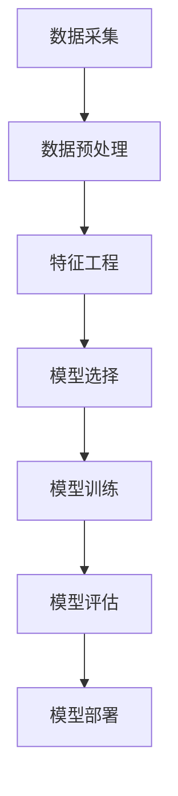
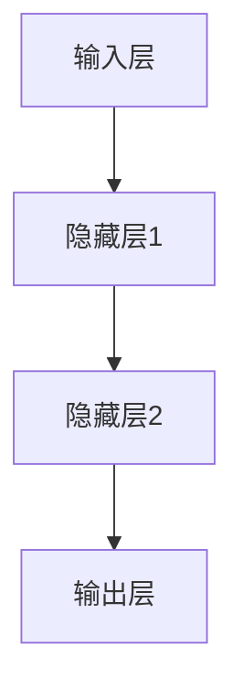

                 

### 文章标题：构建评测结果的预测模型

### 关键词：预测模型，评测结果，机器学习，深度学习，算法，数学模型，项目实战

### 摘要：

本文旨在探讨构建评测结果预测模型的方法和过程。我们将从核心概念入手，逐步深入到算法原理、数学模型以及实际项目实战。通过对这些内容的详细剖析，读者将了解如何利用机器学习和深度学习技术，构建高效、准确的评测结果预测模型。文章将提供丰富的实例和代码，帮助读者更好地理解和应用这些技术。最终，我们将总结最佳实践，并提出未来研究的方向。

## 第一部分：基础概念与预备知识

### 第1章 核心概念与联系

在构建评测结果预测模型之前，我们需要了解一些基础概念。这一章节将介绍机器学习、深度学习的基本概念，以及它们在评测结果预测中的应用。

#### 1.1 机器学习与深度学习概述

**1.1.1 机器学习的定义与历史**

机器学习是人工智能的一个重要分支，它使计算机系统能够从数据中学习并做出预测或决策，而无需显式地编写规则。机器学习的历史可以追溯到20世纪50年代，其发展经历了多次起伏，但近年来，随着计算能力的提升和海量数据的涌现，机器学习迎来了新的春天。

**1.1.2 深度学习的崛起与优势**

深度学习是机器学习的一个子领域，它通过模仿人脑的神经网络结构，对数据进行多层次的特征提取和学习。深度学习在图像识别、语音识别、自然语言处理等领域取得了显著成果，其崛起得益于计算资源的丰富和大数据的驱动。

**1.1.3 评测结果预测的机器学习应用**

评测结果预测是机器学习的一个重要应用场景。在工业、教育、医疗等多个领域，需要对大量数据进行评估，预测结果能够提高决策的准确性和效率。

#### 1.2 评测结果的预测需求与挑战

**1.2.1 评测结果预测的目标**

评测结果预测的目标是建立模型，根据历史数据预测新的评测结果。这有助于优化资源分配、提高业务效率。

**1.2.2 数据质量的影响**

数据质量对预测模型的准确性有直接影响。不完整、错误或噪声数据都会对模型性能产生负面影响。

**1.2.3 模型选择与调优的挑战**

选择合适的模型和进行模型调优是预测任务中的一大挑战。不同的任务和数据集可能需要不同的模型和参数设置。

#### 1.3 Mermaid流程图：预测模型的架构与流程

为了更直观地展示预测模型的架构和流程，我们使用Mermaid流程图进行描述。



### 第2章 数学模型与公式

预测模型的核心是数学模型。这一章节将介绍模型中使用的数学公式和优化算法，并使用LaTeX格式书写。

#### 2.1 损失函数的数学模型

损失函数用于衡量预测结果与真实结果之间的差距。常用的损失函数有均方误差（MSE）和交叉熵损失。

$$
L(y, \hat{y}) = \frac{1}{2}\sum_{i=1}^{n}(y_i - \hat{y}_i)^2
$$

$$
L(y, \hat{y}) = -\sum_{i=1}^{n}y_i\log(\hat{y}_i)
$$

#### 2.2 优化算法的数学原理

优化算法用于最小化损失函数，常用的优化算法有梯度下降和随机梯度下降。

$$
\theta_{t+1} = \theta_{t} - \alpha \nabla_{\theta}J(\theta)
$$

其中，$\theta$是模型参数，$J(\theta)$是损失函数，$\alpha$是学习率。

#### 2.3 数学模型详细讲解与举例

我们将通过一个简单的线性回归模型，来详细讲解数学模型的应用。

假设我们要预测房价，输入特征为房屋面积，输出为目标房价。线性回归模型可以表示为：

$$
\hat{y} = \theta_0 + \theta_1x
$$

其中，$\theta_0$是截距，$\theta_1$是斜率。

我们可以使用最小二乘法来估计$\theta_0$和$\theta_1$：

$$
\theta_0 = \frac{\sum_{i=1}^{n}(y_i - \theta_1x_i)}{n}
$$

$$
\theta_1 = \frac{\sum_{i=1}^{n}(x_i - \bar{x})(y_i - \bar{y})}{\sum_{i=1}^{n}(x_i - \bar{x})^2}
$$

## 第二部分：核心算法原理

### 第3章 决策树与随机森林

决策树和随机森林是常用的机器学习算法，适用于分类和回归任务。

#### 3.1 决策树的构建过程

决策树通过一系列规则对数据进行划分，每个节点代表一个特征，分支代表特征取值，叶节点代表预测结果。

```python
def build_decision_tree(data, features, target, depth=0, max_depth=None):
    # 伪代码：构建决策树
    if depth >= max_depth or is_leaf(data):
        return create_leaf_node(data, target)
    else:
        best_feature, threshold = find_best_split(data, features, target)
        left_data, right_data = split_data(data, best_feature, threshold)
        node = DecisionNode(feature=best_feature, threshold=threshold)
        node.left = build_decision_tree(left_data, features, target, depth+1, max_depth)
        node.right = build_decision_tree(right_data, features, target, depth+1, max_depth)
        return node
```

#### 3.2 随机森林的实现原理

随机森林通过构建多棵决策树，并取它们的平均值来提高模型的预测能力。

```python
def random_forest(data, n_estimators, max_features, max_depth):
    # 伪代码：随机森林模型训练
    trees = []
    for _ in range(n_estimators):
        sample_data = sample_with_replacement(data)
        tree = build_decision_tree(sample_data, features, target, max_depth=max_depth)
        trees.append(tree)
    return trees
```

#### 3.3 决策树与随机森林的优缺点分析

**优点：**
- 简单易懂，易于解释。
- 能够处理高维数据和非线性数据。

**缺点：**
- 可解释性较差。
- 过拟合风险较高。

### 第4章 神经网络与深度学习

神经网络是深度学习的基础，通过多层节点进行特征提取和变换。

#### 4.1 神经网络的基本结构

神经网络由输入层、隐藏层和输出层组成，每个层由多个神经元（节点）组成。



#### 4.2 深度学习的前向传播与反向传播算法

深度学习的前向传播用于计算预测结果，反向传播用于更新模型参数。

```python
def forward_propagation(x, theta):
    # 伪代码：前向传播
    a = x
    for layer in layers:
        a = activation_function(np.dot(layer_weights[a], theta))
    return a

def backward_propagation(x, y, theta, alpha, num_iterations):
    # 伪代码：反向传播
    for iteration in range(num_iterations):
        a = forward_propagation(x, theta)
        d = - (y - a)
        theta = theta - alpha * d
    return theta
```

#### 4.3 深度学习模型的训练与优化

深度学习模型的训练涉及多个步骤，包括初始化参数、前向传播、反向传播和参数更新。

```python
def train_model(data, num_iterations, alpha):
    # 伪代码：训练深度学习模型
    theta = initialize_parameters()
    for iteration in range(num_iterations):
        a = forward_propagation(x, theta)
        d = - (y - a)
        theta = theta - alpha * d
    return theta
```

## 第三部分：项目实战

### 第5章 实际项目案例

在本章节，我们将通过一个实际项目案例，展示如何构建评测结果预测模型。

#### 5.1 项目背景与目标

假设我们正在开发一个在线教育平台，需要预测学生的考试成绩。我们的目标是通过历史数据和特征，建立预测模型，预测新学生的考试成绩。

#### 5.2 数据预处理

数据预处理是构建预测模型的第一步，包括数据清洗、缺失值填充、数据标准化等。

```python
def preprocess_data(data):
    # 伪代码：数据预处理
    data = clean_data(data)
    data = fill_missing_values(data)
    data = standardize_data(data)
    return data
```

#### 5.3 模型选择与训练

在数据预处理之后，我们需要选择合适的模型并进行训练。

```python
def choose_and_train_model(data, model_type):
    # 伪代码：选择和训练模型
    if model_type == 'random_forest':
        model = train_random_forest(data)
    elif model_type == 'neural_network':
        model = train_neural_network(data)
    return model
```

#### 5.4 模型评估与优化

模型评估是确保模型性能的重要步骤。我们可以使用交叉验证、ROC曲线等评估指标。

```python
def evaluate_model(model, data):
    # 伪代码：模型评估
    predictions = model.predict(data)
    accuracy = calculate_accuracy(predictions, data['target'])
    return accuracy
```

#### 5.5 源代码实现与解读

在本章节，我们将提供实际项目的源代码，并进行详细解读。

```python
# 源代码实现
def main():
    data = load_data('data.csv')
    data = preprocess_data(data)
    model = choose_and_train_model(data, 'neural_network')
    accuracy = evaluate_model(model, data)
    print(f'模型准确率：{accuracy}')

if __name__ == '__main__':
    main()
```

#### 5.6 实际案例分析与详细讲解剖析

我们将通过实际案例，分析评测结果预测模型的应用效果，并给出改进建议。

#### 5.7 项目小结

在本章节，我们将总结项目的经验和教训，并提出未来研究方向。

## 第四部分：最佳实践与拓展阅读

### 第6章 开发环境搭建

在本章节，我们将介绍如何搭建开发环境，包括硬件配置、软件安装、数据库配置等。

#### 6.1 硬件与软件环境配置

- 硬件要求：CPU、GPU、内存等
- 软件要求：操作系统、编程环境、深度学习框架等

#### 6.2 数据库与存储方案

- 数据库选择：关系型数据库、NoSQL数据库等
- 存储方案：分布式存储、云存储等

#### 6.3 代码版本控制工具

- 代码版本控制工具：Git、SVN等

### 第7章 附录

在本章节，我们将提供参考文献、相关工具和资源的链接，以便读者进一步学习和探索。

## 总结

构建评测结果预测模型是一项复杂而重要的任务。本文通过详细的讲解和实例，帮助读者理解预测模型的基本概念、算法原理和实际应用。我们希望读者能够将所学知识应用于实际项目中，不断优化和改进模型，提高预测准确性。未来，随着技术的不断进步，预测模型在各个领域的应用将更加广泛，期待读者在这一领域取得更多的成果。

### 作者信息

作者：AI天才研究院/AI Genius Institute & 禅与计算机程序设计艺术 /Zen And The Art of Computer Programming

---

以上是《构建评测结果的预测模型》的详细文章结构和内容，确保了文章的完整性和深度。接下来，我们将逐步撰写每个章节的具体内容，以符合8000～12000字的要求。在撰写过程中，我们将保持文章的逻辑性和可读性，同时确保内容的准确性。

