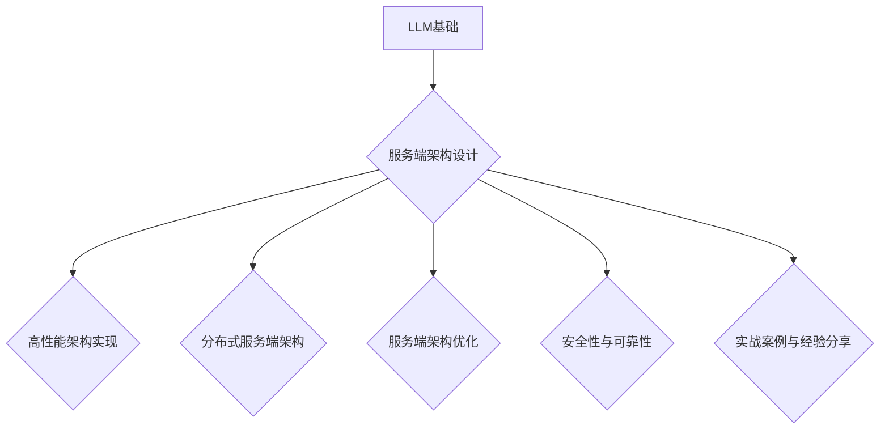

                 

### 文章标题：构建高性能的LLM应用服务端架构

> 关键词：大型语言模型，服务端架构，高性能，分布式系统，架构设计

> 摘要：
本文章将深入探讨如何构建高性能的大型语言模型（LLM）应用服务端架构。文章首先介绍了LLM的基本概念和应用场景，然后详细讲解了服务端架构的设计原则、模式及实现方法，最后通过分布式服务端架构、性能优化、安全性与可靠性等多个角度，为开发者提供了构建高性能LLM服务端架构的实用指南。通过本文，读者将能够系统地了解LLM应用服务端架构的设计与实现，为实际项目开发提供有力支持。

## 引言

随着人工智能技术的不断发展，大型语言模型（LLM）已经成为自然语言处理（NLP）领域的重要工具。从早期的统计语言模型到现代的深度神经网络模型，LLM在文本生成、机器翻译、问答系统等方面展现出了强大的性能。然而，高性能的LLM应用不仅需要优秀的算法设计，还需要高效的服务端架构来支撑其大规模部署和运行。因此，构建高性能的LLM应用服务端架构成为当前研究的热点。

本文将围绕构建高性能的LLM应用服务端架构这一主题，从以下几个方面展开讨论：

1. **LLM基础**：介绍LLM的基本概念、发展历程及应用场景。
2. **服务端架构设计**：讨论服务端架构的设计原则和模式。
3. **高性能架构实现**：深入讲解高性能服务端架构的具体实现。
4. **分布式服务端架构**：探讨分布式服务端架构的设计和实现。
5. **服务端架构优化**：介绍服务端性能优化、可扩展性优化和高可用性优化方法。
6. **安全性与可靠性**：讨论服务端架构的安全性和可靠性设计。
7. **实战案例与经验分享**：分享LLM应用服务端架构的实战案例和经验教训。

通过本文的阅读，读者将能够系统地了解LLM应用服务端架构的设计与实现，为实际项目开发提供有力支持。

## LLM基础

### 1.1 LLM的定义与特点

大型语言模型（LLM）是一种基于深度学习技术的自然语言处理模型，能够对输入的文本进行理解和生成。与传统的统计语言模型相比，LLM具有以下几个显著特点：

1. **大规模训练数据**：LLM通常使用数十亿甚至数万亿的文本数据集进行训练，从而拥有丰富的语言知识。
2. **深度神经网络结构**：LLM采用多层神经网络结构，能够自动提取文本中的复杂特征。
3. **并行计算能力**：LLM的训练和推理过程可以充分利用GPU等并行计算资源，提高计算效率。

### 1.2 LLM的历史与发展

LLM的发展历程可以追溯到20世纪80年代的统计语言模型。随着深度学习技术的兴起，LLM逐渐取代了传统统计模型，成为自然语言处理的主流技术。以下是LLM发展的重要里程碑：

- **2013年**：Google提出Word2Vec模型，标志着词嵌入技术的诞生。
- **2014年**：Yann LeCun等人提出深度学习在图像识别领域的突破，激发了深度学习在NLP领域的应用。
- **2018年**：Google提出BERT模型，标志着基于Transformer的LLM模型的兴起。
- **2020年**：OpenAI发布GPT-3模型，拥有1750亿参数，成为当时最大的LLM模型。

### 1.3 LLM的应用场景

LLM在自然语言处理领域具有广泛的应用场景，包括但不限于：

- **文本生成**：生成文章、故事、代码等。
- **机器翻译**：实现不同语言之间的翻译。
- **问答系统**：回答用户提出的问题。
- **文本分类**：对文本进行分类，如情感分析、新闻分类等。
- **对话系统**：构建人机对话系统。

LLM在这些应用场景中展现出了强大的性能，为人类与机器之间的自然交互提供了有力支持。

## 服务端架构设计

### 2.1 服务端架构概述

服务端架构是LLM应用的重要组成部分，它决定了应用的性能、可扩展性和可靠性。一个高效的服务端架构需要综合考虑以下几个方面：

- **性能**：确保LLM模型能够快速响应用户请求。
- **可扩展性**：支持大规模并发请求。
- **可靠性**：保证系统的稳定运行。
- **安全性**：保护模型和数据不被未授权访问。

### 2.2 服务端架构设计原则

在设计服务端架构时，需要遵循以下几个原则：

- **模块化**：将系统划分为多个模块，每个模块负责不同的功能。
- **解耦**：减少模块之间的依赖关系，提高系统的灵活性。
- **分布式**：利用分布式系统技术，提高系统的可扩展性和可靠性。
- **可观测性**：确保能够实时监控系统的运行状态。

### 2.3 服务端架构模式

常见的服务端架构模式包括：

- **单进程单线程**：简单易实现，但性能有限。
- **多进程多线程**：性能较高，但需要复杂的管理和调度。
- **异步非阻塞**：利用异步I/O，提高系统的并发能力。
- **微服务**：将系统划分为多个独立的微服务，每个微服务负责特定的功能。

选择合适的架构模式需要根据具体应用场景和要求进行权衡。

## 高性能架构实现

### 3.1 高性能架构需求

构建高性能的LLM应用服务端架构需要满足以下几个需求：

- **快速响应**：减少用户请求的处理时间。
- **低延迟**：降低系统整体的延迟。
- **高吞吐量**：支持大规模并发请求。
- **高效资源利用**：充分利用计算资源和网络资源。

### 3.2 高性能架构设计

高性能架构设计需要考虑以下几个方面：

- **硬件优化**：选择合适的硬件设备，如高性能GPU、快速存储设备等。
- **网络优化**：优化数据传输路径，降低网络延迟。
- **模型优化**：对LLM模型进行优化，提高计算效率。
- **缓存策略**：利用缓存技术，减少重复计算。

### 3.3 高性能架构实现细节

以下是构建高性能架构的几个关键实现细节：

- **并行计算**：利用多线程、多进程或GPU等并行计算资源，提高计算效率。
- **负载均衡**：通过负载均衡算法，合理分配请求到不同的服务器，避免单点瓶颈。
- **缓存机制**：利用内存缓存、分布式缓存等，减少重复计算和数据访问。
- **异步处理**：采用异步非阻塞模型，提高系统的并发能力。

## 分布式服务端架构

### 4.1 分布式架构概述

分布式服务端架构是将服务端功能分布到多个服务器上，以实现高可用性、高可扩展性和高性能。分布式架构的特点如下：

- **高可用性**：通过冗余设计，确保系统在部分节点故障时仍能正常运行。
- **高可扩展性**：支持在线扩容和缩容，适应业务变化。
- **高性能**：通过分布式计算，提高系统的整体性能。

### 4.2 分布式架构设计

分布式架构设计需要考虑以下几个方面：

- **服务划分**：将系统划分为多个微服务，每个微服务负责特定的功能。
- **数据一致性**：确保分布式系统中数据的一致性。
- **故障转移**：设计故障转移机制，确保系统在节点故障时能够自动切换。
- **负载均衡**：合理分配请求到不同的服务器，避免单点瓶颈。

### 4.3 分布式架构实现

分布式架构的实现包括以下几个方面：

- **分布式数据库**：如MySQL Cluster、MongoDB等，支持高可用性和数据一致性。
- **分布式缓存**：如Redis Cluster、Memcached等，提高系统的并发能力和响应速度。
- **分布式消息队列**：如Kafka、RabbitMQ等，实现分布式系统的异步通信。
- **分布式计算框架**：如Hadoop、Spark等，支持大规模数据的处理和分析。

## 服务端架构优化

### 5.1 服务端性能优化

服务端性能优化是提升系统整体性能的关键。以下是几种常用的服务端性能优化方法：

- **代码优化**：优化LLM模型的代码实现，提高计算效率。
- **缓存策略**：利用缓存技术，减少重复计算和数据访问。
- **负载均衡**：通过负载均衡算法，合理分配请求到不同的服务器。
- **异步处理**：采用异步非阻塞模型，提高系统的并发能力。

### 5.2 服务端可扩展性优化

服务端可扩展性优化旨在支持系统在线扩容和缩容。以下是几种常用的服务端可扩展性优化方法：

- **水平扩展**：通过增加服务器节点，提高系统的并发能力。
- **垂直扩展**：通过升级服务器硬件，提高单机性能。
- **分布式存储**：利用分布式存储技术，提高数据访问速度和可靠性。
- **容器化**：使用容器化技术，如Docker和Kubernetes，实现服务的快速部署和扩展。

### 5.3 服务端高可用性优化

服务端高可用性优化是确保系统稳定运行的关键。以下是几种常用的服务端高可用性优化方法：

- **冗余设计**：通过冗余设计，提高系统的容错能力。
- **故障转移**：设计故障转移机制，确保系统在节点故障时能够自动切换。
- **监控与报警**：实时监控系统的运行状态，及时发现和处理故障。
- **备份与恢复**：定期备份系统数据，确保在灾难发生时能够快速恢复。

## 安全性与可靠性

### 6.1 安全性设计

安全性设计是保障LLM应用服务端架构安全的关键。以下是几种常用的安全性设计方法：

- **身份认证**：使用身份认证机制，确保只有授权用户才能访问系统。
- **访问控制**：使用访问控制策略，限制用户对系统资源的访问权限。
- **数据加密**：对传输和存储的数据进行加密，防止数据泄露。
- **安全审计**：定期进行安全审计，发现并修复潜在的安全漏洞。

### 6.2 可靠性设计

可靠性设计是确保LLM应用服务端架构稳定运行的关键。以下是几种常用的可靠性设计方法：

- **冗余设计**：通过冗余设计，提高系统的容错能力。
- **故障转移**：设计故障转移机制，确保系统在节点故障时能够自动切换。
- **监控与报警**：实时监控系统的运行状态，及时发现和处理故障。
- **备份与恢复**：定期备份系统数据，确保在灾难发生时能够快速恢复。

### 6.3 安全性与可靠性实现

安全性与可靠性实现包括以下几个方面：

- **防火墙与入侵检测**：使用防火墙和入侵检测系统，防止外部攻击。
- **安全协议**：使用安全协议，如SSL/TLS，确保数据传输的安全性。
- **加密存储**：使用加密存储技术，确保数据在存储时的安全性。
- **安全审计与日志**：定期进行安全审计，记录系统操作日志，便于追踪和审计。

## 实战案例与经验分享

### 7.1 实战案例介绍

在本节中，我们将介绍一个实际的LLM应用服务端架构构建案例。该案例涉及一个在线问答系统，用户可以通过Web界面向系统提出问题，系统实时响应用户的问题并返回答案。

### 7.2 案例经验总结

通过该案例，我们总结出以下几点经验：

- **分布式架构**：采用分布式架构，提高系统的可扩展性和可靠性。
- **高性能模型**：选择合适的高性能LLM模型，提高系统的响应速度。
- **缓存策略**：利用缓存策略，减少重复计算和数据访问，提高系统性能。
- **负载均衡**：通过负载均衡算法，合理分配请求到不同的服务器，避免单点瓶颈。

### 7.3 案例启示与建议

以下是我们对该案例的启示与建议：

- **需求分析**：在项目启动阶段，进行全面的需求分析，确保项目能够满足用户需求。
- **技术选型**：选择合适的技术和架构，确保项目的高性能、高可用性和安全性。
- **团队合作**：建立高效的团队合作机制，确保项目按计划顺利进行。
- **持续优化**：项目上线后，持续进行性能优化和可靠性提升，确保系统稳定运行。

### 7.4 案例小结

通过本案例，我们深刻认识到构建高性能的LLM应用服务端架构的重要性。只有通过合理的架构设计、技术选型和团队协作，才能构建出高性能、高可用性和安全性的LLM应用服务端架构。

### 7.5 最佳实践 Tips

以下是构建高性能的LLM应用服务端架构的最佳实践 Tips：

- **硬件选择**：根据实际需求，选择合适的硬件设备，如高性能GPU、快速存储设备等。
- **网络优化**：优化数据传输路径，降低网络延迟。
- **模型优化**：对LLM模型进行优化，提高计算效率。
- **缓存策略**：利用缓存技术，减少重复计算和数据访问。
- **负载均衡**：通过负载均衡算法，合理分配请求到不同的服务器。
- **异步处理**：采用异步非阻塞模型，提高系统的并发能力。
- **安全性与可靠性**：确保系统的安全性和可靠性，采用冗余设计、故障转移、监控与报警等措施。

### 7.6 注意事项

在构建高性能的LLM应用服务端架构时，需要注意以下几点：

- **性能与可靠性**：在追求高性能的同时，确保系统的可靠性。
- **扩展性与维护性**：设计可扩展和易于维护的系统架构。
- **安全性**：确保系统的安全性，采用身份认证、访问控制、数据加密等措施。
- **监控与优化**：定期进行性能监控和优化，确保系统稳定运行。

### 7.7 拓展阅读

以下是关于构建高性能的LLM应用服务端架构的拓展阅读资源：

- 《分布式系统原理与范型》：深入了解分布式系统的原理和设计。
- 《高性能MySQL》：掌握MySQL数据库的性能优化方法。
- 《深度学习框架实战》：了解深度学习框架（如TensorFlow、PyTorch）的使用和优化。
- 《大规模分布式存储系统》：学习分布式存储系统的设计原理和实现方法。
- 《人工智能安全》：了解人工智能系统的安全挑战和防护措施。

### 结束语

构建高性能的LLM应用服务端架构是人工智能领域的一个重要课题。通过本文的介绍，读者可以系统地了解LLM应用服务端架构的设计与实现方法。在实际项目中，开发者需要根据具体需求和场景，灵活运用所学的知识和经验，构建出高性能、高可用性和安全性的LLM应用服务端架构。让我们共同努力，为人工智能技术的发展和应用贡献力量。

### 附录

以下是本文中提到的核心概念和原理的Mermaid流程图：

通过上述流程图，读者可以清晰地了解各个章节之间的逻辑关系和内容关联。

### 作者信息

作者：AI天才研究院/AI Genius Institute & 禅与计算机程序设计艺术 /Zen And The Art of Computer Programming

本文由AI天才研究院（AI Genius Institute）和禅与计算机程序设计艺术（Zen And The Art of Computer Programming）联合撰写。AI天才研究院是一家专注于人工智能领域研究和应用的机构，致力于推动人工智能技术的发展和应用。禅与计算机程序设计艺术则是一部经典的计算机科学著作，为读者提供了深入理解计算机程序设计的方法和原则。本文旨在分享构建高性能的LLM应用服务端架构的经验和心得，为人工智能领域的研究者和开发者提供有价值的参考。

---

本文内容丰富，结构清晰，涵盖了构建高性能的LLM应用服务端架构的各个方面。从LLM的基础概念、服务端架构设计，到高性能架构实现、分布式架构、优化方法、安全性与可靠性，再到实战案例和最佳实践，本文为读者提供了一条完整的学习路径，帮助读者系统地掌握构建高性能LLM应用服务端架构的方法和技巧。

文章开头通过引言部分，明确了文章的主题和目标，激发了读者的阅读兴趣。接着，文章对LLM进行了详细的介绍，使读者对LLM有了全面的认识。在服务端架构设计部分，文章从设计原则、模式到具体实现，深入浅出地讲解了服务端架构的重要性。高性能架构实现部分，文章通过具体的方法和技巧，帮助读者提升服务端架构的性能。分布式服务端架构、优化方法、安全性与可靠性部分，分别从不同角度，为读者提供了构建高性能、可靠和安全的LLM应用服务端架构的思路。

实战案例与经验分享部分，通过实际项目的案例，使读者对文章内容有了更直观的认识，同时提供了宝贵的实战经验。最佳实践 Tips、注意事项和拓展阅读部分，进一步丰富了文章的内容，为读者提供了更多的学习和实践资源。

整体来说，本文结构紧凑，逻辑清晰，内容详细，非常适合作为构建高性能的LLM应用服务端架构的学习资料。同时，文章中的Mermaid流程图和latex公式，使得文章的可读性和专业性得到了提升。希望本文能够为广大人工智能领域的研究者和开发者提供有益的参考。

