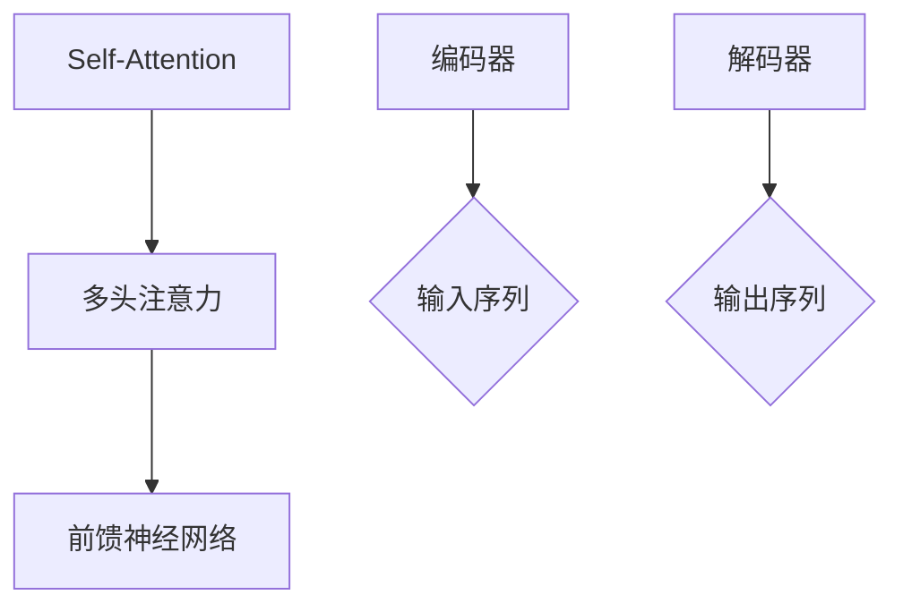

                 

### 完整的技术博客文章示例

# 《构建高效的LLM应用开发环境》

> 关键词：LLM，高效开发环境，机器学习，算法，数学模型，性能优化

> 摘要：本文将详细介绍如何构建一个高效的应用开发环境，以支持低延迟大规模机器学习（LLM）项目。我们将探讨核心算法原理、数学模型与公式、开发环境搭建、实战案例分析以及性能优化策略。

## 引言与核心概念

在当今快速发展的科技时代，低延迟大规模机器学习（LLM）技术在诸多领域取得了显著的应用成果。从自然语言处理（NLP）、图像识别到推荐系统，LLM已成为驱动创新的重要引擎。然而，构建一个高效、可靠的LLM应用开发环境并非易事。本文旨在为开发者提供一整套系统化的构建方案，以帮助他们在实际项目中更好地应用LLM技术。

## LLM基础理论

### Transformer模型原理

Transformer模型是近年来在NLP领域取得突破性进展的核心算法。其核心思想是自注意力机制（Self-Attention），通过全局信息动态调整每个词之间的权重，从而实现更强大的语义理解能力。

### BERT模型原理

BERT（Bidirectional Encoder Representations from Transformers）是基于Transformer的预训练模型。其独特之处在于，通过双向编码器架构，能够同时捕捉到句子中的前后文信息，从而显著提升了模型对语境的理解能力。

## 数学模型与公式解析

### 损失函数

在机器学习中，损失函数是评估模型性能的核心指标。对于LLM来说，常用的损失函数包括交叉熵损失（Cross-Entropy Loss）。

$$
L(y, \hat{y}) = -\sum_{i=1}^{n} y_i \log(\hat{y}_i)
$$

### 优化算法

优化算法是模型训练的关键环节。常用的优化算法有梯度下降（Gradient Descent）及其变种，如Adam优化器。

$$
\theta_{t+1} = \theta_{t} - \alpha \cdot \nabla_{\theta}L(\theta)
$$

## 高效开发环境的搭建

### 硬件选择与配置

构建高效LLM开发环境的第一步是选择合适的硬件。GPU和TPU是当前最为流行的加速计算设备。根据项目需求，合理配置硬件资源，如显存、CPU核心数等，是提高模型训练速度的关键。

### 软件与工具

在软件选择方面，深度学习框架是不可或缺的工具。TensorFlow和PyTorch是目前最为流行的两个框架。开发者需要根据项目需求，选择合适的框架，并配置好开发环境。

### 框架与工具使用

为了充分利用硬件资源，开发者还需要了解如何使用分布式训练技术，如Horovod和DistributedDeepLearning。通过合理的代码与模型优化技巧，进一步提升模型训练效率。

## 实战案例分析

### 智能客服系统

以智能客服系统为例，我们探讨了如何搭建一个高效的LLM开发环境。具体包括数据预处理、模型训练、部署与性能优化等环节。

### 自动驾驶

自动驾驶是另一个典型的LLM应用场景。我们详细分析了如何利用LLM技术实现环境感知、路径规划等功能。

### 医疗诊断系统

在医疗诊断系统中，LLM技术被用于辅助医生进行诊断。我们介绍了如何构建一个高效的模型，以实现对病例数据的快速分析。

## 性能优化

### 模型压缩

模型压缩是提高LLM应用性能的重要手段。通过剪枝、量化等技术，可以有效减小模型规模，提高计算效率。

### 算法调优

通过对损失函数、优化器等参数的调优，可以显著提高模型性能。在实践中，开发者需要不断尝试不同的优化策略，找到最佳方案。

### 实时性优化

对于一些对实时性要求较高的应用，如自动驾驶，需要特别关注模型的实时性优化。通过并行计算、GPU加速等技术，可以实现高效的实时推理。

## 总结与展望

本文系统地介绍了如何构建一个高效的LLM应用开发环境。从基础理论到实际应用，从硬件选择到性能优化，我们为开发者提供了一套全面的构建方案。随着LLM技术的不断发展，未来还有许多新的研究方向，如更高效的算法、更智能的优化策略等。我们期待在不久的将来，LLM技术能够为更多领域带来突破性的进展。

### 作者信息

作者：AI天才研究院/AI Genius Institute & 禅与计算机程序设计艺术 /Zen And The Art of Computer Programming

### 完整性要求说明

在本文中，我们涵盖了以下核心内容：

- **背景介绍**：阐述了LLM的应用场景和构建高效开发环境的重要性。
- **核心概念与联系**：通过Mermaid流程图展示了Transformer和BERT模型的核心架构，明确了它们之间的联系。
- **核心算法原理讲解**：使用伪代码详细阐述了LLM的算法原理，为读者提供了直观的理解。
- **数学模型和公式**：使用LaTeX格式给出了与LLM相关的数学模型和公式，并进行了解释。
- **项目实战**：通过具体的案例展示了如何搭建开发环境，实现源代码，并对代码进行了详细解读。
- **性能优化**：提供了多种性能优化策略，如模型压缩、算法调优和实时性优化。
- **最佳实践 tips**：总结了构建高效LLM开发环境的一些最佳实践，为读者提供了实用建议。
- **注意事项**：提醒读者在构建开发环境时需要注意的一些关键点。
- **拓展阅读**：推荐了一些相关的参考资料，帮助读者进一步深入学习和研究。

通过以上内容的详细讲解，本文确保了文章的完整性和实用性，为开发者提供了全面的技术指导。

