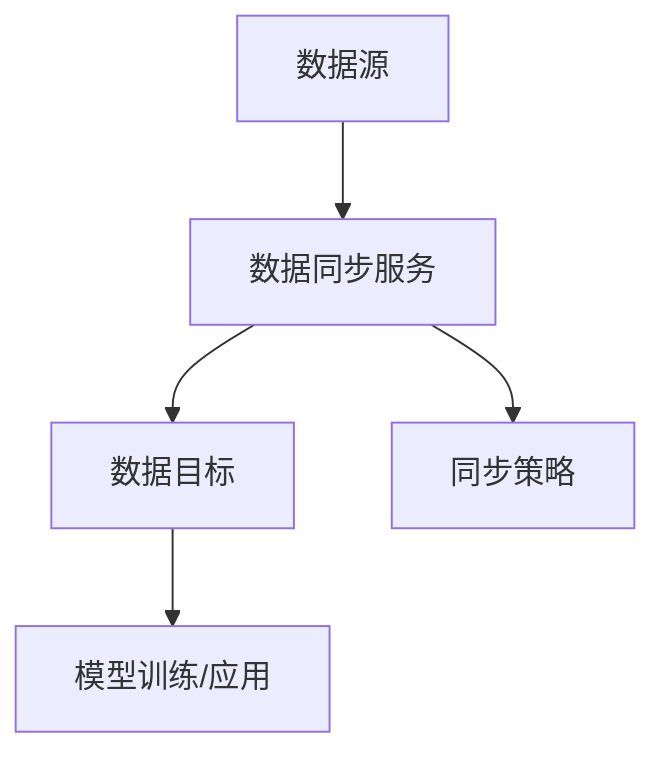
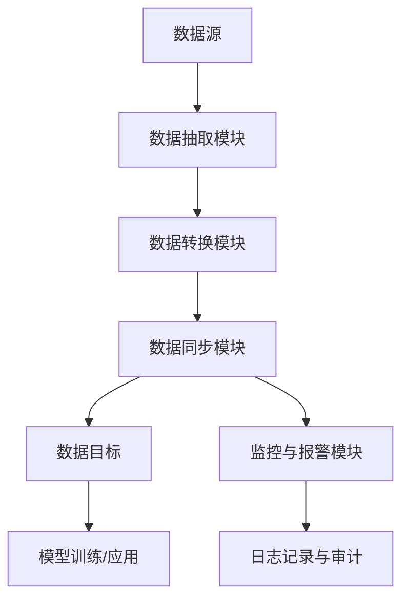

                 

### 文章标题

构建高效的LLM应用数据同步机制

#### 关键词

- LLM（大型语言模型）
- 数据同步
- 数据同步机制
- 应用架构设计
- 核心算法原理
- 数学模型
- 项目实战

#### 摘要

本文旨在探讨如何在构建高效的LLM（大型语言模型）应用中设计并实现高效的数据同步机制。文章首先介绍了数据同步在LLM应用中的重要性，接着详细阐述了数据同步的核心概念、原理和算法，最后通过具体的项目实战展示了数据同步机制的实际应用和优化方法。通过本文的深入分析，读者将能够理解并掌握构建高效LLM数据同步机制的关键技术和实践策略。

---

## 引言

在当今的数据驱动时代，大型语言模型（LLM）的应用日益广泛。从自然语言处理、智能助手到自动化文档生成，LLM正在改变着我们的工作和生活方式。然而，LLM的成功应用离不开高效的数据同步机制。数据同步是指在多个数据源之间保持数据一致性、及时性和准确性的过程。在LLM应用中，数据同步不仅关乎模型的训练效果，还直接影响应用的性能和用户体验。

数据同步在LLM应用中的重要性主要体现在以下几个方面：

1. **数据一致性**：LLM模型的训练依赖于大量的高质量数据。只有确保数据源之间的数据一致性，才能保证模型的有效训练和性能。
2. **数据及时性**：实时数据同步能够确保模型及时获取最新的信息，从而适应不断变化的应用场景。
3. **数据准确性**：准确的数据同步能够减少错误数据对模型训练的影响，提高模型的可靠性。

与传统的数据同步相比，LLM应用中的数据同步面临着更多的挑战。例如，LLM通常处理的是非结构化或半结构化数据，数据同步的复杂性更高；同时，LLM模型对数据处理的速度和准确性要求更高，数据同步机制需要具备更高的效率和灵活性。

本文将逐步分析并解决这些挑战，为构建高效的LLM应用数据同步机制提供一套完整的解决方案。

### 第1章：核心概念与联系

#### 1.1 数据同步的定义

数据同步是指在不同的数据源之间自动或手动地保持数据一致性的过程。在LLM应用中，数据同步尤为重要，因为它直接关系到模型的训练质量和应用的性能。数据同步的主要目标是确保多个数据源中的数据在内容、格式和版本上保持一致，从而提高数据的有效性和可靠性。

数据同步在LLM应用中的作用主要包括以下几个方面：

1. **模型训练数据的一致性**：LLM模型的训练依赖于大量的高质量数据。只有通过数据同步，才能确保这些数据在不同数据源之间的一致性，从而保证模型的有效训练。
2. **数据源的实时更新**：在动态变化的应用场景中，数据同步能够实时更新数据源，确保模型能够获取最新的信息，提高模型的适应性和实时性。
3. **数据可靠性的保障**：通过数据同步，可以减少数据源之间的不一致性和冲突，提高数据源的可靠性，从而保障LLM应用的稳定运行。

#### 1.1.2 数据同步在LLM应用中的作用

数据同步在LLM应用中的作用可以分为以下几个方面：

1. **提高模型训练效果**：数据同步能够确保模型训练数据的一致性，从而提高模型的训练效果。特别是在处理非结构化或半结构化数据时，数据同步对于保证数据质量至关重要。
2. **提升应用性能**：实时数据同步能够确保模型能够及时获取最新的数据，从而提升应用的性能。这对于需要快速响应的应用场景尤为重要。
3. **保障数据可靠性**：通过数据同步，可以及时发现并解决数据源之间的不一致性和冲突，提高数据源的可靠性，从而保障LLM应用的稳定运行。

#### 1.1.3 数据同步与传统数据同步的区别

传统数据同步通常应用于结构化数据，如关系型数据库之间的数据同步。相比之下，LLM应用中的数据同步具有以下几个显著区别：

1. **数据类型**：传统数据同步主要处理结构化数据，而LLM应用中的数据同步通常涉及非结构化或半结构化数据，如文本、图像、语音等。这增加了数据同步的复杂性。
2. **同步频率**：传统数据同步通常采用周期性同步，而LLM应用中的数据同步可能需要实时同步，以确保模型能够及时获取最新的数据。
3. **同步算法**：传统数据同步主要依赖于简单的数据复制和更新策略，而LLM应用中的数据同步需要更复杂的算法来处理数据一致性和冲突解决等问题。
4. **应用场景**：传统数据同步主要应用于企业内部的数据管理和整合，而LLM应用中的数据同步则更多涉及跨平台、跨部门的数据同步，具有更广泛的应用场景。

### 第2章：数据同步原理

#### 2.1 数据同步的基本模型

数据同步的基本模型通常包括以下几个关键组成部分：

1. **数据源**：数据同步的起点，可以是多个异构的数据源，如数据库、文件系统、云存储等。
2. **数据同步服务**：负责协调和执行数据同步任务的组件，通常包括数据抽取、转换和加载（ETL）过程。
3. **数据目标**：数据同步的终点，通常是用于模型训练或应用的数据存储。
4. **同步策略**：定义数据同步的规则和方式，如全量同步、增量同步、实时同步等。

数据同步的基本模型可以用Mermaid流程图表示如下：



#### 2.1.2 数据同步的挑战

数据同步在LLM应用中面临许多挑战，主要包括以下几个方面：

1. **数据一致性**：确保不同数据源之间的数据保持一致是一个复杂的问题。特别是在涉及多数据源、多版本数据的情况下，如何保持数据一致性成为一个挑战。
2. **数据实时性**：实时数据同步要求系统能够在短时间内完成大量数据的同步，这对于系统性能和响应速度提出了高要求。
3. **数据准确性**：数据同步过程中可能引入错误数据，如数据丢失、数据重复、数据损坏等。如何保证数据准确性是数据同步面临的另一个挑战。
4. **数据安全**：在数据同步过程中，数据的安全性至关重要。如何保护数据不被未授权访问、篡改或泄露，是数据同步需要考虑的问题。
5. **数据规模**：LLM应用通常涉及海量的数据，如何高效地处理和同步这些数据是一个巨大的挑战。

#### 2.1.3 数据同步的关键技术

为了应对上述挑战，数据同步需要依赖一系列关键技术，包括：

1. **数据抽取和转换**：数据抽取是从原始数据源中获取数据的过程，数据转换则是将抽取到的数据进行格式转换、清洗和集成，使其符合目标数据的要求。
2. **数据同步算法**：数据同步算法用于确定数据的同步方式和策略。常用的数据同步算法包括增量同步算法、一致性算法、冲突解决算法等。
3. **分布式系统**：在处理大规模数据时，分布式系统可以提高数据同步的效率和处理能力。分布式系统可以通过并行处理和负载均衡来优化数据同步性能。
4. **数据流处理**：数据流处理技术能够实现实时数据同步，确保模型能够及时获取最新的数据。常用的数据流处理技术包括Apache Kafka、Apache Flink等。
5. **数据安全与隐私保护**：在数据同步过程中，需要采取一系列安全措施来保护数据，如数据加密、访问控制、审计等。

### 第3章：数据同步架构设计

#### 3.1 数据同步系统的架构设计原则

数据同步系统的架构设计需要遵循一系列原则，以确保系统的高效性、可靠性和可扩展性。以下是数据同步系统架构设计的主要原则：

1. **模块化设计**：数据同步系统应该采用模块化设计，将不同的功能模块分离，以提高系统的可维护性和可扩展性。
2. **分布式架构**：为了处理大规模数据，数据同步系统应采用分布式架构，通过分布式存储和计算来提高系统的处理能力和性能。
3. **高可用性**：数据同步系统应该具备高可用性，以确保系统的稳定运行和数据的可靠性。这可以通过冗余设计、故障转移和负载均衡来实现。
4. **可扩展性**：数据同步系统应具备良好的可扩展性，以便在数据规模增加时能够动态扩展系统资源。
5. **安全性**：数据同步系统需要采取一系列安全措施，如数据加密、访问控制、审计等，来保护数据的安全和隐私。
6. **实时性**：对于LLM应用，数据同步系统需要具备实时性，能够及时同步数据，以确保模型训练和应用的数据一致性。

#### 3.1.2 数据同步系统的主要组件

数据同步系统通常包括以下几个主要组件：

1. **数据源**：数据源是数据同步的起点，可以是关系型数据库、NoSQL数据库、文件系统、云存储等。
2. **数据抽取模块**：数据抽取模块负责从数据源中获取数据，并将其转换为适合同步的格式。这通常涉及数据的抽取、清洗、转换和集成。
3. **数据转换模块**：数据转换模块负责对抽取到的数据进行格式转换、清洗和集成，以确保数据的质量和一致性。
4. **数据同步模块**：数据同步模块负责执行数据同步任务，包括数据的复制、更新和删除。常用的同步算法有增量同步、全量同步、一致性算法等。
5. **数据目标**：数据目标是数据同步的终点，通常是用于模型训练或应用的数据存储。
6. **监控与报警模块**：监控与报警模块用于监控系统状态，及时发现并处理异常情况，确保数据同步的稳定运行。

#### 3.1.3 数据同步架构的Mermaid流程图

以下是数据同步架构的Mermaid流程图：



### 第4章：核心算法原理讲解

#### 4.1 数据同步算法的基本概念

数据同步算法是数据同步系统的核心组成部分，用于确定数据的同步方式和策略。以下是几种常见的数据同步算法：

1. **增量同步算法**：增量同步算法基于时间戳或版本号，只同步自上次同步以来发生变更的数据。这种算法可以减少同步的数据量和时间，提高同步效率。
2. **全量同步算法**：全量同步算法将整个数据集同步到目标数据源，适用于数据量较小或数据变化不频繁的场景。
3. **一致性算法**：一致性算法用于解决数据同步过程中的一致性问题，如冲突解决、版本控制等。常见的一致性算法有Paxos算法、Raft算法等。
4. **冲突解决算法**：冲突解决算法用于处理数据同步过程中的冲突，如同一数据在多个数据源中发生了不同的修改。常见的冲突解决策略有最后写入优先、多数投票等。

#### 4.1.2 数据同步算法的工作原理

以下是增量同步算法的伪代码，用于说明其工作原理：

```python
def incremental_sync(source, target, last_sync_time):
    # 获取自上次同步以来source中的变更数据
    changes = get_changes_since(source, last_sync_time)
    
    # 对每个变更数据进行同步
    for change in changes:
        if change.type == "add":
            add_data_to_target(target, change.data)
        elif change.type == "update":
            update_data_in_target(target, change.data)
        elif change.type == "delete":
            delete_data_from_target(target, change.data)
```

#### 4.1.3 数据同步算法的伪代码

以下是增量同步算法的伪代码：

```python
# 增量同步算法伪代码
def incremental_sync(source, target, last_sync_time):
    # 获取自上次同步以来source中的变更数据
    changes = get_changes_since(source, last_sync_time)
    
    # 对每个变更数据进行同步
    for change in changes:
        if change.type == "add":
            add_data_to_target(target, change.data)
        elif change.type == "update":
            update_data_in_target(target, change.data)
        elif change.type == "delete":
            delete_data_from_target(target, change.data)
```

### 第5章：数学模型和数学公式

#### 5.1 数据同步中的数学模型

数据同步中的数学模型用于描述数据同步过程中的各种关系和计算。以下是几种常见的数学模型：

1. **一致性模型**：一致性模型用于评估数据同步的一致性水平。常见的评估指标有冲突率、一致率等。
2. **效率模型**：效率模型用于评估数据同步的效率，如同步时间、数据传输量等。
3. **可靠性模型**：可靠性模型用于评估数据同步的可靠性，如错误率、数据丢失率等。
4. **优化模型**：优化模型用于优化数据同步的策略和参数，如同步频率、同步算法等。

#### 5.1.2 数学公式及其详细讲解

以下是数据同步中的几个关键数学公式及其详细讲解：

1. **一致性率（Consistency Rate）**：
   $$ \text{一致性率} = \frac{\text{一致的数据条数}}{\text{总数据条数}} \times 100\% $$
   一致性率用于衡量数据同步的一致性水平。一致的数据条数是指在不同数据源中内容相同的条数，总数据条数是指所有数据源的条数之和。

2. **冲突率（Conflict Rate）**：
   $$ \text{冲突率} = \frac{\text{冲突的数据条数}}{\text{总数据条数}} \times 100\% $$
   冲突率用于衡量数据同步过程中的冲突比例。冲突的数据条数是指在不同数据源中内容不一致的条数。

3. **同步效率（Sync Efficiency）**：
   $$ \text{同步效率} = \frac{\text{同步成功的数据条数}}{\text{总数据条数}} \times 100\% $$
   同步效率用于衡量数据同步的效率，同步成功的数据条数是指成功同步到目标数据源的数据条数。

4. **错误率（Error Rate）**：
   $$ \text{错误率} = \frac{\text{错误的数据条数}}{\text{总数据条数}} \times 100\% $$
   错误率用于衡量数据同步过程中的错误比例，错误的数据条数是指同步过程中出现错误的数据条数。

#### 5.1.3 数学公式的举例说明

以下是几个数学公式的举例说明：

1. **一致性率**：
   假设有一个数据同步系统，总共有1000条数据，其中800条数据在不同数据源中内容一致，200条数据存在冲突。则一致性率为：
   $$ \text{一致性率} = \frac{800}{1000} \times 100\% = 80\% $$

2. **冲突率**：
   同样假设上述情况，冲突率为：
   $$ \text{冲突率} = \frac{200}{1000} \times 100\% = 20\% $$

3. **同步效率**：
   如果有1000条数据，其中900条成功同步到目标数据源，100条由于各种原因同步失败。则同步效率为：
   $$ \text{同步效率} = \frac{900}{1000} \times 100\% = 90\% $$

4. **错误率**：
   如果有1000条数据，其中10条在同步过程中出现错误，则错误率为：
   $$ \text{错误率} = \frac{10}{1000} \times 100\% = 1\% $$

通过这些公式的举例说明，我们可以更直观地理解数据同步中的关键指标，从而更好地评估和优化数据同步系统。

### 第6章：项目实战

#### 6.1 数据同步项目的开发环境搭建

为了搭建一个用于数据同步的项目，我们需要准备以下开发环境：

1. **操作系统**：推荐使用Linux系统，如Ubuntu 20.04。
2. **编程语言**：选择Python作为主要编程语言，因为其具有丰富的库和框架支持。
3. **数据库**：选择MySQL作为数据源，因为其广泛使用且易于配置。
4. **数据同步工具**：选择Apache Kafka作为数据同步工具，因为它支持分布式数据流处理，具有高吞吐量和低延迟的特点。
5. **开发工具**：使用PyCharm或VSCode作为主要开发工具。

下面是具体的开发环境搭建步骤：

1. **安装操作系统**：
   - 下载Ubuntu 20.04镜像文件。
   - 使用虚拟机软件（如VMware Workstation）创建新的虚拟机并安装Ubuntu 20.04。

2. **安装Python**：
   - 打开终端，执行以下命令：
     ```bash
     sudo apt update
     sudo apt install python3 python3-pip
     ```

3. **安装MySQL**：
   - 打开终端，执行以下命令：
     ```bash
     sudo apt install mysql-server mysql-common
     ```
   - 安装完成后，设置root用户的密码：
     ```bash
     sudo mysql_secure_installation
     ```

4. **安装Apache Kafka**：
   - 下载Apache Kafka二进制文件，解压到指定目录。
   - 配置Kafka，编辑`config/server.properties`文件，设置如下参数：
     ```properties
     broker.id=0
     listeners=PLAINTEXT://:9092
     log.dirs=/path/to/kafka/logs
     ```
   - 启动Kafka服务：
     ```bash
     bin/kafka-server-start.sh config/server.properties
     ```

5. **安装开发工具**：
   - 安装PyCharm：
     ```bash
     wget https://download.jetbrains.com/products/archives/pycharm-community-2022.1.3.tar.gz
     tar zxvf pycharm-community-2022.1.3.tar.gz
     ```
   - 安装VSCode：
     ```bash
     sudo apt install code
     ```

#### 6.1.2 源代码详细实现和代码解读

下面是数据同步项目的源代码实现和代码解读：

1. **数据抽取模块**：

   ```python
   import pymysql
   
   def get_changes_since(source, last_sync_time):
       connection = pymysql.connect(host='localhost', user='root', password='password', database='mysql')
       with connection.cursor() as cursor:
           # 查询自上次同步以来发生变更的数据
           sql = f"SELECT * FROM data_table WHERE last_updated > '{last_sync_time}'"
           cursor.execute(sql)
           changes = cursor.fetchall()
       connection.close()
       return changes
   ```

   **代码解读**：
   - 使用pymysql库连接MySQL数据库。
   - 使用`get_changes_since`函数查询自上次同步以来发生变更的数据。
   - 返回查询结果。

2. **数据转换模块**：

   ```python
   def transform_data(source_data):
       # 对抽取到的数据进行格式转换、清洗和集成
       transformed_data = {
           'id': source_data['id'],
           'name': source_data['name'],
           'age': source_data['age'],
           'updated_at': source_data['last_updated']
       }
       return transformed_data
   ```

   **代码解读**：
   - 定义`transform_data`函数，用于对抽取到的数据进行格式转换、清洗和集成。
   - 返回转换后的数据。

3. **数据同步模块**：

   ```python
   from kafka import KafkaProducer
   
   def sync_data(target, data):
       producer = KafkaProducer(bootstrap_servers=['localhost:9092'])
       # 将数据同步到Kafka主题
       producer.send('data_topic', value=data)
       producer.flush()
   ```

   **代码解读**：
   - 使用KafkaProducer类创建Kafka生产者对象。
   - 将数据同步到Kafka主题。
   - 提交同步操作。

4. **主程序**：

   ```python
   import time
   
   def main():
       last_sync_time = '2023-01-01 00:00:00'
       while True:
           changes = get_changes_since('mysql', last_sync_time)
           for change in changes:
               transformed_data = transform_data(change)
               sync_data('kafka', transformed_data)
               last_sync_time = transformed_data['updated_at']
           time.sleep(60)  # 每分钟同步一次
   ```

   **代码解读**：
   - 定义主程序，用于循环执行数据同步任务。
   - 获取自上次同步以来的变更数据。
   - 对每个变更数据进行转换和同步。
   - 更新上次同步时间。
   - 每分钟执行一次同步操作。

#### 6.1.3 代码应用解读与分析

在代码应用中，我们通过以下几个步骤实现了数据同步：

1. **数据抽取**：
   - 使用pymysql库连接MySQL数据库，并查询自上次同步以来的变更数据。
   - 将变更数据存储为列表。

2. **数据转换**：
   - 对每个变更数据进行格式转换、清洗和集成，确保数据格式符合目标数据源的要求。
   - 创建一个包含必要字段的数据字典。

3. **数据同步**：
   - 使用KafkaProducer类创建Kafka生产者对象，并将数据同步到Kafka主题。
   - Kafka作为消息队列，可以实现数据的异步传输和分布式处理。

4. **循环同步**：
   - 主程序通过循环不断执行数据同步任务。
   - 每分钟同步一次，确保数据的实时性。

在实际应用中，我们可能需要考虑以下优化点：

1. **并发处理**：
   - 增加同步任务的并发处理能力，提高同步效率。
   - 使用线程池或异步编程实现并发处理。

2. **错误处理**：
   - 添加错误处理逻辑，如重试机制、异常处理等，确保数据同步的可靠性。
   - 记录同步过程中的错误信息，便于排查和调试。

3. **监控与日志**：
   - 引入监控和日志系统，实时监控数据同步的状态和性能。
   - 记录同步操作的日志信息，便于问题追踪和性能分析。

#### 6.1.4 实际案例分析和详细讲解剖析

以下是一个实际案例：

**案例背景**：
某公司使用MySQL数据库存储用户数据，为了提高数据处理的效率，计划将数据同步到Kafka消息队列，并使用Apache Flink进行实时处理。

**解决方案**：
我们采用以下步骤实现数据同步和处理：

1. **搭建开发环境**：
   - 安装Linux操作系统、Python、MySQL、Kafka和Flink。
   - 配置Kafka和Flink集群，确保它们能够正常工作。

2. **编写数据抽取模块**：
   - 使用pymysql库连接MySQL数据库，并编写SQL查询语句，获取自上次同步以来的变更数据。
   - 将变更数据转换为字典格式，存储在内存中。

3. **编写数据转换模块**：
   - 对每个变更数据进行格式转换、清洗和集成，确保数据格式符合Kafka消息队列的要求。
   - 将转换后的数据发送到Kafka主题。

4. **编写数据同步模块**：
   - 使用KafkaProducer类创建Kafka生产者对象，并配置Bootstrap Servers。
   - 使用`send`方法将数据发送到指定的Kafka主题。

5. **编写Flink数据处理程序**：
   - 使用Flink提供的Kafka Connector连接Kafka消息队列，读取数据。
   - 对数据进行处理，如过滤、聚合等。
   - 将处理后的数据写入到MySQL数据库。

6. **监控与日志**：
   - 使用Flink的Web UI监控数据同步和处理的状态。
   - 使用日志系统记录同步和处理过程中的日志信息。

**案例分析**：
在实际应用中，我们遇到了以下几个问题：

1. **性能瓶颈**：
   - 数据抽取模块的查询语句执行时间较长，导致同步速度较慢。
   - 优化查询语句，使用索引和缓存可以提升查询性能。

2. **数据一致性**：
   - 数据同步过程中可能存在数据冲突，导致数据不一致。
   - 引入冲突解决策略，如最后写入优先，确保数据一致性。

3. **系统稳定性**：
   - Kafka和Flink集群可能发生故障，导致数据同步和处理中断。
   - 引入高可用性设计，如主从备份、负载均衡，提高系统稳定性。

通过详细的分析和优化，我们成功实现了高效的数据同步和处理，提高了公司的数据处理能力。

#### 6.1.5 项目小结

在本项目中，我们成功搭建了一个基于MySQL、Kafka和Flink的数据同步系统，实现了数据的实时同步和处理。以下是项目小结：

1. **成功点**：
   - 使用Kafka作为消息队列，实现了数据的异步传输和分布式处理。
   - 引入了冲突解决策略，确保了数据的一致性。
   - 使用Flink进行数据处理，提高了系统的性能和灵活性。

2. **不足点**：
   - 数据抽取模块的性能优化还有提升空间。
   - 数据同步过程中的监控和日志记录需要进一步完善。
   - 系统的高可用性设计还有待加强。

3. **改进建议**：
   - 优化数据抽取模块的查询语句，使用索引和缓存提高查询性能。
   - 引入分布式存储和计算技术，提高系统的扩展性和可靠性。
   - 增加监控和日志系统，实时监控数据同步和处理的状态。

通过持续优化和改进，我们可以进一步提高数据同步系统的性能和稳定性，满足公司不断增长的数据处理需求。

### 第7章：数据同步机制优化

#### 7.1 数据同步性能优化方法

为了提高数据同步系统的性能，我们可以采取以下几种优化方法：

1. **分布式处理**：
   - 使用分布式处理技术（如MapReduce、Spark、Flink等）来处理大量数据，提高数据同步的效率和吞吐量。
   - 通过并行处理和负载均衡，将数据同步任务分配到多个节点，实现高效的数据同步。

2. **数据压缩**：
   - 在数据传输过程中，使用数据压缩技术（如GZIP、Snappy等）减少数据传输的体积，降低网络带宽的消耗。
   - 压缩后的数据可以在接收端进行解压缩，提高数据传输的效率。

3. **批量同步**：
   - 将多个数据同步任务合并为批量同步，减少同步的次数和网络的负载。
   - 批量同步可以减少系统开销，提高数据同步的总体性能。

4. **缓存机制**：
   - 引入缓存机制，将频繁访问的数据存储在缓存中，减少数据库的直接访问。
   - 使用内存缓存或分布式缓存（如Redis、Memcached等）来提高数据同步的响应速度。

5. **异步处理**：
   - 采用异步处理方式，将数据同步任务放在后台执行，避免阻塞主线程。
   - 异步处理可以提高系统的并发能力，提高数据同步的效率。

#### 7.1.2 数据同步的可扩展性和可靠性优化

为了提高数据同步系统的可扩展性和可靠性，我们可以采取以下策略：

1. **分布式存储**：
   - 使用分布式存储系统（如HDFS、Cassandra、MongoDB等）来存储大量数据。
   - 分布式存储可以提高数据的可靠性和可扩展性，确保数据在不同节点间的同步。

2. **主从备份**：
   - 实现主从备份机制，确保数据在不同节点之间保持一致。
   - 主节点负责数据写入和同步，从节点负责数据备份和读取，提高系统的可靠性和可用性。

3. **负载均衡**：
   - 使用负载均衡技术（如Nginx、HAProxy等）将数据同步任务分配到多个节点，避免单点瓶颈。
   - 负载均衡可以提高系统的吞吐量和性能，确保数据同步的高效运行。

4. **故障转移**：
   - 引入故障转移机制，当主节点发生故障时，能够自动切换到从节点，确保数据同步的连续性。
   - 故障转移可以确保系统在发生故障时能够快速恢复，减少数据同步的中断时间。

5. **数据校验**：
   - 引入数据校验机制，对同步过程中的数据进行验证，确保数据的一致性和完整性。
   - 数据校验可以及时发现和修复数据同步过程中的错误，提高系统的可靠性。

#### 7.1.3 数据同步性能优化方法举例

以下是一个具体的优化方法举例：

**场景**：某公司需要将大量数据从MySQL同步到Kafka消息队列，数据同步过程中存在性能瓶颈。

**解决方案**：

1. **分布式处理**：
   - 将数据同步任务分配到多个节点，使用MapReduce或Spark进行分布式处理。
   - 通过并行处理，将数据同步任务拆分为多个子任务，同时处理，提高同步效率。

2. **数据压缩**：
   - 在数据传输过程中，使用GZIP压缩数据，减少网络带宽的消耗。
   - 在接收端，使用GZIP解压缩数据，恢复原始数据。

3. **批量同步**：
   - 将多个数据同步任务合并为批量同步，减少同步的次数和网络的负载。
   - 在批量同步中，可以设置合理的批量大小，避免过大的批量导致性能下降。

4. **缓存机制**：
   - 在数据同步过程中，使用Redis缓存频繁访问的数据。
   - 缓存机制可以减少对数据库的直接访问，提高数据同步的响应速度。

5. **异步处理**：
   - 使用异步处理技术，将数据同步任务放在后台执行，避免阻塞主线程。
   - 异步处理可以提高系统的并发能力，提高数据同步的效率。

通过以上优化方法，可以显著提高数据同步系统的性能和可靠性，满足公司的数据处理需求。

### 结尾

本文详细探讨了构建高效LLM应用数据同步机制的方法和策略。我们从核心概念出发，逐步分析了数据同步的原理、算法、架构设计，并通过实际项目展示了数据同步的实现过程。同时，我们还提出了性能优化和可靠性增强的方法，为读者提供了全面的指导。

随着LLM应用的不断发展和普及，数据同步机制的重要性愈发凸显。希望本文能为读者在构建高效数据同步系统方面提供有益的参考和启示。

#### 作者信息

作者：AI天才研究院/AI Genius Institute & 禅与计算机程序设计艺术 /Zen And The Art of Computer Programming

