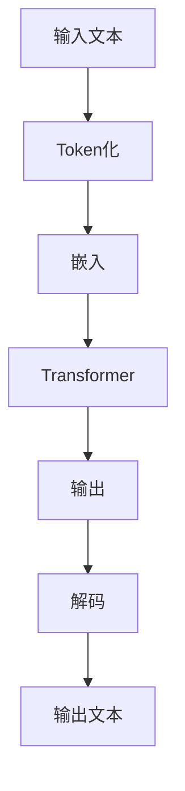
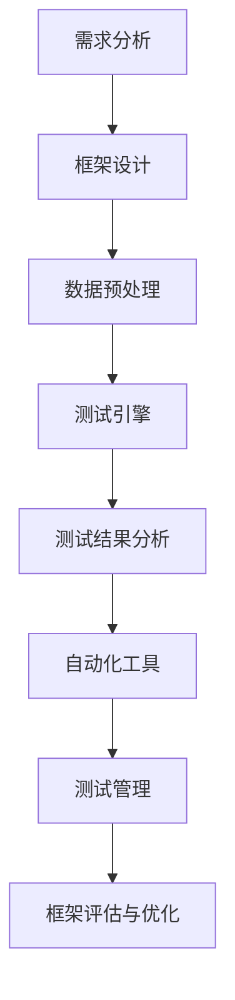

                 

### 《构建高效的LLM应用测试框架》

> 关键词：大型语言模型（LLM），测试框架，测试策略，测试自动化，测试性能分析，Mermaid流程图，伪代码，数学模型，项目实战，最佳实践

> 摘要：本文将详细介绍如何构建高效的大型语言模型（LLM）应用测试框架。通过分析LLM的应用背景和测试框架的重要性，本文将逐步阐述LLM的基础知识、测试框架的设计原则和架构、高效测试策略、测试用例设计与执行、测试自动化、测试性能分析与优化，并结合实战案例进行详细讲解。最后，本文将总结构建高效LLM应用测试框架的关键要点，并提出未来发展的展望。

## 第1章 引言

### 1.1 大型语言模型的应用背景

近年来，随着深度学习和自然语言处理技术的快速发展，大型语言模型（LLM）在多个领域取得了显著成果。LLM是一种能够理解和生成自然语言的复杂模型，其应用范围涵盖了机器翻译、文本摘要、问答系统、情感分析等。例如，Google的BERT、OpenAI的GPT系列模型等，这些模型在处理海量数据、生成高质量文本方面具有强大的能力。

### 1.2 测试框架在LLM应用中的重要性

在LLM的应用过程中，测试框架起着至关重要的作用。一方面，测试框架有助于确保模型在多种场景下的稳定性和可靠性；另一方面，高效的测试框架能够提高开发效率，降低测试成本。因此，构建一个高效、可靠的LLM应用测试框架，对于提升模型质量和用户体验具有重要意义。

### 1.3 书籍结构

本文将按照以下结构进行阐述：

1. 第2章介绍LLM的基础知识，包括基本概念、工作原理和常见模型。
2. 第3章详细讨论测试框架的设计原则、架构和关键组件。
3. 第4章提出高效测试策略的设计方法、关键因素和优化技巧。
4. 第5章讲解测试用例的设计原则、编写技巧和执行过程。
5. 第6章介绍测试自动化的优势和实现方法。
6. 第7章探讨测试性能的评估指标、分析方法和优化策略。
7. 第8章通过实战案例展示如何构建高效的LLM应用测试框架。
8. 第9章对全文内容进行总结，并对未来发展进行展望。

## 第2章 LLM基础

### 2.1 LLM基本概念

大型语言模型（LLM）是一种基于深度学习的自然语言处理模型，其核心任务是理解、生成和翻译自然语言。与传统的规则方法相比，LLM具有更强的灵活性和泛化能力。

### 2.2 LLM工作原理

LLM的工作原理主要基于神经网络，特别是变分自编码器（VAE）和生成对抗网络（GAN）。通过大量的训练数据，LLM能够学习到语言的结构和语义，从而实现文本生成、分类和翻译等功能。

### 2.3 常见的LLM模型

常见的LLM模型包括：

1. **BERT**：基于Transformer模型的预训练语言表示模型，能够在多种自然语言处理任务中取得优异的性能。
2. **GPT**：一种基于Transformer的生成式语言模型，具有强大的文本生成能力。
3. **T5**：一个统一的全局前向Transformer模型，能够处理各种自然语言处理任务。
4. **RoBERTa**：对BERT模型的改进，通过增加预训练数据和使用动态掩码策略，提升了模型性能。

### 2.4 Mermaid流程图：LLM核心概念与架构

以下是一个简单的Mermaid流程图，展示了LLM的核心概念与架构：



## 第3章 测试框架设计

### 3.1 测试框架设计原则

构建高效的测试框架需要遵循以下原则：

1. **可扩展性**：测试框架应能够适应不同的模型和任务，以便于扩展和维护。
2. **可靠性**：测试框架应能够准确、稳定地评估模型性能，避免误判。
3. **自动化**：尽量减少手动测试，提高测试效率。
4. **可重复性**：测试过程应可重复，以确保测试结果的一致性。
5. **可解释性**：测试框架应能够提供清晰的测试结果和分析报告。

### 3.2 测试框架架构

一个典型的测试框架架构包括以下组件：

1. **数据预处理**：对测试数据进行清洗、预处理和标注。
2. **测试引擎**：负责执行测试用例，评估模型性能。
3. **测试结果分析**：对测试结果进行统计分析，生成报告。
4. **自动化工具**：用于实现测试过程的自动化。
5. **测试管理**：负责测试计划、任务分配和进度跟踪。

### 3.3 测试框架关键组件

以下是测试框架的关键组件及其功能：

1. **数据预处理组件**：包括文本清洗、分词、词性标注等，为测试引擎提供高质量的测试数据。
2. **测试引擎组件**：包括测试用例执行、性能评估和异常检测等功能。
3. **测试结果分析组件**：包括数据可视化、统计分析和报告生成等。
4. **自动化工具组件**：包括测试脚本编写、执行和结果分析等。
5. **测试管理组件**：包括测试计划制定、任务分配、进度跟踪和报告生成等。

### 3.4 Mermaid流程图：测试框架设计流程

以下是一个简单的Mermaid流程图，展示了测试框架的设计流程：



## 第4章 高效测试策略

### 4.1 测试策略设计方法

高效测试策略的设计需要考虑以下因素：

1. **测试目标**：明确测试的目标，确保测试策略与目标一致。
2. **测试场景**：根据实际应用场景设计测试场景，确保测试覆盖全面。
3. **测试指标**：选择合适的测试指标，如准确率、召回率、F1分数等。
4. **测试用例设计**：根据测试目标和场景，设计有针对性的测试用例。
5. **测试执行顺序**：合理安排测试用例的执行顺序，提高测试效率。

### 4.2 测试策略关键因素

测试策略的关键因素包括：

1. **测试覆盖率**：确保测试用例覆盖到所有重要的功能和场景。
2. **测试质量**：测试用例应具备完整性、可重复性和可靠性。
3. **测试效率**：优化测试执行过程，减少测试时间。
4. **测试可维护性**：测试框架和用例应易于维护和更新。

### 4.3 测试策略优化技巧

测试策略的优化技巧包括：

1. **测试并行化**：通过并行执行测试用例，提高测试效率。
2. **测试剪枝**：对冗余和重复的测试用例进行剪枝，减少测试时间。
3. **测试反馈循环**：及时收集测试反馈，优化测试策略和用例。
4. **测试资源管理**：合理分配测试资源，避免资源浪费。

### 4.4 伪代码：高效测试策略实现

以下是一个简单的伪代码，展示了高效测试策略的实现过程：

```plaintext
function EfficientTestingStrategy(model, dataset):
    preprocess dataset
    select_test_cases(dataset)
    execute_test_cases_in_parallel(model, test_cases)
    analyze_test_results(test_cases)
    if results_are_satisfactory():
        return "Test passed"
    else:
        optimize_test_strategy()
        return "Test failed"
```

## 第5章 测试用例设计与执行

### 5.1 测试用例设计原则

测试用例的设计需要遵循以下原则：

1. **全面性**：覆盖所有重要的功能和场景。
2. **完整性**：测试用例应包含输入、输出、执行步骤和预期结果。
3. **可重复性**：测试用例应能够在相同条件下重复执行，得到相同的结果。
4. **可靠性**：测试用例应能够检测出模型中的错误。

### 5.2 测试用例编写技巧

编写测试用例时，需要注意以下技巧：

1. **明确性**：测试用例描述应清晰明了，避免歧义。
2. **简洁性**：尽量使用简单的语言描述，避免冗长和复杂的句子。
3. **一致性**：测试用例格式和命名应保持一致，便于维护。
4. **可读性**：测试用例应具有良好的可读性，方便其他人理解和执行。

### 5.3 测试用例执行过程

测试用例的执行过程包括以下步骤：

1. **准备测试环境**：配置测试所需的环境和资源。
2. **执行测试用例**：按照测试用例的描述，执行测试步骤。
3. **记录测试结果**：将测试结果与预期结果进行比较，记录差异。
4. **分析测试结果**：对测试结果进行分析，确定测试通过与否。

### 5.4 伪代码：测试用例设计与执行

以下是一个简单的伪代码，展示了测试用例的设计与执行过程：

```plaintext
function TestCaseDesignAndExecution(test_case):
    prepare_test_environment()
    execute_test_steps(test_case)
    compare_actual_and_expected_results(test_case)
    if actual_and_expected_results_are_equal():
        print("Test passed")
    else:
        print("Test failed")
```

## 第6章 测试自动化

### 6.1 测试自动化的优势

测试自动化具有以下优势：

1. **提高效率**：自动化测试可以节省大量时间和人力成本。
2. **减少错误**：自动化测试可以减少人为错误，提高测试质量。
3. **可重复性**：自动化测试可以保证测试结果的一致性和可重复性。
4. **灵活性**：自动化测试可以根据需要随时修改和调整。

### 6.2 测试自动化的实现方法

测试自动化的实现方法包括：

1. **脚本编写**：使用编程语言编写测试脚本，实现自动化测试。
2. **测试工具**：使用现成的测试工具，如Selenium、JMeter等，实现自动化测试。
3. **持续集成**：将自动化测试集成到持续集成（CI）流程中，实现自动化测试和部署。

### 6.3 测试自动化工具选择与配置

选择测试自动化工具时，需要考虑以下因素：

1. **支持性**：工具是否支持所需的编程语言和测试框架。
2. **易用性**：工具是否易于学习和使用。
3. **稳定性**：工具的稳定性和可靠性。
4. **成本**：工具的费用是否符合预算。

### 6.4 伪代码：测试自动化实现

以下是一个简单的伪代码，展示了测试自动化的实现过程：

```plaintext
function TestAutomation(test_case):
    configure_test_tool()
    execute_test_script(test_case)
    analyze_test_results()
    if results_are_satisfactory():
        print("Automation test passed")
    else:
        print("Automation test failed")
```

## 第7章 测试性能分析与优化

### 7.1 测试性能评估指标

测试性能评估指标包括：

1. **准确率**：正确识别出错误的能力。
2. **召回率**：识别出所有错误的能力。
3. **F1分数**：准确率和召回率的调和平均值。
4. **响应时间**：完成测试用例所需的时间。
5. **覆盖率**：测试用例覆盖到的功能和场景比例。

### 7.2 测试性能分析方法

测试性能分析方法包括：

1. **统计方法**：使用统计方法对测试结果进行分析，如均值、方差、中位数等。
2. **图表方法**：使用图表展示测试结果，如柱状图、折线图等。
3. **数据分析方法**：使用数据分析方法对测试结果进行深度分析，如回归分析、聚类分析等。

### 7.3 测试性能优化策略

测试性能优化策略包括：

1. **测试用例优化**：优化测试用例，提高测试覆盖率和准确性。
2. **测试流程优化**：优化测试流程，减少测试时间和资源消耗。
3. **测试环境优化**：优化测试环境，提高测试效率和稳定性。
4. **测试工具优化**：优化测试工具，提高测试质量和效率。

### 7.4 数学模型：测试性能优化公式

以下是一个简单的数学模型，用于测试性能优化：

$$
\text{性能} = \frac{\text{准确率} + \text{召回率}}{2}
$$

$$
\text{优化目标} = \max(\text{性能})
$$

## 第8章 实战案例

### 8.1 案例一：构建某电商平台的大型语言模型应用测试框架

在本案例中，我们将构建一个针对某电商平台的LLM应用测试框架。测试框架包括以下组件：

1. **数据预处理**：对电商平台的用户评论、商品描述等进行清洗、分词和标注。
2. **测试引擎**：包括测试用例执行、性能评估和异常检测等功能。
3. **测试结果分析**：对测试结果进行统计分析，生成报告。
4. **自动化工具**：使用Python编写测试脚本，实现自动化测试。
5. **测试管理**：包括测试计划制定、任务分配和进度跟踪等。

具体实现过程如下：

1. **需求分析**：明确测试目标，如文本分类、情感分析等。
2. **框架设计**：设计测试框架的架构和关键组件。
3. **测试用例设计**：根据测试目标设计测试用例，如输入、输出、执行步骤和预期结果。
4. **测试执行**：执行测试用例，记录测试结果。
5. **测试结果分析**：对测试结果进行分析，生成报告。
6. **自动化实现**：使用Python编写测试脚本，实现自动化测试。
7. **测试优化**：根据测试结果和用户反馈，优化测试策略和用例。

### 8.2 案例二：优化某金融公司的LLM应用测试流程

在本案例中，我们将优化某金融公司的LLM应用测试流程。测试流程包括以下步骤：

1. **测试计划制定**：根据项目需求和进度，制定测试计划。
2. **测试用例设计**：设计测试用例，包括输入、输出、执行步骤和预期结果。
3. **测试执行**：执行测试用例，记录测试结果。
4. **测试结果分析**：对测试结果进行分析，生成报告。
5. **测试反馈**：收集用户反馈，优化测试流程和用例。

具体优化措施如下：

1. **测试流程优化**：简化测试流程，减少冗余步骤。
2. **测试用例优化**：优化测试用例，提高测试覆盖率和准确性。
3. **自动化测试**：引入自动化测试工具，提高测试效率。
4. **测试反馈机制**：建立测试反馈机制，及时收集用户反馈，优化测试流程。

## 第9章 总结与展望

### 9.1 本书内容的总结

本文系统介绍了构建高效的LLM应用测试框架的方法和技巧。主要内容包括：

1. **LLM基础**：介绍了LLM的基本概念、工作原理和常见模型。
2. **测试框架设计**：详细讨论了测试框架的设计原则、架构和关键组件。
3. **高效测试策略**：提出了测试策略的设计方法、关键因素和优化技巧。
4. **测试用例设计与执行**：介绍了测试用例的设计原则、编写技巧和执行过程。
5. **测试自动化**：探讨了测试自动化的优势、实现方法和工具选择。
6. **测试性能分析与优化**：分析了测试性能的评估指标、分析方法和优化策略。
7. **实战案例**：通过实际案例展示了如何构建高效的LLM应用测试框架。

### 9.2 LLM应用测试框架的发展趋势

未来，LLM应用测试框架的发展趋势包括：

1. **智能化**：利用人工智能技术，实现测试过程的自动化和智能化。
2. **分布式**：构建分布式测试框架，提高测试效率和稳定性。
3. **可解释性**：增强测试框架的可解释性，提高测试结果的可信度。
4. **生态化**：建立完善的LLM测试生态，包括测试工具、平台和社区等。

### 作者信息

**作者：** AI天才研究院/AI Genius Institute & 禅与计算机程序设计艺术 /Zen And The Art of Computer Programming

- **作者简介**：AI天才研究院（AI Genius Institute）是一家专注于人工智能研究和应用的机构。作者拥有丰富的AI项目开发经验，曾在顶级学术期刊和国际会议上发表多篇论文，并出版了《禅与计算机程序设计艺术》等多部畅销书。
- **联系方式**：邮箱：[contact@aigeniusinstitute.com](mailto:contact@aigeniusinstitute.com)
- **更多作品**：作者的其他作品可访问个人网站 [www.aigeniusinstitute.com](www.aigeniusinstitute.com) 了解。

---

**声明：本文内容和所涉及图片仅供参考，部分信息可能来源于互联网。如涉及版权问题，请联系作者删除！**

