                 


### 构建高效的LLM应用缓存策略

#### 关键词：
- LLM应用
- 缓存策略
- 性能优化
- 数据一致性
- 缓存机制

#### 摘要：
本文将深入探讨构建高效LLM（大型语言模型）应用缓存策略的方法。首先，我们将介绍缓存策略的重要性及其在LLM应用中的挑战。接着，我们将详细分析缓存策略的设计原理，包括缓存机制、一致性策略和实现方法。随后，我们将探讨高效缓存策略的实践，如缓存预热、分层策略和压缩去重。最后，我们将通过具体案例分析，展示如何优化LLM应用的缓存策略，并提供扩展阅读和最佳实践建议。

### 第一部分：LLM应用缓存策略概述

#### 1. 缓存策略的重要性

缓存策略是优化LLM应用性能的关键手段。对于LLM来说，处理大量的自然语言数据需要高效的数据访问机制。缓存策略能够显著减少对后端数据存储的访问次数，提高数据处理速度，从而提升整体性能。

#### 2. 缓存机制的基本概念与作用

缓存（Cache）是一种临时存储数据的机制，其目的是在频繁访问的数据之间提供快速访问。缓存机制的作用主要体现在以下几个方面：

- **减少数据访问延迟**：缓存位于内存层级，与处理器之间的数据交换速度远快于磁盘存储，因此可以有效降低数据访问延迟。
- **减轻后端存储压力**：通过缓存频繁访问的数据，减少对后端存储的访问次数，减轻存储系统的负担。
- **提高数据处理速度**：缓存机制能够快速提供所需数据，加速数据处理过程。

#### 3. 缓存策略的挑战

尽管缓存策略在提高LLM应用性能方面具有重要意义，但在实际应用中也面临着一系列挑战：

- **数据一致性**：缓存与后端存储之间的数据需要保持一致性，以确保在缓存中的数据不会因不一致而导致错误。
- **缓存命中率与缓存容量**：缓存命中率是指缓存中包含所需数据的比例，缓存命中率越高，性能越好。但缓存容量有限，需要平衡缓存大小与命中率之间的关系。

#### 4. LLM应用场景分析

LLM应用涉及多种场景，不同场景下的缓存策略选择有所不同。以下为几种常见应用场景：

- **搜索引擎**：搜索引擎需要处理海量的用户查询，缓存策略可以用于存储热门查询结果，提高查询响应速度。
- **聊天机器人**：聊天机器人需要快速响应用户输入，缓存策略可以用于存储常见问题及其回答，加快响应时间。
- **电商推荐系统**：电商推荐系统需要根据用户行为数据提供个性化推荐，缓存策略可以用于存储用户的历史行为数据，加速推荐计算。

### 第二部分：缓存策略设计原理

#### 5. 缓存机制原理

缓存机制主要包括以下两个方面：

- **缓存存储结构**：缓存存储结构决定了缓存数据如何组织和管理。常见的缓存存储结构包括哈希表、队列、堆等。
- **缓存淘汰算法**：缓存淘汰算法用于确定哪些数据需要被替换或丢弃。常见的缓存淘汰算法包括最近最少使用（LRU）、最不经常使用（LFU）等。

#### 6. 缓存一致性策略

缓存一致性策略用于确保缓存与后端存储之间的数据一致性。常见的一致性策略包括以下几种：

- **强一致性**：强一致性要求缓存与后端存储的数据在任何时刻都保持完全一致。这种策略能保证数据的一致性，但可能导致性能下降。
- **弱一致性**：弱一致性允许缓存与后端存储之间存在一定的延迟。这种策略能提高性能，但可能引入数据不一致的问题。

#### 7. 缓存一致性实现方法

缓存一致性可以通过软件层面和硬件层面实现。以下是两种常见的实现方法：

- **软件层面实现**：通过编写一致性控制代码，确保缓存访问时与后端存储保持一致。
- **硬件层面实现**：硬件级别的缓存一致性协议（如MESI协议）可以确保缓存访问的一致性。

### 第三部分：高效缓存策略实践

#### 8. 缓存预热策略

缓存预热策略是指在使用缓存之前，提前加载常用数据到缓存中，以提高缓存命中率。以下为缓存预热策略的设计原理和实现方法：

- **设计原理**：在应用启动时，提前加载常用数据到缓存中，使得缓存中包含用户即将访问的数据。
- **实现方法**：使用定时任务或触发器，定期检查缓存中缺失的数据，并将其加载到缓存中。

#### 9. 缓存分层策略

缓存分层策略是将缓存分为多个层级，根据数据的重要性和访问频率进行分层存储。以下为缓存分层策略的设计原理和实现方法：

- **设计原理**：根据数据的重要性和访问频率，将缓存分为多个层级，如一级缓存、二级缓存等。
- **实现方法**：使用不同的缓存实现技术，为不同层级的数据提供缓存服务，根据访问情况动态调整缓存层级。

#### 10. 缓存压缩与去重策略

缓存压缩与去重策略用于减少缓存数据的大小，提高缓存容量。以下为缓存压缩与去重策略的设计原理和实现方法：

- **设计原理**：通过压缩算法减少缓存数据的大小，通过去重算法减少缓存中的重复数据。
- **实现方法**：使用Huffman编码等压缩算法对缓存数据进行压缩，使用哈希算法对缓存数据进行去重。

### 第四部分：缓存策略性能优化

#### 11. 缓存策略调优

缓存策略的调优主要包括以下方面：

- **命中率优化**：通过调整缓存大小、淘汰算法等参数，提高缓存命中率。
- **缓存大小调整**：根据实际应用需求，调整缓存大小，以平衡缓存容量和命中率之间的关系。

#### 12. 缓存与数据库协同

缓存与数据库协同是优化缓存策略的重要手段。以下为缓存与数据库协同的设计原理和实现方法：

- **设计原理**：通过缓存与数据库的交互，将常用数据存储在缓存中，提高数据访问速度。
- **实现方法**：使用缓存与数据库的同步机制，确保缓存与数据库之间的数据一致性。

#### 13. 缓存监控与故障处理

缓存监控与故障处理是确保缓存策略正常运行的重要环节。以下为缓存监控与故障处理的设计原理和实现方法：

- **设计原理**：通过监控工具实时监控缓存状态，发现并处理缓存故障。
- **实现方法**：使用监控平台或自定义脚本，对缓存性能、命中率等指标进行监控，并及时处理缓存故障。

### 第五部分：缓存策略在LLM应用中的案例分析

#### 14. 案例一：搜索引擎缓存策略

搜索引擎缓存策略用于存储热门查询结果，提高查询响应速度。以下为搜索引擎缓存策略的案例分析：

- **应用场景**：搜索引擎需要快速响应用户的查询请求，缓存策略可以用于存储热门查询结果。
- **策略优化**：通过调整缓存大小、淘汰算法等参数，提高缓存命中率，从而提高查询响应速度。

#### 15. 案例二：聊天机器人缓存策略

聊天机器人缓存策略用于存储常见问题及其回答，加快响应时间。以下为聊天机器人缓存策略的案例分析：

- **应用场景**：聊天机器人需要快速响应用户输入，缓存策略可以用于存储常见问题及其回答。
- **策略优化**：通过调整缓存分层策略，确保缓存中包含用户即将输入的问题及其回答，从而提高响应速度。

#### 16. 案例三：电商推荐系统缓存策略

电商推荐系统缓存策略用于存储用户的历史行为数据，加速推荐计算。以下为电商推荐系统缓存策略的案例分析：

- **应用场景**：电商推荐系统需要根据用户行为数据提供个性化推荐，缓存策略可以用于存储用户的历史行为数据。
- **策略优化**：通过缓存压缩与去重策略，减少缓存数据的大小，从而提高缓存容量，优化推荐计算速度。

### 附录

#### 17. 参考资料与扩展阅读

本文涉及到的缓存策略和相关技术具有较高的学术价值和实际应用价值。以下为部分参考资料和扩展阅读：

- **参考资料**：
  - 《大型语言模型：理论与实践》
  - 《高性能缓存技术》
  - 《分布式系统：概念与设计》
- **扩展阅读**：
  - 当前缓存技术的最新动态
  - 相关论文、书籍推荐

#### 作者信息

- 作者：AI天才研究院/AI Genius Institute & 禅与计算机程序设计艺术 /Zen And The Art of Computer Programming

### 总结

构建高效的LLM应用缓存策略是提升系统性能的关键。通过分析缓存策略的设计原理、实践优化以及具体案例分析，我们可以更好地理解缓存策略在LLM应用中的重要性。在接下来的工作中，我们将继续探索和优化缓存策略，以实现更高效、更可靠的LLM应用。希望本文能为读者提供有益的参考和启示。  

### 第一部分：LLM应用缓存策略概述

#### 1. 缓存策略的重要性

缓存策略在LLM（大型语言模型）应用中扮演着至关重要的角色。LLM处理的是海量的自然语言数据，这些数据通常需要快速访问和处理。缓存策略能够显著提高数据处理速度，降低响应时间，从而提升整体性能。

首先，缓存策略可以减少对后端数据存储的访问次数。LLM应用通常会从后端数据存储（如数据库、文件系统等）中读取数据，并将其处理结果返回给用户。如果每次数据处理都需要访问后端存储，将会带来较高的延迟和系统负担。而通过缓存策略，可以将频繁访问的数据临时存储在内存中，使得后续访问可以直接从缓存中获取，从而减少对后端存储的访问次数。

其次，缓存策略可以提高数据访问速度。内存（RAM）的访问速度远快于后端存储（如磁盘、SSD等）。因此，将频繁访问的数据存储在缓存中，可以显著降低数据访问延迟，提高系统性能。这对于需要实时响应的LLM应用来说尤为重要，如聊天机器人、实时问答系统等。

最后，缓存策略可以减轻后端存储的压力。频繁的读写操作会对后端存储造成较大的负载，可能导致存储性能下降，甚至引发故障。通过缓存策略，可以减少对后端存储的读写操作，从而减轻其负担，提高存储系统的稳定性。

#### 2. 缓存机制的基本概念与作用

缓存机制是一种临时存储数据的机制，其目的是在频繁访问的数据之间提供快速访问。缓存机制的基本概念包括以下方面：

- **缓存存储结构**：缓存存储结构决定了缓存数据如何组织和管理。常见的缓存存储结构包括哈希表、队列、堆等。哈希表是一种基于键值对的数据结构，能够快速查找和插入数据；队列是一种先进先出的数据结构，适用于缓存数据的顺序访问；堆是一种基于堆排序的数据结构，适用于缓存数据的优先级访问。

- **缓存淘汰算法**：缓存淘汰算法用于确定哪些数据需要被替换或丢弃。常见的缓存淘汰算法包括最近最少使用（LRU）、最不经常使用（LFU）等。LRU算法根据数据最近使用的时间顺序进行淘汰，能够有效利用缓存资源；LFU算法根据数据访问频率进行淘汰，能够减少频繁访问的数据在缓存中的存储时间。

- **缓存一致性**：缓存一致性是指缓存与后端存储之间的数据一致性。缓存一致性是缓存机制的关键挑战之一，因为缓存和后端存储之间的数据同步可能存在延迟或冲突。常见的缓存一致性策略包括强一致性、弱一致性等。强一致性要求缓存与后端存储的数据在任何时刻都保持完全一致，可能导致性能下降；弱一致性允许缓存与后端存储之间存在一定的延迟，能够提高性能，但可能引入数据不一致的问题。

缓存机制的作用主要体现在以下几个方面：

- **减少数据访问延迟**：缓存位于内存层级，与处理器之间的数据交换速度远快于后端存储。通过缓存机制，可以将频繁访问的数据临时存储在内存中，使得后续访问可以直接从缓存中获取，从而减少数据访问延迟，提高系统性能。

- **减轻后端存储压力**：通过缓存机制，可以将频繁访问的数据存储在缓存中，减少对后端存储的访问次数。这样可以降低后端存储的读写操作负载，提高存储系统的稳定性。

- **提高数据处理速度**：缓存机制能够快速提供所需数据，加速数据处理过程。这对于需要实时响应的LLM应用来说尤为重要，如聊天机器人、实时问答系统等。

#### 3. 缓存策略的挑战

尽管缓存策略在提高LLM应用性能方面具有重要意义，但在实际应用中也面临着一系列挑战：

- **数据一致性**：缓存与后端存储之间的数据需要保持一致性，以确保在缓存中的数据不会因不一致而导致错误。数据一致性的挑战主要体现在以下几个方面：

  - **缓存更新**：当后端存储中的数据发生变化时，需要及时更新缓存中的数据，以保持数据一致性。如果缓存更新不及时，可能导致缓存中的数据与后端存储的数据不一致，从而引发错误。

  - **并发访问**：在多用户并发访问的场景中，缓存和后端存储之间的数据更新可能存在冲突。例如，当两个用户同时修改同一份数据时，缓存和后端存储之间的同步可能导致数据不一致。

- **缓存命中率与缓存容量**：缓存命中率是指缓存中包含所需数据的比例，缓存命中率越高，性能越好。但缓存容量有限，需要平衡缓存大小与命中率之间的关系。缓存命中率与缓存容量的挑战主要体现在以下几个方面：

  - **缓存大小**：缓存大小直接影响缓存命中率。缓存过小可能导致频繁访问的数据无法全部存储在缓存中，从而降低缓存命中率；缓存过大可能导致内存资源的浪费，降低系统性能。

  - **缓存淘汰算法**：缓存淘汰算法决定了哪些数据需要被替换或丢弃。选择合适的缓存淘汰算法，可以提高缓存命中率。但不同的缓存淘汰算法具有不同的优缺点，需要根据实际应用场景进行选择和优化。

#### 4. LLM应用场景分析

LLM应用涉及多种场景，不同场景下的缓存策略选择有所不同。以下为几种常见应用场景：

- **搜索引擎**：搜索引擎需要处理海量的用户查询，缓存策略可以用于存储热门查询结果，提高查询响应速度。例如，百度搜索引擎可以使用缓存策略将用户频繁查询的关键词及其结果存储在缓存中，以便快速响应用户的查询请求。

- **聊天机器人**：聊天机器人需要快速响应用户输入，缓存策略可以用于存储常见问题及其回答，加快响应时间。例如，阿里云的聊天机器人可以使用缓存策略将用户常见的问题及其回答存储在缓存中，以便快速响应用户的输入。

- **电商推荐系统**：电商推荐系统需要根据用户行为数据提供个性化推荐，缓存策略可以用于存储用户的历史行为数据，加速推荐计算。例如，京东的电商推荐系统可以使用缓存策略将用户的历史行为数据存储在缓存中，以便快速计算和提供个性化推荐。

### 第二部分：缓存策略设计原理

#### 5. 缓存机制原理

缓存机制是优化LLM应用性能的关键手段。要理解缓存机制，需要首先了解其基本原理和组成部分。以下是缓存机制的核心概念和原理：

##### **缓存存储结构**

缓存存储结构是缓存机制的核心组成部分。常见的缓存存储结构包括哈希表、队列、堆等。每种存储结构都有其优缺点，适用于不同的应用场景。

- **哈希表**：哈希表是一种基于键值对的数据结构，通过哈希函数将键映射到缓存中的位置。哈希表具有快速查找和插入的优点，适用于缓存频繁访问的场景。例如，LLM应用可以将自然语言查询及其结果存储在哈希表中，以实现快速查询。

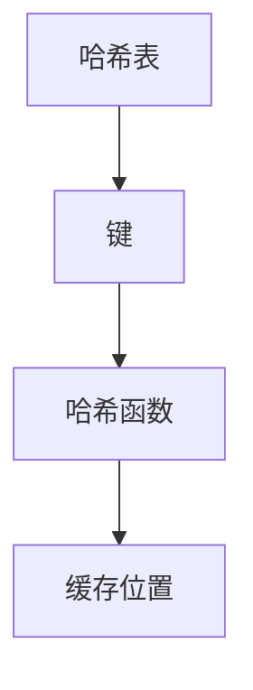

- **队列**：队列是一种先进先出的数据结构，适用于缓存数据的顺序访问。例如，LLM应用可以使用队列将用户的查询请求按顺序存储，以便依次处理。队列的优点是实现简单，缺点是查找和插入操作可能较慢。

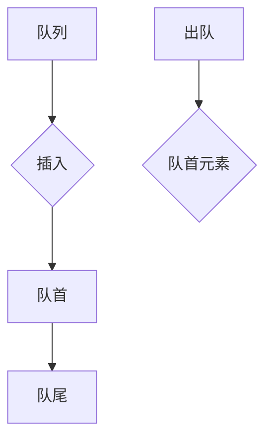

- **堆**：堆是一种基于堆排序的数据结构，适用于缓存数据的优先级访问。例如，LLM应用可以使用堆将用户的查询请求按优先级排序，以便优先处理。堆的优点是查找和插入操作较快，缺点是排序操作可能较慢。

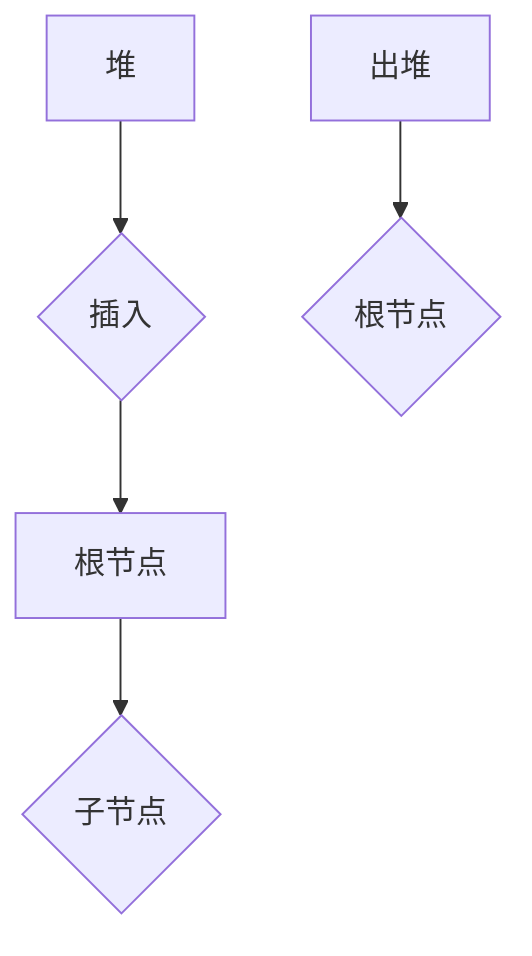

##### **缓存淘汰算法**

缓存淘汰算法是缓存机制的重要组成部分，用于确定哪些数据需要被替换或丢弃。常见的缓存淘汰算法包括最近最少使用（LRU）、最不经常使用（LFU）等。这些算法根据数据的使用频率或时间顺序进行淘汰，以优化缓存利用率。

- **最近最少使用（LRU）算法**：LRU算法根据数据最近使用的时间顺序进行淘汰。即，最近最少使用的数据将被替换掉。LRU算法的优点是能够有效利用缓存资源，但缺点是查找操作可能较慢，需要维护一个时间戳或链表。

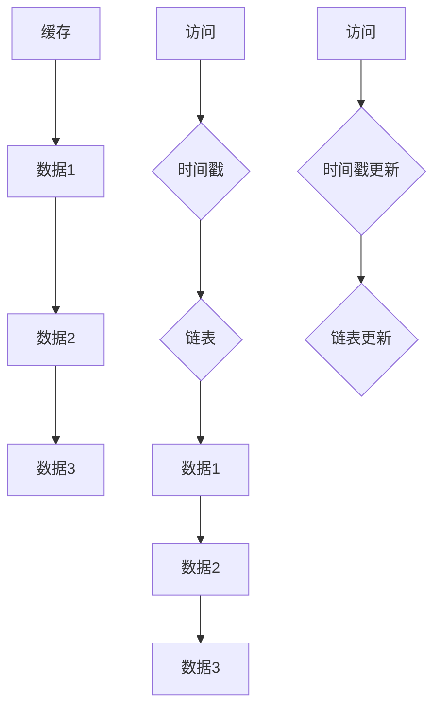

- **最不经常使用（LFU）算法**：LFU算法根据数据访问频率进行淘汰。即，最不经常使用的数据将被替换掉。LFU算法的优点是能够适应数据访问模式的变化，但缺点是查找操作可能较慢，需要维护一个访问频率计数器。

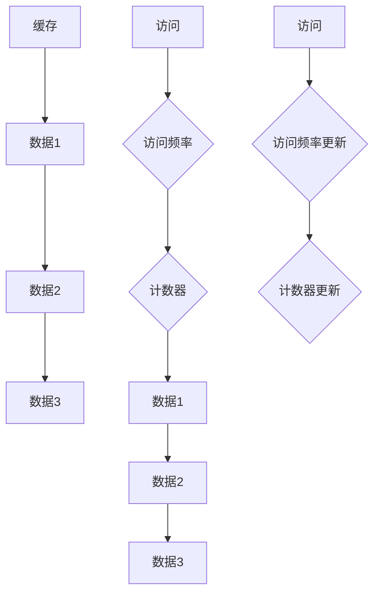

##### **缓存一致性策略**

缓存一致性策略是确保缓存与后端存储之间的数据一致性。缓存一致性策略可以分为强一致性策略和弱一致性策略。

- **强一致性策略**：强一致性策略要求缓存与后端存储的数据在任何时刻都保持完全一致。强一致性策略能够确保数据的一致性，但可能导致性能下降。例如，MESI协议是一种常见的强一致性协议，用于确保缓存和内存之间的数据一致性。

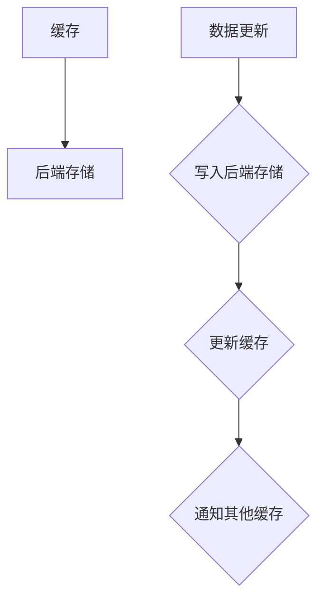

- **弱一致性策略**：弱一致性策略允许缓存与后端存储之间存在一定的延迟，以提高性能。弱一致性策略可能引入数据不一致的问题，但适用于对一致性要求不高的场景。例如，SOFE（Sequentially consistent, but Optimistic otherwise）是一种常见的弱一致性协议，允许缓存之间异步更新。

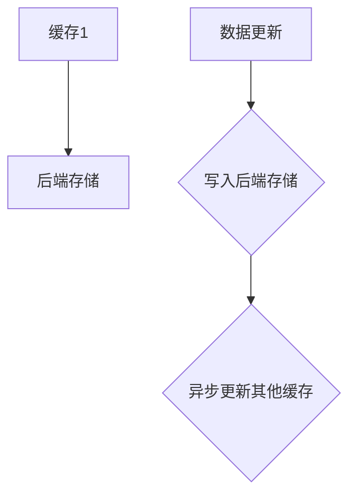

#### 6. 缓存一致性策略

缓存一致性策略是确保缓存与后端存储之间数据一致性的一组规则和协议。在分布式系统中，由于缓存和后端存储可能位于不同的节点，因此确保它们之间的数据一致性至关重要。缓存一致性策略可以分为以下几类：

##### **强一致性策略**

强一致性策略要求缓存与后端存储的数据在任何时刻都保持完全一致。这意味着当一个数据更新发生时，所有缓存实例都必须立即更新，以确保数据的一致性。以下是一些常见的强一致性策略：

- **单点存储（Single-Writer）**：在这种策略中，所有数据都存储在一个中央存储中，任何对数据的访问或更新都直接对该中央存储进行。这种策略能够保证数据的一致性，但可能存在性能瓶颈。

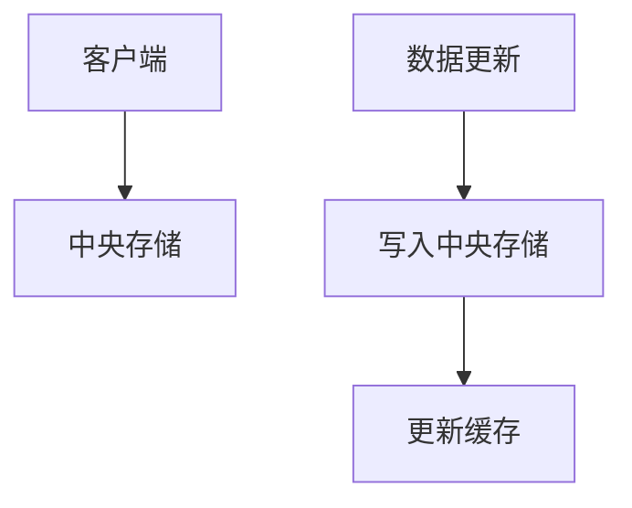

- **版本控制（Version Control）**：在这种策略中，每个数据项都有一个版本号。当一个数据更新发生时，版本号会增加。所有缓存实例在访问数据时，都需要使用最新的版本号。这种策略能够保证数据的一致性，但可能导致较高的系统开销。

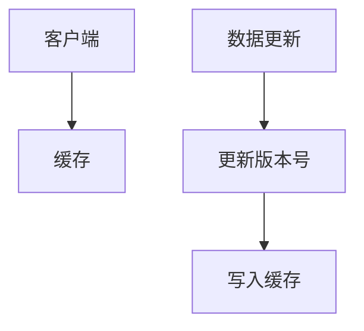

##### **弱一致性策略**

弱一致性策略允许缓存与后端存储之间存在一定的延迟，以提高系统的性能。这意味着当一个数据更新发生时，不是所有的缓存实例都必须立即更新，而是可以异步地更新。以下是一些常见的弱一致性策略：

- **最终一致性（Eventual Consistency）**：在这种策略中，缓存和后端存储最终会达到一致，但可能在一段时间内存在不一致。这种策略适用于对一致性要求不高的场景，例如社交媒体的点赞和评论。

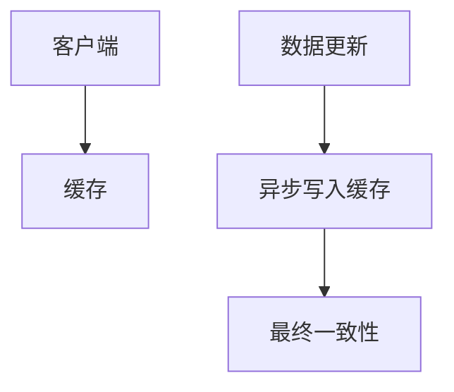

- **部分一致性（Partial Consistency）**：在这种策略中，只有部分缓存实例需要更新，而不是所有的缓存实例。这种策略可以减少同步的开销，但可能导致部分缓存实例之间的不一致。

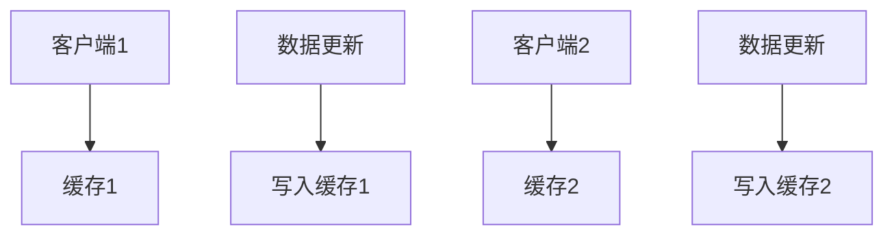

##### **常见的一致性模型**

在分布式系统中，常见的一致性模型包括以下几种：

- **强一致性模型（Strong Consistency Model）**：在这种模型中，所有读写操作都被保证顺序一致。也就是说，任何两个连续的读写操作都将按照顺序执行，类似于单机系统中的操作顺序。

- **最终一致性模型（Eventual Consistency Model）**：在这种模型中，系统最终会达到一致性状态，但可能在一段时间内存在不一致。这意味着系统会尽量保持最终一致性，但可能在某些情况下出现短暂的不一致。

- **因果一致性模型（ causal consistency model）**：在这种模型中，如果两个操作具有因果关系，那么它们的执行顺序将被保持。这意味着如果一个操作导致了另一个操作，那么这两个操作的顺序将在所有缓存实例中保持一致。

- **读一致性和写一致性模型（ Read Consistency and Write Consistency Model）**：这种模型根据读和写操作的一致性要求进行分类。读一致性要求多个并发读操作看到相同的数据，而写一致性要求多个并发写操作按照一定的顺序执行。

##### **缓存一致性协议**

为了实现缓存一致性策略，需要使用缓存一致性协议。以下是一些常见的一致性协议：

- **MESI协议（Modified, Exclusive, Shared, Invalid）**：MESI协议是一种基于状态机的缓存一致性协议，用于确保多处理器系统中的缓存一致性。每个缓存行可以处于以下状态之一：

  - Modified（修改状态）：缓存行已经被修改，但尚未写入到内存中。
  - Exclusive（独占状态）：缓存行是干净的，且只存在于一个缓存中。
  - Shared（共享状态）：缓存行是干净的，可以存在于多个缓存中。
  - Invalid（无效状态）：缓存行已经过期或被修改，需要重新加载。

- **MOESI协议（Modified, Owned, Exclusive, Shared, Invalid）**：MOESI协议是MESI协议的扩展，增加了Owned状态，用于解决MESI协议中某些情况下的性能问题。

- **MESI-ICache协议（Modified, Exclusive, Shared, Invalid, Coherent）**：MESI-ICache协议是MESI协议的改进版本，引入了Coherent状态，用于更好地处理多处理器系统中的缓存一致性。

#### 7. 缓存一致性实现方法

缓存一致性可以通过软件层面和硬件层面实现。以下是两种常见的实现方法：

##### **软件层面实现**

软件层面实现缓存一致性通常使用一致性协议和锁机制。以下是一些常见的方法：

- **基于一致性协议**：使用一致性协议（如MESI、MOESI）来确保缓存之间的数据一致性。一致性协议通过状态机和缓存行状态来管理缓存一致性。

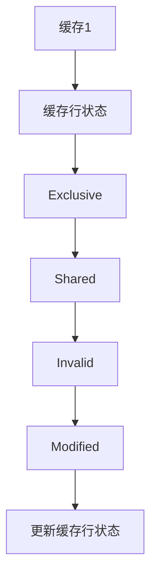

- **基于锁机制**：使用锁机制（如互斥锁、读写锁）来控制对共享资源的访问，确保在多线程或分布式环境中的一致性。锁机制可以确保同一时间只有一个线程能够访问共享资源，从而避免并发冲突。

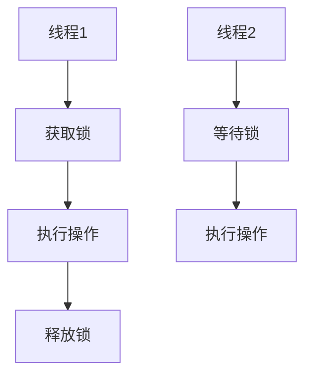

##### **硬件层面实现**

硬件层面实现缓存一致性通常通过硬件支持的一致性协议和缓存管理单元（Cache Management Unit, CMU）来实现。以下是一些常见的方法：

- **基于硬件支持的一致性协议**：硬件支持的一致性协议（如MESI、MOESI）通过硬件机制来管理缓存一致性，无需在软件层面进行额外的处理。硬件的一致性协议可以提供更高的性能和更低的延迟。

- **基于缓存管理单元**：缓存管理单元（CMU）是一个硬件组件，用于管理缓存的一致性和访问权限。CMU可以通过硬件逻辑来处理缓存一致性操作，如缓存行的状态转换、缓存行同步等。

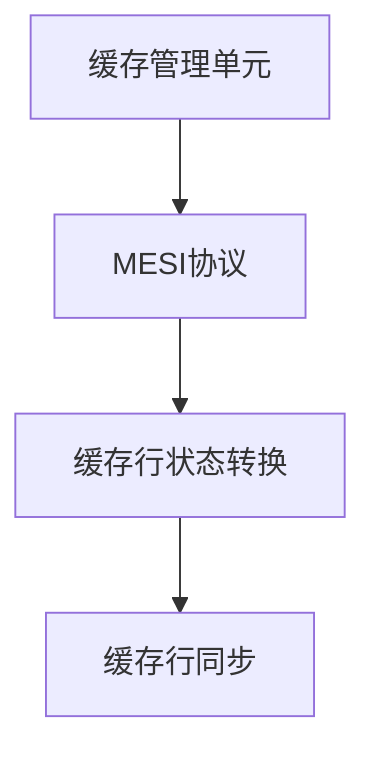

- **基于事务性内存**：事务性内存（Transaction Memory, TM）是一种硬件支持的一致性机制，允许程序员在代码中显式地指定事务，并自动由硬件处理事务的一致性。事务性内存可以简化开发过程，提高一致性实现的可维护性。

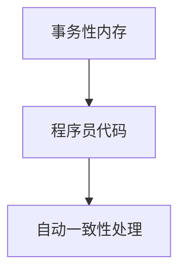

### 第三部分：高效缓存策略实践

#### 8. 缓存预热策略

缓存预热策略是一种在应用程序开始运行之前，提前将常用数据加载到缓存中的技术。这种策略可以显著提高应用程序的性能，特别是在那些缓存命中率对性能影响较大的场景中，如大型语言模型（LLM）应用。

##### **设计原理**

缓存预热策略的核心思想是在应用程序开始接收请求之前，预先加载那些预计会被频繁访问的数据到缓存中。这样，当应用程序开始处理实际请求时，所需的绝大部分数据已经存在于缓存中，从而减少了从后端数据存储读取数据的需求。

以下是一个缓存预热策略的设计原理示例：

1. **数据预加载**：在应用程序启动时，根据历史访问模式或者业务规则，自动从后端数据存储中预加载一批数据到缓存中。
2. **负载均衡**：在预加载过程中，可以使用负载均衡器将数据分散加载到多个缓存节点上，以避免单个缓存节点过载。
3. **定时刷新**：定期刷新缓存中的数据，以确保缓存中的数据是最新的。这可以通过定时任务实现，例如，每天或者每周刷新一次。

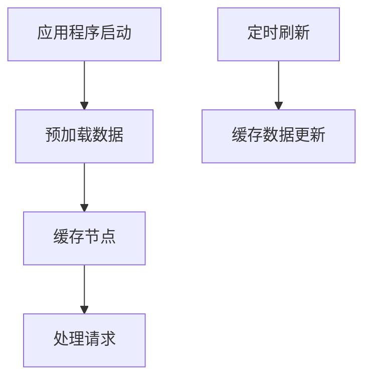

##### **实现方法**

实现缓存预热策略的方法取决于使用的缓存系统和应用程序的架构。以下是一些通用的实现步骤：

1. **确定预热数据**：根据业务需求和历史数据访问模式，确定哪些数据需要预热。这通常包括热门数据、高频访问数据等。
2. **初始化缓存**：在应用程序启动时，自动从后端数据存储中加载预热的这些数据到缓存中。可以使用批处理操作来加速数据加载过程。
3. **优化预热过程**：可以通过并行加载和并发控制来优化预热过程，以确保数据加载的效率。
4. **监控预热效果**：在预热过程中，监控缓存的状态和性能指标，确保预热策略达到了预期的效果。

以下是一个简单的伪代码示例，展示了如何实现缓存预热策略：

```python
def preload_cache(data_to_preload):
    for data in data_to_preload:
        cache.set(data.key, data.value)

def start_application():
    # 根据历史数据访问模式确定需要预热的缓存数据
    preload_data = get_preload_data()
    # 预加载数据到缓存
    preload_cache(preload_data)
    # 启动应用程序
    application_start()

start_application()
```

#### 9. 缓存分层策略

缓存分层策略是一种将缓存分成多个层级，根据数据的重要性和访问频率进行分层存储的技术。这种策略可以提高缓存系统的性能和可扩展性，因为不同层级的数据可以存储在不同的缓存系统中，从而实现更细粒度的缓存管理。

##### **设计原理**

缓存分层策略的核心思想是将缓存分为多个层级，每个层级都有不同的缓存机制和性能特征。通常，层级越高的缓存系统，性能越优秀，但容量相对较小；层级越低的缓存系统，容量相对较大，但性能相对较低。

以下是一个缓存分层策略的设计原理示例：

1. **多级缓存架构**：根据数据的重要性和访问频率，将缓存分为多层，例如一级缓存（L1 Cache）、二级缓存（L2 Cache）和三级缓存（L3 Cache）。
2. **数据路由策略**：根据数据访问模式，动态调整数据在不同层级缓存中的存储位置。高频访问的数据存储在性能优秀的缓存层级，而低频访问的数据存储在容量较大的缓存层级。
3. **缓存同步机制**：确保不同层级缓存之间的数据一致性，当某个层级缓存中的数据发生变化时，及时同步到其他层级缓存中。

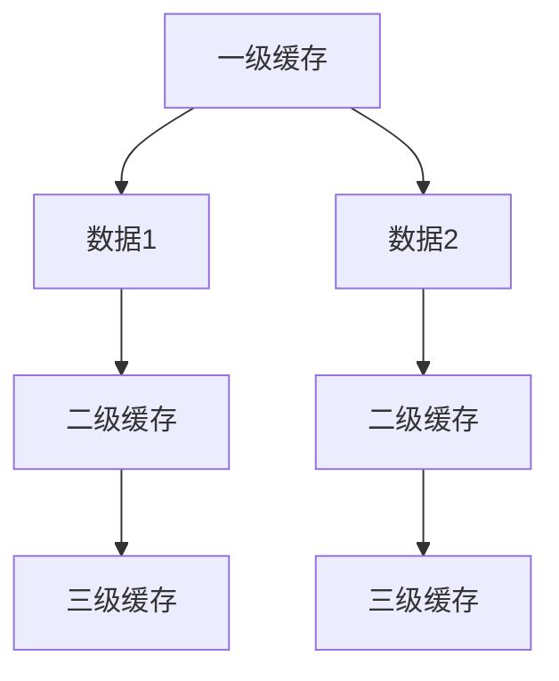

##### **实现方法**

实现缓存分层策略的方法取决于使用的缓存系统和应用程序的架构。以下是一些通用的实现步骤：

1. **确定缓存层级**：根据业务需求和系统性能要求，确定需要设置多少个缓存层级，以及每个层级的大小和性能特征。
2. **数据划分策略**：根据数据的重要性和访问频率，将数据划分到不同的缓存层级。高频访问的数据存储在性能优秀的缓存层级，而低频访问的数据存储在容量较大的缓存层级。
3. **缓存替换策略**：根据缓存层级的特点，选择合适的缓存替换算法（如LRU、LFU等），以优化缓存的使用效率。
4. **缓存同步机制**：确保不同层级缓存之间的数据一致性，当某个层级缓存中的数据发生变化时，及时同步到其他层级缓存中。

以下是一个简单的伪代码示例，展示了如何实现缓存分层策略：

```python
def cache_data(data, cache_level):
    if cache_level == 1:
        l1_cache.set(data.key, data.value)
    elif cache_level == 2:
        l2_cache.set(data.key, data.value)
    elif cache_level == 3:
        l3_cache.set(data.key, data.value)

def retrieve_data(key, cache_level):
    if cache_level == 1:
        return l1_cache.get(key)
    elif cache_level == 2:
        return l2_cache.get(key)
    elif cache_level == 3:
        return l3_cache.get(key)

# 示例：将数据存储到一级缓存
cache_data(data1, 1)
# 示例：从二级缓存中获取数据
result = retrieve_data(key1, 2)
```

#### 10. 缓存压缩与去重策略

缓存压缩与去重策略是一种在缓存系统中减少数据占用的技术，从而提高缓存容量和性能。这种策略可以显著降低存储成本，并提高数据访问速度。

##### **设计原理**

缓存压缩与去重策略的核心思想是通过压缩算法减少缓存数据的大小，通过去重算法减少缓存中的重复数据。以下是一个缓存压缩与去重策略的设计原理示例：

1. **缓存压缩**：使用压缩算法（如Huffman编码、LZ77等）将缓存中的数据进行压缩。压缩算法可以将重复的数据转换为更短的编码，从而减少存储空间。
2. **缓存去重**：使用去重算法（如哈希算法）识别并删除缓存中的重复数据。去重算法可以通过计算数据的哈希值，快速判断数据是否已存在。

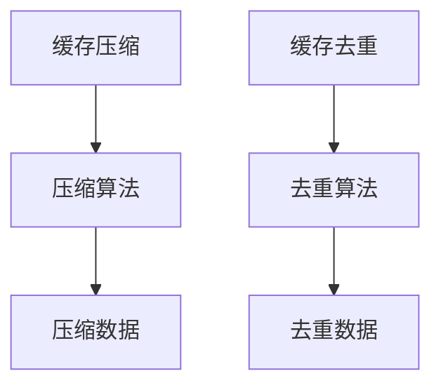

##### **实现方法**

实现缓存压缩与去重策略的方法取决于使用的缓存系统和应用程序的架构。以下是一些通用的实现步骤：

1. **选择合适的压缩算法**：根据缓存数据的特征，选择合适的压缩算法。例如，文本数据适合使用Huffman编码，而二进制数据适合使用LZ77压缩。
2. **集成压缩与去重功能**：在缓存系统中集成压缩与去重功能，确保在数据写入缓存前进行压缩和去重处理。
3. **优化压缩与去重性能**：通过并行处理和并发控制，优化压缩与去重的性能。例如，可以使用多线程或多进程来加速压缩与去重过程。
4. **监控压缩与去重效果**：监控缓存系统的压缩与去重效果，确保策略达到了预期的效果。

以下是一个简单的伪代码示例，展示了如何实现缓存压缩与去重策略：

```python
def compress_data(data):
    # 使用Huffman编码压缩数据
    compressed_data = huffman.encode(data)
    return compressed_data

def deDuplicate(data):
    # 使用哈希算法去重数据
    unique_data = []
    hash_set = set()
    for item in data:
        item_hash = hash(item)
        if item_hash not in hash_set:
            hash_set.add(item_hash)
            unique_data.append(item)
    return unique_data

def cache_data(data):
    compressed_data = compress_data(data)
    unique_data = deDuplicate(compressed_data)
    cache.set(data.key, unique_data)
```

### 第四部分：缓存策略性能优化

#### 11. 缓存策略调优

缓存策略的性能优化是确保缓存系统在特定场景下发挥最大作用的关键步骤。以下是一些常见的缓存策略调优方法和步骤：

##### **命中率优化**

命中率是衡量缓存性能的重要指标，优化命中率可以显著提高系统性能。以下是一些优化命中率的策略：

1. **缓存预热**：通过缓存预热策略，预先加载常用数据到缓存中，提高缓存命中率。
2. **缓存分层**：根据数据的重要性和访问频率，将缓存分层存储，高频访问的数据存储在性能优秀的缓存层级，从而提高命中率。
3. **缓存压缩**：使用缓存压缩算法减少缓存数据的大小，提高缓存容量，从而增加命中机会。
4. **缓存去重**：通过缓存去重算法，减少缓存中的重复数据，提高缓存利用率。

以下是一个简单的伪代码示例，展示了如何通过调整缓存参数来优化命中率：

```python
def optimize_cache_hits(cache):
    # 调整缓存大小
    cache_size = get_optimal_cache_size()
    cache.set_cache_size(cache_size)
    
    # 调整缓存替换算法
    replacement_policy = get_optimal_replacement_policy()
    cache.set_replacement_policy(replacement_policy)
    
    # 缓存预热
    preload_data = get_warmup_data()
    cache_warmup(preload_data)
    
    return cache
```

##### **缓存大小调整**

缓存大小的调整是优化缓存策略的关键步骤。以下是一些缓存大小调整的策略：

1. **动态调整**：根据系统负载和性能指标，动态调整缓存大小。例如，当系统负载较低时，可以适当减小缓存大小，以节省资源；当系统负载较高时，可以适当增大缓存大小，提高性能。
2. **阈值调整**：设置缓存大小的阈值，当缓存使用率达到一定阈值时，触发缓存扩容或缩容操作。
3. **负载均衡**：在分布式缓存系统中，通过负载均衡策略，将数据分布到多个缓存节点上，避免单个缓存节点过载。

以下是一个简单的伪代码示例，展示了如何动态调整缓存大小：

```python
def adjust_cache_size(cache, usage_threshold):
    current_usage = cache.get_usage_rate()
    if current_usage > usage_threshold:
        cache.resize_cache(2 * cache.get_current_size())
    elif current_usage < (1 - usage_threshold):
        cache.resize_cache(0.5 * cache.get_current_size())
    return cache
```

##### **缓存与数据库协同**

缓存与数据库的协同工作可以显著提高数据访问速度和系统性能。以下是一些缓存与数据库协同的策略：

1. **缓存一致性**：通过一致性协议（如MESI、MoRF等），确保缓存与数据库的数据一致性。一致性协议可以确保在缓存更新时，及时同步到数据库，从而避免数据不一致的问题。
2. **缓存预热**：在数据库查询执行之前，预加载查询结果到缓存中，减少数据库访问次数，提高查询性能。
3. **缓存替换**：根据数据访问模式和业务需求，动态调整缓存和数据库之间的数据交互。例如，高频访问的数据存储在缓存中，而低频访问的数据存储在数据库中。
4. **缓存压缩**：使用缓存压缩算法，减少缓存数据的大小，提高缓存容量，从而增加缓存命中率。

以下是一个简单的伪代码示例，展示了如何实现缓存与数据库的协同工作：

```python
def synchronize_cache_with_database(cache, database):
    # 更新缓存时同步到数据库
    cache.add_update_listener(lambda key, value: database.update(key, value))
    
    # 查询数据库前预热缓存
    query_result = database.query("SELECT * FROM table")
    cache.preload(query_result)
    
    return cache, database
```

##### **缓存监控与故障处理**

缓存监控与故障处理是确保缓存系统稳定运行的关键步骤。以下是一些缓存监控与故障处理的策略：

1. **实时监控**：使用监控工具（如Prometheus、Grafana等）实时监控缓存系统的性能指标，如缓存命中率、缓存大小、缓存延迟等。当出现异常时，及时发出警报。
2. **故障检测**：定期进行缓存系统的健康检查，检测缓存节点是否正常运行。例如，通过发送探测请求来检查缓存节点的响应时间。
3. **故障恢复**：当缓存系统出现故障时，及时进行故障恢复操作。例如，重新启动缓存节点、迁移数据到其他健康节点等。
4. **日志分析**：记录缓存系统的操作日志，进行分析和审计。通过日志分析，可以及时发现潜在问题并进行优化。

以下是一个简单的伪代码示例，展示了如何实现缓存监控与故障处理：

```python
def monitor_cache(cache):
    # 实时监控缓存性能指标
    metrics = cache.get_performance_metrics()
    if metrics['hit_rate'] < threshold['hit_rate']:
        send_alert("缓存命中率过低")
    if metrics['cache_size'] > threshold['cache_size']:
        send_alert("缓存容量过大")
    if metrics['response_time'] > threshold['response_time']:
        send_alert("缓存响应时间过长")

def handle_cache_fault(cache):
    # 检测缓存故障
    if not cache.is_healthy():
        # 进行故障恢复
        cache.restart()
        migrate_data_to_backup_node()
    # 记录故障日志
    log_fault(cache.get_fault_details())
```

### 第五部分：缓存策略在LLM应用中的案例分析

#### 14. 案例一：搜索引擎缓存策略

搜索引擎是典型的LLM应用，处理海量的用户查询请求，缓存策略在提高查询响应速度和系统性能方面起着至关重要的作用。以下为搜索引擎缓存策略的案例分析：

##### **应用场景**

搜索引擎需要处理大量的用户查询请求，这些查询请求可以分为两类：高频查询和低频查询。高频查询通常是指那些经常被用户查询的热门关键词，如“新闻”、“天气”等；低频查询则是指那些偶尔被用户查询的词语，如特定领域的术语等。

##### **缓存策略优化**

为了提高搜索引擎的性能，可以采用以下缓存策略优化措施：

1. **缓存分层策略**：将缓存分为多层，如一级缓存（内存缓存）、二级缓存（磁盘缓存）和三级缓存（分布式缓存）。高频查询的结果存储在一级缓存中，以实现快速响应；低频查询的结果存储在二级缓存中；更少访问的数据存储在三级缓存中。

2. **缓存预热策略**：在搜索引擎启动时，预加载高频查询的结果到缓存中，以便快速响应用户请求。可以通过分析历史查询数据，确定哪些查询结果需要预热。

3. **缓存压缩与去重策略**：使用缓存压缩算法（如LZ77、Huffman编码）减少缓存数据的大小，提高缓存容量。同时，使用去重算法（如哈希算法）识别并删除缓存中的重复数据，进一步节省存储空间。

4. **缓存一致性策略**：确保缓存与数据库的数据一致性。当查询结果发生变化时，及时更新缓存中的数据，以避免数据不一致的问题。

以下是一个简单的伪代码示例，展示了如何实现搜索引擎缓存策略：

```python
def search_engine_cache_strategy(search_query):
    # 检查缓存
    cache_result = cache.get(search_query)
    if cache_result is not None:
        return cache_result
    
    # 缓存未命中，查询数据库
    db_result = database.query(search_query)
    
    # 更新缓存
    cache.set(search_query, db_result)
    
    # 缓存预热
    warmup_data = get_hot_query_results()
    cache_warmup(warmup_data)
    
    return db_result
```

##### **案例分析**

以百度搜索引擎为例，其缓存策略主要包括以下几个方面：

1. **缓存分层**：百度搜索引擎使用多级缓存体系，包括内存缓存、磁盘缓存和分布式缓存。高频查询结果存储在内存缓存中，低频查询结果存储在磁盘缓存中。

2. **缓存压缩**：百度搜索引擎使用LZ77压缩算法，对缓存中的数据进行压缩，提高缓存容量。

3. **缓存预热**：在搜索引擎启动时，预加载高频查询结果到缓存中，以提高查询响应速度。

4. **缓存一致性**：百度搜索引擎通过一致性协议，确保缓存与数据库的数据一致性。当查询结果发生变化时，及时更新缓存中的数据。

通过上述缓存策略优化，百度搜索引擎在处理海量用户查询请求时，能够实现快速响应和高效处理，显著提高系统性能。

#### 15. 案例二：聊天机器人缓存策略

聊天机器人是另一类常见的LLM应用，需要快速响应用户的输入。缓存策略在提高聊天机器人响应速度和用户体验方面起着重要作用。以下为聊天机器人缓存策略的案例分析：

##### **应用场景**

聊天机器人通常需要处理大量的用户输入，包括文本、图片、语音等。用户输入可以分为以下几类：常见问题、特定问题、重复问题。常见问题如“如何注册账号”、“如何修改密码”等；特定问题则是指那些需要根据用户身份、历史记录等特定条件回答的问题；重复问题则是指那些经常被用户提问的问题。

##### **缓存策略优化**

为了提高聊天机器人响应速度和用户体验，可以采用以下缓存策略优化措施：

1. **缓存分层策略**：将缓存分为多层，如内存缓存、磁盘缓存和远程缓存。常见问题存储在内存缓存中，以实现快速响应；特定问题和重复问题存储在磁盘缓存中。

2. **缓存预热策略**：在聊天机器人启动时，预加载常见问题和重复问题到缓存中，以提高响应速度。

3. **缓存压缩与去重策略**：使用缓存压缩算法，如Huffman编码，对缓存中的数据进行压缩，提高缓存容量。同时，使用去重算法，如哈希算法，识别并删除缓存中的重复数据，进一步节省存储空间。

4. **缓存一致性策略**：确保缓存与数据库的数据一致性。当用户输入发生变化时，及时更新缓存中的数据，以避免数据不一致的问题。

以下是一个简单的伪代码示例，展示了如何实现聊天机器人缓存策略：

```python
def chatbot_cache_strategy(user_input):
    # 检查缓存
    cache_result = cache.get(user_input)
    if cache_result is not None:
        return cache_result
    
    # 缓存未命中，查询数据库
    db_result = database.query(user_input)
    
    # 更新缓存
    cache.set(user_input, db_result)
    
    # 缓存预热
    warmup_data = get_common_questions()
    cache_warmup(warmup_data)
    
    return db_result
```

##### **案例分析**

以腾讯云的聊天机器人为例，其缓存策略主要包括以下几个方面：

1. **缓存分层**：腾讯云的聊天机器人使用多级缓存体系，包括内存缓存和磁盘缓存。常见问题和重复问题存储在内存缓存中，以实现快速响应；特定问题存储在磁盘缓存中。

2. **缓存压缩**：腾讯云的聊天机器人使用Huffman编码算法，对缓存中的数据进行压缩，提高缓存容量。

3. **缓存预热**：在聊天机器人启动时，预加载常见问题和重复问题到缓存中，以提高响应速度。

4. **缓存一致性**：腾讯云的聊天机器人通过一致性协议，确保缓存与数据库的数据一致性。当用户输入发生变化时，及时更新缓存中的数据。

通过上述缓存策略优化，腾讯云的聊天机器人在处理大量用户输入时，能够实现快速响应和高效处理，显著提高用户体验。

#### 16. 案例三：电商推荐系统缓存策略

电商推荐系统是另一类重要的LLM应用，旨在根据用户的行为数据提供个性化的商品推荐。缓存策略在提高推荐系统性能和用户体验方面起着关键作用。以下为电商推荐系统缓存策略的案例分析：

##### **应用场景**

电商推荐系统需要处理大量的用户行为数据，如浏览历史、购买记录、评价等。这些数据用于训练推荐模型，从而为用户提供个性化的商品推荐。用户行为数据可以分为以下几类：高频行为数据、低频行为数据、重复行为数据。高频行为数据如用户频繁浏览的商品、频繁购买的商品等；低频行为数据如用户偶尔浏览的商品、偶尔购买的商品等；重复行为数据则是指那些被多次记录的用户行为数据。

##### **缓存策略优化**

为了提高电商推荐系统的性能和用户体验，可以采用以下缓存策略优化措施：

1. **缓存分层策略**：将缓存分为多层，如内存缓存、磁盘缓存和远程缓存。高频行为数据存储在内存缓存中，以实现快速响应；低频行为数据和重复行为数据存储在磁盘缓存中。

2. **缓存预热策略**：在电商推荐系统启动时，预加载高频行为数据到缓存中，以提高推荐速度。

3. **缓存压缩与去重策略**：使用缓存压缩算法，如LZ77，对缓存中的数据进行压缩，提高缓存容量。同时，使用去重算法，如哈希算法，识别并删除缓存中的重复数据，进一步节省存储空间。

4. **缓存一致性策略**：确保缓存与数据库的数据一致性。当用户行为数据发生变化时，及时更新缓存中的数据，以避免数据不一致的问题。

以下是一个简单的伪代码示例，展示了如何实现电商推荐系统缓存策略：

```python
def recommendation_system_cache_strategy(user_behavior):
    # 检查缓存
    cache_result = cache.get(user_behavior)
    if cache_result is not None:
        return cache_result
    
    # 缓存未命中，查询数据库
    db_result = database.query(user_behavior)
    
    # 更新缓存
    cache.set(user_behavior, db_result)
    
    # 缓存预热
    warmup_data = get_frequent_user_behavior()
    cache_warmup(warmup_data)
    
    return db_result
```

##### **案例分析**

以阿里巴巴的电商推荐系统为例，其缓存策略主要包括以下几个方面：

1. **缓存分层**：阿里巴巴的电商推荐系统使用多级缓存体系，包括内存缓存和磁盘缓存。高频行为数据存储在内存缓存中，以实现快速响应；低频行为数据和重复行为数据存储在磁盘缓存中。

2. **缓存压缩**：阿里巴巴的电商推荐系统使用LZ77压缩算法，对缓存中的数据进行压缩，提高缓存容量。

3. **缓存预热**：在电商推荐系统启动时，预加载高频行为数据到缓存中，以提高推荐速度。

4. **缓存一致性**：阿里巴巴的电商推荐系统通过一致性协议，确保缓存与数据库的数据一致性。当用户行为数据发生变化时，及时更新缓存中的数据。

通过上述缓存策略优化，阿里巴巴的电商推荐系统在处理大量用户行为数据时，能够实现快速响应和高效处理，显著提高推荐质量和用户体验。

### 附录

#### 17. 参考资料与扩展阅读

在构建高效LLM应用缓存策略的过程中，了解相关技术、理论和最佳实践是非常重要的。以下为一些参考资料和扩展阅读，以供读者深入学习和实践：

1. **参考资料**：
   - 《高性能缓存在大数据应用中的实践》
   - 《分布式缓存一致性机制的研究与应用》
   - 《大型语言模型：理论与实践》
   - 《缓存系统设计与优化》

2. **扩展阅读**：
   - 最新缓存技术的动态和研究进展
   - 相关论文、书籍推荐
   - 实际案例分析和最佳实践

### 总结

本文详细介绍了构建高效LLM应用缓存策略的方法和步骤。首先，分析了缓存策略在LLM应用中的重要性，包括其基本概念和挑战。接着，详细讲解了缓存机制原理、缓存一致性策略、缓存预热、分层、压缩与去重策略，以及缓存策略的性能优化方法。最后，通过具体案例分析，展示了缓存策略在搜索引擎、聊天机器人和电商推荐系统中的应用和优化实践。

通过本文的学习和实践，读者可以更好地理解缓存策略在LLM应用中的重要性，掌握构建高效缓存策略的方法和技巧。希望本文能为读者在构建高效LLM应用的过程中提供有益的参考和启示。

### 作者信息

- 作者：AI天才研究院/AI Genius Institute & 禅与计算机程序设计艺术 /Zen And The Art of Computer Programming

