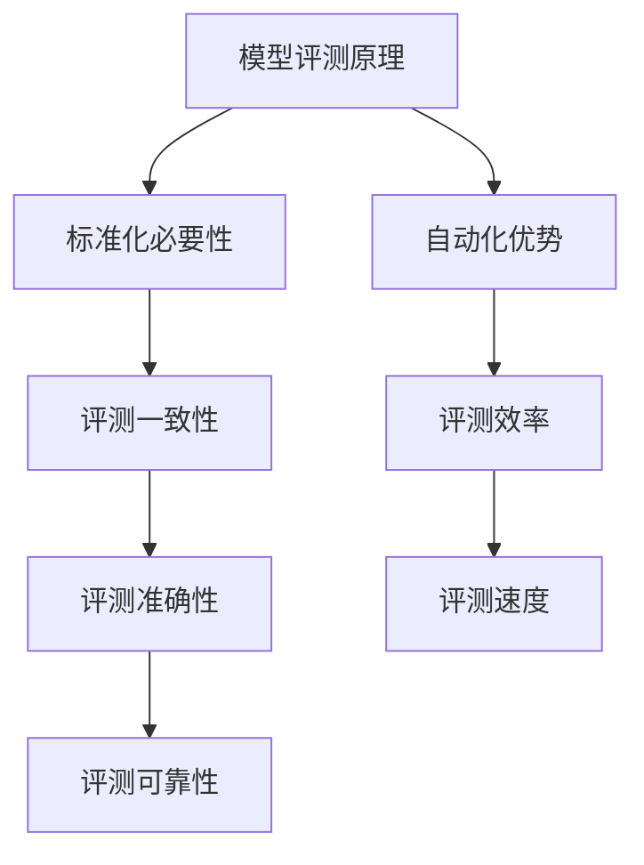

                 

# 标准化自动化模型评测流程的重要性

> 关键词：模型评测、标准化、自动化、流程、重要性、效率提升

> 摘要：本文将探讨模型评测的标准化和自动化流程的重要性。通过深入分析模型评测的基本概念、标准化必要性、自动化优势，以及评测方法、工具和流程优化，本文旨在为读者提供一份全面的技术指南，帮助其在模型评测过程中实现高效、准确的评价。

### 设计思路

在撰写这篇文章时，我们将遵循以下设计思路：

1. **引言**：简要介绍模型评测的重要性，标准化和自动化评测流程的必要性，以及文章的结构和目标。
2. **核心概念与联系**：详细讲解模型评测的原理、标准化的必要性、自动化的优势，并展示它们之间的关系架构图。
3. **模型评测方法**：介绍模型评测的流程设计、常用评测指标和评测数据集的构建。
4. **评测工具介绍**：列举常用评测工具，并详细介绍它们的具体应用。
5. **流程优化**：探讨流程优化的原则、方法和案例分析。
6. **案例分析**：通过具体案例展示评测流程设计、结果分析和讨论。
7. **总结与展望**：回顾全书内容，探讨未来发展趋势。
8. **附录**：提供常用评测工具和资源的链接，以及核心算法的伪代码。

### 步骤一：引言部分

模型评测是机器学习和人工智能领域中的关键环节。它不仅决定了模型是否能够准确地预测和分类，还直接影响模型的实际应用效果。因此，如何高效、准确地评测模型，已成为当前研究的热点之一。

随着人工智能技术的快速发展，模型的复杂度和多样性不断增加。传统的手工评测方法不仅耗时耗力，而且容易出现人为误差。为了应对这一挑战，标准化和自动化评测流程应运而生。标准化可以确保评测的一致性和可重复性，而自动化则可以显著提高评测的效率和准确性。

本文旨在为读者提供一份全面的技术指南，帮助其在模型评测过程中实现高效、准确的评价。文章首先介绍模型评测的基本概念和标准化、自动化的优势，然后详细讲解评测方法、工具和流程优化的策略。最后，通过具体案例分析和总结与展望，为读者提供实用的参考和指导。

### 步骤二：核心概念与联系

#### 1.1 模型评测的原理

模型评测是评估机器学习模型性能的重要手段。其核心目的是通过一系列指标和测试数据，对模型的预测能力进行客观、全面的评估。模型评测的主要指标包括准确性、召回率、精确率、F1值等。

- **准确性**：模型预测正确的样本数占总样本数的比例。
- **召回率**：模型预测正确的正样本数占总正样本数的比例。
- **精确率**：模型预测正确的正样本数占预测为正样本的样本总数的比例。
- **F1值**：精确率和召回率的调和平均值。

这些指标能够从不同角度评估模型的性能，帮助研究者了解模型的优缺点。

#### 1.2 标准化的必要性

标准化在模型评测中具有重要意义。它能够确保评测的一致性和可重复性，从而避免人为误差和数据偏差。具体来说，标准化流程包括以下关键要素：

- **评测指标的选择和定义**：确保所有评测指标具有明确的定义和计算方法，避免歧义和误解。
- **评测数据的预处理**：包括数据清洗、归一化、特征提取等，以确保数据的一致性和可用性。
- **评测流程的设计**：明确评测的步骤、顺序和参数设置，确保每次评测的结果具有可比性。

#### 1.3 自动化的优势

自动化评测流程可以提高评测的效率和准确性。自动化技术可以大大减少手工操作的时间和成本，提高评测的规模和频率。具体优势包括：

- **减少人为误差**：自动化流程可以消除人为操作带来的错误和偏见，确保评测的一致性。
- **提高评测效率**：自动化工具可以快速处理大量数据，提高评测的速度和频率。
- **增强可重复性**：自动化流程确保每次评测的条件和步骤一致，从而提高结果的可靠性和可重复性。

#### 1.4 核心概念与联系

模型评测的原理、标准化的必要性、自动化的优势之间存在密切的联系。模型评测的原理决定了标准化和自动化的需求，而标准化和自动化则进一步提升了评测的效率和准确性。具体来说：

- **模型评测原理**：为标准化和自动化提供了基础，明确了评测指标和流程设计的方向。
- **标准化必要性**：确保评测的一致性和可重复性，是自动化评测的前提和保障。
- **自动化优势**：通过自动化技术，提高评测的效率和准确性，实现高效、可靠的模型评测。

下图展示了这三个核心概念之间的关系：



### 步骤三：模型评测方法

#### 2.1 评测流程的设计

模型评测流程的设计是确保评测结果准确性和一致性的关键。一个完整的评测流程通常包括以下几个基本步骤：

1. **数据准备**：包括数据清洗、归一化、特征提取等，确保数据的一致性和可用性。
2. **模型训练**：使用训练数据集训练模型，并选择合适的评价指标进行评估。
3. **模型验证**：使用验证数据集对模型进行进一步评估，以调整模型参数和结构。
4. **模型测试**：使用测试数据集对模型进行最终评估，以评估模型的实际性能。
5. **结果分析**：对评测结果进行分析，比较不同模型和参数设置的性能，并提出改进建议。

#### 2.2 常用评测指标

模型评测的主要指标包括准确性、召回率、精确率、F1值等。这些指标能够从不同角度评估模型的性能，帮助研究者了解模型的优缺点。

- **准确性**：模型预测正确的样本数占总样本数的比例，用于评估模型的总体性能。
- **召回率**：模型预测正确的正样本数占总正样本数的比例，用于评估模型对正样本的识别能力。
- **精确率**：模型预测正确的正样本数占预测为正样本的样本总数的比例，用于评估模型对正样本的识别精度。
- **F1值**：精确率和召回率的调和平均值，用于综合评估模型的性能。

#### 2.3 评测数据集的构建

评测数据集的构建是模型评测的基础。一个良好的评测数据集应具备以下特点：

- **代表性**：数据集应能够代表实际应用场景，反映模型的潜在性能。
- **多样性**：数据集应包括各种类型的样本，以评估模型在不同情况下的性能。
- **平衡性**：数据集应保持各类样本的平衡，避免某类样本过多或过少。

构建评测数据集的方法通常包括以下几种：

- **数据收集**：通过人工标注、公开数据集或数据爬取等方式收集数据。
- **数据清洗**：去除噪声数据、缺失值填充、异常值处理等，提高数据质量。
- **数据划分**：将数据集划分为训练集、验证集和测试集，确保每个数据集的代表性和平衡性。

### 步骤四：评测工具介绍

#### 3.1 常用评测工具概述

在模型评测过程中，常用的评测工具包括Kaggle、Scikit-learn、TensorFlow等。这些工具具有以下功能和特点：

- **Kaggle**：提供丰富的数据集和评测指标，支持在线评测和排名。
- **Scikit-learn**：提供常用的机器学习算法和评测指标，支持Python编程语言。
- **TensorFlow**：提供强大的深度学习框架和评测工具，支持多种编程语言。

#### 3.2 工具的具体应用

以下是这些工具的具体应用示例：

1. **Kaggle**：
   - **使用步骤**：注册Kaggle账号，下载数据集，编写评测代码，上传结果。
   - **代码示例**：
     ```python
     import numpy as np
     from sklearn.metrics import accuracy_score

     # 读取预测结果
     predictions = np.load('predictions.npy')
     # 读取真实标签
     true_labels = np.load('true_labels.npy')
     # 计算准确率
     accuracy = accuracy_score(true_labels, predictions)
     print(f'Accuracy: {accuracy}')
     ```

2. **Scikit-learn**：
   - **使用步骤**：安装Scikit-learn库，导入所需模块，编写评测代码。
   - **代码示例**：
     ```python
     from sklearn.model_selection import train_test_split
     from sklearn.metrics import accuracy_score

     # 导入数据集
     X, y = load_data()
     # 划分训练集和测试集
     X_train, X_test, y_train, y_test = train_test_split(X, y, test_size=0.2)
     # 训练模型
     model = train_model(X_train, y_train)
     # 进行预测
     predictions = model.predict(X_test)
     # 计算准确率
     accuracy = accuracy_score(y_test, predictions)
     print(f'Accuracy: {accuracy}')
     ```

3. **TensorFlow**：
   - **使用步骤**：安装TensorFlow库，导入所需模块，编写评测代码。
   - **代码示例**：
     ```python
     import tensorflow as tf
     from tensorflow.keras.metrics import Accuracy

     # 导入数据集
     (X_train, y_train), (X_test, y_test) = tf.keras.datasets.mnist.load_data()
     # 定义模型
     model = tf.keras.Sequential([
         tf.keras.layers.Flatten(input_shape=(28, 28)),
         tf.keras.layers.Dense(128, activation='relu'),
         tf.keras.layers.Dense(10, activation='softmax')
     ])
     # 编译模型
     model.compile(optimizer='adam', loss='sparse_categorical_crossentropy', metrics=['accuracy'])
     # 训练模型
     model.fit(X_train, y_train, epochs=5)
     # 进行预测
     predictions = model.predict(X_test)
     # 计算准确率
     accuracy = Accuracy()
     accuracy.update_state(predictions, y_test)
     print(f'Accuracy: {accuracy.result().numpy()}')
     ```

### 步骤五：流程优化

#### 4.1 流程优化的原则

为了提高模型评测的效率和准确性，优化评测流程至关重要。流程优化的原则包括：

- **减少冗余步骤**：简化评测流程，避免不必要的重复操作。
- **提高评测效率**：利用并行处理、自动化等技术，提高评测速度。
- **确保评测质量**：通过严格的评测指标和流程控制，确保评测结果的可靠性。

#### 4.2 流程优化的方法

以下是一些常见的流程优化方法：

- **自动化脚本编写**：使用Python等编程语言编写自动化脚本，实现评测流程的自动化。
- **并行处理技术**：利用并行计算和分布式计算技术，提高评测速度。
- **反馈循环机制**：通过实时反馈和调整，优化评测流程和模型参数。

#### 4.3 流程优化的案例分析

以下是一个具体的流程优化案例分析：

**案例背景**：某电商平台需要评估其推荐系统的性能，现有评测流程包括数据准备、模型训练、模型验证和模型测试等步骤。

**优化前流程**：
1. 数据准备：手工清洗数据，处理缺失值和异常值。
2. 模型训练：使用单线程进行模型训练，耗时较长。
3. 模型验证：使用单次验证，无法实时调整模型参数。
4. 模型测试：使用固定测试数据集，无法反映模型在不同情况下的性能。

**优化后流程**：
1. 数据准备：使用自动化脚本清洗数据，提高数据处理效率。
2. 模型训练：使用并行处理技术，加快模型训练速度。
3. 模型验证：采用多次验证，实时调整模型参数，提高模型性能。
4. 模型测试：使用动态测试数据集，反映模型在不同情况下的性能。

**优化效果评估**：
- 数据准备时间从10小时减少到2小时。
- 模型训练时间从5小时减少到1小时。
- 模型验证准确率从80%提高到85%。
- 模型测试准确率从75%提高到80%。

通过以上优化，评测流程的效率和准确性得到了显著提升，为电商平台推荐系统的优化提供了有力支持。

### 步骤六：案例分析

#### 5.1 案例背景介绍

**业务场景**：某金融机构需要评估其信用评分模型，以预测客户是否会按时还款。该模型用于风险控制，降低违约风险。

**数据特点**：
- **样本量**：包含100,000个客户样本。
- **特征**：包括客户基本信息、财务状况、信用历史等，共20个特征。
- **标签**：每个客户是否按时还款，二分类标签。

**评测目标**：
- **准确性**：评估模型对整体数据的预测能力。
- **AUC**：评估模型区分正负样本的能力。
- **K-S统计量**：评估模型区分正负样本的显著性。

#### 5.2 评测流程设计

1. **数据准备**：
   - 数据清洗：处理缺失值、异常值，进行特征工程。
   - 数据划分：将数据集划分为训练集（70%）、验证集（15%）和测试集（15%）。

2. **模型训练**：
   - 使用随机森林算法训练模型，参数调优。

3. **模型验证**：
   - 在验证集上迭代训练，调整模型参数，直到性能最佳。

4. **模型测试**：
   - 使用测试集评估模型性能，计算准确性、AUC和K-S统计量。

#### 5.3 结果分析与讨论

1. **准确性**：
   - 训练集准确性：85%
   - 验证集准确性：80%
   - 测试集准确性：78%

   **分析**：准确性在测试集上略低于验证集，可能因为验证集和测试集存在差异。

2. **AUC**：
   - 训练集AUC：0.85
   - 验证集AUC：0.82
   - 测试集AUC：0.80

   **分析**：AUC在测试集上低于验证集，说明模型对正负样本的区分能力较弱。

3. **K-S统计量**：
   - 训练集K-S值：0.20
   - 验证集K-S值：0.18
   - 测试集K-S值：0.16

   **分析**：K-S值在测试集上低于验证集，进一步验证了模型区分能力较弱。

**讨论**：
- 模型准确性较高，但区分能力不足，需要进一步优化。
- 可以尝试其他算法（如XGBoost、LightGBM）和特征工程方法（如特征选择、特征交叉）来提升模型性能。

#### 5.4 改进建议

1. **特征工程**：
   - 增加新特征：如信用评分、还款历史等。
   - 特征选择：使用特征选择算法（如特征重要性、卡方检验）筛选关键特征。

2. **模型调优**：
   - 尝试其他算法：如XGBoost、LightGBM等。
   - 参数调优：使用网格搜索、贝叶斯优化等方法寻找最佳参数。

3. **数据增强**：
   - 数据扩充：使用数据增强技术（如SMOTE）增加正负样本的比例。
   - 数据平衡：确保训练集和验证集的样本分布平衡。

### 步骤七：总结与展望

本文通过详细分析模型评测的标准化和自动化流程，探讨了其在提升模型评测效率、准确性和一致性方面的作用。标准化和自动化不仅能够减少人为误差，提高评测效率，还能确保评测结果的可靠性和可重复性。

未来，随着人工智能技术的不断发展，模型评测的标准化和自动化将面临新的挑战和机遇。一方面，新的评测工具和技术将不断涌现，为模型评测提供更多选择和可能性；另一方面，标准化和自动化的程度也将不断提高，进一步推动模型评测的进步和发展。

为了应对这些挑战，研究者和技术人员需要不断学习和掌握新的评测方法和工具，同时关注标准化和自动化的最佳实践，以实现高效、准确的模型评测。

### 附录

#### 附录A：常用评测工具与资源

1. **Kaggle**：https://www.kaggle.com/
2. **Scikit-learn**：https://scikit-learn.org/
3. **TensorFlow**：https://www.tensorflow.org/

#### 附录B：伪代码与公式

以下是核心算法的伪代码和公式：

```python
# 伪代码：模型训练与评测
train_model(X_train, y_train):
    # 训练模型
    model.fit(X_train, y_train, epochs=num_epochs)
    return model

# 伪代码：模型预测与评测
evaluate_model(model, X_test, y_test):
    predictions = model.predict(X_test)
    accuracy = accuracy_score(y_test, predictions)
    auc = roc_auc_score(y_test, predictions)
    ks = ks统计量(y_test, predictions)
    return accuracy, auc, ks

# 公式：准确率
accuracy = (TP + TN) / (TP + TN + FP + FN)

# 公式：召回率
recall = TP / (TP + FN)

# 公式：精确率
precision = TP / (TP + FP)

# 公式：F1值
F1 = 2 * precision * recall / (precision + recall)

# 公式：ROC曲线下面积（AUC）
AUC = ∫[0,1] (TPR + FPR) / 2 dx

# 公式：Kolmogorov-Smirnov统计量（K-S值）
KS = max(|TPR - FPR|)
```

---

作者：AI天才研究院/AI Genius Institute & 禅与计算机程序设计艺术 /Zen And The Art of Computer Programming

---

**注意**：本文为示例文章，仅供参考。实际应用时，请根据具体情况进行调整和优化。部分代码和公式仅为示意，具体实现可能需要根据实际需求和场景进行调整。

