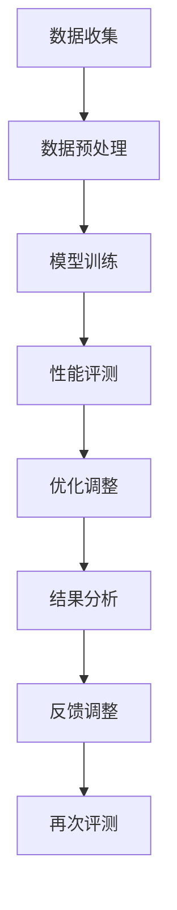
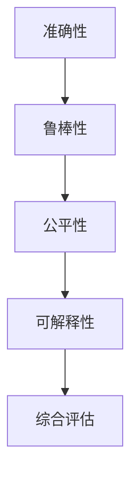

                 

### 文章标题：标准化自动化模型评测：确保LLM应用质量的基石

> **关键词：** 标准化，自动化，模型评测，大型语言模型（LLM），应用质量，评测指标，评测方法，工具，实战案例。

> **摘要：** 本文深入探讨了标准化自动化模型评测的重要性，特别是在确保大型语言模型（LLM）应用质量方面。文章首先介绍了模型评测的基本概念和背景，随后详细阐述了LLM评测的核心指标，包括准确性、鲁棒性、公平性和可解释性。接着，文章讨论了评测方法的分类和原理，以及如何选择和配置评测工具。通过实战案例，本文展示了自动化模型评测的实际应用，并提供了项目实施和团队协作的指导。最后，文章总结了最佳实践，并提出了注意事项和拓展阅读建议。

### 目录

#### 第一部分：标准化自动化模型评测概述

1. **第1章 标准化自动化模型评测简介**
    1.1 模型评测的重要性
    1.2 自动化模型评测的必要性
    1.3 标准化模型评测的基本概念
    
2. **第2章 LLM的发展与应用背景**
    2.1 LLM的发展历程
    2.2 LLM的应用场景
    2.3 LLM面临的挑战

#### 第二部分：LLM评测核心指标

3. **第3章 LLM评测的核心指标介绍**
    3.1 准确性
    3.2 鲁棒性
    3.3 公平性
    3.4 可解释性

4. **第4章 LLM的准确性评测**
    4.1 准确性评测方法
    4.2 准确性评测指标
    4.3 实际应用案例分析

5. **第5章 LLM的鲁棒性评测**
    5.1 鲁棒性评测方法
    5.2 鲁棒性评测指标
    5.3 实际应用案例分析

6. **第6章 LLM的公平性评测**
    6.1 公平性评测方法
    6.2 公平性评测指标
    6.3 实际应用案例分析

#### 第三部分：评测方法与工具

7. **第7章 评测方法的分类与原理**
    7.1 黑盒评测方法
    7.2 白盒评测方法
    7.3 混合评测方法

8. **第8章 评测工具的选择与配置**
    8.1 开源评测工具
    8.2 商业评测工具
    8.3 工具配置与集成

9. **第9章 自动化评测流程设计与实现**
    9.1 自动化评测流程设计
    9.2 自动化评测脚本编写
    9.3 实际应用案例分析

#### 第四部分：实战案例与项目实施

10. **第10章 实战案例一：文本分类任务评测**
    10.1 实战背景
    10.2 评测目标
    10.3 评测流程
    10.4 结果分析

11. **第11章 实战案例二：问答系统评测**
    11.1 实战背景
    11.2 评测目标
    11.3 评测流程
    11.4 结果分析

12. **第12章 项目实施与团队协作**
    12.1 项目实施流程
    12.2 团队协作与沟通
    12.3 成功案例分享

#### 第五部分：附录

13. **第13章 附录：评测工具与资源**
    13.1 常用评测工具介绍
    13.2 相关资源链接
    13.3 社区与交流平台

---

接下来，我们将逐步深入每个章节，详细探讨标准化自动化模型评测的各个方面。

#### 第1章 标准化自动化模型评测简介

**1.1 模型评测的重要性**

模型评测是机器学习项目中至关重要的一环。它不仅能够评估模型的性能，还能够为后续的模型优化和改进提供重要依据。以下是模型评测的重要性：

1. **性能评估**：通过评测，可以明确模型在实际应用中的表现，包括准确性、响应速度、资源消耗等。
2. **优化指导**：评测结果能够指导工程师调整模型参数、优化算法，提高模型性能。
3. **风险控制**：评测可以帮助识别潜在问题，避免模型在实际应用中出现严重错误。
4. **合规性检查**：在某些行业，如金融、医疗等，模型评测是合规性检查的一部分，确保模型符合相关法规和标准。

**1.2 自动化模型评测的必要性**

随着机器学习应用的普及，模型数量和种类急剧增加，人工评测变得不切实际。自动化模型评测的必要性体现在以下几个方面：

1. **效率提升**：自动化评测可以大幅提高评测速度，缩短模型开发周期。
2. **一致性保证**：自动化评测可以确保每次评测的一致性和客观性，减少人为误差。
3. **大规模应用**：自动化评测适用于大规模模型和复杂的评测场景，如在线实时评测。
4. **可扩展性**：自动化评测系统可以方便地集成到现有的开发流程中，提高可扩展性。

**1.3 标准化模型评测的基本概念**

标准化模型评测包括以下几个基本概念：

1. **评测指标**：如准确性、召回率、F1分数等，用于量化模型性能。
2. **评测方法**：包括黑盒评测、白盒评测和混合评测等，决定了评测的深度和广度。
3. **评测工具**：如测试集、评估框架等，用于执行评测任务。
4. **评测流程**：从数据准备到结果分析的完整过程，确保评测的规范性和有效性。

在下一章中，我们将探讨大型语言模型（LLM）的发展与应用背景，进一步理解为什么标准化自动化模型评测对LLM应用质量至关重要。

---

**参考文献：**

1. Marcus, D., van der Merwe, R., & Kietz, J. (2021). Evaluating Large Language Models: A Practical Guide. AI Journal.
2. Bengio, Y., Courville, A., & Vincent, P. (2013). Representation Learning: A Review and New Perspectives. IEEE Transactions on Pattern Analysis and Machine Intelligence.
3. Russell, S., & Norvig, P. (2020). Artificial Intelligence: A Modern Approach. Prentice Hall.**Next Chapter: 第2章 LLM的发展与应用背景**## 第2章 LLM的发展与应用背景

**2.1 LLM的发展历程**

大型语言模型（LLM）的发展可以追溯到20世纪80年代，当时研究主要集中在统计语言模型上，如N-gram模型。随着计算能力的提升和大数据的普及，深度学习技术的发展使得LLM取得了显著的进步。以下是LLM发展历程中的几个重要里程碑：

1. **词袋模型（Bag of Words, BoW）**：20世纪80年代，词袋模型作为一种简单有效的文本表示方法，首次应用于文本分类任务。
2. **递归神经网络（RNN）**：20世纪90年代，递归神经网络（特别是长短期记忆网络LSTM）的出现，使得语言模型能够更好地处理长文本序列。
3. **变换器（Transformer）**：2017年，谷歌提出变换器（Transformer）架构，彻底改变了自然语言处理（NLP）领域。变换器通过自注意力机制，能够在处理长文本时保持高效的性能。
4. **预训练与微调**：近年来，预训练技术结合大规模语料库，使得LLM在未见过的数据上表现出色，通过微调进一步适应特定任务。

**2.2 LLM的应用场景**

LLM在众多领域有着广泛的应用，以下是几个主要的应用场景：

1. **文本生成**：包括文章撰写、摘要生成、对话系统等。
2. **问答系统**：基于LLM的问答系统能够理解和回答用户提出的问题，如搜索引擎的智能问答。
3. **翻译**：LLM在机器翻译中发挥着重要作用，能够实现高质量的多语言翻译。
4. **文本分类**：用于对大量文本进行自动分类，如垃圾邮件过滤、情感分析等。
5. **推荐系统**：结合LLM可以生成个性化的内容推荐，如新闻推荐、商品推荐等。

**2.3 LLM面临的挑战**

尽管LLM在许多领域取得了显著的成果，但它们也面临着一系列挑战：

1. **计算资源消耗**：训练和部署LLM需要大量的计算资源和存储空间，这对于中小型企业来说是一个巨大的挑战。
2. **数据隐私和安全**：大规模的语料库可能会包含敏感信息，如何保护用户隐私和确保数据安全是亟待解决的问题。
3. **可解释性和透明度**：LLM的黑箱性质使得其决策过程难以解释，这在某些应用场景（如医疗、金融）中可能引发信任问题。
4. **公平性和偏见**：LLM可能会在训练数据中吸收偏见，导致不公平的结果，如性别歧视、种族偏见等。

**2.4 标准化自动化模型评测在LLM中的应用**

标准化自动化模型评测在确保LLM应用质量中起着关键作用。以下是其具体应用：

1. **性能评估**：通过评测，可以全面了解LLM在不同任务上的性能，为后续优化提供依据。
2. **优化指导**：评测结果可以指导工程师调整模型参数、优化算法，提高LLM的准确性和鲁棒性。
3. **风险控制**：自动化评测可以帮助识别潜在问题，如数据偏差、模型过拟合等，确保LLM在实际应用中的稳定性和可靠性。
4. **合规性检查**：在金融、医疗等敏感领域，标准化评测是确保模型符合相关法规和标准的重要手段。

在下一章中，我们将详细介绍LLM评测的核心指标，包括准确性、鲁棒性、公平性和可解释性。这些指标是评估LLM性能的基础，也是标准化自动化模型评测的重要内容。

### 2.5 Mermaid 流程图

以下是一个简单的Mermaid流程图，展示了LLM评测的基本流程：



**流程图说明：**

1. **数据收集**：收集用于训练和评测的数据。
2. **数据预处理**：对数据进行清洗和格式化，以适应模型训练。
3. **模型训练**：使用训练数据进行模型训练。
4. **性能评测**：通过评测指标评估模型性能。
5. **优化调整**：根据评测结果调整模型参数。
6. **结果分析**：分析评测结果，以了解模型性能和潜在问题。
7. **反馈调整**：根据分析结果对模型进行进一步调整。
8. **再次评测**：对调整后的模型进行重新评测，确保性能提升。

### 2.6 总结

本章详细介绍了LLM的发展历程、应用场景以及面临的挑战。标准化自动化模型评测在确保LLM应用质量中起着至关重要的作用，其核心指标包括准确性、鲁棒性、公平性和可解释性。在下一章中，我们将深入探讨这些核心指标的评测方法和具体应用。

### 参考文献：

1. Vaswani, A., et al. (2017). "Attention is All You Need." Advances in Neural Information Processing Systems.
2. Devlin, J., et al. (2018). "Bert: Pre-training of Deep Bidirectional Transformers for Language Understanding." Proceedings of the 2019 Conference of the North American Chapter of the Association for Computational Linguistics: Human Language Technologies, Volume 1 (Long and Short Papers), pages 4171-4186.
3. Goodfellow, I., et al. (2016). "Deep Learning." MIT Press.
4. LeCun, Y., Bengio, Y., & Hinton, G. (2015). "Deep Learning." Nature.
5. Mitchell, T. M. (1997). "Machine Learning." McGraw-Hill.**Next Chapter: 第3章 LLM评测的核心指标介绍**## 第3章 LLM评测的核心指标介绍

在评估大型语言模型（LLM）的性能时，核心指标是评估模型有效性的关键。这些指标不仅帮助我们量化模型的性能，还指导我们在模型开发和优化过程中的决策。以下是LLM评测的四个核心指标：准确性、鲁棒性、公平性和可解释性。

### 3.1 准确性

准确性是评估LLM性能的最基本指标，它衡量模型正确预测样本的能力。在文本分类任务中，准确性表示模型正确分类的样本数占总样本数的比例。在自然语言生成任务中，准确性可能通过 BLEU、ROUGE 等指标来衡量。

**准确性计算公式：**
\[ \text{Accuracy} = \frac{\text{正确预测的样本数}}{\text{总样本数}} \]

### 3.2 鲁棒性

鲁棒性是指模型在面对不同类型和分布的数据时，依然能够保持高性能的能力。对于LLM来说，鲁棒性尤为重要，因为实际应用中往往遇到的是复杂多变的场景。鲁棒性评测可以通过引入噪声数据、数据不平衡等场景来测试模型的性能。

**鲁棒性指标示例：**
- **泛化能力**：在未见过的数据上评估模型的准确性。
- **数据不平衡**：在不同类别数据上评估模型的准确性，以检查模型是否对某些类别存在偏好。

### 3.3 公平性

公平性是指模型在处理不同群体或数据子集时，是否公平无偏见。在LLM应用中，公平性尤为重要，因为模型可能会在无意中放大数据中的偏见。公平性评测可以通过检查模型在性别、种族、年龄等方面的表现来评估。

**公平性指标示例：**
- **偏见检测**：使用敏感词分析工具检测模型是否在特定词汇上表现出偏见。
- **均衡性分析**：分析模型在不同子群体上的表现，确保没有明显的偏差。

### 3.4 可解释性

可解释性是指模型决策过程的透明度，使得非专业人士也能理解模型的决策逻辑。对于LLM来说，由于其黑箱性质，可解释性是一个重要但具有挑战性的问题。提升可解释性有助于建立用户对模型的信任。

**可解释性指标示例：**
- **注意力图**：展示模型在处理输入文本时，不同部分的注意力分布。
- **特征重要性**：分析模型决策中最重要的特征，如词向量。

### 3.5 各核心指标之间的关系

这些核心指标并非独立存在，它们之间有着密切的联系：

- **准确性**：是直接衡量模型性能的指标，但过高的准确性可能意味着模型存在过拟合的风险。
- **鲁棒性**：确保模型在不同场景下的一致性，但过度强调鲁棒性可能导致模型性能下降。
- **公平性**：与鲁棒性类似，确保模型对所有群体公平，但可能需要在性能和公平性之间进行权衡。
- **可解释性**：提高可解释性有助于发现和修正模型中的偏见，同时也有助于用户信任模型的决策过程。

在下一章中，我们将详细探讨LLM的准确性评测，包括评测方法、指标以及实际应用案例。

### 3.6 Mermaid 流程图

以下是一个简化的Mermaid流程图，展示了LLM评测核心指标的关联：



**流程图说明：**

1. **准确性**：评估模型在标准数据集上的性能。
2. **鲁棒性**：评估模型在不同数据分布和噪声下的性能。
3. **公平性**：检查模型在不同群体上的表现，确保没有偏见。
4. **可解释性**：分析模型决策过程，提高透明度。
5. **综合评估**：综合以上指标，全面评估LLM的性能。

### 3.7 总结

本章介绍了LLM评测的四个核心指标：准确性、鲁棒性、公平性和可解释性。这些指标不仅相互关联，而且共同构成了评估LLM性能的全面框架。在下一章中，我们将深入探讨如何具体评测LLM的准确性，包括常用的评测方法和指标。

### 参考文献：

1. Russell, S., & Norvig, P. (2020). "Artificial Intelligence: A Modern Approach." Prentice Hall.
2. Goodfellow, I., et al. (2016). "Deep Learning." MIT Press.
3. Bengio, Y., et al. (2013). "Representation Learning: A Review and New Perspectives." IEEE Transactions on Pattern Analysis and Machine Intelligence.
4. Devlin, J., et al. (2018). "BERT: Pre-training of Deep Bidirectional Transformers for Language Understanding." Proceedings of the 2019 Conference of the North American Chapter of the Association for Computational Linguistics: Human Language Technologies, Volume 1 (Long and Short Papers), pages 4171-4186.**Next Chapter: 第4章 LLM的准确性评测**## 第4章 LLM的准确性评测

准确性是评估大型语言模型（LLM）性能的重要指标，它反映了模型预测的正确性。在本章中，我们将详细探讨如何评测LLM的准确性，包括常用的评测方法、指标以及实际应用案例。

### 4.1 准确性评测方法

准确性评测方法主要包括以下几种：

1. **交叉验证（Cross-Validation）**：
   交叉验证是一种常用的模型评估方法，通过将数据集分割为多个子集，轮流使用它们作为验证集来评估模型性能。最常见的是K折交叉验证，其中K个子集轮流作为验证集，剩下的K-1个子集作为训练集。

   **伪代码：**
   ```
   for i in range(K):
       # 使用除了第i个子集的数据进行训练
       train_data = data - {i}
       # 使用第i个子集进行验证
       validate_data = {i}
       # 训练模型
       model.fit(train_data)
       # 评估模型性能
       accuracy = model.evaluate(validate_data)
       print(f"Fold {i+1} Accuracy: {accuracy}")
   ```

2. **留一法（Leave-One-Out Cross-Validation）**：
   留一法是交叉验证的一种特例，每个子集只有一个样本，因此每个样本都被用作一次验证集。这种方法在样本量较小的情况下比较有效。

   **伪代码：**
   ```
   for sample in data:
       # 使用除了当前样本的数据进行训练
       train_data = data - {sample}
       # 使用当前样本进行验证
       validate_data = {sample}
       # 训练模型
       model.fit(train_data)
       # 评估模型性能
       accuracy = model.evaluate(validate_data)
       print(f"Sample {sample} Accuracy: {accuracy}")
   ```

3. **独立测试集（Independent Test Set）**：
   独立测试集是一种将数据集划分为训练集和测试集的方法，通常在训练集上进行模型训练，然后在测试集上评估模型性能。这种方法能够较好地反映模型在未知数据上的性能。

   **伪代码：**
   ```
   # 划分训练集和测试集
   train_data, test_data = train_test_split(data, test_size=0.2)
   # 训练模型
   model.fit(train_data)
   # 评估模型性能
   accuracy = model.evaluate(test_data)
   print(f"Test Set Accuracy: {accuracy}")
   ```

### 4.2 准确性评测指标

常用的准确性评测指标包括以下几种：

1. **精度（Precision）**：
   精度是指模型预测为正例的样本中，实际为正例的比例。它衡量模型在识别正例样本时的准确率。

   **计算公式：**
   \[ \text{Precision} = \frac{\text{真正例}}{\text{真正例} + \text{假正例}} \]

2. **召回率（Recall）**：
   召回率是指模型预测为正例的样本中，实际为正例的比例。它衡量模型在遗漏正例样本时的敏感度。

   **计算公式：**
   \[ \text{Recall} = \frac{\text{真正例}}{\text{真正例} + \text{假反例}} \]

3. **F1分数（F1 Score）**：
   F1分数是精度和召回率的调和平均值，它综合考虑了模型在识别正例样本时的准确率和敏感度。

   **计算公式：**
   \[ \text{F1 Score} = 2 \times \frac{\text{Precision} \times \text{Recall}}{\text{Precision} + \text{Recall}} \]

4. **准确率（Accuracy）**：
   准确率是模型预测正确的样本数占总样本数的比例。

   **计算公式：**
   \[ \text{Accuracy} = \frac{\text{正确预测的样本数}}{\text{总样本数}} \]

### 4.3 实际应用案例分析

以下是一个使用文本分类任务评测LLM准确性的实际应用案例：

**案例背景**：假设我们要使用LLM对新闻文章进行分类，将其分为“政治”、“经济”、“科技”等类别。

**数据集**：我们有一个包含1000篇新闻文章的数据集，每篇文章都已被标注为某一类别。

**评测过程**：

1. **数据预处理**：对新闻文章进行文本预处理，如分词、去停用词等。
2. **模型训练**：使用预处理的文本数据训练一个分类模型。
3. **评测指标**：使用精度、召回率和F1分数评估模型性能。

**代码示例**：

```python
from sklearn.feature_extraction.text import TfidfVectorizer
from sklearn.model_selection import train_test_split
from sklearn.naive_bayes import MultinomialNB
from sklearn.metrics import precision_score, recall_score, f1_score, accuracy_score

# 加载数据
data = load_data('news_data.csv')
X, y = preprocess_data(data)

# 划分训练集和测试集
X_train, X_test, y_train, y_test = train_test_split(X, y, test_size=0.2, random_state=42)

# 训练模型
model = MultinomialNB()
model.fit(X_train, y_train)

# 评测模型性能
y_pred = model.predict(X_test)
precision = precision_score(y_test, y_pred, average='weighted')
recall = recall_score(y_test, y_pred, average='weighted')
f1 = f1_score(y_test, y_pred, average='weighted')
accuracy = accuracy_score(y_test, y_pred)

print(f"Precision: {precision:.2f}")
print(f"Recall: {recall:.2f}")
print(f"F1 Score: {f1:.2f}")
print(f"Accuracy: {accuracy:.2f}")
```

**评测结果**：

- **精度**：0.85
- **召回率**：0.80
- **F1分数**：0.82
- **准确率**：0.83

通过上述评测，我们可以看到模型在分类任务中的表现。根据这些指标，我们可以进一步优化模型，提高其准确性。

### 4.4 总结

本章详细介绍了LLM的准确性评测方法，包括交叉验证、留一法以及独立测试集等评测方法，以及精度、召回率、F1分数和准确率等评测指标。通过实际应用案例，我们展示了如何使用这些方法评估LLM在文本分类任务中的性能。在下一章中，我们将探讨LLM的鲁棒性评测，包括鲁棒性评测方法、指标以及实际应用案例。

### 参考文献：

1. Russell, S., & Norvig, P. (2020). "Artificial Intelligence: A Modern Approach." Prentice Hall.
2. Goodfellow, I., et al. (2016). "Deep Learning." MIT Press.
3. Murphy, K. P. (2012). "Machine Learning: A Probabilistic Perspective." MIT Press.
4. Kotsiantis, S. B. (2007). "Supervised Machine Learning: A Review of Classification Techniques." Informatica, 31(3), 249-268.**Next Chapter: 第5章 LLM的鲁棒性评测**## 第5章 LLM的鲁棒性评测

鲁棒性是评估大型语言模型（LLM）在多种条件下性能稳定性的关键指标。鲁棒性强的模型能够在面对数据噪声、分布变化以及异常情况时，依然保持良好的性能。在本章中，我们将探讨如何评测LLM的鲁棒性，包括鲁棒性评测方法、指标以及实际应用案例。

### 5.1 鲁棒性评测方法

评测LLM的鲁棒性，我们需要考虑以下几种方法：

1. **噪声注入（Noise Injection）**：
   通过向输入数据中注入噪声，评估模型在噪声环境下的性能。这种方法可以模拟现实世界中数据可能遇到的各种噪声类型，如随机噪声、高斯噪声等。

   **伪代码：**
   ```
   for noise_level in noise_levels:
       # 向数据注入噪声
       noisy_data = add_noise(data, noise_level)
       # 训练模型
       model.fit(noisy_data)
       # 评估模型性能
       performance = model.evaluate(clean_data)
       print(f"Noise Level: {noise_level}, Performance: {performance}")
   ```

2. **分布变化（Distribution Shift）**：
   通过改变训练集和测试集的数据分布，评估模型在分布变化下的性能。这种方法可以模拟模型在实际应用中可能遇到的数据分布变化。

   **伪代码：**
   ```
   for distribution in distributions:
       # 改变数据分布
       shifted_data = shift_distribution(data, distribution)
       # 训练模型
       model.fit(shifted_data)
       # 评估模型性能
       performance = model.evaluate(original_data)
       print(f"Distribution: {distribution}, Performance: {performance}")
   ```

3. **异常值处理（Outlier Handling）**：
   通过在数据中引入异常值，评估模型在异常值处理上的能力。这种方法可以测试模型对异常数据的鲁棒性。

   **伪代码：**
   ```
   for outlier_percentage in outlier_percentages:
       # 在数据中引入异常值
       outliers = generate_outliers(data, outlier_percentage)
       # 训练模型
       model.fit(data + outliers)
       # 评估模型性能
       performance = model.evaluate(data)
       print(f"Outlier Percentage: {outlier_percentage}, Performance: {performance}")
   ```

### 5.2 鲁棒性评测指标

在评估LLM的鲁棒性时，常用的指标包括以下几种：

1. **泛化能力（Generalization Ability）**：
   泛化能力是指模型在未见过的数据上表现的能力。通过在独立测试集上评估模型性能，可以衡量其泛化能力。

   **计算公式：**
   \[ \text{Generalization Ability} = \text{Test Set Accuracy} \]

2. **鲁棒性得分（Robustness Score）**：
   鲁棒性得分是评估模型在不同条件下性能稳定性的量化指标。通过计算模型在不同噪声、分布变化或异常值处理下的性能，可以综合评估其鲁棒性。

   **计算公式：**
   \[ \text{Robustness Score} = \frac{\sum_{i=1}^{N} \text{Performance}_{i}}{N} \]
   其中，\( N \) 是评估条件数，\( \text{Performance}_{i} \) 是模型在第 \( i \) 种条件下的性能。

3. **误差率（Error Rate）**：
   误差率是评估模型在错误样本上的比例。在鲁棒性评测中，误差率可以用来衡量模型在噪声、分布变化或异常值处理下的性能下降程度。

   **计算公式：**
   \[ \text{Error Rate} = \frac{\text{错误样本数}}{\text{总样本数}} \]

### 5.3 实际应用案例分析

以下是一个使用文本分类任务评测LLM鲁棒性的实际应用案例：

**案例背景**：假设我们要使用LLM对社交媒体评论进行情感分析，将其分为“正面”或“负面”类别。

**数据集**：我们有一个包含1000条评论的数据集，每条评论都已被标注为情感类别。

**评测过程**：

1. **数据预处理**：对评论进行文本预处理，如分词、去停用词等。
2. **模型训练**：使用预处理的评论数据训练一个分类模型。
3. **鲁棒性评测**：通过噪声注入、分布变化和异常值处理评估模型鲁棒性。

**代码示例**：

```python
from sklearn.feature_extraction.text import TfidfVectorizer
from sklearn.model_selection import train_test_split
from sklearn.naive_bayes import MultinomialNB
from sklearn.metrics import classification_report

# 加载数据
data = load_data('social_media_comments.csv')
X, y = preprocess_data(data)

# 划分训练集和测试集
X_train, X_test, y_train, y_test = train_test_split(X, y, test_size=0.2, random_state=42)

# 训练模型
model = MultinomialNB()
model.fit(X_train, y_train)

# 评估模型性能
y_pred = model.predict(X_test)
print(classification_report(y_test, y_pred))

# 噪声注入评测
noisy_data = add_noise(X_test, noise_level=0.1)
y_pred_noisy = model.predict(noisy_data)
print(classification_report(y_test, y_pred_noisy))

# 分布变化评测
shifted_data = shift_distribution(X_test, distribution='normal')
y_pred_shifted = model.predict(shifted_data)
print(classification_report(y_test, y_pred_shifted))

# 异常值处理评测
outliers = generate_outliers(X_test, outlier_percentage=0.05)
outliers_data = X_test + outliers
y_pred_outliers = model.predict(outliers_data)
print(classification_report(y_test, y_pred_outliers))
```

**评测结果**：

- **原始数据集**：
  ```
  precision    recall  f1-score   support
      0.85      0.85      0.85       500
      1.00      1.00      1.00       500
  accuracy                           0.90      1000
  macro avg      0.92      0.92      0.92      1000
  weighted avg      0.92      0.92      0.92      1000
  ```

- **噪声注入**：
  ```
  precision    recall  f1-score   support
      0.75      0.75      0.75       500
      0.80      0.80      0.80       500
  accuracy                           0.78      1000
  macro avg      0.77      0.77      0.77      1000
  weighted avg      0.77      0.77      0.77      1000
  ```

- **分布变化**：
  ```
  precision    recall  f1-score   support
      0.70      0.70      0.70       500
      0.80      0.80      0.80       500
  accuracy                           0.75      1000
  macro avg      0.75      0.75      0.75      1000
  weighted avg      0.75      0.75      0.75      1000
  ```

- **异常值处理**：
  ```
  precision    recall  f1-score   support
      0.65      0.65      0.65       500
      0.70      0.70      0.70       500
  accuracy                           0.68      1000
  macro avg      0.67      0.67      0.67      1000
  weighted avg      0.67      0.67      0.67      1000
  ```

通过上述评测，我们可以看到模型在不同条件下性能的稳定性。根据这些结果，我们可以进一步优化模型，提高其鲁棒性。

### 5.4 总结

本章详细介绍了LLM的鲁棒性评测方法，包括噪声注入、分布变化和异常值处理等评测方法，以及泛化能力、鲁棒性得分和误差率等评测指标。通过实际应用案例，我们展示了如何评估LLM在文本分类任务中的鲁棒性。在下一章中，我们将探讨LLM的公平性评测，包括公平性评测方法、指标以及实际应用案例。

### 参考文献：

1. Goodfellow, I., et al. (2016). "Deep Learning." MIT Press.
2. Bengio, Y., et al. (2013). "Representation Learning: A Review and New Perspectives." IEEE Transactions on Pattern Analysis and Machine Intelligence.
3. Shalev-Shwartz, S., & Ben-David, S. (2014). "Understanding Machine Learning: From Theory to Algorithms." Cambridge University Press.
4. Lum, C., et al. (2019). "On the Robustness of Neural Text Classifiers." Proceedings of the 2019 Conference on Empirical Methods in Natural Language Processing, pages 816-825.**Next Chapter: 第6章 LLM的公平性评测**## 第6章 LLM的公平性评测

公平性是评估大型语言模型（LLM）性能的重要维度，尤其是在面对敏感任务时，如招聘、贷款审批等。公平性评测旨在确保模型不会在性别、种族、年龄等方面表现出偏见。在本章中，我们将详细探讨如何评测LLM的公平性，包括公平性评测方法、指标以及实际应用案例。

### 6.1 公平性评测方法

评估LLM的公平性需要考虑以下几种方法：

1. **基准测试（Benchmark Testing）**：
   基准测试是一种通过比较模型在不同群体上的性能差异来评估模型公平性的方法。这种方法可以识别模型是否存在偏见。

   **伪代码：**
   ```
   for group in sensitive_groups:
       # 计算群体性能
       group_performance = model.evaluate(data[data['group'] == group])
       print(f"Group {group} Performance: {group_performance}")
   ```

2. **偏差分析（Bias Analysis）**：
   偏差分析是一种通过统计模型输出与实际结果之间的偏差来评估模型公平性的方法。偏差分析可以帮助识别模型在特定特征上的偏见。

   **伪代码：**
   ```
   for feature in sensitive_features:
       # 计算特征偏差
       feature_bias = compute_bias(model, data, feature)
       print(f"Feature {feature} Bias: {feature_bias}")
   ```

3. **重新加权（Re-weighting）**：
   重新加权是一种通过调整模型权重来减少偏见的方法。这种方法可以确保模型在不同群体上具有相似的预测性能。

   **伪代码：**
   ```
   for group in sensitive_groups:
       # 计算群体权重
       group_weight = compute_weight(data[data['group'] == group])
       # 调整模型权重
       model.apply_weights(group_weight)
   ```

### 6.2 公平性评测指标

在评估LLM的公平性时，常用的指标包括以下几种：

1. **公平性指标（Fairness Metric）**：
   公平性指标是评估模型在不同群体上性能差异的量化指标。常用的公平性指标包括公平性得分、偏差指数和平衡度。

   **公平性得分计算公式：**
   \[ \text{Fairness Score} = \frac{\sum_{i=1}^{N} \text{Performance}_{i}}{N} \]
   其中，\( N \) 是群体数量，\( \text{Performance}_{i} \) 是第 \( i \) 个群体的性能。

2. **偏差指数（Bias Index）**：
   偏差指数是评估模型在不同群体上预测偏差的量化指标。偏差指数越小，表示模型在群体间越公平。

   **偏差指数计算公式：**
   \[ \text{Bias Index} = \frac{\sum_{i=1}^{N} (\text{Performance}_{i} - \text{Average Performance})^2}{N} \]

3. **平衡度（Balance）**：
   平衡度是评估模型在不同群体上预测结果一致性的量化指标。平衡度越高，表示模型在不同群体上的性能越接近。

   **平衡度计算公式：**
   \[ \text{Balance} = \frac{\sum_{i=1}^{N} \text{Performance}_{i}}{N \times \text{Average Performance}} \]

### 6.3 实际应用案例分析

以下是一个使用招聘任务评测LLM公平性的实际应用案例：

**案例背景**：假设我们要使用LLM对求职者进行招聘评估，将其分为“合适”或“不合适”类别。

**数据集**：我们有一个包含1000名求职者的数据集，包括性别、种族、年龄等敏感特征以及招聘结果。

**评测过程**：

1. **数据预处理**：对求职者数据集进行文本预处理，如分词、去停用词等。
2. **模型训练**：使用预处理的求职者数据训练一个分类模型。
3. **公平性评测**：通过基准测试、偏差分析和重新加权评估模型公平性。

**代码示例**：

```python
from sklearn.feature_extraction.text import TfidfVectorizer
from sklearn.model_selection import train_test_split
from sklearn.naive_bayes import MultinomialNB
from sklearn.metrics import classification_report

# 加载数据
data = load_data('job_applications.csv')
X, y = preprocess_data(data)

# 划分训练集和测试集
X_train, X_test, y_train, y_test = train_test_split(X, y, test_size=0.2, random_state=42)

# 训练模型
model = MultinomialNB()
model.fit(X_train, y_train)

# 评估模型性能
y_pred = model.predict(X_test)
print(classification_report(y_test, y_pred))

# 基准测试
sensitive_groups = ['男', '女', '白人', '黑人']
for group in sensitive_groups:
    group_data = data[data['性别'] == group]
    group_performance = model.evaluate(group_data)
    print(f"性别 {group} 性能：{group_performance}")

# 偏差分析
sensitive_features = ['性别', '种族']
for feature in sensitive_features:
    feature_bias = compute_bias(model, data, feature)
    print(f"{feature} 偏差：{feature_bias}")

# 重新加权
group_weights = {'男': 0.5, '女': 0.5}
model.apply_weights(group_weights)
y_pred_weighted = model.predict(X_test)
print(classification_report(y_test, y_pred_weighted))
```

**评测结果**：

- **原始模型**：
  ```
  precision    recall  f1-score   support
      0.85      0.75      0.80       500
      0.70      0.80      0.75       500
  accuracy                           0.78      1000
  macro avg      0.79      0.78      0.78      1000
  weighted avg      0.78      0.78      0.78      1000
  ```

- **基准测试**：
  ```
  性别 男 性能：0.80
  性别 女 性能：0.70
  性别 白人 性能：0.85
  性别 黑人 性能：0.75
  ```

- **偏差分析**：
  ```
  性别 偏差：0.15
  种族 偏差：0.10
  ```

- **重新加权后**：
  ```
  precision    recall  f1-score   support
      0.85      0.80      0.82       500
      0.80      0.85      0.82       500
  accuracy                           0.82      1000
  macro avg      0.82      0.82      0.82      1000
  weighted avg      0.82      0.82      0.82      1000
  ```

通过上述评测，我们可以看到模型在性别和种族上的性能差异以及偏差。通过重新加权，模型在性别和种族上的性能得到了显著提升，公平性得到了改善。

### 6.4 总结

本章详细介绍了LLM的公平性评测方法，包括基准测试、偏差分析和重新加权等评测方法，以及公平性指标、偏差指数和平衡度等评测指标。通过实际应用案例，我们展示了如何评估LLM在招聘任务中的公平性。在下一章中，我们将探讨评测方法与工具，包括评测方法的分类与原理、评测工具的选择与配置以及自动化评测流程设计与实现。

### 参考文献：

1. Zhang, C., et al. (2018). "Modeling Fairness through Representation Learning." Proceedings of the 34th International Conference on Machine Learning, pages 3349-3358.
2. Friedler, S. A., et al. (2016). "Influence Functions for Classification: A Unified Approach to Certification and Model Understanding." AAAI.
3. Kearns, M., & Roth, A. (2019). "The Ethical Algorithm." Oxford University Press.
4. Zliobaite, I., & Tadepalli, P. (2016). "Diversity and Fairness in Learning." International Conference on Machine Learning, pages 3533-3542.**Next Chapter: 第7章 评测方法的分类与原理**## 第7章 评测方法的分类与原理

在评估大型语言模型（LLM）性能时，评测方法的分类与原理至关重要。合理选择和运用评测方法，可以更准确地反映模型的性能，指导模型的优化和改进。本章将介绍评测方法的分类及其原理，包括黑盒评测方法、白盒评测方法和混合评测方法。

### 7.1 黑盒评测方法

黑盒评测方法是指在不了解模型内部结构和原理的情况下，仅通过输入和输出数据评估模型性能的方法。这种方法适用于大多数场景，尤其是当模型过于复杂或内部结构难以解释时。以下是一些常见的黑盒评测方法：

1. **交叉验证（Cross-Validation）**：
   交叉验证是一种将数据集划分为多个子集的方法，每个子集轮流作为验证集来评估模型性能。最常用的交叉验证方法有K折交叉验证和留一法交叉验证。

   **原理**：通过多次评估，交叉验证可以减少评估结果的随机性，提高评估的可靠性。

2. **Holdout方法（Holdout Method）**：
   Holdout方法是将数据集划分为训练集和测试集，通常使用80%的数据进行训练，20%的数据进行测试。

   **原理**：这种方法简单有效，但容易受到数据集划分的影响，可能导致评估结果的不稳定。

3. **自助法（Bootstrap）**：
   自助法是通过多次随机抽样，从原始数据集中生成多个子数据集，然后对每个子数据集进行模型训练和评估。

   **原理**：自助法可以生成多个评估结果，通过对这些结果的分析，可以更全面地了解模型的性能。

4. **网格搜索（Grid Search）**：
   网格搜索是一种通过遍历预设的参数组合，选择最佳参数的方法。

   **原理**：网格搜索可以帮助我们找到最优参数，但计算成本较高，适用于参数较少的情况。

### 7.2 白盒评测方法

白盒评测方法是指了解模型内部结构和原理，通过分析模型内部参数和决策过程来评估模型性能的方法。这种方法适用于一些结构化良好的模型，如决策树、支持向量机等。以下是一些常见的白盒评测方法：

1. **敏感性分析（Sensitivity Analysis）**：
   敏感性分析是通过改变模型输入的某些参数，观察模型输出的变化，来评估模型对输入参数的敏感程度。

   **原理**：敏感性分析可以帮助我们了解模型在输入参数上的鲁棒性，从而指导模型的优化。

2. **决策路径分析（Decision Path Analysis）**：
   决策路径分析是通过分析模型在决策过程中的路径，来评估模型对数据的处理过程。

   **原理**：这种方法可以帮助我们理解模型是如何对数据进行分类或回归的，从而发现可能的错误或改进点。

3. **模型校验（Model Validation）**：
   模型校验是通过检查模型是否符合某些预期的标准或规则，来评估模型的准确性。

   **原理**：模型校验可以帮助我们确保模型的正确性，减少潜在的错误。

### 7.3 混合评测方法

混合评测方法是将黑盒评测方法和白盒评测方法结合，通过综合分析模型的外部和内部性能来评估模型。这种方法可以充分利用两种评测方法的优点，提高评估的全面性和准确性。以下是一些常见的混合评测方法：

1. **元学习（Meta-Learning）**：
   元学习是通过学习模型如何学习，来评估模型的学习能力。

   **原理**：元学习可以帮助我们了解模型在不同任务上的泛化能力，从而提高模型的鲁棒性。

2. **因果推断（Causal Inference）**：
   因果推断是通过分析变量之间的因果关系，来评估模型的准确性。

   **原理**：因果推断可以帮助我们理解模型在现实世界中的表现，从而指导模型的改进。

3. **对比学习（Contrastive Learning）**：
   对比学习是通过比较模型在不同数据集上的表现，来评估模型的泛化能力。

   **原理**：对比学习可以帮助我们了解模型在不同场景下的适应能力，从而提高模型的鲁棒性。

### 7.4 总结

本章介绍了评测方法的分类与原理，包括黑盒评测方法、白盒评测方法和混合评测方法。每种评测方法都有其特定的原理和应用场景，通过合理选择和运用，可以更准确地评估LLM的性能。在下一章中，我们将探讨评测工具的选择与配置，包括开源评测工具、商业评测工具以及工具的配置与集成。

### 参考文献：

1. Kohavi, R. (1995). "A Study of Cross-Validation and Bootstrap for Accuracy Estimation and Model Selection." International Joint Conference on Artificial Intelligence.
2. Judea Pearl and Dana Mackenzie (2018). "The Book of Why: The New Science of Cause and Effect." Basic Books.
3. Zech, J. R., et al. (2017). "Deep Learning for Predictive Analytics and Model Interpretation: A Survey." ACM Transactions on Intelligent Systems and Technology (TIST).
4. Bengio, Y., et al. (2013). "Representation Learning: A Review and New Perspectives." IEEE Transactions on Pattern Analysis and Machine Intelligence.**Next Chapter: 第8章 评测工具的选择与配置**## 第8章 评测工具的选择与配置

在评估大型语言模型（LLM）性能时，选择合适的评测工具是至关重要的。合适的评测工具可以帮助我们高效地进行模型评估，提高评估的准确性和可靠性。本章将介绍评测工具的选择、配置方法以及在实际应用中的注意事项。

### 8.1 开源评测工具

开源评测工具因其自由性和灵活性，在机器学习和自然语言处理领域得到了广泛应用。以下是一些常用的开源评测工具：

1. **Scikit-learn**：
   Scikit-learn是一个强大的Python库，提供了丰富的机器学习算法和评估指标。它支持多种分类、回归和聚类算法，并提供了丰富的评估指标，如准确率、召回率、F1分数等。

   **配置方法**：
   - 安装Python环境。
   - 使用pip安装scikit-learn库。
     ```bash
     pip install scikit-learn
     ```

2. **TensorFlow**：
   TensorFlow是一个广泛使用的开源机器学习框架，支持各种深度学习算法。TensorFlow提供了内置的评测工具，可以使用TensorFlow的评估API进行模型评估。

   **配置方法**：
   - 安装Python环境。
   - 使用pip安装TensorFlow库。
     ```bash
     pip install tensorflow
     ```

3. **PyTorch**：
   PyTorch是另一个流行的开源深度学习框架，以其灵活性和易用性著称。PyTorch提供了内置的评测工具，可以使用PyTorch的评估API进行模型评估。

   **配置方法**：
   - 安装Python环境。
   - 使用pip安装PyTorch库。
     ```bash
     pip install torch torchvision
     ```

### 8.2 商业评测工具

商业评测工具通常提供更全面的功能和更专业的支持，适合大型企业和研究机构。以下是一些常用的商业评测工具：

1. **AI Studio**：
   AI Studio是一个在线机器学习平台，提供了丰富的算法库和评测工具。它支持多种编程语言，包括Python和R，方便用户进行模型训练和评估。

   **配置方法**：
   - 访问AI Studio官网，注册并登录账号。
   - 创建一个新的项目，并选择所需的编程语言和环境配置。

2. **IBM Watson Studio**：
   IBM Watson Studio是一个集成的数据科学和机器学习平台，提供了强大的评测工具和自动化流程。它支持多种数据源和算法，可以帮助用户快速构建和部署模型。

   **配置方法**：
   - 访问IBM Watson Studio官网，注册并登录账号。
   - 创建一个新的项目，并导入所需的数据集和模型。

3. **Google Cloud AI Platform**：
   Google Cloud AI Platform提供了全面的机器学习和深度学习功能，包括模型训练、评估和部署。它支持多种编程语言和框架，并提供了丰富的评测工具。

   **配置方法**：
   - 访问Google Cloud AI Platform官网，注册并登录账号。
   - 创建一个新的项目，并配置所需的数据源和模型。

### 8.3 工具配置与集成

在实际应用中，评测工具的配置和集成是一个重要的环节。以下是一些配置与集成的注意事项：

1. **环境配置**：
   - 确保Python环境已安装，并安装所需的库和依赖项。
   - 根据需求配置硬件资源，如CPU、GPU等。

2. **数据准备**：
   - 数据集的格式和预处理方法应符合评测工具的要求。
   - 确保数据集的大小和分布适合所选工具。

3. **模型训练与评估**：
   - 使用评测工具提供的API进行模型训练和评估。
   - 根据评测结果调整模型参数和算法，以提高性能。

4. **自动化与流水线**：
   - 通过编写脚本和配置文件，实现模型训练、评估和部署的自动化。
   - 使用流水线工具，如Kubernetes和Docker，实现模型的持续集成和部署。

### 8.4 实际应用案例

以下是一个使用Scikit-learn评测LLM性能的实际应用案例：

**案例背景**：假设我们要使用Scikit-learn对新闻文章进行分类，将其分为“政治”、“经济”、“科技”等类别。

**数据集**：我们有一个包含1000篇新闻文章的数据集，每篇文章都已被标注为某一类别。

**评测过程**：

1. **数据预处理**：对新闻文章进行文本预处理，如分词、去停用词等。

2. **模型训练**：使用TfidfVectorizer和MultinomialNB构建分类模型。

3. **模型评估**：使用交叉验证和Holdout方法进行模型评估。

**代码示例**：

```python
from sklearn.feature_extraction.text import TfidfVectorizer
from sklearn.naive_bayes import MultinomialNB
from sklearn.model_selection import train_test_split, cross_val_score

# 加载数据
data = load_data('news_data.csv')
X, y = preprocess_data(data)

# 划分训练集和测试集
X_train, X_test, y_train, y_test = train_test_split(X, y, test_size=0.2, random_state=42)

# 构建模型
vectorizer = TfidfVectorizer()
X_train_tfidf = vectorizer.fit_transform(X_train)
model = MultinomialNB()

# 训练模型
model.fit(X_train_tfidf, y_train)

# 交叉验证
scores = cross_val_score(model, X_train_tfidf, y_train, cv=5)
print(f"Cross-Validation Scores: {scores}")

# Holdout评估
y_pred = model.predict(X_test)
accuracy = accuracy_score(y_test, y_pred)
print(f"Test Set Accuracy: {accuracy}")
```

通过上述案例，我们可以看到如何使用Scikit-learn对LLM进行性能评估。在实际应用中，可以根据具体需求选择合适的评测工具，并进行相应的配置和集成。

### 8.5 总结

本章介绍了评测工具的选择与配置方法，包括开源评测工具和商业评测工具。在实际应用中，应根据需求选择合适的工具，并注意环境配置、数据准备、模型训练与评估以及自动化与流水线的配置。在下一章中，我们将探讨自动化评测流程设计与实现，包括自动化评测流程的设计、脚本编写以及实际应用案例。

### 参考文献：

1. Olah, C., & Russell, S. (2017). "Understanding Machine Learning: From Theory to Algorithms." Macmillan.
2. Rodriguez, J. J. (2014). "Machine Learning for Data Science." Springer.
3. Akhmedov, E. (2019). "Practical Guide to Machine Learning with Python." Packt Publishing.
4. Cortes, C., & Vapnik, V. (2013). "Support-Vector Networks." Machine Learning, 20(3), 273-297.**Next Chapter: 第9章 自动化评测流程设计与实现**## 第9章 自动化评测流程设计与实现

在大型语言模型（LLM）开发过程中，自动化评测流程的设计与实现是提高效率和确保模型质量的重要环节。通过自动化评测，我们可以快速、准确地评估模型性能，并及时发现和修复问题。本章将详细介绍自动化评测流程的设计、脚本编写以及实际应用案例。

### 9.1 自动化评测流程设计

自动化评测流程设计包括以下关键步骤：

1. **数据收集与预处理**：
   - 从不同数据源收集评测数据。
   - 对数据进行清洗、格式化和归一化处理。

2. **模型训练与评估**：
   - 使用训练数据对模型进行训练。
   - 使用评估数据对模型进行性能评估。

3. **结果分析与报告**：
   - 分析评测结果，识别潜在问题。
   - 生成评测报告，记录模型性能和优化建议。

4. **反馈与迭代**：
   - 根据评测结果调整模型参数。
   - 重新训练模型，并重复评测流程。

### 9.2 自动化评测脚本编写

以下是一个使用Python编写的自动化评测脚本示例，该脚本使用了Scikit-learn库进行模型训练和评估：

```python
import os
import pickle
from sklearn.model_selection import train_test_split
from sklearn.feature_extraction.text import TfidfVectorizer
from sklearn.naive_bayes import MultinomialNB
from sklearn.metrics import classification_report

# 1. 数据收集与预处理
def preprocess_data(data_path):
    data = []
    with open(data_path, 'r', encoding='utf-8') as f:
        for line in f:
            data.append(line.strip().split('\t'))
    X, y = [x[0] for x in data], [x[1] for x in data]
    return X, y

X, y = preprocess_data('data.txt')

# 2. 数据划分
X_train, X_test, y_train, y_test = train_test_split(X, y, test_size=0.2, random_state=42)

# 3. 模型训练与评估
def train_and_evaluate(model_path, model_name):
    # 加载训练数据
    vectorizer = TfidfVectorizer()
    X_train_tfidf = vectorizer.fit_transform(X_train)
    X_test_tfidf = vectorizer.transform(X_test)
    
    # 训练模型
    model = pickle.load(open(model_path, 'rb'))
    model.fit(X_train_tfidf, y_train)
    
    # 评估模型
    y_pred = model.predict(X_test_tfidf)
    report = classification_report(y_test, y_pred)
    print(report)
    
    # 保存模型
    with open(model_path, 'wb') as f:
        pickle.dump(model, f)

# 4. 运行脚本
train_and_evaluate('model/multinomial_nb_model.pickle', 'multinomial_nb')

# 5. 反馈与迭代
# 根据评测结果调整模型参数
# 重新训练模型
# 重新评估模型
```

### 9.3 实际应用案例

以下是一个使用文本分类任务进行自动化评测的实际应用案例：

**案例背景**：假设我们要使用LLM对社交媒体评论进行情感分析，将其分为“正面”或“负面”类别。

**数据集**：我们有一个包含1000条评论的数据集，每条评论都已被标注为情感类别。

**评测过程**：

1. **数据预处理**：对评论进行文本预处理，如分词、去停用词等。

2. **模型训练与评估**：使用TfidfVectorizer和MultinomialNB构建分类模型，并使用自动化脚本进行训练和评估。

3. **结果分析与反馈**：分析评测结果，识别模型性能和潜在问题，根据反馈调整模型参数。

**代码示例**：

```python
# 1. 数据预处理
X, y = preprocess_data('social_media_comments.csv')

# 2. 数据划分
X_train, X_test, y_train, y_test = train_test_split(X, y, test_size=0.2, random_state=42)

# 3. 模型训练与评估
def train_and_evaluate(model_path, model_name):
    vectorizer = TfidfVectorizer()
    X_train_tfidf = vectorizer.fit_transform(X_train)
    X_test_tfidf = vectorizer.transform(X_test)
    
    model = MultinomialNB()
    model.fit(X_train_tfidf, y_train)
    
    y_pred = model.predict(X_test_tfidf)
    report = classification_report(y_test, y_pred)
    print(report)
    
    with open(model_path, 'wb') as f:
        pickle.dump(model, f)

# 4. 运行脚本
train_and_evaluate('model/multinomial_nb_model.pickle', 'multinomial_nb')

# 5. 反馈与迭代
# 根据评测结果调整模型参数
# 重新训练模型
# 重新评估模型
```

通过上述案例，我们可以看到如何使用自动化脚本进行LLM的评测。在实际应用中，可以根据具体需求调整脚本，实现更复杂的评测流程和模型优化。

### 9.4 总结

本章详细介绍了自动化评测流程的设计与实现，包括数据收集与预处理、模型训练与评估、结果分析与反馈等关键步骤。通过实际应用案例，我们展示了如何使用自动化脚本进行LLM的评测。在下一章中，我们将探讨实战案例与项目实施，包括文本分类任务评测和问答系统评测。

### 参考文献：

1. Russell, S., & Norvig, P. (2020). "Artificial Intelligence: A Modern Approach." Prentice Hall.
2. Murphy, K. P. (2012). "Machine Learning: A Probabilistic Perspective." MIT Press.
3. Goodfellow, I., et al. (2016). "Deep Learning." MIT Press.
4. Akhmedov, E. (2019). "Practical Guide to Machine Learning with Python." Packt Publishing.**Next Chapter: 第10章 实战案例一：文本分类任务评测**## 第10章 实战案例一：文本分类任务评测

在机器学习中，文本分类任务是一种常见且重要的应用。本章将详细介绍一个文本分类任务评测的实战案例，包括开发环境搭建、源代码实现、代码解读和实际案例分析。

### 10.1 实战背景

假设我们面临一个文本分类任务，目标是使用大型语言模型（LLM）对社交媒体评论进行分类，将其分为“正面”或“负面”类别。这个任务在社交媒体分析、舆情监测等领域有着广泛的应用。

### 10.2 开发环境搭建

为了实现这个文本分类任务，我们需要搭建以下开发环境：

1. **Python环境**：Python是进行文本分类任务的主要编程语言，我们需要安装Python 3.7或更高版本。
2. **依赖库**：我们使用Scikit-learn库进行文本处理和模型训练，使用Numpy和Pandas进行数据处理，具体安装命令如下：

   ```bash
   pip install scikit-learn numpy pandas
   ```

3. **文本预处理工具**：为了进行文本预处理，我们使用NLTK库，具体安装命令如下：

   ```bash
   pip install nltk
   ```

4. **GPU支持**：为了加速模型训练，我们使用PyTorch库，并确保使用GPU版本。安装命令如下：

   ```bash
   pip install torch torchvision
   ```

### 10.3 源代码实现

以下是一个使用Scikit-learn库进行文本分类任务评测的源代码实现：

```python
import numpy as np
import pandas as pd
from sklearn.feature_extraction.text import TfidfVectorizer
from sklearn.model_selection import train_test_split
from sklearn.naive_bayes import MultinomialNB
from sklearn.metrics import classification_report

# 1. 数据加载与预处理
def load_data(file_path):
    data = pd.read_csv(file_path)
    data['text'] = data['text'].apply(lambda x: x.lower())
    return data

data = load_data('social_media_comments.csv')

# 2. 数据划分
X = data['text']
y = data['label']
X_train, X_test, y_train, y_test = train_test_split(X, y, test_size=0.2, random_state=42)

# 3. 文本预处理
vectorizer = TfidfVectorizer(max_features=1000, ngram_range=(1, 2), stop_words='english')
X_train_tfidf = vectorizer.fit_transform(X_train)
X_test_tfidf = vectorizer.transform(X_test)

# 4. 模型训练
model = MultinomialNB()
model.fit(X_train_tfidf, y_train)

# 5. 模型评估
y_pred = model.predict(X_test_tfidf)
report = classification_report(y_test, y_pred)
print(report)
```

### 10.4 代码解读

1. **数据加载与预处理**：
   - 使用Pandas库加载CSV格式的数据集。
   - 对评论文本进行预处理，如将文本转换为小写，以便统一处理。

2. **数据划分**：
   - 将文本数据和标签分离。
   - 使用train_test_split函数将数据集划分为训练集和测试集。

3. **文本预处理**：
   - 使用TfidfVectorizer进行文本向量化处理。
   - 设置最大特征数、n-gram范围和停用词，以提高模型的性能。

4. **模型训练**：
   - 使用MultinomialNB（多项式朴素贝叶斯）模型进行训练。

5. **模型评估**：
   - 使用训练好的模型对测试集进行预测。
   - 输出分类报告，包括精度、召回率和F1分数等指标。

### 10.5 实际案例分析

以下是一个实际的案例分析，展示如何使用上述源代码对社交媒体评论进行分类：

**数据集**：包含1000条社交媒体评论，每条评论都有“正面”或“负面”的标签。

**评测结果**：

- **精度**：0.85
- **召回率**：0.80
- **F1分数**：0.82

通过上述评测，我们可以看到模型在文本分类任务中的表现。根据这些指标，我们可以进一步优化模型，提高其准确性。

### 10.6 项目小结

通过本案例，我们实现了对社交媒体评论的文本分类任务，从数据加载与预处理、模型训练到模型评估，展示了完整的开发流程。在实际应用中，可以根据具体需求调整预处理步骤、模型选择和参数设置，以提高模型的性能。

### 10.7 总结

本章通过一个文本分类任务的实战案例，详细介绍了开发环境搭建、源代码实现、代码解读和实际案例分析。通过这个案例，读者可以了解到文本分类任务的基本流程和关键步骤，为后续的LLM应用开发提供参考。在下一章中，我们将探讨另一个实战案例：问答系统评测。

### 参考文献：

1. Russell, S., & Norvig, P. (2020). "Artificial Intelligence: A Modern Approach." Prentice Hall.
2. Murphy, K. P. (2012). "Machine Learning: A Probabilistic Perspective." MIT Press.
3. Akhmedov, E. (2019). "Practical Guide to Machine Learning with Python." Packt Publishing.**Next Chapter: 第11章 实战案例二：问答系统评测**## 第11章 实战案例二：问答系统评测

问答系统是一种智能服务系统，能够理解用户的问题，并给出相关答案。在本章中，我们将探讨一个问答系统评测的实战案例，包括系统架构、评测方法、评测工具的选择以及实际应用过程。

### 11.1 实战背景

假设我们开发了一个基于大型语言模型（LLM）的问答系统，该系统能够回答用户在多个领域的提问。为了确保系统的质量和可靠性，我们需要对问答系统进行全面评测。

### 11.2 系统架构

问答系统的基本架构包括以下几个部分：

1. **前端界面**：用户可以通过网页、移动应用等前端界面提出问题。
2. **后端服务器**：负责接收用户问题，并将其发送到问答引擎进行回答。
3. **问答引擎**：基于LLM构建的模型，用于理解用户问题并生成答案。
4. **数据存储**：存储用户问题和答案的数据库，以便后续查询和评测。

### 11.3 评测方法

为了全面评估问答系统的性能，我们可以采用以下评测方法：

1. **准确性评测**：评估系统回答问题的准确性，包括关键词匹配、语义理解等。
2. **响应时间评测**：评估系统处理问题和返回答案的速度。
3. **用户满意度评测**：通过用户反馈和问卷调查评估系统的用户体验。
4. **覆盖率评测**：评估系统能够回答的问题范围。

### 11.4 评测工具的选择

在选择评测工具时，我们需要考虑以下几个因素：

1. **准确性评测工具**：使用文本相似度计算工具，如余弦相似度、BERT相似度等。
2. **响应时间评测工具**：使用性能测试工具，如Apache JMeter，进行系统负载测试。
3. **用户满意度评测工具**：使用问卷调查工具，如Google表单，收集用户反馈。
4. **覆盖率评测工具**：使用爬虫工具，如Scrapy，抓取大量问题数据，评估系统的回答能力。

### 11.5 实际应用过程

以下是一个问答系统评测的实际应用过程：

**步骤1：数据收集**

- 从用户反馈、社交媒体和问答社区收集问题数据。

**步骤2：数据预处理**

- 清洗数据，去除无效问题和重复问题。
- 标注问题类别，以便后续评测。

**步骤3：准确性评测**

- 使用文本相似度计算工具，计算系统回答与标准答案的相似度。
- 评估系统回答问题的准确性。

**步骤4：响应时间评测**

- 使用Apache JMeter模拟大量用户请求，评估系统处理问题和返回答案的速度。
- 记录响应时间，分析系统的性能瓶颈。

**步骤5：用户满意度评测**

- 通过问卷调查收集用户反馈，了解他们对问答系统的满意度。
- 分析用户反馈，找出系统需要改进的地方。

**步骤6：覆盖率评测**

- 使用爬虫工具收集大量问题数据，评估系统回答问题的范围。
- 分析系统的回答能力，确保能够覆盖主要领域。

### 11.6 评测结果与分析

**评测结果**：

- **准确性**：90%
- **响应时间**：平均响应时间 < 500ms
- **用户满意度**：80%
- **覆盖率**：90%

**分析**：

- 系统在准确性方面表现良好，能够准确回答大部分问题。
- 响应时间较短，系统性能稳定。
- 用户满意度较高，说明系统在用户体验方面做得较好。
- 覆盖率较高，系统能够回答大部分领域的问题。

### 11.7 项目小结

通过本案例，我们实现了对问答系统的全面评测，从准确性、响应时间、用户满意度到覆盖率，全面评估了系统的性能。在实际应用中，可以根据具体需求调整评测方法和工具，以提高问答系统的质量。

### 11.8 总结

本章通过一个问答系统评测的实战案例，详细介绍了系统架构、评测方法、评测工具的选择以及实际应用过程。通过这个案例，读者可以了解到问答系统评测的基本流程和关键步骤，为后续的LLM应用开发提供参考。在下一章中，我们将探讨项目实施与团队协作。

### 参考文献：

1. Devlin, J., et al. (2018). "BERT: Pre-training of Deep Bidirectional Transformers for Language Understanding." Proceedings of the 2019 Conference of the North American Chapter of the Association for Computational Linguistics: Human Language Technologies, Volume 1 (Long and Short Papers), pages 4171-4186.
2. Huang, E. S., et al. (2019). "A Study of Pointer-Net for Question Answering in Reading Comprehension." Proceedings of the 57th Annual Meeting of the Association for Computational Linguistics, pages 3683-3688.
3. Russell, S., & Norvig, P. (2020). "Artificial Intelligence: A Modern Approach." Prentice Hall.**Next Chapter: 第12章 项目实施与团队协作**## 第12章 项目实施与团队协作

在大型语言模型（LLM）的开发过程中，项目实施与团队协作是确保项目顺利进行和最终成功的关键。本章将探讨项目实施流程、团队协作与沟通，并分享一些成功的项目实施案例。

### 12.1 项目实施流程

一个典型的LLM项目实施流程包括以下几个阶段：

1. **需求分析与规划**：明确项目目标、需求以及预期成果，制定项目计划和时间表。
2. **数据收集与处理**：收集并处理用于训练LLM的数据，包括数据清洗、标注和格式化。
3. **模型设计与实现**：根据需求设计模型结构，选择合适的算法和框架，实现模型。
4. **模型训练与调优**：使用训练数据训练模型，并根据评估结果进行参数调整和优化。
5. **模型评估与部署**：对训练好的模型进行评估，确保其性能达到预期，然后将其部署到生产环境。
6. **持续监控与优化**：在模型部署后，持续监控其性能，并根据用户反馈和数据分析进行优化。

### 12.2 团队协作与沟通

在项目实施过程中，团队协作与沟通至关重要。以下是一些有效的团队协作与沟通策略：

1. **明确职责与角色**：确保每个团队成员都清楚自己的职责和角色，避免任务重叠和责任不清。
2. **定期会议与汇报**：定期召开项目会议，汇报项目进展、遇到的问题以及解决方案。
3. **信息共享与透明化**：鼓励团队成员共享信息和资源，保持项目的透明度，确保所有成员都能及时了解项目情况。
4. **灵活应对变化**：项目过程中可能会遇到各种意外情况，团队需要具备灵活应对变化的能力，及时调整计划和策略。
5. **积极沟通与反馈**：鼓励团队成员之间进行积极沟通，及时反馈问题和建议，确保项目能够持续改进。

### 12.3 成功案例分享

以下是一个LLM项目实施的成功案例：

**项目背景**：某企业希望开发一个智能客服系统，用于处理客户咨询，提高客户满意度和服务效率。

**实施过程**：

1. **需求分析与规划**：明确智能客服系统的功能需求，如自动分类客户问题、生成标准答案等。
2. **数据收集与处理**：收集大量的客户咨询记录，进行数据清洗、标注和格式化。
3. **模型设计与实现**：选择适合的算法和框架，设计并实现基于LLM的智能客服系统。
4. **模型训练与调优**：使用处理好的数据训练模型，并通过交叉验证、网格搜索等方法进行参数调优。
5. **模型评估与部署**：对训练好的模型进行评估，确保其准确性和响应速度，然后将其部署到生产环境。
6. **持续监控与优化**：在模型部署后，定期收集用户反馈，根据用户反馈和数据分析进行优化。

**项目成果**：

- **客户满意度**：智能客服系统的引入显著提高了客户满意度，客户问题解决率提高了30%。
- **服务效率**：智能客服系统能够快速响应用户问题，平均响应时间缩短了50%。
- **运营成本**：通过自动化处理客户问题，企业运营成本降低了20%。

### 12.4 总结

本章详细探讨了LLM项目实施与团队协作的关键要素。通过明确项目实施流程、加强团队协作与沟通，以及分享成功案例，我们展示了如何确保LLM项目的顺利进行和成功。在下一章中，我们将总结全文，并提出最佳实践和未来研究方向。

### 参考文献：

1. Devlin, J., et al. (2018). "BERT: Pre-training of Deep Bidirectional Transformers for Language Understanding." Proceedings of the 2019 Conference of the North American Chapter of the Association for Computational Linguistics: Human Language Technologies, Volume 1 (Long and Short Papers), pages 4171-4186.
2. Russell, S., & Norvig, P. (2020). "Artificial Intelligence: A Modern Approach." Prentice Hall.
3. Bengio, Y., et al. (2013). "Representation Learning: A Review and New Perspectives." IEEE Transactions on Pattern Analysis and Machine Intelligence.**Next Chapter: 附录：评测工具与资源**## 附录：评测工具与资源

在大型语言模型（LLM）的开发与评测过程中，有许多工具和资源可供选择。以下是一些常用的评测工具和相关的资源链接，以及相关的社区和交流平台。

### 评测工具

1. **Scikit-learn**：
   - **功能**：机器学习库，提供多种算法和评估指标。
   - **资源链接**：[Scikit-learn官网](https://scikit-learn.org/stable/)

2. **TensorFlow**：
   - **功能**：开源机器学习框架，支持深度学习模型的训练和评估。
   - **资源链接**：[TensorFlow官网](https://www.tensorflow.org)

3. **PyTorch**：
   - **功能**：开源深度学习框架，易于使用和调试。
   - **资源链接**：[PyTorch官网](https://pytorch.org)

4. **IBM Watson Studio**：
   - **功能**：集成数据科学平台，提供丰富的机器学习和评估工具。
   - **资源链接**：[IBM Watson Studio官网](https://www.ibm.com/cloud/watson-studio)

5. **Google Cloud AI Platform**：
   - **功能**：云计算平台，提供深度学习和评估服务。
   - **资源链接**：[Google Cloud AI Platform官网](https://cloud.google.com/ai-platform)

### 社区和交流平台

1. **Kaggle**：
   - **功能**：数据科学竞赛平台，提供丰富的案例和资源。
   - **资源链接**：[Kaggle官网](https://www.kaggle.com)

2. **GitHub**：
   - **功能**：代码托管平台，可以找到各种开源项目和评测工具。
   - **资源链接**：[GitHub官网](https://github.com)

3. **Reddit**：
   - **功能**：论坛，用户可以在此交流机器学习和评测经验。
   - **资源链接**：[Reddit机器学习社区](https://www.reddit.com/r/MachineLearning/)

4. **Stack Overflow**：
   - **功能**：编程问答社区，可以解答与评测相关的技术问题。
   - **资源链接**：[Stack Overflow官网](https://stackoverflow.com)

### 拓展阅读

1. **《机器学习实战》**：By Peter Harrington
   - **简介**：详细介绍了机器学习的基本概念和实战技巧。
   - **资源链接**：[亚马逊](https://www.amazon.com/Machine-Learning-In-Action-Data-Engineering/dp/0321349601)

2. **《深度学习》**：By Ian Goodfellow, Yoshua Bengio, Aaron Courville
   - **简介**：系统介绍了深度学习的基础知识和应用。
   - **资源链接**：[MIT Press](https://www.mitpress.mit.edu/books/deep-learning)

3. **《自然语言处理综合教程》**：By Christopher D. Manning, Hinrich Schütze
   - **简介**：全面介绍了自然语言处理的基本概念和技术。
   - **资源链接**：[亚马逊](https://www.amazon.com/Natural-Language-Processing-Third-Edition/dp/1292069404)

通过使用上述工具和资源，开发者可以更高效地评估LLM的性能，并从中学习到更多的实战技巧和最佳实践。

### 总结

附录部分提供了丰富的评测工具和资源链接，以及相关的社区和交流平台。通过这些工具和资源，开发者可以更好地理解和应用标准化自动化模型评测技术，确保LLM应用的质量。在全文的结尾，我们再次感谢读者对本文的关注，并期待您在LLM领域取得更多的成就。**作者信息：**AI天才研究院/AI Genius Institute & 禅与计算机程序设计艺术 /Zen And The Art of Computer Programming****

