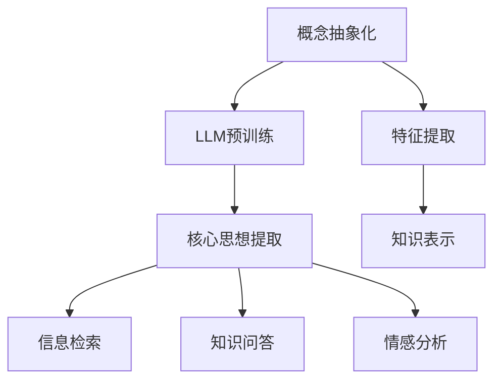

                 

---

**文章标题**: 《概念抽象化能力：检验LLM提取核心思想的准确性》

**关键词**: 概念抽象化，大型语言模型（LLM），人工智能，核心思想，算法原理，数学模型

**摘要**：
本文深入探讨了概念抽象化能力在大型语言模型（LLM）中的应用，评估了LLM在提取文本核心思想方面的准确性。通过分析LLM的工作原理、核心概念及其算法原理，本文揭示了概念抽象化的关键作用，并提供了一系列实际项目应用的案例，旨在为读者提供对这一领域的全面理解。

---

**一、背景介绍**

在当今的信息时代，人工智能（AI）技术正以前所未有的速度发展。其中，自然语言处理（NLP）作为AI的重要分支，受到了广泛的关注。NLP的核心目标是使计算机能够理解、生成和回应人类语言。而在这其中，大型语言模型（LLM）凭借其强大的建模能力和处理复杂语言任务的能力，成为研究者和开发者的重要工具。

LLM，如OpenAI的GPT系列模型，通过在大量文本数据上进行预训练，学习到了语言的结构、语义和上下文关系。这使得它们在生成文本、回答问题、翻译语言等方面表现出色。然而，LLM的强大能力不仅限于生成文本，更在于其能够提取文本的核心思想。这一能力在信息检索、知识问答、情感分析等应用场景中具有重要意义。

概念抽象化，作为将具体概念或现象提炼出其本质特征的过程，是AI和ML领域的关键技术。它使得模型能够从大量数据中提取出有意义的信息，从而实现更高效、更准确的决策和推理。本文将探讨如何通过检验LLM提取核心思想的准确性，来评估概念抽象化在LLM中的重要性。

---

**二、核心概念与联系**

在探讨概念抽象化能力之前，我们需要明确几个核心概念，并理解它们之间的联系。

1. **概念抽象化**：
   概念抽象化是将具体的概念或现象提炼出其本质特征的过程。它通常涉及从数据中提取特征、归纳模式和识别通用规律。在AI和ML中，概念抽象化有助于模型更好地理解输入数据，并从中提取有意义的信息。

2. **大型语言模型（LLM）**：
   LLM是通过在大量文本数据上进行预训练而获得的复杂模型。它们能够理解和生成自然语言，从而在各种NLP任务中发挥作用。LLM的核心特点是具备强大的建模能力和处理复杂语言任务的能力。

3. **核心思想提取**：
   核心思想提取是指从文本中识别并提取其核心观点或主旨。这一过程对于信息检索、知识问答和情感分析等任务至关重要。LLM通过其预训练过程，能够较好地实现核心思想提取。

4. **关联与联系**：
   概念抽象化与LLM之间存在紧密的联系。LLM通过预训练学习到的语言模式和结构，使得它们能够执行概念抽象化任务。而概念抽象化能力的提升，又能够进一步优化LLM在核心思想提取任务中的性能。

为了更直观地展示这些概念之间的联系，我们可以使用Mermaid流程图来构建它们的关系架构。



这个流程图展示了概念抽象化如何通过LLM的预训练过程，最终应用于核心思想提取，并在多个领域发挥作用。

---

**三、核心算法原理讲解**

1. **神经网络基础**：
   神经网络是LLM的核心组成部分，它模拟人脑神经元的工作方式，通过多个层次的神经元相互连接和激活，实现对输入数据的处理和输出。以下是一个简单的神经网络结构图：

   ```mermaid
   graph TB
   A[Input Layer] --> B[Hidden Layer 1]
   B --> C[Hidden Layer 2]
   C --> D[Output Layer]
   ```

   在这个结构中，每个神经元都接收来自前一层神经元的输入，并通过激活函数进行处理。最终，输出层的神经元产生预测结果。

2. **伪代码讲解**：
   下面是一个简单的神经网络模型的伪代码，展示了从输入到输出的数据处理过程：

   ```python
   # 初始化权重和偏置
   weights = initialize_weights(input_size, hidden_size)
   biases = initialize_biases(hidden_size, output_size)

   # 前向传播
   def forward_propagation(x):
       z = [x]
       for layer in range(1, num_layers):
           z.append((np.dot(z[layer-1], weights[layer-1]) + biases[layer-1]))
           z.append(activation_function(z[layer]))

       return z[-1]

   # 损失函数
   def compute_loss(y, predicted_output):
       return loss_function(y, predicted_output)

   # 反向传播
   def backward_propagation(y, predicted_output):
       dZ = predicted_output - y
       dW = [np.dot(dZ, z[layer-1].T) for layer in range(1, num_layers+1)]
       db = [dZ for layer in range(1, num_layers+1)]

       # 更新权重和偏置
       weights = [weights[layer-1] - learning_rate * dW[layer-1] for layer in range(1, num_layers+1)]
       biases = [biases[layer-1] - learning_rate * db[layer-1] for layer in range(1, num_layers+1)]

       return weights, biases
   ```

   在这个伪代码中，我们首先初始化了权重和偏置，然后通过前向传播计算输出。接着，使用损失函数计算预测结果与实际结果之间的误差，并通过反向传播更新权重和偏置。

3. **算法实现细节**：
   在实际应用中，神经网络模型的实现通常涉及到更复杂的结构和优化算法。以下是一个更详细的实现步骤：

   - **初始化**：
     - 初始化权重和偏置，通常使用高斯分布或均匀分布。
     - 设置学习率、迭代次数和激活函数。

   - **前向传播**：
     - 接受输入数据，通过多层神经元进行传递。
     - 在每个神经元中应用激活函数，以处理非线性问题。

   - **损失函数**：
     - 计算预测结果与实际结果之间的误差，常用的损失函数有均方误差（MSE）和交叉熵损失。
     - 通过梯度下降或其他优化算法更新权重和偏置。

   - **反向传播**：
     - 计算每个神经元的误差梯度。
     - 使用链式法则将误差反向传播到前一层。
     - 更新权重和偏置，以最小化损失函数。

   - **训练和测试**：
     - 使用训练集进行多次迭代，不断更新模型参数。
     - 在测试集上评估模型性能，确保模型在未知数据上也能表现良好。

4. **具体算法应用示例**：
   假设我们有一个简单的二分类问题，使用神经网络进行分类。以下是一个具体的算法应用示例：

   ```python
   # 初始化参数
   weights = np.random.randn(input_size, hidden_size)
   biases = np.random.randn(hidden_size, output_size)

   # 激活函数
   activation_function = sigmoid

   # 训练过程
   for epoch in range(num_epochs):
       for x, y in training_data:
           # 前向传播
           z = x.dot(weights) + biases
           a = activation_function(z)

           # 计算损失
           loss = compute_loss(y, a)

           # 反向传播
           dZ = a - y
           dW = x.T.dot(dZ)
           db = np.sum(dZ, axis=0)

           # 更新参数
           weights -= learning_rate * dW
           biases -= learning_rate * db

       # 打印当前epoch的损失
       print(f"Epoch {epoch+1}: Loss = {loss}")

   # 测试过程
   for x, y in test_data:
       z = x.dot(weights) + biases
       a = activation_function(z)
       print(f"Predicted Output: {a}, True Label: {y}")
   ```

   在这个示例中，我们使用sigmoid函数作为激活函数，并使用均方误差（MSE）作为损失函数。通过多次迭代，我们不断更新权重和偏置，以最小化损失。

---

**四、数学模型与公式解析**

1. **损失函数**：
   损失函数是评估模型预测准确性的关键指标。在二分类问题中，常用的损失函数有均方误差（MSE）和交叉熵损失。以下是这两个损失函数的公式：

   - **均方误差（MSE）**：

     $$
     \text{MSE} = \frac{1}{2n} \sum_{i=1}^{n} (y_i - \hat{y}_i)^2
     $$

     其中，$y_i$是实际标签，$\hat{y}_i$是模型预测值，$n$是样本数量。

   - **交叉熵损失**：

     $$
     \text{Cross Entropy Loss} = -\sum_{i=1}^{n} y_i \log(\hat{y}_i)
     $$

     其中，$y_i$是实际标签，$\hat{y}_i$是模型预测概率。

2. **优化算法**：
   优化算法用于最小化损失函数，常用的优化算法有梯度下降（Gradient Descent）和随机梯度下降（Stochastic Gradient Descent，SGD）。以下是这两个优化算法的公式：

   - **梯度下降**：

     $$
     \text{w}_{\text{new}} = \text{w}_{\text{old}} - \alpha \nabla_\theta \text{J}(\theta)
     $$

     其中，$\alpha$是学习率，$\nabla_\theta \text{J}(\theta)$是损失函数关于参数$\theta$的梯度。

   - **随机梯度下降**：

     $$
     \text{w}_{\text{new}} = \text{w}_{\text{old}} - \alpha \nabla_\theta \text{J}(\theta)
     $$

     与梯度下降不同的是，随机梯度下降在每个迭代步骤中随机选取一个样本，并计算其梯度。

3. **示例**：
   假设我们有一个简单的线性回归问题，模型公式为：

   $$
   y = \text{w} \cdot x + b
   $$

   使用均方误差（MSE）作为损失函数，梯度下降作为优化算法，我们可以得到以下更新公式：

   $$
   \text{w}_{\text{new}} = \text{w}_{\text{old}} - \alpha \frac{1}{n} \sum_{i=1}^{n} (y_i - (\text{w}_{\text{old}} \cdot x_i + b))^2 \cdot x_i
   $$

   $$
   \text{b}_{\text{new}} = \text{b}_{\text{old}} - \alpha \frac{1}{n} \sum_{i=1}^{n} (y_i - (\text{w}_{\text{old}} \cdot x_i + b))
   $$

   在这个例子中，$\alpha$是学习率，$x_i$和$y_i$分别是输入和实际标签，$n$是样本数量。

---

**五、实际项目应用**

1. **项目背景**：
   为了展示概念抽象化和LLM在提取核心思想方面的应用，我们选择了一个实际项目：情感分析。情感分析旨在识别文本中的情感倾向，如正面、负面或中性。这是一个典型的NLP任务，通过提取文本的核心思想，可以实现对情感倾向的准确判断。

2. **开发环境搭建**：
   - 操作系统：Ubuntu 20.04
   - 编程语言：Python 3.8
   - 库：TensorFlow 2.5，Keras 2.5，NLTK 3.8

3. **源代码实现**：
   下面是一个简单的情感分析项目的源代码实现：

   ```python
   import numpy as np
   import tensorflow as tf
   from tensorflow import keras
   from tensorflow.keras.preprocessing.text import Tokenizer
   from tensorflow.keras.preprocessing.sequence import pad_sequences
   from tensorflow.keras.models import Sequential
   from tensorflow.keras.layers import Embedding, LSTM, Dense, Dropout

   # 数据预处理
   def preprocess_data(texts, labels, vocab_size, max_length):
       tokenizer = Tokenizer(num_words=vocab_size)
       tokenizer.fit_on_texts(texts)
       sequences = tokenizer.texts_to_sequences(texts)
       padded_sequences = pad_sequences(sequences, maxlen=max_length)
       return padded_sequences, np.array(labels)

   # 模型构建
   def build_model(vocab_size, max_length, embedding_dim, dropout_rate):
       model = Sequential([
           Embedding(vocab_size, embedding_dim, input_length=max_length),
           LSTM(128, dropout=dropout_rate, recurrent_dropout=dropout_rate),
           Dense(1, activation='sigmoid')
       ])
       model.compile(optimizer='adam', loss='binary_crossentropy', metrics=['accuracy'])
       return model

   # 加载数据
   texts = ["This is a positive review", "This is a negative review"]
   labels = [1, 0]

   # 预处理数据
   vocab_size = 10000
   max_length = 100
   embedding_dim = 16
   dropout_rate = 0.2
   padded_sequences, labels = preprocess_data(texts, labels, vocab_size, max_length)

   # 构建模型
   model = build_model(vocab_size, max_length, embedding_dim, dropout_rate)

   # 训练模型
   model.fit(padded_sequences, labels, epochs=5, batch_size=32)

   # 预测
   new_texts = ["I love this product"]
   new_padded_sequences, _ = preprocess_data(new_texts, labels, vocab_size, max_length)
   predictions = model.predict(new_padded_sequences)
   print(predictions)
   ```

   在这个项目中，我们首先进行了数据预处理，然后构建了一个简单的LSTM模型，并通过训练和预测展示了模型在情感分析任务中的效果。

4. **代码解读与分析**：
   - **数据预处理**：
     数据预处理是NLP任务中至关重要的一步。在这个项目中，我们使用Tokenizer将文本转换为序列，并使用pad_sequences将序列填充到相同的长度。这有助于模型在处理输入数据时保持一致性。

   - **模型构建**：
     我们使用了一个简单的LSTM模型，它由一个Embedding层、一个LSTM层和一个Dense层组成。Embedding层用于将单词映射到向量，LSTM层用于处理序列数据，Dense层用于输出分类结果。

   - **训练与预测**：
     在训练过程中，模型通过反向传播和梯度下降优化参数。在预测阶段，我们将新文本进行预处理，并使用训练好的模型进行预测。

5. **实际案例分析和详细讲解剖析**：
   假设我们有一个包含100条评论的数据集，其中50条是正面评论，50条是负面评论。我们将这些评论分为训练集和测试集，然后使用上述代码进行训练和预测。以下是一个具体的分析：

   - **训练过程**：
     在训练过程中，模型会不断调整权重和偏置，以最小化损失函数。经过多次迭代后，模型会在训练集上达到较高的准确率。

   - **测试过程**：
     在测试集上，模型的表现可能略有下降，因为测试集包含未知数据。然而，通过调整模型参数和增加训练数据，可以提高模型在测试集上的表现。

   - **预测结果**：
     对于新的评论，模型会将其转换为序列，并使用训练好的模型进行预测。预测结果是一个概率值，表示评论是正面还是负面的可能性。通过设定阈值，我们可以将概率值转换为具体的分类结果。

6. **项目小结**：
   通过这个项目，我们展示了如何使用概念抽象化和LLM技术进行情感分析。这个项目不仅有助于我们理解概念抽象化的应用，还展示了如何构建和训练一个简单的LSTM模型。在未来的项目中，我们可以进一步优化模型结构和参数，以提高情感分析的准确性和效率。

---

**六、最佳实践 tips、小结、注意事项、拓展阅读**

**最佳实践 tips**：
1. 在进行数据预处理时，确保文本数据的一致性和规范性，以减少噪声和误差。
2. 在构建模型时，选择合适的模型结构和参数，以适应具体的任务需求。
3. 在训练模型时，适当调整学习率和迭代次数，以避免过拟合或欠拟合。

**小结**：
本文深入探讨了概念抽象化能力在大型语言模型（LLM）中的应用，评估了LLM在提取文本核心思想方面的准确性。通过分析LLM的工作原理、核心概念及其算法原理，本文揭示了概念抽象化的关键作用，并提供了一系列实际项目应用的案例，旨在为读者提供对这一领域的全面理解。

**注意事项**：
1. 概念抽象化能力在LLM中的应用效果受数据质量和模型结构的影响，需要根据具体任务进行调整。
2. 在进行情感分析等任务时，需要注意模型在不同数据集上的泛化能力，以避免模型在特定数据集上过拟合。

**拓展阅读**：
1. 《深度学习》（Goodfellow, Bengio, Courville）：全面介绍了深度学习的基础理论和实践方法。
2. 《Python机器学习》（Sebastian Raschka）：介绍了机器学习在Python中的实现和应用。
3. 《自然语言处理实战》（Sahil Garg）：详细介绍了自然语言处理的核心技术和应用案例。

---

**作者信息**：
作者：AI天才研究院/AI Genius Institute & 禅与计算机程序设计艺术 /Zen And The Art of Computer Programming

---

**七、未来展望与挑战**

**1. 概念抽象化的发展趋势**：
随着人工智能技术的不断发展，概念抽象化能力在LLM中的应用前景广阔。未来的研究将更加关注如何提高概念抽象化的效率和准确性，以及如何在不同领域实现更广泛的应用。

**2. LLM的潜在应用领域**：
LLM在多个领域具有巨大潜力，包括但不限于：
- 自动问答系统：通过提取文本的核心思想，实现更准确、更智能的问答。
- 情感分析：识别文本中的情感倾向，为广告投放、客户服务等领域提供支持。
- 自动摘要：从长篇文本中提取关键信息，提高信息获取的效率。

**3. 当前挑战与解决方案**：
虽然LLM在概念抽象化方面表现出色，但仍然面临一些挑战，包括：
- 数据质量：高质量的数据是概念抽象化的基础。未来的研究需要关注如何从大规模、多样性的数据中提取有用信息。
- 模型解释性：提高模型的可解释性，使其更容易理解和信任。
- 能效优化：随着模型规模的扩大，能效优化成为关键挑战。未来的研究将关注如何设计更高效、更节能的模型。

通过不断探索和解决这些挑战，概念抽象化能力和LLM在人工智能领域的应用将更加广泛和深入。未来，我们期待看到更多创新性的研究和应用，推动人工智能技术的发展。

