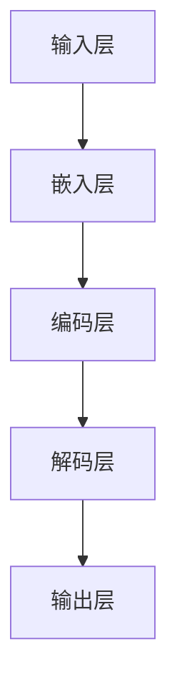
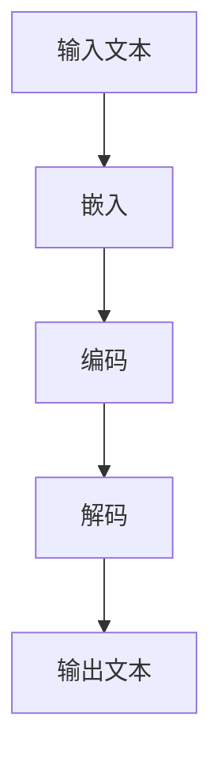
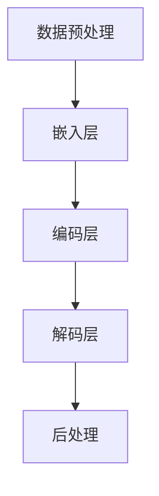
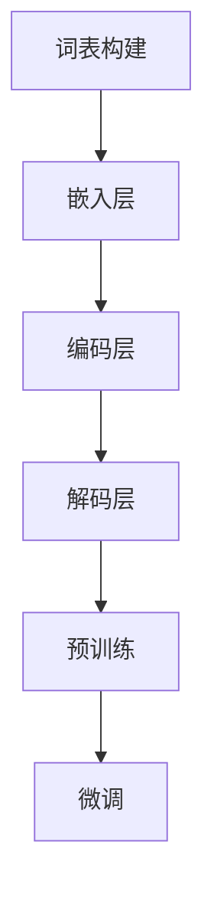

                 

### 文章标题

《模块化设计促进LLM应用的快速迭代》

### 文章关键词

- 模块化设计
- 大型语言模型（LLM）
- 快速迭代
- 软件开发
- 技术架构

### 文章摘要

本文旨在探讨模块化设计在大型语言模型（LLM）应用开发中的重要性，以及如何通过模块化设计来促进LLM应用的快速迭代。文章首先介绍了模块化设计的基本概念及其在软件开发中的应用，然后深入探讨了LLM的核心概念和架构，接着详细分析了模块化设计在LLM开发中的实践策略和具体案例。随后，文章讨论了快速迭代的策略与方法，以及模块化设计与快速迭代的结合。在此基础上，文章介绍了模块化设计工具与框架的应用，并探讨了模块化设计面临的挑战及解决方案。最后，文章展望了模块化设计在LLM领域的未来发展趋势，并总结了模块化设计在LLM应用中的价值。

## 第1章 模块化设计与LLM概述

### 1.1 模块化设计的概念与重要性

#### 1.1.1 模块化设计的定义

模块化设计是一种将复杂系统分解为一系列可独立开发、测试和组合的模块的设计方法。每个模块都负责特定的功能，可以独立运行和扩展。模块化设计的核心思想是提高系统的可维护性、可扩展性和可重用性。

模块化设计的定义可以简单概括为以下几点：

1. **模块性**：将系统划分为功能独立的模块。
2. **独立性**：每个模块可以独立开发、测试和部署。
3. **组合性**：模块可以通过组合实现系统的整体功能。

#### 1.1.2 模块化设计在软件开发中的应用

模块化设计在软件开发中被广泛应用，尤其是在复杂系统的开发中。其优点包括：

1. **可维护性**：由于模块是独立的，可以更容易地进行维护和更新。
2. **可扩展性**：通过增加新的模块，可以轻松扩展系统功能。
3. **可重用性**：模块可以跨项目重用，提高开发效率。

在软件开发中，模块化设计通常涉及以下步骤：

1. **需求分析**：分析系统需求，确定需要实现的功能。
2. **模块划分**：根据功能将系统划分为多个模块。
3. **模块开发**：独立开发每个模块，并进行单元测试。
4. **模块集成**：将模块组合起来，实现系统的整体功能。
5. **系统测试**：对整个系统进行测试，确保系统稳定运行。

#### 1.1.3 LLM与模块化设计的关系

大型语言模型（LLM）是一种复杂的自然语言处理模型，其核心在于对大量文本数据进行训练，以实现文本生成、文本分类、问答系统等功能。LLM的复杂性和规模使得模块化设计在LLM开发中尤为重要。

模块化设计在LLM开发中的应用主要体现在以下几个方面：

1. **模块化训练**：LLM的训练过程可以分为多个阶段，每个阶段负责处理特定的任务。通过模块化设计，可以独立训练每个模块，提高训练效率。
2. **模块化部署**：LLM的部署通常涉及多个组件，如文本处理模块、生成模块、后处理模块等。通过模块化设计，可以独立部署每个模块，提高部署灵活性。
3. **模块化维护**：由于LLM的规模和复杂性，维护和更新LLM是一项艰巨的任务。模块化设计使得维护和更新每个模块变得更加容易。

### 1.2 LLM的基本概念与架构

#### 1.2.1 LLM的定义

大型语言模型（LLM）是一种基于深度学习的自然语言处理模型，它通过对大量文本数据进行训练，学习文本的语义和语法结构，从而实现各种自然语言处理任务。

LLM的主要特点包括：

1. **大规模训练数据**：LLM通常使用数十亿甚至数万亿个文本数据作为训练集。
2. **深度神经网络**：LLM采用深度神经网络架构，通常包含数十万甚至数百万个参数。
3. **端到端学习**：LLM通过端到端学习，直接从原始文本数据中学习语义和语法结构。

#### 1.2.2 LLM的基本架构

LLM的基本架构通常包括以下几个关键组成部分：

1. **输入层**：接收用户输入的文本数据，将其转换为神经网络可以处理的格式。
2. **嵌入层**：将输入文本转换为固定长度的向量表示。
3. **编码层**：对嵌入层生成的向量进行编码，提取文本的语义信息。
4. **解码层**：根据编码层的信息生成输出文本。

以下是一个简单的LLM架构的Mermaid流程图：

#### 1.2.3 LLM的工作原理

LLM的工作原理可以概括为以下几个步骤：

1. **输入处理**：接收用户输入的文本数据，如一句问题或一个文本片段。
2. **嵌入**：将输入文本转换为固定长度的向量表示，通常使用词向量或BERT等预训练模型。
3. **编码**：对嵌入层生成的向量进行编码，提取文本的语义信息。
4. **解码**：根据编码层的信息生成输出文本，如答案或摘要。
5. **输出**：将生成的文本输出给用户。

以下是一个简单的LLM工作原理的Mermaid流程图：

## 第2章 模块化设计在LLM开发中的实践

### 2.1 模块化设计的原则与策略

模块化设计在LLM开发中的成功应用，需要遵循一系列基本原则和策略。以下将详细介绍这些原则和策略。

#### 2.1.1 模块化设计的原则

模块化设计在LLM开发中应遵循以下原则：

1. **功能独立性**：每个模块应仅实现单一功能，避免模块间功能交叉。
2. **接口明确**：模块间的接口应明确定义，确保模块可以独立开发、测试和部署。
3. **可扩展性**：模块应设计为可扩展的，以便未来能够轻松添加新功能。
4. **可重用性**：模块应设计为可重用的，以减少重复开发工作，提高开发效率。
5. **可维护性**：模块应设计为易于维护的，以便在出现问题时能够快速修复。

#### 2.1.2 模块化设计的策略

在LLM开发中，以下策略有助于实施模块化设计：

1. **需求分析**：在开发初期，对LLM的需求进行全面分析，确定需要实现的功能，并据此划分模块。
2. **模块划分**：根据需求分析结果，将LLM划分为多个功能独立的模块。
3. **接口设计**：为每个模块设计明确的接口，确保模块可以独立开发、测试和部署。
4. **模块实现**：独立实现每个模块，并进行单元测试，确保模块的功能正确。
5. **模块集成**：将所有模块集成到一个完整的LLM中，进行系统测试，确保整体功能正常。
6. **持续集成**：采用持续集成工具，自动化集成和测试，确保每次代码更改后LLM都能正常运行。

### 2.2 LLM模块化设计的案例研究

#### 2.2.1 模块化设计在GPT中的应用

GPT（Generative Pre-trained Transformer）是由OpenAI开发的一种大型语言模型。GPT的模块化设计主要体现在以下几个方面：

1. **数据预处理模块**：负责处理输入文本数据，包括分词、去停用词等操作。
2. **嵌入层模块**：将预处理后的文本数据转换为固定长度的向量表示。
3. **编码层模块**：对嵌入层生成的向量进行编码，提取文本的语义信息。
4. **解码层模块**：根据编码层的信息生成输出文本。
5. **后处理模块**：对生成的文本进行格式化、去标点等操作，使其更符合人类阅读习惯。

以下是一个简单的GPT模块化设计的Mermaid流程图：

#### 2.2.2 模块化设计在BERT中的应用

BERT（Bidirectional Encoder Representations from Transformers）是由Google开发的一种大型语言模型。BERT的模块化设计同样体现了其高效性和灵活性。

BERT的模块化设计包括以下几个关键模块：

1. **词表构建模块**：构建BERT的词表，将单词映射到整数。
2. **嵌入层模块**：将词表中的整数映射到向量表示。
3. **编码层模块**：对嵌入层生成的向量进行编码，提取文本的语义信息。
4. **解码层模块**：根据编码层的信息生成输出文本。
5. **预训练模块**：使用大量无标签文本数据对BERT进行预训练。
6. **微调模块**：在特定任务上对BERT进行微调，提高其性能。

以下是一个简单的BERT模块化设计的Mermaid流程图：

#### 2.2.3 其他LLM模块化设计的案例

除了GPT和BERT，其他LLM也采用了模块化设计，例如：

1. **T5（Text-To-Text Transfer Transformer）**：T5是一种基于Transformer的通用预训练模型，其模块化设计包括输入处理模块、编码层模块、解码层模块和后处理模块。
2. **ALBERT（A Linear Bi-directional Transformer）**：ALBERT是一种基于Transformer的预训练模型，其模块化设计包括嵌入层模块、编码层模块、解码层模块和后处理模块。

这些案例都展示了模块化设计在LLM开发中的重要性，通过模块化设计，LLM可以更高效地开发、测试和部署，同时提高其可维护性和可扩展性。

## 第3章 LLM应用的快速迭代

### 3.1 快速迭代的策略与方法

快速迭代是LLM应用开发中的重要策略，它有助于缩短开发周期、提高开发效率和产品质量。以下将详细介绍快速迭代的策略与方法。

#### 3.1.1 快速迭代的概念

快速迭代（Rapid Iteration）是指通过快速反复的迭代过程，逐步完善和优化产品或系统。快速迭代的核心在于缩短开发周期，加快产品的迭代速度，从而更好地适应市场需求和用户反馈。

#### 3.1.2 快速迭代的方法

1. **需求管理**：快速迭代的关键在于需求管理。开发团队需要与产品经理、用户和利益相关者紧密合作，及时收集用户反馈和需求变更，快速响应市场需求。
2. **敏捷开发**：敏捷开发是一种适用于快速迭代的开发方法。它强调团队协作、快速交付和持续改进，有助于缩短开发周期和提高产品质量。
3. **持续集成**：持续集成（CI）是一种自动化测试和部署的方法，它有助于确保每次代码更改后LLM都能正常运行。通过持续集成，开发团队可以更快地发现和修复问题。
4. **自动化测试**：自动化测试是快速迭代的重要组成部分。通过编写自动化测试脚本，开发团队可以快速验证LLM的功能和性能，提高开发效率。
5. **用户反馈**：快速迭代需要与用户保持紧密联系，及时收集用户反馈。通过分析用户反馈，开发团队可以识别和解决用户痛点，优化产品功能。

#### 3.1.3 快速迭代的优势

1. **缩短开发周期**：快速迭代可以加快产品的开发速度，缩短从需求到产品的周期。
2. **提高产品质量**：通过快速迭代，开发团队可以及时发现和修复问题，提高产品的质量和稳定性。
3. **适应市场需求**：快速迭代有助于开发团队更好地适应市场需求，快速响应用户反馈和需求变更。
4. **提高团队协作**：快速迭代需要团队协作和紧密合作，有助于提高团队凝聚力和工作效率。

### 3.2 模块化设计与快速迭代的结合

模块化设计与快速迭代具有天然的结合优势。通过模块化设计，LLM可以更高效地实现快速迭代，提高开发效率和产品质量。

#### 3.2.1 模块化设计如何促进快速迭代

1. **模块独立性**：模块化设计使得每个模块可以独立开发、测试和部署，有助于缩短迭代周期，加快产品交付。
2. **模块可扩展性**：模块化设计使得模块可以轻松扩展，开发团队可以快速添加新功能或优化现有功能，适应市场需求。
3. **模块重用性**：模块化设计使得模块可以跨项目重用，减少重复开发工作，提高开发效率。

#### 3.2.2 快速迭代如何影响模块化设计

1. **需求变更快速响应**：快速迭代要求模块化设计能够快速响应需求变更，模块化设计有助于实现这一目标。
2. **模块间协同优化**：快速迭代过程中，开发团队可以不断优化模块间的协作和交互，提高系统整体性能。
3. **模块性能持续提升**：快速迭代有助于开发团队持续优化模块性能，提高产品质量和用户体验。

### 3.3 快速迭代案例分析

以下是一个快速迭代案例，展示了如何通过模块化设计实现LLM应用的快速迭代。

#### 案例背景

某公司开发一款基于GPT的智能问答系统，旨在为用户提供实时问答服务。由于市场竞争激烈，公司需要快速迭代产品，提高用户体验和系统性能。

#### 案例步骤

1. **需求分析**：与产品经理和用户密切合作，确定系统功能需求，包括问答、文本生成、文本分类等。
2. **模块划分**：根据需求，将系统划分为多个模块，如输入处理模块、嵌入层模块、编码层模块、解码层模块等。
3. **模块实现**：独立实现每个模块，并进行单元测试，确保模块的功能正确。
4. **模块集成**：将所有模块集成到一个完整的系统中，进行系统测试，确保整体功能正常。
5. **用户反馈**：上线后，收集用户反馈，识别用户痛点，如回答不准确、系统响应慢等。
6. **优化迭代**：根据用户反馈，优化相关模块，如提高问答准确性、优化系统响应速度等。
7. **持续集成**：采用持续集成工具，自动化集成和测试，确保每次代码更改后系统都能正常运行。

#### 案例结果

通过快速迭代，该智能问答系统的性能和用户体验得到显著提升，市场竞争力得到增强。同时，模块化设计使得每次迭代过程更加高效，系统维护和扩展更加方便。

## 第4章 模块化设计工具与框架

### 4.1 模块化设计工具介绍

模块化设计工具是实施模块化设计的关键，以下将介绍几种常用的模块化设计工具。

#### 4.1.1 Python中的模块化设计工具

Python是一种广泛使用的编程语言，拥有丰富的模块化设计工具。以下是一些常用的Python模块化设计工具：

1. **Python模块（Module）**：Python模块是一种独立的文件，包含一系列函数、类和变量。通过导入模块，可以方便地在不同文件和项目中重用代码。
2. **包（Package）**：Python包是一种包含多个模块的集合，通过包管理器（如pip）可以方便地安装和管理。
3. **类（Class）**：Python类是一种用于定义复杂数据类型的工具，通过类可以创建对象，实现封装、继承和多态等特性。
4. **工厂模式（Factory Pattern）**：工厂模式是一种常用的设计模式，用于创建对象，可以降低模块之间的耦合度，提高模块的独立性。

#### 4.1.2 其他编程语言中的模块化设计工具

除了Python，其他编程语言也提供了丰富的模块化设计工具。以下是一些常用的模块化设计工具：

1. **Java模块（Module）**：Java模块是一种用于定义模块化代码的工具，通过模块可以组织和管理Java类和接口。
2. **C++模块（Module）**：C++模块是一种用于定义模块化代码的工具，通过模块可以减少代码重复，提高可维护性。
3. **C#模块（Module）**：C#模块是一种用于定义模块化代码的工具，通过模块可以组织和管理C#类和接口。

### 4.2 模块化设计框架应用

模块化设计框架是一种用于实现模块化设计的工具和规范，以下将介绍几种常用的模块化设计框架。

#### 4.2.1 模块化设计框架的概述

模块化设计框架是一种用于构建大型复杂系统的架构和工具集。以下是一些常见的模块化设计框架：

1. **MVC（Model-View-Controller）**：MVC是一种常用的模块化设计框架，将系统划分为模型、视图和控制器三个部分，实现数据的分离和模块化。
2. **微服务架构（Microservices Architecture）**：微服务架构是一种基于模块化设计的系统架构，将系统划分为多个独立的服务，每个服务负责特定的功能。
3. **模块化数据库架构（Module-Based Database Architecture）**：模块化数据库架构是一种将数据库划分为多个模块的架构，每个模块负责特定的数据存储和操作。

#### 4.2.2 模块化设计框架的优势

模块化设计框架具有以下优势：

1. **提高可维护性**：通过模块化设计框架，可以降低系统的复杂性，提高代码的可维护性。
2. **提高可扩展性**：模块化设计框架使得系统可以轻松扩展，添加新功能或优化现有功能。
3. **提高可重用性**：模块化设计框架使得模块可以跨项目重用，减少重复开发工作，提高开发效率。
4. **提高团队协作**：模块化设计框架有助于团队协作，每个团队可以独立开发、测试和部署模块，提高工作效率。

#### 4.2.3 模块化设计框架的应用案例

以下是一些模块化设计框架的应用案例：

1. **Django**：Django是一种基于Python的模块化设计框架，广泛应用于Web开发。通过Django，可以方便地构建具有模块化设计的Web应用。
2. **Spring Boot**：Spring Boot是一种基于Java的模块化设计框架，适用于构建大型企业级应用。通过Spring Boot，可以方便地实现模块化设计，提高系统的可维护性和可扩展性。
3. **Vue.js**：Vue.js是一种基于JavaScript的模块化设计框架，适用于构建动态Web应用。通过Vue.js，可以方便地实现模块化设计，提高开发效率和用户体验。

## 第5章 模块化设计的挑战与解决方案

### 5.1 模块化设计面临的挑战

模块化设计虽然具有很多优点，但在实际应用中也面临一些挑战。以下将介绍模块化设计面临的主要挑战及可能的解决方案。

#### 5.1.1 模块化设计的复杂性

模块化设计使得系统变得更加复杂，主要体现在以下几个方面：

1. **模块数量增多**：为了实现系统的整体功能，需要划分更多的模块，导致模块数量增多。
2. **模块间依赖**：模块之间可能存在复杂的依赖关系，增加了系统的复杂性。
3. **模块间协调**：模块之间的协调和通信可能变得复杂，需要确保模块间的一致性和稳定性。

**解决方案**：

1. **设计原则**：遵循良好的设计原则，如单一职责原则、开闭原则等，降低模块的复杂度。
2. **模块划分**：合理划分模块，确保每个模块仅实现单一功能，避免模块间功能交叉。
3. **模块间通信**：设计清晰的模块间通信机制，如事件驱动、接口定义等，确保模块间的一致性和稳定性。

#### 5.1.2 模块化设计的可维护性

模块化设计的可维护性面临以下挑战：

1. **模块间依赖**：模块间依赖可能导致维护难度增加，修改一个模块时可能需要考虑多个模块的兼容性。
2. **模块更新**：模块的更新可能需要重新测试和部署所有相关模块，增加了维护成本。
3. **文档缺失**：模块化设计可能缺乏详细的文档，导致新加入的开发人员难以理解模块功能和接口。

**解决方案**：

1. **模块文档**：为每个模块编写详细的文档，包括模块功能、接口、依赖关系等，帮助开发人员理解和使用模块。
2. **模块测试**：编写全面的模块测试用例，确保每个模块的功能正确，减少模块间依赖带来的问题。
3. **模块重构**：定期对模块进行重构，优化模块设计和代码结构，提高模块的可维护性。

#### 5.1.3 模块化设计的可扩展性

模块化设计的可扩展性面临以下挑战：

1. **模块耦合度**：模块间耦合度过高可能导致扩展难度增加，需要修改大量模块才能实现新功能。
2. **模块可扩展性**：某些模块可能设计不够灵活，难以扩展新功能或适应新需求。
3. **模块重构**：为了提高可扩展性，可能需要重构现有模块，增加了开发和维护成本。

**解决方案**：

1. **模块解耦**：通过设计清晰的接口和降低模块间依赖，降低模块耦合度，提高系统的可扩展性。
2. **模块重构**：定期对模块进行重构，优化模块设计和代码结构，提高模块的可扩展性。
3. **模块复用**：设计可复用的模块，减少重复开发工作，提高开发效率。

### 5.2 模块化设计的解决方案

为了应对模块化设计面临的挑战，可以采取以下解决方案：

1. **模块划分**：合理划分模块，确保每个模块仅实现单一功能，避免模块间功能交叉。
2. **模块解耦**：设计清晰的接口和降低模块间依赖，降低模块耦合度，提高系统的可扩展性。
3. **模块文档**：为每个模块编写详细的文档，包括模块功能、接口、依赖关系等，帮助开发人员理解和使用模块。
4. **模块测试**：编写全面的模块测试用例，确保每个模块的功能正确，减少模块间依赖带来的问题。
5. **模块重构**：定期对模块进行重构，优化模块设计和代码结构，提高模块的可维护性和可扩展性。
6. **持续集成**：采用持续集成工具，自动化集成和测试，确保每次代码更改后系统都能正常运行。

通过以上解决方案，可以有效应对模块化设计面临的挑战，提高系统的可维护性、可扩展性和可重用性，从而更好地支持LLM应用的快速迭代。

## 第6章 模块化设计在LLM领域的未来发展趋势

### 6.1 模块化设计的未来发展方向

模块化设计在LLM领域的未来发展趋势主要体现在以下几个方面：

#### 6.1.1 模块化设计与云计算的结合

随着云计算技术的发展，模块化设计在云计算环境中的应用前景广阔。云计算提供了强大的计算资源和存储能力，使得LLM的训练和部署变得更加高效和灵活。模块化设计可以将LLM分解为多个可独立部署的模块，利用云计算的弹性扩展能力，实现大规模的分布式训练和部署。

未来，模块化设计与云计算的结合将主要体现在以下几个方面：

1. **分布式训练**：通过模块化设计，可以将LLM的训练任务分解为多个子任务，分布式地运行在多台服务器上，提高训练效率。
2. **弹性扩展**：模块化设计可以根据实际需求，动态地调整模块的数量和资源分配，实现系统的弹性扩展。
3. **资源优化**：通过模块化设计，可以更好地利用云计算资源，降低训练和部署的成本。

#### 6.1.2 模块化设计与边缘计算的融合

边缘计算是一种将计算能力从云端延伸到网络边缘的技术，旨在提高实时性和响应速度。模块化设计在边缘计算中的应用，将有助于实现LLM在边缘设备的部署和运行。

未来，模块化设计与边缘计算的融合将主要体现在以下几个方面：

1. **边缘推理**：通过模块化设计，可以将LLM的推理任务分解为多个模块，在边缘设备上进行本地推理，降低延迟和带宽消耗。
2. **模块化部署**：模块化设计使得LLM可以在边缘设备上灵活部署，适应不同的应用场景和资源限制。
3. **数据隐私保护**：通过模块化设计，可以在边缘设备上本地处理数据，减少数据传输，提高数据隐私保护。

#### 6.1.3 模块化设计与人工智能新技术的结合

随着人工智能新技术的不断发展，模块化设计将在LLM领域得到更广泛的应用。以下是一些未来可能结合的领域：

1. **强化学习**：模块化设计可以与强化学习技术结合，实现更加灵活和智能的模块化设计，提高系统的自适应性和学习能力。
2. **迁移学习**：模块化设计可以与迁移学习技术结合，通过共享模块实现知识迁移，提高系统的可扩展性和可重用性。
3. **生成对抗网络**：模块化设计可以与生成对抗网络（GAN）结合，实现更加复杂和多样化的模块化设计，提高系统的生成能力。

### 6.2 模块化设计在LLM领域的应用前景

模块化设计在LLM领域的应用前景广阔，以下是几个关键领域：

#### 6.2.1 模块化设计在自然语言处理中的应用

自然语言处理（NLP）是LLM的核心应用领域，模块化设计将在NLP中发挥重要作用：

1. **多语言支持**：通过模块化设计，可以轻松实现多语言模型，提高系统的语言适应性。
2. **任务切换**：模块化设计使得LLM可以快速切换不同的NLP任务，如文本生成、文本分类、问答等。
3. **个性化服务**：通过模块化设计，可以结合用户数据和偏好，实现个性化自然语言处理服务。

#### 6.2.2 模块化设计在机器翻译中的应用

机器翻译是LLM的另一个重要应用领域，模块化设计将有助于提升机器翻译的效率和准确性：

1. **快速迭代**：通过模块化设计，可以快速迭代和优化翻译模型，提高翻译质量。
2. **多模态翻译**：模块化设计可以结合文本、语音等多种模态，实现更加自然和多义的翻译结果。
3. **实时翻译**：通过模块化设计，可以在边缘设备上实现实时翻译，降低延迟和带宽消耗。

#### 6.2.3 模块化设计在问答系统中的应用

问答系统是LLM的典型应用场景，模块化设计将有助于提升问答系统的性能和用户体验：

1. **多轮对话**：通过模块化设计，可以实现多轮对话，提高问答的连贯性和自然性。
2. **实时反馈**：模块化设计可以实时收集用户反馈，优化问答系统，提高用户满意度。
3. **个性化和定制化**：通过模块化设计，可以根据用户需求，定制化问答系统，提高系统适配性和个性化服务。

### 6.2.4 模块化设计在对话生成中的应用

对话生成是LLM的另一个重要应用领域，模块化设计将有助于实现更加丰富和自然的对话：

1. **情感分析**：通过模块化设计，可以实现情感分析模块，提高对话的情感表达和自然性。
2. **场景适应**：通过模块化设计，可以针对不同的场景和对话内容，灵活调整对话策略和生成方法。
3. **多样化输出**：通过模块化设计，可以生成多种形式的对话输出，如文本、语音、图像等，提高用户体验。

总之，模块化设计在LLM领域的未来发展趋势中扮演着关键角色，通过结合云计算、边缘计算和人工智能新技术，模块化设计将推动LLM应用的发展，提高系统的性能、可维护性和可扩展性，为自然语言处理、机器翻译、问答系统和对话生成等领域带来更多创新和突破。

## 第7章 总结与展望

### 7.1 模块化设计在LLM应用中的价值

模块化设计在LLM应用中的价值主要体现在以下几个方面：

1. **提高开发效率**：模块化设计使得LLM的开发可以更加高效，每个模块可以独立开发、测试和部署，减少开发时间和复杂度。
2. **提高模型性能**：通过模块化设计，可以优化模型的训练和推理过程，提高模型的性能和准确性。
3. **提高可维护性和可扩展性**：模块化设计使得LLM具有更好的可维护性和可扩展性，模块可以方便地更新和扩展，适应不断变化的需求。
4. **促进快速迭代**：模块化设计有助于实现LLM的快速迭代，通过模块间的独立性和可扩展性，可以快速优化和改进模型。

### 7.2 模块化设计未来的发展展望

模块化设计在未来的发展中将继续发挥重要作用，其趋势和发展方向包括：

1. **云计算与模块化设计的结合**：云计算的普及将使得模块化设计在分布式训练、弹性扩展等方面得到广泛应用，提高LLM的性能和可维护性。
2. **边缘计算的融合**：边缘计算的发展将使得LLM能够在更广泛的场景和设备上部署和运行，实现实时性和低延迟的需求。
3. **人工智能新技术的结合**：随着人工智能新技术的不断涌现，模块化设计将与其他先进技术相结合，如强化学习、迁移学习和生成对抗网络等，推动LLM应用的创新和发展。
4. **定制化和智能化**：模块化设计将使得LLM更加智能化和定制化，通过模块的组合和优化，满足不同用户和应用场景的需求。
5. **开源生态的完善**：模块化设计将在开源生态中扮演重要角色，通过开源社区的合作和共享，推动模块化设计在LLM领域的广泛应用和持续改进。

### 7.3 模块化设计对社会和产业的影响

模块化设计不仅对软件开发和人工智能领域有着深远影响，还将对社会和产业产生重要影响：

1. **技术创新**：模块化设计推动人工智能技术的创新和发展，促进新技术的快速应用和普及。
2. **产业升级**：模块化设计有助于产业升级和转型，提高生产效率和产品质量，推动传统产业向智能化和数字化方向发展。
3. **社会进步**：模块化设计在人工智能领域的应用将带来更便捷、高效和智能的社会服务，提升人们的生活质量和幸福感。
4. **人才培养**：模块化设计要求开发人员具备更深入的技术理解和系统思维，有助于培养和选拔优秀的技术人才。

总之，模块化设计在LLM应用中的价值巨大，其未来的发展将带来更多创新和突破，对社会和产业产生深远影响。通过不断优化和推广模块化设计，我们可以实现更高效、智能和可持续的人工智能发展。作者：AI天才研究院/AI Genius Institute & 禅与计算机程序设计艺术 /Zen And The Art of Computer Programming

----------------------------------------------------------------

## 结语

本文从模块化设计的定义、重要性，到LLM的基本概念和架构，再到模块化设计在LLM开发中的实践、快速迭代，以及模块化设计工具与框架、挑战与解决方案、未来发展趋势等各个方面进行了详细探讨。通过模块化设计，我们可以提高LLM应用的开发效率、模型性能和可维护性，促进快速迭代，实现系统的弹性扩展和个性化服务。

模块化设计不仅在LLM领域具有广泛应用，也对整个软件开发领域产生了深远影响。随着云计算、边缘计算和人工智能新技术的不断发展，模块化设计的价值将得到进一步体现。

未来，模块化设计将继续与这些新技术相结合，推动人工智能技术的创新和进步，为社会和产业带来更多机遇和挑战。我们期待在不久的将来，模块化设计能够为各个领域带来更多创新和突破，推动人类社会向着更智能、更高效、更美好的方向发展。作者：AI天才研究院/AI Genius Institute & 禅与计算机程序设计艺术 /Zen And The Art of Computer Programming

----------------------------------------------------------------

## 文章标题

《模块化设计促进LLM应用的快速迭代》

## 文章关键词

模块化设计、大型语言模型（LLM）、快速迭代、软件开发、技术架构

## 文章摘要

本文旨在探讨模块化设计在大型语言模型（LLM）应用开发中的重要性，以及如何通过模块化设计来促进LLM应用的快速迭代。文章首先介绍了模块化设计的基本概念及其在软件开发中的应用，然后深入探讨了LLM的核心概念和架构，接着详细分析了模块化设计在LLM开发中的实践策略和具体案例。随后，文章讨论了快速迭代的策略与方法，以及模块化设计与快速迭代的结合。在此基础上，文章介绍了模块化设计工具与框架的应用，并探讨了模块化设计面临的挑战及解决方案。最后，文章展望了模块化设计在LLM领域的未来发展趋势，并总结了模块化设计在LLM应用中的价值。

