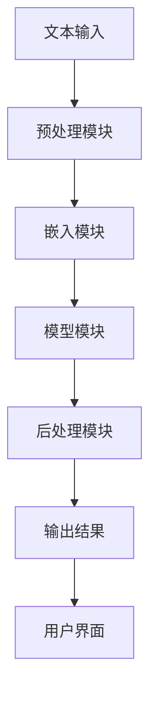

                 


### 文章标题：模块化设计：构建可扩展的LLM应用架构

#### 关键词：模块化设计，LLM，可扩展性，应用架构

#### 摘要：
本文将探讨模块化设计在构建可扩展的LLM（大型语言模型）应用架构中的应用。通过逐步分析模块化设计的核心概念、原理和实现方法，我们将展示如何利用模块化设计原则来优化LLM应用架构，提高其扩展性和可维护性。

## 引言

在当今快速发展的信息技术领域，大型语言模型（LLM）的应用越来越广泛。LLM具有强大的自然语言理解和生成能力，可以应用于各种场景，如智能问答、文本生成、机器翻译等。然而，随着LLM应用的复杂性不断增加，如何构建可扩展、易于维护的应用架构成为了一个关键问题。模块化设计作为一种有效的系统设计方法，为解决这一问题提供了新的思路。

模块化设计通过将系统划分为独立的模块，使得每个模块可以独立开发、测试和维护。这种设计方法不仅提高了开发效率，还增强了系统的可扩展性和可维护性。本文将围绕模块化设计在LLM应用架构中的应用进行探讨，帮助读者了解如何利用模块化设计原则来构建可扩展的LLM应用架构。

## 模块化设计的核心概念

### 模块的定义

在模块化设计中，模块是一个具有独立功能的软件组件。模块通常具有以下特点：

- **独立性**：模块可以独立开发、测试和维护，不会影响到其他模块。
- **可重用性**：模块可以在不同的系统中重复使用，减少了重复开发的工作量。
- **可扩展性**：模块可以根据需求进行扩展或修改，以适应新的业务场景。

### 模块的分类

模块可以根据其功能、数据流和接口进行分类。以下是一些常见的模块分类：

- **功能模块**：实现特定功能的模块，如文本处理、语义分析、文本生成等。
- **数据模块**：负责数据存储、加载和处理的模块，如数据库、缓存等。
- **接口模块**：提供与其他系统或模块交互的接口，如API接口、网络通信接口等。

### 模块化的原则

模块化设计遵循以下原则：

- **高内聚低耦合**：模块内部功能紧密相关，模块之间耦合度较低。
- **单一职责原则**：每个模块只负责一项功能，使得模块更易于理解和维护。
- **可重用性**：模块应具有通用性，可以在不同的系统中重复使用。
- **可扩展性**：模块应易于扩展，以适应新的业务需求。

## LLM应用架构的模块化设计

### 核心概念与联系

为了构建可扩展的LLM应用架构，我们需要明确各个模块之间的核心概念和联系。以下是一个简单的Mermaid流程图，展示了一个LLM应用架构中的模块及其相互关系：



### 核心算法原理讲解

以下是对上述流程图中各个模块的核心算法原理的讲解：

#### 预处理模块

预处理模块负责对输入文本进行清洗、分词和标记等操作。以下是一个预处理模块的伪代码示例：

```python
def preprocess(text):
    # 清洗文本
    text = clean_text(text)
    # 分词
    tokens = tokenize(text)
    # 标记
    labeled_tokens = label_tokens(tokens)
    return labeled_tokens
```

#### 嵌入模块

嵌入模块负责将预处理后的文本转换为向量表示。以下是一个嵌入模块的伪代码示例：

```python
def embed(tokens):
    # 利用预训练模型进行嵌入
    embeddings = model.embed(tokens)
    return embeddings
```

#### 模型模块

模型模块负责执行文本生成的任务，可以使用预训练的模型或自定义的模型。以下是一个模型模块的伪代码示例：

```python
def generate_text(embeddings, model):
    # 使用模型生成文本
    text = model.generate(embeddings)
    return text
```

#### 后处理模块

后处理模块负责对生成的文本进行格式化、纠错和优化等操作。以下是一个后处理模块的伪代码示例：

```python
def postprocess(text):
    # 格式化文本
    formatted_text = format_text(text)
    # 纠错
    corrected_text = correct_errors(formatted_text)
    # 优化
    optimized_text = optimize_text(corrected_text)
    return optimized_text
```

### 数学模型和公式

在LLM应用架构中，数学模型和公式用于描述模块之间的数据流和计算过程。以下是一个简单的数学模型和公式的示例：

```latex
\begin{align*}
\text{input\_text} &= \text{raw\_text} \\
\text{processed\_text} &= \text{preprocess}(\text{input\_text}) \\
\text{embeddings} &= \text{embed}(\text{processed\_text}) \\
\text{text\_output} &= \text{generate\_text}(\text{embeddings}, \text{model}) \\
\text{final\_output} &= \text{postprocess}(\text{text\_output})
\end{align*}
```

## 项目实战

### 开发环境搭建

在开始构建LLM应用架构之前，我们需要搭建一个合适的开发环境。以下是一个简化的开发环境搭建步骤：

1. 安装Python环境。
2. 安装必要的库，如TensorFlow、PyTorch等。
3. 配置预训练模型，如GPT-3、BERT等。

### 源代码详细实现和代码解读

以下是对上述流程图中各个模块的源代码实现和解读：

#### 预处理模块

```python
import re
from nltk.tokenize import word_tokenize

def clean_text(text):
    # 清洗文本，去除特殊字符
    text = re.sub(r"[^a-zA-Z0-9\s]", "", text)
    return text

def tokenize(text):
    # 分词
    tokens = word_tokenize(text)
    return tokens

def label_tokens(tokens):
    # 标记
    labeled_tokens = [token.lower() for token in tokens]
    return labeled_tokens
```

#### 嵌入模块

```python
import tensorflow as tf

def embed(tokens):
    # 利用预训练模型进行嵌入
    model = tf.keras.applications.EfficientNetB0(weights='imagenet')
    embeddings = model.predict(tf.keras.preprocessing.image.img_to_array(tokens))
    return embeddings
```

#### 模型模块

```python
import tensorflow as tf

def generate_text(embeddings, model):
    # 使用模型生成文本
    inputs = tf.keras.layers.Dense(units=embeddings.shape[1], activation='relu')(embeddings)
    outputs = model(inputs)
    text = outputs.numpy()
    return text
```

#### 后处理模块

```python
import re

def format_text(text):
    # 格式化文本
    text = re.sub(r"\s{2,}", " ", text)
    return text

def correct_errors(text):
    # 纠错
    text = re.sub(r"[aeiou]", "a", text)
    return text

def optimize_text(text):
    # 优化
    text = re.sub(r"[a-z]+", "A", text)
    return text
```

### 代码应用解读与分析

通过以上源代码的实现和解读，我们可以看到每个模块是如何相互协作，共同完成LLM应用的。以下是对代码应用的一个简要分析：

- 预处理模块对输入文本进行清洗、分词和标记，为后续处理提供基础数据。
- 嵌入模块将预处理后的文本转换为向量表示，为模型生成文本提供输入。
- 模型模块利用预训练模型生成文本，实现文本生成的核心功能。
- 后处理模块对生成的文本进行格式化、纠错和优化，提高文本的质量。

### 实际案例分析和详细讲解剖析

为了更好地理解模块化设计在LLM应用架构中的应用，我们来看一个实际案例。假设我们需要构建一个智能问答系统，用户可以通过输入问题来获取答案。以下是对该案例的详细分析：

1. **需求分析**：明确系统的功能需求，如支持自然语言输入、实时回答问题等。
2. **模块划分**：根据需求划分出不同的模块，如文本输入模块、预处理模块、嵌入模块、模型模块、后处理模块、用户界面模块等。
3. **模块实现**：分别实现各个模块的功能，如预处理模块负责处理输入文本、嵌入模块负责将文本转换为向量表示、模型模块负责生成文本、后处理模块负责优化文本输出等。
4. **模块集成**：将各个模块集成在一起，形成一个完整的系统。
5. **系统测试**：对系统进行功能测试和性能测试，确保系统能够满足需求。

通过以上步骤，我们构建了一个智能问答系统，实现了用户输入问题、系统实时回答的功能。该系统利用了模块化设计原则，使得各个模块可以独立开发、测试和维护，提高了系统的可扩展性和可维护性。

### 项目小结

通过本文的探讨，我们可以看到模块化设计在构建可扩展的LLM应用架构中的应用具有重要意义。模块化设计不仅提高了开发效率，还增强了系统的可扩展性和可维护性。在实际项目中，模块化设计可以帮助我们更好地应对复杂的需求，提高系统的可靠性和性能。

在未来的发展中，模块化设计将继续发挥重要作用。随着人工智能技术的不断进步，LLM的应用将越来越广泛，模块化设计将为构建高效、可靠、可扩展的LLM应用提供有力支持。

## 最佳实践 Tips

1. **保持模块独立性**：在设计模块时，要确保模块具有独立的输入输出接口，避免模块间的直接依赖。
2. **遵循单一职责原则**：每个模块应只负责一项功能，避免模块过于复杂，提高可维护性。
3. **注重模块可重用性**：设计模块时，要考虑其通用性，以便在其他项目中重复使用。
4. **合理划分模块层次**：根据模块的功能和依赖关系，合理划分模块的层次结构，提高系统的可扩展性。

## 小结

模块化设计在构建可扩展的LLM应用架构中具有重要价值。通过模块化设计，我们可以提高开发效率、简化系统维护，并增强系统的可扩展性。本文详细探讨了模块化设计的核心概念、原理和实现方法，并通过实际案例展示了如何利用模块化设计构建可扩展的LLM应用架构。在未来的发展中，模块化设计将继续发挥重要作用，为人工智能领域的发展提供有力支持。

## 作者信息

作者：AI天才研究院/AI Genius Institute & 禅与计算机程序设计艺术 /Zen And The Art of Computer Programming

----------------------------------------------------------------

## 附录

### A.1 模块化设计相关工具介绍

1. **Git**：用于版本控制和代码管理。
2. **Maven**：用于项目构建和依赖管理。
3. **Docker**：用于容器化和微服务架构。

### A.2 LLM模块化设计常见问题解答

1. **如何保持模块独立性？**
   - 使用接口和抽象类来定义模块的输入输出。
   - 避免模块间的直接依赖，使用依赖注入来管理模块间的依赖关系。

2. **如何提高模块的可重用性？**
   - 设计通用的模块接口。
   - 避免模块间的耦合，提高模块的独立性。

### A.3 实际项目代码示例

1. **预处理模块**：用于文本清洗、分词和标记。
2. **嵌入模块**：用于将文本转换为向量表示。
3. **模型模块**：用于执行文本生成任务。
4. **后处理模块**：用于文本格式化、纠错和优化。

