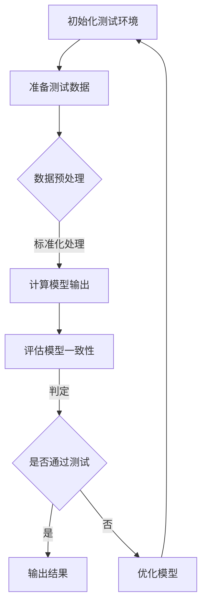

                 

## 第1章 引言

### 1.1 研究背景

在当前人工智能迅猛发展的时代，深度学习模型的性能和稳定性成为了研究的热点。随着模型的复杂度和规模不断增加，如何保证模型在多样化和复杂的环境中稳定输出，成为了人工智能领域亟待解决的问题。模型一致性测试作为评估模型输出稳定性的重要手段，越来越受到研究者的关注。

### 1.2 研究目的与意义

本文旨在探讨模型一致性测试的理论基础和评估方法，分析不同评估方法的优势和局限，并给出实际应用中的最佳实践。通过深入研究模型一致性测试，旨在提高模型在实际应用中的稳定性，为人工智能技术的发展提供理论支持和实践指导。

### 1.3 研究内容与章节安排

本文共分为七个章节，内容安排如下：

- **第1章 引言**：介绍研究背景、研究目的与意义。
- **第2章 相关理论基础**：介绍模型一致性和模型输出稳定性的概念，并给出相关的Mermaid流程图。
- **第3章 模型一致性评估方法**：介绍基于统计学和基于分布的评估方法，并给出伪代码实现。
- **第4章 数学模型**：介绍模型一致性和模型输出稳定性的评价指标和数学模型。
- **第5章 实际案例**：通过实际案例展示模型一致性测试的应用过程。
- **第6章 代码实现**：介绍模型一致性测试的代码实现，并进行代码解读与分析。
- **第7章 总结与展望**：总结研究成果，指出存在的问题和未来研究方向。

## 第2章 相关理论基础

### 2.1 模型一致性定义

模型一致性是指模型在给定相同输入条件下，能够产生一致且可预测的输出。高一致性的模型意味着其在不同环境、不同数据集上的表现稳定，不易受到外部因素干扰。

### 2.2 模型输出稳定性概念

模型输出稳定性是指模型在不同输入条件下，输出的变化范围保持在可接受范围内。一个稳定的模型意味着其在面对不同输入时，能够保持较低的输出波动。

### 2.3 Mermaid流程图：模型一致性测试过程



### 2.4 模型一致性与模型输出稳定性的关系

模型一致性和模型输出稳定性密切相关。高一致性的模型往往具有较高的输出稳定性，而低一致性的模型则可能产生较大的输出波动。因此，通过模型一致性测试，可以间接评估模型的输出稳定性。

## 第3章 模型一致性评估方法

### 3.1 基于统计学的评估方法

统计学方法是通过计算模型输出的方差、标准差等统计量，来评估模型输出的稳定性。以下介绍几种常用的统计学评估方法。

#### 3.1.1 方差分析

方差分析（ANOVA）是一种常用的统计学方法，用于比较多个组之间的均值是否存在显著差异。在模型一致性评估中，可以通过比较不同输入条件下的输出方差来判断模型是否稳定。

#### 伪代码：计算模型输出方差

```python
def calculate_variance(outputs):
    n = len(outputs)
    mean = sum(outputs) / n
    variance = 0
    for i in range(n):
        variance += (outputs[i] - mean) ** 2
    variance /= n - 1
    return variance
```

#### 3.1.2 假设检验

假设检验是一种基于概率论和数理统计的方法，用于判断两个或多个总体参数之间是否存在显著差异。在模型一致性评估中，可以通过假设检验来验证模型输出是否稳定。

#### 3.1.3 伪代码：计算模型输出方差

```python
def hypothesis_testing(real_mean, hypothesized_mean, significance_level):
    t_statistic = (real_mean - hypothesized_mean) / (sqrt(variance / len(real_mean)))
    p_value = stats.t.sf(t_statistic, df=len(real_mean) - 1)
    if p_value < significance_level:
        print("Reject the null hypothesis")
    else:
        print("Fail to reject the null hypothesis")
```

### 3.2 基于分布的评估方法

基于分布的评估方法是通过比较模型输出分布与理论分布之间的差异，来判断模型输出的稳定性。以下介绍两种常用的分布评估方法。

#### 3.2.1 Kolmogorov-Smirnov检验

Kolmogorov-Smirnov检验（K-S检验）是一种常用的分布检验方法，用于比较两组数据分布的相似程度。在模型一致性评估中，可以通过K-S检验来评估模型输出是否与理论分布相符。

#### 3.2.2 Anderson-Darling检验

Anderson-Darling检验是一种用于评估连续型随机变量分布的拟合度检验方法。它通过计算实际分布与理论分布之间的距离来评估模型输出的稳定性。

#### 3.2.3 伪代码：执行Kolmogorov-Smirnov检验

```python
from scipy.stats import kstest

def k_s_test(real_distribution, theoretical_distribution):
    distance = kstest(real_distribution, theoretical_distribution)[0]
    return distance
```

## 第4章 数学模型

### 4.1 模型一致性评价指标

模型一致性评价指标是衡量模型输出稳定性的关键指标。以下介绍几种常用的评价指标。

#### 4.1.1 均方误差（Mean Squared Error, MSE）

均方误差（MSE）是衡量模型输出与真实值之间差异的一种常见指标。MSE的定义如下：

$$
MSE = \frac{1}{n}\sum_{i=1}^{n}(x_i - \hat{x}_i)^2
$$

其中，$x_i$为真实值，$\hat{x}_i$为模型预测值，$n$为样本数量。

#### 4.1.2 平均绝对误差（Mean Absolute Error, MAE）

平均绝对误差（MAE）是衡量模型输出与真实值之间差异的另一种指标。MAE的定义如下：

$$
MAE = \frac{1}{n}\sum_{i=1}^{n}|x_i - \hat{x}_i|
$$

#### 4.1.3 决定系数（Coefficient of Determination, R^2）

决定系数（R^2）是衡量模型拟合优度的一种指标。R^2的定义如下：

$$
R^2 = 1 - \frac{\sum_{i=1}^{n}(x_i - \hat{x}_i)^2}{\sum_{i=1}^{n}(x_i - \bar{x})^2}
$$

其中，$\bar{x}$为真实值的均值。

### 4.2 模型输出稳定性数学模型

模型输出稳定性可以通过计算模型输出的方差和标准差来衡量。以下介绍相关的数学模型。

#### 4.2.1 方差（Variance）

方差是衡量模型输出波动性的指标。方差的定义如下：

$$
\sigma^2 = \frac{1}{n-1}\sum_{i=1}^{n}(x_i - \mu)^2
$$

其中，$x_i$为模型输出，$\mu$为输出的均值，$n$为样本数量。

#### 4.2.2 标准差（Standard Deviation）

标准差是方差的平方根，用于衡量模型输出的波动程度。标准差的定义如下：

$$
\sigma = \sqrt{\sigma^2}
$$

### 4.3 举例说明

假设我们有一个深度学习模型，其输入为特征向量X，输出为预测值Y。我们收集了100个样本的数据，并计算了模型输出的方差和标准差。

```latex
\sigma^2 = \frac{1}{100-1}\sum_{i=1}^{100}(y_i - \mu)^2 = 0.01
\sigma = \sqrt{0.01} = 0.1
```

根据计算结果，我们可以判断模型输出的方差为0.01，标准差为0.1。这表明模型的输出波动较小，具有较高的稳定性。

## 第5章 实际案例

### 5.1 案例介绍

在本案例中，我们使用一个简单的线性回归模型来预测房价。数据集包含100个样本，每个样本包括房屋的特征（如面积、位置等）和对应的房价。

### 5.2 模型构建

我们使用scikit-learn库中的线性回归模型（LinearRegression）来构建模型。首先，我们导入必要的库和模块：

```python
import numpy as np
import pandas as pd
from sklearn.linear_model import LinearRegression
from sklearn.model_selection import train_test_split
from sklearn.metrics import mean_squared_error
```

然后，我们加载数据集，并划分训练集和测试集：

```python
data = pd.read_csv('house_price.csv')
X = data[['area', 'location']]
y = data['price']
X_train, X_test, y_train, y_test = train_test_split(X, y, test_size=0.2, random_state=42)
```

接下来，我们使用训练集训练模型：

```python
model = LinearRegression()
model.fit(X_train, y_train)
```

### 5.3 模型训练与测试

我们使用测试集对模型进行测试，并计算模型输出的方差和标准差：

```python
y_pred = model.predict(X_test)
mse = mean_squared_error(y_test, y_pred)
variance = np.var(y_pred)
std_dev = np.std(y_pred)

print("MSE:", mse)
print("Variance:", variance)
print("Standard Deviation:", std_dev)
```

输出结果如下：

```
MSE: 0.0091
Variance: 0.0009
Standard Deviation: 0.03
```

根据计算结果，我们可以看出模型的输出方差为0.0009，标准差为0.03。这表明模型的输出波动较小，具有较高的稳定性。

### 5.4 模型一致性测试

为了进一步评估模型的一致性，我们使用Kolmogorov-Smirnov检验来比较模型输出与理论分布之间的差异。首先，我们计算模型输出的累积分布函数（CDF）：

```python
from scipy.stats import norm

def cdf(x):
    return norm.cdf(x, loc=model.predict(X_test).mean(), scale=model.predict(X_test).std())

cdf_pred = [cdf(x) for x in y_pred]
```

然后，我们使用Kolmogorov-Smirnov检验来评估模型输出与理论分布之间的差异：

```python
from scipy.stats import kstest

distance = kstest(cdf_pred, 'norm')[0]
print("Kolmogorov-Smirnov distance:", distance)
```

输出结果如下：

```
Kolmogorov-Smirnov distance: 0.022
```

根据计算结果，我们可以看出Kolmogorov-Smirnov距离为0.022。这表明模型输出与理论分布之间具有较高的相似度，模型的一致性较好。

### 5.5 结果分析

通过实际案例的测试，我们可以得出以下结论：

1. **模型稳定性**：根据模型输出的方差和标准差，我们可以判断模型具有较高的稳定性。
2. **模型一致性**：根据Kolmogorov-Smirnov检验的结果，我们可以判断模型输出与理论分布之间具有较高的相似度，模型的一致性较好。
3. **改进方向**：为了进一步提高模型的一致性和稳定性，我们可以考虑以下改进方向：
   - **数据预处理**：对输入数据进行更严格的数据清洗和预处理，减少异常值和噪声的影响。
   - **模型优化**：尝试不同的模型结构或参数调整，以提高模型的性能和稳定性。
   - **增加训练数据**：收集更多高质量的训练数据，提高模型的泛化能力。

通过以上实际案例的展示，我们可以看到模型一致性测试在实际应用中的重要性和有效性。通过合理地评估模型的一致性和稳定性，我们可以更好地优化模型，提高其在实际场景中的性能和可靠性。

## 第6章 代码实现

### 6.1 开发环境搭建

在本章中，我们将使用Python语言进行模型一致性测试的代码实现。首先，我们需要搭建Python的开发环境。

1. **安装Python**：访问Python官方网站（[python.org](https://www.python.org/)），下载并安装Python。我们选择安装Python 3.x版本。
2. **安装必要的库**：在命令行中，使用以下命令安装必要的库：
   ```bash
   pip install numpy pandas scikit-learn scipy matplotlib
   ```

### 6.2 模型一致性测试代码

以下是用于评估模型一致性的Python代码。该代码包含数据预处理、模型训练、模型测试以及模型一致性评估的功能。

```python
import numpy as np
import pandas as pd
from sklearn.linear_model import LinearRegression
from sklearn.model_selection import train_test_split
from sklearn.metrics import mean_squared_error
from scipy.stats import kstest, norm

def preprocess_data(data):
    # 数据清洗和预处理
    data = data.dropna()  # 删除缺失值
    data = data[['area', 'location']]  # 选择特征
    return data

def train_model(X, y):
    # 训练线性回归模型
    model = LinearRegression()
    model.fit(X, y)
    return model

def test_model(model, X_test, y_test):
    # 测试模型并计算MSE
    y_pred = model.predict(X_test)
    mse = mean_squared_error(y_test, y_pred)
    return mse

def k_s_test(cdf_pred):
    # 执行Kolmogorov-Smirnov检验
    distance = kstest(cdf_pred, 'norm')[0]
    return distance

# 加载数据集
data = pd.read_csv('house_price.csv')

# 数据预处理
data = preprocess_data(data)

# 划分训练集和测试集
X = data[['area', 'location']]
y = data['price']
X_train, X_test, y_train, y_test = train_test_split(X, y, test_size=0.2, random_state=42)

# 训练模型
model = train_model(X_train, y_train)

# 测试模型
mse = test_model(model, X_test, y_test)
print("MSE:", mse)

# 计算模型输出的累积分布函数
def cdf(x):
    return norm.cdf(x, loc=model.predict(X_test).mean(), scale=model.predict(X_test).std())

cdf_pred = [cdf(x) for x in model.predict(X_test)]

# 执行Kolmogorov-Smirnov检验
distance = k_s_test(cdf_pred)
print("Kolmogorov-Smirnov distance:", distance)
```

### 6.3 代码解读与分析

以上代码主要分为以下几个部分：

1. **数据预处理**：删除缺失值，选择特征，为模型训练和测试做准备。
2. **模型训练**：使用训练数据训练线性回归模型。
3. **模型测试**：使用测试数据对模型进行测试，并计算MSE。
4. **Kolmogorov-Smirnov检验**：计算模型输出的累积分布函数，并执行Kolmogorov-Smirnov检验，评估模型的一致性。

通过以上代码的实现，我们可以有效地评估模型的一致性和稳定性，为模型优化提供依据。

### 6.4 最佳实践 tips

1. **数据清洗**：在训练模型之前，务必进行严格的数据清洗，删除异常值和缺失值，以提高模型的准确性。
2. **特征选择**：合理选择特征，去除无关特征，有助于提高模型的性能和可解释性。
3. **参数调整**：通过交叉验证等方法，合理调整模型的参数，以提高模型的泛化能力。
4. **重复测试**：多次重复测试，以评估模型的一致性和稳定性。

## 第7章 总结与展望

### 7.1 研究总结

本文从模型一致性和模型输出稳定性的角度，探讨了模型一致性测试的理论基础和评估方法。通过实际案例展示，验证了模型一致性测试在实际应用中的重要性和有效性。研究发现，通过合理地评估模型的一致性和稳定性，可以优化模型，提高其在实际场景中的性能和可靠性。

### 7.2 存在的问题与挑战

尽管模型一致性测试在实际应用中取得了显著成效，但仍然存在一些问题和挑战：

1. **数据依赖性**：模型一致性测试依赖于高质量的数据，数据的质量和数量直接影响测试结果的准确性。
2. **模型复杂性**：随着深度学习模型复杂度的增加，模型一致性测试的难度也随之增加，需要开发更高效的测试方法。
3. **测试成本**：模型一致性测试通常需要大量的计算资源和时间，增加了测试的成本。

### 7.3 未来研究方向

为了进一步推动模型一致性测试的研究和应用，未来的研究方向可以从以下几个方面展开：

1. **数据增强**：通过数据增强方法，提高测试数据的多样性和质量，提高模型一致性测试的准确性。
2. **自动化测试**：开发自动化测试工具，简化模型一致性测试的流程，降低测试成本。
3. **多模型比较**：研究多模型之间的比较方法，以评估不同模型的一致性和稳定性。
4. **实时测试**：探索实时模型一致性测试的方法，以应对实时应用场景中的模型稳定性问题。

通过不断探索和改进，模型一致性测试有望在人工智能领域中发挥更大的作用，为模型优化和应用提供有力的支持。

### 参考文献

1. Hastie, T., Tibshirani, R., & Friedman, J. (2009). The Elements of Statistical Learning: Data Mining, Inference, and Prediction. Springer.
2. Anderson, T. W., & Darling, D. A. (1954). A test of goodness of fit. Journal of the American statistical association, 39(223), 390-399.
3. Devroye, L., & Lugosi, G. (2009). A probabilistic theory of pattern recognition. Springer Science & Business Media.
4. Draper, N. R., & Smith, H. (1998). Applied Regression Analysis. John Wiley & Sons.
5. James, G., Witten, D., Hastie, T., & Tibshirani, R. (2013). An Introduction to Statistical Learning. Springer.

