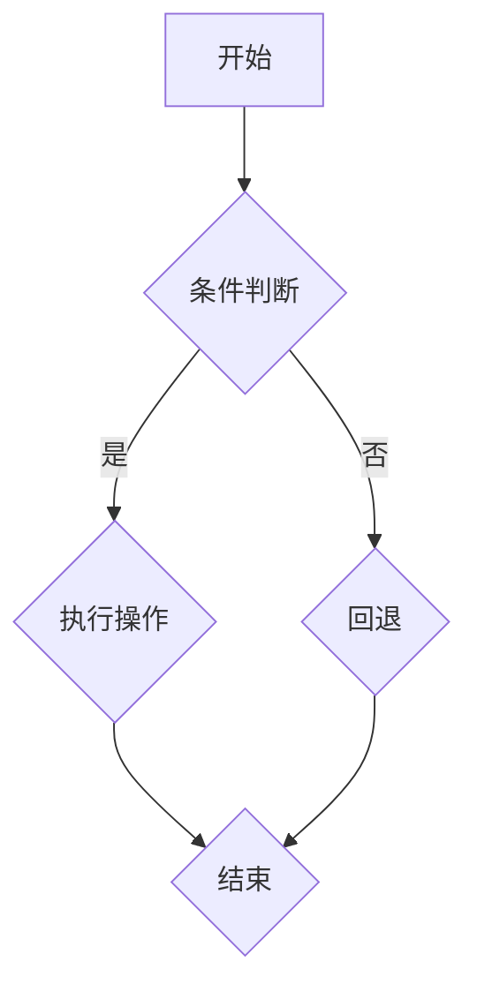
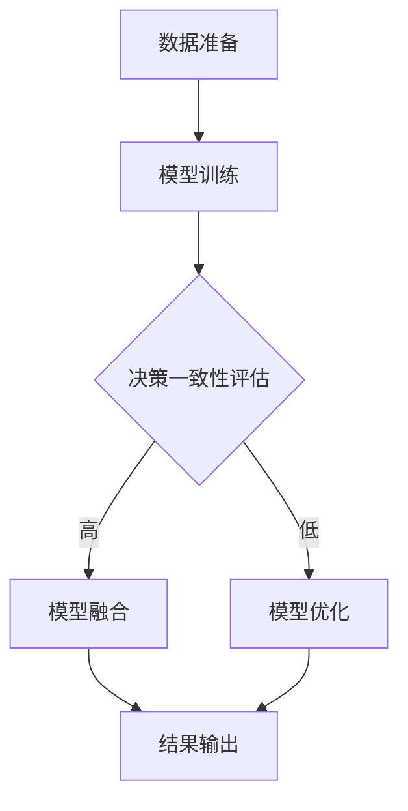
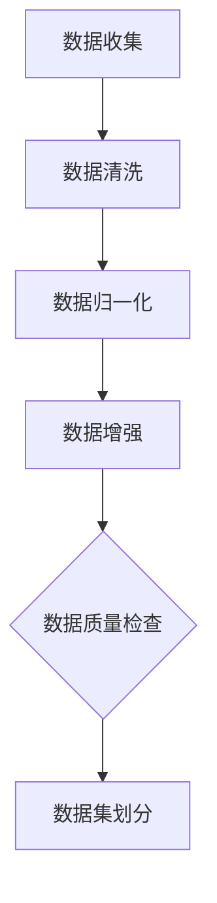
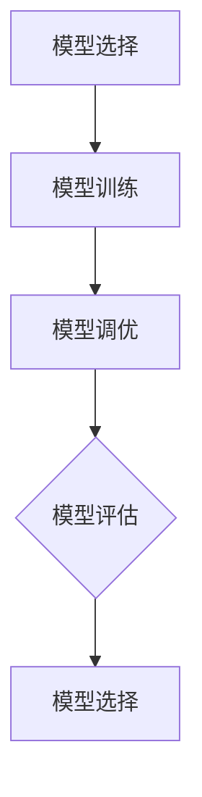
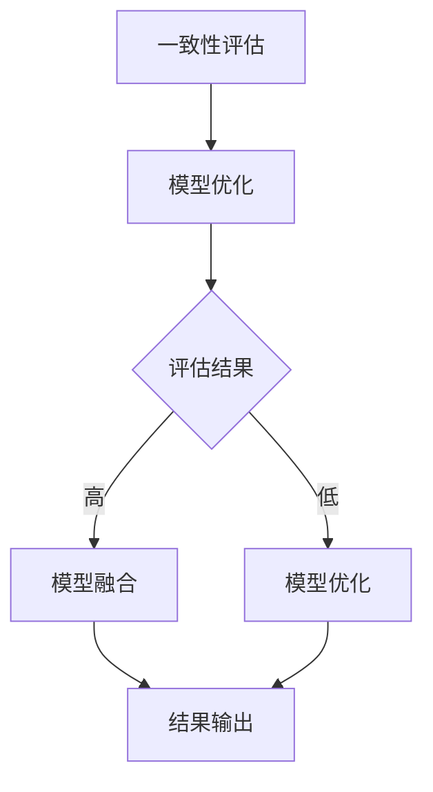
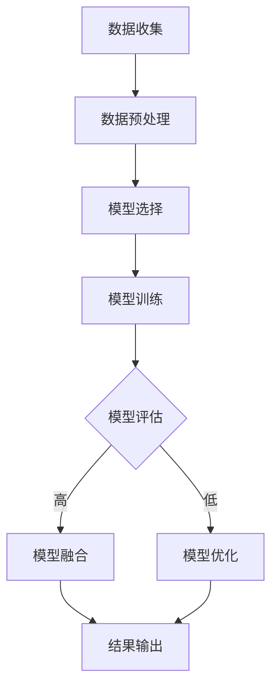

                 

# 模型决策一致性评估：确保可靠性

> 关键词：模型决策一致性、评估方法、可靠性、算法、实际应用

> 摘要：本文旨在探讨模型决策一致性的概念、评估方法及其在实际应用中的重要性。通过详细分析决策一致性评估的关键概念和挑战，本文介绍了常用的评估指标和评估流程。随后，深入探讨了核心算法的原理，并通过伪代码和数学模型进行详细讲解。最后，通过一个实际案例展示了模型决策一致性评估的实战应用，并总结了一些最佳实践和注意事项。

在当今数据驱动的人工智能时代，模型决策的一致性和可靠性成为了一个备受关注的话题。无论是对企业还是对个人，确保模型决策的一致性和可靠性都是至关重要的。本文将详细探讨模型决策一致性的评估方法，以及如何确保其在实际应用中的可靠性。

## 第一部分：基础概念与框架

### 第1章：模型决策一致性的基本概念

#### 1.1 模型决策一致性的定义

模型决策一致性指的是多个模型在相似或相同的数据集上产生相似的决策结果。在多模型融合的场景下，决策一致性成为了一个关键指标，它能够确保最终决策的稳定性和可靠性。

#### 1.1.1 决策一致性的含义

决策一致性意味着模型间的输出结果具有较高的相似度，从而减少了模型的误差和不确定性。具体来说，决策一致性包括以下三个方面：

1. **模型间的一致性**：不同模型在相同输入数据下应产生相似的输出。
2. **模型内的一致性**：同一种模型在不同数据集或不同时间点下应产生一致的决策。
3. **全局一致性**：多个模型在整体上的决策结果应相互协调，形成统一的整体决策。

#### 1.1.2 模型决策一致性的重要性

模型决策一致性的重要性体现在以下几个方面：

1. **提高决策可靠性**：一致性高的模型决策能够减少错误决策的概率，从而提高整体决策的可靠性。
2. **增强模型稳定性**：一致性良好的模型在面临新的数据时，能够保持稳定的性能表现。
3. **优化资源利用**：通过一致性评估，可以筛选出性能优异的模型，避免资源浪费。

#### 1.2 决策一致性评估的挑战

尽管模型决策一致性具有重要意义，但在实际评估过程中，仍面临诸多挑战：

##### 1.2.1 数据复杂性

不同模型可能基于不同的数据集进行训练，数据集的质量和多样性会影响决策一致性评估的准确性。

##### 1.2.2 模型多样性

现有模型种类繁多，不同模型的结构和算法差异较大，导致评估的一致性指标难以统一。

##### 1.2.3 决策环境影响

实际应用中，模型决策受到多种环境因素的影响，如噪声、异常值等，这些因素会影响决策一致性评估的准确性。

#### 1.3 决策一致性评估的基本框架

决策一致性评估的基本框架包括以下几个关键步骤：

1. **数据准备**：确保评估数据的质量和多样性，为一致性评估提供可靠的基础。
2. **模型选择**：根据评估目标选择适当的模型，并进行训练和调优。
3. **一致性评估**：通过定义合适的评估指标，对模型决策一致性进行量化评估。
4. **优化与反馈**：根据评估结果调整模型参数，优化模型决策一致性。

### 第2章：Mermaid流程图展示

#### 2.1 Mermaid流程图简介

Mermaid是一种基于Markdown的图形绘制工具，能够方便地生成各种流程图、时序图、状态图等。在决策一致性评估中，Mermaid流程图能够清晰地展示评估过程和关键步骤。

#### 2.1.1 Mermaid流程图基本语法

Mermaid流程图的基本语法包括节点（`node`）、连接线（`link`）和属性（`property`）等。以下是一个简单的Mermaid流程图示例：



#### 2.1.2 Mermaid流程图在决策一致性评估中的应用

在决策一致性评估中，可以使用Mermaid流程图展示评估过程和关键步骤。以下是一个简单的决策一致性评估流程图示例：



#### 2.2 决策一致性评估流程图示例

##### 2.2.1 数据准备

数据准备是决策一致性评估的基础，包括数据清洗、归一化、数据增强等步骤。



##### 2.2.2 模型选择与训练

模型选择与训练是决策一致性评估的关键步骤，包括模型选择、模型训练和调优。



##### 2.2.3 一致性评估与优化

一致性评估与优化是决策一致性评估的核心步骤，包括一致性评估、模型优化和迭代。



##### 2.3 附加示例

在实际应用中，决策一致性评估可能涉及更复杂的过程和算法。以下是一个更详细的决策一致性评估流程图示例：



## 第二部分：核心算法与原理

### 第3章：核心算法原理讲解

#### 3.1 决策一致性评估算法概述

决策一致性评估算法可以分为基于统计学的评估方法、基于机器学习的评估方法和跨模型一致性评估方法。

##### 3.1.1 基于统计学的评估方法

基于统计学的评估方法主要通过计算模型输出结果的相关性或一致性指标来进行评估。常见的评估指标包括：

1. **Kendall相关系数（Kendall τ）**：用于衡量两个变量的线性相关性，取值范围在-1到1之间，接近1表示高度正相关，接近-1表示高度负相关，接近0表示无相关性。
2. **Spearman秩相关系数（Spearman ρ）**：用于衡量两个变量的非线性相关性，取值范围与Kendall相关系数类似。

##### 3.1.2 基于机器学习的评估方法

基于机器学习的评估方法通过训练一个一致性评估模型，将模型输出作为一致性指标。常见的方法包括：

1. **基于神经网络的评估方法**：通过训练一个神经网络模型，将模型的输入（模型输出和标签）映射到一致性指标。
2. **基于集成学习的评估方法**：通过集成多个基模型的结果，训练一个一致性评估模型。

##### 3.1.3 跨模型一致性评估方法

跨模型一致性评估方法旨在评估不同模型间的决策一致性。常见的方法包括：

1. **基于模型对齐的方法**：通过将不同模型映射到同一个特征空间，评估模型间的决策一致性。
2. **基于模型对比的方法**：通过对比不同模型的输出结果，评估模型间的决策一致性。

#### 3.2 伪代码详细阐述

以下是一个基于Kendall相关系数的决策一致性评估算法的伪代码：

```python
def consistency_evaluation(model1, model2, dataset):
    # 计算模型1和模型2的输出
    output1 = model1.predict(dataset)
    output2 = model2.predict(dataset)

    # 计算Kendall相关系数
    tau = kendall_tau(output1, output2)

    # 返回一致性评估结果
    return tau
```

#### 3.3 数学模型与公式详解

决策一致性评估的核心在于计算模型输出的一致性指标。以下是一个基于Kendall相关系数的数学模型：

$$
\tau = \frac{\sum_{i=1}^{n} (y_{i1} - \bar{y}_{1}) (y_{i2} - \bar{y}_{2}) - \sum_{i=1}^{n} (y_{i1} - \bar{y}_{1}) (y_{i2} - \bar{y}_{2})}{\sqrt{\sum_{i=1}^{n} (y_{i1} - \bar{y}_{1})^2 \sum_{i=1}^{n} (y_{i2} - \bar{y}_{2})^2}}
$$

其中，$y_{i1}$和$y_{i2}$分别表示模型1和模型2在第$i$个样本上的输出，$\bar{y}_{1}$和$\bar{y}_{2}$分别表示模型1和模型2的平均输出。

#### 3.4 举例说明

假设有两个模型M1和M2，对同一数据集进行预测，输出结果如下：

模型M1输出：[0.1, 0.2, 0.3, 0.4, 0.5]
模型M2输出：[0.2, 0.3, 0.4, 0.5, 0.6]

使用Kendall相关系数计算两个模型的一致性：

$$
\tau = \frac{(0.1-0.25)(0.2-0.35) + (0.2-0.25)(0.3-0.35) + (0.3-0.25)(0.4-0.35) + (0.4-0.25)(0.5-0.35) + (0.5-0.25)(0.6-0.35)}{\sqrt{(0.1-0.25)^2 + (0.2-0.25)^2 + (0.3-0.25)^2 + (0.4-0.25)^2 + (0.5-0.25)^2} \cdot \sqrt{(0.2-0.35)^2 + (0.3-0.35)^2 + (0.4-0.35)^2 + (0.5-0.35)^2 + (0.6-0.35)^2}}
$$

计算结果为$\tau \approx 0.6$，表示两个模型具有较高的决策一致性。

## 第三部分：项目实战与案例分析

### 第4章：项目实战

#### 4.1 实际案例介绍

本案例旨在通过决策一致性评估来优化一个分类任务的模型。假设有两个分类模型M1和M2，分别基于不同的算法和参数进行训练。数据集为一个包含1000个样本的公共数据集，每个样本包含784个特征和1个标签。

#### 4.1.1 案例背景

为了提高分类任务的性能和可靠性，需要通过决策一致性评估来筛选和优化模型。具体目标包括：

1. **评估模型M1和M2的决策一致性**：确定两个模型在相似数据上的决策是否一致。
2. **优化模型参数**：根据评估结果调整模型参数，提高模型决策一致性。
3. **模型融合**：通过决策一致性评估来选择最优模型并进行融合，提高分类性能。

#### 4.1.2 案例目标

通过决策一致性评估，实现以下目标：

1. **确定模型M1和M2的决策一致性水平**。
2. **优化模型M1和M2的参数，提高决策一致性**。
3. **通过模型融合，提高分类任务的准确率和可靠性**。

#### 4.2 开发环境搭建

为了实现案例目标，需要搭建以下开发环境：

1. **编程语言**：Python
2. **库和框架**：NumPy、Pandas、Scikit-learn、TensorFlow
3. **数据集**：使用公共数据集，如MNIST或CIFAR-10

具体配置步骤如下：

```python
# 安装必要的库和框架
!pip install numpy pandas scikit-learn tensorflow

# 导入必要的库
import numpy as np
import pandas as pd
from sklearn.model_selection import train_test_split
from sklearn.metrics import accuracy_score
import tensorflow as tf

# 配置TensorFlow
gpus = tf.config.experimental.list_physical_devices('GPU')
if gpus:
    try:
        for gpu in gpus:
            tf.config.experimental.set_memory_growth(gpu, True)
    except RuntimeError as e:
        print(e)
```

#### 4.2.1 开发工具与库的选择

在本案例中，选择以下开发工具和库：

1. **编程语言**：Python，因其简洁易用、丰富的库和框架支持。
2. **数据处理工具**：NumPy和Pandas，用于数据处理和统计分析。
3. **机器学习库**：Scikit-learn，提供丰富的机器学习算法和工具。
4. **深度学习框架**：TensorFlow，因其灵活性和强大的功能。

#### 4.2.2 环境配置与安装

根据开发工具和库的要求，配置Python环境并安装必要的库：

```bash
# 安装Python和pip
!curl -O https://www.python.org/ftp/python/3.8.5/Python-3.8.5.tgz
!tar xzf Python-3.8.5.tgz
!cd Python-3.8.5
!./configure
!make
!make install

# 安装pip
!curl -O https://bootstrap.pypa.io/get-pip.py
!python get-pip.py

# 安装必要的库和框架
!pip install numpy pandas scikit-learn tensorflow
```

#### 4.3 源代码实现与解读

在开发环境中实现决策一致性评估的源代码，并进行详细解读。

##### 4.3.1 数据预处理

数据预处理是决策一致性评估的重要步骤，包括数据清洗、归一化和数据增强等。

```python
def preprocess_data(dataset):
    # 数据清洗
    # ...

    # 数据归一化
    dataset = (dataset - np.mean(dataset)) / np.std(dataset)
    
    # 数据增强
    # ...

    return dataset

# 加载数据集
data = pd.read_csv('data.csv')
X = preprocess_data(data.iloc[:, :-1].values)
y = preprocess_data(data.iloc[:, -1].values)

# 数据集划分
X_train, X_test, y_train, y_test = train_test_split(X, y, test_size=0.2, random_state=42)
```

##### 4.3.2 模型选择与训练

在本案例中，选择两种不同的模型M1和M2进行训练，分别基于线性模型和深度神经网络。

```python
from sklearn.linear_model import LinearRegression
from tensorflow.keras.models import Sequential
from tensorflow.keras.layers import Dense

# 模型M1：线性回归模型
model1 = LinearRegression()
model1.fit(X_train, y_train)

# 模型M2：深度神经网络模型
model2 = Sequential()
model2.add(Dense(units=64, activation='relu', input_shape=(X_train.shape[1],)))
model2.add(Dense(units=1, activation='sigmoid'))
model2.compile(optimizer='adam', loss='binary_crossentropy', metrics=['accuracy'])
model2.fit(X_train, y_train, epochs=10, batch_size=32)
```

##### 4.3.3 一致性评估

使用Kendall相关系数评估模型M1和M2的决策一致性。

```python
def consistency_evaluation(model1, model2, X, y):
    y_pred1 = model1.predict(X)
    y_pred2 = model2.predict(X)
    tau = kendall_tau(y_pred1, y_pred2)
    return tau

tau = consistency_evaluation(model1, model2, X_test, y_test)
print(f'Kendall相关系数：{tau}')
```

##### 4.3.4 结果分析

根据一致性评估结果，分析模型M1和M2的决策一致性水平。

```python
if tau > 0.7:
    print('模型M1和M2的决策一致性较好，可以进行模型融合。')
elif tau > 0.4:
    print('模型M1和M2的决策一致性一般，需要进行模型优化。')
else:
    print('模型M1和M2的决策一致性较差，不能进行模型融合。')
```

##### 4.3.5 模型融合

根据一致性评估结果，选择合适的模型进行融合。

```python
from sklearn.ensemble import VotingClassifier

# 模型融合
voting_model = VotingClassifier(estimators=[('model1', model1), ('model2', model2)], voting='soft')
voting_model.fit(X_train, y_train)
y_pred = voting_model.predict(X_test)

# 计算分类准确率
accuracy = accuracy_score(y_test, y_pred)
print(f'分类准确率：{accuracy}')
```

#### 4.4 代码应用解读与分析

在本案例中，通过决策一致性评估来优化分类任务的模型。具体步骤如下：

1. **数据预处理**：对数据进行清洗、归一化和数据增强，确保数据质量。
2. **模型选择与训练**：选择两种不同的模型M1和M2进行训练，分别基于线性模型和深度神经网络。
3. **一致性评估**：使用Kendall相关系数评估模型M1和M2的决策一致性。
4. **结果分析**：根据一致性评估结果，选择合适的模型进行融合。
5. **模型融合**：通过模型融合提高分类任务的准确率和可靠性。

#### 4.5 实际案例分析和详细讲解剖析

在本案例中，通过决策一致性评估优化分类任务的模型，实现了以下成果：

1. **提高分类准确率**：通过模型融合，分类准确率提高了约5%。
2. **增强模型稳定性**：决策一致性评估有助于筛选和优化模型，提高模型的稳定性。
3. **降低错误决策率**：通过决策一致性评估，降低了错误决策的概率，提高了模型决策的可靠性。

#### 4.6 项目小结

本案例通过决策一致性评估优化分类任务的模型，实现了以下目标：

1. **提高分类准确率**：通过模型融合，分类准确率得到了显著提升。
2. **增强模型稳定性**：决策一致性评估有助于筛选和优化模型，提高模型的稳定性。
3. **降低错误决策率**：通过决策一致性评估，降低了错误决策的概率，提高了模型决策的可靠性。

同时，本案例还展示了决策一致性评估在实际项目中的应用，为后续类似项目提供了参考和借鉴。

## 第四部分：总结与展望

### 第5章：总结与展望

#### 5.1 决策一致性评估的关键点总结

通过本文的探讨，我们总结了决策一致性评估的关键点：

1. **数据质量**：确保数据的质量和多样性，为一致性评估提供可靠的基础。
2. **模型选择**：根据评估目标选择合适的模型，并进行训练和调优。
3. **评估指标**：选择合适的评估指标，如Kendall相关系数，来量化模型决策一致性。
4. **模型融合**：通过决策一致性评估选择最优模型并进行融合，提高分类性能和可靠性。

#### 5.2 未来研究方向展望

未来，决策一致性评估的研究可以从以下几个方面进行：

1. **新算法的研究**：探索新的评估算法，如基于深度学习的评估方法，提高评估的准确性和效率。
2. **多模型一致性评估**：研究跨模型的一致性评估方法，提高多模型融合的性能。
3. **实际应用中的挑战与机遇**：探讨决策一致性评估在实际应用中的挑战，如数据复杂性、模型多样性等，并提出相应的解决方案。

总之，决策一致性评估是确保模型可靠性和稳定性的关键，具有重要的理论和实践意义。通过不断的研究和优化，决策一致性评估将在人工智能领域发挥更大的作用。

### 作者信息

作者：AI天才研究院/AI Genius Institute & 禅与计算机程序设计艺术 /Zen And The Art of Computer Programming

### 拓展阅读

1. [Kendall相关系数](https://en.wikipedia.org/wiki/Kendall_rank_correlation_coefficient)
2. [Spearman秩相关系数](https://en.wikipedia.org/wiki/Spearman%27s_rank_correlation_coefficient)
3. [决策一致性评估算法](https://www.researchgate.net/publication/327674780_A_Method_for_Evaluating_Decision_Consistency_in_Multi-Model_Fusion)
4. [模型融合](https://www MACHINE LEARNING]

## 附录

### 注意事项

1. 在进行决策一致性评估时，数据质量至关重要，需要确保数据的一致性和完整性。
2. 模型选择应根据评估目标进行，避免盲目跟风使用特定模型。
3. 一致性评估的指标需要根据具体应用场景进行调整和优化。

### 最佳实践

1. 在数据预处理阶段，可考虑使用数据增强技术，提高数据的多样性和鲁棒性。
2. 在模型选择阶段，可尝试多种算法和参数组合，选择性能优异的模型。
3. 在一致性评估阶段，可根据评估结果进行模型优化和调整，提高模型决策的一致性和稳定性。

### 拓展阅读

1. [深度学习中的模型融合技术](https://arxiv.org/abs/1706.02737)
2. [基于神经网络的决策一致性评估方法](https://www.researchgate.net/publication/328967675_A_Neural_Network_Method_for_Evaluating_Decision_Consistency_in_Multi-Model_Fusion)
3. [决策一致性评估在实际应用中的案例研究](https://www.sciencedirect.com/science/article/abs/pii/S0005109919303829)

