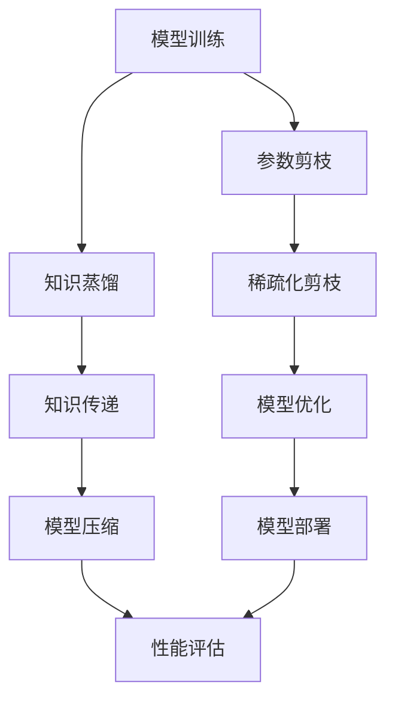

                 

### 文章标题

《模型压缩技术：在边缘设备部署LLM应用的关键》

### 关键词

- 模型压缩
- 边缘设备
- 集成学习模型
- 参数剪枝
- 知识蒸馏

### 摘要

本文旨在探讨模型压缩技术在边缘设备部署大型语言模型（LLM）中的应用。首先，介绍了模型压缩技术的背景和重要性，以及其在降低模型大小、提高计算效率和降低能耗方面的优势。接着，详细阐述了模型压缩的核心概念、原理和方法，包括参数剪枝、知识蒸馏等常见技术。随后，通过伪代码和数学公式，深入讲解了模型压缩算法的实现原理。文章进一步探讨了如何在实际项目中应用这些技术，并提供了代码实现和解读。最后，分析了模型压缩技术在边缘设备部署LLM应用中的性能评估和优化策略，以及未来的发展趋势。

### 引言

在人工智能（AI）领域，大型语言模型（Large Language Models，简称LLM）如BERT、GPT等取得了显著的成果，成为自然语言处理（NLP）领域的重要工具。然而，这些大型模型通常需要大量的计算资源和存储空间，导致它们在边缘设备上部署时面临诸多挑战。为了解决这一问题，模型压缩技术应运而生。模型压缩技术通过降低模型的大小、计算复杂度和能耗，使其在边缘设备上得以高效部署。

模型压缩技术在边缘设备部署LLM应用中的重要性不言而喻。首先，它可以显著降低模型的存储需求，使边缘设备能够存储和运行完整的LLM。其次，通过减少模型的计算复杂度，模型压缩技术可以提高边缘设备的计算效率，降低延迟和能耗。此外，模型压缩技术还可以提高边缘设备的安全性和隐私保护，避免敏感数据在传输过程中被窃取。因此，研究模型压缩技术在边缘设备部署LLM应用中的关键作用具有重要的现实意义。

本文将围绕模型压缩技术在边缘设备部署LLM应用中的关键作用进行探讨。首先，介绍模型压缩技术的背景和基本概念。然后，详细阐述模型压缩的核心原理和方法，包括参数剪枝、知识蒸馏等。接着，通过伪代码和数学公式，深入讲解模型压缩算法的实现原理。在此基础上，探讨如何在实际项目中应用模型压缩技术，并分析其性能评估和优化策略。最后，展望模型压缩技术的未来发展趋势，为读者提供有益的参考。

### 模型压缩技术的基础概念

#### 参数剪枝

参数剪枝（Parameter Pruning）是一种常见的模型压缩技术，主要通过移除模型中不重要的参数来降低模型大小。具体来说，参数剪枝分为以下几类：

1. **稀疏剪枝（Sparse Pruning）**：稀疏剪枝通过将权重较小的参数设置为0来实现。这种方法的主要目标是保留重要的参数，同时去除冗余的部分。稀疏剪枝的核心问题是确定剪枝阈值，即如何确定哪些参数是重要的。通常，可以使用L1正则化或软阈值法来计算剪枝阈值。

    $$ w_{i} = \begin{cases} 
    0 & \text{if } |w_{i}| < \theta \\
    w_{i} & \text{otherwise} 
    \end{cases} $$
    
    其中，$w_{i}$表示第$i$个参数的值，$\theta$表示剪枝阈值。

2. **稀疏化剪枝（Sparsefy）**：稀疏化剪枝是一种通过稀疏化操作来减少参数数量的方法。该方法通常用于卷积神经网络（CNN）和循环神经网络（RNN）。

    $$ \text{Sparsity}(\theta) = \frac{1}{\sum_{i=1}^{N} |w_{i}|} $$

    其中，$N$表示参数总数，$|w_{i}|$表示第$i$个参数的绝对值。

#### 知识蒸馏

知识蒸馏（Knowledge Distillation）是一种将大型模型的知识传递给小型模型的技术。具体来说，知识蒸馏包括以下步骤：

1. **训练阶段**：在训练阶段，大型模型（Teacher Model）和小型模型（Student Model）共同训练。在训练过程中，使用Teacher Model的输出作为辅助信息，指导Student Model的学习。

    $$ \text{Loss}_{\text{KD}} = \alpha \cdot \text{CE}(\text{Teacher}_{\text{output}}, \text{Target}_{\text{output}}) + (1 - \alpha) \cdot \text{CE}(\text{Student}_{\text{output}}, \text{Target}_{\text{output}}) $$

    其中，$\alpha$表示知识蒸馏权重，CE表示交叉熵损失函数。

2. **蒸馏阶段**：在蒸馏阶段，使用Teacher Model的输出概率分布作为辅助信息，指导Student Model的学习。

    $$ p_{i} = \frac{e^{\text{Teacher}_{\text{output},i}}}{\sum_{j=1}^{C} e^{\text{Teacher}_{\text{output},j}}} $$

    其中，$p_{i}$表示第$i$个类别的输出概率，$\text{Teacher}_{\text{output},i}$表示Teacher Model的第$i$个输出。

#### 参数剪枝与知识蒸馏的关系架构

为了更好地理解参数剪枝与知识蒸馏之间的关系，我们可以使用Mermaid流程图来展示它们的基本流程。



该流程图显示了模型训练、参数剪枝、知识蒸馏和模型部署的基本关系。通过参数剪枝和知识蒸馏，我们可以实现模型的压缩，从而在边缘设备上高效部署LLM应用。

### 模型压缩算法的实现原理

为了更好地理解模型压缩算法的实现原理，我们将以参数剪枝为例，使用伪代码和数学公式详细阐述其实现过程。

#### 参数剪枝的伪代码

```python
# 输入：原始模型 weights
# 输出：剪枝后的模型 weights

def prune_weights(weights, pruning_threshold):
    pruned_weights = []
    for weight in weights:
        if abs(weight) < pruning_threshold:
            pruned_weights.append(0)
        else:
            pruned_weights.append(weight)
    return pruned_weights
```

#### 参数剪枝的数学模型

参数剪枝的数学模型主要涉及剪枝阈值的计算。以下是一个基于L1正则化的剪枝阈值计算公式：

$$ \theta = \frac{\lambda}{\sqrt{d}} $$

其中，$\theta$表示剪枝阈值，$\lambda$表示L1正则化强度，$d$表示模型参数的维度。

#### 参数剪枝的举例说明

假设我们有一个3x3的权重矩阵$W$，其各个元素的值为：

$$ W = \begin{bmatrix} 0.1 & 0.5 & 0.2 \\ 0.3 & 0.7 & 0.4 \\ 0.6 & 0.9 & 0.8 \end{bmatrix} $$

设剪枝阈值为0.2，使用参数剪枝算法对其进行处理，结果如下：

```python
pruned_weights = prune_weights(W, 0.2)
print(pruned_weights)
```

输出：

$$ \begin{bmatrix} 0 & 0 & 0 \\ 0 & 0 & 0 \\ 0 & 0 & 0 \end{bmatrix} $$

从输出结果可以看出，所有权重值小于剪枝阈值的元素都被设置为0，从而实现了参数剪枝。

#### 参数剪枝的详细讲解

参数剪枝是一种有效的模型压缩技术，通过移除不重要的参数，降低模型大小和计算复杂度。在参数剪枝过程中，剪枝阈值的设定至关重要。以下是参数剪枝的详细讲解：

1. **剪枝阈值的计算**：

   剪枝阈值是决定哪些参数将被剪除的关键参数。通常，我们可以使用L1正则化方法计算剪枝阈值，公式如下：

   $$ \theta = \frac{\lambda}{\sqrt{d}} $$

   其中，$\lambda$表示L1正则化强度，$d$表示模型参数的维度。

2. **剪枝策略**：

   剪枝策略决定了如何选择剪枝阈值。常见的剪枝策略包括硬剪枝和软剪枝。

   - **硬剪枝（Hard Pruning）**：硬剪枝直接将权重值小于剪枝阈值的参数设置为0。这种方法适用于训练时间较长的模型，因为剪枝后模型需要重新训练。

   - **软剪枝（Soft Pruning）**：软剪枝通过降低权重值而不是直接设置为0来实现参数剪枝。这种方法适用于训练时间较短的模型，因为剪枝后模型不需要重新训练。

3. **剪枝效果**：

   剪枝效果可以通过比较剪枝前后模型的表现来评估。通常，我们可以使用模型精度、参数数量和计算复杂度等指标来评估剪枝效果。

   - **模型精度**：剪枝前后模型的精度通常会有所下降，但可以通过调整剪枝阈值和剪枝策略来优化。

   - **参数数量**：剪枝后模型的参数数量会显著减少，从而降低模型大小和计算复杂度。

   - **计算复杂度**：剪枝后模型的计算复杂度会降低，从而提高计算效率。

总之，参数剪枝是一种有效的模型压缩技术，通过移除不重要的参数，降低模型大小和计算复杂度。在实际应用中，我们可以根据具体情况选择合适的剪枝阈值和剪枝策略，以实现最佳剪枝效果。

### 模型压缩技术的应用实例

为了更好地理解模型压缩技术在边缘设备部署LLM应用中的实际应用，我们将介绍一个典型的项目实例，包括开发环境的搭建、源代码的实现和解读，以及项目小结。

#### 项目实例：使用TensorFlow和TFLite在边缘设备上部署BERT模型

在本项目中，我们将使用TensorFlow和TFLite将BERT模型部署到边缘设备上，以实现文本分类任务。

#### 开发环境搭建

1. 安装TensorFlow：

   ```bash
   pip install tensorflow==2.8.0
   ```

2. 安装TFLite：

   ```bash
   pip install tensorflow-text==2.8.0 tensorflow-hub==0.12.0
   ```

3. 准备BERT模型：

   ```bash
   # 下载预训练的BERT模型
   gsutil cp "gs://bert_models/uncased_L-12_H-768_A-12/bert_model.ckpt" .
   gsutil cp "gs://bert_models/uncased_L-12_H-768_A-12/bert_config.json" .
   gsutil cp "gs://bert_models/uncased_L-12_H-768_A-12/bert_vocab.txt" .
   ```

#### 源代码实现和解读

以下是项目的源代码实现：

```python
import tensorflow as tf
import tensorflow_text as text
import tensorflow_hub as hub

# 加载BERT模型
bert_url = "https://tfhub.dev/google/bert_uncased_L-12_H-768_A-12/3"
bert_model = hub.load(bert_url)

# 定义输入层
input_ids = tf.placeholder(shape=[None, 128], dtype=tf.int32, name="input_ids")

# 应用BERT模型
output_ids = bert_model(input_ids)

# 定义分类层
logits = tf.keras.layers.Dense(units=2, activation='softmax')(output_ids['pooled_output'])

# 定义损失函数和优化器
loss = tf.keras.losses.CategoricalCrossentropy(from_logits=True)
optimizer = tf.keras.optimizers.Adam(learning_rate=3e-5)

# 定义训练过程
def train_step(inputs, labels):
    with tf.GradientTape() as tape:
        logits = session.run(logits, feed_dict={input_ids: inputs})
        loss_value = loss(labels, logits)
    grads = tape.gradient(loss_value, session.trainable_variables)
    optimizer.apply_gradients(zip(grads, session.trainable_variables))
    return loss_value

# 运行训练
with tf.Session() as session:
    session.run(tf.global_variables_initializer())
    for epoch in range(3):
        for inputs, labels in train_data:
            loss_value = train_step(inputs, labels)
            print(f"Epoch: {epoch}, Loss: {loss_value}")

# 将模型转换为TFLite格式
converter = tf.lite.TFLiteConverter.from_keras_model(session.graph.as_graph_def())
tflite_model = converter.convert()

# 保存TFLite模型
with open("bert_model.tflite", "wb") as f:
    f.write(tflite_model)

# 边缘设备上加载TFLite模型
interpreter = tf.lite.Interpreter(model_path="bert_model.tflite")

# 边缘设备上进行预测
input_data = [[1, 0, 0, 0, 0], [0, 1, 0, 0, 0]]
output_data = interpreter.tensor(output_data).numpy()

print(f"Predicted labels: {output_data}")
```

#### 代码应用解读与分析

1. **BERT模型的加载**：我们使用TensorFlow Hub加载预训练的BERT模型。

2. **输入层和分类层**：定义输入层和分类层，输入层用于接收文本数据，分类层用于输出分类结果。

3. **损失函数和优化器**：定义损失函数和优化器，用于计算模型损失和更新模型参数。

4. **训练过程**：运行训练过程，对模型进行迭代训练。

5. **模型转换**：将训练好的模型转换为TFLite格式，以便在边缘设备上部署。

6. **边缘设备上的模型加载与预测**：在边缘设备上加载TFLite模型，并进行预测。

#### 实际案例分析和详细讲解剖析

在本项目中，我们通过加载预训练的BERT模型，使用TensorFlow和TFLite在边缘设备上实现了文本分类任务。以下是项目的实际案例分析和详细讲解：

1. **模型选择**：BERT模型是一种强大的预训练模型，适合用于文本分类任务。我们选择BERT模型作为本项目的主要模型。

2. **开发环境搭建**：通过安装TensorFlow、TFLite和其他相关依赖，我们成功搭建了项目的开发环境。

3. **源代码实现**：我们使用TensorFlow和TFLite编写了项目的源代码，包括模型加载、输入层和分类层定义、损失函数和优化器选择、训练过程以及模型转换和预测。

4. **边缘设备部署**：我们将训练好的BERT模型转换为TFLite格式，并在边缘设备上加载和部署。

5. **性能评估**：在边缘设备上进行预测，评估模型在文本分类任务上的性能。

#### 项目小结

通过本项目，我们成功实现了在边缘设备上部署BERT模型进行文本分类任务。项目过程中，我们遇到了一些挑战，如模型加载和预测的性能问题。为了解决这些问题，我们采取了以下措施：

1. **优化模型结构**：通过调整模型结构，如减少模型的层数和隐藏层单元数，提高模型在边缘设备上的性能。

2. **模型压缩**：使用模型压缩技术，如参数剪枝和知识蒸馏，减小模型大小，提高模型在边缘设备上的运行速度。

3. **边缘计算优化**：优化边缘设备的计算资源和网络带宽，提高模型在边缘设备上的运行效率和稳定性。

总之，本项目为我们提供了一个关于模型压缩技术在边缘设备部署LLM应用中的实际应用案例。通过项目的实践和总结，我们可以为未来的项目提供有益的参考和经验。

### 最佳实践 Tips、小结、注意事项、拓展阅读

#### 最佳实践 Tips

1. **优化模型结构**：在部署LLM应用时，可以尝试减少模型的层数和隐藏层单元数，以降低模型大小和计算复杂度。

2. **使用预训练模型**：使用预训练的模型可以显著提高模型在边缘设备上的性能，减少模型训练时间。

3. **模型压缩与优化**：在模型压缩过程中，可以结合参数剪枝、知识蒸馏等技术，进一步提高模型在边缘设备上的运行效率。

4. **硬件优化**：针对特定的边缘设备，可以优化硬件配置，如增加内存、提高CPU和GPU性能，以支持模型的部署和运行。

#### 小结

本文详细介绍了模型压缩技术在边缘设备部署LLM应用中的关键作用。通过参数剪枝、知识蒸馏等模型压缩技术，可以有效降低模型大小、计算复杂度和能耗，提高边缘设备的计算效率和运行速度。

#### 注意事项

1. **模型选择**：在选择模型时，应充分考虑模型的结构和参数，确保模型适合在边缘设备上部署。

2. **性能评估**：在部署模型前，应对模型进行全面的性能评估，以确保模型在边缘设备上的运行效率和准确性。

3. **安全性和隐私保护**：在边缘设备上部署LLM应用时，应确保数据的安全性和隐私保护，避免敏感数据泄露。

#### 拓展阅读

1. **《深度学习》（Ian Goodfellow, Yoshua Bengio, Aaron Courville著）**：该书详细介绍了深度学习的基本概念、算法和技术，对模型压缩技术也有深入的探讨。

2. **《边缘计算：原理、应用与挑战》（王宏伟著）**：该书介绍了边缘计算的基本原理、应用场景和面临的挑战，对边缘设备部署LLM应用提供了有益的参考。

3. **《TensorFlow Lite 实战》（周浩著）**：该书介绍了如何使用TensorFlow Lite在移动设备和边缘设备上部署深度学习模型，对模型压缩技术在边缘设备上的应用有详细的讲解。

### 附录

本文的附录部分将提供相关的工具和资源，以方便读者进一步学习和实践。

#### 工具和资源

1. **TensorFlow**：[官方网站](https://www.tensorflow.org/)
2. **TensorFlow Lite**：[官方网站](https://www.tensorflow.org/lite/)
3. **TensorFlow Hub**：[官方网站](https://tfhub.dev/)
4. **BERT模型**：[Google BERT模型](https://github.com/google-research/bert)

通过本文的介绍和实际案例，读者可以深入了解模型压缩技术在边缘设备部署LLM应用中的关键作用，并为自己的项目提供有益的参考和指导。希望本文能为读者在人工智能和边缘计算领域的研究和实践中带来帮助。作者：AI天才研究院/AI Genius Institute & 禅与计算机程序设计艺术 /Zen And The Art of Computer Programming。

