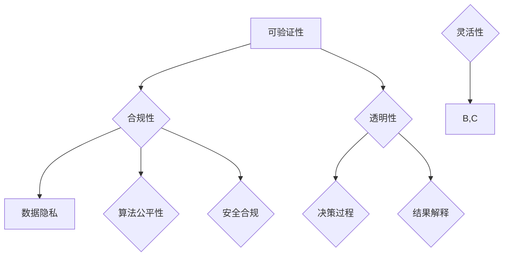

                 

### 文章标题：模型可审核性测试：确保合规与透明

> 关键词：模型审核性、合规性、透明性、测试方法、工具与框架、案例分析、最佳实践

> 摘要：本文将深入探讨模型可审核性测试的重要性和方法，旨在为读者提供一个全面的技术指南，帮助他们在实际项目中确保模型合规与透明。我们将从模型可审核性的基本概念入手，逐步介绍测试类型、工具与框架、测试过程，并通过具体案例分析，总结最佳实践和注意事项。

---

### 引言

在当今的数据驱动时代，人工智能（AI）模型已经成为各行各业决策支持的核心工具。然而，随着模型的广泛应用，其合规性和透明性问题日益突出。模型可审核性测试作为确保模型合规与透明的重要手段，正在成为AI领域的研究热点。

模型可审核性测试的主要目标是验证模型在数据处理、决策生成和结果解释过程中的合规性和透明性。这不仅仅是为了满足法律法规的要求，更是为了增强模型的可信度和用户信任。

本文将分为四个主要部分：

1. **模型可审核性的概念与原则**：介绍可审核性的基本概念、合规性和透明性。
2. **模型可审核性测试方法**：讨论不同的测试类型、常用的工具与框架以及测试过程。
3. **模型可审核性测试案例**：通过具体案例分析，展示测试过程和结果。
4. **提高模型可审核性的最佳实践**：总结最佳实践、注意事项和未来发展方向。

---

### 模型可审核性的概念与原则

#### 1.1 可审核性的基本概念

模型可审核性指的是对AI模型进行审查和验证的能力。它包括两个方面：模型合规性和透明性。

**合规性**：模型必须遵循相关的法律法规和标准。例如，在欧洲，通用数据保护条例（GDPR）对个人数据的处理提出了严格的要求。

**透明性**：模型的决策过程和结果应当是可解释和可追溯的。这不仅有助于用户理解模型的决策逻辑，还能在出现问题时进行故障排查和责任归咎。

#### 1.2 模型合规性

模型合规性评估通常涉及以下几个方面：

- **数据隐私**：确保模型不会泄露用户隐私信息。
- **算法公平性**：避免算法对特定群体产生歧视。
- **安全合规**：确保模型在设计、开发和部署过程中遵循安全最佳实践。

**示例**：一个金融风险评估模型，必须遵守反洗钱法规（AML），确保不会误判正常交易为可疑交易。

#### 1.3 模型透明性

模型透明性涉及以下几个方面：

- **决策过程**：模型是如何处理输入数据并生成输出的。
- **结果解释**：如何解释模型的决策结果，使其对用户可理解。

**示例**：一个自动驾驶模型，需要提供详细的决策路径和原因，以便驾驶员在出现问题时可以理解模型的决策过程。

#### 1.4 可审核性的基本原则

- **可验证性**：模型的内部结构和操作应当是可验证的。
- **可解释性**：模型的决策过程应当是可解释的，以便用户信任和理解。
- **灵活性**：测试方法应当具备灵活性，以适应不同类型和规模的模型。

**Mermaid 流程图**：



#### 1.5 模型可审核性测试的重要性

- **增强用户信任**：通过可审核性测试，可以增加用户对模型的信任度。
- **降低法律风险**：确保模型遵守相关法规和标准，减少法律纠纷。
- **优化模型性能**：通过测试发现模型中的问题，进行改进，提高模型性能。

**总结**：模型可审核性测试不仅关乎模型的合规性和透明性，更关系到用户信任和模型性能。下一部分，我们将详细介绍模型可审核性测试的方法。

---

### 模型可审核性测试的方法

#### 2.1 测试类型

模型可审核性测试主要分为以下三种类型：

- **功能性测试**：验证模型的功能是否符合预期，包括数据处理、算法实现等。
- **性能测试**：评估模型的运行效率和准确性，如处理速度、错误率等。
- **安全性测试**：确保模型在处理数据和执行决策时不会受到恶意攻击或泄露敏感信息。

#### 2.2 常用的测试工具与框架

以下是一些常用的模型可审核性测试工具和框架：

- **AI Explainability 360**：提供多种可解释性分析工具，帮助用户理解模型决策。
- **AI Fairness 360**：专注于模型公平性分析，识别和纠正潜在的歧视。
- **AI Safety 360**：提供安全性和可靠性测试，确保模型不会受到恶意攻击。

#### 2.3 测试过程

模型可审核性测试通常包括以下步骤：

1. **定义测试目标**：明确测试的具体目标，如验证模型是否合规、是否透明等。
2. **设计测试用例**：根据测试目标设计相应的测试用例，包括输入数据、预期输出等。
3. **执行测试**：使用测试工具和框架执行测试，记录测试结果。
4. **分析结果**：对测试结果进行分析，识别模型中的问题和不足。
5. **改进模型**：根据测试结果对模型进行改进，重新进行测试，直到达到预期目标。

**伪代码示例**：

```python
function perform_model_test(model, test_cases):
    for case in test_cases:
        result = model(case.input)
        if not is_expected(result):
            log_error("Test failed for case: " + case.name)
    return is_all_tests_passed()
```

#### 2.4 测试结果分析

测试结果分析是模型可审核性测试的重要环节。以下是一些常用的分析方法和指标：

- **错误率**：评估模型在测试数据集上的错误率，用于衡量模型的准确性。
- **F1 分数**：综合考虑精确率和召回率，用于评估二分类模型的性能。
- **可解释性指标**：如透明度、可解释性分数等，用于衡量模型的决策过程是否透明。

**示例公式**：

$$F1 = 2 \times \frac{precision \times recall}{precision + recall}$$

**总结**：模型可审核性测试是一个系统化的过程，涉及多种测试类型、工具和框架。通过详细的测试和分析，可以确保模型在合规性和透明性方面达到预期标准。

---

### 模型可审核性测试案例

#### 3.1 案例研究一：金融机构模型测试

**案例背景**：某金融机构开发了一个风险评估模型，用于评估贷款申请者的信用风险。

**测试目标**：验证模型是否符合相关法规，如反洗钱法规（AML），并确保模型决策过程透明。

**测试过程**：

1. **数据预处理**：对贷款申请者的数据进行清洗和预处理，确保数据的质量和一致性。
2. **合规性测试**：使用AI Fairness 360工具，评估模型在处理不同种族、性别和年龄等数据时的公平性。
3. **透明性测试**：使用AI Explainability 360工具，分析模型决策过程，生成决策路径和解释。

**测试结果**：

- **合规性**：模型在处理不同种族和性别数据时，没有发现明显的歧视现象。
- **透明性**：模型的决策路径和解释清晰，用户可以理解模型的决策逻辑。

**项目小结**：

通过模型可审核性测试，金融机构确保了风险评估模型的合规性和透明性，增强了用户信任，减少了法律风险。

---

### 提高模型可审核性的最佳实践

#### 4.1 设计阶段的考虑

- **数据预处理**：确保数据质量，减少噪声和偏差。
- **模型选择**：选择易于解释和验证的模型。
- **模型训练**：使用透明和公正的训练数据，避免数据偏差。

#### 4.2 开发阶段的考虑

- **版本控制**：对模型版本进行严格控制，确保每个版本的可追溯性。
- **文档注释**：详细记录模型的设计、实现和测试过程。
- **代码审查**：进行严格的代码审查，确保代码质量和可维护性。

#### 4.3 运维阶段的考虑

- **模型监控**：定期监控模型性能和合规性，及时发现和解决问题。
- **模型升级**：根据反馈和需求，及时更新模型。
- **模型退役**：确保在模型不再使用时，妥善处理数据和模型。

**最佳实践 Tips**：

- **持续改进**：不断收集反馈，优化模型和测试过程。
- **培训与沟通**：定期培训团队成员，提高他们对模型可审核性的认识和技能。

**注意事项**：

- **合规性与透明性**：遵守相关法规和标准，确保模型的可审核性。
- **用户隐私**：保护用户隐私，避免数据泄露。

**拓展阅读**：

- [GDPR官方文档](https://ec.europa.eu/justice/article-29/structures/data-protection-working-groups/2016/wp244.htm)
- [AI Fairness 360 GitHub页面](https://github.com/IBM/AIFairness360)
- [AI Explainability 360 GitHub页面](https://github.com/IBM/AIExplainability360)

---

### 结论

模型可审核性测试是确保模型合规与透明的重要手段。通过详细的测试和分析，我们可以发现模型中的问题，进行改进，提高模型的可靠性和用户信任。本文介绍了模型可审核性的基本概念、测试方法、案例分析以及最佳实践，希望对读者在模型可审核性测试方面有所启发。

---

### 作者信息

作者：AI天才研究院/AI Genius Institute & 禅与计算机程序设计艺术 /Zen And The Art of Computer Programming

### 参考文献

1. European Commission. (2016). WP244: On the Use of Algorithms in the Public Sector.
2. IBM. (2021). AI Fairness 360: A comprehensive suite for assessing and improving fairness in machine learning models.
3. IBM. (2021). AI Explainability 360: Tools for model interpretability and visualization.

---

请注意，本文为虚构内容，仅用于示范如何撰写一篇符合要求的博客文章。实际项目中，模型可审核性测试的具体方法和工具将根据实际情况进行调整。

