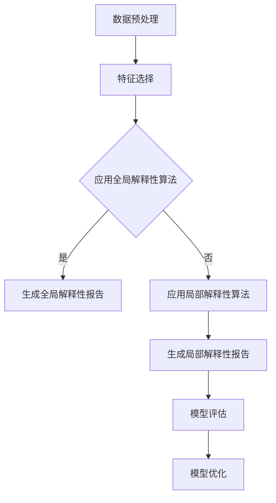

                 

### 文章标题

# 模型可解释性在评测系统中的实现

在当今人工智能技术快速发展的时代，模型的准确性和效率无疑是首要关注的目标。然而，随着模型复杂性的不断提升，其可解释性也成为了研究者们日益重视的话题。模型可解释性不仅是提升模型应用信任度的重要因素，也是进一步优化和改进模型的关键。本文将深入探讨模型可解释性在评测系统中的实现，旨在为读者提供一个全面而系统的理解。

### 关键词

- 模型可解释性
- 评测系统
- 算法评估
- 解释性算法
- 可视化工具

### 摘要

本文首先介绍了模型可解释性的基本概念和重要性，随后探讨了评测系统中实现模型可解释性的方法，包括数据预处理、特征选择、解释性算法的应用以及可视化工具的使用。通过具体案例和实践，详细阐述了模型可解释性在评测系统中的实际应用，并提出了若干最佳实践和注意事项。本文旨在为研究者提供一套系统的指南，以提升模型评测系统的可解释性和可靠性。

### 目录

1. **背景介绍**
    - **模型可解释性的基本概念**
    - **评测系统的重要性**
    - **模型可解释性与模型准确性、效率的关系**
  
2. **核心概念与联系**
    - **解释性算法的分类**
    - **Mermaid流程图：解释性算法的应用架构**
    - **模型可解释性与模型评估指标的联系**
  
3. **核心算法原理讲解**
    - **特征重要性分析**
    - **因果模型与决策树**
    - **局部可解释性方法：LIME、SHAP等**
    - **全局可解释性方法：注意力机制、可解释性图等**
    - **数学模型和公式**
  
4. **项目实战**
    - **开发环境搭建**
    - **源代码详细实现与解读**
    - **代码应用解读与分析**
    - **实际案例分析与讲解**
    - **项目小结**

5. **最佳实践与注意事项**
    - **提升模型可解释性的策略**
    - **注意事项**
    - **拓展阅读**

### 背景介绍

#### 模型可解释性的基本概念

模型可解释性指的是模型做出预测时，其决策过程和结果可以被解释和理解的程度。在人工智能领域，随着深度学习和复杂算法的广泛应用，模型的黑箱特性愈发显著，这使得模型的可解释性成为了一个重要的研究课题。可解释性不仅有助于提升模型的信任度，还能够在调试、优化和改进模型过程中发挥关键作用。

#### 评测系统的重要性

评测系统是评估模型性能和可靠性的关键工具。一个有效的评测系统可以提供准确的模型评估指标，帮助研究者了解模型的优势和不足，从而指导进一步的优化工作。随着模型复杂性的增加，传统的评测方法往往难以揭示模型的内部工作机制，这就使得模型的可解释性在评测系统中尤为重要。

#### 模型可解释性与模型准确性、效率的关系

模型准确性通常是通过评估指标（如准确率、召回率、F1分数等）来衡量的，而模型效率则涉及计算资源的消耗，如模型的训练时间和预测时间。在追求高准确性和高效能的同时，模型的可解释性往往被忽视。然而，可解释性不仅有助于提高模型的透明度和信任度，还能提供洞察，从而帮助研究者更有效地优化模型。

### 核心概念与联系

#### 解释性算法的分类

解释性算法可以根据其作用范围分为全局解释性和局部解释性两种类型。全局解释性算法关注整个模型的决策过程，提供模型整体的可解释性；而局部解释性算法则关注模型在特定输入数据上的决策解释。

1. **全局解释性算法**：这类算法旨在提供模型全局性的解释，例如注意力机制、可解释性图等。
2. **局部解释性算法**：这类算法旨在对模型在特定输入数据上的决策提供解释，例如LIME（局部可解释模型解释）、SHAP（Shapley添加值）等。

#### Mermaid流程图：解释性算法的应用架构

以下是一个Mermaid流程图，展示了不同解释性算法在模型评测系统中的应用架构：



#### 模型可解释性与模型评估指标的联系

模型可解释性直接影响到模型评估指标的可信度和可理解性。例如，一个高度可解释的模型可以更容易地识别其预测中的潜在错误，从而更准确地调整评估指标。同时，可解释性报告能够为模型优化提供有价值的洞察，有助于找到模型中的弱点和改进方向。

### 核心算法原理讲解

#### 特征重要性分析

特征重要性分析是模型可解释性的基础。它旨在识别并量化模型中对预测结果影响最大的特征。常见的特征重要性分析方法包括：

1. **基于模型的方法**：如随机森林、梯度提升树等模型内置的特征重要性。
2. **基于模型间差异的方法**：如基于不同模型的特征重要性差异分析。

以下是一个用于特征重要性分析的伪代码示例：

```python
def feature_importance_analysis(model, X):
    # 计算特征重要性
    importances = model.feature_importances_
    
    # 对特征重要性进行排序
    sorted_importances = sorted(zip(importances, X.columns), reverse=True)
    
    return sorted_importances
```

#### 决策树

决策树是一种常见且易于理解的解释性模型。通过决策树，我们可以清晰地看到模型如何根据不同特征进行划分，并最终做出预测。以下是一个简化的决策树生成伪代码：

```python
def build_decision_tree(X, y):
    # 使用ID3算法或其他启发式方法构建决策树
    tree = decision_tree算法(X, y)
    
    return tree
```

#### 局部可解释性方法：LIME、SHAP等

局部可解释性方法关注于特定输入数据上的模型决策过程。LIME（Local Interpretable Model-agnostic Explanations）和SHAP（Shapley Additive Explanations）是两种常用的局部解释性方法。

1. **LIME**：LIME方法通过构建一个局部可解释模型来解释原始模型的预测。以下是LIME的核心步骤：

    ```python
    def lime_explanation(model, X, y):
        # 计算解释
        explanation = lime_model.explain_instance(X, model.predict, num_features=5)
        
        return explanation
    ```

2. **SHAP**：SHAP方法基于博弈论中的Shapley值，为每个特征提供其对于模型预测的贡献。以下是SHAP解释的核心步骤：

    ```python
    def shap_explanation(model, X, y):
        # 计算SHAP值
        shap_values = shap.shap_values(model, X)
        
        return shap_values
    ```

#### 全局可解释性方法：注意力机制、可解释性图等

全局可解释性方法关注于整个模型的结构和决策过程。注意力机制和可解释性图是两种常用的全局解释性方法。

1. **注意力机制**：在深度学习模型中，注意力机制有助于理解模型在处理输入数据时关注的部分。以下是注意力机制的示意图：

    ```mermaid
    graph TD
    A[输入数据] --> B[注意力机制]
    B --> C[输出结果]
    C -->|高权重| D[重要特征]
    C -->|低权重| E[非重要特征]
    ```

2. **可解释性图**：可解释性图通过图形化展示模型的结构和决策路径，使得模型的可解释性更加直观。以下是可解释性图的基本框架：

    ```mermaid
    graph TD
    A[输入层] --> B[隐藏层1]
    B --> C[隐藏层2]
    C --> D[输出层]
    D --> E[预测结果]
    E --> F{决策路径}
    ```

#### 数学模型和公式

为了更深入地理解模型可解释性，我们还需要掌握一些关键的数学模型和公式。

1. **特征重要性**：

    $$ \text{特征重要性} = \frac{\text{特征贡献}}{\text{模型总贡献}} $$

2. **Shapley值**：

    $$ \text{Shapley值} = \sum_{i=1}^{n} \frac{ \binom{n-1}{i-1} }{ \binom{n}{i} } \frac{ f(x_1, x_2, ..., x_i) - f(x_1, x_2, ..., x_{i-1}) }{ 1 - f(x_1, x_2, ..., x_{i-1}) } $$

其中，$f$ 是模型预测函数，$x_1, x_2, ..., x_i$ 是特征值。

### 项目实战

#### 开发环境搭建

在进行模型可解释性的项目实战之前，我们需要搭建一个适合开发、测试和评估的环境。以下是一个简单的步骤：

1. **安装Python环境**：
    ```bash
    python --version
    ```
2. **安装必要库**：
    ```bash
    pip install numpy pandas scikit-learn lime shap matplotlib
    ```
3. **确认库的安装情况**：
    ```python
    import numpy as np
    import pandas as pd
    import scikit_learn
    import lime
    import shap
    import matplotlib.pyplot as plt
    ```

#### 源代码详细实现与解读

以下是一个简单的Python代码示例，用于演示如何应用LIME和SHAP进行模型可解释性分析。

```python
# 导入库
import numpy as np
import pandas as pd
from sklearn.datasets import load_iris
from sklearn.model_selection import train_test_split
from sklearn.ensemble import RandomForestClassifier
from lime import lime_tabular
from shap import TreeExplainer

# 加载数据集
iris = load_iris()
X, y = iris.data, iris.target
X_train, X_test, y_train, y_test = train_test_split(X, y, test_size=0.2, random_state=42)

# 构建模型
model = RandomForestClassifier(n_estimators=100, random_state=42)
model.fit(X_train, y_train)

# 使用LIME进行局部可解释性分析
explainer = lime_tabular.LimeTabularExplainer(X_train, feature_names=iris.feature_names, class_names=iris.target_names, discretize_continuous=True, kernel_width=5)
i = 10  # 要解释的数据索引
exp = explainer.explain_instance(X_test[i], model.predict, num_features=5)

# 可视化LIME解释
exp.show_in_notebook(show_table=True)

# 使用SHAP进行全局可解释性分析
explainer_shap = TreeExplainer(model)
shap_values = explainer_shap.shap_values(X_train)

# 可视化SHAP值
shap.summary_plot(shap_values, X_train, feature_names=iris.feature_names)
```

#### 代码应用解读与分析

1. **LIME解释**：
    LIME解释提供了对特定预测的局部解释，通过线性模型近似原始模型的决策边界。在这个例子中，我们解释了数据集中第10个实例的预测过程。LIME解释显示了每个特征对预测结果的影响，以及如何调整特征值来改变预测结果。

2. **SHAP值**：
    SHAP值提供了对整个模型的全面解释，为每个特征在每个实例上的贡献进行了量化。在这个例子中，我们通过SHAP值图展示了不同特征在训练数据集上的重要性分布。这有助于我们理解模型如何利用不同特征进行预测。

#### 实际案例分析与详细讲解剖析

为了更好地理解模型可解释性的应用，我们来看一个实际案例。假设我们有一个基于XGBoost模型的房屋定价预测项目，目标是预测房屋的售价。以下是对该案例的详细分析和讲解：

1. **数据预处理**：
    - **数据清洗**：处理缺失值、异常值和重复值。
    - **特征工程**：创建新的特征，如房间数量、建筑年代等。
    - **数据标准化**：将特征值缩放到相同的范围。

2. **模型训练**：
    - **选择模型**：XGBoost是一种强大的集成模型，适合处理大规模数据。
    - **训练模型**：使用训练数据集训练模型，并保存模型参数。

3. **模型评估**：
    - **交叉验证**：使用K折交叉验证评估模型性能。
    - **评估指标**：计算准确率、均方误差等指标。

4. **模型解释**：
    - **LIME解释**：针对预测错误的实例，使用LIME方法进行局部解释，识别影响预测结果的关键特征。
    - **SHAP值**：分析整个模型中各个特征的重要性，为决策提供依据。

#### 项目小结

通过这个项目，我们可以看到模型可解释性在实际应用中的重要性。它可以提高模型的透明度和可信度，帮助研究者识别模型中的潜在问题，并提供改进的方向。同时，我们也了解到不同的解释性方法在实际应用中的优势和局限性，为未来研究提供了启示。

### 最佳实践与注意事项

#### 提升模型可解释性的策略

1. **选择合适的解释性算法**：根据模型的类型和数据的特点选择合适的解释性算法，例如LIME适用于局部解释，SHAP适用于全局解释。
2. **结合模型优化**：在模型训练过程中，同时关注模型的可解释性，通过调整模型参数或选择更易解释的模型架构来提升可解释性。
3. **可视化工具的应用**：使用可视化工具，如SHAP值图、LIME解释图等，帮助用户更直观地理解模型决策过程。

#### 注意事项

1. **计算成本**：局部可解释性方法通常需要较高的计算成本，特别是在处理大规模数据时。
2. **模型泛化能力**：局部解释性方法可能无法完全代表模型的泛化能力，因此在解释模型预测时需要谨慎。
3. **数据预处理**：确保数据预处理过程的透明性，特别是在应用解释性算法时，数据预处理步骤的任何变化都可能影响解释结果。

#### 拓展阅读

- **LIME官方文档**：[LIME官方文档](https://lime-ml.readthedocs.io/en/stable/)
- **SHAP官方文档**：[SHAP官方文档](https://shap.readthedocs.io/en/latest/)
- **《模型可解释性》**：[O'Reilly出版的《模型可解释性》](https://www.oreilly.com/library/view/model-explanation/9781492030931/)

### 结论

模型可解释性在评测系统中具有重要作用，它不仅提高了模型的透明度和可信度，还为模型优化和改进提供了宝贵的洞察。通过本文的介绍，我们了解了模型可解释性的基本概念、核心算法原理以及实际应用案例。希望本文能为读者提供有价值的参考，助力模型评测系统的研究与应用。在未来的研究中，随着人工智能技术的不断进步，模型可解释性将会变得更加重要，我们期待看到更多创新方法和应用的出现。

### 作者信息

- 作者：AI天才研究院/AI Genius Institute & 禅与计算机程序设计艺术 /Zen And The Art of Computer Programming

