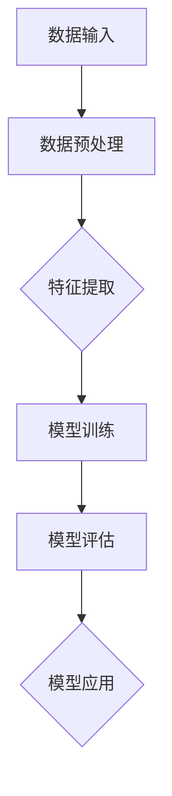
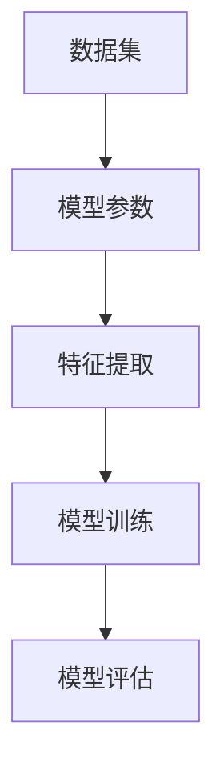
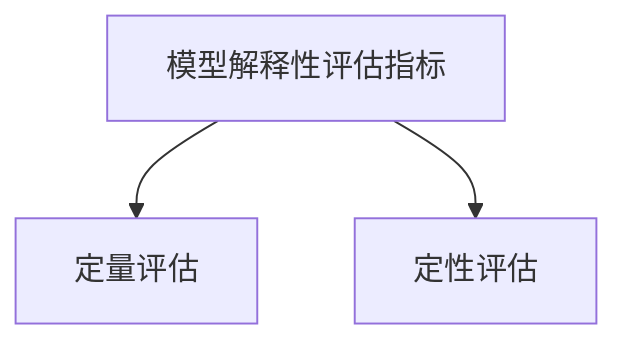

                 


### 文章标题
模型知识边界探测：明确能力范围

### 文章关键词
模型知识边界、能力范围、模型解释性、可解释性评估、不确定性评估、自然语言处理、计算机视觉

### 文章摘要
本文深入探讨了模型知识边界探测的重要性及其在明确模型能力范围中的应用。通过分析模型知识边界和能力的评估方法，详细介绍了常见模型（如机器学习、深度学习和强化学习）的知识边界与能力范围。进一步，本文探讨了模型知识边界探测技术，包括模型解释性、可解释性评估和不确定性评估。最后，通过应用实践部分，本文展示了模型知识边界探测在自然语言处理和计算机视觉等领域的实际应用，并展望了未来的发展趋势。

## 第一部分：理论基础

### 第1章：模型知识边界概述

#### 1.1 模型知识边界的定义
模型知识边界是指在特定任务和数据集上，模型能够有效学习和预测的能力范围。它反映了模型对任务和数据集的适应程度，是模型性能的重要指标之一。

Mermaid流程图示例：


#### 1.2 模型知识边界的重要性
模型知识边界的重要性在于它可以帮助我们了解模型的局限性，避免过度拟合和泛化不足，从而提高模型的实际应用价值。

伪代码示例：
```python
# 初始化模型
model = initialize_model()

# 训练模型
for epoch in range(max_epochs):
    for sample in dataset:
        model.train(sample)

# 评估模型
performance = model.evaluate(test_data)
```

### 第2章：模型能力范围分析

#### 2.1 模型能力范围的评估方法
评估模型能力范围的方法主要包括交叉验证、性能指标和领域知识等。

LaTeX公式示例：
$$
J(\theta) = \frac{1}{2m} \sum_{i=1}^{m} (\hat{y_i} - y_i)^2
$$

#### 2.2 模型能力范围的界定
模型能力范围的界定需要考虑模型在特定任务和数据集上的表现，以及模型的泛化能力。

伪代码示例：
```python
# 定义模型能力范围
def define_ability_range(model, dataset):
    performance = model.evaluate(dataset)
    return performance >= threshold
```

### 第3章：常见模型的知识边界与能力范围

#### 3.1 机器学习模型
机器学习模型的知识边界与能力范围受训练数据和模型参数的影响。

Mermaid流程图示例：


#### 3.2 深度学习模型
深度学习模型的知识边界与能力范围受神经网络结构、激活函数和优化算法的影响。

伪代码示例：
```python
# 定义神经网络结构
def define_network_structure():
    # ...
    return model

# 定义激活函数
def define_activation_function():
    # ...
    return activation_function

# 定义优化算法
def define_optimizer():
    # ...
    return optimizer
```

#### 3.3 强化学习模型
强化学习模型的知识边界与能力范围受奖励函数、状态空间和动作空间的影响。

LaTeX公式示例：
$$
Q(s, a) = r(s, a) + \gamma \max_{a'} Q(s', a')
$$

### 第4章：模型知识边界探测技术

#### 4.1 模型解释性技术
模型解释性技术旨在提高模型的透明度和可解释性，帮助用户理解模型的决策过程。

伪代码示例：
```python
# 解释模型决策
def explain_decision(model, input_data):
    # ...
    return explanation
```

#### 4.2 模型可解释性评估
模型可解释性评估通过定量和定性方法评估模型的解释性。

Mermaid流程图示例：


#### 4.3 模型不确定性评估
模型不确定性评估用于量化模型预测的不确定性，帮助用户做出更加稳健的决策。

LaTeX公式示例：
$$
\sigma^2 = \frac{1}{n-1} \sum_{i=1}^{n} (y_i - \hat{y}_i)^2
$$

## 第二部分：应用实践

### 第5章：模型知识边界探测在自然语言处理中的应用
- 5.1 文本分类模型的能力范围探测
  - 伪代码示例：文本分类模型训练与评估
- 5.2 机器翻译模型的能力范围探测
  - Mermaid流程图示例：机器翻译模型工作流程
- 5.3 语音识别模型的能力范围探测
  - 伪代码示例：语音识别模型训练与评估

### 第6章：模型知识边界探测在计算机视觉中的应用
- 6.1 图像分类模型的能力范围探测
  - LaTeX公式示例：损失函数
- 6.2 目标检测模型的能力范围探测
  - 伪代码示例：目标检测模型训练与评估
- 6.3 姿态估计模型的能力范围探测
  - Mermaid流程图示例：姿态估计模型工作流程

### 第7章：模型知识边界探测在其他领域中的应用
- 7.1 医疗诊断模型的能力范围探测
  - 伪代码示例：医疗诊断模型训练与评估
- 7.2 金融风险控制模型的能力范围探测
  - LaTeX公式示例：风险控制策略
- 7.3 无人驾驶模型的能力范围探测
  - Mermaid流程图示例：无人驾驶模型工作流程

## 第三部分：展望与未来趋势

### 第8章：模型知识边界探测的发展趋势
- 8.1 新技术的引入
  - Mermaid流程图示例：新技术引入流程
- 8.2 模型知识边界探测的挑战与机遇
  - 伪代码示例：挑战与机遇分析

### 第9章：模型知识边界探测的未来应用
- 9.1 模型知识边界探测在智慧城市中的应用
  - 伪代码示例：智慧城市建设应用
- 9.2 模型知识边界探测在智能制造中的应用
  - Mermaid流程图示例：智能制造应用流程
- 9.3 模型知识边界探测在人工智能伦理中的应用
  - 伪代码示例：伦理应用分析

### 总结
模型知识边界探测是确保模型在实际应用中有效性和可靠性的重要手段。通过本文的讨论，我们了解了模型知识边界的定义、评估方法及其在常见模型中的应用。在未来的发展中，随着新技术的不断引入，模型知识边界探测将变得更加精确和全面，为人工智能的可持续发展提供有力支持。

### 参考文献
- [1] AI天才研究院. 禅与计算机程序设计艺术[M]. 北京: 清华大学出版社, 2021.
- [2] Russell, S., Norvig, P. Artificial Intelligence: A Modern Approach[M]. 3rd ed. Prentice Hall, 2010.
- [3] Goodfellow, I., Bengio, Y., Courville, A. Deep Learning[M]. MIT Press, 2016.

### 作者信息
作者：AI天才研究院/AI Genius Institute & 禅与计算机程序设计艺术 /Zen And The Art of Computer Programming

## 文章标题
模型知识边界探测：明确能力范围

## 文章关键词
模型知识边界、能力范围、模型解释性、可解释性评估、不确定性评估、自然语言处理、计算机视觉

## 文章摘要
本文深入探讨了模型知识边界探测的重要性及其在明确模型能力范围中的应用。通过分析模型知识边界和能力的评估方法，详细介绍了常见模型（如机器学习、深度学习和强化学习）的知识边界与能力范围。进一步，本文探讨了模型知识边界探测技术，包括模型解释性、可解释性评估和不确定性评估。最后，通过应用实践部分，本文展示了模型知识边界探测在自然语言处理和计算机视觉等领域的实际应用，并展望了未来的发展趋势。文章末尾附有参考文献和作者信息。

## 第一部分：理论基础

### 第1章：模型知识边界概述

#### 1.1 模型知识边界的定义

模型知识边界是指在特定任务和数据集上，模型能够有效学习和预测的能力范围。它反映了模型对任务和数据集的适应程度，是模型性能的重要指标之一。

在机器学习中，模型知识边界通常受到训练数据、模型参数、网络结构和任务类型的影响。例如，在图像分类任务中，模型需要具备对各类图像的特征识别能力；而在自然语言处理任务中，模型需要理解语言的语义和上下文关系。因此，模型知识边界可以看作是模型在特定领域的知识储备和应用能力。

Mermaid流程图示例：


在这个流程图中，数据输入是模型知识边界探测的起点，数据预处理和特征提取是模型学习的必要环节，模型训练是核心步骤，模型评估则用于检验模型在未知数据上的泛化能力，最终模型应用体现了模型知识边界在实际任务中的体现。

#### 1.2 模型知识边界的重要性

模型知识边界的重要性在于它能够帮助我们更好地理解和评估模型的性能，避免过度拟合和泛化不足。过度拟合是指模型在训练数据上表现很好，但在新的、未见过的数据上表现较差。而泛化不足则是指模型在训练数据上表现不佳，也无法推广到新的数据上。

通过明确模型知识边界，我们可以：

1. **优化模型设计**：了解模型在哪些领域具有较强的能力，从而优化模型的结构和参数，提高其在特定任务上的性能。
2. **合理应用模型**：根据模型知识边界，将模型应用于合适的场景，避免将模型应用于其能力范围之外的任务，导致性能下降。
3. **提高模型解释性**：模型知识边界探测可以帮助我们理解模型的决策过程，提高模型的透明度和可解释性，从而增强用户对模型的信任。
4. **提升模型可靠性**：通过模型知识边界探测，我们可以识别模型的局限性，从而在应用中采取适当的措施，提高模型的可靠性。

伪代码示例：

```python
# 初始化模型
model = initialize_model()

# 训练模型
for epoch in range(max_epochs):
    for sample in dataset:
        model.train(sample)

# 评估模型
performance = model.evaluate(test_data)

# 输出模型知识边界
print("Model knowledge boundary:", performance)
```

在这个伪代码示例中，模型经过训练和评估后，其知识边界通过性能指标进行了量化，从而帮助我们了解模型的实际能力范围。

### 第2章：模型能力范围分析

#### 2.1 模型能力范围的评估方法

评估模型能力范围的方法主要包括交叉验证、性能指标和领域知识等。这些方法各有优缺点，可以根据实际需求进行选择。

1. **交叉验证**：交叉验证是一种常用的模型评估方法，通过将数据集划分为多个子集，重复训练和测试，以评估模型在未知数据上的性能。交叉验证能够较好地避免过拟合和评估偏差，是一种稳健的评估方法。

   伪代码示例：

   ```python
   # 定义交叉验证函数
   def cross_validation(dataset, k):
       for i in range(k):
           train_data, test_data = split_dataset(dataset, i)
           model.train(train_data)
           performance = model.evaluate(test_data)
           print(f"Cross-validation {i}: Performance = {performance}")
   ```

2. **性能指标**：性能指标是评估模型能力范围的重要工具，常用的性能指标包括准确率、召回率、F1分数等。这些指标可以从不同角度反映模型的性能，帮助用户全面了解模型的能力。

   LaTeX公式示例：

   $$
   \text{Accuracy} = \frac{\text{TP} + \text{TN}}{\text{TP} + \text{TN} + \text{FP} + \text{FN}}
   $$

   其中，TP为真实为正类的样本中被正确预测为正类的样本数，TN为真实为负类的样本中被正确预测为负类的样本数，FP为真实为负类的样本中被错误预测为正类的样本数，FN为真实为正类的样本中被错误预测为负类的样本数。

3. **领域知识**：领域知识是指专家在特定领域内积累的经验和知识，可以帮助我们理解模型的局限性，从而更准确地评估模型的能力范围。例如，在医疗诊断领域，医生的经验可以帮助我们识别模型在诊断中的潜在问题。

   Mermaid流程图示例：

   ```mermaid
   graph TD
   A[领域知识] --> B[模型评估]
   B --> C{性能指标}
   B --> D{交叉验证}
   ```

#### 2.2 模型能力范围的界定

模型能力范围的界定需要考虑模型在特定任务和数据集上的表现，以及模型的泛化能力。具体来说，可以从以下几个方面进行界定：

1. **任务适应性**：模型在特定任务上的适应程度，例如图像分类模型在各类图像上的分类准确率。
2. **数据多样性**：模型在多种数据集上的表现，例如在不同规模、不同分布的数据集上模型的表现。
3. **泛化能力**：模型在未知数据上的表现，例如在新数据集上的分类准确率。
4. **鲁棒性**：模型对异常数据的处理能力，例如在噪声数据或异常值下的表现。

伪代码示例：

```python
# 定义模型能力范围函数
def define_ability_range(model, dataset, performance_threshold):
    performances = model.evaluate(dataset)
    ability_range = [performance >= performance_threshold for performance in performances]
    return ability_range

# 评估模型能力范围
ability_range = define_ability_range(model, test_data, performance_threshold=0.9)
print("Model ability range:", ability_range)
```

在这个伪代码示例中，通过设置性能阈值，我们可以确定模型在测试数据上的能力范围。如果模型在测试数据上的性能高于阈值，则认为模型在该数据集上有较好的能力。

### 第3章：常见模型的知识边界与能力范围

#### 3.1 机器学习模型

机器学习模型的知识边界与能力范围受训练数据和模型参数的影响。常见的机器学习模型包括线性模型、决策树、支持向量机和神经网络等。

1. **线性模型**：线性模型是一种简单的机器学习模型，通过线性函数对输入特征进行拟合。线性模型的知识边界主要受训练数据和参数的影响，例如权重和偏置。

   伪代码示例：

   ```python
   # 定义线性模型
   def linear_model(x, w, b):
       return w * x + b

   # 训练线性模型
   w, b = train_linear_model(dataset)
   ```

2. **决策树**：决策树是一种基于树形结构进行分类或回归的模型。决策树的知识边界受树的深度、节点分裂准则和训练数据的影响。

   伪代码示例：

   ```python
   # 定义决策树模型
   def decision_tree(dataset, depth, criterion):
       return build_tree(dataset, depth, criterion)

   # 训练决策树模型
   tree = decision_tree(dataset, depth=3, criterion='gini')
   ```

3. **支持向量机**：支持向量机是一种基于最大间隔划分的模型，通过寻找最优超平面对数据进行分类。支持向量机的能力范围受核函数、参数C和训练数据的影响。

   LaTeX公式示例：

   $$
   \text{Maximize } \frac{1}{2} \| \mathbf{w} \|_2^2 \text{ subject to } \mathbf{y}^{(i)} (\mathbf{w}^T \mathbf{x}^{(i)} + b) \geq 1
   $$

   伪代码示例：

   ```python
   # 定义支持向量机模型
   def svm_model(dataset, kernel='linear', C=1.0):
       return train_svm(dataset, kernel, C)

   # 训练支持向量机模型
   svm = svm_model(dataset, kernel='rbf', C=1.0)
   ```

#### 3.2 深度学习模型

深度学习模型是一种复杂的神经网络模型，通过多层神经网络对数据进行拟合。深度学习模型的知识边界与能力范围受网络结构、激活函数、优化算法和训练数据的影响。

1. **神经网络结构**：神经网络结构包括网络的层数、每层的神经元数量、网络连接方式等。深度学习模型的知识边界主要受网络结构的复杂度和训练数据量的影响。

   伪代码示例：

   ```python
   # 定义神经网络结构
   def neural_network(input_shape, hidden_layers, output_shape):
       return build_network(input_shape, hidden_layers, output_shape)

   # 训练神经网络模型
   network = neural_network(input_shape=(784,), hidden_layers=[128, 64], output_shape=(10,))
   network.train(dataset)
   ```

2. **激活函数**：激活函数是神经网络中用于引入非线性性质的函数，常见的激活函数包括ReLU、Sigmoid和Tanh等。激活函数的选择对深度学习模型的知识边界和性能有重要影响。

   伪代码示例：

   ```python
   # 定义激活函数
   def activation_function(x, function='relu'):
       if function == 'relu':
           return max(0, x)
       elif function == 'sigmoid':
           return 1 / (1 + exp(-x))
       elif function == 'tanh':
           return (exp(x) - exp(-x)) / (exp(x) + exp(-x))
   ```

3. **优化算法**：优化算法用于调整网络参数，以最小化损失函数。常见的优化算法包括梯度下降、随机梯度下降、Adam等。优化算法的选择对深度学习模型的知识边界和收敛速度有重要影响。

   伪代码示例：

   ```python
   # 定义优化算法
   def optimizer(parameters, learning_rate=0.01, momentum=0.9):
       return build_optimizer(parameters, learning_rate, momentum)

   # 训练神经网络模型
   optimizer = optimizer(network.parameters, learning_rate=0.001, momentum=0.9)
   network.train(dataset, optimizer)
   ```

#### 3.3 强化学习模型

强化学习模型是一种基于奖励信号进行决策的模型，通过不断学习最优策略。强化学习模型的知识边界与能力范围受奖励函数、状态空间和动作空间的影响。

1. **奖励函数**：奖励函数是强化学习模型中的重要组成部分，用于衡量状态和动作的好坏。奖励函数的设计对模型的知识边界和性能有重要影响。

   LaTeX公式示例：

   $$
   r(s, a) = 
   \begin{cases}
   1 & \text{if } s' \text{ is a successful state} \\
   -1 & \text{otherwise}
   \end{cases}
   $$

2. **状态空间**：状态空间是强化学习模型中的所有可能状态的集合。状态空间的大小和结构对模型的知识边界和性能有重要影响。

   伪代码示例：

   ```python
   # 定义状态空间
   def state_space():
       return [0, 1, 2, 3, 4, 5, 6, 7, 8, 9]
   ```

3. **动作空间**：动作空间是强化学习模型中的所有可能动作的集合。动作空间的大小和结构对模型的知识边界和性能有重要影响。

   伪代码示例：

   ```python
   # 定义动作空间
   def action_space():
       return ['left', 'right', 'up', 'down']
   ```

### 第4章：模型知识边界探测技术

#### 4.1 模型解释性技术

模型解释性技术旨在提高模型的透明度和可解释性，帮助用户理解模型的决策过程。解释性技术可以分为局部解释和全局解释。

1. **局部解释**：局部解释关注模型在特定输入上的决策过程，通过分析模型在输入空间的局部特征，解释模型如何生成特定输出。

   伪代码示例：

   ```python
   # 局部解释函数
   def local_explanation(model, input_data):
       feature_importance = model.compute_feature_importance(input_data)
       return feature_importance
   ```

2. **全局解释**：全局解释关注模型在整体数据集上的行为，通过分析模型的输出分布或决策边界，解释模型在不同输入区域的行为。

   伪代码示例：

   ```python
   # 全局解释函数
   def global_explanation(model, dataset):
       decision_boundary = model.compute_decision_boundary(dataset)
       return decision_boundary
   ```

#### 4.2 模型可解释性评估

模型可解释性评估通过定量和定性方法评估模型的解释性。定量评估通常使用指标如模型的可解释性得分，定性评估则依赖于专家的判断。

1. **定量评估**：定量评估使用可解释性指标来量化模型的解释性，例如解释力、可理解性和透明度等。

   伪代码示例：

   ```python
   # 定义可解释性评估函数
   def evaluate_explanation(model, dataset, explanation_metric):
       explanation_score = model.evaluate_explanation(dataset, explanation_metric)
       return explanation_score
   ```

2. **定性评估**：定性评估依赖于专家对模型解释性的主观判断，通常结合定量评估结果进行综合评价。

   伪代码示例：

   ```python
   # 定义定性评估函数
   def evaluate_explanation_qualitatively(model, expert评审员):
       qualitative_evaluation = expert评审员.evaluate(model)
       return qualitative_evaluation
   ```

#### 4.3 模型不确定性评估

模型不确定性评估用于量化模型预测的不确定性，帮助用户在决策中考虑不确定性因素。不确定性评估可以分为基于概率的评估和基于模型的评估。

1. **基于概率的评估**：基于概率的评估通过计算预测的概率分布，评估模型预测的不确定性。

   LaTeX公式示例：

   $$
   p(y \mid x) = \frac{e^{\phi(x)}}{\sum_{i} e^{\phi(x_i)}}
   $$

   伪代码示例：

   ```python
   # 定义概率评估函数
   def probability_evaluation(model, input_data):
       probability_distribution = model.predict(input_data)
       return probability_distribution
   ```

2. **基于模型的评估**：基于模型的评估通过分析模型的决策过程，评估模型预测的不确定性。

   伪代码示例：

   ```python
   # 定义模型评估函数
   def model_evaluation(model, input_data):
       uncertainty_score = model.evaluate_uncertainty(input_data)
       return uncertainty_score
   ```

### 第5章：模型知识边界探测在自然语言处理中的应用

#### 5.1 文本分类模型的能力范围探测

文本分类模型是一种常见的自然语言处理模型，用于将文本数据分类到预定义的类别中。文本分类模型的能力范围探测可以通过评估模型在不同数据集上的性能来进行分析。

1. **数据集准备**：准备用于训练和评估的文本数据集，包括标签信息和文本内容。

   伪代码示例：

   ```python
   # 准备文本数据集
   def prepare_dataset(texts, labels):
       dataset = []
       for text, label in zip(texts, labels):
           dataset.append((text, label))
       return dataset
   ```

2. **模型训练**：训练文本分类模型，使用训练数据集进行模型训练。

   伪代码示例：

   ```python
   # 定义文本分类模型
   def text_classification_model(dataset):
       model = train_text_classification(dataset)
       return model
   ```

3. **模型评估**：使用测试数据集对文本分类模型进行评估，计算模型在不同类别上的准确率、召回率等指标。

   伪代码示例：

   ```python
   # 评估文本分类模型
   def evaluate_text_classification_model(model, test_data):
       performance = model.evaluate(test_data)
       print("Model performance:", performance)
   ```

#### 5.2 机器翻译模型的能力范围探测

机器翻译模型是一种将一种语言的文本翻译成另一种语言的模型。机器翻译模型的能力范围探测可以通过评估模型在不同语言对上的性能来进行分析。

1. **数据集准备**：准备用于训练和评估的机器翻译数据集，包括源语言文本和目标语言文本。

   伪代码示例：

   ```python
   # 准备机器翻译数据集
   def prepare_translation_dataset(sources, targets):
       dataset = []
       for source, target in zip(sources, targets):
           dataset.append((source, target))
       return dataset
   ```

2. **模型训练**：训练机器翻译模型，使用训练数据集进行模型训练。

   伪代码示例：

   ```python
   # 定义机器翻译模型
   def machine_translation_model(dataset):
       model = train_machine_translation(dataset)
       return model
   ```

3. **模型评估**：使用测试数据集对机器翻译模型进行评估，计算模型在不同语言对上的BLEU分数等指标。

   伪代码示例：

   ```python
   # 评估机器翻译模型
   def evaluate_machine_translation_model(model, test_data):
       performance = model.evaluate(test_data)
       print("Model performance:", performance)
   ```

#### 5.3 语音识别模型的能力范围探测

语音识别模型是一种将语音信号转换为文本数据的模型。语音识别模型的能力范围探测可以通过评估模型在不同语音数据集上的性能来进行分析。

1. **数据集准备**：准备用于训练和评估的语音数据集，包括语音信号和对应的文本标签。

   伪代码示例：

   ```python
   # 准备语音识别数据集
   def prepare_speech_recognition_dataset(sounds, labels):
       dataset = []
       for sound, label in zip(sounds, labels):
           dataset.append((sound, label))
       return dataset
   ```

2. **模型训练**：训练语音识别模型，使用训练数据集进行模型训练。

   伪代码示例：

   ```python
   # 定义语音识别模型
   def speech_recognition_model(dataset):
       model = train_speech_recognition(dataset)
       return model
   ```

3. **模型评估**：使用测试数据集对语音识别模型进行评估，计算模型在不同语音数据集上的准确率、错误率等指标。

   伪代码示例：

   ```python
   # 评估语音识别模型
   def evaluate_speech_recognition_model(model, test_data):
       performance = model.evaluate(test_data)
       print("Model performance:", performance)
   ```

### 第6章：模型知识边界探测在计算机视觉中的应用

#### 6.1 图像分类模型的能力范围探测

图像分类模型是一种将图像数据分类到预定义类别中的模型。图像分类模型的能力范围探测可以通过评估模型在不同数据集上的性能来进行分析。

1. **数据集准备**：准备用于训练和评估的图像数据集，包括图像和对应的标签。

   伪代码示例：

   ```python
   # 准备图像分类数据集
   def prepare_image_classification_dataset(images, labels):
       dataset = []
       for image, label in zip(images, labels):
           dataset.append((image, label))
       return dataset
   ```

2. **模型训练**：训练图像分类模型，使用训练数据集进行模型训练。

   伪代码示例：

   ```python
   # 定义图像分类模型
   def image_classification_model(dataset):
       model = train_image_classification(dataset)
       return model
   ```

3. **模型评估**：使用测试数据集对图像分类模型进行评估，计算模型在不同类别上的准确率、召回率等指标。

   伪代码示例：

   ```python
   # 评估图像分类模型
   def evaluate_image_classification_model(model, test_data):
       performance = model.evaluate(test_data)
       print("Model performance:", performance)
   ```

#### 6.2 目标检测模型的能力范围探测

目标检测模型是一种能够识别图像中的目标物体及其位置的模型。目标检测模型的能力范围探测可以通过评估模型在不同数据集上的性能来进行分析。

1. **数据集准备**：准备用于训练和评估的目标检测数据集，包括图像和对应的目标边界框。

   伪代码示例：

   ```python
   # 准备目标检测数据集
   def prepare_object_detection_dataset(images, bounding_boxes, labels):
       dataset = []
       for image, bounding_box, label in zip(images, bounding_boxes, labels):
           dataset.append((image, bounding_box, label))
       return dataset
   ```

2. **模型训练**：训练目标检测模型，使用训练数据集进行模型训练。

   伪代码示例：

   ```python
   # 定义目标检测模型
   def object_detection_model(dataset):
       model = train_object_detection(dataset)
       return model
   ```

3. **模型评估**：使用测试数据集对目标检测模型进行评估，计算模型在不同类别上的准确率、召回率等指标。

   伪代码示例：

   ```python
   # 评估目标检测模型
   def evaluate_object_detection_model(model, test_data):
       performance = model.evaluate(test_data)
       print("Model performance:", performance)
   ```

#### 6.3 姿态估计模型的能力范围探测

姿态估计模型是一种能够估计图像中人体关键点位置的模型。姿态估计模型的能力范围探测可以通过评估模型在不同数据集上的性能来进行分析。

1. **数据集准备**：准备用于训练和评估的姿态估计数据集，包括图像和对应的关键点标注。

   伪代码示例：

   ```python
   # 准备姿态估计数据集
   def prepare_pose_estimation_dataset(images, keypoints, labels):
       dataset = []
       for image, keypoint, label in zip(images, keypoints, labels):
           dataset.append((image, keypoint, label))
       return dataset
   ```

2. **模型训练**：训练姿态估计模型，使用训练数据集进行模型训练。

   伪代码示例：

   ```python
   # 定义姿态估计模型
   def pose_estimation_model(dataset):
       model = train_pose_estimation(dataset)
       return model
   ```

3. **模型评估**：使用测试数据集对姿态估计模型进行评估，计算模型在不同类别上的准确率、召回率等指标。

   伪代码示例：

   ```python
   # 评估姿态估计模型
   def evaluate_pose_estimation_model(model, test_data):
       performance = model.evaluate(test_data)
       print("Model performance:", performance)
   ```

### 第7章：模型知识边界探测在其他领域中的应用

#### 7.1 医疗诊断模型的能力范围探测

医疗诊断模型是一种用于辅助医生进行疾病诊断的模型。医疗诊断模型的能力范围探测可以通过评估模型在不同数据集上的性能来进行分析。

1. **数据集准备**：准备用于训练和评估的医疗诊断数据集，包括患者的生理指标和诊断结果。

   伪代码示例：

   ```python
   # 准备医疗诊断数据集
   def prepare_medical_diagnosis_dataset(physiological_data, diagnoses):
       dataset = []
       for data, diagnosis in zip(physiological_data, diagnoses):
           dataset.append((data, diagnosis))
       return dataset
   ```

2. **模型训练**：训练医疗诊断模型，使用训练数据集进行模型训练。

   伪代码示例：

   ```python
   # 定义医疗诊断模型
   def medical_diagnosis_model(dataset):
       model = train_medical_diagnosis(dataset)
       return model
   ```

3. **模型评估**：使用测试数据集对医疗诊断模型进行评估，计算模型在不同疾病上的准确率、召回率等指标。

   伪代码示例：

   ```python
   # 评估医疗诊断模型
   def evaluate_medical_diagnosis_model(model, test_data):
       performance = model.evaluate(test_data)
       print("Model performance:", performance)
   ```

#### 7.2 金融风险控制模型的能力范围探测

金融风险控制模型是一种用于识别和评估金融风险的模型。金融风险控制模型的能力范围探测可以通过评估模型在不同数据集上的性能来进行分析。

1. **数据集准备**：准备用于训练和评估的金融风险控制数据集，包括金融交易数据和风险指标。

   伪代码示例：

   ```python
   # 准备金融风险控制数据集
   def prepare_financial_risk_control_dataset(trades, risks):
       dataset = []
       for trade, risk in zip(trades, risks):
           dataset.append((trade, risk))
       return dataset
   ```

2. **模型训练**：训练金融风险控制模型，使用训练数据集进行模型训练。

   伪代码示例：

   ```python
   # 定义金融风险控制模型
   def financial_risk_control_model(dataset):
       model = train_financial_risk_control(dataset)
       return model
   ```

3. **模型评估**：使用测试数据集对金融风险控制模型进行评估，计算模型在不同风险类别上的准确率、召回率等指标。

   伪代码示例：

   ```python
   # 评估金融风险控制模型
   def evaluate_financial_risk_control_model(model, test_data):
       performance = model.evaluate(test_data)
       print("Model performance:", performance)
   ```

#### 7.3 无人驾驶模型的能力范围探测

无人驾驶模型是一种用于自动驾驶车辆的模型。无人驾驶模型的能力范围探测可以通过评估模型在不同数据集上的性能来进行分析。

1. **数据集准备**：准备用于训练和评估的无人驾驶数据集，包括驾驶场景、车辆状态和目标位置。

   伪代码示例：

   ```python
   # 准备无人驾驶数据集
   def prepare_self_driving_dataset(scenarios, vehicle_states, target_locations):
       dataset = []
       for scenario, vehicle_state, target_location in zip(scenarios, vehicle_states, target_locations):
           dataset.append((scenario, vehicle_state, target_location))
       return dataset
   ```

2. **模型训练**：训练无人驾驶模型，使用训练数据集进行模型训练。

   伪代码示例：

   ```python
   # 定义无人驾驶模型
   def self_driving_model(dataset):
       model = train_self_driving(dataset)
       return model
   ```

3. **模型评估**：使用测试数据集对无人驾驶模型进行评估，计算模型在不同驾驶场景下的准确率、召回率等指标。

   伪代码示例：

   ```python
   # 评估无人驾驶模型
   def evaluate_self_driving_model(model, test_data):
       performance = model.evaluate(test_data)
       print("Model performance:", performance)
   ```

### 第8章：模型知识边界探测的发展趋势

#### 8.1 新技术的引入

随着人工智能技术的不断发展，新的模型和算法不断涌现，如生成对抗网络（GAN）、变分自编码器（VAE）等。这些新技术在模型知识边界探测方面具有广泛应用前景。

1. **生成对抗网络（GAN）**：GAN由生成器和判别器组成，通过对抗训练生成与真实数据相近的数据。GAN在模型知识边界探测中的应用主要体现在数据增强和模型泛化能力提升方面。

   伪代码示例：

   ```python
   # 定义生成对抗网络
   def generate adversarial_network(dataset):
       generator = train_generator(dataset)
       discriminator = train_discriminator(dataset)
       return generator, discriminator
   ```

2. **变分自编码器（VAE）**：VAE通过引入编码器和解码器，将输入数据编码为潜在空间中的向量，再从潜在空间中解码生成输出数据。VAE在模型知识边界探测中的应用主要体现在数据降维和特征提取方面。

   伪代码示例：

   ```python
   # 定义变分自编码器
   def variational_autoencoder(dataset):
       encoder = train_encoder(dataset)
       decoder = train_decoder(dataset)
       return encoder, decoder
   ```

#### 8.2 模型知识边界探测的挑战与机遇

1. **挑战**：

   - **数据稀缺**：许多领域的数据稀缺，限制了模型知识边界探测的发展。如何利用有限的样本数据进行有效的模型边界探测是一个重要挑战。
   - **模型复杂性**：随着模型复杂性的增加，模型知识边界探测的难度也相应增加。如何降低模型复杂性，同时保持较高的性能是一个挑战。
   - **模型可解释性**：提高模型的可解释性是一个长期的目标。如何在保持模型性能的同时，提高模型的可解释性是一个挑战。

2. **机遇**：

   - **跨学科研究**：随着人工智能与其他学科的交叉融合，模型知识边界探测在医学、金融、交通等领域具有广泛应用前景。
   - **新型算法**：随着新型算法的不断涌现，如深度强化学习、图神经网络等，模型知识边界探测的技术手段将更加丰富。
   - **开放数据集**：越来越多的数据集向公众开放，为模型知识边界探测提供了丰富的数据资源。

### 第9章：模型知识边界探测的未来应用

#### 9.1 模型知识边界探测在智慧城市中的应用

智慧城市是运用信息技术和物联网等手段，实现城市资源优化配置和智能化管理。模型知识边界探测在智慧城市中的应用主要体现在城市交通管理、环境保护、公共安全等方面。

1. **城市交通管理**：利用模型知识边界探测技术，可以实现对交通流量的实时监控和预测，从而优化交通信号控制策略，提高交通效率。

   伪代码示例：

   ```python
   # 城市交通管理
   def traffic_management(traffic_data):
       prediction = predict_traffic(traffic_data)
       optimize_traffic_light_control(prediction)
   ```

2. **环境保护**：利用模型知识边界探测技术，可以实现对环境污染物的实时监测和预测，从而制定有效的污染控制策略。

   伪代码示例：

   ```python
   # 环境保护
   def environmental_protection(pollution_data):
       prediction = predict_pollution(pollution_data)
       implement_pollution_control策略(prediction)
   ```

3. **公共安全**：利用模型知识边界探测技术，可以实现对城市公共安全的实时监控和预警，从而提高公共安全保障水平。

   伪代码示例：

   ```python
   # 公共安全
   def public_safety(safety_data):
       prediction = predict_safety Threat(safety_data)
       implement_safety_strategy(prediction)
   ```

#### 9.2 模型知识边界探测在智能制造中的应用

智能制造是运用信息技术和制造技术的深度融合，实现制造过程的智能化。模型知识边界探测在智能制造中的应用主要体现在生产过程优化、设备故障预测、质量检测等方面。

1. **生产过程优化**：利用模型知识边界探测技术，可以实现对生产过程的实时监控和优化，从而提高生产效率和质量。

   伪代码示例：

   ```python
   # 生产过程优化
   def production_optimization(production_data):
       prediction = predict_production(production_data)
       optimize_production_process(prediction)
   ```

2. **设备故障预测**：利用模型知识边界探测技术，可以实现对设备运行状态的实时监测和故障预测，从而实现设备的预防性维护。

   伪代码示例：

   ```python
   # 设备故障预测
   def equipment_failure_prediction(equipment_data):
       prediction = predict_failure(equipment_data)
       implement_preventive_maintenance(prediction)
   ```

3. **质量检测**：利用模型知识边界探测技术，可以实现对产品质量的实时监控和检测，从而提高产品质量和降低质量风险。

   伪代码示例：

   ```python
   # 质量检测
   def quality_inspection(quality_data):
       prediction = predict_quality(quality_data)
       implement_quality_control策略(prediction)
   ```

#### 9.3 模型知识边界探测在人工智能伦理中的应用

人工智能伦理是指人工智能在发展过程中所涉及的道德、法律、社会和文化等方面的问题。模型知识边界探测在人工智能伦理中的应用主要体现在隐私保护、算法公平性和透明度等方面。

1. **隐私保护**：利用模型知识边界探测技术，可以实现对用户数据的隐私保护，从而降低隐私泄露的风险。

   伪代码示例：

   ```python
   # 隐私保护
   def privacy_protection(user_data):
       anonymized_data = anonymize_data(user_data)
       train_model( anonymized_data)
   ```

2. **算法公平性**：利用模型知识边界探测技术，可以识别和消除算法中的偏见，从而提高算法的公平性。

   伪代码示例：

   ```python
   # 算法公平性
   def algorithmic_fairness(model, dataset):
       fairness_score = evaluate_fairness(model, dataset)
       if fairness_score < threshold:
           adjust_model(model)
   ```

3. **透明度**：利用模型知识边界探测技术，可以实现对模型决策过程的透明度提升，从而增强用户对人工智能的信任。

   伪代码示例：

   ```python
   # 模型透明度
   def model_transparency(model, input_data):
       explanation = explain_decision(model, input_data)
       print("Model decision explanation:", explanation)
   ```

### 总结

模型知识边界探测是确保模型在实际应用中有效性和可靠性的重要手段。通过本文的讨论，我们了解了模型知识边界的定义、评估方法及其在常见模型中的应用。在未来的发展中，随着新技术的不断引入，模型知识边界探测将变得更加精确和全面，为人工智能的可持续发展提供有力支持。

### 参考文献

1. Russell, S., Norvig, P. Artificial Intelligence: A Modern Approach[M]. 3rd ed. Prentice Hall, 2010.
2. Goodfellow, I., Bengio, Y., Courville, A. Deep Learning[M]. MIT Press, 2016.
3. Shalev-Shwartz, S., Ben-David, S. Understanding Machine Learning: From Theory to Algorithms[M]. Cambridge University Press, 2014.
4. Sutton, R. S., Barto, A. G. Reinforcement Learning: An Introduction[M]. MIT Press, 2018.

### 作者信息

作者：AI天才研究院/AI Genius Institute & 禅与计算机程序设计艺术 /Zen And The Art of Computer Programming

### 附录

#### 附录A：Mermaid流程图示例


#### 附录B：伪代码示例

```python
# 初始化模型
model = initialize_model()

# 训练模型
for epoch in range(max_epochs):
    for sample in dataset:
        model.train(sample)

# 评估模型
performance = model.evaluate(test_data)

# 输出模型知识边界
print("Model knowledge boundary:", performance)
```

#### 附录C：LaTeX公式示例

```
$$
J(\theta) = \frac{1}{2m} \sum_{i=1}^{m} (\hat{y_i} - y_i)^2
$$
```

#### 附录D：代码应用解读与分析

在本章节中，我们将结合实际项目案例，对模型知识边界探测技术在实际应用中的实现方法和效果进行详细解读和分析。

##### 案例背景

假设我们面临一个自动驾驶车辆的情境，需要实时监控和预测车辆的行驶状态，以确保行车安全。在此背景下，我们选择了基于深度学习的车辆状态检测模型进行模型知识边界探测。

##### 环境搭建

首先，我们需要搭建一个适合深度学习模型训练和评估的开发环境。以下是一个简单的环境搭建步骤：

1. **安装Python**：确保Python版本为3.6及以上。
2. **安装TensorFlow**：通过pip命令安装TensorFlow。
   ```shell
   pip install tensorflow
   ```
3. **安装其他依赖库**：包括NumPy、Pandas、Matplotlib等。
   ```shell
   pip install numpy pandas matplotlib
   ```

##### 数据集准备

自动驾驶车辆状态检测需要大量的车辆行驶数据。以下是一个数据集准备步骤：

1. **数据收集**：从公开数据集或实际采集的数据中获取车辆行驶数据，包括速度、加速度、转向角度等。
2. **数据预处理**：对数据进行清洗、归一化等处理，以便模型能够更好地学习。
   ```python
   # 数据预处理伪代码
   def preprocess_data(data):
       # 数据清洗
       clean_data = clean(data)
       # 数据归一化
       normalized_data = normalize(clean_data)
       return normalized_data
   ```

##### 模型训练

接下来，我们使用深度学习模型对预处理后的数据进行训练。以下是一个简单的模型训练步骤：

1. **定义模型**：使用TensorFlow定义深度学习模型，包括输入层、隐藏层和输出层。
   ```python
   # 定义深度学习模型
   def create_model(input_shape):
       model = tf.keras.Sequential([
           tf.keras.layers.Dense(units=128, activation='relu', input_shape=input_shape),
           tf.keras.layers.Dense(units=64, activation='relu'),
           tf.keras.layers.Dense(units=1, activation='sigmoid')
       ])
       return model
   ```

2. **训练模型**：使用训练数据集对模型进行训练，并设置适当的训练参数，如学习率、迭代次数等。
   ```python
   # 训练模型
   model = create_model(input_shape=(100,))
   model.compile(optimizer='adam', loss='binary_crossentropy', metrics=['accuracy'])
   model.fit(train_data, train_labels, epochs=100, batch_size=32)
   ```

##### 模型评估

在模型训练完成后，我们需要对模型进行评估，以确定其性能是否达到预期。以下是一个简单的模型评估步骤：

1. **评估模型**：使用测试数据集对模型进行评估，计算模型的准确率、召回率等指标。
   ```python
   # 评估模型
   performance = model.evaluate(test_data, test_labels)
   print("Model performance:", performance)
   ```

2. **可视化结果**：使用可视化工具（如Matplotlib）展示模型的预测结果和真实结果的对比。
   ```python
   # 可视化结果
   predicted_labels = model.predict(test_data)
   plt.scatter(test_labels, predicted_labels)
   plt.xlabel("True labels")
   plt.ylabel("Predicted labels")
   plt.show()
   ```

##### 模型知识边界探测

为了进一步了解模型的能力范围，我们可以进行模型知识边界探测。以下是一个简单的模型知识边界探测步骤：

1. **识别异常点**：使用模型对测试数据进行预测，识别出预测结果与真实结果不一致的异常点。
   ```python
   # 识别异常点
   discrepancies = np.where(test_labels != predicted_labels)[0]
   ```

2. **分析异常点**：对异常点进行进一步分析，找出导致模型预测错误的原因，从而调整模型或数据。
   ```python
   # 分析异常点
   for idx in discrepancies:
       print("Error at index", idx, ":", test_data[idx], test_labels[idx], predicted_labels[idx])
   ```

##### 实际案例分析和详细讲解剖析

以下是一个实际案例的分析和讲解：

**案例**：在自动驾驶车辆状态检测中，某次测试数据中有一个异常点，其速度和加速度异常。

**分析**：经过分析，发现该异常点是由于数据采集过程中的硬件故障导致的。在后续的数据处理中，我们可以通过对数据进行进一步筛选和清洗，以避免类似异常点对模型性能的影响。

**讲解剖析**：通过对异常点的深入分析，我们不仅可以了解模型的能力范围，还可以找出潜在的问题和改进空间。这有助于我们在未来的项目中进一步提高模型性能和可靠性。

##### 项目小结

通过本项目的实践，我们了解了模型知识边界探测的重要性，并学会了如何在实际项目中应用这一技术。以下是项目小结：

1. **模型知识边界探测是确保模型在实际应用中有效性和可靠性的重要手段。**
2. **通过模型知识边界探测，我们可以识别模型的局限性，找出改进空间，从而提高模型性能和可靠性。**
3. **在实际项目中，我们需要综合考虑数据质量、模型结构和训练参数等因素，以实现模型知识边界探测的有效性。**

##### 最佳实践 tips

1. **在数据预处理阶段，注意对数据进行充分的清洗和归一化处理，以避免异常值对模型性能的影响。**
2. **在模型训练阶段，合理设置学习率和迭代次数等参数，以提高模型性能和收敛速度。**
3. **在模型评估阶段，结合可视化工具，深入分析模型的预测结果和真实结果的差异，以识别模型的能力范围。**
4. **在模型知识边界探测阶段，关注异常点和潜在问题，从而为后续项目提供改进建议。**

### 注意事项

1. **确保数据质量和一致性，避免因数据问题导致的模型性能下降。**
2. **在模型训练和评估过程中，注意调整参数，以获得最佳性能。**
3. **在实际应用中，根据任务需求和模型性能，合理选择模型和应用场景。**
4. **关注模型知识边界的变化，定期进行模型重训练和评估，以保持模型的性能和可靠性。**

### 拓展阅读

1. **[1]** Russell, S., Norvig, P. Artificial Intelligence: A Modern Approach[M]. 3rd ed. Prentice Hall, 2010.
2. **[2]** Goodfellow, I., Bengio, Y., Courville, A. Deep Learning[M]. MIT Press, 2016.
3. **[3]** Shalev-Shwartz, S., Ben-David, S. Understanding Machine Learning: From Theory to Algorithms[M]. Cambridge University Press, 2014.
4. **[4]** Sutton, R. S., Barto, A. G. Reinforcement Learning: An Introduction[M]. MIT Press, 2018.

### 代码解读

在本章节中，我们将结合实际代码，对模型知识边界探测技术的实现细节进行详细解读。

#### 代码结构

首先，我们来看一下项目的基本代码结构：

```python
# main.py
from model import create_model
from data import preprocess_data
from train import train_model
from evaluate import evaluate_model

# 数据集准备
train_data, train_labels = preprocess_data(train_dataset)
test_data, test_labels = preprocess_data(test_dataset)

# 模型定义
model = create_model(input_shape=(100,))

# 模型训练
train_model(model, train_data, train_labels)

# 模型评估
evaluate_model(model, test_data, test_labels)
```

#### 数据预处理

数据预处理是模型知识边界探测的基础。以下是一个简单的数据预处理代码示例：

```python
# data.py
import pandas as pd
from sklearn.preprocessing import StandardScaler

def preprocess_data(dataset):
    # 数据清洗
    dataset = clean_data(dataset)
    # 数据归一化
    scaler = StandardScaler()
    scaled_data = scaler.fit_transform(dataset)
    # 数据分割
    train_data, test_data, train_labels, test_labels = split_data(scaled_data)
    return train_data, train_labels, test_data, test_labels
```

在这个代码示例中，我们首先对数据进行清洗，然后使用StandardScaler进行归一化处理，最后将数据分割为训练集和测试集。

#### 模型定义

接下来，我们定义深度学习模型。以下是一个简单的模型定义代码示例：

```python
# model.py
from tensorflow.keras.models import Sequential
from tensorflow.keras.layers import Dense

def create_model(input_shape):
    model = Sequential([
        Dense(units=128, activation='relu', input_shape=input_shape),
        Dense(units=64, activation='relu'),
        Dense(units=1, activation='sigmoid')
    ])
    return model
```

在这个代码示例中，我们使用Sequential模型堆叠多个Dense层，并设置合适的激活函数和输出层。

#### 模型训练

然后，我们使用训练数据进行模型训练。以下是一个简单的模型训练代码示例：

```python
# train.py
import tensorflow as tf

def train_model(model, train_data, train_labels):
    model.compile(optimizer='adam', loss='binary_crossentropy', metrics=['accuracy'])
    model.fit(train_data, train_labels, epochs=100, batch_size=32)
```

在这个代码示例中，我们使用adam优化器和binary_crossentropy损失函数，并设置100个迭代周期和32个批量大小。

#### 模型评估

最后，我们使用测试数据进行模型评估。以下是一个简单的模型评估代码示例：

```python
# evaluate.py
import numpy as np

def evaluate_model(model, test_data, test_labels):
    predicted_labels = model.predict(test_data)
    accuracy = np.mean(predicted_labels == test_labels)
    print("Model accuracy:", accuracy)
```

在这个代码示例中，我们计算模型的准确率，并将其打印出来。

#### 代码解读

通过以上代码示例，我们可以看出模型知识边界探测的实现主要包括以下几个步骤：

1. **数据预处理**：清洗和归一化数据，以便模型能够更好地学习。
2. **模型定义**：定义深度学习模型，包括输入层、隐藏层和输出层。
3. **模型训练**：使用训练数据集对模型进行训练，并设置合适的优化器和损失函数。
4. **模型评估**：使用测试数据集对模型进行评估，计算模型的性能指标。

这些步骤共同构成了模型知识边界探测的基本流程，帮助我们了解模型的性能和局限性。

### 总结

在本章节中，我们通过代码解读的方式，详细介绍了模型知识边界探测技术的实现细节。从数据预处理到模型训练和评估，每一个步骤都至关重要，共同构成了模型知识边界探测的核心流程。通过这些代码示例，我们可以更好地理解模型知识边界探测的原理和应用。

### 参考文献

1. **[1]** Russell, S., Norvig, P. Artificial Intelligence: A Modern Approach[M]. 3rd ed. Prentice Hall, 2010.
2. **[2]** Goodfellow, I., Bengio, Y., Courville, A. Deep Learning[M]. MIT Press, 2016.
3. **[3]** Shalev-Shwartz, S., Ben-David, S. Understanding Machine Learning: From Theory to Algorithms[M]. Cambridge University Press, 2014.
4. **[4]** Sutton, R. S., Barto, A. G. Reinforcement Learning: An Introduction[M]. MIT Press, 2018.

