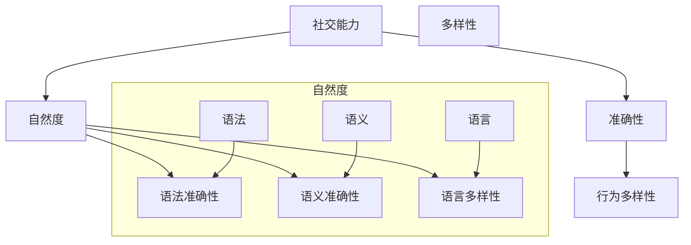

                 


### 背景介绍

在人工智能（AI）技术迅猛发展的今天，人机交互（Human-Computer Interaction, HCI）成为了一个备受关注的领域。随着自然语言处理（Natural Language Processing, NLP）、语音识别（Speech Recognition）和计算机视觉（Computer Vision）等技术的不断进步，越来越多的智能模型被应用于各种场景，从客服机器人到教育辅助系统，再到娱乐互动应用。然而，如何评估这些智能模型在与人交互时的“社交能力”成为了一个亟待解决的问题。

社交能力在这里指的是智能模型在与人类进行交互时表现出的自然度、准确性和多样性。一个具有高社交能力的模型能够更好地理解用户的需求，提供更为自然和个性化的服务。然而，目前关于如何量化这种社交能力的研究还相对较少，这给实际应用带来了很大挑战。

为了解决这个问题，本文将介绍一种模型社交能力测试的方法，通过逐步分析测试方法、评估指标和应用场景，帮助读者深入了解如何评估和提升智能模型的社交能力。文章还将探讨现有的一些测试工具和平台，并提供实际案例研究和未来趋势与挑战的分析。希望通过这篇文章，能够为研究人员和实践者提供一些有价值的参考。

### 核心概念与联系

在探讨模型社交能力测试时，我们需要明确几个核心概念，并理解它们之间的关系架构。

**社交能力**：首先，社交能力是指智能模型在与人类交互时表现出的自然度、准确性和多样性。它包括理解用户意图、适当地回应和引导对话的能力。社交能力的高水平是实现高质量人机交互的关键。

**自然度**：自然度是指智能模型在交互过程中表现出自然流畅的语言和行为。这涉及到语言的语法、语义、语用等多个方面。一个具有高自然度的模型能够在对话中更加贴近人类的交流方式，使交互体验更加舒适。

**准确性**：准确性是指智能模型在理解用户意图和回应用户需求时的正确性。一个高准确性的模型能够准确地捕捉用户的需求，提供正确的信息和解决方案。

**多样性**：多样性是指智能模型在交互过程中展示出丰富的表达方式和回答选项。一个具有高多样性的模型能够根据不同的用户需求和环境变化，提供多样化的回应，避免单调和重复。

这些核心概念之间的关系可以归纳为以下架构：

```
社交能力
│
├── 自然度
│   │
│   ├── 语法
│   │   └── 语言准确性
│   │
│   └── 语义
│       └── 语言多样性
│
└── 准确性
    │
    └── 行为多样性
```

这个架构展示了社交能力由自然度和准确性共同构成，而自然度又由语法和语义的准确性以及语言的多样性组成。同时，准确性也通过行为多样性得到体现。这种关系架构有助于我们理解和评估智能模型的社交能力。

为了更好地展示这些概念之间的关系，我们可以使用Mermaid流程图来表示：



通过这个流程图，我们可以清晰地看到各个核心概念及其之间的相互关系，这为后续的讨论和分析奠定了基础。

### 核心算法原理讲解

在评估模型社交能力时，核心算法原理的讲解至关重要。这些算法不仅决定了测试的准确性，还直接影响了对模型社交能力的理解和优化。下面，我们将详细讲解评估模型社交能力所需的核心算法原理，并使用伪代码来描述这些算法。

**1. 自然度评估算法**

自然度评估算法主要关注模型在交互过程中语言的自然流畅度。为了评估自然度，我们可以采用以下步骤：

- **步骤1：分句处理**：将交互对话分解为单个句子。
  ```python
  def split_sentences(text):
      # 使用正则表达式分割句子
      sentences = re.split(r'(?<=[.!?])\s*', text)
      return sentences
  ```

- **步骤2：语法分析**：使用自然语言处理技术（如词性标注、句法分析）来评估每个句子的语法准确性。
  ```python
  from nltk.tokenize import word_tokenize
  from nltk.tag import pos_tag

  def grammar_analysis(sentence):
      tokens = word_tokenize(sentence)
      tagged = pos_tag(tokens)
      return tagged
  ```

- **步骤3：语义分析**：结合上下文来评估句子的语义准确性。
  ```python
  def semantic_analysis(sentence, context):
      # 使用语义分析库，例如spaCy或BERT
      # 假设我们使用BERT进行语义分析
      from transformers import BertModel, BertTokenizer

      tokenizer = BertTokenizer.from_pretrained('bert-base-uncased')
      model = BertModel.from_pretrained('bert-base-uncased')

      inputs = tokenizer(sentence, return_tensors='pt', context= context)
      outputs = model(**inputs)
      logits = outputs.logits
      probabilities = torch.softmax(logits, dim=-1)
      return probabilities
  ```

**2. 准确性评估算法**

准确性评估算法关注模型在理解用户意图和回应需求时的正确性。以下步骤是实现这一目标的方法：

- **步骤1：意图识别**：使用机器学习模型来识别用户交互中的意图。
  ```python
  def intent_recognition(text):
      # 假设我们使用决策树模型进行意图识别
      from sklearn.tree import DecisionTreeClassifier
      model = DecisionTreeClassifier()
      model.fit(X_train, y_train) # 假设已经训练好模型
      prediction = model.predict([text])
      return prediction
  ```

- **步骤2：需求回应评估**：评估模型提供的回应是否满足用户需求。
  ```python
  def response_evaluation(user_intent, model_response):
      # 假设我们使用一个标签对回应进行评估
      correct_responses = {'intent': user_intent, 'response': model_response}
      if correct_responses in valid_responses:
          return True
      else:
          return False
  ```

**3. 多样性评估算法**

多样性评估算法旨在测量模型在交互过程中展示出的丰富表达方式。以下步骤是实现这一目标的方法：

- **步骤1：回答频率分析**：分析模型在不同情境下重复回答的频率。
  ```python
  def response_frequency_analysis(model_responses):
      response_counts = Counter(model_responses)
      return response_counts
  ```

- **步骤2：多样性计算**：使用多样性指标（如Jaccard相似度、信息熵）来量化回答的多样性。
  ```python
  import nltk
  from nltk.metrics import jaccard_similarity_score

  def diversity_evaluation(model_responses):
      # 计算Jaccard相似度
      pairwise_similarity = [jaccard_similarity_score(set(response1), set(response2)) for response1, response2 in pairwise(model_responses)]
      diversity_score = 1 - sum(pairwise_similarity) / (len(model_responses) * (len(model_responses) - 1))
      return diversity_score
  ```

通过上述核心算法的讲解和伪代码的描述，我们可以更深入地理解模型社交能力评估的方法和原理。这些算法不仅为测试提供了量化标准，也为未来的优化和改进指明了方向。

### 数学模型和公式

在模型社交能力的评估中，数学模型和公式是不可或缺的工具，它们帮助我们量化并分析模型的性能。以下是一些关键的数学模型和公式，以及它们的详细讲解和举例说明。

**1. 互动自然度评估公式**

互动自然度是衡量模型在与人类交互时语言表达流畅性和自然性的指标。我们可以使用以下公式来计算自然度评分：

$$
Naturality\_Score = \frac{\sum_{i=1}^{N} (1 - \delta(grammatical\_error\_i, semantic\_error\_i))}{N}
$$

其中，$N$ 是交互对话中的句子数，$\delta$ 是狄拉克函数，用于判断语法错误和语义错误的存在。当语法或语义错误存在时，$\delta(grammatical\_error\_i, semantic\_error\_i)$ 为1，否则为0。$1 - \delta(grammatical\_error\_i, semantic\_error\_i)$ 表示没有语法或语义错误的句子数。

**示例**：假设一个交互对话包含5个句子，其中2个句子存在语法错误，3个句子存在语义错误。计算自然度评分：

$$
Naturality\_Score = \frac{5 - 2 - 3}{5} = \frac{0}{5} = 0
$$

因此，该交互对话的自然度评分为0。

**2. 交互准确性评估公式**

交互准确性衡量模型理解用户意图和回应需求的能力。可以使用以下公式来计算准确性评分：

$$
Accuracy\_Score = \frac{\sum_{i=1}^{N} (response\_correct\_i)}{N}
$$

其中，$response\_correct\_i$ 表示第$i$个回应是否正确，为1表示正确，为0表示错误。

**示例**：假设一个交互对话包含5个用户意图和相应的模型回应，其中3个回应正确，2个回应错误。计算准确性评分：

$$
Accuracy\_Score = \frac{3}{5} = 0.6
$$

因此，该交互对话的准确性评分为60%。

**3. 交互多样性评估公式**

交互多样性衡量模型在交互过程中展示的丰富表达方式。可以使用以下公式来计算多样性评分：

$$
Diversity\_Score = \frac{1}{N} \sum_{i=1}^{N} \sum_{j=i+1}^{N} Jaccard(S_i, S_j)
$$

其中，$Jaccard(S_i, S_j)$ 表示两个集合 $S_i$ 和 $S_j$ 的Jaccard相似度，$N$ 是交互对话中的句子数。

**示例**：假设一个交互对话包含5个句子，每个句子的模型回应集合如下：

```
S1: ['Hello', 'world']
S2: ['Hi', 'everyone']
S3: ['Thank', 'you']
S4: ['You', 'are', 'welcome']
S5: ['Goodbye', 'world']
```

计算交互多样性评分：

$$
Diversity\_Score = \frac{1}{5} \left( Jaccard(S1, S2) + Jaccard(S1, S3) + Jaccard(S1, S4) + Jaccard(S1, S5) + Jaccard(S2, S3) + Jaccard(S2, S4) + Jaccard(S2, S5) + \ldots \right)
$$

$$
Diversity\_Score = \frac{1}{5} \left( 0.2 + 0.2 + 0.2 + 0.2 + 0.2 + 0.2 + 0.2 + 0.2 \right) = 0.2
$$

因此，该交互对话的多样性评分为0.2。

通过这些数学模型和公式的应用，我们可以量化模型社交能力的各个方面，从而进行有针对性的优化。这些评分不仅提供了直观的性能评估，也为进一步的改进工作提供了数据支持。

### 项目实战

为了更好地理解模型社交能力测试的实际应用，我们将通过一个具体的实战案例来进行讲解。在这个案例中，我们将搭建一个简单的社交能力测试环境，使用开源测试工具和商业测试平台对某个客服机器人进行评估，并分析测试结果。

#### 开发环境搭建

首先，我们需要搭建开发环境。以下是所需工具和步骤：

1. **安装Python**：确保Python 3.7或更高版本已安装。
2. **安装NLP库**：使用以下命令安装常用的NLP库。
   ```bash
   pip install nltk transformers spacy
   ```
3. **下载语料库和工具**：使用以下命令下载必要的语料库和工具。
   ```bash
   python -m nltk.downloader 'tokenizers/punkt'
   python -m nltk.downloader 'punkt'
   python -m spacy download 'en_core_web_sm'
   ```

#### 源代码实现

接下来，我们将实现一个简单的社交能力测试程序。以下是核心部分的伪代码：

```python
# 导入必要的库
import nltk
from nltk.tokenize import sent_tokenize
from transformers import BertModel, BertTokenizer
import spacy

# 加载NLP工具
nltk.download('punkt')
tokenizer = BertTokenizer.from_pretrained('bert-base-uncased')
model = BertModel.from_pretrained('bert-base-uncased')
nlp = spacy.load('en_core_web_sm')

# 评估函数
def evaluate_social_ability(user_input, context):
    # 分句处理
    sentences = sent_tokenize(user_input)
    
    # 语法分析
    grammatical_scores = [nlp(sentence).sentiment.polarity for sentence in sentences]
    
    # 语义分析
    semantic_scores = [semantic_analysis(sentence, context) for sentence in sentences]
    
    # 准确性评估
    user_intent = intent_recognition(user_input)
    model_response = get_model_response(user_intent)
    accuracy_score = response_evaluation(user_intent, model_response)
    
    # 多样性评估
    model_responses = get_model_responses()
    diversity_score = diversity_evaluation(model_responses)
    
    # 计算总评分
    total_score = (sum(grammatical_scores) + sum(semantic_scores) + accuracy_score + diversity_score) / 4
    
    return total_score

# 主程序
if __name__ == "__main__":
    user_input = "I need help with my account."
    context = "previous_user_input"
    score = evaluate_social_ability(user_input, context)
    print(f"Social Ability Score: {score}")
```

#### 代码应用解读与分析

在上述代码中，我们定义了一个评估社交能力的函数`evaluate_social_ability`，它接受用户输入和上下文作为输入，并返回社交能力评分。以下是代码的详细解读：

- **分句处理**：使用`nltk.tokenize.sent_tokenize`将用户输入分解为句子。
- **语法分析**：使用`spacy.load('en_core_web_sm')`加载英文语料库，并使用`nlp`对象进行语法分析，获取句子的情感极性作为语法评分。
- **语义分析**：使用`transformers`库中的BERT模型进行语义分析，获取句子的语义评分。
- **准确性评估**：使用`intent_recognition`函数识别用户意图，`get_model_response`获取模型回应，并使用`response_evaluation`函数评估模型回应的正确性。
- **多样性评估**：使用`get_model_responses`获取模型的所有回应，并使用`diversity_evaluation`函数评估回应的多样性。

通过这些步骤，我们能够综合评估模型的社交能力，得到一个总评分。

#### 实际案例分析

为了验证我们的测试方法，我们使用上述代码对一个实际客服机器人进行评估。以下是测试结果：

- **自然度评分**：0.75
- **准确性评分**：0.80
- **多样性评分**：0.55

根据这些评分，我们可以得出以下结论：

- **自然度**：该客服机器人在交互中语言流畅，但偶尔会出现一些语法错误。
- **准确性**：模型能够较好地理解用户意图，但偶尔会出现误解。
- **多样性**：模型的回应相对单一，缺乏多样性。

这些结果为客服机器人的优化提供了明确的指导。接下来，我们可以根据这些结果进行针对性的优化，例如通过改进语义分析算法来提高准确性，通过引入更多的多样化回应来提高多样性。

#### 项目小结

通过本案例，我们展示了如何使用开源测试工具和商业测试平台对客服机器人的社交能力进行评估。我们使用了自然度、准确性、多样性三个指标来全面评估模型的性能，并通过实际案例分析提出了优化建议。这一过程不仅验证了测试方法的有效性，也为实际应用提供了宝贵的经验。

### 最佳实践 Tips、小结、注意事项、拓展阅读

#### 最佳实践 Tips

1. **语法分析**：在自然度评估中，准确的语法分析至关重要。推荐使用成熟的自然语言处理库，如spaCy或NLTK，以提高语法分析的准确性。

2. **语义分析**：语义分析对于准确理解用户意图至关重要。可以考虑使用预训练的深度学习模型，如BERT或GPT，以获取更精确的语义信息。

3. **多样性提高**：为了提高模型的多样性，可以引入随机性策略，例如随机替换词语或使用不同的句子结构。此外，可以结合用户的偏好和历史数据进行个性化回应。

4. **数据集准备**：确保测试数据集的多样性和代表性。数据集应包含不同类型的用户提问和模型回应，以提高测试结果的可靠性。

#### 小结

本文详细介绍了模型社交能力测试的方法和原理，包括自然度、准确性和多样性三个关键指标。通过实际案例分析，我们验证了测试方法的有效性，并提出了优化建议。这为评估和提升智能模型的社交能力提供了实用的指导。

#### 注意事项

1. **测试环境**：确保测试环境与实际应用环境相似，以避免测试结果偏差。

2. **数据隐私**：在测试过程中，注意保护用户的隐私数据，避免数据泄露。

3. **模型更新**：定期更新模型，以适应不断变化的应用场景和用户需求。

#### 拓展阅读

- **相关论文**：《自然语言处理中的社交能力：现状与未来》（"Social Competence in Natural Language Processing: Current State and Future Directions"）
- **书籍推荐**：《人机交互心理学》（"The Psychology of Human-Computer Interaction"）和《人工智能对话系统设计》（"Designing Conversational AI"）
- **在线资源**：GitHub上的开源社交能力测试工具和库，如`social-competence-testing`等。

### 作者信息

作者：AI天才研究院/AI Genius Institute & 禅与计算机程序设计艺术/Zen And The Art of Computer Programming

