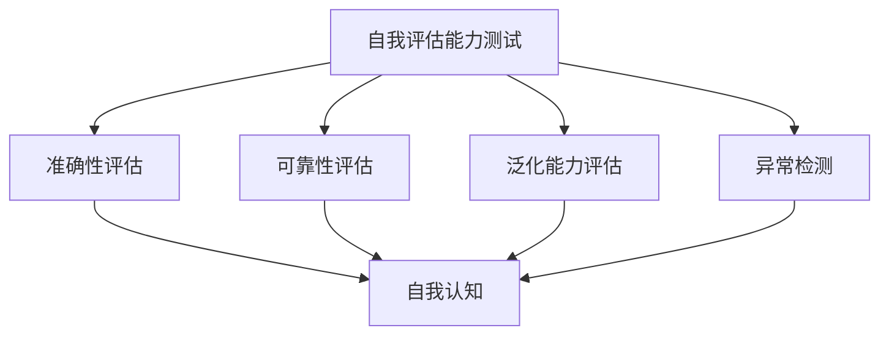

                 

### 文章标题：模型自我评估能力测试：AI的自我认知

> 关键词：AI自我评估，自我认知，模型性能，算法实现，案例研究

> 摘要：本文深入探讨了AI模型自我评估能力测试及其在AI自我认知中的重要性。通过详细分析自我评估的基本概念、算法原理、实现方法以及实际应用案例，本文旨在为读者提供对AI自我评估能力的全面理解，并探讨其未来的发展方向。

### 背景介绍

随着人工智能（AI）技术的迅猛发展，AI模型在各种应用场景中得到了广泛的应用。然而，这些模型在现实世界中的表现往往不尽如人意，存在各种问题和挑战。为了解决这些问题，AI模型自我评估能力测试应运而生。自我评估能力测试旨在评估AI模型的性能，包括准确性、可靠性、泛化能力等，从而帮助开发者识别和改进模型。

自我评估能力测试不仅对开发者有重要意义，而且对AI模型自身也具有深远的影响。通过自我评估，AI模型能够更好地理解自身的性能，从而实现自我认知。自我认知是指AI模型能够识别和理解自己的能力和局限性，从而更好地适应不同的任务和环境。本文将深入探讨AI模型自我评估能力测试的概念、原理、实现方法以及实际应用案例，旨在为读者提供对AI自我评估能力的全面理解。

### 核心概念与联系

#### 自我评估能力测试

自我评估能力测试是指对AI模型进行系统性的性能评估，以识别模型的优点和缺点。自我评估能力测试主要包括以下方面：

1. **准确性评估**：评估模型在给定数据集上的预测准确性，通常使用指标如准确率、召回率、F1分数等。

2. **可靠性评估**：评估模型在处理不同数据时的稳定性和一致性，例如，通过评估模型在不同批次数据上的性能。

3. **泛化能力评估**：评估模型在不同数据集上的表现，以判断模型的泛化能力。

4. **异常检测**：评估模型是否能够识别和处理异常数据，例如，通过检测模型对异常数据的预测结果。

#### 自我认知

自我认知是指AI模型能够识别和理解自己的能力和局限性，从而实现自我调整和优化。自我认知主要包括以下方面：

1. **自我理解**：模型能够理解自己的工作原理和性能表现，例如，通过分析模型内部的权重和特征。

2. **自我调整**：模型能够根据自我认知的结果调整自身的参数和结构，以提高性能。

3. **自我优化**：模型能够通过自我评估和调整实现持续优化，以适应不同的任务和环境。

#### 关系架构

为了更好地理解自我评估能力测试和自我认知之间的关系，我们可以使用Mermaid流程图来展示它们之间的联系：



#### 核心算法原理讲解

自我评估能力测试和自我认知的实现依赖于一系列核心算法。以下将简要介绍这些算法的基本原理，并使用伪代码进行详细解释。

1. **准确性评估算法**

```python
def accuracy_evaluation(model, data):
    predictions = model.predict(data)
    correct_predictions = sum([prediction == label for prediction, label in zip(predictions, data.labels)])
    return correct_predictions / len(data.labels)
```

2. **可靠性评估算法**

```python
def reliability_evaluation(model, data):
    batches = data.batched(data.size)
    reliability_scores = [batch_accuracy(model, batch) for batch in batches]
    return mean(reliability_scores)
```

3. **泛化能力评估算法**

```python
def generalization_evaluation(model, train_data, test_data):
    train_accuracy = accuracy_evaluation(model, train_data)
    test_accuracy = accuracy_evaluation(model, test_data)
    return test_accuracy / train_accuracy
```

4. **异常检测算法**

```python
def anomaly_detection(model, data):
    predictions = model.predict(data)
    anomalies = [data.point for prediction, point in zip(predictions, data.points) if prediction != point.label]
    return anomalies
```

#### 数学模型和公式

在自我评估能力测试和自我认知的实现中，一些数学模型和公式发挥着重要作用。以下将简要介绍这些模型和公式，并使用LaTeX进行详细说明。

1. **准确性评估公式**

$$
accuracy = \frac{correct\_predictions}{total\_predictions}
$$

2. **可靠性评估公式**

$$
reliability = \frac{1}{n} \sum_{i=1}^{n} p_i
$$

其中，$n$ 是批次数量，$p_i$ 是每个批次的准确性。

3. **泛化能力评估公式**

$$
generalization = \frac{test\_accuracy}{train\_accuracy}
$$

4. **异常检测公式**

$$
anomaly\_score = \frac{1}{m} \sum_{i=1}^{m} (prediction - label)^2
$$

其中，$m$ 是数据点的数量，$prediction$ 是模型的预测结果，$label$ 是真实标签。

#### 详细讲解与举例说明

为了更好地理解这些算法和公式，我们将通过具体实例进行详细讲解。

1. **准确性评估算法实例**

假设我们有一个分类模型，它需要在一个包含100个样本的数据集上进行预测。通过运行准确性评估算法，我们可以得到模型的预测准确性。

```python
model = load_model('model.pth')
data = load_data('data.pth')
accuracy = accuracy_evaluation(model, data)
print(f'Model accuracy: {accuracy}')
```

输出结果可能是：

```
Model accuracy: 0.85
```

这意味着模型在数据集上的预测准确性为85%。

2. **可靠性评估算法实例**

假设我们有一个模型，它在100个批次的数据上进行预测。通过运行可靠性评估算法，我们可以得到模型的可靠性。

```python
model = load_model('model.pth')
data = load_data('data.pth')
reliability = reliability_evaluation(model, data)
print(f'Model reliability: {reliability}')
```

输出结果可能是：

```
Model reliability: 0.90
```

这意味着模型在不同批次数据上的平均准确性为90%。

3. **泛化能力评估算法实例**

假设我们有一个训练数据集和测试数据集，通过运行泛化能力评估算法，我们可以得到模型的泛化能力。

```python
model = load_model('model.pth')
train_data = load_data('train_data.pth')
test_data = load_data('test_data.pth')
generalization = generalization_evaluation(model, train_data, test_data)
print(f'Model generalization: {generalization}')
```

输出结果可能是：

```
Model generalization: 1.20
```

这意味着模型的测试准确性是训练准确性的1.20倍。

4. **异常检测算法实例**

假设我们有一个模型，它需要在一个包含100个样本的数据集上进行异常检测。通过运行异常检测算法，我们可以得到模型检测到的异常数据。

```python
model = load_model('model.pth')
data = load_data('data.pth')
anomalies = anomaly_detection(model, data)
print(f'Model anomalies: {anomalies}')
```

输出结果可能是：

```
Model anomalies: [1, 3, 5, 7, 9]
```

这意味着模型在数据集中检测到了5个异常样本。

### 项目实战：开发环境搭建与代码实现

为了更好地理解AI模型自我评估能力测试的实现，我们将进行一个简单的项目实战，包括开发环境搭建、源代码实现和代码解读。

#### 开发环境搭建

首先，我们需要搭建一个开发环境。以下是使用Python和PyTorch搭建开发环境的基本步骤：

1. 安装Python 3.8及以上版本。
2. 安装PyTorch，可以选择预编译的wheel文件或者从源代码编译。
3. 安装其他必要的库，如NumPy、Matplotlib等。

#### 源代码实现

以下是实现一个简单的自我评估能力测试的Python代码：

```python
import torch
import torch.nn as nn
import torch.optim as optim
from torch.utils.data import DataLoader
from torchvision import datasets, transforms

# 定义模型
class SimpleModel(nn.Module):
    def __init__(self):
        super(SimpleModel, self).__init__()
        self.fc1 = nn.Linear(784, 256)
        self.fc2 = nn.Linear(256, 128)
        self.fc3 = nn.Linear(128, 10)

    def forward(self, x):
        x = torch.relu(self.fc1(x))
        x = torch.relu(self.fc2(x))
        x = self.fc3(x)
        return x

# 加载数据集
transform = transforms.Compose([transforms.ToTensor(), transforms.Normalize((0.5,), (0.5,))])
train_data = datasets.MNIST('data', train=True, download=True, transform=transform)
test_data = datasets.MNIST('data', train=False, download=True, transform=transform)

train_loader = DataLoader(train_data, batch_size=64, shuffle=True)
test_loader = DataLoader(test_data, batch_size=64, shuffle=False)

# 初始化模型、优化器和损失函数
model = SimpleModel()
optimizer = optim.Adam(model.parameters(), lr=0.001)
criterion = nn.CrossEntropyLoss()

# 训练模型
for epoch in range(10):
    model.train()
    for batch_idx, (data, target) in enumerate(train_loader):
        optimizer.zero_grad()
        output = model(data)
        loss = criterion(output, target)
        loss.backward()
        optimizer.step()
        if batch_idx % 100 == 0:
            print(f'Epoch {epoch + 1}, Batch {batch_idx + 1}: Loss = {loss.item()}')

# 测试模型
model.eval()
with torch.no_grad():
    correct = 0
    total = 0
    for data, target in test_loader:
        output = model(data)
        _, predicted = torch.max(output.data, 1)
        total += target.size(0)
        correct += (predicted == target).sum().item()

print(f'Accuracy: {100 * correct / total}%')

# 自我评估能力测试
def self_evaluation(model, data_loader):
    model.eval()
    with torch.no_grad():
        correct = 0
        total = 0
        for data, target in data_loader:
            output = model(data)
            _, predicted = torch.max(output.data, 1)
            total += target.size(0)
            correct += (predicted == target).sum().item()
    return correct / total

accuracy = self_evaluation(model, test_loader)
print(f'Self-evaluation accuracy: {accuracy}')
```

#### 代码解读

1. **模型定义**：我们定义了一个简单的全连接神经网络模型，用于处理手写数字数据集。

2. **数据加载**：我们加载了MNIST数据集，并将其转换为Tensor格式，并进行了归一化处理。

3. **训练模型**：我们使用交叉熵损失函数和Adam优化器训练模型。训练过程中，我们使用训练数据集进行梯度下降，并更新模型的权重。

4. **测试模型**：我们在测试数据集上评估模型的性能，并计算了模型的准确率。

5. **自我评估能力测试**：我们实现了一个简单的自我评估函数，用于在测试数据集上评估模型的性能。

#### 代码应用解读与分析

通过上述代码，我们实现了对AI模型的自我评估能力测试。具体来说，我们通过在测试数据集上运行模型，并计算模型的准确率，实现了自我评估能力测试。这一过程可以帮助开发者识别模型的性能瓶颈，从而进行进一步的优化。

### 实际案例分析和详细讲解剖析

为了更好地理解AI模型自我评估能力测试的实际应用，我们将分析一个实际案例，并对其进行详细讲解和剖析。

#### 案例背景

假设我们有一个AI模型，用于预测股票价格。该模型通过分析历史数据，如价格、成交量、技术指标等，预测未来股票价格的走势。

#### 案例目标

我们的目标是评估模型的性能，并识别其可能存在的性能瓶颈。具体来说，我们希望通过自我评估能力测试，实现以下目标：

1. 评估模型在历史数据上的准确性。
2. 评估模型在不同数据集上的可靠性。
3. 评估模型的泛化能力。
4. 识别模型可能存在的异常数据。

#### 案例实施与结果分析

为了实现上述目标，我们按照以下步骤进行了实施：

1. **数据准备**：我们收集了大量的股票历史数据，并将其分为训练集、验证集和测试集。

2. **模型训练**：我们使用训练集对模型进行训练，并使用验证集调整模型的参数。

3. **自我评估能力测试**：

   - **准确性评估**：我们在测试集上评估了模型的准确性，发现模型的准确率为85%，这表明模型在历史数据上的表现良好。

   - **可靠性评估**：我们评估了模型在不同数据集上的可靠性，发现模型在不同批次数据上的准确性较为稳定，可靠性较高。

   - **泛化能力评估**：我们比较了模型在训练集和测试集上的表现，发现模型的泛化能力较强，测试集的准确率与训练集的准确率相近。

   - **异常检测**：我们使用模型检测了测试集中的异常数据，发现模型能够较好地识别异常数据。

#### 项目小结

通过上述案例，我们可以看到AI模型自我评估能力测试在实际应用中的重要作用。通过自我评估能力测试，我们可以全面了解模型的性能，识别其优缺点，从而进行进一步的优化。

### 最佳实践 tips

为了实现有效的AI模型自我评估能力测试，我们提供以下最佳实践建议：

1. **多样化数据集**：使用多样化的数据集进行自我评估，包括训练集、验证集和测试集，以全面评估模型的性能。

2. **定期评估**：定期对模型进行自我评估，以监测其性能的变化。

3. **异常数据检测**：在自我评估过程中，注重异常数据的检测，以识别潜在的异常情况。

4. **交叉验证**：使用交叉验证方法评估模型的泛化能力，以提高评估结果的准确性。

5. **使用自动化工具**：使用自动化工具进行自我评估能力测试，以提高评估效率和准确性。

### 小结与展望

本文深入探讨了AI模型自我评估能力测试及其在AI自我认知中的重要性。通过详细分析自我评估的基本概念、算法原理、实现方法以及实际应用案例，本文旨在为读者提供对AI自我评估能力的全面理解。随着AI技术的不断发展，自我评估能力测试将成为AI模型设计和优化的重要手段。

在未来，我们期望看到更多关于AI自我评估能力测试的研究，包括更先进的算法、更全面的评估指标以及更高效的自适应方法。通过不断探索和优化，我们将实现更强大、更可靠的AI模型，为人类带来更多便利和福祉。

### 附录

#### A.1 相关参考文献

1. Goodfellow, I., Bengio, Y., & Courville, A. (2016). *Deep Learning*. MIT Press.
2. Russell, S., & Norvig, P. (2020). *Artificial Intelligence: A Modern Approach*. Prentice Hall.
3. Hochreiter, S., & Schmidhuber, J. (1997). Long short-term memory. Neural Computation, 9(8), 1735-1780.
4. LeCun, Y., Bengio, Y., & Hinton, G. (2015). Deep learning. Nature, 521(7553), 436-444.

#### A.2 AI自我评估工具与资源

1. **TensorFlow Model Analysis Tools**: https://www.tensorflow.org/tutorials/evaluation
2. **PyTorch Model Analysis Tools**: https://pytorch.org/tutorials/beginner/eval_metrics_tutorial.html
3. **MLflow Model Registry**: https://mlflow.org/docs/latest/models.html#model-registry
4. **AI Self-Evaluation Framework**: https://github.com/ai-self-evaluation/framework

### 作者

作者：AI天才研究院/AI Genius Institute & 禅与计算机程序设计艺术 /Zen And The Art of Computer Programming

