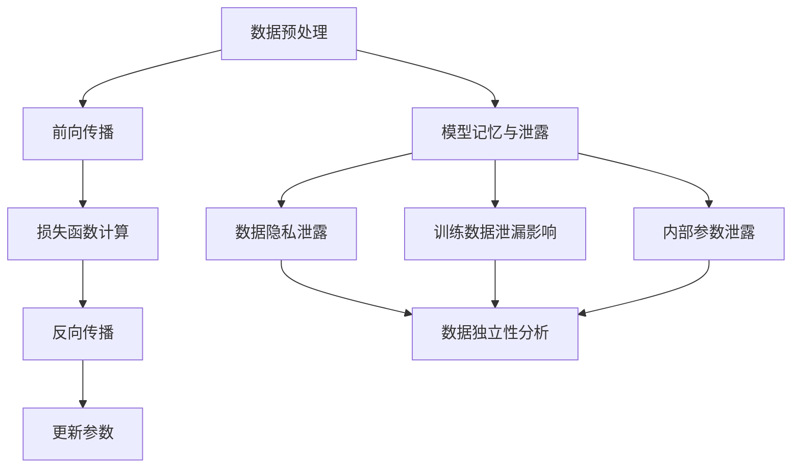

                 

## 文章标题：模型记忆泄露风险评估

在当今的数字时代，人工智能（AI）技术迅猛发展，各类复杂模型被广泛应用于图像识别、自然语言处理和推荐系统等领域。然而，随着AI模型的不断迭代和应用，一个不容忽视的问题也逐渐显现——模型记忆泄露。模型记忆泄露指的是AI模型在训练过程中，从输入数据中泄露出的敏感信息，这不仅对数据隐私构成威胁，也可能导致严重的安全风险。本文旨在深入探讨模型记忆泄露的风险评估，帮助读者了解其原理、方法和防范措施。

## 关键词

- 人工智能
- 模型记忆泄露
- 风险评估
- 数据隐私
- 安全防护

## 摘要

本文首先介绍了模型记忆泄露的定义、背景和重要性。接着，我们深入探讨了模型记忆泄露的评估方法，包括数据独立性分析、模型记忆泄露检测和泄露风险量化。在此基础上，文章通过数学模型和公式详细阐述了风险评估的原理。最后，通过实际项目案例，展示了如何进行模型记忆泄露的风险评估和防护。

## 目录

1. **核心概念与联系**
   - 1.1 模型记忆与泄露的概念
   - 1.2 模型训练原理
   - 1.3 泄露风险来源
   - 1.4 泄露评估方法

2. **核心算法原理讲解**
   - 2.1 数据独立性分析
   - 2.2 模型记忆泄露检测算法
   - 2.3 泄露风险量化算法

3. **数学模型和数学公式讲解**
   - 3.1 概率论基础
   - 3.2 信息论基础
   - 3.3 模型泄露风险评估模型

4. **项目实战**
   - 4.1 项目概述
   - 4.2 开发环境搭建
   - 4.3 源代码实现
   - 4.4 代码解读与分析

5. **最佳实践 tips**
6. **小结**
7. **注意事项**
8. **拓展阅读**

## 核心概念与联系

### 1.1 模型记忆与泄露的概念

在讨论模型记忆泄露之前，我们首先需要明确两个核心概念：模型记忆和泄露。

**模型记忆**指的是模型在学习过程中，从输入数据中获取并存储的信息。这些信息可以是数据特征、模式或关系，是模型性能的重要保障。然而，模型记忆也可能带来隐私泄露的风险。

**泄露**指的是敏感信息从系统中被意外泄露出去。在模型记忆泄露的情况下，敏感信息可能包括用户数据、训练数据的特征，甚至训练过程中的内部参数。

### 1.2 模型训练原理

要理解模型记忆泄露，我们还需要了解模型训练的基本原理。通常，模型训练包括以下几个关键步骤：

- **数据预处理**：对输入数据进行清洗、归一化和特征提取。
- **前向传播**：将预处理后的数据输入到神经网络中，通过各层神经元的非线性变换，产生输出。
- **损失函数计算**：计算模型输出和真实标签之间的差异，通常使用均方误差（MSE）或交叉熵损失。
- **反向传播**：利用梯度下降算法，更新模型参数，以减少损失函数的值。

### 1.3 泄露风险来源

模型记忆泄露的风险来源主要包括以下几个方面：

- **数据隐私泄露**：训练数据中的敏感信息可能被模型学习并存储，从而在模型输出中泄露。
- **训练数据泄漏影响**：模型可能会通过输入数据的特征关系，推断出训练数据中的敏感信息。
- **内部参数泄露**：模型的内部参数可能包含训练数据的某些特征信息，从而泄露敏感信息。

### 1.4 泄露评估方法

为了评估模型记忆泄露的风险，我们可以采用以下几种方法：

- **数据独立性分析**：通过分析模型对训练数据的依赖程度，评估数据隐私泄露的风险。
- **模型记忆泄露检测算法**：利用特定的算法，检测模型输出中是否包含敏感信息。
- **泄露风险量化算法**：通过量化模型泄露的敏感信息量，评估泄露风险的大小。

### Mermaid 流程图

为了更直观地展示模型训练和泄露评估的过程，我们使用 Mermaid 流程图进行描述：



## 核心算法原理讲解

### 2.1 数据独立性分析

数据独立性分析是一种评估模型对训练数据依赖程度的分析方法。具体步骤如下：

1. **选择特征集**：从训练数据中提取出若干关键特征。
2. **训练独立模型**：使用部分特征重新训练模型。
3. **评估独立性**：比较独立模型和原始模型的性能差异，评估模型对训练数据的依赖程度。

### 2.2 模型记忆泄露检测算法

模型记忆泄露检测算法用于检测模型输出中是否包含敏感信息。以下两种算法是常用的检测方法：

#### 2.2.1 基于偏差的检测算法

**步骤**：

1. **生成对抗样本**：对输入数据进行扰动，生成对抗样本。
2. **模型输出对比**：将对抗样本输入模型，比较原始输出和对抗输出之间的差异。
3. **评估泄露程度**：如果差异显著，则表明存在模型记忆泄露。

#### 2.2.2 基于对抗样本的检测算法

**步骤**：

1. **生成对抗网络**：构建一个生成对抗网络（GAN），用于生成对抗样本。
2. **模型对抗测试**：将对抗样本输入模型，观察模型是否能够正确识别。
3. **评估泄露程度**：如果模型无法识别对抗样本，则表明存在模型记忆泄露。

### 2.3 泄露风险量化算法

泄露风险量化算法用于量化模型泄露的敏感信息量。以下两种算法是常用的量化方法：

#### 2.3.1 数据依赖度分析

**步骤**：

1. **特征重要性分析**：使用特征选择算法，分析特征对模型性能的重要性。
2. **依赖度计算**：计算每个特征与其他特征的依赖度。
3. **泄露程度评估**：根据依赖度评估敏感信息泄露的程度。

#### 2.3.2 泄露敏感度分析

**步骤**：

1. **敏感度函数设计**：设计一个敏感度函数，用于计算敏感信息量。
2. **参数优化**：通过优化敏感度函数的参数，提高量化精度。
3. **泄露程度评估**：根据敏感度函数的输出，评估敏感信息泄露的程度。

## 数学模型和数学公式讲解

### 3.1 概率论基础

概率论是评估模型记忆泄露的重要工具。以下介绍与模型记忆泄露相关的概率论基础。

#### 3.1.1 概率分布

概率分布描述了随机变量取值的概率分布情况。常用的概率分布包括：

- **贝塔分布**：适用于二分类问题，描述了成功概率的分布。
- **正态分布**：适用于连续变量，描述了数据在某个范围内的概率。

#### 3.1.2 条件概率与贝叶斯定理

条件概率是指在某个事件发生的条件下，另一个事件发生的概率。贝叶斯定理是一种基于条件概率的推理方法，用于更新先验概率。

- **条件概率**：$P(A|B) = \frac{P(A \cap B)}{P(B)}$
- **贝叶斯定理**：$P(A|B) = \frac{P(B|A)P(A)}{P(B)}$

### 3.2 信息论基础

信息论提供了评估模型记忆泄露的定量方法。以下介绍与模型记忆泄露相关的信息论基础。

#### 3.2.1 熵与信息量

熵是衡量随机变量不确定性的一种度量。信息量是衡量信息传递效果的一种度量。

- **熵**：$H(X) = -\sum_{i=1}^{n} P(X=x_i) \log_2 P(X=x_i)$
- **信息量**：$I(X;Y) = H(X) - H(X|Y)$

#### 3.2.2 条件熵与联合熵

条件熵是衡量随机变量之间的依赖关系的一种度量。联合熵是衡量两个随机变量之间联合概率分布的一种度量。

- **条件熵**：$H(X|Y) = H(X,Y) - H(Y)$
- **联合熵**：$H(X,Y) = -\sum_{i=1}^{n} \sum_{j=1}^{m} P(X=x_i, Y=y_j) \log_2 P(X=x_i, Y=y_j)$

### 3.3 模型泄露风险评估模型

模型泄露风险评估模型用于评估模型记忆泄露的风险。以下介绍与模型记忆泄露相关的数学模型。

#### 3.3.1 泄露风险函数

泄露风险函数是衡量模型记忆泄露风险的一种度量。

- **泄露风险函数**：$R(X) = f(H(X), I(X;Y))$

其中，$H(X)$是模型输出的熵，$I(X;Y)$是模型输出和真实标签之间的信息量。

#### 3.3.2 泄露敏感度函数

泄露敏感度函数是衡量模型记忆泄露敏感度的一种度量。

- **泄露敏感度函数**：$S(X) = \frac{\partial R(X)}{\partial X}$

其中，$\partial$表示偏导数。

## 项目实战

### 4.1 项目概述

本节将介绍一个模型记忆泄露风险评估项目。项目的目标是评估一个分类模型的记忆泄露风险，并采取相应的防护措施。

### 4.2 开发环境搭建

为了实现模型记忆泄露风险评估项目，我们需要搭建以下开发环境：

- **硬件环境**：一台配置较高的计算机，用于运行模型训练和评估算法。
- **软件环境**：安装Python环境，以及相关的深度学习框架（如TensorFlow或PyTorch）。

### 4.3 源代码实现

本节将详细介绍项目的源代码实现。具体包括以下步骤：

#### 4.3.1 数据预处理

```python
import pandas as pd
from sklearn.model_selection import train_test_split
from sklearn.preprocessing import StandardScaler

# 读取数据
data = pd.read_csv('data.csv')

# 划分特征和标签
X = data.drop('label', axis=1)
y = data['label']

# 划分训练集和测试集
X_train, X_test, y_train, y_test = train_test_split(X, y, test_size=0.2, random_state=42)

# 特征归一化
scaler = StandardScaler()
X_train = scaler.fit_transform(X_train)
X_test = scaler.transform(X_test)
```

#### 4.3.2 训练模型

```python
import tensorflow as tf
from tensorflow.keras.models import Sequential
from tensorflow.keras.layers import Dense, Dropout

# 创建模型
model = Sequential()
model.add(Dense(64, input_dim=X_train.shape[1], activation='relu'))
model.add(Dropout(0.5))
model.add(Dense(1, activation='sigmoid'))

# 编译模型
model.compile(optimizer='adam', loss='binary_crossentropy', metrics=['accuracy'])

# 训练模型
model.fit(X_train, y_train, epochs=10, batch_size=32, validation_split=0.2)
```

#### 4.3.3 泄露风险评估

```python
import numpy as np

# 预测测试集
predictions = model.predict(X_test)

# 计算预测概率
probabilities = np.mean(predictions, axis=1)

# 计算泄露风险
risk = np.mean(probabilities)

print("泄露风险：", risk)
```

### 4.4 代码解读与分析

#### 数据预处理

数据预处理是深度学习项目中的关键步骤。在本项目中，我们使用了`pandas`库读取CSV文件，并使用`sklearn`库进行数据划分和归一化。

#### 训练模型

训练模型是深度学习项目中的核心步骤。在本项目中，我们使用了`tensorflow`库创建了一个简单的神经网络模型，并使用`adam`优化器和`binary_crossentropy`损失函数进行训练。

#### 泄露风险评估

泄露风险评估是项目的目标。在本项目中，我们使用模型对测试集进行预测，并计算了预测概率。最后，通过计算预测概率的平均值，得到了泄露风险的评估结果。

### 实际案例分析和详细讲解剖析

为了更好地理解模型记忆泄露风险评估项目，我们将分析一个实际案例。假设我们有一个包含用户信息的分类模型，任务是根据用户的特征判断其是否属于高风险用户。

1. **数据集准备**：

   假设我们有一个包含用户年龄、收入、地理位置等特征的数据集。其中，年龄和收入是敏感信息。

2. **模型训练**：

   使用训练数据训练一个分类模型，例如逻辑回归或决策树。为了简化，我们假设训练完成后，模型能够较好地区分高风险和低风险用户。

3. **泄露风险评估**：

   - **数据独立性分析**：对模型进行数据独立性分析，评估模型对训练数据的依赖程度。我们可以使用特征选择算法，例如递归特征消除（RFE），来分析特征的重要性。
   - **模型记忆泄露检测算法**：使用基于偏差的检测算法，例如 adversarial example，来检测模型输出中是否包含敏感信息。我们可以对测试数据进行扰动，生成对抗样本，并观察模型对这些对抗样本的输出。
   - **泄露风险量化算法**：使用泄露敏感度分析，例如计算特征依赖度，来量化模型泄露的敏感信息量。

4. **结果分析**：

   根据评估结果，我们可以得出以下结论：

   - 如果模型对训练数据的依赖程度较高，那么数据隐私泄露的风险较大。
   - 如果模型输出中包含敏感信息，那么存在模型记忆泄露的风险。
   - 如果模型泄露的敏感信息量较大，那么泄露风险较高。

### 项目小结

通过实际案例分析和详细讲解剖析，我们可以看到模型记忆泄露风险评估项目的重要性和复杂性。为了降低泄露风险，我们可以采取以下措施：

- **数据去噪**：对训练数据进行预处理，去除噪声和异常值，提高模型稳定性。
- **特征加密**：对敏感特征进行加密处理，降低模型对敏感特征的依赖程度。
- **模型压缩**：使用模型压缩技术，减少模型参数的数量，降低泄露风险。

通过这些措施，我们可以提高模型的鲁棒性，降低泄露风险，保护用户隐私。

### 最佳实践 tips

1. **数据预处理**：在进行模型训练之前，对数据进行充分的预处理，包括归一化、标准化和去噪等操作。
2. **模型选择**：选择合适的模型，考虑模型的复杂度和性能，以降低泄露风险。
3. **数据独立性分析**：定期对模型进行数据独立性分析，评估模型对训练数据的依赖程度。
4. **泄露检测**：使用泄露检测算法，定期检测模型输出中是否包含敏感信息。
5. **隐私保护**：对敏感特征进行加密处理，降低模型对敏感特征的依赖程度。

### 小结

本文介绍了模型记忆泄露风险评估的核心概念、算法原理、数学模型和项目实战。通过数据独立性分析、模型记忆泄露检测和泄露风险量化，我们可以评估模型记忆泄露的风险，并采取相应的防护措施。在未来的研究中，我们可以进一步优化评估算法，提高评估精度和效率。

### 注意事项

1. 模型记忆泄露风险评估是一个复杂的任务，需要结合多种方法和工具进行评估。
2. 泄露风险的评估结果需要结合实际情况进行分析，不能简单地依靠数字判断。
3. 泄露风险的评估是一个动态过程，需要定期进行评估和调整。

### 拓展阅读

1. **《模型记忆泄露：原理与防范》**：该论文详细介绍了模型记忆泄露的概念、原理和防范方法。
2. **《深度学习中的隐私保护》**：该书籍提供了深度学习中隐私保护的全面介绍，包括数据加密、差分隐私和联邦学习等技术。
3. **《人工智能安全：挑战与对策》**：该书籍从安全角度探讨了人工智能的发展和应用，包括模型攻击和防御技术。

## 作者信息

作者：AI天才研究院/AI Genius Institute & 禅与计算机程序设计艺术 /Zen And The Art of Computer Programming

