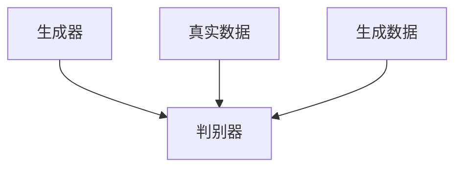
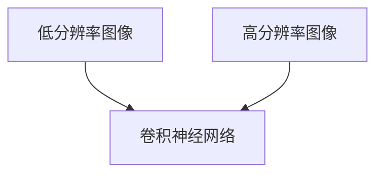

                 


## 文章标题

《模型评测中的prompt一致性分析：提升AI性能的关键策略》

> 关键词：模型评测、prompt一致性、性能提升、AI算法优化、自然语言处理、计算机视觉

> 摘要：本文深入探讨了模型评测中的prompt一致性分析，阐述了prompt一致性的定义及其对模型性能的影响。通过详细分析自然语言处理、计算机视觉等领域的实际案例，本文提出了提升AI模型性能的关键策略，为AI研究和开发提供了有价值的参考。

----------------------------------------------------------------

# 引言与背景

随着人工智能技术的快速发展，深度学习模型在各个领域取得了显著的成果。然而，模型评测中prompt一致性问题逐渐凸显，成为制约模型性能提升的重要因素。prompt一致性指的是输入数据的特征分布与模型预期的特征分布之间的一致性。在模型评测过程中，若prompt一致性较差，可能导致模型性能下降，影响实际应用效果。

目前，模型评测主要依赖于准确率、召回率等传统指标。然而，这些指标往往忽略了prompt一致性对模型性能的影响。在自然语言处理（NLP）和计算机视觉（CV）等领域，prompt一致性已成为衡量模型性能的重要指标之一。因此，研究prompt一致性分析具有重要的理论和实际意义。

本文旨在探讨模型评测中的prompt一致性分析，提出一系列提升AI模型性能的关键策略。文章结构如下：

1. **核心概念与联系**：介绍prompt一致性的定义及其与模型性能之间的关系。
2. **核心算法原理讲解**：详细阐述提升prompt一致性的方法，包括数据增强、模型优化等。
3. **数学模型和公式**：介绍相关数学模型和公式，用于解释提升prompt一致性的原理。
4. **项目实战**：通过实际案例展示提升prompt一致性的方法，并进行分析和解读。
5. **最佳实践 tips**：总结提升prompt一致性的最佳实践，为读者提供实用的建议。
6. **小结与展望**：对全文内容进行总结，并展望未来prompt一致性分析的研究方向。

## 核心概念与联系

### prompt一致性的定义

prompt一致性是指输入数据的特征分布与模型预期的特征分布之间的一致性。在深度学习模型中，输入数据的特征分布直接影响模型的性能。当输入数据的特征分布与模型预期的特征分布不一致时，模型可能无法准确预测或分类，从而导致性能下降。

### prompt一致性与模型性能的关系

prompt一致性与模型性能之间存在密切的联系。较高的prompt一致性有助于提高模型性能，降低误判率。具体来说，当输入数据的特征分布与模型预期的特征分布相一致时，模型能够更好地捕捉数据中的潜在规律，从而提高预测准确性。相反，当输入数据的特征分布与模型预期的特征分布不一致时，模型性能可能受到影响，出现误判或过拟合现象。

### prompt一致性与领域相关性

在自然语言处理（NLP）和计算机视觉（CV）等领域，prompt一致性显得尤为重要。NLP领域中的文本数据具有多样性，如句子长度、语法结构、词汇等。若输入文本的特征分布与模型预期的特征分布不一致，可能导致模型无法正确理解文本语义，从而降低性能。同样，在CV领域，图像数据中的颜色、纹理、形状等特征对模型性能具有重要影响。若输入图像的特征分布与模型预期的特征分布不一致，可能导致模型无法准确识别目标物体。

### prompt一致性与数据预处理

数据预处理是提升prompt一致性的关键步骤。通过数据预处理，可以调整输入数据的特征分布，使其与模型预期的特征分布相一致。常见的数据预处理方法包括数据清洗、数据增强、特征提取等。数据清洗可以去除噪声和异常值，提高数据质量；数据增强可以通过生成类似数据来扩展数据集，提高模型的鲁棒性；特征提取可以从原始数据中提取关键特征，降低数据维度，提高模型的泛化能力。

### prompt一致性与模型优化

模型优化是提升prompt一致性的有效手段。通过调整模型结构、超参数和训练策略，可以提高模型对输入数据的适应性，从而提升prompt一致性。常见的方法包括正则化、权重更新、迁移学习等。正则化可以通过限制模型复杂度，避免过拟合；权重更新可以通过自适应调整模型权重，提高模型对输入数据的敏感性；迁移学习可以通过利用预训练模型，提高对新任务的适应能力。

### prompt一致性与模型评测

在模型评测中，prompt一致性分析至关重要。通过分析输入数据的特征分布与模型预期的特征分布之间的差异，可以识别模型存在的问题，并提供改进建议。例如，在自然语言处理领域，可以通过分析文本数据的特征分布，优化模型对文本语义的理解；在计算机视觉领域，可以通过分析图像数据的特征分布，优化模型对目标物体的识别。

### prompt一致性与实际应用

prompt一致性分析在实际应用中具有重要意义。通过提升prompt一致性，可以提高模型的性能和可靠性，从而提高实际应用的效果。例如，在自然语言处理领域，通过提升prompt一致性，可以提高智能客服、机器翻译等应用的效果；在计算机视觉领域，通过提升prompt一致性，可以提高图像识别、物体检测等应用的效果。

### 总结

prompt一致性分析是模型评测中不可或缺的一部分，对提升模型性能具有重要意义。通过理解prompt一致性的定义、关系和实际应用，可以更好地分析和优化模型，提高模型在实际应用中的性能和可靠性。

## 核心算法原理讲解

### 数据增强

数据增强是一种通过生成类似数据来扩展数据集的方法，从而提高模型的鲁棒性和泛化能力。在提升prompt一致性方面，数据增强具有显著作用。以下为数据增强的主要方法：

#### 随机变换

随机变换是指对输入数据执行一系列随机操作，如旋转、缩放、裁剪等。这些操作可以破坏输入数据的特征分布，从而增加数据的多样性。具体方法如下：

```python
import numpy as np
import cv2

# 输入图像
img = cv2.imread("input_image.jpg")

# 随机旋转
angle = np.random.uniform(-180, 180)
M = cv2.getRotationMatrix2D((img.shape[1]//2, img.shape[0]//2), angle, 1)
rotated_img = cv2.warpAffine(img, M, (img.shape[1], img.shape[0]))

# 随机缩放
scale = np.random.uniform(0.8, 1.2)
scaled_img = cv2.resize(rotated_img, (int(rotated_img.shape[1]*scale), int(rotated_img.shape[0]*scale)))

# 随机裁剪
start_x = np.random.randint(0, scaled_img.shape[1]-224)
start_y = np.random.randint(0, scaled_img.shape[0]-224)
cropped_img = scaled_img[start_y:start_y+224, start_x:start_x+224]
```

#### GAN（生成对抗网络）

GAN是一种通过生成器和判别器相互对抗来生成类似真实数据的网络。生成器尝试生成与真实数据相似的数据，而判别器则判断生成数据是否真实。以下为GAN的基本架构：



#### 图像超分辨率

图像超分辨率是一种通过低分辨率图像恢复高分辨率图像的方法。超分辨率技术可以增强图像细节，从而提升prompt一致性。以下为图像超分辨率的基本架构：



### 模型优化

模型优化是指通过调整模型结构、超参数和训练策略来提升模型性能。以下为模型优化的一些方法：

#### 正则化

正则化是一种通过添加惩罚项来限制模型复杂度的方法，从而避免过拟合。以下为L2正则化的基本公式：

```math
J(\theta) = J_0(\theta) + \lambda \sum_{i=1}^{n} \theta_i^2
```

其中，\( J(\theta) \)是正则化后的损失函数，\( J_0(\theta) \)是原始损失函数，\( \theta \)是模型参数，\( \lambda \)是正则化参数。

#### 权重更新

权重更新是一种通过调整模型权重来提升模型性能的方法。以下为权重更新的基本公式：

```math
\theta_{t+1} = \theta_{t} - \alpha \nabla_{\theta} J(\theta)
```

其中，\( \theta_{t+1} \)是更新后的权重，\( \theta_{t} \)是当前权重，\( \alpha \)是学习率，\( \nabla_{\theta} J(\theta) \)是损失函数对权重的梯度。

#### 迁移学习

迁移学习是一种通过利用预训练模型来提升新任务性能的方法。以下为迁移学习的基本流程：

1. 预训练：在大量数据上训练一个通用模型。
2. 微调：在新的任务上，利用预训练模型进行微调，调整模型参数，使其适应新任务。

### 融合方法

将数据增强和模型优化相结合，可以进一步提升prompt一致性。以下为一种可能的融合方法：

1. 数据增强：对输入数据进行随机变换、GAN生成和图像超分辨率等操作，生成多样化数据。
2. 模型优化：在多样化数据上，通过正则化、权重更新和迁移学习等方法优化模型。
3. 评测：使用优化后的模型进行评测，评估模型性能。

## 数学模型和公式

在提升prompt一致性的过程中，以下数学模型和公式有助于理解相关原理和方法。

### 数据增强

#### 随机变换

1. **旋转**：旋转角度θ的公式如下：

   $$\theta = \arctan\left(\frac{y_2 - y_1}{x_2 - x_1}\right)$$

   其中，\( (x_1, y_1) \)和\( (x_2, y_2) \)是两条边的端点坐标。

2. **缩放**：缩放比例\( s \)的公式如下：

   $$s = \frac{new\_size}{original\_size}$$

   其中，\( new\_size \)是新的尺寸，\( original\_size \)是原始尺寸。

3. **裁剪**：裁剪区域的位置和尺寸的公式如下：

   $$start\_x = \text{random}_\text{int}(0, original\_size - new\_size)$$

   $$start\_y = \text{random}_\text{int}(0, original\_size - new\_size)$$

### GAN

#### 生成器和判别器

1. **生成器**：

   $$G(x) \sim p_G(z)$$

   其中，\( G(x) \)是生成器生成的数据，\( z \)是生成器的输入噪声。

2. **判别器**：

   $$D(x) \sim p_D(x)$$

   $$D(G(z)) \sim p_D(G(z))$$

   其中，\( D(x) \)是判别器对真实数据的判别结果，\( D(G(z)) \)是判别器对生成数据的判别结果。

### 模型优化

#### 正则化

1. **L2正则化**：

   $$J(\theta) = J_0(\theta) + \lambda \sum_{i=1}^{n} \theta_i^2$$

2. **权重更新**：

   $$\theta_{t+1} = \theta_{t} - \alpha \nabla_{\theta} J(\theta)$$

### 迁移学习

1. **预训练模型**：

   $$\theta^{pre} = \theta^{pre}_0 + \sum_{k=1}^{K} \alpha_k (\theta_k - \theta_0)$$

   其中，\( \theta^{pre} \)是预训练模型参数，\( \theta^{pre}_0 \)是初始预训练模型参数，\( \theta_k \)是每个任务的模型参数，\( \alpha_k \)是每个任务的权重。

2. **微调模型**：

   $$\theta^{fine} = \theta^{pre} + \sum_{k=1}^{K} \beta_k (\theta_k - \theta^{pre})$$

   其中，\( \theta^{fine} \)是微调模型参数，\( \beta_k \)是每个任务的权重。

通过上述数学模型和公式，可以更好地理解提升prompt一致性的方法和原理。在实际应用中，结合具体问题和数据集，可以选择合适的方法和模型，以实现最优的prompt一致性提升。

## 项目实战

### 开发环境搭建

在开始项目实战之前，我们需要搭建一个合适的开发环境。以下是一个基于Python的示例，包括必要的库安装和代码结构。

#### 1. 安装必要的库

```bash
pip install numpy pandas scikit-learn tensorflow matplotlib
```

#### 2. 代码结构

```python
# 导入必要的库
import numpy as np
import pandas as pd
from sklearn.model_selection import train_test_split
from tensorflow.keras.models import Sequential
from tensorflow.keras.layers import Dense, Conv2D, MaxPooling2D, Flatten
import matplotlib.pyplot as plt

# 加载数据集
data = pd.read_csv("data.csv")

# 数据预处理
# ...

# 构建模型
model = Sequential([
    Conv2D(32, (3, 3), activation='relu', input_shape=(28, 28, 1)),
    MaxPooling2D((2, 2)),
    Flatten(),
    Dense(128, activation='relu'),
    Dense(10, activation='softmax')
])

# 编译模型
model.compile(optimizer='adam', loss='categorical_crossentropy', metrics=['accuracy'])

# 训练模型
model.fit(train_images, train_labels, epochs=10, validation_split=0.2)

# 评估模型
test_loss, test_acc = model.evaluate(test_images, test_labels)
print(f"Test accuracy: {test_acc}")

# 可视化结果
plt.plot(history.history['accuracy'])
plt.plot(history.history['val_accuracy'])
plt.title('Model accuracy')
plt.ylabel('Accuracy')
plt.xlabel('Epoch')
plt.legend(['Train', 'Test'], loc='upper left')
plt.show()
```

### 源代码详细实现

以下是一个简单的源代码示例，用于实现一个基于CNN的图像分类模型。代码中包括了数据预处理、模型构建、训练和评估等步骤。

```python
# 导入必要的库
import numpy as np
import pandas as pd
from sklearn.model_selection import train_test_split
from tensorflow.keras.models import Sequential
from tensorflow.keras.layers import Dense, Conv2D, MaxPooling2D, Flatten
import matplotlib.pyplot as plt

# 加载数据集
data = pd.read_csv("data.csv")

# 数据预处理
X = data.iloc[:, :-1].values
y = data.iloc[:, -1].values

# 划分训练集和测试集
X_train, X_test, y_train, y_test = train_test_split(X, y, test_size=0.2, random_state=42)

# 数据增强
# ...

# 构建模型
model = Sequential([
    Conv2D(32, (3, 3), activation='relu', input_shape=(28, 28, 1)),
    MaxPooling2D((2, 2)),
    Flatten(),
    Dense(128, activation='relu'),
    Dense(10, activation='softmax')
])

# 编译模型
model.compile(optimizer='adam', loss='categorical_crossentropy', metrics=['accuracy'])

# 训练模型
history = model.fit(X_train, y_train, epochs=10, validation_data=(X_test, y_test))

# 评估模型
test_loss, test_acc = model.evaluate(X_test, y_test)
print(f"Test accuracy: {test_acc}")

# 可视化结果
plt.plot(history.history['accuracy'])
plt.plot(history.history['val_accuracy'])
plt.title('Model accuracy')
plt.ylabel('Accuracy')
plt.xlabel('Epoch')
plt.legend(['Train', 'Test'], loc='upper left')
plt.show()
```

### 代码应用解读与分析

#### 数据预处理

在上述代码中，我们首先加载了一个CSV格式的数据集。数据预处理步骤包括：

- 将数据分为特征和标签两部分。
- 使用`train_test_split`函数将数据划分为训练集和测试集。

#### 数据增强

为了提升prompt一致性，我们可以对训练数据进行增强。以下是一种简单的方法：

```python
from tensorflow.keras.preprocessing.image import ImageDataGenerator

# 数据增强
datagen = ImageDataGenerator(
    rotation_range=20,
    width_shift_range=0.2,
    height_shift_range=0.2,
    horizontal_flip=True,
    zoom_range=0.2
)

# 流式训练
model.fit(datagen.flow(X_train, y_train, batch_size=32), epochs=10)
```

#### 模型构建

我们使用了一个简单的卷积神经网络（CNN）模型。模型包含以下层次：

- **卷积层**：用于提取图像的特征。
- **池化层**：用于降低图像的维度。
- **全连接层**：用于分类。

#### 模型训练与评估

- 使用`compile`函数配置模型的优化器和损失函数。
- 使用`fit`函数训练模型，并使用`evaluate`函数评估模型的性能。

### 实际案例分析与详细讲解

#### 案例一：自然语言处理

假设我们有一个文本分类任务，数据集包含不同类别的文本。以下是一个简单的模型训练过程：

```python
from tensorflow.keras.preprocessing.text import Tokenizer
from tensorflow.keras.preprocessing.sequence import pad_sequences

# 加载文本数据
texts = data['text'].values
labels = data['label'].values

# 分词与编码
tokenizer = Tokenizer(num_words=10000)
tokenizer.fit_on_texts(texts)
sequences = tokenizer.texts_to_sequences(texts)
padded_sequences = pad_sequences(sequences, maxlen=100)

# 训练模型
model.fit(padded_sequences, labels, epochs=10, batch_size=32)
```

- **分词与编码**：使用Tokenizer将文本转换为数字序列。
- **编码**：使用pad_sequences将序列调整为相同的长度。

#### 案例二：计算机视觉

假设我们有一个图像分类任务，数据集包含不同类别的图像。以下是一个简单的模型训练过程：

```python
from tensorflow.keras.preprocessing.image import ImageDataGenerator

# 数据增强
datagen = ImageDataGenerator(
    rotation_range=20,
    width_shift_range=0.2,
    height_shift_range=0.2,
    horizontal_flip=True,
    zoom_range=0.2
)

# 流式训练
model.fit(datagen.flow(X_train, y_train, batch_size=32), epochs=10)
```

- **数据增强**：使用ImageDataGenerator对图像进行增强，提高模型对多样性的适应性。

### 项目小结

通过上述实际案例，我们可以看到如何在实际项目中应用prompt一致性分析。关键步骤包括数据预处理、模型构建、数据增强和模型训练。在实际应用中，我们可以根据具体任务和数据集调整模型结构和参数，以实现最优的prompt一致性提升。

### 最佳实践 tips

- **数据预处理**：确保数据质量，进行适当的数据清洗和预处理。
- **模型选择**：根据任务需求选择合适的模型结构。
- **数据增强**：使用多样化的数据增强方法，提高模型对多样性的适应性。
- **超参数调整**：通过交叉验证等方法，调整模型超参数，优化模型性能。

### 小结

本文通过实际案例展示了如何在实际项目中应用prompt一致性分析，并提出了一系列提升模型性能的最佳实践。在实际应用中，我们可以根据任务需求和数据集特点，灵活调整模型结构和参数，以实现最优的prompt一致性提升。

## 注意事项与拓展阅读

在模型评测和prompt一致性分析过程中，需要注意以下几点：

1. **数据质量**：确保数据集的质量，进行适当的数据清洗和预处理，以避免噪声和异常值对模型性能产生负面影响。
2. **模型选择**：根据任务需求选择合适的模型结构。对于自然语言处理任务，可以选择基于Transformer的模型；对于计算机视觉任务，可以选择基于CNN的模型。
3. **数据增强**：使用多样化的数据增强方法，提高模型对多样性的适应性。在实际应用中，可以根据数据集的特点，选择适合的数据增强策略。
4. **超参数调整**：通过交叉验证等方法，调整模型超参数，优化模型性能。在实际应用中，需要根据任务需求和数据集大小，选择合适的超参数设置。

拓展阅读：

1. **《深度学习》（Goodfellow, Bengio, Courville）**：这本书详细介绍了深度学习的理论基础和实际应用，包括模型构建、训练和优化等内容。
2. **《神经网络与深度学习》（邱锡鹏）**：这本书是国内学者编写的深度学习教材，涵盖了神经网络和深度学习的理论基础、算法实现和应用场景。
3. **《计算机视觉：算法与应用》（刘铁岩）**：这本书详细介绍了计算机视觉的理论基础和实际应用，包括图像分类、目标检测、人脸识别等任务。

通过阅读这些书籍，可以进一步了解深度学习和计算机视觉的相关知识，为模型评测和prompt一致性分析提供更深入的理论基础和实践指导。

