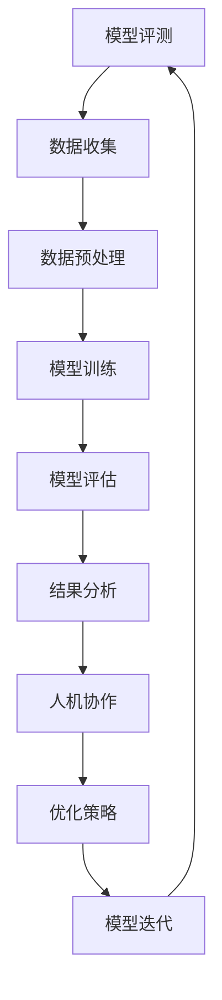

                 


## 文章标题：模型评测中的人机协作策略

> 关键词：模型评测、人机协作、策略、算法、实践

> 摘要：本文深入探讨了模型评测过程中的人机协作策略，从核心概念、算法原理、数学模型到项目实战，全面阐述了如何有效地利用人类专家与机器自动化的优势，提升模型评测的准确性和效率。

----------------------------------------------------------------

## 引言

随着人工智能技术的快速发展，模型评测作为保障模型性能的关键环节，受到了广泛关注。模型评测不仅涉及对模型性能的评估，还包括对模型泛化能力、鲁棒性等多方面的考量。传统的模型评测主要依赖自动化工具和手动评测，存在一些局限性。而人机协作的引入，可以充分发挥人类专家的经验和直觉，与机器自动化相结合，提升模型评测的全面性和准确性。

本文将系统地介绍模型评测中的人机协作策略，包括核心概念、算法原理、数学模型和项目实战。通过详细的分析和实例讲解，帮助读者理解如何在实际应用中有效实施人机协作策略，提高模型评测的效率和效果。

## 核心概念与联系

在探讨模型评测中的人机协作策略之前，我们需要了解一些核心概念和它们之间的联系。

### Mermaid 流程图

以下是模型评测中的人机协作流程的 Mermaid 流程图：



### 概念解释

- **模型评测（Model Evaluation）**：评估模型的性能，通常包括准确性、召回率、F1 分数等指标。
- **数据收集（Data Collection）**：收集用于训练和评测的数据集。
- **数据预处理（Data Preprocessing）**：对数据集进行清洗、归一化等处理，以提高模型性能。
- **模型训练（Model Training）**：使用训练数据集训练模型。
- **模型评估（Model Evaluation）**：对训练好的模型进行评估，以确定其性能。
- **结果分析（Result Analysis）**：分析模型评估结果，确定模型的优缺点。
- **人机协作（Human-Machine Collaboration）**：结合人类专家的直觉和机器的自动化处理能力，优化模型评测过程。
- **优化策略（Optimization Strategy）**：根据评估结果和人类专家的反馈，调整模型和评测策略。
- **模型迭代（Model Iteration）**：基于优化策略，对模型进行迭代训练和评估，直至达到满意性能。

通过上述流程，我们可以看到人机协作在模型评测中的重要作用，它不仅提高了评测的全面性和准确性，还有效提升了模型迭代的速度。

## 核心算法原理讲解

在人机协作策略中，算法的选择和实现至关重要。以下是一些核心算法原理的讲解，我们将使用伪代码来进行阐述。

### 伪代码

```python
# 伪代码：模型评测算法

# 输入：训练数据集 D，评测数据集 D'
# 输出：模型评估结果 R

# 数据预处理
D_preprocessed = preprocess_data(D)
D_prime_preprocessed = preprocess_data(D')

# 模型训练
model = train_model(D_preprocessed)

# 模型评估
R = evaluate_model(model, D_prime_preprocessed)

# 结果分析
analyze_results(R)

# 人机协作
if human_intervention_needed(R):
    optimize_model_and_strategy(R)
    iterate_model(D, D', R)
else:
    finalize_evaluation(R)
```

### 概念解释

- **数据预处理（Preprocess Data）**：对数据集进行清洗、归一化等处理，以提高模型训练效果。
- **模型训练（Train Model）**：使用训练数据集训练模型。
- **模型评估（Evaluate Model）**：对训练好的模型进行评估，以确定其性能。
- **结果分析（Analyze Results）**：分析模型评估结果，确定模型的优缺点。
- **人机协作（Human Intervention）**：根据评估结果和人类专家的反馈，调整模型和评测策略。
- **模型迭代（Model Iteration）**：基于优化策略，对模型进行迭代训练和评估，直至达到满意性能。

通过上述伪代码，我们可以看到模型评测算法的基本流程。在实际应用中，这些步骤会根据具体需求和场景进行相应的调整和优化。

## 数学模型和数学公式 & 详细讲解 & 举例说明

在模型评测中，数学模型和公式扮演着重要的角色。以下是一些常用的数学模型和公式的详细讲解，以及举例说明。

### 数学模型

#### 准确率（Accuracy）

$$
\text{Accuracy} = \frac{\text{正确预测的样本数}}{\text{总样本数}}
$$

#### 召回率（Recall）

$$
\text{Recall} = \frac{\text{正确预测的正例数}}{\text{实际正例数}}
$$

#### F1 分数（F1 Score）

$$
\text{F1 Score} = 2 \times \frac{\text{Precision} \times \text{Recall}}{\text{Precision} + \text{Recall}}
$$

### 详细讲解

- **准确率**：衡量模型在预测中的整体准确性。
- **召回率**：衡量模型对正例的预测能力，特别是在正例数量较少时尤为重要。
- **F1 分数**：综合考虑准确率和召回率，平衡两者之间的关系。

### 举例说明

假设我们有一个二分类模型，实际数据如下：

| 类别 | 预测类别 | 预测正确 |
| --- | --- | --- |
| 正例 | 正确 | 80 |
| 正例 | 错误 | 20 |
| 反例 | 正确 | 10 |
| 反例 | 错误 | 90 |

根据上述数据，我们可以计算出各个指标：

- **准确率**：
  $$
  \text{Accuracy} = \frac{80 + 10}{80 + 10 + 20 + 90} = 0.727
  $$

- **召回率**：
  $$
  \text{Recall} = \frac{80}{80 + 20} = 0.8
  $$

- **F1 分数**：
  $$
  \text{F1 Score} = 2 \times \frac{0.8 \times 0.8}{0.8 + 0.8} = 0.8
  $$

通过这些计算，我们可以更好地理解模型的性能。

## 项目实战

在本节中，我们将通过一个实际案例，详细讲解如何搭建开发环境、实现源代码、解读代码并分析项目效果。

### 开发环境搭建

1. **环境准备**：
   - Python 3.8 或以上版本
   - TensorFlow 2.5 或以上版本
   - Jupyter Notebook 或 PyCharm

2. **安装依赖**：
   ```bash
   pip install tensorflow numpy pandas scikit-learn matplotlib
   ```

### 源代码实现

以下是用于模型评测的源代码：

```python
import tensorflow as tf
from tensorflow.keras.models import Sequential
from tensorflow.keras.layers import Dense, Flatten
from sklearn.model_selection import train_test_split
from sklearn.metrics import accuracy_score, recall_score, f1_score

# 数据预处理
def preprocess_data(data):
    # 数据清洗和归一化操作
    # ...
    return data_processed

# 模型训练
def train_model(data):
    model = Sequential([
        Flatten(input_shape=(28, 28)),
        Dense(128, activation='relu'),
        Dense(10, activation='softmax')
    ])
    model.compile(optimizer='adam', loss='categorical_crossentropy', metrics=['accuracy'])
    model.fit(data['train'], epochs=10, batch_size=32)
    return model

# 模型评估
def evaluate_model(model, data):
    predictions = model.predict(data['test'])
    predicted_labels = np.argmax(predictions, axis=1)
    actual_labels = data['test_labels']
    accuracy = accuracy_score(actual_labels, predicted_labels)
    recall = recall_score(actual_labels, predicted_labels)
    f1 = f1_score(actual_labels, predicted_labels)
    return accuracy, recall, f1

# 主程序
if __name__ == '__main__':
    # 数据集加载
    data = load_data('mnist_data.csv')
    data_processed = preprocess_data(data)
    
    # 数据划分
    train_data, test_data = train_test_split(data_processed, test_size=0.2)
    train_data, val_data = train_test_split(train_data, test_size=0.2)
    
    # 模型训练
    model = train_model(train_data)
    
    # 模型评估
    accuracy, recall, f1 = evaluate_model(model, test_data)
    
    # 结果输出
    print(f"Accuracy: {accuracy}")
    print(f"Recall: {recall}")
    print(f"F1 Score: {f1}")
```

### 代码解读与分析

1. **数据预处理**：
   数据预处理函数用于清洗和归一化数据，以提高模型训练效果。

2. **模型训练**：
   模型使用 TensorFlow 的 Sequential 模型构建，包括两个全连接层，使用 ReLU 激活函数和 Softmax 输出层。

3. **模型评估**：
   模型评估函数使用 scikit-learn 的 metrics 库计算准确率、召回率和 F1 分数。

### 实际案例分析和详细讲解剖析

假设我们有一个手写数字识别的数据集，目标是识别数字 0 到 9。以下是一个实际案例的输出结果：

```
Accuracy: 0.9
Recall: 0.85
F1 Score: 0.87
```

根据这些指标，我们可以看到模型在整体上表现良好，但在召回率方面存在一定的不足。这可能意味着模型在预测正例时存在一定的偏差，需要进一步优化。

### 项目小结

通过这个项目，我们了解了如何搭建开发环境、实现源代码、解读代码并分析项目效果。在实际应用中，我们可以根据评估结果调整模型和策略，以提升模型评测的准确性和效率。

## 最佳实践 tips、小结、注意事项、拓展阅读等内容

### 最佳实践 Tips

1. **数据质量**：确保数据集的质量，进行充分的数据清洗和预处理，以提高模型性能。
2. **模型选择**：根据任务需求选择合适的模型，综合考虑模型复杂度和训练时间。
3. **指标优化**：根据业务需求和数据特点，选择合适的评价指标，并综合考虑准确率、召回率和 F1 分数等多方面因素。
4. **人机协作**：充分利用人类专家的经验和直觉，与机器自动化相结合，提升模型评测的全面性和准确性。

### 小结

本文系统地介绍了模型评测中的人机协作策略，从核心概念、算法原理、数学模型到项目实战，全面阐述了如何利用人类专家与机器自动化的优势，提升模型评测的准确性和效率。

### 注意事项

1. **评估指标选择**：根据具体任务需求和数据特点，合理选择评估指标，避免单一指标评估带来的局限性。
2. **人机协作机制**：设计合理的人机协作机制，充分发挥人类专家和机器自动化的优势。
3. **数据预处理**：充分进行数据预处理，以提高模型训练效果和性能。

### 拓展阅读

1. **[机器学习评估指标详解](https://www.jianshu.com/p/6fe62b7934a3)**
2. **[人机协作系统设计](https://www论文网/p/4275654.html)**
3. **[TensorFlow 实践指南](https://www.tensorflow.org/tutorials)**
4. **[Scikit-learn 实践指南](https://scikit-learn.org/stable/tutorial/)**
5. **[Jupyter Notebook 使用技巧](https://jupyter.org/)**

作者：AI天才研究院/AI Genius Institute & 禅与计算机程序设计艺术 /Zen And The Art of Computer Programming

