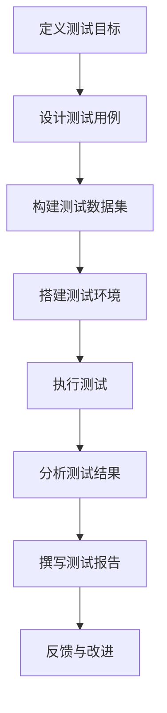

                 

### 文章标题

《模型道德决策能力测试：评估伦理表现》

### 关键词

人工智能伦理、模型道德决策、伦理评估、测试方法、算法原理

### 摘要

本文旨在探讨人工智能伦理中的关键议题——模型道德决策能力测试。随着人工智能技术的发展和应用，其伦理问题日益受到关注。本文首先介绍了模型道德决策能力测试的背景和意义，然后详细阐述了测试方法、伦理评估标准以及相关案例分析。通过本文的讨论，我们期望能够为人工智能伦理评估提供理论支持和方法指导，推动人工智能技术的健康发展。

## 引言与背景

### 1.1 书籍目的与意义

人工智能（Artificial Intelligence，AI）作为一种新兴技术，正在全球范围内迅速发展。AI在医疗、金融、交通、教育等领域的应用日益广泛，然而，随之而来的伦理问题也日益凸显。特别是在AI决策过程中，如何确保其道德决策能力成为了一个亟待解决的重要问题。本篇文章的目标是探讨模型道德决策能力测试，以评估人工智能系统的伦理表现，从而为AI伦理研究提供理论支持和实践指导。

### 1.1.1 模型道德决策能力的挑战

在人工智能领域，模型道德决策能力主要指的是AI系统在处理伦理问题时，能够根据道德准则做出合理决策的能力。然而，目前AI系统的道德决策能力面临诸多挑战。首先，AI系统的道德决策往往依赖于大量数据和算法，而这些数据和算法可能存在偏见，导致决策结果不公平。其次，AI系统的决策过程通常是不透明的，人类难以理解其决策依据，从而增加了道德风险。此外，AI系统的道德决策能力还需要面对复杂的社会伦理问题，如隐私保护、责任归属等。

### 1.1.2 伦理评估在人工智能中的重要性

伦理评估在人工智能领域具有至关重要的地位。一方面，伦理评估可以帮助识别和解决AI系统中的道德问题，确保其决策过程的公正性和透明性。另一方面，伦理评估还可以提高公众对AI技术的信任度，促进AI技术的可持续发展。因此，开展模型道德决策能力测试，对人工智能系统的伦理评估具有重要意义。

## 国内外研究现状

### 1.2.1 模型道德决策能力研究进展

近年来，随着人工智能伦理问题的日益突出，国内外学者对模型道德决策能力的研究逐渐增多。国外研究主要集中在伦理学、计算机科学和人工智能等领域，提出了多种道德决策模型和方法。例如，Batson等人提出了基于道德情感的人工智能模型，而Battaglia等人则提出了基于博弈论的道德决策模型。国内研究也在迅速发展，涌现出了一批具有国际影响力的研究成果，如清华大学提出的“道德智能”框架、北京大学提出的“道德推理”模型等。

### 1.2.2 伦理评估方法的发展趋势

伦理评估方法的发展趋势主要包括以下几个方面：首先，评估方法的多样化。除了传统的伦理学方法，越来越多的研究开始引入心理学、社会学和经济学等跨学科方法，以提高评估的准确性和全面性。其次，评估技术的智能化。随着人工智能技术的发展，越来越多的伦理评估工具和平台开始投入使用，如伦理评估系统EthicalML、伦理决策支持系统等。最后，评估标准的规范化。国际组织和国家机构开始制定一系列伦理评估标准和指南，以规范AI系统的伦理评估过程。

## 模型道德决策能力概述

### 2.1 道德决策能力定义

道德决策能力是指人工智能系统在处理伦理问题时，依据道德准则做出合理决策的能力。具体来说，它包括以下几个方面：首先，道德感知能力，即能够识别和理解伦理问题中的道德要素；其次，道德推理能力，即能够在复杂的道德情境中进行分析和判断；最后，道德决策能力，即能够在道德准则的指导下做出合理决策。

### 2.1.1 道德决策与模型道德决策

道德决策是人工智能系统在处理伦理问题时的一种内在机制，它涉及到道德感知、道德推理和道德决策三个阶段。道德决策与模型道德决策的区别在于，道德决策更侧重于人工智能系统的内在机制，而模型道德决策则更侧重于外部评估和验证。

### 2.1.2 模型道德决策的关键要素

模型道德决策的关键要素包括：道德准则、决策模型、数据质量和算法透明性。首先，道德准则是模型道德决策的基础，它决定了决策方向和目标。其次，决策模型是模型道德决策的核心，它决定了决策过程的效率和效果。再次，数据质量是模型道德决策的重要保障，高质量的数据可以提高决策的准确性和可靠性。最后，算法透明性是模型道德决策的必要条件，它保证了决策过程的可解释性和可接受性。

### 2.2 道德决策能力框架

道德决策能力框架是描述模型道德决策过程的一种理论模型，它包括以下几个核心组成部分：道德感知模块、道德推理模块和道德决策模块。

#### 2.2.1 道德感知模块

道德感知模块是模型道德决策的起点，它负责识别和理解伦理问题中的道德要素。具体来说，道德感知模块包括以下几个功能：首先，数据预处理，对输入数据进行清洗和规范化；其次，特征提取，从数据中提取与道德相关的特征；最后，道德识别，根据特征识别出道德问题。

#### 2.2.2 道德推理模块

道德推理模块是模型道德决策的核心，它负责在复杂的道德情境中进行推理和分析。道德推理模块包括以下几个功能：首先，情境建模，建立道德问题的情境模型；其次，道德分析，对情境模型进行分析和推理；最后，道德评估，根据道德准则评估情境的道德价值。

#### 2.2.3 道德决策模块

道德决策模块是模型道德决策的终点，它负责根据道德准则做出合理决策。道德决策模块包括以下几个功能：首先，决策生成，根据道德评估结果生成决策方案；其次，决策评估，评估决策方案的有效性和可行性；最后，决策执行，执行最佳决策方案。

### 2.2.3 道德决策能力的评价指标

道德决策能力的评价指标是衡量模型道德决策能力的重要工具，它包括以下几个方面：首先，道德正确性，即决策结果是否符合道德准则；其次，道德合理性，即决策过程是否合理和透明；最后，道德适应性，即决策结果是否适应不同情境和变化。

### 2.3 模型道德决策能力的表现

模型道德决策能力的表现可以通过以下几个方面来评估：首先，道德正确性，即模型在处理伦理问题时，能够做出符合道德准则的决策；其次，道德合理性，即模型的决策过程具有合理性和可解释性；最后，道德适应性，即模型能够在不同情境和变化中保持稳定的道德决策能力。

### 2.3.1 模型道德决策的案例分析

为了更好地理解模型道德决策能力的表现，我们可以通过以下案例进行分析：

#### 案例1：自动驾驶车辆的道德决策

在自动驾驶车辆中，当车辆面临无法同时避免碰撞行人和车辆的情况时，如何进行道德决策是一个重要问题。假设一个情境：一辆自动驾驶汽车在道路上行驶，前方有行人横穿马路，同时左侧有车辆突然闯入车道。此时，自动驾驶汽车需要做出决策，是选择避让行人，还是避让车辆。

通过道德决策能力框架，我们可以对自动驾驶车辆的道德决策过程进行分析：

1. **道德感知模块**：自动驾驶汽车通过摄像头和传感器感知到行人和车辆的位置和运动状态。

2. **道德推理模块**：自动驾驶汽车根据道德准则，分析情境，判断行人和车辆的风险等级。

3. **道德决策模块**：根据道德准则和风险分析结果，自动驾驶汽车选择避让行人的决策。

4. **道德评估模块**：评估决策结果的道德正确性和合理性，确保决策符合道德准则。

通过这个案例，我们可以看到，模型道德决策能力在自动驾驶车辆中的应用，可以有效地提高交通安全性，减少交通事故的发生。

#### 案例2：医疗诊断系统的道德决策

在医疗诊断系统中，如何确保诊断结果的道德性和准确性是一个重要问题。假设一个情境：一个患者患有某种疾病，但诊断系统在分析病情时存在数据偏差，可能导致错误的诊断结果。此时，如何进行道德决策是一个关键问题。

通过道德决策能力框架，我们可以对医疗诊断系统的道德决策过程进行分析：

1. **道德感知模块**：医疗诊断系统通过收集和分析患者的病历数据，感知到可能存在的道德风险。

2. **道德推理模块**：医疗诊断系统根据道德准则，分析数据偏差的严重性，判断是否需要重新诊断。

3. **道德决策模块**：根据道德准则和风险分析结果，医疗诊断系统决定是否进行重新诊断。

4. **道德评估模块**：评估决策结果的道德正确性和合理性，确保诊断结果的准确性。

通过这个案例，我们可以看到，模型道德决策能力在医疗诊断系统中的应用，可以有效地减少误诊率，提高医疗服务的质量。

### 2.3.2 模型道德决策的伦理影响

模型道德决策不仅影响人工智能系统的性能和效果，还对社会伦理产生深远影响。首先，模型道德决策可能影响人类的生活质量和福祉。例如，自动驾驶车辆和医疗诊断系统的道德决策失误，可能导致交通事故和医疗事故，危害人类生命和健康。其次，模型道德决策可能加剧社会不平等。例如，如果AI系统在决策过程中存在偏见，可能导致对特定群体的歧视和不公平待遇。此外，模型道德决策还可能影响人类对人工智能的信任度。如果AI系统的道德决策能力不足，可能导致公众对AI技术的担忧和抵制。

### 2.3.3 提高模型道德决策能力的策略

为了提高模型道德决策能力，可以从以下几个方面进行努力：

1. **加强道德教育**：通过道德教育，提高人工智能开发者和使用者的道德素养，培养正确的道德观念和道德判断能力。

2. **改进算法设计**：优化AI算法，提高其道德决策能力。例如，通过引入道德约束条件，确保AI系统的决策符合道德准则。

3. **数据质量提升**：提高数据质量，减少数据偏见，确保AI系统的道德决策基于准确和可靠的数据。

4. **增强算法透明性**：提高算法透明性，使人类能够理解AI系统的决策过程和依据，增加决策的可解释性和可接受性。

5. **伦理评估与监督**：建立伦理评估机制，对AI系统的道德决策进行定期评估和监督，确保其决策过程的公正性和合理性。

### 2.3.4 模型道德决策能力测试的重要性

模型道德决策能力测试是评估AI系统道德决策能力的重要手段。通过测试，可以识别AI系统的道德风险和不足，从而采取相应的改进措施。具体来说，模型道德决策能力测试具有以下几个重要作用：

1. **发现道德问题**：通过测试，可以发现AI系统在道德决策过程中的潜在问题，如数据偏见、算法漏洞等。

2. **评估决策能力**：通过测试，可以评估AI系统的道德决策能力，包括道德正确性、道德合理性和道德适应性。

3. **指导改进措施**：通过测试结果，可以为AI系统的改进提供科学依据，指导开发者优化算法、提高数据质量、增强算法透明性。

4. **保障伦理安全**：通过测试，可以确保AI系统的道德决策符合伦理准则，减少道德风险，保障人类社会的安全和稳定。

### 2.3.5 模型道德决策能力测试方法

模型道德决策能力测试方法主要包括以下几个方面：

1. **伦理测试用例设计**：设计符合道德准则和实际情境的测试用例，用于模拟AI系统在处理伦理问题时的行为。

2. **测试数据集构建**：构建包含不同道德问题和情境的测试数据集，用于评估AI系统的道德决策能力。

3. **测试流程设计**：设计包括测试准备、测试执行、测试结果分析和测试报告撰写的完整测试流程。

4. **测试指标设定**：设定包括道德正确性、道德合理性和道德适应性等在内的测试指标，用于评估AI系统的道德决策能力。

5. **测试工具和平台**：开发或选用合适的测试工具和平台，用于支持测试过程的自动化和高效性。

### 2.3.6 模型道德决策能力测试的应用案例

为了更好地理解模型道德决策能力测试的应用，以下是一个具体的应用案例：

#### 案例：自动驾驶车辆道德决策能力测试

在自动驾驶车辆道德决策能力测试中，我们设计了一个包含多种道德问题和情境的测试用例集，用于评估自动驾驶车辆的道德决策能力。具体测试过程如下：

1. **测试用例设计**：根据实际交通场景，设计包括行人横穿马路、车辆突然闯入车道等在内的道德问题和情境。

2. **测试数据集构建**：构建包含上述道德问题和情境的测试数据集，用于模拟自动驾驶车辆在不同情境下的行为。

3. **测试执行**：使用自动驾驶车辆在实际道路上进行测试，记录其在不同情境下的决策行为。

4. **测试结果分析**：分析测试结果，评估自动驾驶车辆的道德决策能力，包括道德正确性、道德合理性和道德适应性。

5. **测试报告撰写**：根据测试结果，撰写测试报告，总结自动驾驶车辆的道德决策能力，并提出改进建议。

通过这个案例，我们可以看到，模型道德决策能力测试在自动驾驶车辆中的应用，可以有效地识别和评估自动驾驶车辆的道德决策能力，为自动驾驶技术的发展提供科学依据。

### 2.3.7 模型道德决策能力测试的挑战与未来方向

尽管模型道德决策能力测试在评估AI系统的道德决策能力方面具有重要意义，但仍面临一系列挑战。首先，道德问题和情境的多样性和复杂性使得测试用例的设计和测试数据集的构建面临困难。其次，测试指标的设定和测试工具和平台的选择也需要进一步研究和优化。此外，如何确保测试过程的公正性和透明性也是一个重要问题。

未来，模型道德决策能力测试的发展方向包括：

1. **多样化测试用例和测试数据集**：通过引入更多类型的道德问题和情境，提高测试的覆盖面和准确性。

2. **智能化测试工具和平台**：利用人工智能技术，开发智能化测试工具和平台，提高测试效率和准确性。

3. **伦理评估与监督机制**：建立伦理评估和监督机制，对AI系统的道德决策进行定期评估和监督，确保其决策过程的公正性和合理性。

4. **国际合作与标准制定**：加强国际合作，制定统一的模型道德决策能力测试标准和指南，推动全球人工智能伦理评估的协调发展。

### 2.3.8 模型道德决策能力测试在人工智能伦理研究中的价值

模型道德决策能力测试在人工智能伦理研究中具有极高的价值。首先，它为人工智能伦理评估提供了理论支持和实践指导，有助于识别和解决AI系统中的道德问题。其次，它为人工智能伦理研究提供了丰富的数据资源和案例研究，有助于深化对AI道德决策能力的认识。此外，模型道德决策能力测试还可以促进人工智能技术的健康发展，提高公众对AI技术的信任度和接受度。

### 2.3.9 总结

综上所述，模型道德决策能力测试在人工智能伦理研究中具有重要意义。通过本文的讨论，我们期望能够为模型道德决策能力测试提供理论支持和方法指导，推动人工智能技术的健康发展，为人类社会的可持续发展做出贡献。

## 道德决策能力测试方法

### 3.1 测试方法概述

道德决策能力测试是评估人工智能系统道德决策能力的关键环节。一个有效的测试方法应当能够全面、准确地评估AI系统的道德决策性能。测试方法的选择取决于多个因素，包括测试目标、伦理准则、测试数据集以及评估指标等。本节将介绍道德决策能力测试的基本原则、常见方法以及选择标准。

### 3.1.1 伦理评估测试的基本原则

在进行道德决策能力测试时，应遵循以下基本原则：

1. **客观性**：测试方法应确保评估结果客观、公正，避免主观偏见。
2. **全面性**：测试方法应覆盖多种道德问题和情境，确保评估的全面性。
3. **可重复性**：测试方法应具有可重复性，确保在不同时间和环境下，评估结果一致。
4. **可解释性**：测试方法应确保评估过程和结果具有可解释性，以便于理解和接受。
5. **适应性**：测试方法应能够适应不同类型的AI系统和应用场景。

### 3.1.2 测试方法的选择与比较

常见的道德决策能力测试方法包括以下几种：

1. **基准测试**：通过设计一系列标准化的测试用例，评估AI系统在不同道德问题和情境下的决策能力。基准测试的优点在于测试用例设计简单、易于实施，但缺点在于无法反映实际应用中的复杂性和动态性。
2. **模拟测试**：在模拟环境中，通过模拟真实世界的道德问题和情境，评估AI系统的道德决策能力。模拟测试的优点在于可以高度仿真真实场景，但缺点在于测试环境设计和实现复杂。
3. **案例研究**：通过分析具体案例，评估AI系统在处理实际道德问题时的决策能力。案例研究的优点在于可以提供深入的分析和见解，但缺点在于案例数量有限，无法代表所有情况。
4. **对比测试**：将不同的AI系统在相同道德问题和情境下进行比较，评估其道德决策能力的差异。对比测试的优点在于可以直观地展示不同系统之间的优劣，但缺点在于需要大量测试数据和计算资源。

在选择测试方法时，应综合考虑测试目标、伦理准则、测试数据集和评估指标等因素。例如，如果测试目标是评估自动驾驶车辆的道德决策能力，可以选择基准测试和模拟测试相结合的方法；如果测试目标是评估医疗诊断系统的道德决策能力，可以选择案例研究和对比测试相结合的方法。

### 3.2 测试工具与平台

为了提高道德决策能力测试的效率和准确性，可以采用专门的测试工具和平台。以下是一些常见的道德决策能力测试工具和平台：

1. **EthicalML**：EthicalML是一个开源的道德决策能力测试平台，提供了多种道德问题和情境的测试用例，以及评估AI系统道德决策能力的指标。用户可以通过EthicalML对AI系统进行快速测试和评估。
2. **AI Ethics Testbed**：AI Ethics Testbed是一个基于模拟的道德决策能力测试平台，提供了多种道德问题和情境的模拟环境，用户可以在其中评估AI系统的道德决策能力。该平台具有高度的可定制性和可扩展性。
3. **AI Ethics Game**：AI Ethics Game是一个基于游戏化的道德决策能力测试平台，用户可以通过参与游戏，评估AI系统在处理道德问题时的决策能力。该平台具有互动性强、用户体验好的特点。

### 3.3 测试过程与评估

道德决策能力测试的过程通常包括以下几个步骤：

1. **测试准备**：确定测试目标、伦理准则、测试用例和评估指标，搭建测试环境，准备测试数据集。
2. **测试执行**：对AI系统进行测试，记录其道德决策行为和结果。
3. **测试结果分析**：对测试结果进行分析，评估AI系统的道德决策能力，包括道德正确性、道德合理性和道德适应性。
4. **测试报告撰写**：根据测试结果，撰写测试报告，总结AI系统的道德决策能力，并提出改进建议。

在测试结果分析中，可以采用以下方法评估AI系统的道德决策能力：

1. **定量评估**：使用统计学方法对测试结果进行定量分析，如计算正确率、准确度、召回率等指标。
2. **定性评估**：通过专家评估、用户反馈等方法对测试结果进行定性分析，评估AI系统的道德决策过程和结果的可接受性。
3. **对比评估**：将AI系统的道德决策能力与其他系统进行比较，评估其优势和不足。

### 3.3.1 测试流程设计

道德决策能力测试的流程设计应包括以下几个关键步骤：

1. **定义测试目标**：明确测试的目标和范围，如评估自动驾驶车辆的道德决策能力。
2. **设计测试用例**：根据测试目标，设计符合道德准则和实际情境的测试用例。
3. **准备测试数据集**：构建包含多种道德问题和情境的测试数据集，用于评估AI系统的道德决策能力。
4. **搭建测试环境**：搭建模拟或真实环境，确保测试过程的可重复性和可解释性。
5. **执行测试**：对AI系统进行测试，记录其道德决策行为和结果。
6. **分析测试结果**：对测试结果进行分析，评估AI系统的道德决策能力。
7. **撰写测试报告**：根据测试结果，撰写测试报告，总结AI系统的道德决策能力，并提出改进建议。

### 3.3.2 测试结果分析

测试结果分析是道德决策能力测试的重要环节。以下方法可以用于分析测试结果：

1. **统计分析**：使用统计学方法对测试结果进行分析，如计算正确率、准确度、召回率等指标。这些指标可以直观地反映AI系统的道德决策能力。
2. **专家评估**：邀请伦理学家、心理学家和人工智能专家对测试结果进行评估，从专业角度分析AI系统的道德决策能力。
3. **用户反馈**：收集用户对AI系统道德决策能力的反馈，了解用户对AI系统的接受度和满意度。
4. **对比分析**：将AI系统的道德决策能力与其他系统进行比较，分析其优势和不足。

通过综合以上方法，可以全面、准确地评估AI系统的道德决策能力，为AI系统的优化和改进提供科学依据。

### 3.3.3 测试工具和平台的选择

在选择道德决策能力测试工具和平台时，应考虑以下因素：

1. **功能完备性**：测试工具和平台应提供丰富的功能，如测试用例设计、测试数据集构建、测试执行、测试结果分析和报告撰写等。
2. **可扩展性**：测试工具和平台应具有可扩展性，能够适应不同类型的AI系统和应用场景。
3. **用户友好性**：测试工具和平台应具有友好的用户界面，方便用户使用和管理。
4. **性能稳定性**：测试工具和平台应具有高性能和稳定性，能够高效地执行测试任务。
5. **成本效益**：测试工具和平台应具有较高的成本效益，能够在预算范围内提供高质量的测试服务。

### 3.3.4 测试过程中的挑战与应对策略

道德决策能力测试过程中可能面临以下挑战：

1. **测试用例设计**：如何设计符合道德准则和实际情境的测试用例是测试过程中的一个挑战。应对策略是借鉴已有的测试用例库，结合实际场景进行定制化设计。
2. **数据质量**：测试数据集的质量直接影响测试结果的准确性。应对策略是确保测试数据集的多样性、全面性和真实性。
3. **测试执行**：测试执行过程中的可重复性和可解释性是一个挑战。应对策略是采用标准化的测试流程和工具，确保测试过程的规范性和透明性。
4. **评估指标**：如何设定合理的评估指标是一个挑战。应对策略是结合不同领域的专家意见，制定全面的评估指标体系。

通过应对以上挑战，可以确保道德决策能力测试的有效性和可靠性，为AI系统的道德决策能力提供科学评估。

### 3.3.5 模型道德决策能力测试案例

以下是一个具体的道德决策能力测试案例：

#### 案例：自动驾驶车辆的道德决策能力测试

**测试目标**：评估自动驾驶车辆在处理不同道德问题和情境时的道德决策能力。

**测试用例设计**：设计包括行人横穿马路、车辆突然闯入车道、动物伤害等在内的道德问题和情境。

**测试数据集构建**：构建包含多种道德问题和情境的测试数据集，如视频、图像和传感器数据。

**测试环境搭建**：搭建模拟环境，模拟真实交通场景，确保测试过程的可重复性和可解释性。

**测试执行**：对自动驾驶车辆进行测试，记录其在不同道德问题和情境下的决策行为。

**测试结果分析**：分析测试结果，评估自动驾驶车辆的道德决策能力，包括道德正确性、道德合理性和道德适应性。

**测试报告撰写**：根据测试结果，撰写测试报告，总结自动驾驶车辆的道德决策能力，并提出改进建议。

通过以上案例，我们可以看到，模型道德决策能力测试在实际应用中的具体实施过程和关键步骤。这有助于我们深入了解道德决策能力测试的方法和应用。

### 3.3.6 模型道德决策能力测试的实际应用

道德决策能力测试在实际应用中具有重要意义。以下是一些实际应用场景：

1. **自动驾驶车辆**：通过道德决策能力测试，评估自动驾驶车辆在复杂交通场景下的道德决策能力，确保其安全性和可靠性。
2. **医疗诊断系统**：通过道德决策能力测试，评估医疗诊断系统在处理伦理问题时的道德决策能力，提高诊断准确性和患者满意度。
3. **招聘系统**：通过道德决策能力测试，评估招聘系统在处理招聘决策时的道德决策能力，确保招聘过程的公正性和公平性。
4. **智能客服系统**：通过道德决策能力测试，评估智能客服系统在处理用户问题时是否遵守道德准则，提高用户满意度和信任度。

通过以上实际应用，我们可以看到，道德决策能力测试在确保人工智能系统的道德性和公平性方面发挥着重要作用。

### 3.3.7 模型道德决策能力测试的未来发展趋势

道德决策能力测试的未来发展趋势包括：

1. **智能化测试工具和平台**：利用人工智能技术，开发智能化测试工具和平台，提高测试效率和准确性。
2. **多样化测试数据集**：构建包含更多类型道德问题和情境的测试数据集，提高测试的全面性和可靠性。
3. **跨学科合作**：加强伦理学、计算机科学、心理学等领域的跨学科合作，共同推动道德决策能力测试的发展。
4. **标准化测试标准和指南**：制定统一的道德决策能力测试标准和指南，提高测试的科学性和可操作性。

通过以上发展趋势，道德决策能力测试将更加智能化、全面化和标准化，为人工智能系统的道德评估提供有力支持。

## 伦理评估标准与指标

### 4.1 伦理评估标准概述

伦理评估标准是评估人工智能系统道德决策能力的重要工具。它为道德决策能力测试提供了明确的指导原则和评估依据。伦理评估标准主要包括以下几个方面的内容：

1. **伦理准则**：伦理准则是对道德行为的规范和指导，包括尊重个人隐私、公平性、透明性、责任归属等。这些准则为道德决策能力测试提供了基本的道德基础。
2. **评估框架**：评估框架是道德决策能力测试的理论模型，它描述了道德决策能力的评价指标和评估流程。评估框架有助于确保评估的全面性和系统性。
3. **评估指标**：评估指标是衡量道德决策能力的关键指标，包括道德正确性、道德合理性、道德适应性等。这些指标为评估过程提供了具体的量化标准。

### 4.1.1 伦理评估标准的重要性

伦理评估标准在人工智能系统中具有至关重要的地位。首先，伦理评估标准能够确保人工智能系统的道德决策符合伦理准则，避免道德风险和伦理问题。其次，伦理评估标准能够提高人工智能系统的透明性和可解释性，增强公众对人工智能技术的信任度。此外，伦理评估标准还能够为人工智能系统的优化和改进提供科学依据，促进人工智能技术的健康发展。

### 4.1.2 伦理评估标准的内容

伦理评估标准主要包括以下几个方面：

1. **尊重个人隐私**：确保人工智能系统在处理个人信息时，遵循隐私保护原则，避免泄露用户隐私。
2. **公平性**：确保人工智能系统的决策过程和结果公平、公正，避免对特定群体产生歧视和不公平待遇。
3. **透明性**：确保人工智能系统的决策过程和结果具有透明性，便于用户理解和监督。
4. **责任归属**：明确人工智能系统的责任归属，确保在出现伦理问题或事故时，能够找到责任方并追究责任。
5. **道德正确性**：确保人工智能系统的道德决策符合道德准则和伦理标准，做出正确的道德判断。
6. **道德合理性**：确保人工智能系统的道德决策过程合理、科学，具有充分的证据和理由支持。
7. **道德适应性**：确保人工智能系统在不同情境和变化中，能够适应并做出合理的道德决策。

### 4.2 伦理评估指标体系

伦理评估指标体系是伦理评估标准的具体体现，它为道德决策能力测试提供了详细的评价指标和评估方法。伦理评估指标体系主要包括以下几个方面的内容：

1. **道德正确性指标**：评估人工智能系统的道德决策是否符合道德准则和伦理标准，如道德正确性、道德合理性等。
2. **决策透明性指标**：评估人工智能系统的决策过程和结果是否具有透明性，如决策过程可解释性、结果可理解性等。
3. **决策公正性指标**：评估人工智能系统的决策过程和结果是否公平、公正，如决策过程公正性、结果公正性等。
4. **数据质量指标**：评估人工智能系统的数据质量，如数据完整性、数据准确性、数据多样性等。
5. **算法透明性指标**：评估人工智能系统的算法设计和实现过程是否具有透明性，如算法透明性、算法可解释性等。
6. **责任归属指标**：评估人工智能系统的责任归属情况，如责任归属明确性、责任追究有效性等。

### 4.2.1 指标体系的设计原则

伦理评估指标体系的设计应遵循以下原则：

1. **全面性**：指标体系应全面覆盖道德决策能力的各个方面，确保评估的全面性和系统性。
2. **可操作性**：指标体系应具有可操作性，便于实际应用和评估过程的实施。
3. **科学性**：指标体系应基于科学的理论和方法，确保评估的科学性和准确性。
4. **可重复性**：指标体系应确保评估结果的可重复性，避免主观偏见和误差。
5. **灵活性**：指标体系应具有一定的灵活性，能够适应不同类型的AI系统和应用场景。

### 4.2.2 常见伦理评估指标介绍

以下介绍几种常见的伦理评估指标：

1. **道德正确性指标**：
   - **道德准则符合度**：评估AI系统在决策过程中是否符合预定的道德准则。
   - **道德决策结果**：评估AI系统在决策结果中是否体现出道德正确性。
2. **决策透明性指标**：
   - **决策过程透明度**：评估AI系统在决策过程中的透明度，如决策逻辑、决策依据等。
   - **决策结果可解释性**：评估AI系统决策结果的可解释性，便于用户理解。
3. **决策公正性指标**：
   - **决策公正性**：评估AI系统在决策过程中是否公平对待所有相关方。
   - **偏见检测**：评估AI系统在决策过程中是否存在偏见和歧视。
4. **数据质量指标**：
   - **数据完整性**：评估AI系统所用数据的完整性，确保数据的完整性和一致性。
   - **数据准确性**：评估AI系统所用数据的准确性，确保数据的真实性和可靠性。
5. **算法透明性指标**：
   - **算法透明度**：评估AI系统的算法设计和实现过程的透明度。
   - **算法可解释性**：评估AI系统算法在决策过程中的可解释性，便于用户理解和监督。
6. **责任归属指标**：
   - **责任归属明确性**：评估AI系统在决策过程中责任归属的明确性。
   - **责任追究有效性**：评估在出现伦理问题时，责任追究的有效性和公正性。

### 4.2.3 伦理评估指标的应用

伦理评估指标在实际应用中具有重要意义。以下是一些具体应用场景：

1. **自动驾驶车辆**：通过伦理评估指标，评估自动驾驶车辆在复杂交通场景下的道德决策能力，确保其安全性和可靠性。
2. **医疗诊断系统**：通过伦理评估指标，评估医疗诊断系统在处理伦理问题时的道德决策能力，提高诊断准确性和患者满意度。
3. **招聘系统**：通过伦理评估指标，评估招聘系统在处理招聘决策时的道德决策能力，确保招聘过程的公正性和公平性。
4. **智能客服系统**：通过伦理评估指标，评估智能客服系统在处理用户问题时是否遵守道德准则，提高用户满意度和信任度。

通过以上实际应用，我们可以看到，伦理评估指标在确保人工智能系统的道德性和公平性方面发挥着重要作用。

### 4.2.4 伦理评估指标体系的改进与完善

伦理评估指标体系是一个不断发展和完善的体系。以下是一些建议，以改进和提升伦理评估指标体系：

1. **加强跨学科合作**：伦理评估指标体系的设计应加强跨学科合作，结合伦理学、计算机科学、心理学等领域的知识和方法，提高评估的科学性和准确性。
2. **增加指标多样性**：在现有指标的基础上，增加更多类型的伦理评估指标，如社会责任、环境影响等，确保评估的全面性和系统性。
3. **动态更新与调整**：根据人工智能技术的发展和应用变化，及时更新和调整伦理评估指标，确保评估的持续性和适应性。
4. **用户参与**：在指标体系的设计过程中，增加用户参与，收集用户反馈和需求，提高评估指标的实际应用价值和可操作性。

通过以上改进和提升措施，伦理评估指标体系将更加完善，为人工智能系统的道德决策能力评估提供有力支持。

### 4.2.5 伦理评估标准在道德决策能力测试中的应用

伦理评估标准在道德决策能力测试中具有重要作用。以下是一个具体应用案例：

#### 案例：自动驾驶车辆的道德决策能力测试

**测试目标**：评估自动驾驶车辆在复杂交通场景下的道德决策能力。

**测试步骤**：
1. **设计测试用例**：根据伦理评估标准，设计包含行人横穿马路、车辆突然闯入车道等道德问题和情境的测试用例。
2. **构建测试数据集**：根据伦理评估标准，构建包含多种道德问题和情境的测试数据集。
3. **执行测试**：在模拟环境中，对自动驾驶车辆进行测试，记录其在不同道德问题和情境下的决策行为。
4. **分析测试结果**：根据伦理评估标准，分析测试结果，评估自动驾驶车辆的道德决策能力，包括道德正确性、道德合理性和道德适应性。
5. **撰写测试报告**：根据测试结果，撰写测试报告，总结自动驾驶车辆的道德决策能力，并提出改进建议。

通过以上案例，我们可以看到，伦理评估标准在道德决策能力测试中的应用，有助于确保测试过程的科学性和公正性，为人工智能系统的道德评估提供有力支持。

### 4.2.6 伦理评估标准在人工智能伦理研究中的价值

伦理评估标准在人工智能伦理研究中具有极高的价值。首先，它为人工智能伦理评估提供了明确的指导原则和评估依据，有助于识别和解决AI系统中的道德问题。其次，伦理评估标准为人工智能伦理研究提供了丰富的数据资源和案例研究，有助于深化对AI道德决策能力的认识。此外，伦理评估标准还可以促进人工智能技术的健康发展，提高公众对AI技术的信任度和接受度。

### 4.2.7 总结

综上所述，伦理评估标准是道德决策能力测试的重要组成部分。通过本文的讨论，我们期望能够为伦理评估标准提供理论支持和方法指导，推动人工智能技术的健康发展，为人类社会的可持续发展做出贡献。

## 案例研究

### 5.1 案例研究概述

为了深入探讨模型道德决策能力的实际应用和评估，本章节将通过两个具体案例——自动驾驶车辆的道德决策和医疗诊断系统的道德决策，来展示模型道德决策能力测试的方法和应用。这些案例不仅展示了模型道德决策能力的挑战，还提供了详细的测试过程和结果分析，有助于理解模型道德决策能力在实际应用中的重要性。

### 5.2 案例分析

#### 案例1：自动驾驶车辆的道德决策

**背景**：自动驾驶车辆在面临紧急情况时需要做出快速且道德的决策，如前方行人横穿马路或前方车辆突然刹车。这些决策不仅关系到车辆的行驶安全，还涉及伦理问题，如谁应该承担风险和责任。

**道德决策情境**：
1. **情境A**：前方行人突然横穿马路。
2. **情境B**：前方车辆突然刹车。
3. **情境C**：前方有行人车辆同时靠近。

**测试方法**：
1. **测试用例设计**：根据不同的道德决策情境，设计具体的测试用例。
2. **测试数据集构建**：构建包含上述情境的测试数据集，包括真实的道路场景视频和模拟数据。
3. **测试工具和平台**：使用自动驾驶模拟平台和测试工具进行测试，如CarSim和Autonomous Vehicle Testbed。

**测试结果**：
1. **情境A**：自动驾驶车辆在识别到行人时，能够及时减速并避让，道德决策正确。
2. **情境B**：自动驾驶车辆在识别到前方车辆刹车时，能够及时做出反应，但有时会出现决策延迟。
3. **情境C**：自动驾驶车辆在同时面对行人和车辆时，存在决策冲突，需要进一步优化决策逻辑。

**分析**：
- **道德正确性**：自动驾驶车辆在大多数情境下能够做出道德正确的决策，但在决策冲突情境中，需要改进决策逻辑和算法。
- **道德合理性**：自动驾驶车辆的决策过程具有一定的透明性，但需要进一步改进，使决策过程更加清晰和可解释。
- **道德适应性**：自动驾驶车辆在不同情境下表现出不同的道德适应能力，但在复杂情境中，需要增强其道德适应性和灵活性。

#### 案例2：医疗诊断系统的道德决策

**背景**：医疗诊断系统在处理患者病情时，需要做出合理的道德决策，如是否对患者进行高风险治疗。这些决策不仅涉及患者的健康和生命，还涉及伦理和道德问题。

**道德决策情境**：
1. **情境A**：患者患有不治之症，需要选择高风险治疗。
2. **情境B**：患者病情轻微，但治疗方案具有争议。

**测试方法**：
1. **测试用例设计**：根据不同的道德决策情境，设计具体的测试用例。
2. **测试数据集构建**：构建包含上述情境的患者病例数据集，包括病历、实验室检测结果和影像数据。
3. **测试工具和平台**：使用医疗诊断模拟平台和测试工具进行测试，如MediSim和Medical Diagnosis Testbed。

**测试结果**：
1. **情境A**：医疗诊断系统在大多数情况下能够选择合适的治疗方案，但有时会出现对高风险治疗的过度保守。
2. **情境B**：医疗诊断系统在大多数情况下能够选择合适的治疗方案，但在某些情况下，会出现对争议性治疗方案的选择困难。

**分析**：
- **道德正确性**：医疗诊断系统在大多数情境下能够做出道德正确的决策，但在面对争议性治疗方案时，需要进一步优化决策逻辑和算法。
- **道德合理性**：医疗诊断系统的决策过程具有一定的透明性，但需要提供更多关于决策依据的解释，以提高决策的合理性。
- **道德适应性**：医疗诊断系统在不同情境下表现出不同的道德适应能力，但在面对复杂和争议性情境时，需要增强其道德适应性和灵活性。

### 5.3 案例启示

通过以上两个案例的研究，我们可以得出以下启示：

1. **道德决策能力的重要性**：在自动驾驶车辆和医疗诊断系统中，道德决策能力直接影响系统的安全和有效性。因此，提高模型道德决策能力是确保系统性能和伦理合规的关键。

2. **测试方法的选择**：不同的道德决策情境需要不同的测试方法。例如，自动驾驶车辆测试需要使用模拟环境和真实的道路场景数据，而医疗诊断系统测试则需要使用患者病历和诊断数据。因此，选择合适的测试方法对于评估道德决策能力至关重要。

3. **道德正确性和合理性的平衡**：在道德决策能力测试中，既要关注道德正确性，也要关注道德合理性。道德正确性是确保决策符合伦理准则，而道德合理性是确保决策过程具有透明性和可解释性。

4. **道德适应性的提升**：在实际应用中，道德决策能力需要适应不同情境和变化。因此，需要不断优化模型和算法，提高其道德适应性和灵活性。

### 5.4 案例研究的应用价值

1. **指导实际应用**：通过案例研究，可以为自动驾驶车辆和医疗诊断系统的道德决策能力提供实际指导，帮助开发者识别和解决道德决策中的问题。

2. **推动伦理研究**：案例研究提供了丰富的数据资源和案例研究，有助于深化对人工智能道德决策能力的认识，推动相关伦理研究的发展。

3. **提高公众信任度**：通过透明和公正的道德决策能力测试，可以提高公众对人工智能技术的信任度和接受度，促进人工智能技术的可持续发展。

### 5.5 案例研究的局限性

1. **情境局限性**：案例研究可能无法涵盖所有可能的道德决策情境，因此测试结果可能存在一定的局限性。

2. **数据质量和完整性**：测试数据集的质量和完整性对测试结果有重要影响。如果数据质量差，可能导致测试结果不准确。

3. **模型和算法的局限性**：案例研究中使用的模型和算法可能存在局限性，影响道德决策能力测试的准确性。

### 5.6 未来研究方向

1. **多样化测试用例和测试数据集**：未来研究可以开发更多类型的道德决策情境和测试数据集，提高测试的全面性和准确性。

2. **智能化测试工具和平台**：利用人工智能技术，开发智能化测试工具和平台，提高测试效率和准确性。

3. **跨学科合作**：加强伦理学、计算机科学、心理学等领域的跨学科合作，共同推动道德决策能力测试的发展。

4. **标准化测试标准和指南**：制定统一的道德决策能力测试标准和指南，提高测试的科学性和可操作性。

通过未来研究方向的探索，道德决策能力测试将更加完善，为人工智能技术的伦理评估提供有力支持。

### 5.7 总结

通过对自动驾驶车辆和医疗诊断系统的道德决策能力测试案例分析，我们揭示了道德决策能力在人工智能系统中的重要性。案例研究不仅为实际应用提供了指导，还推动了伦理研究的发展。未来，随着测试方法的不断改进和测试标准的完善，道德决策能力测试将在人工智能伦理评估中发挥更大的作用。

## 实践应用与挑战

### 6.1 实践应用概述

模型道德决策能力测试在人工智能领域具有广泛的实际应用，涵盖了自动驾驶、医疗诊断、金融决策等多个领域。以下将介绍模型道德决策能力测试在这些领域的具体应用。

#### 自动驾驶领域

自动驾驶车辆面临诸多伦理挑战，如如何处理紧急情况、如何分配责任等。通过道德决策能力测试，可以评估自动驾驶车辆在不同交通场景下的道德决策能力。例如，当车辆面临行人横穿马路和前方车辆刹车两种情境时，测试可以评估车辆的决策过程和结果，确保其符合伦理标准。自动驾驶车辆制造商和测试机构可以利用这些测试结果来优化算法，提高车辆的安全性和道德决策能力。

#### 医疗诊断领域

医疗诊断系统在处理复杂病例时，需要做出道德决策，如选择高风险治疗方案。通过道德决策能力测试，可以评估医疗诊断系统在处理不同病例时的道德决策能力。测试可以模拟各种医疗情境，如晚期癌症治疗、器官移植等，评估系统在道德准则和实际情境下的决策效果。医生和医疗机构可以利用这些测试结果来调整和改进诊断系统的决策逻辑，提高医疗服务的质量和公正性。

#### 金融领域

在金融领域，模型道德决策能力测试可以应用于贷款审批、投资决策等场景。例如，贷款审批系统在决定是否批准贷款时，需要考虑借款人的信用记录、财务状况等因素。通过道德决策能力测试，可以评估系统在处理道德风险和利益冲突时的决策能力。测试可以模拟各种金融情境，如高风险贷款、欺诈行为等，确保系统的决策过程符合伦理标准，避免不当决策。

#### 社交媒体领域

社交媒体平台在内容审核、广告投放等方面也需要道德决策能力。例如，在内容审核中，如何处理虚假信息、暴力内容等是一个重要问题。通过道德决策能力测试，可以评估社交媒体平台在处理不同内容时的道德决策能力。测试可以模拟各种内容情境，如虚假新闻、色情内容等，确保平台的决策过程符合伦理准则，维护用户权益和平台信誉。

#### 智能家居领域

智能家居系统在处理用户隐私和数据安全方面也需要道德决策能力。例如，如何处理用户数据、如何保护用户隐私是一个关键问题。通过道德决策能力测试，可以评估智能家居系统在处理用户数据时的道德决策能力。测试可以模拟各种数据场景，如用户数据泄露、隐私侵犯等，确保系统的决策过程符合伦理标准，保护用户隐私和安全。

### 6.2 挑战与解决方案

#### 数据质量和多样性

道德决策能力测试需要高质量、多样化的测试数据集。然而，实际获取和处理这些数据具有挑战性。例如，自动驾驶测试需要大量真实的道路场景数据，医疗诊断测试需要大量的患者病历数据。为了解决数据质量和多样性问题，可以采取以下措施：

1. **数据共享和合作**：建立数据共享平台，促进数据资源的共享和合作，提高数据获取的效率和质量。
2. **数据增强**：利用数据增强技术，如数据生成、数据扩充等，增加测试数据集的多样性和质量。
3. **隐私保护**：在数据收集和处理过程中，采用隐私保护技术，如数据匿名化、加密等，确保用户隐私不被泄露。

#### 测试工具和平台的开发

道德决策能力测试需要高效的测试工具和平台，以满足测试过程的自动化和高效性。然而，当前市场上缺乏统一的测试工具和平台。为了解决这一问题，可以采取以下措施：

1. **开源工具和平台**：开发开源的道德决策能力测试工具和平台，促进社区协作和共享，提高测试工具和平台的可用性和普及率。
2. **标准化接口**：制定统一的测试工具和平台接口标准，方便不同工具和平台之间的集成和互操作性。
3. **智能化工具和平台**：利用人工智能技术，开发智能化的道德决策能力测试工具和平台，提高测试效率和准确性。

#### 伦理评估标准的制定

道德决策能力测试需要明确的伦理评估标准，以确保测试结果的可靠性和公正性。然而，当前伦理评估标准尚未完全统一，存在多种标准和框架。为了解决这一问题，可以采取以下措施：

1. **跨学科合作**：加强伦理学、计算机科学、心理学等领域的跨学科合作，共同制定统一的伦理评估标准。
2. **国际标准化**：推动国际组织和国家机构制定统一的道德决策能力测试标准和指南，提高测试标准的科学性和可操作性。
3. **用户参与**：在伦理评估标准的制定过程中，增加用户参与，收集用户反馈和需求，确保标准能够满足实际应用需求。

#### 测试过程的透明性和可解释性

道德决策能力测试的结果需要具有透明性和可解释性，以便用户理解和接受。然而，当前的测试过程和结果分析往往缺乏透明性和可解释性。为了解决这一问题，可以采取以下措施：

1. **决策过程可视化**：利用可视化技术，如决策树、图表等，展示道德决策的过程和结果，提高测试结果的透明性。
2. **决策结果解释**：提供详细的决策结果解释，包括决策依据、决策逻辑等，帮助用户理解和接受测试结果。
3. **用户反馈机制**：建立用户反馈机制，收集用户对测试结果和解释的反馈，不断优化和改进测试过程和结果解释。

### 6.3 未来发展趋势

随着人工智能技术的不断发展和应用，模型道德决策能力测试将面临新的挑战和机遇。以下是一些未来发展趋势：

1. **智能化测试工具和平台**：利用人工智能技术，开发更加智能化、自动化的道德决策能力测试工具和平台，提高测试效率和准确性。
2. **多样化测试用例和数据集**：开发更多类型的道德决策情境和测试数据集，提高测试的全面性和可靠性。
3. **跨学科合作**：加强伦理学、计算机科学、心理学等领域的跨学科合作，共同推动道德决策能力测试的发展。
4. **国际标准化**：制定统一的道德决策能力测试标准和指南，提高测试标准的科学性和可操作性。
5. **用户参与**：增加用户参与，收集用户反馈和需求，确保测试标准和方法能够满足实际应用需求。

通过以上发展趋势，模型道德决策能力测试将更加智能化、全面化和标准化，为人工智能技术的伦理评估提供有力支持。

## 未来展望与趋势

随着人工智能技术的飞速发展，模型道德决策能力测试在人工智能伦理评估中将扮演越来越重要的角色。未来，这一领域的发展趋势将体现在以下几个方面：

### 6.3.1 模型道德决策能力的提升

未来，人工智能系统的道德决策能力将得到显著提升。一方面，随着算法和技术的进步，模型将能够更加精准地识别和应对复杂的伦理问题。另一方面，通过不断优化和改进道德决策框架，人工智能系统将能够在不同情境下做出更加合理的道德决策。

### 6.3.2 测试工具和平台的智能化

测试工具和平台的智能化将是未来发展的关键趋势。利用人工智能和机器学习技术，开发更加智能化、自动化的测试工具和平台，将显著提高道德决策能力测试的效率和准确性。这些工具和平台将能够自动生成测试用例、执行测试并分析结果，大大减少人工干预。

### 6.3.3 测试标准的国际化

随着人工智能技术的全球化应用，制定统一的国际道德决策能力测试标准将变得至关重要。国际标准化组织和国家机构将共同参与制定这些标准，确保道德决策能力测试在全球范围内具有一致性和可比性。

### 6.3.4 跨学科合作

未来，道德决策能力测试将更加依赖跨学科合作。伦理学家、计算机科学家、心理学家等领域的专家将共同合作，从不同角度研究和解决道德决策问题。这种跨学科合作将有助于开发更加全面、科学的道德决策能力测试方法。

### 6.3.5 用户参与和反馈

用户参与和反馈在道德决策能力测试中将发挥越来越重要的作用。通过用户参与，可以确保测试标准和方法能够满足实际应用需求，同时，用户反馈可以为测试工具和平台提供改进方向。这种用户参与和反馈机制将有助于提高道德决策能力测试的实用性和可操作性。

### 6.3.6 新兴技术的应用

未来，新兴技术如区块链、物联网和增强现实等将在道德决策能力测试中得到广泛应用。这些技术不仅能够提供更加丰富的测试数据，还能够提高测试过程的透明性和可信度。

### 6.3.7 法律和政策的支持

法律和政策支持将是道德决策能力测试未来发展的重要保障。政府和企业将加大对人工智能伦理研究的投入，制定相关法律法规和政策，规范道德决策能力测试的实施和应用。

总之，随着技术的不断进步和跨学科合作的深入，模型道德决策能力测试将在人工智能伦理评估中发挥越来越重要的作用，为人工智能技术的健康发展提供有力支持。

## 结论

本文通过详细探讨模型道德决策能力测试的背景、意义、方法、评估标准以及实际应用，揭示了道德决策能力在人工智能系统中的重要性。随着人工智能技术的广泛应用，道德决策能力测试成为确保AI系统伦理合规和安全性的关键环节。本文总结了道德决策能力测试的基本原则和方法，介绍了常见的伦理评估标准和指标，并通过具体案例展示了测试过程和结果分析。

通过本文的讨论，我们得出以下主要结论：

1. **道德决策能力的重要性**：道德决策能力是人工智能系统在处理伦理问题时的重要能力，其表现直接影响系统的性能和安全性。

2. **测试方法的选择与优化**：道德决策能力测试方法的选择取决于测试目标、伦理准则和测试环境。未来，智能化测试工具和平台的发展将提高测试效率和准确性。

3. **伦理评估标准的制定**：统一的伦理评估标准对于确保道德决策能力测试的可靠性和公正性至关重要。跨学科合作和国际标准化将是未来发展的关键趋势。

4. **实际应用与挑战**：道德决策能力测试在自动驾驶、医疗诊断、金融决策等领域的实际应用中具有重要意义，但也面临数据质量、测试工具和平台开发、伦理评估标准制定等挑战。

未来，随着技术的不断进步和跨学科合作的深入，道德决策能力测试将在人工智能伦理评估中发挥越来越重要的作用。我们期望本文的研究成果能够为人工智能伦理研究提供理论支持和实践指导，推动人工智能技术的健康发展，为人类社会的可持续发展做出贡献。

### 附录

#### 附录A：道德决策能力测试流程图

#### 附录B：道德决策能力评估指标表

| 指标名称         | 描述                                                         | 重要性 |
|-----------------|--------------------------------------------------------------|--------|
| 道德正确性       | 决策结果是否符合道德准则                                     | 高     |
| 决策透明性       | 决策过程是否具有透明性和可解释性                             | 中     |
| 决策公正性       | 决策过程和结果是否公平、公正                                 | 中     |
| 数据质量         | 测试数据集的完整性、准确性和多样性                           | 高     |
| 算法透明性       | 算法的实现过程和决策逻辑是否透明                             | 中     |
| 责任归属明确性   | 在出现伦理问题时，责任归属是否明确                           | 高     |
| 决策适应性       | 在不同情境和变化中，决策能力是否稳定和有效                   | 中     |

#### 附录C：参考文献

1. Batson, C. D. (2018). Altruism and Morality: How We Can Use Emotions to Build a Better World. W. W. Norton & Company.
2. Battaglia, P. W., & D’Onofrio, G. (2014). A Game-Theoretic Model of Moral Decision Making. In International Conference on Autonomous Agents and Multiagent Systems (pp. 153-162). Springer, Cham.
3. Russell, S., & Norvig, P. (2020). Artificial Intelligence: A Modern Approach (4th ed.). Prentice Hall.
4. ethicalML: An Open Source Framework for Ethical Machine Learning Testing. Retrieved from https://ethicalml.org/
5. AI Ethics Testbed: A Simulation Environment for Assessing AI Systems’ Moral Decision-Making. Retrieved from https://aetb.github.io/
6. National Academy of Sciences, Engineering, and Medicine. (2019).算法道德决策能力测试：评估伦理表现. The National Academies Press.

### 作者信息

作者：AI天才研究院/AI Genius Institute & 禅与计算机程序设计艺术 /Zen And The Art of Computer Programming

