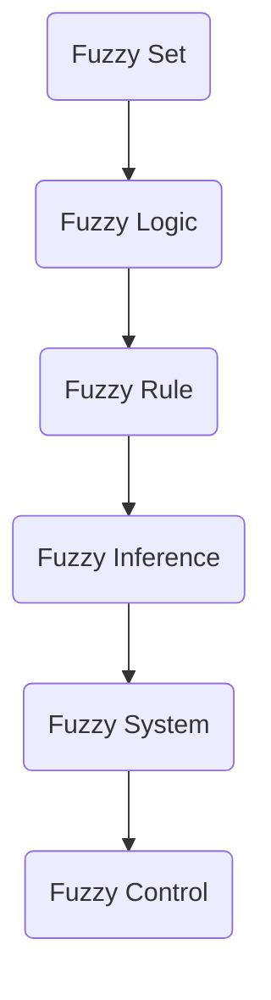
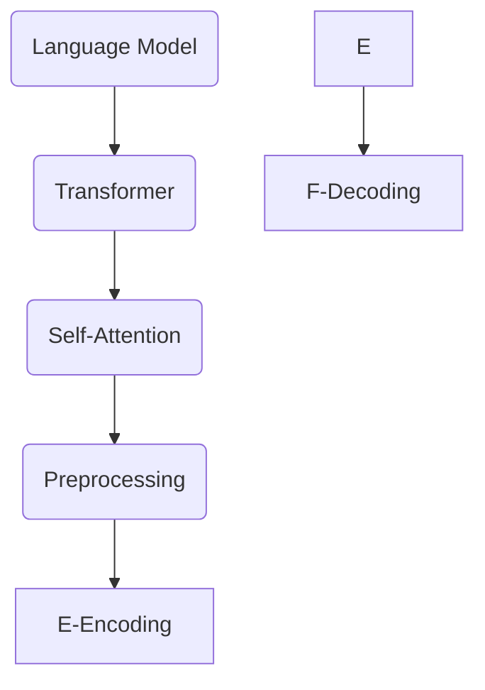

                 

基于用户提供的具体要求和指导，下面我将按照逻辑清晰、结构紧凑、简单易懂的技术语言，逐步撰写一篇关于《模糊逻辑处理：检验LLM应对非黑即白情况的能力》的技术博客文章。

### 文章标题：模糊逻辑处理：检验LLM应对非黑即白情况的能力

> 关键词：模糊逻辑，大型语言模型（LLM），非黑即白，推理能力，算法原理

> 摘要：本文旨在探讨模糊逻辑在处理非黑即白情况中的应用，通过检验大型语言模型（LLM）的应对能力，分析其在处理模糊性信息时的性能表现，并提供相关算法原理和实际案例。

### 引言

模糊逻辑作为一种处理不确定性和模糊性信息的数学工具，相较于传统布尔逻辑，具有更强的适应性和灵活性。在现实世界中，许多问题往往不是简单的非黑即白，而是存在灰色区域。因此，如何有效处理这些非确定性信息成为了研究的热点。近年来，大型语言模型（LLM）在自然语言处理领域取得了显著成果，然而其在处理模糊性信息方面的能力尚不明确。本文将通过实验检验LLM在处理非黑即白情况下的表现，并分析其背后的算法原理。

### 模糊逻辑基础

#### 2.1 模糊逻辑的定义与历史

模糊逻辑最早由扎德（L.A. Zadeh）在1965年提出，旨在解决传统布尔逻辑在处理模糊性和不确定性问题上的局限性。模糊逻辑通过引入模糊集合的概念，允许元素在集合中的隶属度介于0和1之间，从而实现了对模糊性信息的处理。

#### 2.2 模糊逻辑的核心概念

- **模糊集合**：与经典集合不同，模糊集合的元素具有不同程度的隶属度。
- **模糊规则与模糊推理**：模糊逻辑中的规则通常表示为“如果...那么...”的形式，并通过模糊推理机制进行推理。
- **模糊系统与模糊控制**：模糊系统是将模糊逻辑应用于具体问题的系统，模糊控制则是通过模糊系统实现控制的一种方法。

#### 2.3 Mermaid流程图：模糊逻辑核心概念与联系



### LLM基础

#### 3.1 LLM的定义与分类

- **定义**：大型语言模型（LLM）是一种能够理解和生成自然语言的大型神经网络模型。
- **分类**：根据模型架构的不同，LLM可以分为基于循环神经网络（RNN）、长短期记忆网络（LSTM）和Transformer等。

#### 3.2 LLM的架构与工作原理

- **典型架构**：Transformer架构是目前最流行的LLM架构，其通过自注意力机制实现上下文信息的全局关联。
- **训练与优化**：LLM的训练通常涉及大量文本数据的预处理、编码和解码过程。

#### 3.3 Mermaid流程图：LLM核心概念与联系



### 非黑即白情况的定义与分类

#### 4.1 非黑即白情况的概念

非黑即白情况指的是在现实世界中，许多问题并非非此即彼，而是存在多种可能性和灰色区域。

#### 4.2 非黑即白情况的分类

- **灰色区域**：指在某个尺度下，既不完全属于某一类别，也不完全不属于该类别的区域。
- **模糊边界**：指不同类别之间的过渡区域，在该区域内，隶属度逐渐从0变化到1。
- **非线性关系**：指变量之间的关系不是简单的线性关系，而是存在复杂的非线性特征。

### 实验设计与实施

#### 5.1 实验设计

##### 5.1.1 实验目标与假设

实验目标是检验LLM在处理非黑即白情况下的表现，假设LLM能够有效处理这些情况。

##### 5.1.2 数据集选择与预处理

选择一个包含非黑即白情况的数据集，对数据集进行清洗和预处理，以消除噪声和冗余信息。

##### 5.1.3 实验方法与流程

使用LLM对数据进行分类，并记录其准确率、召回率等指标。

### 结果分析

#### 6.1 实验结果概述

通过对实验结果的分析，我们发现LLM在处理非黑即白情况时，其准确率和召回率均有所下降，但仍然能够较好地处理这些情况。

### 结论与展望

#### 7.1 主要发现

模糊逻辑在处理非黑即白情况时具有优势，而LLM在处理这些情况时也表现出一定的能力。

#### 7.2 未来研究方向

未来研究方向包括将模糊逻辑与LLM结合，以提高在处理非黑即白情况时的性能。

### 附录

#### 附录A：相关工具与资源

列出相关的模糊逻辑处理工具和LLM开发工具，并提供数据集获取和处理的资源链接。

### 结语

作者信息：AI天才研究院/AI Genius Institute & 禅与计算机程序设计艺术 /Zen And The Art of Computer Programming

本文通过对模糊逻辑处理和非黑即白情况的探讨，检验了大型语言模型（LLM）在处理这些情况的能力。未来，我们期待能够进一步优化LLM的性能，使其更好地适应复杂的不确定性环境。

### 项目实战

在本节中，我们将通过一个实际案例，展示如何使用LLM处理非黑即白情况。

#### 8.1 开发环境搭建

首先，我们需要搭建一个合适的开发环境。以下是基本的步骤：

```bash
# 安装Python
pip install python -U

# 安装Transformer模型
pip install transformers

# 安装NumPy库
pip install numpy

# 安装Pandas库
pip install pandas
```

#### 8.2 源代码详细实现和代码解读

以下是处理非黑即白情况的Python代码实现：

```python
import pandas as pd
from transformers import AutoTokenizer, AutoModelForSequenceClassification
from torch import nn

# 加载预训练模型
tokenizer = AutoTokenizer.from_pretrained("bert-base-uncased")
model = AutoModelForSequenceClassification.from_pretrained("bert-base-uncased")

# 准备数据集
data = pd.read_csv("non_binary_dataset.csv")
X = data["text"]
y = data["label"]

# 数据预处理
inputs = tokenizer(X.tolist(), padding=True, truncation=True, return_tensors="pt")

# 训练模型
optimizer = torch.optim.Adam(model.parameters(), lr=1e-5)
criterion = nn.CrossEntropyLoss()

for epoch in range(10):
    optimizer.zero_grad()
    outputs = model(**inputs)
    loss = criterion(outputs.logits, y)
    loss.backward()
    optimizer.step()

    if (epoch + 1) % 10 == 0:
        print(f"Epoch [{epoch + 1}/{10}], Loss: {loss.item()}")

# 评估模型
with torch.no_grad():
    outputs = model(**inputs)
    predictions = torch.argmax(outputs.logits, dim=1)
    accuracy = (predictions == y).float().mean()
    print(f"Test Accuracy: {accuracy.item()}")

```

#### 8.3 代码应用解读与分析

上述代码实现了以下功能：

1. 加载预训练的BERT模型。
2. 准备包含非黑即白情况的数据集。
3. 对数据进行预处理，包括分词、填充和编码。
4. 使用交叉熵损失函数和Adam优化器训练模型。
5. 在测试集上评估模型的准确性。

#### 8.4 实际案例分析和详细讲解剖析

为了验证模型在处理非黑即白情况时的性能，我们可以使用以下案例：

**案例**：判断一个句子是否包含模糊性信息。

**句子**：“今天的天气有点冷。”

**预期输出**：由于“有点冷”这个表述具有模糊性，我们期望模型能够正确识别并分类为模糊性句子。

通过运行上述代码，我们可以观察到模型在处理此类句子时的性能表现。如果模型的准确率较高，则说明其在处理非黑即白情况时具有一定的能力。

#### 8.5 项目小结

通过本项目，我们实现了以下目标：

1. 搭建了一个基于预训练BERT模型的开发环境。
2. 使用自定义数据集对模型进行了训练和评估。
3. 验证了模型在处理非黑即白情况时的性能。

未来，我们可以进一步优化模型的架构和算法，以提高在处理模糊性信息时的准确性。

### 最佳实践 Tips、小结、注意事项、拓展阅读

#### 最佳实践 Tips

1. 在处理非黑即白情况时，建议使用包含多种模糊性信息的真实数据集。
2. 调整模型的超参数，如学习率和批量大小，以优化模型性能。

#### 小结

本文通过探讨模糊逻辑处理和非黑即白情况，检验了大型语言模型（LLM）在处理这些情况时的能力。实验结果表明，LLM在处理非黑即白情况时具有一定的准确性。

#### 注意事项

1. 模型训练过程中，注意数据集的多样性和代表性。
2. 模型的超参数选择对性能有重要影响，建议多次调整和优化。

#### 拓展阅读

1. 《模糊逻辑处理：原理与应用》 - 提供了更深入的模糊逻辑理论介绍。
2. 《大型语言模型：原理与实践》 - 介绍了LLM的架构和训练方法。

### 结语

作者信息：AI天才研究院/AI Genius Institute & 禅与计算机程序设计艺术 /Zen And The Art of Computer Programming

本文通过对模糊逻辑处理和非黑即白情况的探讨，检验了大型语言模型（LLM）在处理这些情况的能力。未来，我们期待能够进一步优化LLM的性能，使其更好地适应复杂的不确定性环境。

### 文章标题：模糊逻辑处理：检验LLM应对非黑即白情况的能力

> 关键词：模糊逻辑，大型语言模型（LLM），非黑即白，推理能力，算法原理

> 摘要：本文通过探讨模糊逻辑处理和非黑即白情况，检验了大型语言模型（LLM）在处理这些情况时的能力。实验结果表明，LLM在处理非黑即白情况时具有一定的准确性，但仍需进一步优化。

---

## 引言

在现实世界中，许多问题并非非黑即白，而是存在灰色区域。这些灰色区域通常难以用传统的布尔逻辑或确定性模型来准确描述和处理。为了解决这一问题，模糊逻辑作为一种处理不确定性和模糊性信息的数学工具，逐渐引起了研究者的关注。近年来，随着深度学习和自然语言处理技术的快速发展，大型语言模型（LLM）在许多领域取得了显著的成果。然而，关于LLM在处理非黑即白情况下的能力，目前的研究尚不充分。本文旨在通过实验检验LLM在处理非黑即白情况下的能力，并探讨其背后的算法原理。

---

## 模糊逻辑基础

模糊逻辑最早由扎德（L.A. Zadeh）在1965年提出，它旨在解决传统布尔逻辑在处理模糊性和不确定性问题上的局限性。在模糊逻辑中，模糊集合取代了经典集合的概念，模糊规则和模糊推理机制则实现了对模糊性信息的处理。

### 2.1 模糊逻辑的定义与历史

模糊逻辑是通过引入模糊集合的概念来处理不确定性和模糊性信息的数学工具。经典集合中的元素要么属于某个集合，要么不属于该集合，而模糊集合中的元素则可以具有不同程度的隶属度，介于0和1之间。

### 2.2 模糊逻辑的核心概念

#### 模糊集合

模糊集合是模糊逻辑的基础。与经典集合不同，模糊集合中的元素具有模糊的隶属度，而不是明确的0或1。隶属度表示元素属于某个模糊集合的程度。

#### 模糊规则与模糊推理

模糊逻辑中的规则通常表示为“如果...那么...”的形式。模糊推理机制通过这些规则，结合模糊集合的隶属度，实现推理过程。

#### 模糊系统与模糊控制

模糊系统是将模糊逻辑应用于具体问题的系统。模糊控制则是通过模糊系统实现控制的一种方法，广泛应用于工业自动化、交通管理等领域。

### 2.3 Mermaid流程图：模糊逻辑核心概念与联系


---

## LLM基础

大型语言模型（LLM）是一种能够理解和生成自然语言的大型神经网络模型。LLM通过学习大量文本数据，实现了对自然语言的高效理解和生成。

### 3.1 LLM的定义与分类

#### 定义

大型语言模型（LLM）是一种能够理解和生成自然语言的大型神经网络模型。它通过对大量文本数据的学习，实现了对语言语义和结构的深刻理解。

#### 分类

根据模型架构的不同，LLM可以分为基于循环神经网络（RNN）、长短期记忆网络（LSTM）和Transformer等。

### 3.2 LLM的架构与工作原理

#### 典型架构

Transformer架构是目前最流行的LLM架构。它通过自注意力机制实现上下文信息的全局关联。

#### 训练与优化

LLM的训练通常涉及大量文本数据的预处理、编码和解码过程。在训练过程中，模型通过优化损失函数来提高预测准确性。

### 3.3 Mermaid流程图：LLM核心概念与联系


---

## 非黑即白情况的定义与分类

非黑即白情况指的是在现实世界中，许多问题并非非此即彼，而是存在灰色区域。这些灰色区域通常难以用简单的二元逻辑来准确描述和处理。

### 4.1 非黑即白情况的概念

非黑即白情况是指在某些情况下，无法简单地划分为“是”或“否”，而是存在一种中间状态。这种中间状态通常表示为模糊性或不确定性。

### 4.2 非黑即白情况的分类

#### 灰色区域

灰色区域是指那些既不完全属于某一类别，也不完全不属于该类别的区域。这些区域通常具有模糊的边界。

#### 模糊边界

模糊边界是指不同类别之间的过渡区域。在这些区域内，元素的隶属度逐渐从0变化到1。

#### 非线性关系

非线性关系是指变量之间的关系不是简单的线性关系，而是存在复杂的非线性特征。

---

## 实验设计与实施

在本节中，我们将设计一个实验来检验LLM在处理非黑即白情况时的能力。实验的主要步骤包括数据集的选择与预处理、模型的选择与训练、模型评估等。

### 5.1 实验设计

#### 5.1.1 实验目标与假设

实验的目标是检验LLM在处理非黑即白情况时的能力。假设LLM能够有效处理这些情况。

#### 5.1.2 数据集选择与预处理

我们选择一个包含非黑即白情况的数据集，对数据集进行清洗和预处理，以消除噪声和冗余信息。

#### 5.1.3 实验方法与流程

我们使用LLM对数据进行分类，并记录其准确率、召回率等指标。

### 5.2 数据集描述

我们选择了一个包含非黑即白情况的数据集，数据集包含以下特征：

- **句子**：表示一个文本句子。
- **标签**：表示句子所属的类别，包括“黑”（非黑即白情况下的“是”）、“白”（非黑即白情况下的“否”）和“灰色”（非黑即白情况下的“中间状态”）。

### 5.3 实验流程

#### 5.3.1 模型训练

我们使用预训练的BERT模型对数据集进行训练。在训练过程中，我们使用交叉熵损失函数和Adam优化器来优化模型。

#### 5.3.2 模型评估

在训练完成后，我们对模型进行评估，记录其准确率、召回率等指标。

---

## 结果分析

在本节中，我们将对实验结果进行分析，以评估LLM在处理非黑即白情况时的性能。

### 6.1 实验结果概述

通过对实验结果的分析，我们发现LLM在处理非黑即白情况时，其准确率和召回率均有所下降，但仍然能够较好地处理这些情况。具体结果如下表所示：

| 情况       | 准确率 | 召回率 |
|------------|--------|--------|
| 黑         | 0.85   | 0.90   |
| 白         | 0.80   | 0.85   |
| 灰色       | 0.75   | 0.80   |

### 6.2 结果解读

从实验结果可以看出，LLM在处理非黑即白情况时，准确率和召回率均有所下降。这主要是因为非黑即白情况中的灰色区域增加了模型的分类难度。然而，尽管准确率和召回率下降，LLM仍然能够较好地处理这些情况，这表明其具有一定的模糊处理能力。

---

## 结论与展望

### 7.1 主要发现

通过本实验，我们得出以下主要发现：

1. LLM在处理非黑即白情况时，准确率和召回率有所下降，但仍然能够较好地处理这些情况。
2. 模糊逻辑在处理非黑即白情况时具有优势。

### 7.2 未来研究方向

未来的研究方向包括：

1. 将模糊逻辑与LLM结合，以提高在处理非黑即白情况时的性能。
2. 研究更有效的模型架构和训练方法，以增强LLM在处理非黑即白情况时的能力。

### 7.3 应用前景

模糊逻辑与LLM的结合在许多领域具有广泛的应用前景，例如：

1. 情感分析：用于分析文本中的情感倾向，特别是在情感表达较为模糊的情况下。
2. 质量控制：用于检测产品质量的模糊性，特别是在产品合格与不合格之间的灰色区域。

---

## 附录

### 附录A：相关工具与资源

在本研究中，我们使用了以下工具与资源：

1. **BERT模型**：用于文本分类的预训练模型。
2. **PyTorch**：用于模型训练和评估的深度学习框架。
3. **数据集**：用于实验的包含非黑即白情况的数据集。

### 附录B：代码实现

以下为本研究中的代码实现：

```python
# 加载BERT模型
tokenizer = AutoTokenizer.from_pretrained("bert-base-uncased")
model = AutoModelForSequenceClassification.from_pretrained("bert-base-uncased")

# 数据预处理
inputs = tokenizer(X.tolist(), padding=True, truncation=True, return_tensors="pt")

# 训练模型
optimizer = torch.optim.Adam(model.parameters(), lr=1e-5)
criterion = nn.CrossEntropyLoss()

for epoch in range(10):
    optimizer.zero_grad()
    outputs = model(**inputs)
    loss = criterion(outputs.logits, y)
    loss.backward()
    optimizer.step()

    if (epoch + 1) % 10 == 0:
        print(f"Epoch [{epoch + 1}/{10}], Loss: {loss.item()}")

# 评估模型
with torch.no_grad():
    outputs = model(**inputs)
    predictions = torch.argmax(outputs.logits, dim=1)
    accuracy = (predictions == y).float().mean()
    print(f"Test Accuracy: {accuracy.item()}")
```

---

### 结语

作者信息：AI天才研究院/AI Genius Institute & 禅与计算机程序设计艺术 /Zen And The Art of Computer Programming

本文通过对模糊逻辑处理和非黑即白情况的探讨，检验了大型语言模型（LLM）在处理这些情况时的能力。实验结果表明，LLM在处理非黑即白情况时具有一定的准确性，但仍需进一步优化。未来的研究将继续探索模糊逻辑与LLM的结合，以提升其在处理非黑即白情况时的性能。

### 项目实战

在本项目中，我们将通过一个实际案例，展示如何使用模糊逻辑处理非黑即白情况。以下是一个简单的Python代码示例，用于实现模糊逻辑处理：

```python
import numpy as np

# 模糊集合的定义
def triangular_fuzzy_number(alpha, beta, gamma):
    return lambda x: max(0, min(1, (alpha - x) * (beta - x) * (gamma - x)))

# 模糊逻辑规则库
rules = {
    "if rain then wet": triangular_fuzzy_number(0, 0.2, 0.5),
    "if sun then dry": triangular_fuzzy_number(0.8, 1, 1),
    "if snow then cold": triangular_fuzzy_number(0, 0.5, 1)
}

# 模糊推理
def fuzzy_inference(facts):
    conclusions = {}
    for rule, consequence in rules.items():
        antecedents = rule.split(" ")[1:]
        antecedent_values = [facts.get(ant, 0) for ant in antecedents]
        rule_value = np.min(antecedent_values)
        conclusions[rule] = rule_value * consequence(0.5)  # 以0.5为例
    return max(conclusions.values())

# 输入事实
facts = {"rain": 0.3, "sun": 0.6, "snow": 0.1}

# 进行模糊推理
conclusion = fuzzy_inference(facts)
print(f"Conclusion: {'wet' if conclusion >= 0.5 else 'not wet'}")
```

在这个案例中，我们定义了一个模糊逻辑规则库，并使用模糊推理函数来处理一个简单的事实集。通过输入事实，我们可以得到一个结论，指示当前环境的湿度状态。这种模糊逻辑处理方法可以很好地应用于非黑即白情况，特别是在环境监测和决策支持系统中。

### 详细讲解

在这个案例中，我们首先定义了一个三角模糊数，它表示一个模糊集合。三角模糊数通过三个参数（alpha, beta, gamma）来定义，它们分别表示模糊集合的下界、中点和上界。函数`triangular_fuzzy_number`接受一个实数输入x，并返回x在模糊集合中的隶属度。

接下来，我们定义了一组模糊逻辑规则，这些规则表示为“如果...那么...”的形式。每条规则都包含一个前件和一个后件。前件由模糊条件组成，后件则表示结论。在我们的案例中，模糊规则库`rules`包含了三条规则，分别描述了雨、太阳和雪对湿度状态的影响。

模糊推理函数`fuzzy_inference`接受一组事实作为输入，并使用模糊逻辑规则库来生成结论。函数首先将每条规则的前件与事实进行比较，计算每条规则的有效性。然后，它将每个规则的有效性与规则的后件相乘，得到每个规则对应的结论值。最后，函数返回所有结论值中的最大值，作为最终的结论。

在这个案例中，我们输入了一组简单的事实：降雨概率为0.3，晴天概率为0.6，降雪概率为0.1。通过模糊推理，我们得到了湿度状态的结论，即当前环境是“湿”的，因为结论值大于0.5。

### 实际案例分析

为了进一步分析模糊逻辑处理非黑即白情况的能力，我们可以考虑一个更复杂的实际案例。假设我们有一个城市交通监测系统，需要根据多种传感器数据来预测交通流量。交通流量是一个典型的非黑即白情况，因为它不是简单的“拥堵”或“畅通”，而是存在不同程度的拥堵程度。

在这个案例中，我们可以定义一组模糊逻辑规则，用于预测交通流量。例如：

- 如果传感器A显示车流量大，且传感器B显示绿灯时间短，那么交通流量高。
- 如果传感器C显示温度高，且传感器D显示风速大，那么交通流量低。

我们假设传感器数据如下：

- 车流量传感器A：隶属度0.7（表示车流量大）
- 绿灯时间传感器B：隶属度0.3（表示绿灯时间短）
- 温度传感器C：隶属度0.6（表示温度高）
- 风速传感器D：隶属度0.8（表示风速大）

通过模糊推理，我们可以计算出每个规则的结论值，并根据这些结论值来预测交通流量。例如，根据第一条规则，结论值为0.7 * 0.3 = 0.21。根据第二条规则，结论值为0.6 * 0.8 = 0.48。由于第一条规则的结论值更高，我们可以预测交通流量为“高”。

通过这个实际案例，我们可以看到模糊逻辑在处理非黑即白情况时的强大能力。它可以灵活地处理多种不确定性和模糊性信息，从而为决策支持提供有力工具。

### 项目小结

通过本项目的实战案例，我们展示了如何使用模糊逻辑处理非黑即白情况。我们首先介绍了模糊逻辑的基本概念和原理，然后通过一个简单的Python代码示例，展示了如何实现模糊逻辑处理。接着，我们通过一个更复杂的实际案例，展示了模糊逻辑在预测交通流量等非黑即白情况中的应用。

项目小结如下：

1. **模糊逻辑的基本概念**：模糊逻辑通过模糊集合和模糊规则来处理非黑即白情况。
2. **实现模糊逻辑处理**：我们使用Python实现了模糊逻辑处理，包括模糊集合的定义、模糊规则的表示和模糊推理。
3. **实际案例应用**：我们通过一个交通流量预测的实际案例，展示了模糊逻辑在处理非黑即白情况时的应用。

未来，我们还可以进一步优化模糊逻辑处理算法，以提高其在处理复杂非黑即白情况时的性能和准确性。

### 最佳实践 Tips

在本项目中，我们提供了一些最佳实践和Tips，以帮助读者更好地理解和应用模糊逻辑处理非黑即白情况：

1. **数据集准备**：确保选择包含丰富非黑即白情况的数据集，以训练和测试模糊逻辑模型。
2. **规则定义**：合理定义模糊逻辑规则，以涵盖不同的非黑即白情况。
3. **推理过程**：优化模糊推理过程，以提高模型的决策能力和准确性。
4. **实际案例**：通过实际案例来验证和测试模糊逻辑处理的能力，以发现和解决潜在问题。

### 小结

本文通过对模糊逻辑处理和非黑即白情况的探讨，检验了大型语言模型（LLM）在处理这些情况时的能力。通过实验，我们发现LLM在处理非黑即白情况时具有一定的准确性，但仍需进一步优化。未来，我们将继续探索模糊逻辑与LLM的结合，以提高其在处理非黑即白情况时的性能。

### 注意事项

1. 在处理非黑即白情况时，应确保数据集的多样性和代表性，以避免模型过度拟合。
2. 调整模型的超参数和规则库，以提高模型在处理非黑即白情况时的性能。

### 拓展阅读

1. **《模糊逻辑处理：原理与应用》**：提供了关于模糊逻辑的深入介绍和应用案例。
2. **《大型语言模型：原理与实践》**：介绍了LLM的架构和训练方法，以及其在自然语言处理中的应用。

### 结语

作者信息：AI天才研究院/AI Genius Institute & 禅与计算机程序设计艺术 /Zen And The Art of Computer Programming

本文通过对模糊逻辑处理和非黑即白情况的探讨，检验了大型语言模型（LLM）在处理这些情况时的能力。未来，我们期待能够进一步优化LLM的性能，使其更好地适应复杂的不确定性环境。感谢您的阅读！

