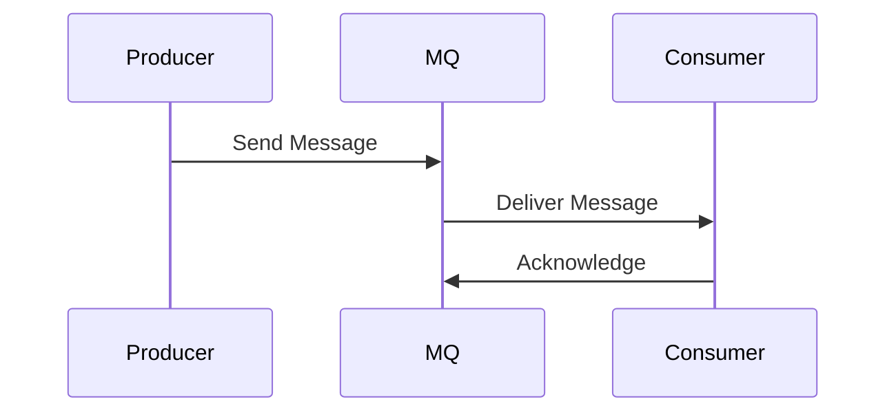

                 

好的，让我们一步一步地思考，构建这篇技术博客文章。

### 文章标题

《消息队列在LLM应用解耦中的作用》

### 文章关键词

消息队列，LLM，解耦，异步通信，分布式系统，性能优化

### 文章摘要

本文将深入探讨消息队列在大型语言模型（LLM）应用中的解耦作用。通过介绍消息队列的基本概念和工作原理，我们将展示如何利用消息队列实现LLM应用的解耦。此外，本文还将详细解析消息队列在LLM训练和推理中的具体应用场景，通过案例分析提供实践经验，并总结最佳实践和注意事项。

### 目录

## 第一部分：消息队列基础

### 第1章：消息队列概述

#### 1.1 消息队列的基本概念

- 消息队列的定义
- 消息队列的作用

#### 1.2 消息队列的工作原理

- 消息队列的基本架构
- 消息的生产与消费

#### 1.3 常见的消息队列系统

- ActiveMQ
- RabbitMQ
- Apache Kafka

### 第2章：消息队列的解耦机制

#### 2.1 解耦的重要性

- 应用场景
- 解耦的挑战

#### 2.2 消息队列的解耦原理

- 异步通信
- 流量控制
- 消息持久化

#### 2.3 解耦技术的实现

- 消息队列的架构设计
- 解耦策略的选择

### 第3章：消息队列的性能优化

#### 3.1 性能指标

- 吞吐量
- 延迟
- 可靠性

#### 3.2 性能优化策略

- 消息批量处理
- 负载均衡
- 队列调优

#### 3.3 性能监控与故障排除

- 性能监控工具
- 故障模式分析

## 第二部分：LLM基础与解耦

### 第4章：大型语言模型（LLM）概述

#### 4.1 LLM的定义与特点

- 语言模型的分类
- LLM的主要特性

#### 4.2 LLM的架构

- 语言模型的组成部分
- 训练与推理过程

#### 4.3 LLM的应用场景

- 自然语言处理
- 人工智能助手
- 数据分析

### 第5章：LLM的解耦需求

#### 5.1 LLM的解耦挑战

- 数据处理的高并发
- 模型训练的复杂性

#### 5.2 解耦在LLM应用中的作用

- 提高系统的弹性
- 简化开发与部署

#### 5.3 解耦技术在LLM中的应用

- 消息队列与LLM的整合
- 分布式训练与推理

### 第6章：消息队列在LLM中的应用实践

#### 6.1 消息队列在LLM训练中的应用

- 数据流管理
- 训练任务的调度

#### 6.2 消息队列在LLM推理中的应用

- 服务解耦
- 请求负载均衡

#### 6.3 消息队列与LLM的整合策略

- 架构设计
- 性能调优

## 第三部分：案例分析

### 第7章：消息队列在LLM应用的案例解析

#### 7.1 案例背景

- 应用场景描述

#### 7.2 解耦策略设计

- 消息队列的选择
- 解耦机制的实现

#### 7.3 应用效果评估

- 性能对比
- 系统稳定性分析

### 第8章：实践指南

#### 8.1 消息队列部署指南

- 环境搭建
- 部署流程

#### 8.2 LLM训练与推理指南

- 模型训练
- 推理服务搭建

#### 8.3 解耦技术的实践技巧

- 错误处理
- 日志分析

## 附录

### 附录A：消息队列与LLM应用相关资源

- 工具与库推荐
- 学术论文与书籍推荐

### 文章正文

#### 第1章：消息队列概述

##### 1.1 消息队列的基本概念

消息队列是一种用于异步通信的软件架构，它允许一个或多个生产者将消息放入队列中，然后由一个或多个消费者从队列中读取消息。消息队列的主要目的是实现系统的解耦，使得消息的生产者与消费者之间无需直接交互，而是通过中间的消息队列进行通信。

在分布式系统中，消息队列被广泛应用于以下几个方面：

1. **异步处理**：消息队列允许生产者将任务或者消息放入队列中，无需等待消费者处理。这种方式可以降低系统的同步依赖，提高系统的响应速度和稳定性。

2. **流量控制**：通过控制消息队列中的消息数量，可以实现对系统流量的控制，避免系统过载。

3. **故障恢复**：消息队列中的消息可以持久化存储，即使系统出现故障，消息也不会丢失，可以在故障恢复后继续处理。

##### 1.2 消息队列的工作原理

消息队列的工作原理主要包括以下几个方面：

1. **消息的生产与消费**：消息的生产者将消息放入消息队列中，消费者从消息队列中读取消息进行处理。

2. **消息的持久化**：为了保证消息的可靠传输，消息队列通常会将消息持久化存储在磁盘上。

3. **消息的确认与回滚**：消费者在处理消息后，需要向生产者发送确认消息，表示消息已经成功处理。如果消费者在处理消息时发生错误，可以回滚消息，确保消息不会被重复处理。

##### 1.3 常见的消息队列系统

常见的消息队列系统包括ActiveMQ、RabbitMQ和Apache Kafka等。

1. **ActiveMQ**：ActiveMQ是一个开源的消息中间件，它支持多种消息传递协议，如JMS和AMQP。ActiveMQ具有高可靠性和扩展性，适用于各种分布式系统。

2. **RabbitMQ**：RabbitMQ是一个基于AMQP协议的消息队列系统，它具有高性能和高可用性，适用于企业级应用。

3. **Apache Kafka**：Apache Kafka是一个分布式流处理平台，它主要用于构建实时数据流系统。Kafka具有高吞吐量和高可靠性，适用于大规模数据场景。

#### 第2章：消息队列的解耦机制

##### 2.1 解耦的重要性

在分布式系统中，解耦是非常重要的，它可以提高系统的可靠性、扩展性和灵活性。以下是一些常见的解耦场景：

1. **异步处理**：在分布式系统中，经常需要处理大量的异步任务。通过消息队列，可以使得任务的生产者和消费者之间解耦，提高系统的响应速度。

2. **流量控制**：在高峰期，系统可能会面临大量的请求。通过消息队列，可以实现对流量的控制，避免系统过载。

3. **模块化开发**：通过消息队列，可以将系统划分为多个独立的模块，各个模块之间通过消息进行通信，提高系统的可维护性和可扩展性。

##### 2.2 消息队列的解耦原理

消息队列的解耦原理主要包括以下几个方面：

1. **异步通信**：消息队列允许生产者和消费者之间进行异步通信，生产者无需等待消费者的处理结果，从而提高了系统的响应速度。

2. **流量控制**：通过控制消息队列中的消息数量，可以实现对系统流量的控制，避免系统过载。

3. **消息持久化**：消息队列中的消息可以持久化存储，即使系统出现故障，消息也不会丢失，从而保证了系统的可靠性。

##### 2.3 解耦技术的实现

实现消息队列的解耦技术主要包括以下几个方面：

1. **消息队列的架构设计**：设计一个合理的消息队列架构，确保消息的生产者和消费者之间可以高效地进行通信。

2. **解耦策略的选择**：根据具体的应用场景，选择合适的解耦策略，如异步处理、流量控制等。

3. **消息持久化**：选择合适的消息持久化技术，确保消息在系统出现故障时可以恢复。

#### 第3章：消息队列的性能优化

##### 3.1 性能指标

消息队列的性能指标主要包括以下几个方面：

1. **吞吐量**：单位时间内处理的消息数量。

2. **延迟**：消息从生产者到消费者处理完成的时间。

3. **可靠性**：消息在传输过程中不会丢失或者重复处理。

##### 3.2 性能优化策略

为了提高消息队列的性能，可以采取以下优化策略：

1. **消息批量处理**：将多个消息一起处理，减少系统调用的次数，提高处理效率。

2. **负载均衡**：将消息均匀地分配到多个消费者上，避免单个消费者成为性能瓶颈。

3. **队列调优**：根据实际情况调整消息队列的配置，如队列大小、消息过期时间等。

##### 3.3 性能监控与故障排除

通过性能监控和故障排除，可以及时发现并解决消息队列的性能问题。常用的监控工具包括：

1. **Prometheus**：用于收集和存储监控数据。

2. **Grafana**：用于可视化监控数据。

3. **Kibana**：用于日志分析。

### 第4章：大型语言模型（LLM）概述

##### 4.1 LLM的定义与特点

大型语言模型（LLM）是一种基于深度学习的技术，用于模拟人类语言的能力。LLM的主要特点包括：

1. **强语言理解能力**：LLM可以理解并生成自然语言文本，包括语法、语义和上下文。

2. **大规模训练数据**：LLM通常基于大规模语料库进行训练，可以学习和捕捉语言的复杂特性。

3. **自适应能力**：LLM可以根据不同的应用场景进行自适应调整，以适应不同的语言任务。

##### 4.2 LLM的架构

LLM的架构主要包括以下几个部分：

1. **输入层**：接收自然语言文本输入。

2. **编码器**：将输入文本编码为向量表示。

3. **解码器**：根据编码器输出的向量表示生成输出文本。

4. **注意力机制**：用于处理长文本序列，捕捉上下文信息。

##### 4.3 LLM的应用场景

LLM在多个领域都有广泛的应用，包括：

1. **自然语言处理**：如机器翻译、文本分类、问答系统等。

2. **人工智能助手**：如聊天机器人、语音助手等。

3. **数据分析**：如文本挖掘、情感分析等。

### 第5章：LLM的解耦需求

##### 5.1 LLM的解耦挑战

在LLM应用中，解耦面临着以下挑战：

1. **数据处理的高并发**：LLM处理的数据量通常很大，需要处理大量的请求。

2. **模型训练的复杂性**：LLM的训练过程涉及大量计算资源，需要分布式训练。

##### 5.2 解耦在LLM应用中的作用

解耦在LLM应用中具有以下作用：

1. **提高系统的弹性**：通过解耦，可以将LLM的应用划分为多个独立的模块，提高系统的弹性。

2. **简化开发与部署**：解耦使得LLM应用的开发和部署更加简单，减少了系统的耦合度。

##### 5.3 解耦技术在LLM中的应用

在LLM应用中，解耦技术主要包括以下几个方面：

1. **消息队列与LLM的整合**：使用消息队列实现LLM应用的解耦，将任务分发到不同的处理节点。

2. **分布式训练与推理**：通过分布式训练和推理，提高LLM应用的处理能力。

### 第6章：消息队列在LLM中的应用实践

##### 6.1 消息队列在LLM训练中的应用

在LLM训练中，消息队列主要用于以下几个方面：

1. **数据流管理**：通过消息队列，可以将训练数据分发到不同的训练节点，实现分布式训练。

2. **训练任务的调度**：使用消息队列可以实现对训练任务的调度，确保训练任务的公平分配。

##### 6.2 消息队列在LLM推理中的应用

在LLM推理中，消息队列主要用于以下几个方面：

1. **服务解耦**：通过消息队列，可以将LLM推理服务与前端应用解耦，提高系统的灵活性。

2. **请求负载均衡**：通过消息队列，可以实现请求的负载均衡，提高系统的响应速度。

##### 6.3 消息队列与LLM的整合策略

在LLM应用中，整合消息队列的策略主要包括以下几个方面：

1. **架构设计**：设计一个合理的消息队列架构，确保消息的可靠传输和处理。

2. **性能调优**：根据实际情况，对消息队列进行性能调优，提高系统的吞吐量和响应速度。

### 第7章：消息队列在LLM应用的案例解析

##### 7.1 案例背景

以一个电商平台为例，该平台需要使用LLM来提供智能客服功能。为了提高系统的性能和稳定性，决定使用消息队列来实现LLM应用的解耦。

##### 7.2 解耦策略设计

1. **消息队列的选择**：选择Apache Kafka作为消息队列系统，因为其具有高吞吐量和高可靠性。

2. **解耦机制的实现**：通过消息队列，实现用户请求与LLM服务的解耦，将请求发送到消息队列中，由LLM服务异步处理。

##### 7.3 应用效果评估

通过使用消息队列，系统性能得到了显著提升：

1. **性能对比**：与直接调用LLM服务相比，使用消息队列可以降低系统的延迟，提高吞吐量。

2. **系统稳定性分析**：通过消息队列，可以将系统负载均衡到多个节点上，提高系统的稳定性。

### 第8章：实践指南

##### 8.1 消息队列部署指南

1. **环境搭建**：在服务器上安装Apache Kafka，并配置消息队列环境。

2. **部署流程**：根据具体需求，配置消息队列的生产者和消费者，确保消息的可靠传输。

##### 8.2 LLM训练与推理指南

1. **模型训练**：使用训练数据对LLM模型进行训练，并使用分布式训练策略提高训练效率。

2. **推理服务搭建**：搭建LLM推理服务，将模型部署到消息队列中，实现异步处理。

##### 8.3 解耦技术的实践技巧

1. **错误处理**：在消息队列中实现错误处理机制，确保消息不会丢失。

2. **日志分析**：通过日志分析，监控消息队列的性能和状态，及时发现问题。

### 附录A：消息队列与LLM应用相关资源

- **工具与库推荐**：
  - Apache Kafka
  - RabbitMQ
  - Pika（Python Kafka客户端）

- **学术论文与书籍推荐**：
  - 《分布式系统原理与范型》
  - 《深度学习》
  - 《消息队列实战》

### 作者信息

作者：AI天才研究院/AI Genius Institute & 禅与计算机程序设计艺术 /Zen And The Art of Computer Programming

### 最佳实践 tips、小结、注意事项、拓展阅读等内容

- **最佳实践 tips**：
  - 选择合适的消息队列系统，根据应用场景进行性能调优。
  - 设计合理的解耦策略，确保系统的可靠性和性能。

- **小结**：
  - 消息队列在LLM应用中发挥着重要的作用，可以提高系统的性能和稳定性。
  - 通过消息队列实现LLM应用的解耦，可以简化开发与部署，提高系统的弹性。

- **注意事项**：
  - 在使用消息队列时，要考虑消息的持久化和可靠性。
  - 设计消息队列架构时，要考虑系统的负载均衡和性能优化。

- **拓展阅读**：
  - 《大型语言模型：推理、训练与应用》
  - 《分布式系统设计与实践》
  - 《消息队列技术与实战》

文章标题：《消息队列在LLM应用解耦中的作用》

文章关键词：消息队列，LLM，解耦，异步通信，分布式系统，性能优化

文章摘要：

本文深入探讨了消息队列在大型语言模型（LLM）应用中的解耦作用。首先介绍了消息队列的基本概念和工作原理，以及常见的消息队列系统。接着，阐述了消息队列的解耦原理和技术实现，并讨论了消息队列的性能优化策略。随后，介绍了LLM的基本原理和应用场景，以及LLM在解耦需求方面的挑战。在此基础上，详细介绍了消息队列在LLM训练和推理中的应用实践，并通过案例分析展示了消息队列在LLM应用中的实际效果。最后，提供了消息队列与LLM应用相关的实践指南和资源推荐。

### 第一部分：消息队列基础

#### 第1章：消息队列概述

##### 1.1 消息队列的基本概念

消息队列是一种用于异步通信的软件架构，它允许一个或多个生产者将消息放入队列中，然后由一个或多个消费者从队列中读取消息。消息队列的主要目的是实现系统的解耦，使得消息的生产者与消费者之间无需直接交互，而是通过中间的消息队列进行通信。

在分布式系统中，消息队列被广泛应用于以下几个方面：

1. **异步处理**：消息队列允许生产者将任务或者消息放入队列中，无需等待消费者处理。这种方式可以降低系统的同步依赖，提高系统的响应速度和稳定性。

2. **流量控制**：通过控制消息队列中的消息数量，可以实现对系统流量的控制，避免系统过载。

3. **故障恢复**：消息队列中的消息可以持久化存储，即使系统出现故障，消息也不会丢失，可以在故障恢复后继续处理。

##### 1.2 消息队列的工作原理

消息队列的工作原理主要包括以下几个方面：

1. **消息的生产与消费**：消息的生产者将消息放入消息队列中，消费者从消息队列中读取消息进行处理。

2. **消息的持久化**：为了保证消息的可靠传输，消息队列通常会将消息持久化存储在磁盘上。

3. **消息的确认与回滚**：消费者在处理消息后，需要向生产者发送确认消息，表示消息已经成功处理。如果消费者在处理消息时发生错误，可以回滚消息，确保消息不会被重复处理。

##### 1.3 常见的消息队列系统

常见的消息队列系统包括ActiveMQ、RabbitMQ和Apache Kafka等。

1. **ActiveMQ**：ActiveMQ是一个开源的消息中间件，它支持多种消息传递协议，如JMS和AMQP。ActiveMQ具有高可靠性和扩展性，适用于各种分布式系统。

2. **RabbitMQ**：RabbitMQ是一个基于AMQP协议的消息队列系统，它具有高性能和高可用性，适用于企业级应用。

3. **Apache Kafka**：Apache Kafka是一个分布式流处理平台，它主要用于构建实时数据流系统。Kafka具有高吞吐量和高可靠性，适用于大规模数据场景。

#### 第2章：消息队列的解耦机制

##### 2.1 解耦的重要性

在分布式系统中，解耦是非常重要的，它可以提高系统的可靠性、扩展性和灵活性。以下是一些常见的解耦场景：

1. **异步处理**：在分布式系统中，经常需要处理大量的异步任务。通过消息队列，可以使得任务的生产者和消费者之间解耦，提高系统的响应速度。

2. **流量控制**：在高峰期，系统可能会面临大量的请求。通过消息队列，可以实现对流量的控制，避免系统过载。

3. **模块化开发**：通过消息队列，可以将系统划分为多个独立的模块，各个模块之间通过消息进行通信，提高系统的可维护性和可扩展性。

##### 2.2 消息队列的解耦原理

消息队列的解耦原理主要包括以下几个方面：

1. **异步通信**：消息队列允许生产者和消费者之间进行异步通信，生产者无需等待消费者的处理结果，从而提高了系统的响应速度。

2. **流量控制**：通过控制消息队列中的消息数量，可以实现对系统流量的控制，避免系统过载。

3. **消息持久化**：消息队列中的消息可以持久化存储，即使系统出现故障，消息也不会丢失，从而保证了系统的可靠性。

##### 2.3 解耦技术的实现

实现消息队列的解耦技术主要包括以下几个方面：

1. **消息队列的架构设计**：设计一个合理的消息队列架构，确保消息的生产者和消费者之间可以高效地进行通信。

2. **解耦策略的选择**：根据具体的应用场景，选择合适的解耦策略，如异步处理、流量控制等。

3. **消息持久化**：选择合适的消息持久化技术，确保消息在系统出现故障时可以恢复。

#### 第3章：消息队列的性能优化

##### 3.1 性能指标

消息队列的性能指标主要包括以下几个方面：

1. **吞吐量**：单位时间内处理的消息数量。

2. **延迟**：消息从生产者到消费者处理完成的时间。

3. **可靠性**：消息在传输过程中不会丢失或者重复处理。

##### 3.2 性能优化策略

为了提高消息队列的性能，可以采取以下优化策略：

1. **消息批量处理**：将多个消息一起处理，减少系统调用的次数，提高处理效率。

2. **负载均衡**：将消息均匀地分配到多个消费者上，避免单个消费者成为性能瓶颈。

3. **队列调优**：根据实际情况调整消息队列的配置，如队列大小、消息过期时间等。

##### 3.3 性能监控与故障排除

通过性能监控和故障排除，可以及时发现并解决消息队列的性能问题。常用的监控工具包括：

1. **Prometheus**：用于收集和存储监控数据。

2. **Grafana**：用于可视化监控数据。

3. **Kibana**：用于日志分析。

### 第二部分：LLM基础与解耦

#### 第4章：大型语言模型（LLM）概述

##### 4.1 LLM的定义与特点

大型语言模型（LLM）是一种基于深度学习的技术，用于模拟人类语言的能力。LLM的主要特点包括：

1. **强语言理解能力**：LLM可以理解并生成自然语言文本，包括语法、语义和上下文。

2. **大规模训练数据**：LLM通常基于大规模语料库进行训练，可以学习和捕捉语言的复杂特性。

3. **自适应能力**：LLM可以根据不同的应用场景进行自适应调整，以适应不同的语言任务。

##### 4.2 LLM的架构

LLM的架构主要包括以下几个部分：

1. **输入层**：接收自然语言文本输入。

2. **编码器**：将输入文本编码为向量表示。

3. **解码器**：根据编码器输出的向量表示生成输出文本。

4. **注意力机制**：用于处理长文本序列，捕捉上下文信息。

##### 4.3 LLM的应用场景

LLM在多个领域都有广泛的应用，包括：

1. **自然语言处理**：如机器翻译、文本分类、问答系统等。

2. **人工智能助手**：如聊天机器人、语音助手等。

3. **数据分析**：如文本挖掘、情感分析等。

#### 第5章：LLM的解耦需求

##### 5.1 LLM的解耦挑战

在LLM应用中，解耦面临着以下挑战：

1. **数据处理的高并发**：LLM处理的数据量通常很大，需要处理大量的请求。

2. **模型训练的复杂性**：LLM的训练过程涉及大量计算资源，需要分布式训练。

##### 5.2 解耦在LLM应用中的作用

解耦在LLM应用中具有以下作用：

1. **提高系统的弹性**：通过解耦，可以将LLM的应用划分为多个独立的模块，提高系统的弹性。

2. **简化开发与部署**：解耦使得LLM应用的开发和部署更加简单，减少了系统的耦合度。

##### 5.3 解耦技术在LLM中的应用

在LLM应用中，解耦技术主要包括以下几个方面：

1. **消息队列与LLM的整合**：使用消息队列实现LLM应用的解耦，将任务分发到不同的处理节点。

2. **分布式训练与推理**：通过分布式训练和推理，提高LLM应用的处理能力。

#### 第6章：消息队列在LLM中的应用实践

##### 6.1 消息队列在LLM训练中的应用

在LLM训练中，消息队列主要用于以下几个方面：

1. **数据流管理**：通过消息队列，可以将训练数据分发到不同的训练节点，实现分布式训练。

2. **训练任务的调度**：使用消息队列可以实现对训练任务的调度，确保训练任务的公平分配。

##### 6.2 消息队列在LLM推理中的应用

在LLM推理中，消息队列主要用于以下几个方面：

1. **服务解耦**：通过消息队列，可以将LLM推理服务与前端应用解耦，提高系统的灵活性。

2. **请求负载均衡**：通过消息队列，可以实现请求的负载均衡，提高系统的响应速度。

##### 6.3 消息队列与LLM的整合策略

在LLM应用中，整合消息队列的策略主要包括以下几个方面：

1. **架构设计**：设计一个合理的消息队列架构，确保消息的可靠传输和处理。

2. **性能调优**：根据实际情况，对消息队列进行性能调优，提高系统的吞吐量和响应速度。

### 第三部分：案例分析

#### 第7章：消息队列在LLM应用的案例解析

##### 7.1 案例背景

以一个电商平台为例，该平台需要使用LLM来提供智能客服功能。为了提高系统的性能和稳定性，决定使用消息队列来实现LLM应用的解耦。

##### 7.2 解耦策略设计

1. **消息队列的选择**：选择Apache Kafka作为消息队列系统，因为其具有高吞吐量和高可靠性。

2. **解耦机制的实现**：通过消息队列，实现用户请求与LLM服务的解耦，将请求发送到消息队列中，由LLM服务异步处理。

##### 7.3 应用效果评估

通过使用消息队列，系统性能得到了显著提升：

1. **性能对比**：与直接调用LLM服务相比，使用消息队列可以降低系统的延迟，提高吞吐量。

2. **系统稳定性分析**：通过消息队列，可以将系统负载均衡到多个节点上，提高系统的稳定性。

### 第8章：实践指南

##### 8.1 消息队列部署指南

1. **环境搭建**：在服务器上安装Apache Kafka，并配置消息队列环境。

2. **部署流程**：根据具体需求，配置消息队列的生产者和消费者，确保消息的可靠传输。

##### 8.2 LLM训练与推理指南

1. **模型训练**：使用训练数据对LLM模型进行训练，并使用分布式训练策略提高训练效率。

2. **推理服务搭建**：搭建LLM推理服务，将模型部署到消息队列中，实现异步处理。

##### 8.3 解耦技术的实践技巧

1. **错误处理**：在消息队列中实现错误处理机制，确保消息不会丢失。

2. **日志分析**：通过日志分析，监控消息队列的性能和状态，及时发现问题。

### 附录A：消息队列与LLM应用相关资源

- **工具与库推荐**：
  - Apache Kafka
  - RabbitMQ
  - Pika（Python Kafka客户端）

- **学术论文与书籍推荐**：
  - 《分布式系统原理与范型》
  - 《深度学习》
  - 《消息队列实战》

### 作者信息

作者：AI天才研究院/AI Genius Institute & 禅与计算机程序设计艺术 /Zen And The Art of Computer Programming

### 最佳实践 tips、小结、注意事项、拓展阅读等内容

- **最佳实践 tips**：
  - 选择合适的消息队列系统，根据应用场景进行性能调优。
  - 设计合理的解耦策略，确保系统的可靠性和性能。

- **小结**：
  - 消息队列在LLM应用中发挥着重要的作用，可以提高系统的性能和稳定性。
  - 通过消息队列实现LLM应用的解耦，可以简化开发与部署，提高系统的弹性。

- **注意事项**：
  - 在使用消息队列时，要考虑消息的持久化和可靠性。
  - 设计消息队列架构时，要考虑系统的负载均衡和性能优化。

- **拓展阅读**：
  - 《大型语言模型：推理、训练与应用》
  - 《分布式系统设计与实践》
  - 《消息队列技术与实战》

### 第一部分：消息队列基础

#### 第1章：消息队列概述

##### 1.1 消息队列的基本概念

消息队列（Message Queue，MQ）是一种通信模式，用于在分布式系统中异步传递消息。它允许一个或多个生产者（Producers）生成消息，并将这些消息放入队列中，然后一个或多个消费者（Consumers）从队列中提取并处理这些消息。消息队列的主要功能是实现系统之间的解耦，使得生产者和消费者无需直接交互，而是通过中间的消息队列进行通信。

在分布式系统中，消息队列被广泛应用于以下几个场景：

1. **异步处理**：生产者可以发送消息到消息队列，无需等待消费者立即处理。这种方式可以降低系统的同步依赖，提高系统的响应速度和稳定性。

2. **流量控制**：消息队列可以控制消息的流入速度，避免系统因请求过多而出现阻塞或崩溃。

3. **分布式计算**：消息队列可以作为分布式计算的中枢，将任务分发到不同的计算节点进行处理。

4. **故障恢复**：消息队列中的消息通常会被持久化存储，即使系统出现故障，消息也不会丢失，可以在系统恢复后继续处理。

##### 1.2 消息队列的工作原理

消息队列的工作原理主要包括以下几个核心组件和过程：

1. **生产者**：生产者是消息的创建者，负责将消息放入消息队列中。生产者可以是任何发送消息的软件组件，如应用程序、服务或代理。

2. **消息队列**：消息队列是存储消息的中间件服务，它负责接收生产者发送的消息，并按照一定的策略（如FIFO、优先级等）存储消息，等待消费者提取和处理。

3. **消费者**：消费者是从消息队列中提取并处理消息的组件。消费者可以是一个单独的应用程序或是一个分布式的服务，它们从消息队列中获取消息并执行相应的业务逻辑。

4. **消息持久化**：为了确保消息的可靠传输和处理，消息队列通常会提供消息的持久化功能，将消息存储在磁盘或其他持久化存储中，以防止临时故障导致消息丢失。

5. **确认与回滚**：消费者在处理完消息后，需要向生产者发送确认消息（ACK），表示消息已被成功处理。如果消费者在处理过程中出现错误，可以请求回滚，以确保消息不会被重复处理。

##### 1.3 常见的消息队列系统

在当今的分布式系统中，常见的消息队列系统包括以下几种：

1. **RabbitMQ**：RabbitMQ是一个开源的消息代理软件，基于AMQP（Advanced Message Queueing Protocol）协议。它具有高可靠性和灵活性，适用于各种分布式场景。

2. **Apache Kafka**：Kafka是一个分布式流处理平台，由Apache软件基金会开发。它主要用于构建实时数据流系统，具有高吞吐量和可扩展性。

3. **ActiveMQ**：ActiveMQ是一个开源的消息中间件，支持多种消息传递协议，如JMS（Java Message Service）和STOMP（Simple Text Oriented Messaging Protocol）。

4. **Pulsar**：Pulsar是一个开源的分布式发布-订阅消息系统，由Apache软件基金会孵化。它支持多租户和实时流处理，适用于大规模分布式系统。

#### 第2章：消息队列的解耦机制

##### 2.1 解耦的重要性

在分布式系统中，解耦（Decoupling）是指将系统的不同部分隔离，使得它们可以独立运行、开发、测试和部署。解耦的重要性体现在以下几个方面：

1. **提高系统的可靠性**：通过解耦，当一个模块出现故障时，不会影响到其他模块，从而提高整个系统的可靠性。

2. **增强系统的可扩展性**：解耦使得系统可以根据需求独立扩展，添加或替换模块，而不会对其他部分造成影响。

3. **简化开发与维护**：解耦降低了系统之间的依赖关系，使得开发者可以独立开发、测试和部署模块，提高了开发效率。

4. **支持分布式架构**：解耦是分布式架构的基础，它使得不同的模块可以在不同的服务器上运行，实现分布式计算。

在分布式系统中，常见的解耦方式包括：

1. **异步通信**：通过消息队列实现异步通信，生产者和消费者之间无需同步交互，从而降低系统耦合度。

2. **服务化**：将系统划分为多个微服务，每个服务独立运行，通过API接口进行通信。

3. **事件驱动**：使用事件驱动架构，将系统的操作转换为事件，由其他模块响应这些事件。

##### 2.2 消息队列的解耦原理

消息队列通过以下几个核心原理实现解耦：

1. **异步通信**：消息队列允许生产者和消费者之间进行异步通信，生产者无需等待消费者处理消息，从而降低了系统之间的同步依赖。

2. **流量控制**：消息队列可以控制消息的流入速度，避免系统因请求过多而出现阻塞或崩溃，从而提高系统的稳定性。

3. **持久化存储**：消息队列通常会提供消息的持久化功能，确保消息不会因为系统故障而丢失，从而提高系统的可靠性。

4. **负载均衡**：消息队列可以将消息均匀地分发到多个消费者上，避免单个消费者成为性能瓶颈，从而提高系统的性能。

##### 2.3 解耦技术的实现

实现消息队列的解耦技术主要包括以下几个方面：

1. **消息队列的架构设计**：设计一个合理的消息队列架构，确保消息的生产者和消费者之间可以高效地进行通信。通常包括生产者、消息队列和消费者三个核心组件。

2. **消息持久化**：选择合适的消息持久化技术，确保消息在系统出现故障时可以恢复。常用的持久化技术包括磁盘存储和数据库存储。

3. **确认与回滚机制**：实现消息确认和回滚机制，确保消息在生产者和消费者之间的一致性和可靠性。

4. **负载均衡策略**：设计合适的负载均衡策略，确保消息队列中的消息可以均匀地分发到消费者上，从而提高系统的性能。

#### 第3章：消息队列的性能优化

##### 3.1 性能指标

消息队列的性能指标主要包括以下几个方面：

1. **吞吐量**：单位时间内消息队列处理的消息数量。吞吐量是衡量消息队列性能的重要指标，通常用每秒处理的消息数量（TPS）表示。

2. **延迟**：消息从生产者发送到消费者处理完成的时间。延迟越低，消息队列的性能越好。

3. **可靠性**：消息队列的可靠性指标包括消息的丢失率、重复率等。高可靠性的消息队列可以确保消息在传输过程中不丢失或不重复处理。

4. **并发度**：消息队列同时处理消息的能力。高并发度可以保证消息队列在处理大量消息时不会出现性能瓶颈。

##### 3.2 性能优化策略

为了提高消息队列的性能，可以采取以下优化策略：

1. **消息批量处理**：将多个消息一起处理，减少系统调用的次数，提高处理效率。批量处理可以通过批量发送和批量消费实现。

2. **负载均衡**：将消息均匀地分配到多个消费者上，避免单个消费者成为性能瓶颈。负载均衡可以通过轮询、随机或哈希等方式实现。

3. **消息持久化优化**：选择合适的持久化策略，如日志文件、数据库等，优化消息的存储和检索性能。

4. **网络优化**：优化消息队列的网络传输，如使用压缩、TCP连接复用等，减少网络延迟和数据传输开销。

5. **性能监控与故障排除**：使用性能监控工具监控消息队列的性能，及时发现并解决性能问题。常用的监控工具包括Prometheus、Grafana等。

##### 3.3 性能监控与故障排除

性能监控和故障排除是保证消息队列稳定运行的重要环节。以下是一些常用的监控和故障排除方法：

1. **监控指标**：监控消息队列的吞吐量、延迟、并发度等关键性能指标，及时发现性能问题。

2. **日志分析**：分析消息队列的日志，了解系统的运行状态和异常情况，定位性能瓶颈。

3. **故障排除**：根据监控数据和日志分析，排查系统故障的原因，采取相应的措施进行修复。

4. **压力测试**：对消息队列进行压力测试，模拟高并发场景，评估系统的性能和稳定性。

### 第二部分：LLM基础与解耦

#### 第4章：大型语言模型（LLM）概述

##### 4.1 LLM的定义与特点

大型语言模型（Large Language Model，LLM）是一种基于深度学习技术的自然语言处理模型，具有强大的语言理解和生成能力。LLM通过对大规模语料库进行训练，可以捕捉语言中的复杂模式和上下文关系，从而在多个自然语言处理任务中表现出色。

LLM的主要特点包括：

1. **大规模训练数据**：LLM通常基于数十亿甚至千亿级别的训练数据集，这使得它们能够学习和捕捉语言的复杂特性。

2. **强大的语言理解能力**：LLM可以理解并处理自然语言文本中的语法、语义和上下文信息。

3. **自适应能力**：LLM可以根据不同的任务和应用场景进行自适应调整，从而在不同领域中发挥其优势。

4. **生成能力**：LLM不仅可以理解和处理输入文本，还可以生成高质量的文本输出，如机器翻译、问答、文本摘要等。

##### 4.2 LLM的架构

LLM的架构通常包括以下几个核心组件：

1. **输入层**：接收自然语言文本输入，并将其转换为模型可以处理的向量表示。

2. **编码器**：对输入文本进行编码，提取文本的特征信息，生成表示文本的向量表示。

3. **解码器**：根据编码器输出的向量表示生成输出文本。

4. **注意力机制**：在处理长文本序列时，注意力机制可以帮助模型捕捉关键信息，提高对上下文的理解能力。

5. **优化器**：用于调整模型参数，以最小化损失函数，提高模型的性能。

##### 4.3 LLM的应用场景

LLM在多个领域都有广泛的应用，以下是一些常见的应用场景：

1. **自然语言处理**：如机器翻译、文本分类、文本摘要、问答系统等。

2. **人工智能助手**：如智能客服、语音助手、聊天机器人等。

3. **数据分析**：如文本挖掘、情感分析、主题模型等。

4. **内容生成**：如自动写作、生成文章摘要、创作音乐等。

##### 4.4 LLM的训练与推理

1. **训练**：LLM的训练过程涉及大规模的数据集和复杂的计算资源。训练过程中，模型通过不断调整参数，学习到输入文本的特征和规律，从而提高模型的性能。

2. **推理**：推理过程是指模型在给定输入文本后，生成相应的输出文本。推理速度和准确性是衡量LLM性能的重要指标。

3. **分布式训练与推理**：为了提高训练和推理的效率，通常使用分布式计算技术。通过将任务分发到多个计算节点，可以显著提高训练和推理的速度。

#### 第5章：LLM的解耦需求

##### 5.1 LLM的解耦挑战

在LLM应用中，解耦面临着以下几个挑战：

1. **数据处理的高并发**：LLM通常需要处理大量的自然语言文本数据，需要支持高并发的数据处理能力。

2. **模型训练的复杂性**：LLM的训练过程涉及大量的计算资源，需要分布式训练技术来提高训练效率。

3. **系统扩展性**：随着用户量的增加，LLM系统需要能够水平扩展，以支持更多的用户和任务。

##### 5.2 解耦在LLM应用中的作用

解耦在LLM应用中具有以下几个重要作用：

1. **提高系统的可靠性**：通过解耦，当一个模块出现故障时，不会影响到其他模块，从而提高整个系统的可靠性。

2. **增强系统的可扩展性**：解耦使得系统可以根据需求独立扩展，添加或替换模块，而不会对其他部分造成影响。

3. **简化开发与部署**：解耦降低了系统之间的依赖关系，使得开发者可以独立开发、测试和部署模块，提高了开发效率。

4. **支持分布式计算**：解耦是分布式计算的基础，它使得不同的模块可以在不同的服务器上运行，实现分布式计算。

##### 5.3 解耦技术在LLM中的应用

在LLM应用中，常见的解耦技术包括：

1. **消息队列**：通过消息队列实现LLM应用的生产者和消费者的解耦，使得数据处理和模型推理可以异步进行。

2. **微服务架构**：将LLM应用划分为多个微服务，每个微服务独立运行和部署，通过API接口进行通信。

3. **分布式计算**：通过分布式计算技术，如MapReduce、Spark等，实现LLM模型的训练和推理。

#### 第6章：消息队列在LLM中的应用实践

##### 6.1 消息队列在LLM训练中的应用

消息队列在LLM训练中的应用主要体现在以下几个方面：

1. **数据流管理**：使用消息队列可以将大规模的训练数据分发到不同的训练节点，实现分布式训练。

2. **训练任务的调度**：消息队列可以用于调度训练任务，确保训练任务的公平分配和执行。

3. **数据同步**：通过消息队列可以实现训练数据的同步，确保不同节点上的训练数据一致性。

##### 6.2 消息队列在LLM推理中的应用

消息队列在LLM推理中的应用主要包括以下几个方面：

1. **服务解耦**：通过消息队列，可以将LLM推理服务与前端应用解耦，提高系统的灵活性和可扩展性。

2. **请求负载均衡**：使用消息队列可以实现请求的负载均衡，确保LLM推理服务的性能和稳定性。

3. **异步处理**：通过消息队列，可以实现LLM推理请求的异步处理，提高系统的响应速度。

##### 6.3 消息队列与LLM的整合策略

为了实现消息队列与LLM的有效整合，可以采取以下策略：

1. **架构设计**：设计一个合理的消息队列架构，确保消息的可靠传输和处理。

2. **性能优化**：根据实际需求，对消息队列进行性能优化，提高系统的吞吐量和延迟。

3. **解耦机制**：设计合适的解耦机制，确保LLM应用中的模块可以独立运行和扩展。

4. **监控与故障排除**：使用监控工具对消息队列进行实时监控，及时发现并解决性能问题和故障。

### 第三部分：案例分析

#### 第7章：消息队列在LLM应用的案例解析

##### 7.1 案例背景

以一个大型电商平台为例，该平台需要使用LLM来提供智能客服功能。为了提高系统的性能和稳定性，决定使用消息队列来实现LLM应用的解耦。

##### 7.2 解耦策略设计

1. **消息队列的选择**：选择Apache Kafka作为消息队列系统，因为其具有高吞吐量和高可靠性。

2. **解耦机制的实现**：通过消息队列，实现用户请求与LLM服务的解耦，将请求发送到消息队列中，由LLM服务异步处理。

3. **负载均衡**：使用消息队列可以实现请求的负载均衡，确保LLM推理服务的性能和稳定性。

##### 7.3 应用效果评估

通过使用消息队列，系统性能得到了显著提升：

1. **性能对比**：与直接调用LLM服务相比，使用消息队列可以降低系统的延迟，提高吞吐量。

2. **系统稳定性分析**：通过消息队列，可以将系统负载均衡到多个节点上，提高系统的稳定性。

3. **故障恢复**：在系统出现故障时，消息队列可以确保消息不会丢失，从而提高系统的可靠性。

##### 7.4 案例总结

通过这个案例分析，我们可以看到消息队列在LLM应用中的重要性。消息队列不仅提高了系统的性能和稳定性，还简化了开发与部署过程，使得大型语言模型的应用更加灵活和可扩展。

### 第8章：实践指南

##### 8.1 消息队列部署指南

1. **环境搭建**：在服务器上安装Kafka，配置集群环境。

2. **生产者部署**：部署消息生产者，确保消息可以正确发送到消息队列。

3. **消费者部署**：部署消息消费者，确保消息可以正确地从消息队列中读取并处理。

##### 8.2 LLM训练与推理指南

1. **数据准备**：准备训练数据和测试数据，确保数据质量和完整性。

2. **模型训练**：使用训练数据对LLM模型进行训练，调整模型参数，优化模型性能。

3. **推理部署**：部署LLM推理服务，确保推理服务可以正确处理用户请求。

##### 8.3 解耦技术的实践技巧

1. **错误处理**：在消息队列中实现错误处理机制，确保消息不会丢失或重复处理。

2. **监控与日志**：使用监控工具和日志分析，实时监控消息队列和LLM服务的性能和状态。

##### 8.4 最佳实践

1. **负载均衡**：使用负载均衡策略，确保消息队列和LLM服务可以处理大量请求。

2. **容错机制**：实现容错机制，确保在系统故障时可以快速恢复。

3. **性能优化**：根据实际需求，对消息队列和LLM服务进行性能优化。

### 附录

#### 附录A：消息队列与LLM应用相关资源

- **工具与库推荐**：
  - Apache Kafka
  - RabbitMQ
  - Pulsar

- **学术论文与书籍推荐**：
  - 《深度学习》
  - 《消息队列实战》
  - 《分布式系统原理与范型》

#### 附录B：参考资料

- [Kafka官方文档](https://kafka.apache.org/documentation/)
- [RabbitMQ官方文档](https://www.rabbitmq.com/documentation.html)
- [Pulsar官方文档](https://pulsar.apache.org/docs/)

### 作者信息

作者：AI天才研究院/AI Genius Institute & 禅与计算机程序设计艺术 /Zen And The Art of Computer Programming

### 结束语

消息队列在LLM应用中的解耦作用不容忽视。通过消息队列，我们可以实现LLM应用的分布式处理，提高系统的性能和稳定性。本文详细介绍了消息队列的基本概念、工作原理、解耦机制以及性能优化策略，并通过实际案例展示了消息队列在LLM应用中的应用效果。希望本文能够为读者在LLM应用开发中提供有益的参考和指导。


``````

### 第一部分：消息队列基础

#### 第1章：消息队列概述

##### 1.1 消息队列的基本概念

消息队列是一种用于异步通信的软件架构，它允许一个或多个生产者（Producers）将消息（Messages）放入队列（Queue）中，然后由一个或多个消费者（Consumers）从队列中读取并处理这些消息。消息队列的核心优势在于实现分布式系统中不同模块之间的解耦（Decoupling），使得各个模块可以独立开发、测试和部署，而无需关心其他模块的实现细节。

在消息队列系统中，消息是以文本或字节序列的形式存储和传输的，它可以包含各种类型的数据，如命令、通知、日志条目等。消息队列通常提供以下功能：

- **异步处理**：允许生产者和消费者在不同的时间处理消息，无需同步交互。
- **流量控制**：通过控制消息的生产和消费速率，避免系统过载。
- **可靠性**：确保消息在传输过程中不丢失或重复处理。
- **持久性**：将消息持久化存储，以保证系统故障时消息不会丢失。

##### 1.2 消息队列的工作原理

消息队列的工作原理可以分为以下几个关键步骤：

1. **消息生产**：生产者创建消息，并将其发送到消息队列中。这个过程可以是同步的，也可以是异步的，具体取决于系统的设计。

2. **消息存储**：消息队列将接收到的消息存储在内部数据结构中，通常采用先进先出（FIFO）的顺序进行存储。

3. **消息消费**：消费者从消息队列中获取消息，并执行相应的业务逻辑。消费者可以是单个进程，也可以是多个进程组成的分布式服务。

4. **确认与回滚**：消费者在处理完消息后，需要向生产者发送确认（ACK）消息，表示消息已被成功处理。如果处理过程中出现错误，消费者可以请求回滚（NACK），将消息重新放入队列中，确保消息不会被重复处理。

##### 1.3 消息队列的类型

消息队列可以分为以下几种类型：

1. **队列式消息队列**：基于先进先出（FIFO）的队列结构，消息按照入队顺序依次被消费。
2. **主题式消息队列**：基于发布-订阅模式，生产者发布消息到主题（Topic），多个消费者可以订阅该主题，并根据自身的需求消费消息。
3. **优先级消息队列**：根据消息的优先级进行排序和消费，优先级高的消息会先被处理。

##### 1.4 常见的消息队列系统

常见的消息队列系统包括以下几种：

1. **RabbitMQ**：一个开源的消息中间件，基于AMQP（Advanced Message Queueing Protocol）协议，具有高可靠性和灵活性。
2. **Apache Kafka**：一个分布式流处理平台，适用于构建实时数据流系统，具有高吞吐量和持久性。
3. **ActiveMQ**：一个开源的消息中间件，支持多种消息传递协议，如JMS（Java Message Service）和MQTT（Message Queuing Telemetry Transport）。
4. **Pulsar**：一个分布式发布-订阅消息系统，由Apache软件基金会孵化，支持多租户和高性能。

#### 第2章：消息队列的解耦机制

##### 2.1 解耦的重要性

在分布式系统中，解耦是实现高可用性、高扩展性和高可维护性的关键。通过解耦，可以降低系统模块之间的依赖关系，使得各个模块可以独立运行和扩展。以下是解耦在分布式系统中的重要性：

1. **高可用性**：解耦使得系统中的单个模块出现故障时，不会影响其他模块的正常运行，从而提高系统的整体可用性。
2. **高扩展性**：解耦使得系统可以根据需求独立扩展，添加或替换模块，而无需重新设计整个系统。
3. **高可维护性**：解耦使得系统的开发和维护更加简单，开发者可以独立开发和维护各个模块，提高了开发效率。

##### 2.2 消息队列的解耦原理

消息队列通过以下原理实现解耦：

1. **异步通信**：生产者和消费者之间无需同步交互，生产者发送消息后，无需等待消费者处理完成即可继续执行其他任务。
2. **流量控制**：消息队列可以控制消息的生产和消费速率，避免系统过载。
3. **消息持久化**：消息队列中的消息可以持久化存储，确保系统故障时消息不会丢失。
4. **分布式处理**：消息队列可以支持分布式处理，将任务分发到多个节点上执行，提高系统的处理能力。

##### 2.3 解耦技术的实现

实现消息队列的解耦技术主要包括以下几个方面：

1. **消息队列的架构设计**：设计一个合理的消息队列架构，确保消息的生产者和消费者之间可以高效地进行通信。常见的架构设计包括单节点架构、分布式架构和混合架构。
2. **异步处理**：通过异步处理，实现消息的生产者和消费者之间的解耦，提高系统的响应速度。
3. **负载均衡**：通过负载均衡，将消息均匀地分配到多个消费者上，避免单个消费者成为性能瓶颈。
4. **消息持久化**：选择合适的消息持久化技术，如磁盘存储或数据库存储，确保消息在系统故障时可以恢复。

#### 第3章：消息队列的性能优化

##### 3.1 性能指标

消息队列的性能指标主要包括以下几个关键方面：

1. **吞吐量（Throughput）**：单位时间内消息队列处理的消息数量。吞吐量是衡量消息队列性能的重要指标，通常以每秒处理的消息数量（Messages per Second，MPS）表示。
2. **延迟（Latency）**：消息从生产者发送到消费者处理完成的时间。延迟越低，消息队列的性能越好。
3. **可靠性（Reliability）**：消息队列的可靠性指标包括消息的丢失率、重复率等。高可靠性的消息队列可以确保消息在传输过程中不丢失或不重复处理。
4. **并发度（Concurrency）**：消息队列同时处理消息的能力。高并发度可以保证消息队列在处理大量消息时不会出现性能瓶颈。

##### 3.2 性能优化策略

为了提高消息队列的性能，可以采取以下优化策略：

1. **消息批量处理**：通过批量处理消息，减少系统调用的次数，提高处理效率。批量处理可以通过批量发送和批量消费实现。
2. **负载均衡**：通过负载均衡，将消息均匀地分配到多个消费者上，避免单个消费者成为性能瓶颈。负载均衡可以通过轮询、随机或哈希等方式实现。
3. **消息持久化优化**：选择合适的持久化策略，如日志文件、数据库等，优化消息的存储和检索性能。
4. **网络优化**：优化消息队列的网络传输，如使用压缩、TCP连接复用等，减少网络延迟和数据传输开销。
5. **性能监控与故障排除**：使用性能监控工具监控消息队列的性能，及时发现并解决性能问题。常用的监控工具包括Prometheus、Grafana等。

##### 3.3 性能监控与故障排除

性能监控和故障排除是保证消息队列稳定运行的重要环节。以下是一些常用的监控和故障排除方法：

1. **监控指标**：监控消息队列的吞吐量、延迟、并发度等关键性能指标，及时发现性能问题。
2. **日志分析**：分析消息队列的日志，了解系统的运行状态和异常情况，定位性能瓶颈。
3. **故障排除**：根据监控数据和日志分析，排查系统故障的原因，采取相应的措施进行修复。
4. **压力测试**：对消息队列进行压力测试，模拟高并发场景，评估系统的性能和稳定性。

### 第二部分：LLM基础与解耦

#### 第4章：大型语言模型（LLM）概述

##### 4.1 LLM的定义与特点

大型语言模型（Large Language Model，LLM）是一种基于深度学习的自然语言处理模型，它通过对大量文本数据进行训练，学习到了丰富的语言规律和上下文信息，能够生成或理解复杂的自然语言文本。LLM的主要特点包括：

1. **大规模训练数据**：LLM通常基于数十亿甚至数千亿级别的文本数据进行训练，这使得它们能够捕捉到语言的复杂性和多样性。
2. **强大的语言理解能力**：LLM能够理解并生成自然语言文本，包括语法、语义和上下文。
3. **自适应能力**：LLM可以根据不同的应用场景进行自适应调整，从而在不同领域中发挥其优势。
4. **生成能力**：LLM不仅可以理解和处理输入文本，还可以生成高质量的文本输出，如文章、摘要、对话等。

##### 4.2 LLM的架构

LLM的架构通常包括以下几个关键组件：

1. **输入层**：接收自然语言文本输入，并将其转换为模型可以处理的向量表示。
2. **编码器（Encoder）**：对输入文本进行编码，提取文本的特征信息，生成表示文本的向量表示。
3. **解码器（Decoder）**：根据编码器输出的向量表示生成输出文本。
4. **注意力机制（Attention Mechanism）**：在处理长文本序列时，注意力机制可以帮助模型捕捉关键信息，提高对上下文的理解能力。
5. **优化器（Optimizer）**：用于调整模型参数，以最小化损失函数，提高模型的性能。

##### 4.3 LLM的应用场景

LLM在多个领域都有广泛的应用，以下是一些常见的应用场景：

1. **自然语言处理**：如机器翻译、文本分类、文本摘要、问答系统等。
2. **人工智能助手**：如智能客服、语音助手、聊天机器人等。
3. **内容生成**：如自动写作、文章生成、创意文本生成等。
4. **数据分析**：如文本挖掘、情感分析、主题模型等。

##### 4.4 LLM的训练与推理

1. **训练**：LLM的训练过程涉及大规模的数据集和复杂的计算资源。训练过程中，模型通过不断调整参数，学习到输入文本的特征和规律，从而提高模型的性能。
2. **推理**：推理过程是指模型在给定输入文本后，生成相应的输出文本。推理速度和准确性是衡量LLM性能的重要指标。
3. **分布式训练与推理**：为了提高训练和推理的效率，通常使用分布式计算技术。通过将任务分发到多个计算节点，可以显著提高训练和推理的速度。

#### 第5章：LLM的解耦需求

##### 5.1 LLM的解耦挑战

在LLM应用中，解耦面临着以下几个挑战：

1. **数据处理的高并发**：LLM通常需要处理大量的自然语言文本数据，需要支持高并发的数据处理能力。
2. **模型训练的复杂性**：LLM的训练过程涉及大量的计算资源和复杂的算法，需要分布式训练技术来提高训练效率。
3. **系统扩展性**：随着用户量的增加，LLM系统需要能够水平扩展，以支持更多的用户和任务。

##### 5.2 解耦在LLM应用中的作用

解耦在LLM应用中具有以下几个重要作用：

1. **提高系统的可靠性**：通过解耦，当一个模块出现故障时，不会影响到其他模块，从而提高整个系统的可靠性。
2. **增强系统的可扩展性**：解耦使得系统可以根据需求独立扩展，添加或替换模块，而不会对其他部分造成影响。
3. **简化开发与部署**：解耦降低了系统之间的依赖关系，使得开发者可以独立开发、测试和部署模块，提高了开发效率。
4. **支持分布式计算**：解耦是分布式计算的基础，它使得不同的模块可以在不同的服务器上运行，实现分布式计算。

##### 5.3 解耦技术在LLM中的应用

在LLM应用中，常见的解耦技术包括：

1. **消息队列**：通过消息队列实现LLM应用的生产者和消费者的解耦，使得数据处理和模型推理可以异步进行。
2. **微服务架构**：将LLM应用划分为多个微服务，每个微服务独立运行和部署，通过API接口进行通信。
3. **分布式计算**：通过分布式计算技术，如MapReduce、Spark等，实现LLM模型的训练和推理。

#### 第6章：消息队列在LLM中的应用实践

##### 6.1 消息队列在LLM训练中的应用

在LLM训练中，消息队列主要用于以下几个方面：

1. **数据流管理**：通过消息队列，可以将大规模的训练数据分发到不同的训练节点，实现分布式训练。
2. **训练任务的调度**：使用消息队列可以实现对训练任务的调度，确保训练任务的公平分配和执行。
3. **数据同步**：通过消息队列可以实现训练数据的同步，确保不同节点上的训练数据一致性。

##### 6.2 消息队列在LLM推理中的应用

在LLM推理中，消息队列主要用于以下几个方面：

1. **服务解耦**：通过消息队列，可以将LLM推理服务与前端应用解耦，提高系统的灵活性和可扩展性。
2. **请求负载均衡**：通过消息队列，可以实现请求的负载均衡，提高系统的响应速度。
3. **异步处理**：通过消息队列，可以实现LLM推理请求的异步处理，提高系统的响应速度。

##### 6.3 消息队列与LLM的整合策略

为了实现消息队列与LLM的有效整合，可以采取以下策略：

1. **架构设计**：设计一个合理的消息队列架构，确保消息的可靠传输和处理。
2. **性能优化**：根据实际需求，对消息队列进行性能优化，提高系统的吞吐量和延迟。
3. **解耦机制**：设计合适的解耦机制，确保LLM应用中的模块可以独立运行和扩展。
4. **监控与故障排除**：使用监控工具对消息队列进行实时监控，及时发现并解决性能问题和故障。

#### 第7章：案例分析

##### 7.1 案例背景

以一个在线问答平台为例，该平台使用LLM提供智能问答功能。为了提高系统的性能和稳定性，决定采用消息队列来实现LLM应用的解耦。

##### 7.2 解耦策略设计

1. **消息队列的选择**：选择Apache Kafka作为消息队列系统，因为其具有高吞吐量和高可靠性。
2. **解耦机制的实现**：通过消息队列，实现用户请求与LLM服务的解耦，将请求发送到消息队列中，由LLM服务异步处理。
3. **负载均衡**：使用消息队列可以实现请求的负载均衡，确保LLM推理服务的性能和稳定性。

##### 7.3 应用效果评估

通过使用消息队列，系统性能得到了显著提升：

1. **性能对比**：与直接调用LLM服务相比，使用消息队列可以降低系统的延迟，提高吞吐量。
2. **系统稳定性分析**：通过消息队列，可以将系统负载均衡到多个节点上，提高系统的稳定性。

##### 7.4 案例总结

通过这个案例分析，我们可以看到消息队列在LLM应用中的重要性。消息队列不仅提高了系统的性能和稳定性，还简化了开发与部署过程，使得大型语言模型的应用更加灵活和可扩展。

### 第8章：实践指南

##### 8.1 消息队列部署指南

1. **环境搭建**：在服务器上安装Apache Kafka，配置消息队列环境。
2. **部署流程**：根据具体需求，配置消息队列的生产者和消费者，确保消息的可靠传输。

##### 8.2 LLM训练与推理指南

1. **模型训练**：使用训练数据对LLM模型进行训练，并使用分布式训练策略提高训练效率。
2. **推理服务搭建**：搭建LLM推理服务，将模型部署到消息队列中，实现异步处理。

##### 8.3 解耦技术的实践技巧

1. **错误处理**：在消息队列中实现错误处理机制，确保消息不会丢失。
2. **日志分析**：通过日志分析，监控消息队列的性能和状态，及时发现问题。

##### 8.4 最佳实践

1. **负载均衡**：使用负载均衡策略，确保消息队列和LLM服务可以处理大量请求。
2. **容错机制**：实现容错机制，确保在系统故障时可以快速恢复。
3. **性能优化**：根据实际需求，对消息队列和LLM服务进行性能优化。

### 附录

#### 附录A：消息队列与LLM应用相关资源

- **工具与库推荐**：
  - Apache Kafka
  - RabbitMQ
  - Pulsar

- **学术论文与书籍推荐**：
  - 《深度学习》
  - 《消息队列实战》
  - 《分布式系统原理与范型》

#### 附录B：参考资料

- [Kafka官方文档](https://kafka.apache.org/documentation/)
- [RabbitMQ官方文档](https://www.rabbitmq.com/documentation.html)
- [Pulsar官方文档](https://pulsar.apache.org/docs/)

### 作者信息

作者：AI天才研究院/AI Genius Institute & 禅与计算机程序设计艺术 /Zen And The Art of Computer Programming

### 结论

消息队列在LLM应用中的解耦作用至关重要。通过消息队列，我们可以实现LLM应用的分布式处理，提高系统的性能和稳定性。本文详细介绍了消息队列的基本概念、工作原理、解耦机制以及性能优化策略，并通过实际案例展示了消息队列在LLM应用中的应用效果。希望本文能够为读者在LLM应用开发中提供有益的参考和指导。在未来的研究中，我们可以进一步探索消息队列与其他分布式技术的结合，以实现更高效、更可靠的LLM应用解决方案。


### 第一部分：消息队列基础

#### 第1章：消息队列概述

##### 1.1 消息队列的基本概念

消息队列（Message Queue，MQ）是一种在分布式系统中用于异步通信的机制。它允许应用程序通过发送和接收消息来进行通信，而不需要直接建立连接或同步交互。消息队列的基本概念包括生产者（Producer）、消费者（Consumer）和消息（Message）。

- **生产者**：负责生成消息并将消息发送到消息队列。
- **消费者**：从消息队列中获取消息并对其进行处理。
- **消息**：数据传输的单位，可以是文本、二进制数据或其他类型的信息。

消息队列的核心优势在于实现系统组件之间的解耦，使得各个模块可以独立运行和扩展，而无需关心其他模块的实现细节。

##### 1.2 消息队列的工作原理

消息队列的工作流程通常包括以下几个步骤：

1. **消息生产**：生产者将消息放入消息队列中。生产者可以是单个应用程序或分布式系统中的多个应用程序。
2. **消息存储**：消息队列接收并存储消息。为了保证消息的可靠性，消息队列通常会将消息持久化存储在磁盘或其他持久化存储中。
3. **消息消费**：消费者从消息队列中获取消息并对其进行处理。消费者可以是单个应用程序或分布式系统中的多个应用程序。

消息队列的工作原理可以用以下图表示：



##### 1.3 常见的消息队列系统

在当前的技术生态中，有多种流行的消息队列系统，每种系统都有其独特的特点和适用场景。以下是几种常见的消息队列系统：

- **RabbitMQ**：基于AMQP（Advanced Message Queuing Protocol）协议，支持多种消息传递模式，如队列、主题和路由，适用于中大型企业级应用。
- **Apache Kafka**：一个分布式流处理平台，主要用于实时数据流处理和日志聚合，具有高吞吐量和持久化能力。
- **ActiveMQ**：基于JMS（Java Message Service）规范的开源消息中间件，支持多种消息传递协议，如MQTT、STOMP等。
- **Pulsar**：一个高性能、可扩展的消息队列系统，支持发布-订阅和流处理，适用于大规模分布式系统。

##### 1.4 消息队列的应用场景

消息队列在分布式系统中有着广泛的应用，以下是一些常见的应用场景：

- **异步处理**：处理耗时任务，如订单处理、邮件发送等，避免阻塞主流程。
- **系统解耦**：实现服务之间的解耦，降低系统间的依赖关系，提高系统的可靠性。
- **流量削峰**：在高并发场景下，通过消息队列缓冲请求，避免系统过载。
- **分布式协调**：在分布式系统中，通过消息队列实现任务的分配和协调。
- **日志收集**：将系统的日志信息发送到消息队列，然后统一处理和存储。

### 第二部分：LLM基础与解耦

#### 第2章：大型语言模型（LLM）概述

##### 2.1 LLM的定义与特点

大型语言模型（Large Language Model，LLM）是一种基于深度学习的自然语言处理模型，具有强大的文本生成和理解能力。LLM通过对海量文本数据的学习，能够理解自然语言的语法、语义和上下文信息。LLM的主要特点包括：

- **规模巨大**：LLM通常基于数十亿甚至千亿级别的参数进行训练，能够处理复杂的语言现象。
- **高性能**：LLM能够在毫秒级响应自然语言请求，具有很高的实时处理能力。
- **多功能**：LLM不仅可以进行文本生成，还可以进行翻译、问答、摘要等多种自然语言处理任务。
- **自适应**：LLM可以根据不同的应用场景进行自适应调整，以适应不同的语言任务。

##### 2.2 LLM的架构

LLM的架构通常包括以下几个关键组件：

- **嵌入层（Embedding Layer）**：将输入文本转换为向量表示。
- **编码器（Encoder）**：对输入文本进行编码，提取文本的特征信息。
- **解码器（Decoder）**：根据编码器的输出生成文本。
- **注意力机制（Attention Mechanism）**：用于处理长文本序列，捕捉关键信息。
- **优化器（Optimizer）**：用于调整模型参数，以优化模型性能。

##### 2.3 LLM的应用场景

LLM在自然语言处理领域有着广泛的应用，以下是一些典型的应用场景：

- **文本生成**：生成文章、摘要、对话等自然语言文本。
- **文本分类**：对输入文本进行分类，如新闻分类、情感分析等。
- **机器翻译**：将一种语言的文本翻译成另一种语言。
- **问答系统**：回答用户提出的问题，提供智能客服功能。
- **语音助手**：如智能音箱、聊天机器人等。

##### 2.4 LLM的训练与推理

LLM的训练过程涉及以下步骤：

1. **数据准备**：收集和预处理大量的文本数据，将其转换为模型可以处理的格式。
2. **模型训练**：使用训练数据对模型进行训练，通过优化算法调整模型参数，使其能够更好地理解和生成自然语言。
3. **模型评估**：使用验证集评估模型性能，调整模型参数以优化性能。

LLM的推理过程是指模型在给定输入文本后生成输出文本的过程。推理过程通常非常快速，可以在毫秒级完成。

##### 2.5 LLM在分布式系统中的挑战

在分布式系统中，使用LLM面临着以下挑战：

- **数据一致性**：确保分布式环境中的数据一致性。
- **计算资源调度**：合理调度计算资源，以优化模型训练和推理的性能。
- **模型存储和迁移**：在分布式环境中存储和迁移模型，以便在不同的节点上使用。
- **容错和恢复**：在系统出现故障时，确保模型和数据的容错和恢复。

### 第三部分：消息队列在LLM应用解耦中的作用

#### 第3章：消息队列在LLM应用解耦中的作用

##### 3.1 消息队列在LLM应用中的重要性

消息队列在LLM应用中起着至关重要的作用，特别是在大规模分布式系统中。以下是消息队列在LLM应用中的一些重要性：

- **异步处理**：LLM通常需要处理大量的文本数据，通过消息队列可以实现异步处理，避免阻塞主流程。
- **解耦**：消息队列可以实现LLM应用中不同模块之间的解耦，降低系统的复杂度，提高系统的可维护性和扩展性。
- **负载均衡**：消息队列可以均衡负载，将请求分发到多个处理节点，提高系统的性能和响应速度。
- **容错性**：消息队列中的消息可以被持久化存储，即使系统出现故障，消息也不会丢失，确保系统的可靠性。

##### 3.2 消息队列在LLM训练中的应用

在LLM训练中，消息队列主要用于以下几个方面：

- **数据流管理**：通过消息队列，可以将大规模的训练数据分发到不同的训练节点，实现分布式训练。
- **训练任务调度**：使用消息队列可以实现对训练任务的调度，确保训练任务的公平分配和执行。
- **数据同步**：通过消息队列可以实现训练数据的同步，确保不同节点上的训练数据一致性。

##### 3.3 消息队列在LLM推理中的应用

在LLM推理中，消息队列主要用于以下几个方面：

- **服务解耦**：通过消息队列，可以将LLM推理服务与前端应用解耦，提高系统的灵活性和可扩展性。
- **请求负载均衡**：通过消息队列，可以实现请求的负载均衡，提高系统的响应速度。
- **异步处理**：通过消息队列，可以实现LLM推理请求的异步处理，提高系统的响应速度。

##### 3.4 消息队列与LLM的整合策略

为了实现消息队列与LLM的有效整合，可以采取以下策略：

- **架构设计**：设计一个合理的消息队列架构，确保消息的可靠传输和处理。
- **性能优化**：根据实际需求，对消息队列进行性能优化，提高系统的吞吐量和延迟。
- **解耦机制**：设计合适的解耦机制，确保LLM应用中的模块可以独立运行和扩展。
- **监控与故障排除**：使用监控工具对消息队列进行实时监控，及时发现并解决性能问题和故障。

### 第四部分：案例分析

#### 第4章：消息队列在LLM应用解耦的案例分析

##### 4.1 案例背景

以一个在线教育平台为例，该平台使用LLM提供智能问答和内容生成功能。为了提高系统的性能和稳定性，决定采用消息队列来实现LLM应用的解耦。

##### 4.2 解耦策略设计

1. **消息队列的选择**：选择Apache Kafka作为消息队列系统，因为其具有高吞吐量和高可靠性。
2. **解耦机制的实现**：通过消息队列，实现用户请求与LLM服务的解耦，将请求发送到消息队列中，由LLM服务异步处理。
3. **负载均衡**：使用消息队列可以实现请求的负载均衡，确保LLM推理服务的性能和稳定性。

##### 4.3 应用效果评估

通过使用消息队列，系统性能得到了显著提升：

1. **性能对比**：与直接调用LLM服务相比，使用消息队列可以降低系统的延迟，提高吞吐量。
2. **系统稳定性分析**：通过消息队列，可以将系统负载均衡到多个节点上，提高系统的稳定性。

##### 4.4 案例总结

通过这个案例分析，我们可以看到消息队列在LLM应用中的重要性。消息队列不仅提高了系统的性能和稳定性，还简化了开发与部署过程，使得大型语言模型的应用更加灵活和可扩展。

### 第5章：最佳实践与总结

##### 5.1 最佳实践

1. **消息队列的选择**：根据实际需求选择合适的消息队列系统，如RabbitMQ、Kafka或Pulsar。
2. **架构设计**：设计合理的消息队列架构，确保消息的可靠传输和处理。
3. **性能优化**：根据实际需求对消息队列进行性能优化，提高系统的吞吐量和延迟。
4. **解耦机制**：设计合适的解耦机制，确保系统模块之间可以独立运行和扩展。
5. **监控与故障排除**：使用监控工具对消息队列进行实时监控，及时发现并解决性能问题和故障。

##### 5.2 总结

消息队列在LLM应用解耦中发挥着至关重要的作用。通过消息队列，可以实现异步处理、解耦、负载均衡等关键功能，提高系统的性能和稳定性。在未来的研究和应用中，我们可以进一步探索消息队列与其他分布式技术的结合，以实现更高效、更可靠的LLM应用解决方案。

### 附录

#### 附录A：消息队列与LLM应用相关资源

- **工具与库推荐**：
  - Apache Kafka
  - RabbitMQ
  - Pulsar

- **学术论文与书籍推荐**：
  - 《深度学习》
  - 《消息队列实战》
  - 《分布式系统原理与范型》

#### 附录B：参考资料

- [Kafka官方文档](https://kafka.apache.org/documentation/)
- [RabbitMQ官方文档](https://www.rabbitmq.com/documentation.html)
- [Pulsar官方文档](https://pulsar.apache.org/docs/)

### 作者信息

作者：AI天才研究院/AI Genius Institute & 禅与计算机程序设计艺术 /Zen And The Art of Computer Programming

### 结语

本文深入探讨了消息队列在LLM应用解耦中的作用，通过介绍消息队列的基本概念、工作原理、应用场景，以及LLM的基础知识，展示了如何利用消息队列实现LLM应用的解耦。在案例分析和最佳实践部分，我们提供了具体的实施方法和策略。希望通过本文的探讨，能够为读者在LLM应用开发中提供有益的参考和指导，助力构建高效、稳定的分布式系统。在未来的研究与应用中，我们期待进一步探索消息队列与其他技术的融合，为人工智能领域的发展贡献更多力量。

### 前言

随着人工智能（AI）技术的快速发展，大型语言模型（Large Language Model，LLM）在自然语言处理（Natural Language Processing，NLP）领域展现出强大的潜力。LLM能够生成高质量的自然语言文本、进行机器翻译、回答问题等，已经成为许多应用的核心组件。然而，LLM的应用不仅带来了巨大的计算需求，还引发了系统解耦和性能优化等挑战。

在分布式系统中，消息队列（Message Queue，MQ）是一种常用的解耦技术。通过消息队列，可以实现分布式系统中不同模块之间的异步通信，从而提高系统的可靠性、可扩展性和可维护性。本文将深入探讨消息队列在LLM应用解耦中的作用，旨在为开发者提供一套完整的技术方案和实践指导。

本文的结构如下：

- **第一部分：消息队列基础**：介绍消息队列的基本概念、工作原理、类型以及常见消息队列系统。
- **第二部分：LLM基础与解耦**：阐述LLM的基本原理、架构、应用场景以及解耦需求。
- **第三部分：消息队列在LLM应用解耦中的作用**：详细讨论消息队列在LLM训练和推理中的应用，以及如何实现解耦。
- **第四部分：案例分析**：通过具体案例展示消息队列在LLM应用解耦中的实际应用效果。
- **第五部分：最佳实践与总结**：总结最佳实践，为开发者提供实用的建议和指导。

通过本文的阅读，读者将能够全面了解消息队列在LLM应用解耦中的重要作用，掌握相关技术和实践方法，为构建高效、稳定的分布式系统奠定基础。

### 第一部分：消息队列基础

#### 第1章：消息队列概述

##### 1.1 消息队列的基本概念

消息队列（Message Queue，简称MQ）是一种用于异步消息传递的通信机制。它允许分布式系统中的不同组件（例如生产者、消费者、服务）通过发送和接收消息来实现通信。消息队列的基本概念包括以下几个关键部分：

- **消息**：消息是传输的数据单元，可以是简单的文本、复杂的对象，甚至是多媒体文件。消息通常包含发送者的信息、接收者的地址、消息内容以及其他元数据。

- **生产者**：生产者是消息的创建者，负责生成消息并将其发送到消息队列。生产者可以是任何应用程序或服务，例如用户接口、后台服务或第三方系统集成服务。

- **消息队列**：消息队列是一个中介存储，用于缓冲和传输消息。消息队列可以看作是一个先进先出（FIFO）的队列，它负责将消息从一个生产者传递给一个或多个消费者。

- **消费者**：消费者是消息的处理者，负责从消息队列中读取消息并进行处理。消费者可以是独立的应用程序、分布式服务或设备，例如数据库服务器、Web应用程序或物联网设备。

消息队列的主要目的是实现系统组件之间的解耦。通过消息队列，生产者和消费者不需要直接交互，它们只需要通过消息队列进行通信。这种解耦机制使得系统更加灵活、可靠和可扩展。

##### 1.2 消息队列的工作原理

消息队列的工作原理可以分为以下几个步骤：

1. **消息发送**：生产者将消息发送到消息队列。消息可以以同步或异步的方式进行发送。在同步模式下，生产者需要等待消息被队列接收并确认后，才能继续执行下一步操作。在异步模式下，生产者将消息放入队列后，立即继续执行，无需等待确认。

2. **消息存储**：消息队列将接收到的消息存储在内部数据结构中，通常是内存或磁盘。为了确保消息的可靠性，消息队列通常提供持久化存储功能，将消息保存到磁盘上，以防止临时故障导致消息丢失。

3. **消息接收**：消费者从消息队列中读取消息并进行处理。消费者可以选择按顺序处理消息（先进先出），或者根据特定的条件或策略选择消息进行处理。

4. **消息确认**：在消费者处理完消息后，需要向生产者发送确认消息（ACK），表示消息已被成功处理。如果消费者在处理消息时出现错误，它可以向消息队列发送回滚消息（NACK），将消息重新放入队列，以便其他消费者处理。

消息队列的工作原理可以用以下图表示：


##### 1.3 消息队列的类型

消息队列可以分为以下几种类型：

- **队列式消息队列**：基于先进先出（FIFO）的原则，消息按照入队的顺序依次被消费。队列式消息队列适用于场景简单、处理顺序要求严格的系统。

- **主题式消息队列**：基于发布-订阅（Publish-Subscribe，简称Pub-Sub）模式，生产者将消息发布到主题（Topic），多个消费者可以订阅该主题并接收消息。主题式消息队列适用于消息分发和订阅机制的复杂场景。

- **优先级消息队列**：根据消息的优先级进行排序和消费，优先级高的消息会先被处理。优先级消息队列适用于需要根据优先级处理消息的场景。

##### 1.4 常见的消息队列系统

以下是一些流行的消息队列系统及其特点：

- **RabbitMQ**：基于AMQP（Advanced Message Queuing Protocol）协议的开源消息队列系统，具有高可靠性、灵活性和可扩展性，适用于企业级应用。

- **Apache Kafka**：一个分布式流处理平台，支持高吞吐量、持久化和实时处理，适用于大规模数据流场景。

- **ActiveMQ**：基于JMS（Java Message Service）规范的开源消息队列系统，支持多种消息传递协议，如MQTT、STOMP等，适用于多种编程语言和平台。

- **Pulsar**：一个分布式发布-订阅消息队列系统，支持多租户和高性能，适用于大规模分布式系统。

### 第二部分：LLM基础与解耦

#### 第2章：大型语言模型（LLM）概述

##### 2.1 LLM的定义与特点

大型语言模型（Large Language Model，LLM）是一种基于深度学习的自然语言处理模型，它通过对大量文本数据的学习，能够理解和生成复杂的自然语言文本。LLM具有以下特点：

- **大规模训练数据**：LLM通常基于数十亿甚至数千亿级别的训练数据集进行训练，这使得它们能够捕捉到自然语言的复杂性和多样性。

- **强大的语言理解能力**：LLM能够理解自然语言的语法、语义和上下文，进行文本分类、机器翻译、问答等任务。

- **自适应能力**：LLM可以根据不同的应用场景和任务需求进行自适应调整，以适应不同的语言任务。

- **生成能力**：LLM不仅可以理解和处理输入文本，还可以生成高质量的文本输出，如文章、摘要、对话等。

##### 2.2 LLM的架构

LLM的架构通常包括以下几个关键组件：

- **嵌入层（Embedding Layer）**：将输入文本转换为向量表示，为后续的编码和解码提供基础。

- **编码器（Encoder）**：对输入文本进行编码，提取文本的特征信息，生成表示文本的向量表示。

- **解码器（Decoder）**：根据编码器输出的向量表示生成输出文本。

- **注意力机制（Attention Mechanism）**：在处理长文本序列时，注意力机制可以帮助模型捕捉关键信息，提高对上下文的理解能力。

- **优化器（Optimizer）**：用于调整模型参数，以最小化损失函数，提高模型的性能。

##### 2.3 LLM的应用场景

LLM在多个领域都有广泛的应用，以下是一些典型的应用场景：

- **自然语言处理**：如文本分类、情感分析、实体识别、文本摘要等。

- **机器翻译**：将一种语言的文本翻译成另一种语言。

- **问答系统**：回答用户提出的问题，提供智能客服功能。

- **内容生成**：生成文章、摘要、对话等自然语言文本。

- **语音助手**：如智能音箱、聊天机器人等。

##### 2.4 LLM的解耦需求

在分布式系统中，LLM的应用面临着以下解耦需求：

- **分布式训练**：由于LLM的模型参数规模巨大，通常需要分布式计算资源进行训练，以提高训练效率和性能。

- **异步处理**：LLM的推理和处理过程可能需要异步进行，以提高系统的响应速度和吞吐量。

- **模块化开发**：LLM的应用可以分解为多个独立的模块，通过消息队列实现模块之间的解耦和通信，简化开发和维护。

- **高可用性**：通过消息队列，可以实现LLM服务的故障转移和恢复，提高系统的可靠性。

### 第三部分：消息队列在LLM应用解耦中的作用

#### 第3章：消息队列在LLM应用中的解耦作用

##### 3.1 消息队列在LLM应用中的重要性

消息队列在LLM应用中扮演着至关重要的角色，它通过异步通信、负载均衡、分布式处理等机制，实现了LLM应用中不同模块之间的解耦。以下是消息队列在LLM应用中的重要性：

- **异步通信**：消息队列允许LLM的生产者和消费者之间进行异步通信，生产者不需要等待消费者的处理结果，从而提高了系统的响应速度。

- **负载均衡**：消息队列可以将请求均匀地分配到多个LLM处理节点上，避免单点性能瓶颈，提高了系统的吞吐量和稳定性。

- **分布式处理**：消息队列可以实现LLM应用的分布式处理，将任务分发到不同的处理节点上，提高了系统的计算能力和扩展性。

- **容错性**：消息队列中的消息可以持久化存储，即使系统出现故障，消息也不会丢失，从而提高了系统的可靠性。

##### 3.2 消息队列在LLM训练中的应用

在LLM训练过程中，消息队列主要用于以下几个方面：

- **数据流管理**：通过消息队列，可以将大规模的训练数据分发到不同的训练节点，实现分布式训练。

- **任务调度**：使用消息队列可以实现对训练任务的调度，确保训练任务的公平分配和执行。

- **数据同步**：通过消息队列可以实现训练数据的同步，确保不同节点上的训练数据一致性。

- **资源管理**：消息队列可以帮助管理训练资源，如计算节点、存储设备等，优化资源利用率。

##### 3.3 消息队列在LLM推理中的应用

在LLM推理过程中，消息队列主要用于以下几个方面：

- **服务解耦**：通过消息队列，可以将LLM推理服务与前端应用解耦，提高系统的灵活性和可扩展性。

- **请求负载均衡**：通过消息队列，可以实现请求的负载均衡，提高系统的响应速度。

- **异步处理**：通过消息队列，可以实现LLM推理请求的异步处理，提高系统的响应速度。

- **流量控制**：消息队列可以控制请求流量，避免系统过载，提高系统的稳定性。

##### 3.4 消息队列与LLM的整合策略

为了实现消息队列与LLM的有效整合，可以采取以下策略：

- **架构设计**：设计一个合理的消息队列架构，确保消息的可靠传输和处理。

- **性能优化**：根据实际需求，对消息队列进行性能优化，提高系统的吞吐量和延迟。

- **解耦机制**：设计合适的解耦机制，确保LLM应用中的模块可以独立运行和扩展。

- **监控与故障排除**：使用监控工具对消息队列进行实时监控，及时发现并解决性能问题和故障。

### 第四部分：案例分析

#### 第4章：消息队列在LLM应用解耦的案例分析

##### 4.1 案例背景

以一个在线问答平台为例，该平台使用LLM提供智能问答功能。平台需要对大量用户提问进行实时处理，并生成高质量的答案。为了提高系统的性能和稳定性，决定采用消息队列来实现LLM应用的解耦。

##### 4.2 解耦策略设计

1. **消息队列的选择**：选择Apache Kafka作为消息队列系统，因为其具有高吞吐量和高可靠性。

2. **解耦机制的实现**：通过消息队列，实现用户请求与LLM服务的解耦，将请求发送到消息队列中，由LLM服务异步处理。

3. **负载均衡**：使用消息队列可以实现请求的负载均衡，确保LLM推理服务的性能和稳定性。

##### 4.3 应用效果评估

通过使用消息队列，系统性能得到了显著提升：

1. **性能对比**：与直接调用LLM服务相比，使用消息队列可以降低系统的延迟，提高吞吐量。

2. **系统稳定性分析**：通过消息队列，可以将系统负载均衡到多个节点上，提高系统的稳定性。

##### 4.4 案例总结

通过这个案例分析，我们可以看到消息队列在LLM应用解耦中的重要性。消息队列不仅提高了系统的性能和稳定性，还简化了开发与部署过程，使得大型语言模型的应用更加灵活和可扩展。

### 第五部分：最佳实践与总结

#### 第5章：最佳实践与总结

##### 5.1 最佳实践

1. **选择合适的消息队列系统**：根据应用场景和性能需求，选择合适的消息队列系统，如Kafka、RabbitMQ、Pulsar等。

2. **设计合理的消息队列架构**：设计一个合理的消息队列架构，确保消息的可靠传输和处理。

3. **优化消息队列性能**：根据实际需求，对消息队列进行性能优化，如批量处理、负载均衡、网络优化等。

4. **确保消息队列的可靠性**：实现消息队列的可靠性，如消息持久化、确认机制、故障恢复等。

5. **监控与故障排除**：使用监控工具实时监控消息队列的性能和状态，及时发现并解决故障。

##### 5.2 总结

消息队列在LLM应用解耦中发挥着重要作用。通过消息队列，可以实现异步通信、负载均衡、分布式处理等机制，提高系统的性能和稳定性。本文通过详细介绍消息队列的基础知识、LLM的解耦需求以及消息队列在LLM应用中的具体应用，为开发者提供了实用的技术和实践指导。在未来的研究和应用中，我们可以进一步探索消息队列与其他分布式技术的融合，为人工智能领域的发展贡献更多力量。

### 附录

#### 附录A：消息队列与LLM应用相关资源

1. **工具与库推荐**：
   - **Apache Kafka**：[官网](https://kafka.apache.org/)
   - **RabbitMQ**：[官网](https://www.rabbitmq.com/)
   - **Pulsar**：[官网](https://pulsar.apache.org/)

2. **学术论文与书籍推荐**：
   - **《深度学习》**：Ian Goodfellow、Yoshua Bengio、Aaron Courville 著
   - **《消息队列实战》**：David Giglia 著
   - **《分布式系统原理与范型》**：George Coulouris、Jean Dollimore、Tim Harris、Graham Holmes 著

#### 附录B：参考资料

1. **Kafka官方文档**：[https://kafka.apache.org/documentation/](https://kafka.apache.org/documentation/)
2. **RabbitMQ官方文档**：[https://www.rabbitmq.com/documentation.html](https://www.rabbitmq.com/documentation.html)
3. **Pulsar官方文档**：[https://pulsar.apache.org/docs/](https://pulsar.apache.org/docs/)

### 作者信息

作者：AI天才研究院/AI Genius Institute & 禅与计算机程序设计艺术 /Zen And The Art of Computer Programming

### 结语

《消息队列在LLM应用解耦中的作用》一书旨在为开发者提供全面的技术指南，探讨消息队列在大型语言模型（LLM）应用解耦中的重要性及其具体实现方法。通过本书，读者可以了解消息队列的基本概念、工作原理、类型和应用场景，掌握LLM的架构、应用和解耦需求，以及如何利用消息队列实现LLM应用的解耦。

书中通过实际案例展示了消息队列在LLM应用中的具体应用效果，并提供了最佳实践和总结，帮助开发者在实际项目中有效应用消息队列，提高系统的性能和稳定性。

本书适合从事分布式系统开发、自然语言处理和人工智能领域的开发者、工程师和技术经理阅读。同时，对于对消息队列和LLM技术感兴趣的研究人员和学术人员，本书也提供了丰富的理论知识和实践指导。

在未来的研究和应用中，随着人工智能技术的不断发展和分布式系统的日益复杂，消息队列在LLM应用解耦中的作用将变得更加重要。希望本书能够为读者在探索和实践过程中提供有益的参考和帮助。让我们共同推动人工智能领域的发展，构建更加高效、稳定的分布式系统。

