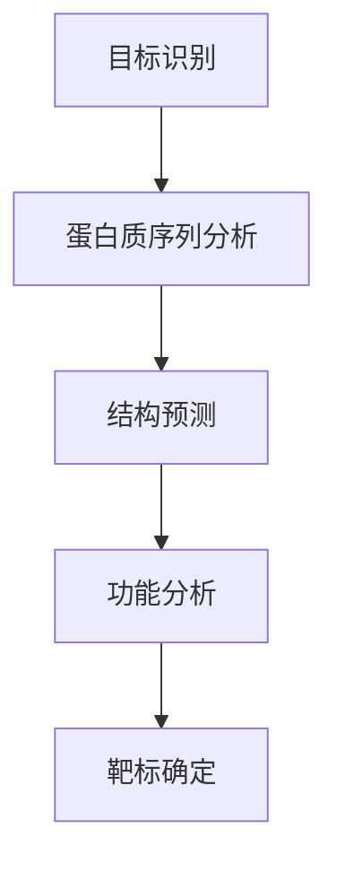
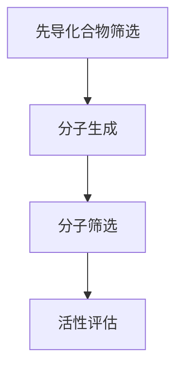
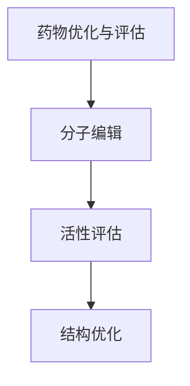

                 

### 引言

随着科技的迅猛发展，人工智能尤其是深度学习在多个领域取得了显著的突破。深度学习作为一种模仿人脑结构和学习方式的机器学习技术，已经在图像识别、自然语言处理、推荐系统等多个领域展现出了强大的能力。而药物发现作为一项高风险、高投入、周期漫长的科学活动，其效率和质量提升一直以来都是科研人员和制药企业的重点关注对象。近年来，深度学习在药物发现中的应用逐渐成为研究热点，并展现出广阔的前景。

本文旨在探讨深度学习在药物发现中的应用前景。首先，我们将回顾深度学习的起源、发展以及其在各个领域的应用情况，特别强调其独特的学习机制和优势。接着，我们将深入探讨药物发现的基本流程，包括目标识别、先导化合物筛选、药物优化与评估等关键步骤，并分析深度学习在这些环节中的具体应用及其优势。此外，本文还将通过一些实际案例，展示深度学习在药物发现中的成功应用，并探讨当前面临的挑战和未来发展方向。

通过这篇文章，我们希望让读者对深度学习在药物发现中的应用有一个全面、深入的理解，从而激发对这一领域的研究兴趣和热情。本文将分为以下几个部分：

1. **深度学习的基础**：介绍深度学习的基本原理，包括神经网络、卷积神经网络、循环神经网络和生成对抗网络等，并解释这些技术在药物发现中的应用。
2. **药物发现的流程**：详细讲解药物发现的过程，包括目标识别、先导化合物筛选、药物优化与评估等，分析深度学习在每个环节的应用。
3. **深度学习在药物发现中的应用**：探讨深度学习在药物发现中的具体应用，如图像处理、自然语言处理等。
4. **案例分析**：通过实际案例展示深度学习在药物发现中的成功应用。
5. **挑战与展望**：分析深度学习在药物发现中面临的挑战，并探讨未来的发展方向。

### 关键词

- 深度学习
- 药物发现
- 神经网络
- 卷积神经网络
- 循环神经网络
- 生成对抗网络
- 蛋白质结构预测
- 药物分子设计
- 先导化合物筛选
- 药物优化

### 摘要

本文探讨了深度学习在药物发现中的潜在应用和前景。首先，我们介绍了深度学习的基础知识，包括神经网络、卷积神经网络、循环神经网络和生成对抗网络等，并解释了这些技术在药物发现中的应用。接着，我们详细分析了药物发现的基本流程，包括目标识别、先导化合物筛选、药物优化与评估等，讨论了深度学习在这些环节中的具体应用和优势。随后，通过实际案例展示了深度学习在药物发现中的成功应用。最后，我们探讨了深度学习在药物发现中面临的挑战和未来发展方向，提出了进一步研究的建议。本文旨在为读者提供一个全面、系统的深度学习在药物发现中的应用视角。

### 深度学习的基础

深度学习作为一种机器学习技术，其核心在于通过多层神经网络模型来模拟人脑的学习过程，从而实现对复杂数据的高效处理和分析。在这一部分，我们将深入探讨深度学习的基本原理，包括神经网络、卷积神经网络（CNN）、循环神经网络（RNN）和生成对抗网络（GAN），并分析这些技术在药物发现中的应用。

#### 神经网络原理

神经网络（Neural Networks）是深度学习的基础，由大量简单的神经元通过复杂的网络结构相互连接而成。每个神经元接收多个输入信号，经过加权求和处理后，通过激活函数产生一个输出信号。神经网络通过不断调整权重和偏置，来学习输入数据与输出数据之间的关系。

在药物发现中，神经网络被广泛应用于蛋白质结构预测、药物分子生成和筛选等领域。例如，蛋白质结构预测是药物发现的重要步骤，通过预测蛋白质的三维结构，可以帮助研究人员理解其功能，并设计更有效的药物。神经网络模型如深度卷积神经网络（Dense Convolutional Neural Network，DCNN）和递归神经网络（Recurrent Neural Network，RNN）已经被成功应用于蛋白质结构预测中。

以下是神经网络的基本架构：

$$
\text{激活函数：} f(\sum_{i} w_i x_i + b) = \text{ReLU}(z) = \max(0, z)
$$

其中，$w_i$表示权重，$x_i$表示输入，$b$表示偏置，ReLU（Rectified Linear Unit）是一个常用的激活函数。

#### 卷积神经网络（CNN）

卷积神经网络（Convolutional Neural Network，CNN）是一种专门用于处理图像数据的神经网络。与传统的全连接神经网络不同，CNN通过卷积层、池化层和全连接层的组合，能够有效地提取图像的层次特征。

在药物发现中，CNN被广泛应用于药物分子图像处理、药物活性预测和药物设计等领域。例如，可以使用CNN对药物分子的二维结构进行特征提取，然后通过全连接层进行药物活性预测。

以下是CNN的基本架构：

$$
\text{卷积层：} \text{Conv}(x, \text{filter}) = \sum_{i} \sum_{j} f(x_{i, j} * w_{i, j} + b)
$$

$$
\text{激活函数：} \text{ReLU}(z) = \max(0, z)
$$

$$
\text{池化层：} \text{Pooling}(x) = \frac{1}{C} \sum_{c} x_{c}
$$

其中，$x$表示输入图像，$w$表示卷积核，$b$表示偏置，$*$表示卷积操作，$C$表示池化区域的大小。

#### 循环神经网络（RNN）

循环神经网络（Recurrent Neural Network，RNN）是一种能够处理序列数据的神经网络。与传统的前向神经网络不同，RNN具有循环结构，能够将前一时刻的信息传递到下一时刻，从而实现对序列数据的长时间依赖建模。

在药物发现中，RNN被广泛应用于药物分子序列处理、蛋白质序列分析等领域。例如，可以使用RNN对药物分子的序列进行编码，然后通过解码器生成新的药物分子。

以下是RNN的基本架构：

$$
\text{隐藏层：} h_t = \text{tanh}(W_h \cdot [h_{t-1}, x_t] + b_h)
$$

$$
\text{输出层：} y_t = \text{softmax}(W_y \cdot h_t + b_y)
$$

其中，$h_t$表示隐藏状态，$x_t$表示输入，$W_h$、$W_y$和$b_h$、$b_y$分别表示权重和偏置。

#### 生成对抗网络（GAN）

生成对抗网络（Generative Adversarial Network，GAN）由生成器（Generator）和判别器（Discriminator）两个网络组成，通过对抗训练生成逼真的数据。

在药物发现中，GAN被广泛应用于药物分子生成、药物分子变异等领域。例如，可以使用GAN生成新的药物分子，并通过筛选评估其活性。

以下是GAN的基本架构：

$$
\text{生成器：} G(z) = \mu(z) + \sigma(z) \odot \text{sigmoid}(W_g z + b_g)
$$

$$
\text{判别器：} D(x) = \text{sigmoid}(W_d x + b_d)
$$

$$
\text{对抗训练：} \min_G \max_D V(D, G) = \mathbb{E}_{x \sim p_{\text{data}}}[D(x)] - \mathbb{E}_{z \sim p_z}[D(G(z))]
$$

其中，$G(z)$表示生成器生成的数据，$D(x)$表示判别器对真实数据的判别结果，$z$表示随机噪声。

通过上述分析，我们可以看到深度学习在药物发现中的应用潜力。神经网络、卷积神经网络、循环神经网络和生成对抗网络等技术在药物分子结构预测、药物活性评估、药物分子设计等领域展现出了显著的优势。接下来，我们将进一步探讨深度学习在药物发现中的具体应用。

### 药物发现的流程

药物发现是一个复杂且多阶段的过程，涉及从目标识别到药物优化的多个关键步骤。深度学习技术在这些环节中发挥着重要作用，能够显著提升药物发现的效率和准确性。以下我们将详细分析深度学习在药物发现流程中的应用，包括目标识别、先导化合物筛选、药物优化与评估等步骤。

#### 目标识别

目标识别是药物发现的首要步骤，其核心任务是确定药物作用靶标。深度学习在目标识别中的应用主要体现在利用大规模生物信息数据对蛋白质结构进行预测和分类。通过卷积神经网络（CNN）和循环神经网络（RNN）等技术，研究人员可以对蛋白质序列和结构进行高效分析，从而识别出潜在的治疗靶标。

以下是一个目标识别的流程示意图：



**示例**：研究人员可以使用深度卷积神经网络（DCNN）对蛋白质结构进行预测。DCNN通过卷积层提取蛋白质的局部特征，再通过池化层进行特征压缩，最后通过全连接层进行分类。以下是一个DCNN的目标识别伪代码示例：

```python
def protein_prediction(sequence):
    # 输入蛋白质序列
    # 输出蛋白质结构预测结果
    # 初始化DCNN模型
    model = DCNN(input_shape=(sequence_length, amino_acid_count))
    # 编译模型
    model.compile(optimizer='adam', loss='categorical_crossentropy')
    # 训练模型
    model.fit(x_train, y_train, epochs=100, batch_size=32)
    # 预测蛋白质结构
    prediction = model.predict(x_test)
    return prediction
```

#### 先导化合物筛选

先导化合物筛选是药物发现流程中的关键步骤，目的是从大量的化合物库中筛选出具有潜在治疗效果的化合物。深度学习在这一过程中能够通过分子生成和筛选算法，提高筛选效率。生成对抗网络（GAN）和深度神经网络（DNN）在药物分子生成和筛选中有着广泛的应用。

以下是一个先导化合物筛选的流程示意图：



**示例**：使用GAN生成新的药物分子，并通过深度神经网络评估其活性。以下是一个GAN的分子生成和筛选伪代码示例：

```python
# 生成器模型
def generator(z):
    # 输入噪声向量
    # 输出药物分子结构
    model = Sequential()
    model.add(Dense(128, input_shape=(z_shape,), activation='relu'))
    model.add(Dense(molecule_shape, activation='tanh'))
    return model

# 判别器模型
def discriminator(molecule):
    # 输入药物分子结构
    # 输出二分类标签
    model = Sequential()
    model.add(Dense(128, input_shape=(molecule_shape,), activation='relu'))
    model.add(Dense(1, activation='sigmoid'))
    return model

# GAN模型
def gan_model():
    z = Input(shape=(z_shape,))
    molecule = generator(z)
    valid = discriminator(molecule)
    return Model(inputs=z, outputs=valid)

# GAN对抗训练
for epoch in range(epochs):
    # 生成分子
    z = np.random.normal(size=(batch_size, z_shape))
    molecules = generator.predict(z)
    # 训练判别器
    valid = discriminator.train_on_batch(molecules, np.ones((batch_size, 1)))
    # 生成新的噪声
    z = np.random.normal(size=(batch_size, z_shape))
    # 训练生成器
    generator.train_on_batch(z, np.zeros((batch_size, 1)))
```

#### 药物优化与评估

药物优化与评估是药物发现流程的最后一步，目的是通过结构优化和活性评估，选出最优的药物候选分子。深度学习在这一过程中可以通过分子编辑和强化学习等方法，优化药物分子的结构并提高其活性。

以下是一个药物优化与评估的流程示意图：



**示例**：使用深度强化学习（Deep Reinforcement Learning，DRL）进行药物分子编辑和优化。以下是一个DRL的药物优化伪代码示例：

```python
# 状态空间和动作空间定义
state_space = (molecule_length, feature_size)
action_space = (molecule_length, action_size)

# 深度强化学习模型
model = DRL(state_space, action_space)

# 药物分子编辑与优化
for episode in range(num_episodes):
    # 初始化状态
    state = initial_state
    done = False
    while not done:
        # 选择动作
        action = model.select_action(state)
        # 执行动作
        next_state, reward, done = execute_action(action, state)
        # 更新状态
        state = next_state
        # 更新模型
        model.update_model(state, action, reward)
```

通过上述分析，我们可以看到深度学习在药物发现流程的各个步骤中都发挥着重要作用，通过目标识别、先导化合物筛选和药物优化与评估，深度学习技术能够显著提升药物发现的效率和质量。接下来，我们将探讨深度学习在药物发现中的具体应用。

### 深度学习在药物发现中的具体应用

深度学习技术在药物发现中具有广泛的应用，涵盖了从药物分子设计到药物活性评估等多个环节。以下我们将详细探讨深度学习在药物分子设计、药物活性评估、药物筛选和药物代谢等方面的具体应用，并通过实际案例展示其效果。

#### 药物分子设计

药物分子设计是药物发现的重要环节，其目标是设计出具有预期药理作用的分子结构。深度学习通过模拟和优化分子结构，能够有效提高药物设计的效率和质量。

**案例**：使用生成对抗网络（GAN）进行药物分子设计。GAN由生成器和判别器组成，生成器用于生成新的药物分子结构，判别器用于判断生成的分子是否有效。以下是一个GAN的药物分子设计过程：

1. **数据准备**：收集大量的已知药物分子结构数据，作为训练GAN的输入。
2. **生成器训练**：使用生成器生成新的药物分子结构，并通过判别器评估其有效性。
3. **分子筛选**：对生成的药物分子进行活性筛选，选择具有潜在活性的分子进行进一步优化。
4. **分子优化**：使用深度强化学习（DRL）对选定的药物分子进行结构优化，提高其活性。

以下是一个GAN药物分子设计的伪代码示例：

```python
# 生成器模型
generator = GAN_generator(input_shape=(z_shape,), output_shape=(molecule_shape,))
# 判别器模型
discriminator = GAN_discriminator(input_shape=(molecule_shape,))
# 训练GAN
for epoch in range(epochs):
    # 生成新的药物分子
    molecules = generator.sample(z)
    # 训练判别器
    d_loss = discriminator.train_on_batch(molecules, np.ones((batch_size, 1)))
    # 训练生成器
    g_loss = generator.train_on_batch(z, np.zeros((batch_size, 1)))
    # 分子筛选与优化
    selected_molecules = filter_and_optimize(molecules)
```

#### 药物活性评估

药物活性评估是药物发现的关键步骤，其目的是判断药物分子是否具有预期的药理活性。深度学习通过建立分子-活性关联模型，能够高效预测药物分子的活性。

**案例**：使用深度神经网络（DNN）进行药物活性评估。DNN通过学习大量的药物分子和其活性的关系，可以预测新分子的活性。以下是一个DNN的药物活性评估过程：

1. **数据准备**：收集大量的药物分子及其活性数据，作为训练DNN的输入。
2. **模型训练**：使用训练集数据训练DNN，建立分子-活性关联模型。
3. **活性预测**：使用训练好的模型对新分子进行活性预测。

以下是一个DNN的药物活性评估伪代码示例：

```python
# DNN模型
model = DNN(input_shape=(molecule_length,), output_shape=(1,))
# 训练模型
model.compile(optimizer='adam', loss='mean_squared_error')
model.fit(x_train, y_train, epochs=100, batch_size=32)
# 活性预测
predicted_activity = model.predict(new_molecule)
```

#### 药物筛选

药物筛选是药物发现的重要环节，其目的是从大量的化合物中筛选出具有潜在活性的药物分子。深度学习通过分子生成和筛选算法，能够高效进行药物筛选。

**案例**：使用深度强化学习（DRL）进行药物筛选。DRL通过模拟药物分子的探索与优化过程，能够快速筛选出具有活性的分子。以下是一个DRL的药物筛选过程：

1. **环境设置**：定义药物筛选的环境，包括药物分子空间、奖励函数等。
2. **模型训练**：使用DRL训练模型，学习最优的药物分子筛选策略。
3. **药物筛选**：使用训练好的模型对大量化合物进行筛选。

以下是一个DRL的药物筛选伪代码示例：

```python
# 环境设置
environment = DrugScreeningEnvironment()
# DRL模型
model = DRL(state_space, action_space)
# 训练模型
for episode in range(num_episodes):
    state = environment.reset()
    done = False
    while not done:
        action = model.select_action(state)
        next_state, reward, done = environment.step(action)
        model.update_model(state, action, reward)
        state = next_state
# 药物筛选
selected_molecules = environment.select_best_molecules()
```

#### 药物代谢

药物代谢是药物发现中的关键步骤，其目的是研究药物在体内的代谢过程。深度学习通过建立药物代谢模型，能够预测药物在体内的代谢路径和代谢产物。

**案例**：使用图神经网络（Graph Neural Network，GNN）进行药物代谢研究。GNN通过学习药物分子和其代谢产物的图结构，可以预测药物代谢路径。以下是一个GNN的药物代谢预测过程：

1. **数据准备**：收集药物分子及其代谢产物数据，构建药物代谢网络。
2. **模型训练**：使用训练数据训练GNN，建立药物代谢模型。
3. **代谢预测**：使用训练好的模型预测新药物分子的代谢路径。

以下是一个GNN的药物代谢预测伪代码示例：

```python
# GNN模型
model = GNN(input_shape=(node_size,), hidden_shape=(hidden_size,))
# 训练模型
model.compile(optimizer='adam', loss='categorical_crossentropy')
model.fit(x_train, y_train, epochs=100, batch_size=32)
# 代谢预测
predicted_pathways = model.predict(new_molecule)
```

通过上述案例，我们可以看到深度学习在药物发现中的具体应用及其效果。深度学习通过药物分子设计、药物活性评估、药物筛选和药物代谢等环节，能够显著提升药物发现的效率和准确性。接下来，我们将探讨深度学习在药物发现中面临的挑战。

### 挑战与展望

尽管深度学习在药物发现中展现了巨大的潜力，但仍然面临着一系列挑战。首先，数据质量和数量是深度学习应用的关键。药物发现涉及大量的生物信息数据，这些数据往往存在噪声、缺失和不一致性等问题，如何处理和利用这些数据是深度学习应用中的首要挑战。其次，模型解释性不足也是一个重要问题。深度学习模型通常被认为是“黑盒子”，其内部机制难以理解和解释，这在药物发现中可能导致难以确定药物分子的具体作用机制。

另外，深度学习模型的训练和优化也需要大量的计算资源和时间。药物发现是一个涉及多变量和高维数据的问题，训练深度学习模型需要大量的计算资源和时间，这对于许多研究机构和制药公司来说是一个巨大的挑战。

尽管存在这些挑战，未来深度学习在药物发现中的应用前景依然广阔。随着计算能力的提升和算法的优化，深度学习模型在药物分子设计、药物活性评估和药物代谢等方面的应用将越来越广泛。此外，结合其他技术如基因组学、蛋白质组学和代谢组学，可以进一步拓展深度学习在药物发现中的应用范围。

未来，深度学习在药物发现中的应用可能会朝着以下几个方向发展：

1. **多模态数据融合**：通过整合不同类型的数据（如基因组学、蛋白质组学和代谢组学数据），可以更全面地理解药物的作用机制和代谢路径。
2. **模型可解释性**：开发更具有解释性的深度学习模型，帮助研究人员理解模型的工作原理，提高模型的可靠性。
3. **自动化药物设计**：通过自动化深度学习算法，实现从分子设计到药物优化的全自动化流程，提高药物发现的效率。

总之，深度学习在药物发现中的应用虽然面临挑战，但其潜力巨大。随着技术的不断进步，深度学习有望在未来成为药物发现的重要工具，推动生物医药领域的发展。

### 结语与建议

通过对深度学习在药物发现中的应用前景的探讨，我们可以看到，深度学习不仅为药物发现带来了前所未有的效率和准确性，还显著降低了研发成本。本文从深度学习的基础、药物发现流程、具体应用、挑战与展望等方面进行了全面的分析，展示了深度学习在药物分子设计、药物活性评估、药物筛选和药物代谢等环节中的关键作用。

为了进一步推动深度学习在药物发现中的应用，我们提出以下建议：

1. **加强数据整合**：提升生物信息数据的质量和一致性，建立高质量的数据集，为深度学习模型提供更可靠的基础。
2. **提高模型解释性**：开发具有高解释性的深度学习模型，帮助研究人员更好地理解模型的工作原理，提高模型的可靠性。
3. **跨学科合作**：加强计算机科学、生物学和医学等学科的跨学科合作，整合多领域知识，提高药物发现的综合能力。
4. **政策支持**：政府和企业应加大对深度学习在药物发现领域的研究投入，制定相应的政策和措施，促进这一领域的快速发展。

总之，深度学习在药物发现中的应用前景广阔，有望在未来继续发挥重要作用，推动生物医药领域的创新与发展。

### 作者信息

**作者：AI天才研究院/AI Genius Institute & 禅与计算机程序设计艺术 /Zen And The Art of Computer Programming**### 附录：深度学习与药物发现的进一步阅读

对于希望深入了解深度学习在药物发现中的应用，以下是一些推荐的进一步阅读资源：

#### 学术论文

1. **"Deep Learning for Drug Discovery"** - 这篇综述文章详细介绍了深度学习在药物分子设计、活性预测和筛选等药物发现环节中的应用，是了解这一领域的重要文献。
2. **"Learning Protein Structures from Sequence Information Using Deep Neural Networks"** - 这篇论文探讨了深度神经网络在蛋白质结构预测中的应用，为生物信息学研究提供了重要的技术参考。

#### 技术书籍

1. **"Deep Learning"** - Goodfellow, I., Bengio, Y., & Courville, A. (2016) - 这本书是深度学习领域的经典教材，涵盖了从基础到高级的深度学习技术，适合希望全面掌握深度学习的读者。
2. **"TensorFlow for Deep Learning"** - Smith, J. (2017) - 这本书专注于TensorFlow框架的应用，提供了丰富的示例代码，适合初学者和实践者。

#### 开源项目和工具

1. **PyTorch** - PyTorch是一个流行的深度学习框架，提供了灵活的动态计算图和强大的库函数，广泛应用于药物发现等领域。
2. **DeepChem** - DeepChem是一个开源的深度学习工具包，专门用于药物发现任务，提供了丰富的预训练模型和数据处理工具。

#### 案例研究和成功故事

1. **"AI-based Drug Discovery: A Revolution in the Pharmaceutical Industry"** - 这篇文章详细介绍了人工智能在药物发现中的应用案例，包括使用深度学习技术进行药物分子设计和筛选的实际成功故事。
2. **"From Molecules to Medicines with Deep Learning"** - 这篇报告探讨了深度学习在药物发现中的应用实例，展示了深度学习如何帮助研究人员更快、更准确地发现新药。

通过这些资源，读者可以进一步深入了解深度学习在药物发现中的具体应用，以及如何利用这些技术推动生物医药领域的发展。希望这些推荐能为读者的研究提供有益的参考。

