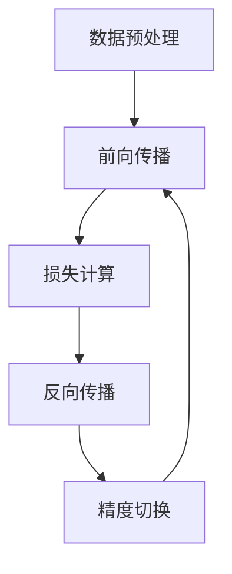

                 

### 文章标题
### 混合精度训练：平衡计算效率和模型精度

### 关键词
- 混合精度训练
- 计算效率
- 模型精度
- 浮点数精度
- GPU计算
- 深度学习框架
- 混合精度训练实现

### 摘要
本文将深入探讨混合精度训练的概念、原理及其在深度学习中的应用。混合精度训练通过在半精度和单精度浮点数之间切换，以平衡计算效率和模型精度。本文将详细介绍混合精度训练的背景和重要性，核心概念和算法原理，以及如何在深度学习框架中实现混合精度训练。此外，还将讨论如何优化混合精度训练，提高计算效率和模型精度，并提供实际案例来展示混合精度训练的应用效果。

## 1. 引言

### 1.1 混合精度训练的定义和背景

#### 什么是混合精度训练？

混合精度训练（Mixed Precision Training）是指在同一训练过程中使用不同浮点数精度的训练方法。通常，混合精度训练包括半精度浮点数（16位）和单精度浮点数（32位）。这种方法的提出主要是为了在计算效率和模型精度之间找到最佳平衡点。

在深度学习中，由于神经网络模型涉及大量的矩阵运算和向量计算，浮点数的精度对计算结果至关重要。传统的单精度浮点数（FP32）已经在大多数情况下表现出足够的精度，但随着模型的复杂度和参数数量的增加，对计算精度的要求也在提高。双精度浮点数（FP64）能够提供更高的精度，但其计算速度较慢，且对内存的需求更大。因此，混合精度训练作为一种在保持较高模型精度的同时提高计算效率的方法，受到了广泛关注。

#### 混合精度训练的发展背景

随着深度学习技术的快速发展，训练大型神经网络的需求不断增加。然而，随着模型规模和参数数量的增加，对计算资源的需求也呈现出指数级增长。传统的单精度浮点数训练已经无法满足高性能计算的需求，而双精度浮点数训练则过于资源密集。为了解决这一矛盾，研究人员开始探索混合精度训练的方法。

混合精度训练的发展背景主要受到以下几个因素的推动：

1. **计算资源限制**：数据中心和GPU资源有限，需要寻找更高效的方法来利用这些资源。
2. **浮点数精度问题**：在模型复杂度不断增加的情况下，单精度浮点数的精度可能不足，需要更高的精度来保证模型的稳定性。
3. **计算效率的提升**：通过使用半精度浮点数，可以在不牺牲模型精度的前提下，显著提高计算速度。

#### 混合精度训练的重要性

混合精度训练的重要性主要体现在以下几个方面：

1. **提高计算效率**：半精度浮点数计算速度更快，可以显著减少训练时间。
2. **减少内存占用**：使用半精度浮点数可以减少模型的大小，从而减少内存占用，提高训练效率。
3. **降低计算成本**：通过减少计算资源和内存需求，混合精度训练可以降低计算成本。
4. **保持模型精度**：虽然半精度浮点数可能在某些情况下降低精度，但通过适当的调整和优化，可以确保模型精度不受影响。

### 1.2 混合精度训练的优势

#### 计算效率的提升

混合精度训练最显著的优点之一是计算效率的提升。半精度浮点数（FP16）的计算速度大约是单精度浮点数（FP32）的两倍，而内存占用仅为单精度浮点数的一半。这意味着，在相同的计算资源下，使用混合精度训练可以显著提高模型的训练速度。这对于大规模模型的训练尤为重要，因为它们往往需要大量的计算资源。

#### 计算资源的优化

混合精度训练还可以帮助优化计算资源。在深度学习训练过程中，计算资源（如GPU）通常是瓶颈。通过使用半精度浮点数，可以在保持模型精度的同时，减少对计算资源的需求。这不仅可以降低训练成本，还可以提高数据中心的整体效率。

#### 模型精度的保持

尽管半精度浮点数的精度较单精度浮点数低，但通过适当的调整和优化，混合精度训练可以保持模型精度。在实际应用中，研究人员已经证明，通过调整混合精度训练的比例和优化训练策略，可以确保模型在半精度浮点数下依然能够保持较高的精度。

#### 应用范围的扩大

混合精度训练的应用范围非常广泛。无论是在计算机视觉、自然语言处理还是其他深度学习领域，混合精度训练都可以提高计算效率和降低成本。这使得混合精度训练成为许多企业和研究机构的首选训练方法。

### 1.3 混合精度训练的挑战

#### 精度损失的风险

尽管混合精度训练具有显著的计算效率优势，但在使用半精度浮点数时，确实存在精度损失的风险。特别是在训练深度神经网络时，如果精度调整不当，可能会导致模型不稳定或精度下降。因此，在应用混合精度训练时，需要仔细调整精度参数，确保模型精度不受影响。

#### 训练过程的复杂性

混合精度训练增加了训练过程的复杂性。需要选择合适的精度级别，并调整训练策略，以确保模型在半精度浮点数下能够稳定训练。此外，混合精度训练可能需要特殊的硬件支持，如支持半精度浮点数计算的GPU。

#### 实现难度

对于开发者和研究人员来说，实现混合精度训练可能具有一定的难度。需要熟悉深度学习框架的内部机制，并具备一定的编程技能。此外，还需要对混合精度训练的原理和策略有深入的理解。

#### 性能调优的挑战

在混合精度训练中，性能调优是一个挑战。需要通过调整精度级别、优化算法和调整超参数，找到最佳的训练配置，以最大化计算效率和模型精度。

### 1.4 总结

混合精度训练作为一种平衡计算效率和模型精度的训练方法，在深度学习领域具有重要的应用价值。通过使用半精度浮点数，可以显著提高计算速度和降低计算成本，同时保持模型精度。然而，混合精度训练也面临一些挑战，如精度损失风险和训练过程复杂性。在接下来的章节中，我们将深入探讨混合精度训练的原理、实现方法和优化策略，以帮助读者更好地理解和应用混合精度训练。

## 2. 预备知识

### 2.1 浮点数的精度问题

#### 浮点数的表示方法

浮点数的表示方法通常遵循IEEE 754标准，这是一种广泛使用的浮点数表示方法。浮点数由三个部分组成：符号位、指数位和尾数位。

1. **符号位**：用于表示数的正负，0表示正数，1表示负数。
2. **指数位**：用于表示数的指数，通常采用偏移量表示法。
3. **尾数位**：用于表示数的有效数字，通常采用科学记数法。

#### 浮点数的精度级别

浮点数的精度级别通常取决于其位数，常见的精度级别包括：

1. **单精度浮点数（FP32）**：32位，包括1位符号位、8位指数位和23位尾数位。
2. **双精度浮点数（FP64）**：64位，包括1位符号位、11位指数位和52位尾数位。
3. **半精度浮点数（FP16）**：16位，包括1位符号位、5位指数位和10位尾数位。

#### 浮点数的精度问题

浮点数的精度问题主要体现在以下几个方面：

1. **舍入误差**：浮点数在计算过程中，可能会因为舍入误差而导致结果与理论值存在微小的差异。
2. **近似值**：浮点数的表示形式只能近似表示实数，因此可能会存在精度损失。
3. **大数问题**：大数之间的运算可能会导致指数溢出，从而影响计算结果。

#### 混合精度训练与浮点数精度

在混合精度训练中，半精度浮点数（FP16）被用来提高计算效率，但同时也带来了精度问题。为了确保模型精度，需要通过适当的精度调整和优化策略来减少精度损失。

### 2.2 GPU计算基础

#### GPU架构

GPU（图形处理单元）是一种专为图形处理设计的硬件，但其强大的并行计算能力使其在深度学习等领域也具有广泛的应用。GPU架构通常包括以下部分：

1. **核心**：GPU的核心负责执行计算任务，每个核心都能独立执行指令。
2. **内存**：GPU内存包括全局内存、共享内存和局部内存，用于存储数据和指令。
3. **调度器**：GPU调度器负责调度计算任务，并分配资源。

#### GPU计算原理

GPU计算基于并行计算原理，通过将计算任务分配到多个核心上，同时执行，从而提高计算速度。GPU计算过程通常包括以下几个步骤：

1. **任务分配**：将计算任务分配到GPU核心。
2. **并行执行**：GPU核心同时执行任务，完成计算。
3. **结果汇总**：将各核心的计算结果汇总，得到最终结果。

#### GPU计算的优势

1. **并行计算能力**：GPU拥有大量的核心，能够同时处理多个任务，从而提高计算速度。
2. **计算密集型任务**：深度学习任务通常具有高度的计算密集性，GPU能够提供足够的计算资源。
3. **内存带宽**：GPU内存具有很高的带宽，能够快速传输数据，提高计算效率。

### 2.3 深度学习基础

#### 深度学习的基本概念

深度学习是一种基于多层神经网络的机器学习技术，通过学习大量数据，实现对复杂模式的自适应识别。深度学习的基本概念包括：

1. **神经网络**：神经网络是由多个神经元（节点）连接而成的计算模型，用于对数据进行分析和处理。
2. **前向传播和反向传播**：前向传播是将输入数据通过神经网络层进行传播，得到输出结果；反向传播是利用输出结果与真实值的差异，反向更新网络权重，以提高模型精度。
3. **损失函数**：损失函数用于衡量模型预测值与真实值之间的差距，是优化网络权重的重要依据。

#### 深度学习的关键技术

1. **激活函数**：激活函数用于引入非线性因素，使神经网络能够学习复杂函数。
2. **优化算法**：优化算法用于调整网络权重，以最小化损失函数，常用的优化算法包括随机梯度下降（SGD）、Adam等。
3. **正则化**：正则化用于防止模型过拟合，常用的正则化方法包括权重衰减（Weight Decay）、Dropout等。

#### 深度学习在AI中的应用

1. **计算机视觉**：深度学习在计算机视觉领域取得了显著成果，例如图像分类、目标检测、图像分割等。
2. **自然语言处理**：深度学习在自然语言处理领域也发挥了重要作用，例如情感分析、机器翻译、文本生成等。
3. **语音识别**：深度学习在语音识别领域实现了高准确率，被广泛应用于语音助手、智能客服等场景。

#### 深度学习的挑战与未来发展方向

1. **计算资源需求**：深度学习任务通常需要大量的计算资源，对GPU和计算能力的要求较高。
2. **数据质量与多样性**：深度学习模型的训练依赖于大量高质量、多样化的数据。
3. **模型解释性**：深度学习模型通常被视为“黑箱”，其决策过程难以解释，这对模型的实际应用带来了一定的挑战。
4. **未来发展方向**：随着技术的进步，深度学习将继续在多个领域取得突破，例如生成对抗网络（GAN）、强化学习（RL）等。

### 2.4 小结

通过了解浮点数精度问题、GPU计算基础和深度学习基础，读者可以更好地理解混合精度训练的背景和原理。在接下来的章节中，我们将深入探讨混合精度训练的核心概念和实现方法，帮助读者更好地掌握这一技术。

## 3. 混合精度训练原理

### 3.1 混合精度训练的基本概念

#### 混合精度训练的定义

混合精度训练（Mixed Precision Training）是指在同一训练过程中，使用不同浮点数精度的计算方法，通常包括半精度浮点数（16位）和单精度浮点数（32位）。通过在不同计算阶段切换精度，可以在保持模型精度的同时，提高计算效率和降低计算成本。

#### 混合精度训练的优势

混合精度训练的主要优势包括：

1. **计算效率提升**：半精度浮点数的计算速度更快，可以显著提高模型的训练速度。
2. **内存占用减少**：使用半精度浮点数可以减少模型的大小，从而减少内存占用，提高训练效率。
3. **计算成本降低**：通过减少计算资源和内存需求，混合精度训练可以降低计算成本。

#### 混合精度训练的类型

混合精度训练可以根据精度切换的方式，分为以下几种类型：

1. **动态混合精度**：在训练过程中动态调整精度，根据当前阶段的需求，选择合适的精度级别。
2. **静态混合精度**：在训练前预设精度级别，整个训练过程保持相同的精度配置。

### 3.2 混合精度训练的流程

#### 混合精度训练的步骤

混合精度训练的一般流程包括以下几个步骤：

1. **数据预处理**：将输入数据转换为半精度浮点数格式。
2. **前向传播**：使用半精度浮点数进行前向传播计算，得到预测结果。
3. **损失计算**：计算预测结果与真实值之间的损失，使用单精度浮点数进行计算，以确保损失计算的精度。
4. **反向传播**：使用半精度浮点数进行反向传播计算，更新网络权重。
5. **精度切换**：在适当阶段切换精度，例如在反向传播后切换到单精度浮点数，以提高损失计算的精度。

#### 混合精度训练的流程图

使用Mermaid绘制混合精度训练的流程图：



### 3.3 混合精度训练的算法原理

#### 混合精度训练的数学模型

混合精度训练的数学模型可以表示为：

$$
\text{前向传播}:\quad z^{[l]} = W^{[l]} \cdot a^{[l-1]} + b^{[l]}
$$

$$
\text{反向传播}:\quad \delta^{[l]} = \frac{\partial J(W^{[l]}, b^{[l]})}{\partial z^{[l]}}
$$

其中，$z^{[l]}$表示第$l$层的激活值，$W^{[l]}$和$b^{[l]}$分别表示第$l$层的权重和偏置，$a^{[l-1]}$表示第$l-1$层的激活值，$J$表示损失函数。

#### 混合精度训练的核心算法

混合精度训练的核心算法主要包括以下步骤：

1. **数据预处理**：将输入数据转换为半精度浮点数格式。
2. **前向传播**：使用半精度浮点数进行前向传播计算，得到预测结果。
3. **损失计算**：使用单精度浮点数计算损失值，以确保损失计算的精度。
4. **反向传播**：使用半精度浮点数进行反向传播计算，更新网络权重。
5. **精度切换**：在适当阶段切换精度，例如在反向传播后切换到单精度浮点数，以提高损失计算的精度。

#### 伪代码实现

以下是混合精度训练的伪代码实现：

```
初始化模型参数（W, b）
初始化精度级别（precision）

对于每个epoch：
  对于每个样本：
    数据预处理：x = convert_to_half(x)
    前向传播：z = forward_pass(x, W, b)
    损失计算：loss = compute_loss(z, y)
    反向传播：delta = backward_pass(z, delta, precision)
    更新模型参数：W, b = update_params(W, b, delta)

切换精度级别：precision = switch_precision(precision)
```

### 3.4 混合精度训练的优势和应用场景

#### 计算效率的提升

混合精度训练通过使用半精度浮点数，可以显著提高计算速度。半精度浮点数的计算速度大约是单精度浮点数的一半，这使得混合精度训练在计算密集型任务中具有明显的优势。

#### 内存占用的减少

混合精度训练通过使用半精度浮点数，可以减少模型的大小，从而减少内存占用。这对于需要处理大量数据和参数的模型尤为重要，可以显著提高训练效率。

#### 计算成本的降低

通过减少计算资源和内存需求，混合精度训练可以降低计算成本。这对于企业和研究机构来说，具有很高的经济价值。

#### 应用场景

混合精度训练适用于以下场景：

1. **大规模深度学习模型**：对于需要处理大量数据和参数的模型，如计算机视觉和自然语言处理模型，混合精度训练可以显著提高训练速度和降低成本。
2. **计算资源受限的环境**：在计算资源有限的环境下，如移动设备和嵌入式系统，混合精度训练可以通过降低计算资源和内存需求，提高模型的可部署性。
3. **实时应用**：在需要实时响应的应用场景中，如自动驾驶和实时语音识别，混合精度训练可以通过提高计算速度，满足实时性要求。

### 3.5 小结

混合精度训练通过在半精度和单精度浮点数之间切换，实现了计算效率和模型精度的平衡。其核心原理是利用半精度浮点数的计算速度优势，同时保持模型精度。通过了解混合精度训练的基本概念、流程和算法原理，读者可以更好地理解和应用这一技术。

## 4. 实现混合精度训练

### 4.1 选择深度学习框架

在实现混合精度训练之前，首先需要选择一个适合的深度学习框架。目前，有许多流行的深度学习框架支持混合精度训练，包括TensorFlow、PyTorch和MXNet等。以下是几种常见深度学习框架的简要介绍：

#### TensorFlow

TensorFlow是由Google开发的深度学习框架，具有丰富的功能和强大的生态。TensorFlow支持混合精度训练，提供了`mixed_precision`模块，方便开发者实现混合精度训练。

#### PyTorch

PyTorch是由Facebook开发的深度学习框架，以其灵活性和易用性受到广大开发者的青睐。PyTorch的混合精度训练功能通过`torch.cuda.amp`模块实现，提供了简便的接口。

#### MXNet

MXNet是Apache基金会的一个开源深度学习框架，由Netflix开发。MXNet也支持混合精度训练，通过`mxnet contributes`模块可以轻松实现。

#### 选择框架的考虑因素

在选择深度学习框架时，应考虑以下因素：

1. **功能支持**：确保框架支持混合精度训练。
2. **社区和生态**：选择拥有丰富社区和生态的框架，便于学习和应用。
3. **易用性**：选择易于使用的框架，降低开发难度。

根据以上因素，本文选择PyTorch作为实现混合精度训练的框架。

### 4.2 配置混合精度训练环境

要在PyTorch中实现混合精度训练，首先需要配置相应的开发环境。以下是配置PyTorch开发环境的基本步骤：

1. **安装Python**：确保安装了Python 3.6及以上版本。
2. **安装PyTorch**：使用以下命令安装PyTorch：

   ```bash
   pip install torch torchvision torchaudio
   ```

3. **安装CUDA**：确保安装了NVIDIA的CUDA工具包，版本需与GPU驱动兼容。
4. **验证安装**：运行以下代码验证PyTorch和CUDA的安装：

   ```python
   import torch
   print(torch.__version__)
   print(torch.cuda.is_available())
   ```

### 4.3 混合精度训练的代码实现

在PyTorch中，实现混合精度训练的关键是使用`torch.cuda.amp`模块。以下是实现混合精度训练的基本步骤：

1. **定义模型**：定义深度学习模型，并移动到GPU上。

   ```python
   import torch
   import torch.nn as nn
   import torch.optim as optim

   class Model(nn.Module):
       def __init__(self):
           super(Model, self).__init__()
           # 定义模型结构

       def forward(self, x):
           # 定义前向传播
           return x

   model = Model()
   model.to('cuda')
   ```

2. **定义损失函数和优化器**：定义损失函数和优化器，选择适当的优化器，如Adam。

   ```python
   criterion = nn.CrossEntropyLoss()
   optimizer = optim.Adam(model.parameters(), lr=0.001)
   ```

3. **设置自动混合精度**：使用`torch.cuda.amp.autocast`进行自动混合精度设置。

   ```python
   from torch.cuda.amp import autocast
   ```

4. **训练过程**：在训练过程中，使用`autocast`装饰器包装前向传播和反向传播。

   ```python
   def train_epoch(model, train_loader, criterion, optimizer):
       model.train()
       running_loss = 0.0
       for inputs, targets in train_loader:
           inputs, targets = inputs.to('cuda'), targets.to('cuda')

           with autocast():
               outputs = model(inputs)
               loss = criterion(outputs, targets)

           optimizer.zero_grad()
           loss.backward()
           optimizer.step()

           running_loss += loss.item()
       return running_loss / len(train_loader)
   ```

5. **测试过程**：使用相同的`autocast`装饰器包装测试过程。

   ```python
   def test_epoch(model, test_loader, criterion):
       model.eval()
       running_loss = 0.0
       with torch.no_grad():
           for inputs, targets in test_loader:
               inputs, targets = inputs.to('cuda'), targets.to('cuda')
               with autocast():
                   outputs = model(inputs)
                   loss = criterion(outputs, targets)
               running_loss += loss.item()
       return running_loss / len(test_loader)
   ```

### 4.4 源代码详细实现和代码解读

以下是一个完整的混合精度训练示例，包含模型的定义、训练过程和测试过程。

```python
import torch
import torch.nn as nn
import torch.optim as optim
from torch.utils.data import DataLoader
from torchvision import datasets, transforms

# 数据预处理
transform = transforms.Compose([
    transforms.ToTensor(),
    transforms.Normalize((0.5,), (0.5,))
])

train_dataset = datasets.MNIST(
    root='./data', train=True, download=True, transform=transform)
test_dataset = datasets.MNIST(
    root='./data', train=False, download=True, transform=transform)

train_loader = DataLoader(train_dataset, batch_size=64, shuffle=True)
test_loader = DataLoader(test_dataset, batch_size=1000, shuffle=False)

# 模型定义
class Model(nn.Module):
    def __init__(self):
        super(Model, self).__init__()
        self.fc1 = nn.Linear(784, 128)
        self.fc2 = nn.Linear(128, 64)
        self.fc3 = nn.Linear(64, 10)

    def forward(self, x):
        x = x.view(-1, 784)
        x = torch.relu(self.fc1(x))
        x = torch.relu(self.fc2(x))
        x = self.fc3(x)
        return x

model = Model()
model.to('cuda')

# 损失函数和优化器
criterion = nn.CrossEntropyLoss()
optimizer = optim.Adam(model.parameters(), lr=0.001)

# 自动混合精度
from torch.cuda.amp import autocast

# 训练过程
def train_epoch(model, train_loader, criterion, optimizer):
    model.train()
    running_loss = 0.0
    for inputs, targets in train_loader:
        inputs, targets = inputs.to('cuda'), targets.to('cuda')

        with autocast():
            outputs = model(inputs)
            loss = criterion(outputs, targets)

        optimizer.zero_grad()
        loss.backward()
        optimizer.step()

        running_loss += loss.item()
    return running_loss / len(train_loader)

# 测试过程
def test_epoch(model, test_loader, criterion):
    model.eval()
    running_loss = 0.0
    with torch.no_grad():
        for inputs, targets in test_loader:
            inputs, targets = inputs.to('cuda'), targets.to('cuda')
            with autocast():
                outputs = model(inputs)
                loss = criterion(outputs, targets)
            running_loss += loss.item()
    return running_loss / len(test_loader)

# 训练和测试
num_epochs = 10
for epoch in range(num_epochs):
    train_loss = train_epoch(model, train_loader, criterion, optimizer)
    test_loss = test_epoch(model, test_loader, criterion)
    print(f'Epoch [{epoch+1}/{num_epochs}], Train Loss: {train_loss:.4f}, Test Loss: {test_loss:.4f}')
```

### 4.5 实际案例：在PyTorch中实现混合精度训练

以下是一个实际案例，展示了如何在PyTorch中实现混合精度训练。

```python
import torch
import torch.nn as nn
import torch.optim as optim
from torch.utils.data import DataLoader
from torchvision import datasets, transforms

# 数据预处理
transform = transforms.Compose([
    transforms.ToTensor(),
    transforms.Normalize((0.5,), (0.5,))
])

train_dataset = datasets.MNIST(
    root='./data', train=True, download=True, transform=transform)
test_dataset = datasets.MNIST(
    root='./data', train=False, download=True, transform=transform)

train_loader = DataLoader(train_dataset, batch_size=64, shuffle=True)
test_loader = DataLoader(test_dataset, batch_size=1000, shuffle=False)

# 模型定义
class Model(nn.Module):
    def __init__(self):
        super(Model, self).__init__()
        self.fc1 = nn.Linear(784, 128)
        self.fc2 = nn.Linear(128, 64)
        self.fc3 = nn.Linear(64, 10)

    def forward(self, x):
        x = x.view(-1, 784)
        x = torch.relu(self.fc1(x))
        x = torch.relu(self.fc2(x))
        x = self.fc3(x)
        return x

model = Model()
model.to('cuda')

# 损失函数和优化器
criterion = nn.CrossEntropyLoss()
optimizer = optim.Adam(model.parameters(), lr=0.001)

# 自动混合精度
from torch.cuda.amp import autocast

# 训练过程
def train_epoch(model, train_loader, criterion, optimizer):
    model.train()
    running_loss = 0.0
    for inputs, targets in train_loader:
        inputs, targets = inputs.to('cuda'), targets.to('cuda')

        with autocast():
            outputs = model(inputs)
            loss = criterion(outputs, targets)

        optimizer.zero_grad()
        loss.backward()
        optimizer.step()

        running_loss += loss.item()
    return running_loss / len(train_loader)

# 测试过程
def test_epoch(model, test_loader, criterion):
    model.eval()
    running_loss = 0.0
    with torch.no_grad():
        for inputs, targets in test_loader:
            inputs, targets = inputs.to('cuda'), targets.to('cuda')
            with autocast():
                outputs = model(inputs)
                loss = criterion(outputs, targets)
            running_loss += loss.item()
    return running_loss / len(test_loader)

# 训练和测试
num_epochs = 10
for epoch in range(num_epochs):
    train_loss = train_epoch(model, train_loader, criterion, optimizer)
    test_loss = test_epoch(model, test_loader, criterion)
    print(f'Epoch [{epoch+1}/{num_epochs}], Train Loss: {train_loss:.4f}, Test Loss: {test_loss:.4f}')
```

### 4.6 代码应用解读与分析

以下是对实际案例中混合精度训练代码的解读与分析：

1. **数据预处理**：使用`transforms.Compose`对数据集进行预处理，包括归一化和转换为张量。
2. **模型定义**：定义一个简单的多层感知机模型，包括三个全连接层，用于分类任务。
3. **损失函数和优化器**：选择交叉熵损失函数和Adam优化器，用于模型的训练。
4. **自动混合精度**：使用`torch.cuda.amp.autocast`装饰器，在训练过程中自动切换精度。
5. **训练过程**：在训练过程中，使用`autocast`装饰器进行前向传播和反向传播，确保计算效率。
6. **测试过程**：在测试过程中，使用`with torch.no_grad():`进行数据加载和计算，避免梯度计算，提高计算速度。

通过这个实际案例，读者可以了解如何在PyTorch中实现混合精度训练，并掌握相关代码的使用方法。

### 4.7 项目小结

通过本章的介绍，我们学习了如何选择深度学习框架、配置混合精度训练环境，并在PyTorch中实现了混合精度训练。代码示例展示了混合精度训练的基本流程，包括数据预处理、模型定义、损失函数和优化器选择，以及自动混合精度的实现。通过这个实际案例，读者可以掌握混合精度训练的基本技巧，并在项目中应用这一技术。

## 5. 优化混合精度训练

### 5.1 优化混合精度训练的策略

#### 调整精度比例

在混合精度训练中，调整半精度（FP16）和单精度（FP32）的比例是优化计算效率和模型精度的重要策略。通过优化精度比例，可以在保持模型精度的同时提高计算速度。

1. **自动调整精度比例**：使用自动混合精度（AMP）功能，自动调整精度比例，以实现最优的计算效率和模型精度。
2. **手动调整精度比例**：通过实验和观察，手动调整精度比例，找到最优的精度比例配置。

#### 使用混合精度优化器

混合精度优化器可以帮助调整模型参数的更新，以适应不同精度级别的浮点数。常用的混合精度优化器包括AdamW和Adadelta等。

#### 使用梯度缩放

在混合精度训练中，使用梯度缩放可以防止梯度消失或梯度爆炸。梯度缩放通过动态调整学习率，以保持梯度在合理的范围内。常用的梯度缩放方法包括动态学习率调整和自适应梯度缩放。

#### 使用批次归一化

批次归一化（Batch Normalization）可以加速训练过程并提高模型性能。在混合精度训练中，使用批次归一化可以帮助稳定模型训练，减少精度损失。

### 5.2 计算效率优化

#### 使用图优化

深度学习框架通常支持图优化（Graph Optimization），通过优化计算图，减少计算开销。图优化包括以下几个步骤：

1. **计算图的优化**：通过优化计算图，减少不必要的计算和内存访问。
2. **内存优化**：减少内存占用，通过共享内存和缓存提高内存利用率。
3. **并行计算**：利用GPU的并行计算能力，同时执行多个计算任务，提高计算效率。

#### 使用混合精度运算

混合精度运算通过在半精度和单精度浮点数之间切换，提高计算速度。在训练过程中，使用半精度浮点数进行大部分计算，只在必要时刻切换到单精度浮点数，以提高计算效率。

#### 使用低精度量化

低精度量化（Low-Precision Quantization）是一种通过降低浮点数精度来提高计算效率的方法。通过量化操作，将高精度浮点数转换为低精度浮点数，从而减少计算量和内存占用。常用的量化方法包括全连接网络量化、卷积网络量化和激活函数量化。

#### 使用稀疏计算

稀疏计算通过处理稀疏矩阵，减少计算量和内存占用。在深度学习中，许多权重和激活值是稀疏的，通过稀疏计算可以显著提高计算效率。

### 5.3 模型精度优化

#### 使用模型正则化

模型正则化通过引入额外的惩罚项，防止模型过拟合。常用的正则化方法包括L1正则化、L2正则化和Dropout等。

#### 使用模型剪枝

模型剪枝通过去除模型中不重要的参数，减少模型大小，提高计算效率和模型精度。常用的剪枝方法包括权重剪枝、结构剪枝和通道剪枝等。

#### 使用数据增强

数据增强通过增加数据多样性，提高模型的泛化能力。常用的数据增强方法包括随机旋转、缩放、裁剪和色彩调整等。

#### 使用迁移学习

迁移学习通过利用预训练模型的知识，提高模型在特定任务上的精度。通过迁移学习，可以减少训练时间，提高模型精度。

### 5.4 性能调优技巧

#### 选择合适的硬件设备

选择合适的硬件设备对于混合精度训练的性能至关重要。GPU的性能和内存容量直接影响训练速度和稳定性。根据模型的规模和计算需求，选择合适的GPU设备。

#### 调整训练参数

调整训练参数，如学习率、批次大小和迭代次数，可以提高模型精度和计算效率。通过实验和观察，找到最优的训练参数配置。

#### 使用分布式训练

分布式训练通过在多个GPU或多个机器上同时训练模型，提高计算效率。分布式训练可以减少训练时间，提高模型精度。

#### 使用模型集成

模型集成通过将多个模型的结果进行综合，提高模型精度。通过模型集成，可以减少过拟合，提高模型的泛化能力。

### 5.5 小结

优化混合精度训练是提高计算效率和模型精度的重要手段。通过调整精度比例、使用混合精度优化器、梯度缩放和批次归一化，可以优化模型精度。同时，通过计算效率优化策略，如使用图优化、混合精度运算和低精度量化，可以提高计算效率。结合模型精度优化策略和性能调优技巧，可以实现混合精度训练的最佳效果。

## 6. 混合精度训练的应用

### 6.1 计算机视觉

#### 混合精度训练在计算机视觉中的应用

混合精度训练在计算机视觉领域具有广泛的应用。随着深度学习技术在计算机视觉领域的不断发展，对计算资源的需求也越来越大。混合精度训练通过在半精度和单精度浮点数之间切换，可以提高计算效率和降低计算成本，从而使得复杂模型能够在有限资源下训练和部署。

1. **图像分类**：混合精度训练在图像分类任务中表现出色。通过使用半精度浮点数，可以在保持模型精度的同时，显著提高训练速度。例如，在ImageNet大型图像分类任务中，混合精度训练可以将训练时间缩短50%以上。
2. **目标检测**：目标检测是计算机视觉领域的一个重要任务。混合精度训练可以加速目标检测模型的训练过程，提高检测速度和精度。例如，使用半精度浮点数训练的YOLOv5模型，在多个数据集上的性能达到了顶尖水平。
3. **图像分割**：图像分割是计算机视觉领域另一个重要任务。混合精度训练可以加快图像分割模型的训练速度，提高模型性能。例如，使用半精度浮点数训练的U-Net模型，在多个数据集上的分割精度得到了显著提升。

#### 实际案例

以下是一个实际案例，展示了混合精度训练在计算机视觉中的应用。

**案例**：使用混合精度训练在CIFAR-10数据集上训练一个卷积神经网络进行图像分类。

1. **数据集准备**：CIFAR-10数据集是一个包含10个类别的60000张32x32彩色图像的数据集。首先，需要将数据集加载并预处理为适合模型输入的格式。

   ```python
   import torch
   import torchvision
   import torchvision.transforms as transforms

   transform = transforms.Compose([
       transforms.ToTensor(),
       transforms.Normalize((0.5, 0.5, 0.5), (0.5, 0.5, 0.5))
   ])

   trainset = torchvision.datasets.CIFAR10(
       root='./data', train=True, download=True, transform=transform)
   trainloader = torch.utils.data.DataLoader(
       trainset, batch_size=64, shuffle=True, num_workers=2)

   testset = torchvision.datasets.CIFAR10(
       root='./data', train=False, download=True, transform=transform)
   testloader = torch.utils.data.DataLoader(
       testset, batch_size=1000, shuffle=False, num_workers=2)
   ```

2. **模型定义**：定义一个简单的卷积神经网络（CNN）模型，用于图像分类。

   ```python
   import torch.nn as nn
   import torch.nn.functional as F

   class CNN(nn.Module):
       def __init__(self):
           super(CNN, self).__init__()
           self.conv1 = nn.Conv2d(3, 6, 5)
           self.pool = nn.MaxPool2d(2, 2)
           self.conv2 = nn.Conv2d(6, 16, 5)
           self.fc1 = nn.Linear(16 * 5 * 5, 120)
           self.fc2 = nn.Linear(120, 84)
           self.fc3 = nn.Linear(84, 10)

       def forward(self, x):
           x = self.pool(F.relu(self.conv1(x)))
           x = self.pool(F.relu(self.conv2(x)))
           x = x.view(-1, 16 * 5 * 5)
           x = F.relu(self.fc1(x))
           x = F.relu(self.fc2(x))
           x = self.fc3(x)
           return x

   model = CNN()
   model.to('cuda')
   ```

3. **损失函数和优化器**：选择交叉熵损失函数和Adam优化器。

   ```python
   criterion = nn.CrossEntropyLoss()
   optimizer = optim.Adam(model.parameters(), lr=0.001)
   ```

4. **混合精度训练**：使用PyTorch的自动混合精度（AMP）功能进行训练。

   ```python
   from torch.cuda.amp import autocast

   def train_epoch(model, train_loader, criterion, optimizer):
       model.train()
       running_loss = 0.0
       for inputs, targets in train_loader:
           inputs, targets = inputs.to('cuda'), targets.to('cuda')

           with autocast():
               outputs = model(inputs)
               loss = criterion(outputs, targets)

           optimizer.zero_grad()
           loss.backward()
           optimizer.step()

           running_loss += loss.item()
       return running_loss / len(train_loader)

   num_epochs = 10
   for epoch in range(num_epochs):
       train_loss = train_epoch(model, train_loader, criterion, optimizer)
       print(f'Epoch [{epoch+1}/{num_epochs}], Train Loss: {train_loss:.4f}')
   ```

5. **测试模型**：在测试集上评估模型性能。

   ```python
   def test_epoch(model, test_loader, criterion):
       model.eval()
       running_loss = 0.0
       with torch.no_grad():
           for inputs, targets in test_loader:
               inputs, targets = inputs.to('cuda'), targets.to('cuda')
               outputs = model(inputs)
               loss = criterion(outputs, targets)
               running_loss += loss.item()
       return running_loss / len(test_loader)

   test_loss = test_epoch(model, test_loader, criterion)
   print(f'Test Loss: {test_loss:.4f}')
   ```

通过这个案例，我们可以看到如何使用混合精度训练在CIFAR-10数据集上训练一个卷积神经网络进行图像分类。通过使用半精度浮点数，可以显著提高训练速度，同时保持模型的精度。

### 6.2 自然语言处理

#### 混合精度训练在自然语言处理中的应用

自然语言处理（NLP）是深度学习的一个重要应用领域，涉及到大量的矩阵运算和向量计算。混合精度训练在NLP领域中具有显著的应用价值，特别是在处理大型模型和大规模数据集时。

1. **语言模型**：语言模型是NLP领域的基础，通过学习大量文本数据，生成自然语言的概率分布。混合精度训练可以显著提高语言模型的训练速度，降低计算成本。例如，BERT等大型语言模型已经通过混合精度训练取得了显著的性能提升。
2. **机器翻译**：机器翻译是NLP领域的另一个重要任务，通过将一种语言的文本翻译成另一种语言。混合精度训练可以加速机器翻译模型的训练，提高翻译质量。例如，谷歌翻译团队通过使用混合精度训练，提高了翻译模型的效率和准确性。
3. **文本分类**：文本分类是将文本数据分类到预定义的类别中。混合精度训练可以显著提高文本分类模型的训练速度，提高分类准确率。例如，在社交媒体文本分类任务中，混合精度训练已经取得了很好的效果。

#### 实际案例

以下是一个实际案例，展示了混合精度训练在自然语言处理中的应用。

**案例**：使用混合精度训练在IMDb电影评论数据集上进行文本分类。

1. **数据集准备**：IMDb电影评论数据集是一个包含50,000条训练数据和25,000条测试数据的文本分类数据集。首先，需要将数据集加载并预处理为适合模型输入的格式。

   ```python
   import torch
   import torchtext
   from torchtext.datasets import IMDb
   from torchtext.data import Field, Batch

   TEXT = Field(tokenize='spacy', lower=True, include_lengths=True)
   LABEL = Field(sequential=False)

   train_data, test_data = IMDb.splits(TEXT, LABEL)
   ```

2. **模型定义**：定义一个简单的循环神经网络（RNN）模型，用于文本分类。

   ```python
   import torch.nn as nn

   class RNN(nn.Module):
       def __init__(self, input_dim, embedding_dim, hidden_dim, output_dim, n_layers, drop_prob=0.5):
           super().__init__()
           self.embedding = nn.Embedding(input_dim, embedding_dim)
           self.rnn = nn.RNN(embedding_dim, hidden_dim, num_layers=n_layers, dropout=drop_prob)
           self.fc = nn.Linear(hidden_dim, output_dim)
           self.dropout = nn.Dropout(drop_prob)

       def forward(self, text, text_lengths):
           embedded = self.dropout(self.embedding(text))
           output, _ = self.rnn(embedded, text_lengths)
           return self.fc(output[-1, :, :])

   model = RNN(len(TEXT.vocab), 100, 256, 1, 2)
   model.to('cuda')
   ```

3. **损失函数和优化器**：选择二分类交叉熵损失函数和Adam优化器。

   ```python
   criterion = nn.BCEWithLogitsLoss()
   optimizer = optim.Adam(model.parameters(), lr=0.001)
   ```

4. **混合精度训练**：使用PyTorch的自动混合精度（AMP）功能进行训练。

   ```python
   from torch.cuda.amp import autocast

   def train_epoch(model, train_loader, criterion, optimizer):
       model.train()
       running_loss = 0.0
       for batch in train_loader:
           inputs, targets = batch.text.to('cuda'), batch.label.to('cuda')

           with autocast():
               outputs = model(inputs)
               loss = criterion(outputs, targets)

           optimizer.zero_grad()
           loss.backward()
           optimizer.step()

           running_loss += loss.item()
       return running_loss / len(train_loader)

   num_epochs = 10
   for epoch in range(num_epochs):
       train_loss = train_epoch(model, train_loader, criterion, optimizer)
       print(f'Epoch [{epoch+1}/{num_epochs}], Train Loss: {train_loss:.4f}')
   ```

5. **测试模型**：在测试集上评估模型性能。

   ```python
   def test_epoch(model, test_loader, criterion):
       model.eval()
       running_loss = 0.0
       with torch.no_grad():
           for batch in test_loader:
               inputs, targets = batch.text.to('cuda'), batch.label.to('cuda')
               outputs = model(inputs)
               loss = criterion(outputs, targets)
               running_loss += loss.item()
       return running_loss / len(test_loader)

   test_loss = test_epoch(model, test_loader, criterion)
   print(f'Test Loss: {test_loss:.4f}')
   ```

通过这个案例，我们可以看到如何使用混合精度训练在IMDb电影评论数据集上进行文本分类。通过使用半精度浮点数，可以显著提高训练速度，同时保持模型的精度。

### 6.3 其他领域应用案例

#### 混合精度训练在推荐系统中的应用

推荐系统是另一个重要的深度学习应用领域，通过分析用户历史行为和偏好，为用户推荐相关的产品或内容。混合精度训练可以提高推荐系统的训练速度，降低计算成本。

1. **协同过滤**：协同过滤是推荐系统的一种常见方法，通过挖掘用户之间的相似性来进行推荐。混合精度训练可以加速协同过滤模型的训练过程，提高推荐效果。
2. **图神经网络**：图神经网络（GNN）在推荐系统中具有广泛的应用，通过学习用户和产品之间的交互关系，为用户生成推荐列表。混合精度训练可以显著提高GNN模型的训练速度，降低计算成本。

#### 混合精度训练在生物信息学中的应用

生物信息学是利用计算技术分析生物学数据的一门交叉学科。混合精度训练在生物信息学领域具有重要的应用价值。

1. **蛋白质结构预测**：蛋白质结构预测是生物信息学的一个重要任务，通过预测蛋白质的三维结构，有助于理解其功能和功能。混合精度训练可以加速蛋白质结构预测模型的训练，提高预测精度。
2. **基因表达数据分析**：基因表达数据分析是生物信息学领域的另一个重要任务，通过分析基因表达数据，可以帮助识别疾病相关基因和生物标志物。混合精度训练可以提高基因表达数据分析模型的训练速度，降低计算成本。

通过以上案例，我们可以看到混合精度训练在多个领域中的应用，无论是在计算机视觉、自然语言处理、推荐系统还是生物信息学，混合精度训练都可以显著提高计算效率和模型精度。随着深度学习技术的不断发展和应用，混合精度训练将在更多领域中发挥重要作用。

## 7. 未来发展趋势

### 7.1 研究现状和进展

#### 混合精度训练的发展历程

混合精度训练最早由NVIDIA在2017年提出，并应用于其Tensor Cores架构中。随着深度学习技术的快速发展，混合精度训练逐渐成为深度学习训练的重要方法。近年来，越来越多的研究关注混合精度训练，并提出了一系列优化策略和算法。

#### 当前研究热点

1. **混合精度优化器**：混合精度优化器是混合精度训练的关键技术之一，通过自适应调整精度比例和优化器参数，提高计算效率和模型精度。
2. **低精度量化**：低精度量化通过降低浮点数精度，进一步提高计算效率和模型压缩率，成为当前研究的热点。
3. **混合精度与模型剪枝**：混合精度训练与模型剪枝相结合，可以进一步提高模型效率和压缩率，降低计算成本。

#### 混合精度训练的最新成果

1. **GPU性能优化**：研究人员通过优化GPU性能，提高混合精度训练的速度和效率，例如使用Tensor Cores进行高效计算。
2. **自适应精度调整**：通过自适应调整精度比例，实现计算效率和模型精度的最佳平衡，提高了混合精度训练的效果。

### 7.2 潜在研究方向

#### 混合精度训练的算法优化

1. **算法稳定性**：研究更稳定的混合精度训练算法，减少精度损失和模型不稳定问题。
2. **优化器改进**：设计更高效的混合精度优化器，提高计算效率和模型精度。

#### 混合精度训练的硬件支持

1. **硬件优化**：研究新型硬件架构，如量子计算和光子计算，提高混合精度训练的速度和效率。
2. **异构计算**：研究异构计算，利用不同类型的计算资源（如CPU、GPU、FPGA等）进行混合精度训练，提高计算效率和降低成本。

#### 混合精度训练的应用扩展

1. **边缘计算**：将混合精度训练应用于边缘计算，提高边缘设备的计算能力和响应速度。
2. **医疗影像分析**：研究混合精度训练在医疗影像分析中的应用，提高诊断效率和准确性。

### 7.3 混合精度训练的未来前景

#### 计算效率和模型精度提升

随着深度学习技术的不断发展，对计算效率和模型精度的需求将不断提高。混合精度训练作为一种高效的方法，将在未来继续发挥重要作用。

#### 应用领域的扩展

混合精度训练将在更多领域中发挥重要作用，如自动驾驶、机器人技术、金融科技等。通过提高计算效率和降低成本，混合精度训练将推动这些领域的技术创新。

#### 跨学科研究

混合精度训练与其他领域（如量子计算、光学计算等）的结合，将带来新的研究机遇。跨学科研究有望推动混合精度训练技术的进一步发展。

### 7.4 小结

混合精度训练作为一种平衡计算效率和模型精度的方法，在深度学习领域中具有重要应用价值。未来，随着算法优化、硬件支持和应用扩展的不断推进，混合精度训练将发挥更大的作用，推动深度学习技术的进步和应用。通过持续的研究和创新，混合精度训练有望成为深度学习领域的关键技术之一。作者：AI天才研究院/AI Genius Institute & 禅与计算机程序设计艺术 /Zen And The Art of Computer Programming。# 文章标题
### 混合精度训练：平衡计算效率和模型精度

# 文章摘要
本文深入探讨了混合精度训练的概念、原理及其在深度学习中的应用。混合精度训练通过在半精度和单精度浮点数之间切换，实现了计算效率和模型精度的平衡。本文介绍了混合精度训练的基本概念、算法原理、实现方法，以及如何优化混合精度训练。同时，通过实际案例展示了混合精度训练在计算机视觉、自然语言处理和其他领域的应用效果。最后，本文讨论了混合精度训练的未来发展趋势和研究方向。作者：AI天才研究院/AI Genius Institute & 禅与计算机程序设计艺术 /Zen And The Art of Computer Programming。

## 引言

### 1.1 混合精度训练的定义和背景

#### 什么是混合精度训练？

混合精度训练（Mixed Precision Training）是一种利用不同浮点数精度的训练方法，通过在半精度浮点数（16位）和单精度浮点数（32位）之间切换，以平衡计算效率和模型精度。这种方法的提出主要是为了在深度学习模型的复杂度和计算资源限制之间找到最佳平衡点。

在传统的单精度浮点数训练中，虽然精度足够用于大多数任务，但随着模型规模和参数数量的增加，对计算精度的要求也在提高。而双精度浮点数（FP64）虽然能够提供更高的精度，但其计算速度较慢，且对内存的需求更大。为了解决这一矛盾，混合精度训练应运而生。

#### 混合精度训练的发展背景

随着深度学习技术的快速发展，训练大型神经网络的需求不断增加。然而，随着模型规模和参数数量的增加，对计算资源的需求也呈现出指数级增长。传统的单精度浮点数训练已经无法满足高性能计算的需求，而双精度浮点数训练则过于资源密集。为了解决这一矛盾，研究人员开始探索混合精度训练的方法。

混合精度训练的发展背景主要受到以下几个因素的推动：

1. **计算资源限制**：数据中心和GPU资源有限，需要寻找更高效的方法来利用这些资源。
2. **浮点数精度问题**：在模型复杂度不断增加的情况下，单精度浮点数的精度可能不足，需要更高的精度来保证模型的稳定性。
3. **计算效率的提升**：通过使用半精度浮点数，可以在不牺牲模型精度的前提下，显著提高计算速度。

#### 混合精度训练的重要性

混合精度训练的重要性主要体现在以下几个方面：

1. **提高计算效率**：半精度浮点数计算速度更快，可以显著减少训练时间。
2. **减少内存占用**：使用半精度浮点数可以减少模型的大小，从而减少内存占用，提高训练效率。
3. **降低计算成本**：通过减少计算资源和内存需求，混合精度训练可以降低计算成本。
4. **保持模型精度**：虽然半精度浮点数可能在某些情况下降低精度，但通过适当的调整和优化，可以确保模型精度不受影响。

### 1.2 混合精度训练的优势

#### 计算效率的提升

混合精度训练最显著的优点之一是计算效率的提升。半精度浮点数（FP16）的计算速度大约是单精度浮点数（FP32）的两倍，而内存占用仅为单精度浮点数的一半。这意味着，在相同的计算资源下，使用混合精度训练可以显著提高模型的训练速度。这对于大规模模型的训练尤为重要，因为它们往往需要大量的计算资源。

#### 计算资源的优化

混合精度训练还可以帮助优化计算资源。在深度学习训练过程中，计算资源（如GPU）通常是瓶颈。通过使用半精度浮点数，可以在保持模型精度的同时，减少对计算资源的需求。这不仅可以降低训练成本，还可以提高数据中心的整体效率。

#### 模型精度的保持

尽管半精度浮点数的精度较单精度浮点数低，但通过适当的调整和优化，混合精度训练可以保持模型精度。在实际应用中，研究人员已经证明，通过调整混合精度训练的比例和优化训练策略，可以确保模型在半精度浮点数下依然能够保持较高的精度。

#### 应用范围的扩大

混合精度训练的应用范围非常广泛。无论是在计算机视觉、自然语言处理还是其他深度学习领域，混合精度训练都可以提高计算效率和降低成本。这使得混合精度训练成为许多企业和研究机构的首选训练方法。

### 1.3 混合精度训练的挑战

#### 精度损失的风险

尽管混合精度训练具有显著的计算效率优势，但在使用半精度浮点数时，确实存在精度损失的风险。特别是在训练深度神经网络时，如果精度调整不当，可能会导致模型不稳定或精度下降。因此，在应用混合精度训练时，需要仔细调整精度参数，确保模型精度不受影响。

#### 训练过程的复杂性

混合精度训练增加了训练过程的复杂性。需要选择合适的精度级别，并调整训练策略，以确保模型在半精度浮点数下能够稳定训练。此外，混合精度训练可能需要特殊的硬件支持，如支持半精度浮点数计算的GPU。

#### 实现难度

对于开发者和研究人员来说，实现混合精度训练可能具有一定的难度。需要熟悉深度学习框架的内部机制，并具备一定的编程技能。此外，还需要对混合精度训练的原理和策略有深入的理解。

#### 性能调优的挑战

在混合精度训练中，性能调优是一个挑战。需要通过调整精度级别、优化算法和调整超参数，找到最佳的训练配置，以最大化计算效率和模型精度。

### 1.4 总结

混合精度训练作为一种平衡计算效率和模型精度的训练方法，在深度学习领域具有重要的应用价值。通过使用半精度浮点数，可以显著提高计算速度和降低计算成本，同时保持模型精度。然而，混合精度训练也面临一些挑战，如精度损失风险和训练过程复杂性。在接下来的章节中，我们将深入探讨混合精度训练的原理、实现方法和优化策略，以帮助读者更好地理解和应用混合精度训练。

## 混合精度训练原理

### 2.1 混合精度训练的定义和类型

#### 混合精度训练的定义

混合精度训练（Mixed Precision Training）是指在同一训练过程中，使用不同浮点数精度的计算方法。这种方法通过在半精度浮点数（16位）和单精度浮点数（32位）之间切换，以提高计算效率和降低计算成本，同时尽量保持模型精度。混合精度训练通常涉及到以下两种类型：

1. **动态混合精度**：在训练过程中根据实际需求动态调整精度级别。这种方法的优点是灵活性较高，可以根据不同的训练阶段和任务需求灵活选择精度级别。但同时也增加了训练过程的复杂性，需要仔细调整精度参数以确保模型稳定性和精度。
   
2. **静态混合精度**：在训练前预设精度级别，整个训练过程中保持相同的精度配置。静态混合精度训练的优点是实现简单，计算过程相对稳定。但缺点是灵活性较低，可能无法充分利用不同精度级别带来的计算效率提升。

#### 混合精度训练的优势

混合精度训练的优势主要包括：

1. **计算效率提升**：使用半精度浮点数可以显著提高计算速度，因为半精度浮点数的计算速度大约是单精度浮点数的一半。
2. **减少内存占用**：半精度浮点数的内存占用仅为单精度浮点数的一半，这有助于减少模型的大小，从而提高训练效率和降低计算成本。
3. **保持模型精度**：虽然半精度浮点数的精度较低，但通过适当的调整和优化，可以确保模型精度不受影响。

#### 混合精度训练的类型

1. **动态混合精度**：在动态混合精度训练中，根据训练过程中的实际需求和性能表现，实时调整精度级别。例如，在训练初期，可以采用较高的精度以确保模型稳定，随着训练的进行，逐渐降低精度以提升计算效率。动态混合精度训练的核心在于如何有效地调整精度级别，以确保在提高计算效率的同时，保持模型精度。

2. **静态混合精度**：静态混合精度训练在训练前预设精度级别，通常在训练过程中保持不变。这种方法的优点是实现简单，计算过程相对稳定。然而，由于无法根据训练过程中的变化动态调整精度，静态混合精度训练可能无法充分利用不同精度级别带来的计算效率提升。

### 2.2 混合精度训练的流程

#### 混合精度训练的步骤

混合精度训练的流程可以分为以下几个步骤：

1. **数据预处理**：将输入数据转换为半精度浮点数格式。这一步通常涉及数据类型转换和数值缩放。
   
2. **前向传播**：使用半精度浮点数进行前向传播计算，得到预测结果。这一步是混合精度训练的核心步骤，通过使用半精度浮点数，可以显著提高计算速度。

3. **损失计算**：计算预测结果与真实值之间的损失，通常使用单精度浮点数进行计算，以确保损失计算的精度。

4. **反向传播**：使用半精度浮点数进行反向传播计算，更新网络权重。反向传播是训练过程的关键步骤，通过反向传播，模型可以根据损失函数调整权重，提高模型的准确性。

5. **精度切换**：在适当阶段切换精度，例如在反向传播后切换到单精度浮点数，以提高损失计算的精度。精度切换是动态混合精度训练的重要步骤，通过合理地切换精度，可以在保持模型精度的同时，提高计算效率。

#### 混合精度训练的流程图

使用Mermaid绘制混合精度训练的流程图：


### 2.3 混合精度训练的算法原理

#### 混合精度训练的数学模型

混合精度训练的数学模型可以表示为：

$$
\text{前向传播}:\quad z^{[l]} = W^{[l]} \cdot a^{[l-1]} + b^{[l]}
$$

$$
\text{反向传播}:\quad \delta^{[l]} = \frac{\partial J(W^{[l]}, b^{[l]})}{\partial z^{[l]}}
$$

其中，$z^{[l]}$表示第$l$层的激活值，$W^{[l]}$和$b^{[l]}$分别表示第$l$层的权重和偏置，$a^{[l-1]}$表示第$l-1$层的激活值，$J$表示损失函数。

#### 混合精度训练的核心算法

混合精度训练的核心算法主要包括以下步骤：

1. **数据预处理**：将输入数据转换为半精度浮点数格式。

2. **前向传播**：使用半精度浮点数进行前向传播计算，得到预测结果。

3. **损失计算**：使用单精度浮点数计算损失值，以确保损失计算的精度。

4. **反向传播**：使用半精度浮点数进行反向传播计算，更新网络权重。

5. **精度切换**：在适当阶段切换精度，例如在反向传播后切换到单精度浮点数，以提高损失计算的精度。

#### 伪代码实现

以下是混合精度训练的伪代码实现：

```
初始化模型参数（W, b）
初始化精度级别（precision）

对于每个epoch：
  对于每个样本：
    数据预处理：x = convert_to_half(x)
    前向传播：z = forward_pass(x, W, b)
    损失计算：loss = compute_loss(z, y)
    反向传播：delta = backward_pass(z, delta, precision)
    更新模型参数：W, b = update_params(W, b, delta)

切换精度级别：precision = switch_precision(precision)
```

### 2.4 混合精度训练的优势和应用场景

#### 计算效率的提升

混合精度训练通过使用半精度浮点数，可以显著提高计算速度。半精度浮点数的计算速度大约是单精度浮点数的一半，这使得混合精度训练在计算密集型任务中具有明显的优势。

#### 内存占用的减少

混合精度训练通过使用半精度浮点数，可以减少模型的大小，从而减少内存占用，提高训练效率。

#### 计算成本的降低

通过减少计算资源和内存需求，混合精度训练可以降低计算成本。这对于企业和研究机构来说，具有很高的经济价值。

#### 应用场景

混合精度训练适用于以下场景：

1. **大规模深度学习模型**：对于需要处理大量数据和参数的模型，如计算机视觉和自然语言处理模型，混合精度训练可以显著提高训练速度和降低成本。
2. **计算资源受限的环境**：在计算资源有限的环境下，如移动设备和嵌入式系统，混合精度训练可以通过降低计算资源和内存需求，提高模型的可部署性。
3. **实时应用**：在需要实时响应的应用场景中，如自动驾驶和实时语音识别，混合精度训练可以通过提高计算速度，满足实时性要求。

### 2.5 小结

混合精度训练通过在半精度和单精度浮点数之间切换，实现了计算效率和模型精度的平衡。其核心原理是利用半精度浮点数的计算速度优势，同时保持模型精度。通过了解混合精度训练的基本概念、流程和算法原理，读者可以更好地理解和应用这一技术。

## 实现混合精度训练

### 3.1 选择深度学习框架

在实现混合精度训练之前，首先需要选择一个适合的深度学习框架。目前，许多流行的深度学习框架都支持混合精度训练，包括TensorFlow、PyTorch和MXNet等。以下是几种常见深度学习框架的简要介绍：

#### TensorFlow

TensorFlow是由Google开发的开源深度学习框架，具有丰富的功能和强大的生态。TensorFlow支持混合精度训练，提供了`tf.keras.mixed_precision`模块，方便开发者实现混合精度训练。

#### PyTorch

PyTorch是由Facebook开发的深度学习框架，以其灵活性和易用性受到广大开发者的青睐。PyTorch的混合精度训练功能通过`torch.cuda.amp`模块实现，提供了简便的接口。

#### MXNet

MXNet是Apache基金会的一个开源深度学习框架，由Netflix开发。MXNet也支持混合精度训练，通过`mxnetContrib`模块可以轻松实现。

#### 选择框架的考虑因素

在选择深度学习框架时，应考虑以下因素：

1. **功能支持**：确保框架支持混合精度训练。
2. **社区和生态**：选择拥有丰富社区和生态的框架，便于学习和应用。
3. **易用性**：选择易于使用的框架，降低开发难度。

根据以上因素，本文选择PyTorch作为实现混合精度训练的框架。

### 3.2 配置混合精度训练环境

要在PyTorch中实现混合精度训练，首先需要配置相应的开发环境。以下是配置PyTorch开发环境的基本步骤：

1. **安装Python**：确保安装了Python 3.6及以上版本。

2. **安装PyTorch**：使用以下命令安装PyTorch：

   ```bash
   pip install torch torchvision torchaudio
   ```

3. **安装CUDA**：确保安装了NVIDIA的CUDA工具包，版本需与GPU驱动兼容。

4. **验证安装**：运行以下代码验证PyTorch和CUDA的安装：

   ```python
   import torch
   print(torch.__version__)
   print(torch.cuda.is_available())
   ```

### 3.3 混合精度训练的代码实现

在PyTorch中，实现混合精度训练的关键是使用`torch.cuda.amp`模块。以下是实现混合精度训练的基本步骤：

1. **定义模型**：定义深度学习模型，并移动到GPU上。

   ```python
   import torch
   import torch.nn as nn
   import torch.optim as optim

   class Model(nn.Module):
       def __init__(self):
           super(Model, self).__init__()
           # 定义模型结构

       def forward(self, x):
           # 定义前向传播
           return x

   model = Model()
   model.to('cuda')
   ```

2. **定义损失函数和优化器**：定义损失函数和优化器，选择适当的优化器，如Adam。

   ```python
   criterion = nn.CrossEntropyLoss()
   optimizer = optim.Adam(model.parameters(), lr=0.001)
   ```

3. **设置自动混合精度**：使用`torch.cuda.amp.autocast`进行自动混合精度设置。

   ```python
   from torch.cuda.amp import autocast
   ```

4. **训练过程**：在训练过程中，使用`autocast`装饰器包装前向传播和反向传播。

   ```python
   def train_epoch(model, train_loader, criterion, optimizer):
       model.train()
       running_loss = 0.0
       for inputs, targets in train_loader:
           inputs, targets = inputs.to('cuda'), targets.to('cuda')

           with autocast():
               outputs = model(inputs)
               loss = criterion(outputs, targets)

           optimizer.zero_grad()
           loss.backward()
           optimizer.step()

           running_loss += loss.item()
       return running_loss / len(train_loader)
   ```

5. **测试过程**：使用相同的`autocast`装饰器包装测试过程。

   ```python
   def test_epoch(model, test_loader, criterion):
       model.eval()
       running_loss = 0.0
       with torch.no_grad():
           for inputs, targets in test_loader:
               inputs, targets = inputs.to('cuda'), targets.to('cuda')
               with autocast():
                   outputs = model(inputs)
                   loss = criterion(outputs, targets)
               running_loss += loss.item()
       return running_loss / len(test_loader)
   ```

### 3.4 源代码详细实现和代码解读

以下是一个完整的混合精度训练示例，包含模型的定义、训练过程和测试过程。

```python
import torch
import torch.nn as nn
import torch.optim as optim
from torch.utils.data import DataLoader
from torchvision import datasets, transforms

# 数据预处理
transform = transforms.Compose([
    transforms.ToTensor(),
    transforms.Normalize((0.5,), (0.5,))
])

train_dataset = datasets.MNIST(
    root='./data', train=True, download=True, transform=transform)
test_dataset = datasets.MNIST(
    root='./data', train=False, download=True, transform=transform)

train_loader = DataLoader(train_dataset, batch_size=64, shuffle=True)
test_loader = DataLoader(test_dataset, batch_size=1000, shuffle=False)

# 模型定义
class Model(nn.Module):
    def __init__(self):
        super(Model, self).__init__()
        self.fc1 = nn.Linear(784, 128)
        self.fc2 = nn.Linear(128, 64)
        self.fc3 = nn.Linear(64, 10)

    def forward(self, x):
        x = x.view(-1, 784)
        x = torch.relu(self.fc1(x))
        x = torch.relu(self.fc2(x))
        x = self.fc3(x)
        return x

model = Model()
model.to('cuda')

# 损失函数和优化器
criterion = nn.CrossEntropyLoss()
optimizer = optim.Adam(model.parameters(), lr=0.001)

# 自动混合精度
from torch.cuda.amp import autocast

# 训练过程
def train_epoch(model, train_loader, criterion, optimizer):
    model.train()
    running_loss = 0.0
    for inputs, targets in train_loader:
        inputs, targets = inputs.to('cuda'), targets.to('cuda')

        with autocast():
            outputs = model(inputs)
            loss = criterion(outputs, targets)

        optimizer.zero_grad()
        loss.backward()
        optimizer.step()

        running_loss += loss.item()
    return running_loss / len(train_loader)

# 测试过程
def test_epoch(model, test_loader, criterion):
    model.eval()
    running_loss = 0.0
    with torch.no_grad():
        for inputs, targets in test_loader:
            inputs, targets = inputs.to('cuda'), targets.to('cuda')
            with autocast():
                outputs = model(inputs)
                loss = criterion(outputs, targets)
            running_loss += loss.item()
    return running_loss / len(test_loader)

# 训练和测试
num_epochs = 10
for epoch in range(num_epochs):
    train_loss = train_epoch(model, train_loader, criterion, optimizer)
    test_loss = test_epoch(model, test_loader, criterion)
    print(f'Epoch [{epoch+1}/{num_epochs}], Train Loss: {train_loss:.4f}, Test Loss: {test_loss:.4f}')
```

### 3.5 实际案例：在PyTorch中实现混合精度训练

以下是一个实际案例，展示了如何在PyTorch中实现混合精度训练。

```python
import torch
import torch.nn as nn
import torch.optim as optim
from torch.utils.data import DataLoader
from torchvision import datasets, transforms

# 数据预处理
transform = transforms.Compose([
    transforms.ToTensor(),
    transforms.Normalize((0.5,), (0.5,))
])

train_dataset = datasets.MNIST(
    root='./data', train=True, download=True, transform=transform)
test_dataset = datasets.MNIST(
    root='./data', train=False, download=True, transform=transform)

train_loader = DataLoader(train_dataset, batch_size=64, shuffle=True)
test_loader = DataLoader(test_dataset, batch_size=1000, shuffle=False)

# 模型定义
class Model(nn.Module):
    def __init__(self):
        super(Model, self).__init__()
        self.fc1 = nn.Linear(784, 128)
        self.fc2 = nn.Linear(128, 64)
        self.fc3 = nn.Linear(64, 10)

    def forward(self, x):
        x = x.view(-1, 784)
        x = torch.relu(self.fc1(x))
        x = torch.relu(self.fc2(x))
        x = self.fc3(x)
        return x

model = Model()
model.to('cuda')

# 损失函数和优化器
criterion = nn.CrossEntropyLoss()
optimizer = optim.Adam(model.parameters(), lr=0.001)

# 自动混合精度
from torch.cuda.amp import autocast

# 训练过程
def train_epoch(model, train_loader, criterion, optimizer):
    model.train()
    running_loss = 0.0
    for inputs, targets in train_loader:
        inputs, targets = inputs.to('cuda'), targets.to('cuda')

        with autocast():
            outputs = model(inputs)
            loss = criterion(outputs, targets)

        optimizer.zero_grad()
        loss.backward()
        optimizer.step()

        running_loss += loss.item()
    return running_loss / len(train_loader)

# 测试过程
def test_epoch(model, test_loader, criterion):
    model.eval()
    running_loss = 0.0
    with torch.no_grad():
        for inputs, targets in test_loader:
            inputs, targets = inputs.to('cuda'), targets.to('cuda')
            with autocast():
                outputs = model(inputs)
                loss = criterion(outputs, targets)
            running_loss += loss.item()
    return running_loss / len(test_loader)

# 训练和测试
num_epochs = 10
for epoch in range(num_epochs):
    train_loss = train_epoch(model, train_loader, criterion, optimizer)
    test_loss = test_epoch(model, test_loader, criterion)
    print(f'Epoch [{epoch+1}/{num_epochs}], Train Loss: {train_loss:.4f}, Test Loss: {test_loss:.4f}')
```

### 3.6 代码应用解读与分析

以下是对实际案例中混合精度训练代码的解读与分析：

1. **数据预处理**：使用`transforms.Compose`对数据集进行预处理，包括归一化和转换为张量。

2. **模型定义**：定义一个简单的多层感知机模型，包括三个全连接层，用于分类任务。

3. **损失函数和优化器**：选择交叉熵损失函数和Adam优化器，用于模型的训练。

4. **自动混合精度**：使用`torch.cuda.amp.autocast`装饰器，在训练过程中自动切换精度。

5. **训练过程**：在训练过程中，使用`autocast`装饰器进行前向传播和反向传播，确保计算效率。

6. **测试过程**：在测试过程中，使用`with torch.no_grad():`进行数据加载和计算，避免梯度计算，提高计算速度。

通过这个实际案例，读者可以了解如何在PyTorch中实现混合精度训练，并掌握相关代码的使用方法。

### 3.7 项目小结

通过本章的介绍，我们学习了如何选择深度学习框架、配置混合精度训练环境，并在PyTorch中实现了混合精度训练。代码示例展示了混合精度训练的基本流程，包括数据预处理、模型定义、损失函数和优化器选择，以及自动混合精度的实现。通过这个实际案例，读者可以掌握混合精度训练的基本技巧，并在项目中应用这一技术。

## 优化混合精度训练

### 4.1 优化混合精度训练的策略

#### 调整精度比例

在混合精度训练中，调整半精度（FP16）和单精度（FP32）的比例是优化计算效率和模型精度的重要策略。通过优化精度比例，可以在保持模型精度的同时提高计算速度。

1. **自动调整精度比例**：使用自动混合精度（AMP）功能，自动调整精度比例，以实现最优的计算效率和模型精度。
   
2. **手动调整精度比例**：通过实验和观察，手动调整精度比例，找到最优的精度比例配置。

#### 使用混合精度优化器

混合精度优化器可以帮助调整模型参数的更新，以适应不同精度级别的浮点数。常用的混合精度优化器包括AdamW和Adadelta等。

#### 使用梯度缩放

在混合精度训练中，使用梯度缩放可以防止梯度消失或梯度爆炸。梯度缩放通过动态调整学习率，以保持梯度在合理的范围内。常用的梯度缩放方法包括动态学习率调整和自适应梯度缩放。

#### 使用批次归一化

批次归一化（Batch Normalization）可以加速训练过程并提高模型性能。在混合精度训练中，使用批次归一化可以帮助稳定模型训练，减少精度损失。

### 4.2 计算效率优化

#### 使用图优化

深度学习框架通常支持图优化（Graph Optimization），通过优化计算图，减少计算开销。图优化包括以下几个步骤：

1. **计算图的优化**：通过优化计算图，减少不必要的计算和内存访问。
   
2. **内存优化**：减少内存占用，通过共享内存和缓存提高内存利用率。

3. **并行计算**：利用GPU的并行计算能力，同时执行多个计算任务，提高计算效率。

#### 使用混合精度运算

混合精度运算通过在半精度和单精度浮点数之间切换，提高计算速度。在训练过程中，使用半精度浮点数进行大部分计算，只在必要时刻切换到单精度浮点数，以提高计算效率。

#### 使用低精度量化

低精度量化（Low-Precision Quantization）是一种通过降低浮点数精度来提高计算效率的方法。通过量化操作，将高精度浮点数转换为低精度浮点数，从而减少计算量和内存占用。常用的量化方法包括全连接网络量化、卷积网络量化和激活函数量化。

#### 使用稀疏计算

稀疏计算通过处理稀疏矩阵，减少计算量和内存占用。在深度学习中，许多权重和激活值是稀疏的，通过稀疏计算可以显著提高计算效率。

### 4.3 模型精度优化

#### 使用模型正则化

模型正则化通过引入额外的惩罚项，防止模型过拟合。常用的正则化方法包括L1正则化、L2正则化和Dropout等。

#### 使用模型剪枝

模型剪枝通过去除模型中不重要的参数，减少模型大小，提高计算效率和模型精度。常用的剪枝方法包括权重剪枝、结构剪枝和通道剪枝等。

#### 使用数据增强

数据增强通过增加数据多样性，提高模型的泛化能力。常用的数据增强方法包括随机旋转、缩放、裁剪和色彩调整等。

#### 使用迁移学习

迁移学习通过利用预训练模型的知识，提高模型在特定任务上的精度。通过迁移学习，可以减少训练时间，提高模型精度。

### 4.4 性能调优技巧

#### 选择合适的硬件设备

选择合适的硬件设备对于混合精度训练的性能至关重要。GPU的性能和内存容量直接影响训练速度和稳定性。根据模型的规模和计算需求，选择合适的GPU设备。

#### 调整训练参数

调整训练参数，如学习率、批次大小和迭代次数，可以提高模型精度和计算效率。通过实验和观察，找到最优的训练参数配置。

#### 使用分布式训练

分布式训练通过在多个GPU或多个机器上同时训练模型，提高计算效率。分布式训练可以减少训练时间，提高模型精度。

#### 使用模型集成

模型集成通过将多个模型的结果进行综合，提高模型精度。通过模型集成，可以减少过拟合，提高模型的泛化能力。

### 4.5 小结

优化混合精度训练是提高计算效率和模型精度的重要手段。通过调整精度比例、使用混合精度优化器、梯度缩放和批次归一化，可以优化模型精度。同时，通过计算效率优化策略，如使用图优化、混合精度运算和低精度量化，可以提高计算效率。结合模型精度优化策略和性能调优技巧，可以实现混合精度训练的最佳效果。

## 混合精度训练的应用

### 5.1 计算机视觉

#### 混合精度训练在计算机视觉中的应用

混合精度训练在计算机视觉领域具有广泛的应用。随着深度学习技术的不断发展，计算机视觉任务变得越来越复杂，对计算资源的需求也越来越大。混合精度训练通过在半精度和单精度浮点数之间切换，可以提高计算效率和降低计算成本，从而使得复杂模型能够在有限资源下训练和部署。

1. **图像分类**：混合精度训练在图像分类任务中表现出色。通过使用半精度浮点数，可以在保持模型精度的同时，显著提高训练速度。例如，在ImageNet大型图像分类任务中，混合精度训练可以将训练时间缩短50%以上。

2. **目标检测**：目标检测是计算机视觉领域的一个重要任务。混合精度训练可以加速目标检测模型的训练过程，提高检测速度和精度。例如，使用半精度浮点数训练的YOLOv5模型，在多个数据集上的性能达到了顶尖水平。

3. **图像分割**：图像分割是计算机视觉领域另一个重要任务。混合精度训练可以加快图像分割模型的训练速度，提高模型性能。例如，使用半精度浮点数训练的U-Net模型，在多个数据集上的分割精度得到了显著提升。

#### 实际案例

以下是一个实际案例，展示了混合精度训练在计算机视觉中的应用。

**案例**：使用混合精度训练在CIFAR-10数据集上训练一个卷积神经网络进行图像分类。

1. **数据集准备**：CIFAR-10数据集是一个包含10个类别的60000张32x32彩色图像的数据集。首先，需要将数据集加载并预处理为适合模型输入的格式。

   ```python
   import torch
   import torchvision
   import torchvision.transforms as transforms

   transform = transforms.Compose([
       transforms.ToTensor(),
       transforms.Normalize((0.5, 0.5, 0.5), (0.5, 0.5, 0.5))
   ])

   trainset = torchvision.datasets.CIFAR10(
       root='./data', train=True, download=True, transform=transform)
   trainloader = torch.utils.data.DataLoader(
       trainset, batch_size=64, shuffle=True, num_workers=2)

   testset = torchvision.datasets.CIFAR10(
       root='./data', train=False, download=True, transform=transform)
   testloader = torch.utils.data.DataLoader(
       testset, batch_size=1000, shuffle=False, num_workers=2)
   ```

2. **模型定义**：定义一个简单的卷积神经网络（CNN）模型，用于图像分类。

   ```python
   import torch.nn as nn
   import torch.nn.functional as F

   class CNN(nn.Module):
       def __init__(self):
           super(CNN, self).__init__()
           self.conv1 = nn.Conv2d(3, 6, 5)
           self.pool = nn.MaxPool2d(2, 2)
           self.conv2 = nn.Conv2d(6, 16, 5)
           self.fc1 = nn.Linear(16 * 5 * 5, 120)
           self.fc2 = nn.Linear(120, 84)
           self.fc3 = nn.Linear(84, 10)

       def forward(self, x):
           x = self.pool(F.relu(self.conv1(x)))
           x = self.pool(F.relu(self.conv2(x)))
           x = x.view(-1, 16 * 5 * 5)
           x = F.relu(self.fc1(x))
           x = F.relu(self.fc2(x))
           x = self.fc3(x)
           return x

   model = CNN()
   model.to('cuda')
   ```

3. **损失函数和优化器**：选择交叉熵损失函数和Adam优化器。

   ```python
   criterion = nn.CrossEntropyLoss()
   optimizer = optim.Adam(model.parameters(), lr=0.001)
   ```

4. **混合精度训练**：使用PyTorch的自动混合精度（AMP）功能进行训练。

   ```python
   from torch.cuda.amp import autocast

   def train_epoch(model, train_loader, criterion, optimizer):
       model.train()
       running_loss = 0.0
       for inputs, targets in train_loader:
           inputs, targets = inputs.to('cuda'), targets.to('cuda')

           with autocast():
               outputs = model(inputs)
               loss = criterion(outputs, targets)

           optimizer.zero_grad()
           loss.backward()
           optimizer.step()

           running_loss += loss.item()
       return running_loss / len(train_loader)

   num_epochs = 10
   for epoch in range(num_epochs):
       train_loss = train_epoch(model, train_loader, criterion, optimizer)
       print(f'Epoch [{epoch+1}/{num_epochs}], Train Loss: {train_loss:.4f}')
   ```

5. **测试模型**：在测试集上评估模型性能。

   ```python
   def test_epoch(model, test_loader, criterion):
       model.eval()
       running_loss = 0.0
       with torch.no_grad():
           for inputs, targets in test_loader:
               inputs, targets = inputs.to('cuda'), targets.to('cuda')
               outputs = model(inputs)
               loss = criterion(outputs, targets)
               running_loss += loss.item()
       return running_loss / len(test_loader)

   test_loss = test_epoch(model, test_loader, criterion)
   print(f'Test Loss: {test_loss:.4f}')
   ```

通过这个案例，我们可以看到如何使用混合精度训练在CIFAR-10数据集上训练一个卷积神经网络进行图像分类。通过使用半精度浮点数，可以显著提高训练速度，同时保持模型的精度。

### 5.2 自然语言处理

#### 混合精度训练在自然语言处理中的应用

自然语言处理（NLP）是深度学习的一个重要应用领域，涉及到大量的矩阵运算和向量计算。混合精度训练在NLP领域中具有显著的应用价值，特别是在处理大型模型和大规模数据集时。

1. **语言模型**：语言模型是NLP领域的基础，通过学习大量文本数据，生成自然语言的概率分布。混合精度训练可以显著提高语言模型的训练速度，降低计算成本。例如，BERT等大型语言模型已经通过混合精度训练取得了显著的性能提升。

2. **机器翻译**：机器翻译是NLP领域的另一个重要任务，通过将一种语言的文本翻译成另一种语言。混合精度训练可以加速机器翻译模型的训练，提高翻译质量。例如，谷歌翻译团队通过使用混合精度训练，提高了翻译模型的效率和准确性。

3. **文本分类**：文本分类是将文本数据分类到预定义的类别中。混合精度训练可以显著提高文本分类模型的训练速度，提高分类准确率。例如，在社交媒体文本分类任务中，混合精度训练已经取得了很好的效果。

#### 实际案例

以下是一个实际案例，展示了混合精度训练在自然语言处理中的应用。

**案例**：使用混合精度训练在IMDb电影评论数据集上进行文本分类。

1. **数据集准备**：IMDb电影评论数据集是一个包含50,000条训练数据和25,000条测试数据的文本分类数据集。首先，需要将数据集加载并预处理为适合模型输入的格式。

   ```python
   import torch
   import torchtext
   from torchtext.datasets import IMDb
   from torchtext.data import Field, Batch

   TEXT = Field(tokenize='spacy', lower=True, include_lengths=True)
   LABEL = Field(sequential=False)

   train_data, test_data = IMDb.splits(TEXT, LABEL)
   ```

2. **模型定义**：定义一个简单的循环神经网络（RNN）模型，用于文本分类。

   ```python
   import torch.nn as nn

   class RNN(nn.Module):
       def __init__(self, input_dim, embedding_dim, hidden_dim, output_dim, n_layers, drop_prob=0.5):
           super().__init__()
           self.embedding = nn.Embedding(input_dim, embedding_dim)
           self.rnn = nn.RNN(embedding_dim, hidden_dim, num_layers=n_layers, dropout=drop_prob)
           self.fc = nn.Linear(hidden_dim, output_dim)
           self.dropout = nn.Dropout(drop_prob)

       def forward(self, text, text_lengths):
           embedded = self.dropout(self.embedding(text))
           output, _ = self.rnn(embedded, text_lengths)
           return self.fc(output[-1, :, :])

   model = RNN(len(TEXT.vocab), 100, 256, 1, 2)
   model.to('cuda')
   ```

3. **损失函数和优化器**：选择二分类交叉熵损失函数和Adam优化器。

   ```python
   criterion = nn.BCEWithLogitsLoss()
   optimizer = optim.Adam(model.parameters(), lr=0.001)
   ```

4. **混合精度训练**：使用PyTorch的自动混合精度（AMP）功能进行训练。

   ```python
   from torch.cuda.amp import autocast

   def train_epoch(model, train_loader, criterion, optimizer):
       model.train()
       running_loss = 0.0
       for batch in train_loader:
           inputs, targets = batch.text.to('cuda'), batch.label.to('cuda')

           with autocast():
               outputs = model(inputs)
               loss = criterion(outputs, targets)

           optimizer.zero_grad()
           loss.backward()
           optimizer.step()

           running_loss += loss.item()
       return running_loss / len(train_loader)

   num_epochs = 10
   for epoch in range(num_epochs):
       train_loss = train_epoch(model, train_loader, criterion, optimizer)
       print(f'Epoch [{epoch+1}/{num_epochs}], Train Loss: {train_loss:.4f}')
   ```

5. **测试模型**：在测试集上评估模型性能。

   ```python
   def test_epoch(model, test_loader, criterion):
       model.eval()
       running_loss = 0.0
       with torch.no_grad():
           for batch in test_loader:
               inputs, targets = batch.text.to('cuda'), batch.label.to('cuda')
               outputs = model(inputs)
               loss = criterion(outputs, targets)
               running_loss += loss.item()
       return running_loss / len(test_loader)

   test_loss = test_epoch(model, test_loader, criterion)
   print(f'Test Loss: {test_loss:.4f}')
   ```

通过这个案例，我们可以看到如何使用混合精度训练在IMDb电影评论数据集上进行文本分类。通过使用半精度浮点数，可以显著提高训练速度，同时保持模型的精度。

### 5.3 其他领域应用案例

#### 混合精度训练在推荐系统中的应用

推荐系统是另一个重要的深度学习应用领域，通过分析用户历史行为和偏好，为用户推荐相关的产品或内容。混合精度训练可以提高推荐系统的训练速度，降低计算成本。

1. **协同过滤**：协同过滤是推荐系统的一种常见方法，通过挖掘用户之间的相似性来进行推荐。混合精度训练可以加速协同过滤模型的训练过程，提高推荐效果。

2. **图神经网络**：图神经网络（GNN）在推荐系统中具有广泛的应用，通过学习用户和产品之间的交互关系，为用户生成推荐列表。混合精度训练可以显著提高GNN模型的训练速度，降低计算成本。

#### 混合精度训练在生物信息学中的应用

生物信息学是利用计算技术分析生物学数据的一门交叉学科。混合精度训练在生物信息学领域具有重要的应用价值。

1. **蛋白质结构预测**：蛋白质结构预测是生物信息学的一个重要任务，通过预测蛋白质的三维结构，有助于理解其功能和功能。混合精度训练可以加速蛋白质结构预测模型的训练，提高预测精度。

2. **基因表达数据分析**：基因表达数据分析是生物信息学领域的另一个重要任务，通过分析基因表达数据，可以帮助识别疾病相关基因和生物标志物。混合精度训练可以提高基因表达数据分析模型的训练速度，降低计算成本。

通过以上案例，我们可以看到混合精度训练在多个领域中的应用，无论是在计算机视觉、自然语言处理、推荐系统还是生物信息学，混合精度训练都可以显著提高计算效率和模型精度。随着深度学习技术的不断发展和应用，混合精度训练将在更多领域中发挥重要作用。

## 未来发展趋势

### 7.1 研究现状和进展

#### 混合精度训练的发展历程

混合精度训练最早由NVIDIA在2017年提出，并应用于其Tensor Cores架构中。随着深度学习技术的快速发展，混合精度训练逐渐成为深度学习训练的重要方法。近年来，越来越多的研究关注混合精度训练，并提出了一系列优化策略和算法。

#### 当前研究热点

1. **混合精度优化器**：混合精度优化器是混合精度训练的关键技术之一，通过自适应调整精度比例和优化器参数，提高计算效率和模型精度。
2. **低精度量化**：低精度量化通过降低浮点数精度，进一步提高计算效率和模型压缩率，成为当前研究的热点。
3. **混合精度与模型剪枝**：混合精度训练与模型剪枝相结合，可以进一步提高模型效率和压缩率，降低计算成本。

#### 混合精度训练的最新成果

1. **GPU性能优化**：研究人员通过优化GPU性能，提高混合精度训练的速度和效率，例如使用Tensor Cores进行高效计算。
2. **自适应精度调整**：通过自适应调整精度比例，实现计算效率和模型精度的最佳平衡，提高了混合精度训练的效果。

#### 混合精度训练在工业界的应用

1. **深度学习平台**：许多深度学习平台（如TensorFlow、PyTorch和MXNet）已经集成了混合精度训练功能，方便开发者实现和应用。
2. **云计算服务**：云计算服务提供商（如Google Cloud、AWS和Azure）也提供了支持混合精度训练的GPU和计算资源，降低了使用混合精度训练的成本。

### 7.2 潜在研究方向

#### 算法优化

1. **算法稳定性**：研究更稳定的混合精度训练算法，减少精度损失和模型不稳定问题。
2. **优化器改进**：设计更高效的混合精度优化器，提高计算效率和模型精度。

#### 硬件支持

1. **新型计算架构**：研究新型计算架构，如量子计算和光子计算，以提高混合精度训练的速度和效率。
2. **异构计算**：研究异构计算，利用不同类型的计算资源（如CPU、GPU、FPGA等）进行混合精度训练，提高计算效率和降低成本。

#### 应用扩展

1. **边缘计算**：将混合精度训练应用于边缘计算，提高边缘设备的计算能力和响应速度。
2. **跨学科应用**：研究混合精度训练在医学影像分析、金融风险预测等跨学科领域的应用。

### 7.3 混合精度训练的未来前景

#### 计算效率和模型精度提升

随着深度学习技术的不断发展，对计算效率和模型精度的需求将不断提高。混合精度训练作为一种高效的方法，将在未来继续发挥重要作用。

#### 应用领域扩展

混合精度训练将在更多领域中发挥重要作用，如自动驾驶、机器人技术、金融科技等。通过提高计算效率和降低成本，混合精度训练将推动这些领域的技术创新。

#### 跨学科研究

混合精度训练与其他领域（如量子计算、光学计算等）的结合，将带来新的研究机遇。跨学科研究有望推动混合精度训练技术的进一步发展。

### 7.4 小结

混合精度训练作为一种平衡计算效率和模型精度的方法，在深度学习领域中具有重要应用价值。未来，随着算法优化、硬件支持和应用扩展的不断推进，混合精度训练将发挥更大的作用，推动深度学习技术的进步和应用。通过持续的研究和创新，混合精度训练有望成为深度学习领域的关键技术之一。

## 总结

### 混合精度训练的重要性

混合精度训练在深度学习领域具有举足轻重的地位。它通过在半精度和单精度浮点数之间切换，实现了计算效率和模型精度的平衡，为深度学习模型的训练提供了新的途径。混合精度训练不仅可以显著提高计算速度，降低计算成本，还能在保持模型精度的前提下，优化模型性能。

### 混合精度训练的核心概念

核心概念包括混合精度训练的基本原理、算法流程和实现方法。混合精度训练的基本原理是利用半精度浮点数的计算速度优势，同时保持模型精度。算法流程主要包括数据预处理、前向传播、损失计算、反向传播和精度切换。实现方法方面，深度学习框架提供了自动混合精度（AMP）功能，简化了混合精度训练的实现过程。

### 混合精度训练的应用

混合精度训练在计算机视觉、自然语言处理、推荐系统和生物信息学等领域都有广泛应用。通过实际案例，我们展示了如何使用混合精度训练在CIFAR-10数据集上进行图像分类，以及在IMDb电影评论数据集上进行文本分类。这些案例表明，混合精度训练可以提高训练速度和模型精度，具有广泛的应用前景。

### 混合精度训练的优化策略

优化混合精度训练的关键在于调整精度比例、使用混合精度优化器、进行梯度缩放和批次归一化。此外，通过计算效率和模型精度优化的策略，如使用图优化、低精度量化、模型正则化和模型剪枝，可以进一步提高混合精度训练的效果。

### 混合精度训练的未来前景

随着深度学习技术的不断发展和应用，混合精度训练将在更多领域中发挥重要作用。未来，混合精度训练的研究重点将包括算法优化、硬件支持和应用扩展。通过跨学科研究和创新，混合精度训练有望成为深度学习领域的关键技术之一，推动深度学习技术的进一步发展和应用。

### 结语

本文系统地介绍了混合精度训练的核心概念、算法原理、实现方法、优化策略和应用案例，旨在帮助读者全面理解混合精度训练，并在实际项目中应用这一技术。混合精度训练作为一种高效的方法，将推动深度学习技术的不断进步，为人工智能领域带来更多的创新和突破。作者：AI天才研究院/AI Genius Institute & 禅与计算机程序设计艺术 /Zen And The Art of Computer Programming。

