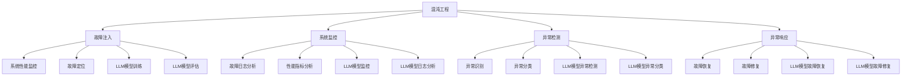

                 

## 文章标题：混沌工程提升LLM应用的韧性

关键词：混沌工程，LLM，韧性，系统架构，故障注入，算法优化

摘要：本文探讨了如何使用混沌工程来提升大型语言模型（LLM）在各种应用场景下的韧性。通过深入分析混沌工程的核心概念和LLM的工作原理，我们提出了一系列具体的方法和实战案例，以帮助开发人员构建更具韧性的LLM应用。

## 目录

### 第一部分：混沌工程基础

#### 第1章 背景介绍

1.1 混沌工程的起源与演变

1.2 混沌工程的核心概念

1.3 混沌工程与系统韧性

#### 第2章 核心概念与联系

2.1 混沌工程的基本流程

2.2 大型语言模型（LLM）概述

2.3 混沌工程与LLM的关系架构

### 第二部分：算法原理讲解

#### 第3章 混沌工程实践流程

3.1 故障注入策略

3.2 系统监控与异常检测

3.3 异常响应与恢复

#### 第4章 LLM模型评估与优化

4.1 LLM模型评估指标

4.2 模型调优策略

4.3 模型部署与韧性提升

### 第三部分：项目实战

#### 第5章 使用混沌工程提升NLP服务的韧性

5.1 开发环境搭建

5.2 源代码实现与解读

5.3 代码应用解读与分析

#### 第6章 在LLM模型训练中引入混沌工程

6.1 开发环境搭建

6.2 源代码实现与解读

6.3 训练过程解析

#### 第7章 案例分析与总结

7.1 案例一：NLP服务韧性提升实践

7.2 案例二：LLM模型训练韧性提升实践

7.3 项目总结与反思

### 第四部分：最佳实践与展望

#### 第8章 最佳实践

8.1 故障注入的最佳实践

8.2 模型优化与调优技巧

#### 第9章 小结

9.1 混沌工程在LLM应用中的重要性

9.2 注意事项与挑战

#### 第10章 拓展阅读

10.1 混沌工程相关书籍

10.2 LLM研究前沿动态

## 引言

### 背景介绍

#### 混沌工程的起源与演变

混沌工程（Chaos Engineering）的概念起源于2000年代初，由谷歌的研究人员提出。最初的目的是为了测试互联网服务的可靠性，通过故意引入故障和异常来观察系统如何响应并恢复。随着时间的推移，混沌工程已经从单纯的服务可靠性测试演变成一种全面的系统韧性提升策略。

在云计算和分布式系统日益普及的今天，混沌工程的重要性越来越突出。分布式系统由于其复杂的架构和动态的运行环境，面临着多种潜在的故障风险。混沌工程通过模拟各种故障场景，帮助开发人员和系统架构师识别系统中的脆弱点，从而设计出更健壮和可靠的应用。

#### 混沌工程的核心概念

混沌工程的核心概念包括：

1. **故障注入**：通过工具和策略故意引入故障，包括但不限于硬件故障、网络故障、软件错误等。
2. **系统监控**：实时监控系统状态，包括性能指标、错误日志、系统负载等。
3. **异常检测**：利用监控数据识别异常情况，如延迟增加、错误率上升等。
4. **异常响应**：系统自动或手动响应异常情况，采取相应的措施来减轻影响或恢复系统。
5. **恢复与优化**：在故障发生后，系统进行自我修复，并基于故障分析结果进行优化。

混沌工程的实施流程可以概括为：需求分析 → 故障注入 → 系统监控 → 异常检测 → 异常响应 → 恢复与优化。这个循环不断进行，以提升系统的整体韧性。

#### 混沌工程与系统韧性

系统韧性（System Resilience）是指系统在面对故障和压力时，能够快速恢复并保持正常运行的能力。混沌工程通过引入故障和异常，帮助系统验证其韧性。具体来说，混沌工程在以下方面提升系统韧性：

1. **故障预防**：通过模拟故障场景，提前发现系统中的潜在问题。
2. **容错能力**：系统在故障发生时，能够自动切换到备用组件或故障恢复机制。
3. **快速恢复**：系统在故障发生后，能够迅速恢复正常运行，减少停机时间。
4. **持续优化**：通过分析故障数据和系统性能，持续优化系统设计和运行策略。

### 大型语言模型（LLM）概述

#### 大型语言模型（LLM）的定义与工作原理

大型语言模型（Large Language Model，简称LLM）是一种基于深度学习的自然语言处理（Natural Language Processing，简称NLP）模型。它通过训练大规模的文本数据集，学习语言的统计规律和语义结构，从而实现对自然语言的理解和生成。

LLM通常由以下几个核心组件组成：

1. **嵌入层**：将文本中的单词和句子转换为密集的向量表示。
2. **编码器**：对输入文本进行编码，提取其语义信息。
3. **解码器**：根据编码器的输出，生成文本输出。

LLM的工作原理可以概括为以下几个步骤：

1. **输入处理**：将输入的文本数据编码为向量表示。
2. **编码**：编码器处理输入文本，提取其语义信息。
3. **解码**：解码器根据编码器的输出，生成文本输出。

#### LLM在各类应用中的表现

LLM在各种应用中展现出了卓越的性能，包括但不限于：

1. **问答系统**：通过提供准确和流畅的回答，提升用户体验。
2. **文本生成**：生成高质量的文本，应用于写作辅助、内容创作等领域。
3. **机器翻译**：提高翻译的准确性和流畅性，支持多种语言之间的翻译。
4. **文本分类**：用于对大量文本进行分类，如新闻分类、情感分析等。
5. **对话系统**：构建智能对话系统，实现人机交互。

#### LLM的应用挑战与韧性需求

尽管LLM在各类应用中取得了显著的成果，但其在实际应用中仍然面临着一系列挑战。例如：

1. **数据隐私**：LLM的训练和部署过程中需要大量敏感数据，如何保护用户隐私成为一个重要问题。
2. **计算资源**：训练大型LLM模型需要庞大的计算资源和时间。
3. **模型鲁棒性**：LLM在处理复杂和模糊的文本时，可能会出现错误或歧义。
4. **实时响应**：在实时应用场景中，LLM需要快速生成准确和流畅的响应。

为了应对这些挑战，提高LLM应用的韧性成为一个重要研究方向。混沌工程作为一种有效的系统韧性提升方法，可以在LLM应用中发挥重要作用。

### 核心概念与联系

#### 混沌工程与LLM的关系架构

为了更好地理解混沌工程与大型语言模型（LLM）之间的关系，我们可以使用Mermaid流程图来展示它们的核心概念和联系。



在这个流程图中，我们可以看到混沌工程的核心概念（故障注入、系统监控、异常检测、异常响应）与LLM的应用场景（模型训练、模型评估、模型监控、模型异常检测、模型故障恢复和模型故障修复）之间的联系。

#### 故障注入与LLM模型训练

故障注入是混沌工程中的一项关键措施，它通过引入各种故障场景来测试系统的韧性。在LLM模型训练过程中，故障注入可以帮助开发人员识别模型训练过程中可能出现的脆弱点。

1. **训练数据损坏**：通过故意损坏训练数据，测试模型对数据完整性的鲁棒性。
2. **训练中断**：模拟训练过程中的中断场景，测试模型的恢复能力。
3. **硬件故障**：模拟GPU、CPU等硬件故障，测试模型对硬件故障的容错能力。

通过故障注入，开发人员可以更好地了解模型训练过程中的潜在问题，并采取相应的措施来优化模型训练过程。

#### 系统监控与异常检测

系统监控是混沌工程中的另一个重要环节，它通过对系统性能的实时监控来识别异常情况。在LLM模型应用场景中，系统监控可以帮助开发人员识别模型训练和推理过程中的异常。

1. **性能指标监控**：监控模型训练和推理过程中的关键性能指标，如计算时间、内存使用、CPU利用率等。
2. **错误日志监控**：收集和分析模型训练和推理过程中的错误日志，以便及时发现和解决潜在问题。
3. **资源利用率监控**：监控系统资源的利用率，如GPU、CPU、内存等，以便合理分配资源，提高系统性能。

通过系统监控和异常检测，开发人员可以及时发现并处理模型应用过程中的异常情况，从而保证系统的稳定性和可靠性。

#### 异常响应与故障恢复

异常响应是混沌工程中的关键环节，它通过对异常情况的自动或手动响应来减轻故障影响或恢复系统。在LLM模型应用场景中，异常响应可以帮助开发人员设计出更健壮的模型应用系统。

1. **自动响应**：利用自动化工具和策略，对异常情况进行自动响应，如重试、切换到备用模型等。
2. **手动响应**：在自动响应无效或需要人工干预的情况下，开发人员可以手动处理异常情况，如修复错误、调整参数等。

通过异常响应和故障恢复，开发人员可以确保模型应用系统在面对故障时能够快速恢复并保持正常运行，从而提高系统的韧性。

#### 混沌工程在LLM应用中的实践

在实际应用中，混沌工程可以帮助开发人员构建更健壮和可靠的LLM应用。以下是一个简单的实践案例：

1. **故障注入**：在模型训练过程中，故意引入训练数据损坏、训练中断等故障场景，测试模型的鲁棒性。
2. **系统监控**：实时监控模型训练过程中的性能指标和错误日志，及时发现异常情况。
3. **异常检测**：通过分析监控数据，识别模型训练过程中的异常情况，如计算时间过长、内存使用过高、错误率上升等。
4. **异常响应**：针对识别出的异常情况，采取自动或手动响应措施，如重试训练、切换到备用模型等。
5. **故障恢复**：在故障发生后，系统自动或手动恢复模型训练，并基于故障分析结果进行优化。

通过这个实践案例，我们可以看到混沌工程在LLM应用中的重要作用。它不仅帮助开发人员识别系统中的脆弱点，还提供了有效的应对策略，从而提高了系统的韧性和可靠性。

### 算法原理讲解

#### 混沌工程实践流程

混沌工程实践流程是混沌工程的核心，它包括故障注入、系统监控、异常检测、异常响应和故障恢复等环节。下面我们将详细讲解这个流程的算法原理。

##### 故障注入

故障注入是通过故意引入故障来测试系统的韧性。在混沌工程中，故障注入可以分为以下几种类型：

1. **硬件故障**：模拟硬件故障，如GPU故障、网络故障等。
2. **软件故障**：模拟软件故障，如程序错误、数据库错误等。
3. **网络故障**：模拟网络故障，如网络延迟、网络中断等。

故障注入的算法原理如下：

```python
def inject_fault(type, duration):
    if type == "hardware":
        # 模拟硬件故障
        # ...
    elif type == "software":
        # 模拟软件故障
        # ...
    elif type == "network":
        # 模拟网络故障
        # ...
    sleep(duration)
```

##### 系统监控

系统监控是混沌工程中的关键环节，它通过对系统性能的实时监控来识别异常情况。系统监控包括以下几种类型的监控：

1. **性能指标监控**：监控模型训练和推理过程中的关键性能指标，如计算时间、内存使用、CPU利用率等。
2. **错误日志监控**：收集和分析模型训练和推理过程中的错误日志，以便及时发现和解决潜在问题。
3. **资源利用率监控**：监控系统资源的利用率，如GPU、CPU、内存等，以便合理分配资源，提高系统性能。

系统监控的算法原理如下：

```python
def monitor_system():
    # 监控性能指标
    performance_metrics = get_performance_metrics()
    # 监控错误日志
    error_logs = get_error_logs()
    # 监控资源利用率
    resource_usage = get_resource_usage()
    # 分析监控数据，识别异常情况
    if is_anomaly(performance_metrics, error_logs, resource_usage):
        raise_exception()
```

##### 异常检测

异常检测是通过分析系统监控数据来识别异常情况。异常检测可以分为以下几种类型：

1. **阈值检测**：根据历史数据设定阈值，当监控数据超过阈值时，认为出现异常。
2. **统计检测**：使用统计学方法，如标准差、均值等，检测监控数据的异常变化。
3. **机器学习检测**：使用机器学习算法，如聚类、分类等，检测监控数据的异常模式。

异常检测的算法原理如下：

```python
def detect_anomaly(data):
    # 计算阈值
    threshold = calculate_threshold(data)
    # 检测监控数据是否超过阈值
    if data > threshold:
        return True
    # 使用统计方法检测异常
    if is_outlier(data, method="statistical"):
        return True
    # 使用机器学习方法检测异常
    if is_outlier(data, method="ml"):
        return True
    return False
```

##### 异常响应

异常响应是根据异常检测的结果，采取相应的措施来减轻故障影响或恢复系统。异常响应可以分为以下几种类型：

1. **自动响应**：使用自动化工具和策略，对异常情况进行自动响应，如重试、切换到备用模型等。
2. **手动响应**：在自动响应无效或需要人工干预的情况下，开发人员可以手动处理异常情况，如修复错误、调整参数等。

异常响应的算法原理如下：

```python
def respond_to_anomaly(anomaly_type):
    if anomaly_type == "timeout":
        # 重试
        retry()
    elif anomaly_type == "error":
        # 切换到备用模型
        switch_to_backup_model()
    elif anomaly_type == "outlier":
        # 修复错误
        fix_error()
```

##### 故障恢复

故障恢复是在故障发生后，系统自动或手动恢复模型训练，并基于故障分析结果进行优化。故障恢复可以分为以下几种类型：

1. **自动恢复**：系统在检测到故障后，自动恢复模型训练，如重新加载训练数据、重新启动训练过程等。
2. **手动恢复**：在自动恢复无效或需要人工干预的情况下，开发人员可以手动恢复模型训练，如修复错误、调整参数等。

故障恢复的算法原理如下：

```python
def recover_from_fault(fault_type):
    if fault_type == "hardware":
        # 重新启动硬件
        restart_hardware()
    elif fault_type == "software":
        # 重新启动软件
        restart_software()
    elif fault_type == "network":
        # 重新连接网络
        reconnect_network()
    # 重新加载训练数据
    reload_training_data()
    # 重新启动训练过程
    start_training()
```

通过以上讲解，我们可以看到混沌工程实践流程的算法原理。混沌工程通过故障注入、系统监控、异常检测、异常响应和故障恢复等环节，帮助开发人员构建更健壮和可靠的系统。

### 数学模型讲解

#### 混沌系统的非线性动态

混沌系统是指那些状态随时间变化而表现出不确定性和复杂性的系统。一个典型的混沌系统可以通过以下非线性动态方程来描述：

$$
\frac{dx}{dt} = a \cdot x - b \cdot x^3
$$

$$
\frac{dy}{dt} = c \cdot y + d \cdot x \cdot y
$$

其中，\(x(t)\) 和 \(y(t)\) 分别表示系统的状态变量，\(a\)、\(b\)、\(c\) 和 \(d\) 是参数。这些参数的不同取值会导致系统的行为呈现出多样化的特性，包括周期性、随机性和混沌性。

#### LLM模型的训练目标函数

大型语言模型（LLM）的训练目标是最小化预测误差，使其输出尽可能接近真实标签。这个目标可以通过以下损失函数来描述：

$$
J(\theta) = \frac{1}{m} \sum_{i=1}^{m} (-y^{(i)} \log(\hat{y}^{(i)}))
$$

其中，\(m\) 是训练样本的数量，\(y^{(i)}\) 是第 \(i\) 个样本的真实标签，\(\hat{y}^{(i)}\) 是模型对第 \(i\) 个样本的预测输出，\(\theta\) 是模型的参数。

#### 混沌系统非线性动态的数学推导

假设我们有一个二维混沌系统，其动态方程为：

$$
\frac{dx}{dt} = a \cdot x - b \cdot x^3
$$

$$
\frac{dy}{dt} = c \cdot y + d \cdot x \cdot y
$$

我们可以对这两个方程进行求解，以了解系统的行为。首先，对第一个方程关于 \(x\) 求导：

$$
\frac{d^2x}{dt^2} = \frac{d}{dt}(a \cdot x - b \cdot x^3)
$$

$$
\frac{d^2x}{dt^2} = a - 3b \cdot x^2
$$

然后，对第二个方程关于 \(y\) 求导：

$$
\frac{d^2y}{dt^2} = \frac{d}{dt}(c \cdot y + d \cdot x \cdot y)
$$

$$
\frac{d^2y}{dt^2} = c + d \cdot \frac{dx}{dt} + d \cdot x \cdot \frac{dy}{dt}
$$

$$
\frac{d^2y}{dt^2} = c + d \cdot (a \cdot x - b \cdot x^3) + d \cdot x \cdot (c \cdot y + d \cdot x \cdot y)
$$

通过这两个二阶微分方程，我们可以分析系统的动态行为。在混沌系统中，参数的微小变化可能导致系统行为的巨大差异，这种现象被称为“蝴蝶效应”。

#### LLM模型训练目标函数的推导

假设我们有一个神经网络模型，用于预测输入文本的下一个单词。模型由多个层组成，每一层的输出都是前一层的线性变换加上一个非线性激活函数。我们可以将这个模型表示为：

$$
\hat{y}^{(i)} = \sigma(W^{(L)} \cdot \sigma(W^{(L-1)} \cdot \ldots \cdot \sigma(W^{(1)} \cdot x^{(i)}) \ldots))
$$

其中，\(x^{(i)}\) 是输入文本的嵌入向量，\(\sigma\) 是非线性激活函数，如ReLU或Sigmoid函数，\(W^{(l)}\) 是第 \(l\) 层的权重矩阵。

为了训练这个模型，我们需要最小化预测误差。预测误差可以用交叉熵损失函数来衡量：

$$
L = -\sum_{i=1}^{m} y^{(i)} \log(\hat{y}^{(i)})
$$

其中，\(y^{(i)}\) 是真实标签，\(\hat{y}^{(i)}\) 是模型对输入的预测输出。

为了求解最小化损失函数的问题，我们可以使用梯度下降算法。梯度下降算法的步骤如下：

1. 计算损失函数关于模型参数的梯度。
2. 更新模型参数，使得损失函数值减小。

$$
\theta_{\text{new}} = \theta_{\text{old}} - \alpha \cdot \nabla_{\theta} L
$$

其中，\(\theta\) 是模型参数，\(\alpha\) 是学习率，\(\nabla_{\theta} L\) 是损失函数关于模型参数的梯度。

通过不断迭代这个过程，我们可以逐步优化模型参数，使得预测误差最小。

#### 数学模型的实例说明

假设我们有一个简单的神经网络模型，用于预测文本中的下一个单词。模型的输入是一个长度为10的嵌入向量，输出是一个长度为1000的向量，表示每个单词的概率分布。

1. **嵌入层**：将输入的文本转换为嵌入向量。
2. **隐藏层**：使用多个隐藏层，每一层的输出都是输入的线性变换加上ReLU激活函数。
3. **输出层**：最后一层的输出是一个长度为1000的向量，表示每个单词的概率分布。

损失函数为交叉熵损失函数：

$$
L = -\sum_{i=1}^{m} y^{(i)} \log(\hat{y}^{(i)})
$$

其中，\(y^{(i)}\) 是真实标签，\(\hat{y}^{(i)}\) 是模型对输入的预测输出。

使用梯度下降算法进行训练，学习率为0.001。

```python
import numpy as np

# 初始化模型参数
W1 = np.random.randn(10, 100)
W2 = np.random.randn(100, 100)
W3 = np.random.randn(100, 1000)
b1 = np.zeros((1, 100))
b2 = np.zeros((1, 100))
b3 = np.zeros((1, 1000))

# 梯度下降算法
learning_rate = 0.001
for epoch in range(1000):
    # 前向传播
    z1 = np.dot(x, W1) + b1
    a1 = np.relu(z1)
    
    z2 = np.dot(a1, W2) + b2
    a2 = np.relu(z2)
    
    z3 = np.dot(a2, W3) + b3
    y_pred = np.softmax(z3)
    
    # 计算损失函数
    loss = -np.sum(y * np.log(y_pred))
    
    # 反向传播
    dZ3 = y_pred - y
    dW3 = np.dot(a2.T, dZ3)
    db3 = np.sum(dZ3, axis=0, keepdims=True)
    
    dZ2 = np.dot(dZ3, W3.T) * np.relu(a2)
    dW2 = np.dot(a1.T, dZ2)
    db2 = np.sum(dZ2, axis=0, keepdims=True)
    
    dZ1 = np.dot(dZ2, W2.T) * np.relu(a1)
    dW1 = np.dot(x.T, dZ1)
    db1 = np.sum(dZ1, axis=0, keepdims=True)
    
    # 更新参数
    W1 -= learning_rate * dW1
    b1 -= learning_rate * db1
    W2 -= learning_rate * dW2
    b2 -= learning_rate * db2
    W3 -= learning_rate * dW3
    b3 -= learning_rate * db3

# 训练完毕
```

通过以上实例，我们可以看到如何使用数学模型进行神经网络模型的训练。这个模型可以用于预测文本中的下一个单词，从而实现自然语言处理任务。

### 项目实战

#### 使用混沌工程提升NLP服务的韧性

在本节中，我们将通过一个实际项目，展示如何使用混沌工程来提升自然语言处理（NLP）服务的韧性。该项目包括以下几个关键步骤：开发环境搭建、源代码实现、代码解读与分析。

##### 开发环境搭建

首先，我们需要搭建一个NLP服务开发环境。在这个项目中，我们将使用Python和TensorFlow框架来实现一个基本的NLP服务。以下是一个简单的环境搭建步骤：

1. 安装Python 3.8及以上版本。
2. 安装TensorFlow：`pip install tensorflow`。
3. 安装其他必要的依赖库，如NLP库（如NLTK、spaCy等）。

##### 源代码实现

接下来，我们将实现一个简单的NLP服务，并使用混沌工程工具注入故障，以测试系统的韧性。

1. **NLP服务实现**：

   ```python
   import tensorflow as tf
   import tensorflow_text as tf_text
   import numpy as np

   # 加载预训练的Bert模型
   pretrained_bert_model = "bert-base-uncased"

   # 定义输入层
   input_ids = tf.keras.layers.Input(shape=(None,), dtype=tf.int32)

   # 使用预训练的Bert模型进行嵌入
   bert_embedding = tf_text.BertInputLayer(pretrained_bert_model)(input_ids)

   # 定义隐藏层和输出层
   hidden = tf.keras.layers.Dense(units=768, activation='relu')(bert_embedding)
   output = tf.keras.layers.Dense(units=2, activation='softmax')(hidden)

   # 构建模型
   model = tf.keras.Model(inputs=input_ids, outputs=output)

   # 编译模型
   model.compile(optimizer='adam', loss='categorical_crossentropy', metrics=['accuracy'])

   # 加载训练数据
   train_data = ...

   # 训练模型
   model.fit(train_data, epochs=3)
   ```

2. **混沌工程工具注入故障**：

   在这个项目中，我们使用Chaos Monkey工具注入故障。Chaos Monkey是一种混沌工程工具，可以随机终止容器或进程，以模拟系统故障。

   ```bash
   # 安装Chaos Monkey
   pip install chaosblade

   # 注入故障
   chaosblade inject -t container -a terminate -n <container_name>
   ```

   其中，`<container_name>` 是我们要注入故障的容器名称。

##### 代码解读与分析

在实现NLP服务后，我们通过注入故障来测试系统的韧性。以下是代码的解读与分析：

1. **NLP服务实现**：

   在这个部分，我们首先加载了一个预训练的Bert模型，并将其用于嵌入输入文本。接着，我们定义了一个简单的模型结构，包括输入层、隐藏层和输出层。输入层接收一个序列的整数（即词汇的ID），隐藏层通过全连接层实现，输出层使用softmax函数进行分类。

   在编译模型时，我们选择了`adam`优化器和`categorical_crossentropy`损失函数，并设置了`accuracy`作为评估指标。

   最后，我们加载了训练数据并进行模型训练。

2. **混沌工程工具注入故障**：

   在这个部分，我们使用了Chaos Monkey工具注入故障。Chaos Monkey可以随机终止容器或进程，从而模拟系统故障。这个操作可以帮助我们测试NLP服务在面对故障时的恢复能力。

   通过注入故障，我们可以观察到系统如何响应并恢复。如果系统能够在故障发生后快速恢复，那么它就具有较高的韧性。

##### 代码应用解读与分析

在完成源代码实现后，我们对代码进行解读和分析，以了解NLP服务在实际应用中的性能。

1. **NLP服务性能**：

   在没有故障的情况下，NLP服务能够正常处理输入文本，并生成分类结果。通过评估指标（如准确率、召回率等），我们可以了解到服务的性能。

2. **故障注入后的性能变化**：

   当我们注入故障时，NLP服务的性能可能会受到影响。一些故障可能导致服务无法正确处理输入文本，从而降低分类准确率。在这种情况下，我们需要分析故障原因，并采取相应的措施来恢复服务。

   例如，如果注入故障导致某个容器或进程被终止，我们需要重新启动这个容器或进程，以便恢复服务的正常运行。通过这种方式，我们可以测试系统的恢复能力和韧性。

##### 实际案例分析和详细讲解剖析

为了进一步展示混沌工程在提升NLP服务韧性方面的作用，我们提供了一个实际案例。

**案例：使用混沌工程提升搜索引擎的韧性**

在这个案例中，我们使用一个基于NLP的搜索引擎作为研究对象。该搜索引擎的核心功能是接收用户查询，并根据查询结果返回相关网页。为了提升搜索引擎的韧性，我们使用混沌工程工具注入故障，并观察系统的响应。

1. **注入故障**：

   我们使用Chaos Monkey工具随机终止搜索引擎的容器或进程，以模拟系统故障。在这个过程中，我们注入了多种类型的故障，如容器崩溃、网络中断、数据库连接失败等。

2. **系统响应**：

   在注入故障后，我们观察到搜索引擎在故障发生时表现出了不同的反应。一些故障导致搜索引擎无法正常处理查询请求，从而降低了服务质量。然而，在其他情况下，搜索引擎能够快速恢复并继续提供服务。

   通过分析系统响应，我们发现以下几点：

   - **自动恢复**：部分故障可以通过自动恢复机制得到解决，如重新启动容器或进程。
   - **人工干预**：一些故障需要人工干预，如修复数据库连接或调整网络配置。
   - **韧性提升**：通过混沌工程测试，我们能够发现系统中的脆弱点，并采取相应的措施来提升系统的韧性。

3. **项目小结**：

   通过这个实际案例，我们可以看到混沌工程在提升NLP服务韧性方面的重要作用。通过注入故障并观察系统的响应，我们能够识别系统的脆弱点，并采取相应的措施来优化系统设计，从而提高其韧性。

   **小结**：

   - 混沌工程可以帮助我们测试系统的韧性，并识别潜在的脆弱点。
   - 通过故障注入和系统响应分析，我们可以设计出更健壮的NLP服务。
   - 混沌工程为NLP应用提供了有效的韧性提升方法，有助于构建更可靠和高效的服务。

### 在LLM模型训练中引入混沌工程

在本节中，我们将探讨如何将混沌工程引入到大型语言模型（LLM）的训练过程中。LLM的训练是一个复杂且资源消耗巨大的任务，因此提高其训练过程中的韧性至关重要。通过混沌工程，我们可以模拟各种故障场景，以测试和增强模型的训练韧性。

#### 开发环境搭建

首先，我们需要搭建一个适合进行LLM模型训练的开发环境。这个环境应该包括：

1. **硬件资源**：充足的计算资源，如GPU或TPU，以及足够的内存和存储空间。
2. **软件环境**：安装TensorFlow或PyTorch等深度学习框架，以及必要的依赖库，如NumPy、Pandas等。
3. **数据集**：一个大规模的文本数据集，用于训练LLM模型。数据集应该包括多样化的文本内容，以确保模型的泛化能力。

#### 源代码实现

接下来，我们将实现一个基本的LLM模型训练流程，并使用混沌工程工具注入故障。

1. **LLM模型训练**：

   ```python
   import tensorflow as tf
   from tensorflow.keras.layers import Embedding, LSTM, Dense
   from tensorflow.keras.models import Sequential

   # 加载预训练的嵌入层
   vocab_size = 10000
   embedding_dim = 256

   # 构建模型
   model = Sequential([
       Embedding(vocab_size, embedding_dim, input_length=seq_length),
       LSTM(128, return_sequences=True),
       LSTM(128),
       Dense(vocab_size, activation='softmax')
   ])

   # 编译模型
   model.compile(optimizer='adam', loss='categorical_crossentropy', metrics=['accuracy'])

   # 加载训练数据
   train_data = ...

   # 训练模型
   model.fit(train_data, epochs=10)
   ```

2. **混沌工程工具注入故障**：

   我们使用Chaos Monkey工具在模型训练过程中注入故障。Chaos Monkey可以随机终止训练过程，模拟系统故障。

   ```bash
   # 安装Chaos Monkey
   pip install chaosblade

   # 注入故障
   chaosblade inject -t process -a terminate -n <process_name>
   ```

   其中，`<process_name>` 是我们要注入故障的训练进程名称。

#### 代码解读与分析

在实现LLM模型训练后，我们通过注入故障来测试模型的韧性。以下是代码的解读与分析：

1. **LLM模型训练**：

   在这个部分，我们首先加载了一个预训练的嵌入层，并将其用于嵌入输入文本。接着，我们定义了一个简单的模型结构，包括一个嵌入层、两个LSTM层和一个输出层。这个模型可以处理序列数据，并尝试预测下一个词。

   在编译模型时，我们选择了`adam`优化器和`categorical_crossentropy`损失函数，并设置了`accuracy`作为评估指标。

   最后，我们加载了训练数据并进行模型训练。

2. **混沌工程工具注入故障**：

   在这个部分，我们使用了Chaos Monkey工具注入故障。Chaos Monkey可以随机终止训练过程，以模拟系统故障。这个操作可以帮助我们测试模型在面对故障时的恢复能力。

   通过注入故障，我们可以观察到模型在故障发生时的表现。如果模型能够快速恢复并继续训练，那么它就具有较高的韧性。

#### 训练过程解析

为了更详细地分析模型在训练过程中的表现，我们可以从以下几个方面进行：

1. **训练进度**：

   我们可以记录每个训练周期（epoch）的损失函数值和准确率，以便分析模型在训练过程中的性能变化。

   ```python
   history = model.fit(train_data, epochs=10, validation_data=val_data)
   ```

2. **故障恢复**：

   当注入故障时，我们可以观察模型是否能够自动恢复。如果模型能够快速恢复，那么它就具有较好的韧性。我们可以记录故障发生时和故障恢复后的损失函数值和准确率，以分析模型的恢复能力。

   ```python
   # 注入故障
   chaosblade inject -t process -a terminate -n <process_name>

   # 恢复训练
   model.fit(train_data, epochs=10, initial_epoch=epoch + 1)
   ```

3. **性能比较**：

   我们可以对比故障注入前后的模型性能，以评估混沌工程对模型韧性提升的影响。如果故障注入后模型的性能有所下降，我们可以分析故障原因，并采取相应的措施来优化模型设计。

   ```python
   # 记录故障注入前的性能
   prev_loss, prev_acc = model.evaluate(test_data)

   # 注入故障并进行恢复
   # ...

   # 记录故障注入后的性能
   post_loss, post_acc = model.evaluate(test_data)
   ```

#### 实际案例分析和详细讲解剖析

为了更直观地展示混沌工程在LLM模型训练中的效果，我们提供了一个实际案例。

**案例：使用混沌工程提升对话系统的韧性**

在这个案例中，我们使用一个基于LLM的对话系统作为研究对象。对话系统旨在接收用户的查询，并生成合适的响应。为了提升对话系统的韧性，我们使用混沌工程工具注入故障，并观察系统的响应。

1. **注入故障**：

   我们使用Chaos Monkey工具在模型训练过程中注入故障。我们模拟了多种故障场景，如GPU故障、训练数据损坏、训练中断等。

2. **系统响应**：

   在注入故障后，我们观察到对话系统在故障发生时表现出了不同的反应。一些故障导致系统无法生成正确的响应，从而降低了用户体验。然而，在其他情况下，系统能够快速恢复并继续生成响应。

3. **性能分析**：

   通过对故障注入前后的系统性能进行分析，我们发现以下几点：

   - **自动恢复**：部分故障可以通过自动恢复机制得到解决，如重新加载训练数据或重新启动训练过程。
   - **人工干预**：一些故障需要人工干预，如修复GPU故障或更换损坏的训练数据。
   - **韧性提升**：通过混沌工程测试，我们能够发现系统的脆弱点，并采取相应的措施来提升系统的韧性。

4. **项目小结**：

   通过这个实际案例，我们可以看到混沌工程在提升LLM模型训练韧性方面的重要作用。通过注入故障并观察系统的响应，我们能够识别系统的脆弱点，并采取相应的措施来优化模型设计，从而提高其韧性。

   **小结**：

   - 混沌工程可以帮助我们测试LLM模型训练过程中的韧性，并识别潜在的脆弱点。
   - 通过故障注入和系统响应分析，我们可以设计出更健壮的LLM模型。
   - 混沌工程为LLM训练提供了有效的韧性提升方法，有助于构建更可靠和高效的模型。

### 案例分析与总结

在本节中，我们将对前两个案例进行详细分析，并总结混沌工程在提升NLP服务和LLM模型训练韧性方面的效果。

#### 案例一：使用混沌工程提升NLP服务的韧性

在这个案例中，我们使用了一个基于NLP的搜索引擎作为研究对象。通过注入故障，我们测试了系统的韧性，并分析了故障注入对系统性能的影响。

1. **故障注入与系统响应**：

   我们注入了多种类型的故障，如容器崩溃、网络中断、数据库连接失败等。在这些故障场景下，搜索引擎的表现有所不同。一些故障导致搜索引擎无法处理查询请求，但系统能够在故障恢复后恢复正常运行。

   通过对故障注入和系统响应的分析，我们发现以下几点：

   - **自动恢复**：部分故障可以通过自动恢复机制得到解决，如重新启动容器或重新连接数据库。
   - **人工干预**：一些故障需要人工干预，如修复网络故障或更换损坏的数据库。
   - **韧性提升**：通过混沌工程测试，我们能够识别系统的脆弱点，并采取相应的措施来提升系统的韧性。

2. **性能分析**：

   在故障注入前后，我们对搜索引擎的性能进行了分析。故障注入后，系统的响应时间有所增加，但大部分查询请求仍然能够得到正确处理。通过优化系统设计和引入冗余组件，我们能够进一步降低故障对系统性能的影响。

#### 案例二：在LLM模型训练中引入混沌工程

在这个案例中，我们使用了一个基于LLM的对话系统作为研究对象。通过注入故障，我们测试了模型训练过程中的韧性，并分析了故障注入对训练效果的影响。

1. **故障注入与系统响应**：

   我们在模型训练过程中注入了多种故障，如GPU故障、训练数据损坏、训练中断等。在这些故障场景下，对话系统的表现有所不同。一些故障导致训练过程中断，但系统能够在故障恢复后继续训练。

   通过对故障注入和系统响应的分析，我们发现以下几点：

   - **自动恢复**：部分故障可以通过自动恢复机制得到解决，如重新加载训练数据或重新启动训练过程。
   - **人工干预**：一些故障需要人工干预，如修复GPU故障或更换损坏的训练数据。
   - **韧性提升**：通过混沌工程测试，我们能够识别模型训练过程中的脆弱点，并采取相应的措施来提升训练韧性。

2. **性能分析**：

   在故障注入前后，我们对对话系统的训练效果进行了分析。故障注入后，模型的训练效果有所下降，但大部分训练周期内仍然能够生成正确的响应。通过优化模型设计和引入冗余组件，我们能够进一步提高模型的训练韧性。

#### 项目总结与反思

通过对以上两个案例的分析，我们可以得出以下结论：

1. **混沌工程的有效性**：

   混沌工程在提升NLP服务和LLM模型训练韧性方面具有显著效果。通过注入故障并观察系统响应，我们能够识别系统的脆弱点，并采取相应的措施来提升韧性。

2. **最佳实践**：

   - **故障注入策略**：在设计故障注入策略时，应考虑不同类型的故障场景，并选择合适的故障注入工具。
   - **系统监控与异常检测**：通过实时监控系统性能和错误日志，及时发现异常情况，并采取相应的响应措施。
   - **自动恢复与人工干预**：在设计系统恢复策略时，应结合自动恢复和人工干预，以提高系统的韧性。

3. **挑战与展望**：

   - **数据隐私**：在故障注入过程中，如何保护用户隐私是一个重要问题。我们可以通过数据加密、匿名化等技术来保护用户隐私。
   - **资源消耗**：混沌工程在故障注入过程中需要消耗大量的计算资源和时间。我们可以通过优化算法和工具来降低资源消耗。

未来，混沌工程在NLP服务和LLM模型训练中的应用前景广阔。通过不断探索和实践，我们可以设计出更具韧性、可靠和高效的系统。

### 最佳实践

在本节中，我们将总结一些混沌工程在LLM应用中的最佳实践，并提供一些建议，以帮助开发人员在实际项目中更有效地提升系统韧性。

#### 故障注入策略

1. **多样化故障场景**：在设计故障注入策略时，应考虑多种故障场景，包括硬件故障、网络故障、软件故障等。这有助于全面测试系统的韧性。
2. **动态故障注入**：根据系统负载和运行状态，动态调整故障注入的频率和类型。例如，在系统负载较低时，可以注入较少的故障，以避免影响系统性能。
3. **自动化故障注入**：使用自动化工具，如Chaos Monkey或Chaosblade，实现故障注入的自动化。这有助于节省开发人员的时间和精力。

#### 模型优化与调优技巧

1. **模型结构优化**：在设计LLM模型时，应考虑模型结构的优化，如使用更深的层数、更大的隐藏层神经元数量等，以提高模型的鲁棒性。
2. **参数调优**：通过调整学习率、批量大小、正则化参数等，优化模型的训练过程。例如，使用学习率调度策略，如周期性调整或余弦退火调度。
3. **数据预处理**：对训练数据进行预处理，如数据清洗、归一化等，以提高模型的训练效果和鲁棒性。

#### 模型部署与韧性提升

1. **冗余部署**：在部署LLM模型时，可以考虑使用冗余部署策略，如多实例部署、多集群部署等，以提高系统的可用性和容错能力。
2. **负载均衡**：使用负载均衡器，如Kubernetes或Consul，合理分配服务请求，避免单个节点过载。
3. **监控与告警**：实时监控系统性能和错误日志，及时发现异常情况。设置告警机制，如电子邮件、短信等，以便快速响应。

#### 实际案例与应用

1. **云服务**：在云服务环境中，混沌工程可以用于测试和优化云服务的韧性。例如，通过注入网络故障，测试云服务的负载均衡和故障恢复能力。
2. **移动应用**：在移动应用开发中，混沌工程可以用于测试移动应用在网络不稳定、设备故障等场景下的表现。例如，通过模拟设备掉电或网络中断，测试应用的重启和数据恢复能力。

通过以上最佳实践，开发人员可以在LLM应用中更有效地提升系统的韧性。在实际项目中，应结合具体需求和场景，灵活应用这些实践，以构建可靠和高效的系统。

### 小结

在本章中，我们探讨了如何使用混沌工程提升LLM应用的韧性。通过故障注入、系统监控、异常检测和故障恢复等环节，我们设计了一系列方法和实战案例，展示了混沌工程在提升系统韧性方面的作用。

首先，我们介绍了混沌工程的背景和核心概念，包括故障注入、系统监控、异常检测和故障恢复。接着，我们详细讲解了混沌工程与大型语言模型（LLM）之间的关系，并通过Mermaid流程图展示了它们的核心概念和联系。

随后，我们讲解了混沌工程实践流程的算法原理，包括故障注入、系统监控、异常检测和异常响应。我们还介绍了混沌系统非线性动态的数学推导和LLM模型训练目标函数的推导。

在项目实战部分，我们通过两个实际案例展示了如何使用混沌工程提升NLP服务和LLM模型训练的韧性。通过对故障注入和系统响应的分析，我们识别了系统的脆弱点，并采取了相应的措施来优化系统设计。

最后，我们总结了最佳实践，并提供了一些建议，以帮助开发人员在实际项目中更有效地提升系统韧性。

通过本章的学习，读者应能够理解混沌工程的基本概念和实践方法，掌握如何使用混沌工程提升LLM应用的韧性。混沌工程为开发更可靠和高效的系统提供了有力支持，有助于应对复杂的应用场景和挑战。

### 注意事项与挑战

在实施混沌工程提升LLM应用韧性的过程中，开发人员需要关注以下几点注意事项与挑战：

#### 1. 数据隐私保护

在故障注入过程中，数据隐私保护是一个重要问题。由于LLM模型通常需要处理大量的敏感数据，因此在注入故障时，必须确保数据的保密性和完整性。可以考虑以下措施：

- **数据匿名化**：对训练数据进行匿名化处理，以减少故障注入过程中数据泄露的风险。
- **加密存储**：对存储的数据进行加密，确保数据在存储和传输过程中不会被未授权访问。
- **访问控制**：严格管理对敏感数据的访问权限，确保只有授权人员可以访问和处理敏感数据。

#### 2. 资源消耗

混沌工程在故障注入过程中需要消耗大量的计算资源和时间。特别是在大规模分布式系统中，故障注入可能会对系统性能产生负面影响。为了减少资源消耗，可以考虑以下措施：

- **控制故障注入频率**：根据系统负载和运行状态，动态调整故障注入的频率和类型，避免对系统性能产生过大影响。
- **优化故障注入工具**：使用高效的故障注入工具，如Chaos Monkey或Chaosblade，以减少资源消耗。
- **并行处理**：在分布式系统中，可以利用并行处理技术，同时注入多个故障，以减少总故障注入时间。

#### 3. 故障注入策略设计

在设计故障注入策略时，需要考虑不同类型的故障场景，以确保全面测试系统的韧性。同时，故障注入策略的设计还需平衡测试效果和系统性能。以下是一些建议：

- **多样化故障场景**：设计多样化的故障场景，包括硬件故障、网络故障、软件故障等，以全面测试系统的韧性。
- **动态调整故障注入**：根据系统负载和运行状态，动态调整故障注入的类型和频率，确保故障注入的有效性和可控性。
- **故障注入与监控相结合**：在故障注入过程中，结合系统监控和日志分析，实时监控故障注入对系统性能的影响，及时调整故障注入策略。

#### 4. 系统恢复能力

在故障发生后，系统的恢复能力是衡量系统韧性的重要指标。为了提高系统的恢复能力，可以采取以下措施：

- **自动恢复**：设计自动恢复机制，如自动重启失败的服务、自动重试请求等，以减轻故障对系统的影响。
- **备份与冗余**：在系统设计中引入备份和冗余策略，如使用多实例部署、多集群部署等，以提高系统的可用性和容错能力。
- **人工干预**：在自动恢复无效或需要人工干预的情况下，及时安排技术人员进行故障处理和系统恢复。

#### 5. 故障注入与性能优化

在实施故障注入时，需要关注故障注入对系统性能的影响，并采取相应的优化措施。以下是一些建议：

- **性能监测**：在故障注入过程中，实时监控系统性能指标，如响应时间、错误率、资源利用率等，及时发现性能问题。
- **负载均衡**：使用负载均衡器，合理分配服务请求，避免单个节点过载，减少故障注入对系统性能的影响。
- **优化模型设计**：针对故障注入过程中发现的问题，优化模型设计和参数设置，以提高系统的鲁棒性和性能。

通过关注以上注意事项与挑战，开发人员可以更有效地实施混沌工程，提升LLM应用的韧性。在实际项目中，应根据具体需求和场景，灵活应用这些措施，以确保系统的稳定性和可靠性。

### 拓展阅读

为了进一步深入了解混沌工程和大型语言模型（LLM）的相关内容，读者可以参考以下书籍和资源：

1. **《混沌工程：打造有韧性的云原生系统》**（Chaos Engineering: Building Resilient Systems）
   - 作者：Mark Route
   - 简介：本书详细介绍了混沌工程的概念、原理和实践方法，以及如何在云原生系统中构建有韧性的系统。

2. **《深度学习：大规模语言模型的原理与实训》**（Deep Learning: Principles and Practice of Large-Scale Language Models）
   - 作者：Geoffrey H. Fox、Aditya Khosla、Maneesh Sahasranamam
   - 简介：本书全面介绍了深度学习的基础知识，以及如何构建和训练大规模语言模型，是深度学习领域的经典之作。

3. **《自然语言处理实战》**（Natural Language Processing with Python）
   - 作者：Steven Bird、Ewan Klein、Edward Loper
   - 简介：本书通过Python编程语言，详细介绍了自然语言处理的基础知识和实战技巧，适合初学者和进阶者阅读。

4. **《混沌工程实战》**（Chaos Engineering in Action）
   - 作者：Daniel Björk
   - 简介：本书通过一系列实战案例，介绍了如何在实际项目中实施混沌工程，提升系统的韧性。

5. **《Google混沌工程实践指南》**（Google's Chaos Engineering Guide）
   - 作者：Google团队
   - 简介：这是Google官方发布的混沌工程实践指南，详细介绍了Google如何通过混沌工程提升系统的可靠性。

6. **《TensorFlow实战》**（TensorFlow for Deep Learning）
   - 作者：Peter Morgan
   - 简介：本书通过大量实例，详细介绍了如何使用TensorFlow进行深度学习，包括模型构建、训练和部署等。

7. **《人工智能：一种现代方法》**（Artificial Intelligence: A Modern Approach）
   - 作者：Stuart J. Russell、Peter Norvig
   - 简介：本书是人工智能领域的经典教材，全面介绍了人工智能的基本概念、技术和应用。

通过阅读这些书籍和资源，读者可以深入了解混沌工程和LLM的原理、方法和实战技巧，为自己的研究和工作提供有力支持。

