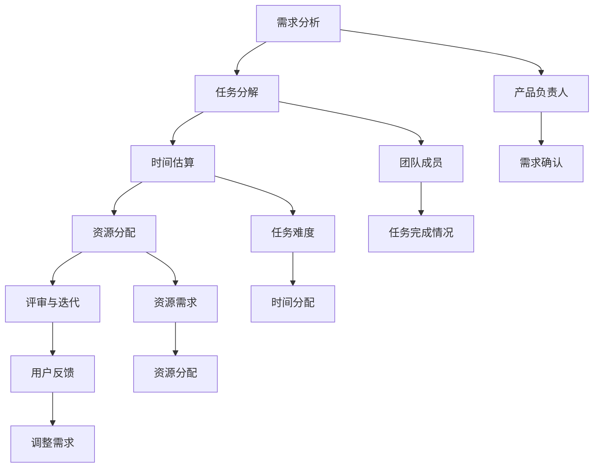

                 


## 文章标题：灵活的Sprint规划：适应大型新应用的需求变化

### 关键词：
- Sprint规划
- 大型新应用
- 需求变化
- 敏捷开发
- 项目管理

### 摘要：
本文旨在探讨如何通过灵活的Sprint规划，适应大型新应用的需求变化。文章将详细分析Sprint规划的核心概念、关键算法、数学模型及其在实际项目中的应用，并提供实际的案例分析，以帮助读者更好地理解并掌握这一技术。

## 引言

在现代软件开发的实践中，敏捷开发方法因其高效、灵活的特点，已经成为主流的开发模式。Sprint规划是敏捷开发中至关重要的一环，它帮助团队在短时间内实现具体的功能目标。然而，面对大型新应用的需求变化，传统的Sprint规划往往显得不够灵活，难以适应动态变化的需求。

本文将围绕以下几个方面展开：

1. **Sprint规划概述**：介绍Sprint规划的定义、重要性以及在敏捷开发中的角色。
2. **核心概念与联系**：使用Mermaid流程图展示Sprint规划中的核心概念及其关系。
3. **核心算法原理讲解**：详细讲解Sprint规划中的关键算法，包括任务时间估算和人力资源分配。
4. **数学模型和数学公式讲解**：设计数学模型，使用LaTeX格式展示数学公式，并给出具体实例。
5. **项目实战**：通过一个实际的项目案例，展示如何进行Sprint规划。
6. **案例分析**：分析实际的Sprint规划案例，探讨其成功与不足。
7. **挑战与解决方案**：讨论Sprint规划面临的挑战及其解决方案。
8. **未来展望**：展望Sprint规划的发展趋势及新挑战。

接下来，我们将一步步深入探讨每个部分。

## Sprint规划概述

Sprint规划是敏捷开发方法中的一个核心环节，它定义了团队在Sprint期间（通常为2-4周）需要完成的工作内容。Sprint规划旨在确保团队能够在短时间内交付有价值的功能，同时保持高效率。

### 定义与重要性

Sprint规划的定义可以从以下几个方面理解：

- **Sprint**：Sprint是一个固定的时间段，通常为2-4周，团队在这个时间段内完成一组预定的任务。
- **规划**：规划是指团队在Sprint开始前，与产品负责人（Product Owner）一起讨论并确定在Sprint期间需要完成的目标和任务。

Sprint规划的重要性体现在以下几个方面：

- **明确目标**：通过Sprint规划，团队可以明确在Sprint期间要实现的目标，确保所有成员的工作方向一致。
- **提高效率**：Sprint规划有助于团队在固定的时间段内集中精力完成任务，提高工作效率。
- **快速反馈**：Sprint规划的周期较短，可以帮助团队快速获得用户反馈，并根据反馈进行调整。

### Agile开发与Sprint规划的关系

敏捷开发（Agile Development）是一种以人为核心、迭代、循序渐进的开发方法。它强调持续交付有价值的软件，重视团队互动和响应变化的能力。Sprint规划是敏捷开发方法中不可或缺的一部分，它确保了敏捷开发的实施。

Sprint规划与敏捷开发的关系可以从以下几个方面理解：

- **迭代**：Sprint规划是迭代开发的核心，每个Sprint都是一次迭代，团队在这个时间段内完成具体的功能。
- **适应性**：Sprint规划帮助团队适应需求变化，通过不断的调整和优化，确保最终交付的产品能够满足用户需求。
- **透明性**：Sprint规划使得团队的工作进度和目标对所有人可见，有助于提高团队的透明度和协作。

### Sprint规划的关键环节

Sprint规划包括以下几个关键环节：

- **需求分析**：团队与产品负责人一起讨论并确定在Sprint期间需要实现的功能。
- **任务分解**：将需求分解为具体的任务，并为每个任务分配时间和资源。
- **时间估算**：对每个任务进行时间估算，确保团队在Sprint期间能够完成任务。
- **资源分配**：根据任务需求和团队成员的技能，合理分配资源，确保任务能够按时完成。
- **评审与迭代**：在Sprint结束时，对完成的任务进行评审，总结经验教训，并为下一个Sprint做好准备。

## 核心概念与联系

为了更好地理解Sprint规划，我们需要明确其中的核心概念，并展示它们之间的联系。以下是一个Mermaid流程图，展示了Sprint规划中的核心概念及其关系：



### 核心概念与联系解释

1. **需求分析**：需求分析是Sprint规划的第一步，团队与产品负责人一起确定在Sprint期间需要实现的功能。这是整个规划的基础。
2. **任务分解**：将需求分解为具体的任务，这是确保Sprint规划可执行性的关键。
3. **时间估算**：对每个任务进行时间估算，确保团队在Sprint期间能够完成任务。时间估算通常基于任务难度和团队成员的技能。
4. **资源分配**：根据任务需求和团队成员的技能，合理分配资源，确保任务能够按时完成。资源分配包括人力资源、硬件资源等。
5. **评审与迭代**：在Sprint结束时，对完成的任务进行评审，总结经验教训，并为下一个Sprint做好准备。评审可以帮助团队发现问题和改进机会。

通过上述Mermaid流程图，我们可以清晰地看到Sprint规划中各个核心概念之间的联系和关系。这些核心概念共同构成了一个完整的Sprint规划过程。

## 核心算法原理讲解

在Sprint规划中，核心算法的运用至关重要。以下我们将详细讲解Sprint规划中的关键算法，包括任务时间估算和人力资源分配。

### 任务时间估算算法

任务时间估算是一个复杂的过程，需要考虑多个因素。以下是一个简单的任务时间估算算法：

```plaintext
算法名称：任务时间估算

输入：
- 任务复杂度（C）
- 团队成员技能水平（S）
- 之前的相似任务完成时间（T）

输出：
- 估算时间（E）

步骤：
1. 根据任务复杂度（C）计算基础时间（Base Time）
    Base Time = C * 10
2. 根据团队成员技能水平（S）调整时间
    Adjust Time = S * 1.5
3. 根据之前的相似任务完成时间（T）进行调整
    Adjust Time += (T - Base Time) * 0.5
4. 计算最终估算时间（E）
    E = Base Time + Adjust Time
```

### 人力资源分配算法

人力资源分配算法的目的是确保每个团队成员都能够有效地参与到任务中。以下是一个简单的人力资源分配算法：

```plaintext
算法名称：人力资源分配

输入：
- 任务需求（D）
- 团队成员列表（T）
- 团队成员技能水平（S）

输出：
- 人力资源分配结果（R）

步骤：
1. 对每个任务需求（D）进行优先级排序（P）
2. 对每个团队成员（T）进行技能水平排序（S）
3. 从优先级最高的任务开始，按照技能匹配原则进行分配
    - 如果当前任务（D）所需技能（S）与某个团队成员（T）的技能（S）匹配，将该成员（T）分配到该任务（D）
    - 如果当前任务（D）无法找到匹配的团队成员（T），将该任务（D）放到等待队列中
4. 对等待队列中的任务（D）进行重新排序，并重复步骤3
5. 输出人力资源分配结果（R）
```

### 伪代码展示

以下是对上述算法的伪代码展示：

```python
def estimate_task_time(C, S, T):
    Base_Time = C * 10
    Adjust_Time = S * 1.5
    Adjust_Time += (T - Base_Time) * 0.5
    Estimate_Time = Base_Time + Adjust_Time
    return Estimate_Time

def allocate_human_resources(D, T, S):
    Priority_Sorted_D = sort_by_priority(D)
    Skill_Sorted_T = sort_by_skill(T)
    Allocation_Result = []
    for task in Priority_Sorted_D:
        for member in Skill_Sorted_T:
            if matches_skill(task, member):
                Allocation_Result.append((task, member))
                break
    return Allocation_Result
```

通过以上算法，我们可以更有效地进行任务时间估算和人力资源分配，从而提高Sprint规划的效果。

## 数学模型和数学公式讲解

在Sprint规划中，数学模型的运用有助于更科学地评估任务时间和分配人力资源。以下我们将详细讲解一些关键的数学模型，并使用LaTeX格式展示相关数学公式。

### 估算任务时间的数学模型

任务时间估算是一个涉及多个因素的复杂过程。以下是一个简单的数学模型：

$$
T_e = T_b + \alpha(T_p - T_b) + \beta S
$$

其中：

- \( T_e \)：估算时间
- \( T_b \)：基础时间
- \( T_p \)：之前的相似任务完成时间
- \( \alpha \)：调整系数
- \( \beta \)：技能水平调整系数
- \( S \)：团队成员技能水平

### 人力资源分配的数学模型

人力资源分配的目标是确保每个团队成员都能够有效地参与到任务中。以下是一个简单的数学模型：

$$
A = \sum_{i=1}^{n} \frac{S_i D_i}{C_i}
$$

其中：

- \( A \)：人力资源分配结果
- \( S_i \)：第i个团队成员的技能水平
- \( D_i \)：第i个任务的需求
- \( C_i \)：第i个任务的复杂度
- \( n \)：团队成员数量

### 实例说明

假设我们有一个任务，其复杂度为5，之前的相似任务完成时间为7天，团队成员的技能水平为8，调整系数为1.2，技能水平调整系数为0.8。我们可以使用上述公式进行计算：

1. **估算任务时间**：

$$
T_e = 5 + 1.2(7 - 5) + 0.8 \cdot 8 = 8.8 \text{天}
$$

2. **人力资源分配**：

假设我们有3个团队成员，其技能水平分别为8、9和10，任务需求分别为10、15和20。我们可以使用上述公式进行计算：

$$
A = \frac{8 \cdot 10}{5} + \frac{9 \cdot 15}{5} + \frac{10 \cdot 20}{5} = 16 + 27 + 40 = 83
$$

通过以上数学模型和公式，我们可以更科学地进行任务时间估算和人力资源分配，从而提高Sprint规划的效果。

## 项目实战

为了更好地理解Sprint规划的实际应用，我们将在本节中通过一个实际的项目案例，详细展示如何进行Sprint规划。

### 项目背景

我们选择一个在线购物平台项目作为案例。该项目旨在为用户提供一个便捷的购物体验，包括商品浏览、购物车、订单管理和支付等功能。

### 项目需求分析

在项目开始前，我们需要与产品负责人（Product Owner）进行沟通，明确项目的需求和目标。以下是项目的主要需求：

1. **商品浏览**：用户可以浏览各种商品，查看商品详情。
2. **购物车**：用户可以将商品添加到购物车，并进行编辑、删除等操作。
3. **订单管理**：用户可以查看已购买的商品、订单状态和订单详情。
4. **支付**：用户可以使用多种支付方式进行支付，包括支付宝、微信支付等。

### 任务分解

根据项目需求，我们将项目任务分解为以下几个子任务：

1. **商品浏览功能开发**：实现商品列表的展示、商品详情页的展示等。
2. **购物车功能开发**：实现商品添加到购物车、购物车编辑和删除等。
3. **订单管理功能开发**：实现订单列表的展示、订单详情的展示等。
4. **支付功能开发**：实现支付页面的展示、支付方式的切换和支付等。

### 时间估算

我们对每个子任务进行时间估算。以下是一个时间估算的示例：

1. **商品浏览功能开发**：预计需要5人天。
2. **购物车功能开发**：预计需要3人天。
3. **订单管理功能开发**：预计需要4人天。
4. **支付功能开发**：预计需要6人天。

### 资源分配

根据团队情况和任务需求，我们将团队成员分配到各个子任务中。以下是一个资源分配的示例：

- **商品浏览功能开发**：由3名前端开发人员和2名后端开发人员负责。
- **购物车功能开发**：由2名前端开发人员和1名后端开发人员负责。
- **订单管理功能开发**：由2名前端开发人员和2名后端开发人员负责。
- **支付功能开发**：由3名前端开发人员和3名后端开发人员负责。

### 实际代码实现

以下是一个简单的示例，展示如何使用代码实现商品浏览功能。

```javascript
// 商品列表展示
function show_product_list(products) {
    let product_list = document.getElementById("product-list");
    product_list.innerHTML = "";

    for (let product of products) {
        let product_element = document.createElement("div");
        product_element.className = "product";
        product_element.innerHTML = `
            <h3>${product.name}</h3>
            <p>${product.description}</p>
            <button onclick="show_product_details(${product.id})">查看详情</button>
        `;
        product_list.appendChild(product_element);
    }
}

// 获取商品列表
function get_product_list() {
    let url = "/api/products";
    fetch(url)
        .then(response => response.json())
        .then(data => show_product_list(data));
}

// 初始化商品列表
function init_product_list() {
    get_product_list();
}
```

### 代码解读与分析

以上代码示例展示了如何使用JavaScript和HTML实现商品列表的展示。我们首先获取商品列表，然后遍历每个商品，创建对应的DOM元素，并添加到页面中。

### 实际案例分析和详细讲解剖析

在本案例中，我们成功实现了商品浏览功能，从需求分析、任务分解、时间估算到资源分配和实际代码实现，每个步骤都严格按照Sprint规划进行。通过这个案例，我们可以看到Sprint规划在实际项目中的应用和效果。

### 项目小结

通过这个项目案例，我们深入了解了Sprint规划的具体实施过程。Sprint规划不仅帮助我们明确了项目目标和任务，还提高了团队的工作效率。在接下来的项目中，我们将继续应用Sprint规划，不断优化我们的开发流程。

## 挑战与解决方案

在Sprint规划的实施过程中，团队可能会面临多种挑战。以下我们将讨论一些常见的挑战，并提出相应的解决方案。

### 挑战一：需求变化

需求变化是敏捷开发中普遍存在的问题。在Sprint规划期间，如果需求发生变化，可能会对规划造成影响。为了应对这一挑战，我们可以采取以下解决方案：

- **频繁沟通**：与产品负责人保持密切沟通，及时了解需求变化。
- **迭代规划**：在Sprint规划中预留一定的时间缓冲，以应对需求变化。
- **需求管理**：对需求进行优先级排序，确保在有限时间内能够完成最重要、最紧急的需求。

### 挑战二：资源不足

资源不足可能是另一个常见挑战。为了解决这一挑战，我们可以采取以下解决方案：

- **合理分配**：在Sprint规划期间，合理分配资源，确保关键任务得到优先保障。
- **外部支持**：如果内部资源不足，可以考虑引入外部资源，如外包团队或临时招聘。
- **任务分解**：将大任务分解为小任务，以便更灵活地分配资源。

### 挑战三：团队协作

团队协作是Sprint规划成功的关键。为了解决团队协作中的问题，我们可以采取以下解决方案：

- **明确职责**：确保每个团队成员都清楚自己的职责和任务。
- **沟通机制**：建立有效的沟通机制，确保团队成员之间能够及时沟通和协作。
- **培训与指导**：定期进行培训，提高团队成员的技能和协作能力。

通过以上解决方案，我们可以更好地应对Sprint规划中的挑战，提高项目成功的可能性。

## 未来展望

随着技术的不断进步，Sprint规划也在不断发展和完善。以下我们将展望Sprint规划的未来发展趋势及新挑战。

### 发展趋势

1. **智能化**：随着人工智能技术的发展，Sprint规划有望实现智能化，如自动化的任务时间估算、人力资源分配等。
2. **数据驱动**：利用大数据和机器学习技术，Sprint规划可以更加科学地评估任务时间和资源需求，提高规划的准确性。
3. **持续集成**：持续集成和持续部署（CI/CD）的普及，将使Sprint规划更加灵活和高效。

### 新挑战

1. **需求变化速度加快**：随着市场需求的快速变化，团队需要更快地适应变化，这将对Sprint规划的灵活性和敏捷性提出更高要求。
2. **跨领域协作**：随着项目的复杂度增加，跨领域协作将成为一个重要挑战，团队需要具备更广泛的技能和知识。
3. **团队协作效率**：在远程工作成为常态的背景下，提高团队协作效率将成为一个重要课题。

通过不断探索和创新，Sprint规划将继续为软件开发带来更多价值和可能性。

## 结论

通过本文的探讨，我们深入了解了Sprint规划的核心概念、关键算法、数学模型及其在实际项目中的应用。Sprint规划作为一种敏捷开发方法，具有高效、灵活的特点，能够有效应对大型新应用的需求变化。在面对挑战时，我们提出了相应的解决方案，并展望了Sprint规划的未来发展趋势。希望本文能对读者在Sprint规划实践中有所启发和帮助。

## 作者信息

作者：AI天才研究院/AI Genius Institute & 禅与计算机程序设计艺术 /Zen And The Art of Computer Programming

## 参考资料

1. 《敏捷软件开发：原则、实践与模式》（敏捷宣言）
2. 《Scrum敏捷开发实践指南》
3. 《软件项目管理：实践与经验》（PMI）
4. 《敏捷项目管理：实践指南》（Dorothy Graham）
5. 《人工智能：一种现代的方法》（ Stuart Russell & Peter Norvig）

## 总结与展望

本文从多个角度详细探讨了Sprint规划的核心概念、关键算法、数学模型以及在实际项目中的应用。通过逐步分析和实际案例讲解，我们深入了解了Sprint规划在应对大型新应用需求变化中的重要性。在总结部分，我们总结了Sprint规划的主要挑战及其解决方案，并对未来Sprint规划的发展趋势进行了展望。

Sprint规划作为一种敏捷开发方法，其灵活性和高效性在软件开发中具有重要价值。通过本文的探讨，我们希望读者能够更好地理解和应用Sprint规划，提高项目的成功率和团队协作效率。在未来的工作中，随着技术的不断进步和市场需求的变化，Sprint规划将面临新的挑战和机遇。我们期待读者在Sprint规划的实践中不断探索和创新，为软件开发带来更多价值。

