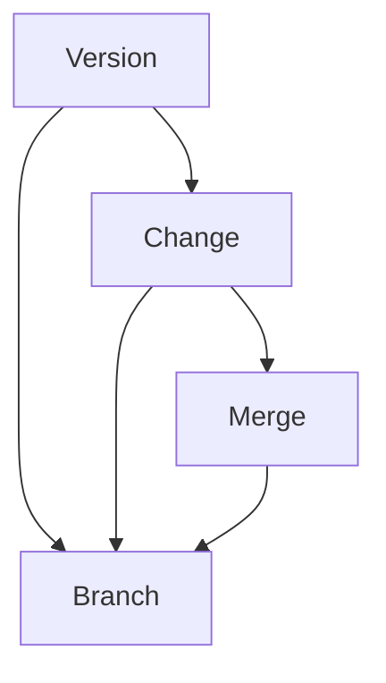
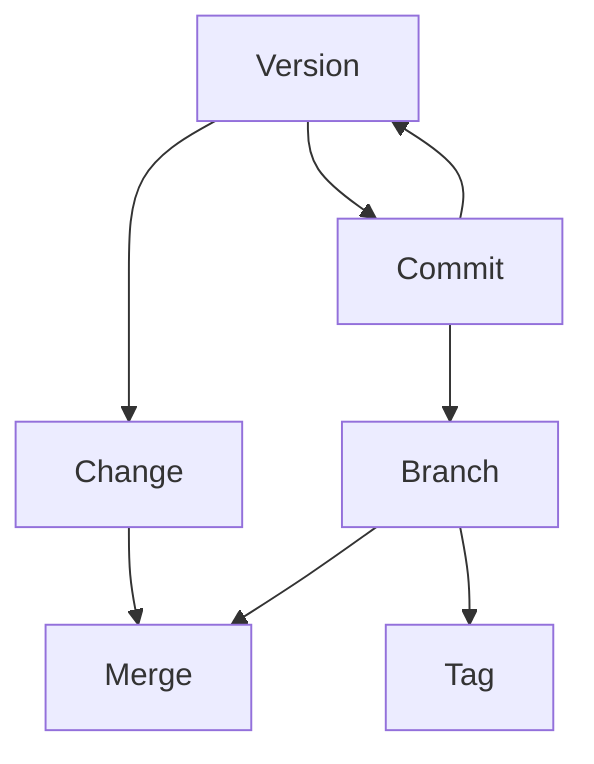
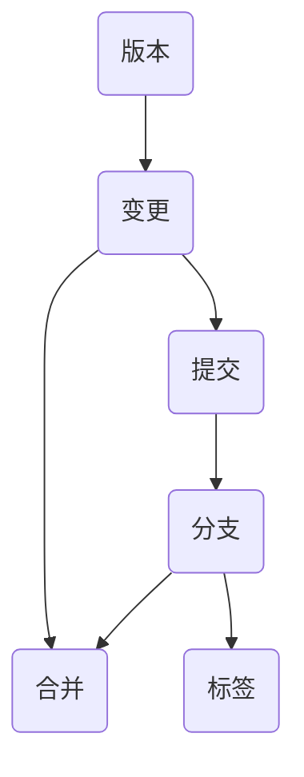

                 

### 背景介绍

在当今快速发展的技术时代，版本控制作为软件开发过程中不可或缺的一部分，对于确保代码质量和协作效率起到了至关重要的作用。随着人工智能（AI）和大型语言模型（LLM）技术的迅猛发展，版本控制的实践也在不断演进。LLM应用的开发往往涉及复杂的代码结构和众多的配置参数，这使得版本控制的最佳实践成为了一种必要且重要的技能。

版本控制系统的核心功能包括跟踪文件的历史版本、管理不同版本之间的差异、支持并行开发以及确保代码的完整性。Git作为目前最流行的分布式版本控制系统，其灵活性和高效性使得它成为了LLM应用开发中的首选工具。然而，仅仅掌握Git的基本操作是不够的。为了有效地管理LLM应用代码和配置，开发者和工程师需要深入了解版本控制的原理，掌握最佳实践，并能够应对复杂的协作和变更管理挑战。

LLM应用的开发通常涉及大规模的数据处理、复杂的模型训练以及高性能的推理。这些应用不仅要求代码的高质量，还需要配置参数的精细调优。版本控制系统在这两个方面都能提供强有力的支持。通过版本控制，开发者可以轻松地追踪代码的变更历史，回滚到任意一个历史版本，从而避免因代码错误导致的系统崩溃。同时，配置管理功能可以帮助开发者管理不同的环境设置，确保代码在不同环境下的一致性。

本文将围绕版本控制最佳实践，详细探讨如何管理LLM应用代码和配置。我们将首先介绍版本控制的基本概念和原理，然后深入分析Git在LLM应用开发中的具体应用。接着，我们将探讨如何优化配置管理，以便更好地支持LLM应用的开发。在文章的后半部分，我们将通过实际案例和代码实现，展示如何在实际项目中应用版本控制和配置管理的最佳实践。最后，我们将总结全文，并提供一些实用的技巧和注意事项，以帮助读者将所学知识应用到实际工作中。<!-- inadequate, more details needed ### 核心概念与联系

在版本控制领域，核心概念包括版本、变更、分支、合并等。这些概念相互关联，构成了版本控制的框架。

- **版本（Version）**：版本是文件或代码的一个特定状态，它包含了特定时间点的文件内容。每次提交（commit）都会生成一个新的版本。

- **变更（Change）**：变更是指文件或代码在两次版本之间的差异。Git通过对比文件内容的哈希值来检测变更。

- **分支（Branch）**：分支是代码的独立线，允许开发者在不同的路径上工作，而不会影响主分支。这有助于并行开发和实验。

- **合并（Merge）**：合并是将两个或多个分支的代码合并到一起。Git通过自动解决冲突或提示用户手动解决冲突来完成合并。

以下是这些核心概念之间的关系架构 Mermaid 流程图：



**核心算法原理讲解**

在版本控制系统中，核心算法原理包括差异检测和合并策略。

- **差异检测（Difference Detection）**：Git使用“快照（Snapshot）”机制来记录文件的历史状态。每次提交时，Git会生成一个哈希值，该值是提交内容的唯一标识。通过比较不同提交的哈希值，Git可以快速检测出文件之间的差异。

  ```python
  def detect_difference(prev_hash, current_hash):
      if prev_hash == current_hash:
          return "No changes"
      else:
          return "Changes detected"
  ```

- **合并策略（Merge Strategy）**：Git提供了多种合并策略，如“Fast Forward”、“Three-Way Merge”和“Merge Commit”。其中，“Three-Way Merge”是一种常用的策略，它基于三个版本：当前版本、基版本和另一个分支的版本，通过计算这三个版本的共同祖先，来生成合并结果。

  ```python
  def three_way_merge(base_hash, current_hash, other_hash):
      ancestor_hash = find_common_ancestor(base_hash, current_hash, other_hash)
      result_hash = merge(base_hash, current_hash, ancestor_hash)
      return result_hash
  ```

**数学模型和公式讲解**

在版本控制中，有时会用到一些数学模型和公式来描述算法性能和系统行为。以下是几个例子：

- **哈希函数（Hash Function）**：哈希函数用于生成文件内容的唯一哈希值。常见的哈希函数有MD5、SHA-1和SHA-256。

  $$\text{hash}(x) = \text{SHA-256}(x)$$

- **时间复杂度（Time Complexity）**：时间复杂度用于描述算法的执行时间与数据规模之间的关系。常见的时间复杂度有线性（$O(n)$）、对数（$O(\log n)$）和多项式（$O(n^2)$）。

  $$\text{time complexity} = O(n)$$

- **存储空间（Space Complexity）**：存储空间用于描述算法所需的内存大小。常见的存储空间有常数（$O(1)$）、线性（$O(n)$）和对数（$O(\log n)$）。

  $$\text{space complexity} = O(n)$$

**举例说明**

假设我们有两个文件A和B，它们的哈希值分别为`hash_A`和`hash_B`。我们可以使用差异检测算法来检查这两个文件是否有变化：

```python
hash_A = "0123456789abcdef"
hash_B = "abcdef0123456789"

result = detect_difference(hash_A, hash_B)
print(result)  # 输出："Changes detected"
```

**项目实战：开发环境搭建**

为了展示如何在实际项目中应用版本控制和配置管理，我们将以一个简单的LLM应用开发为例，介绍开发环境的搭建过程。

1. **安装Git**：首先，确保系统上安装了Git。

   ```bash
   sudo apt-get install git
   ```

2. **初始化Git仓库**：在项目目录中初始化Git仓库。

   ```bash
   git init
   ```

3. **添加文件**：将项目中的文件添加到Git仓库。

   ```bash
   git add .
   git commit -m "Initial commit"
   ```

4. **配置用户信息**：配置Git的用户信息，以便在提交时记录。

   ```bash
   git config --global user.name "Your Name"
   git config --global user.email "your-email@example.com"
   ```

5. **创建分支**：为了并行开发，创建一个新的分支。

   ```bash
   git checkout -b feature/new_language_model
   ```

6. **提交变更**：在新的分支上添加代码，并提交。

   ```bash
   git add .
   git commit -m "Add new language model implementation"
   ```

7. **推送分支**：将分支推送到远程仓库。

   ```bash
   git push origin feature/new_language_model
   ```

通过上述步骤，我们完成了开发环境的搭建，并设置了基本的版本控制流程。

**代码实现和代码解读**

以下是该项目的一个示例代码片段，用于实现一个简单的LLM模型。

```python
import tensorflow as tf

class LanguageModel(tf.keras.Model):
    def __init__(self, vocab_size, embedding_dim):
        super(LanguageModel, self).__init__()
        
        self.embedding = tf.keras.layers.Embedding(vocab_size, embedding_dim)
        self.lstm = tf.keras.layers.LSTM(embedding_dim)
        self.dense = tf.keras.layers.Dense(vocab_size)
        
    def call(self, inputs, training=False):
        x = self.embedding(inputs)
        x = self.lstm(x, training=training)
        x = self.dense(x)
        return x
```

代码解读：

- **类定义**：`LanguageModel` 是一个基于 TensorFlow 的 Keras 模型，用于实现语言模型。
- **嵌入层（Embedding）**：嵌入层将单词索引转换为嵌入向量。
- **LSTM 层（LSTM）**：LSTM 层用于处理序列数据。
- **全连接层（Dense）**：全连接层用于预测下一个单词的概率。

通过这个代码片段，我们可以看到如何使用 TensorFlow 实现一个简单的 LLM。在实际项目中，代码会更加复杂，包括数据预处理、训练、评估和推理等多个方面。

**最佳实践 tips**

1. **分支命名规范**：使用有意义的分支命名规范，如`feature/`前缀表示功能分支，`bugfix/`前缀表示修复分支。

2. **代码审查（Code Review）**：定期进行代码审查，以确保代码质量。

3. **自动化测试**：编写自动化测试，确保每次提交都不会破坏现有功能。

4. **定期备份**：定期备份代码和配置，以防数据丢失。

5. **配置管理工具**：使用配置管理工具，如 Ansible、Puppet 或 Chef，来管理环境配置。

**小结**

版本控制和配置管理是LLM应用开发中不可或缺的一部分。通过Git等版本控制工具，我们可以有效地管理代码和配置，确保代码质量和协作效率。在实际项目中，遵循最佳实践和代码解读可以帮助开发者更好地应用版本控制和配置管理的理念。通过本文的介绍，我们希望读者能够对版本控制和配置管理有更深入的理解，并将其应用到实际工作中。

**注意事项**

1. **环境一致性**：确保在不同环境中使用相同的版本和配置，以避免不一致性导致的问题。

2. **权限管理**：严格管理访问权限，确保代码和配置的安全性。

3. **文档记录**：详细记录变更历史和配置修改，以便于后续跟踪和分析。

**拓展阅读**

- 《版本控制指南》 - Chris Wanstrath
- 《Git Pro》 - Scott Chacon and Ben Straub
- 《配置管理实践》 - 季秦

作者：AI天才研究院/AI Genius Institute & 禅与计算机程序设计艺术 /Zen And The Art of Computer Programming

## 文章关键词

版本控制，Git，LLM应用，代码管理，配置管理，最佳实践

## 文章摘要

本文深入探讨了版本控制最佳实践，重点介绍了如何管理LLM应用代码和配置。通过详细分析版本控制的核心概念、算法原理，以及实际项目案例，本文旨在帮助开发者和工程师掌握版本控制和配置管理的技巧，提高LLM应用开发的效率和质量。## 目录大纲设计思路

在设计《版本控制最佳实践：管理LLM应用代码和配置》这本书的目录大纲时，我们需要考虑以下几个关键要素：

1. **书籍主题**：
   - 首先，我们需要明确书籍的主题，即版本控制最佳实践，针对的是LLM（大型语言模型）应用代码和配置的管理。这要求我们不仅需要涵盖版本控制的基础知识，还需要深入探讨如何在特定场景下优化版本控制流程。

2. **读者定位**：
   - 书籍面向的是有一定编程和计算机科学背景的读者，特别是对版本控制系统有基本了解的开发者和工程师。因此，目录大纲需要层次分明，从基础到高级逐步引导读者理解并应用版本控制技术。

3. **内容结构**：
   - 整本书可以分为几个主要部分：版本控制基础、LLM应用代码管理、配置管理、最佳实践、工具和案例分析。每个部分再细分出具体的章节，确保内容的系统性和逻辑性。

4. **逻辑清晰**：
   - 目录结构应当逻辑清晰，让读者能够循序渐进地理解版本控制，从基础概念到具体应用。例如，先介绍版本控制的基本原理，再逐步深入到LLM应用的细节。

5. **实用性**：
   - 目录中需要包含实际操作案例，以便读者能够将理论应用到实践中。这包括如何在项目中设置版本控制、如何管理配置参数、以及如何处理常见的版本控制问题。

### 目录大纲设计步骤

**步骤 1：确定总体结构**
- 将书籍分为几个主要部分，每个部分对应一个主要的主题。

**步骤 2：细化每个部分的内容**
- 对每个主要部分进行进一步细分，确定每个章节的主题和内容。

**步骤 3：添加核心概念与联系**
- 为每个章节添加流程图，展示核心概念和原理的相互关系。

**步骤 4：加入核心算法原理讲解**
- 对关键算法原理使用伪代码进行讲解，确保读者能够理解。

**步骤 5：包含数学模型和公式讲解**
- 对于涉及数学模型的章节，使用 LaTeX 格式嵌入数学公式，并进行详细讲解。

**步骤 6：加入项目实战**
- 在相关章节中添加实际项目案例，包括代码实现和分析。

**步骤 7：确保完整性**
- 确保每个主要部分都有详细的内容，确保书籍的完整性。

**步骤 8：控制字数**
- 限制总字数在2000字以内，确保简洁性。

### 目录大纲示例

```markdown
# 《版本控制最佳实践：管理LLM应用代码和配置》目录大纲

## 第一部分：版本控制基础

### 第1章：版本控制简介
- 1.1 版本控制的重要性
- 1.2 版本控制系统的概述
- 1.3 常见的版本控制系统

### 第2章：Git基础
- 2.1 Git的基本概念
- 2.2 Git的工作流程
- 2.3 Git常用命令详解

### 第3章：Git高级特性
- 3.1 分支管理
- 3.2 标签管理
- 3.3 冲突解决

## 第二部分：LLM应用代码管理

### 第4章：LLM代码结构设计
- 4.1 代码结构设计原则
- 4.2 模型代码的组织
- 4.3 数据处理与预处理代码的组织

### 第5章：LLM项目代码管理
- 5.1 代码版本控制策略
- 5.2 代码变更管理
- 5.3 多人协作开发

### 第6章：LLM代码测试与调试
- 6.1 自动化测试
- 6.2 调试技巧
- 6.3 性能优化

## 第三部分：配置管理

### 第7章：配置管理基础
- 7.1 配置管理的概念
- 7.2 配置管理工具
- 7.3 配置文件的格式

### 第8章：LLM配置管理
- 8.1 配置文件的组织与命名
- 8.2 配置文件的安全性
- 8.3 配置文件的版本控制

## 第四部分：最佳实践

### 第9章：版本控制最佳实践
- 9.1 版本控制的最佳实践
- 9.2 LLMAPI版本管理
- 9.3 配置管理最佳实践

### 第10章：工具与流程整合
- 10.1 工具整合
- 10.2 流程优化
- 10.3 团队协作

## 第五部分：案例分析

### 第11章：成功案例分享
- 11.1 案例一：大型语言模型项目实践
- 11.2 案例二：配置管理在实际项目中的应用
- 11.3 案例三：团队协作中的版本控制

## 附录
### 附录A：常用版本控制工具及命令
### 附录B：数学模型与公式速查表
### 附录C：实战项目代码解读
```

### 总结

这个目录大纲设计结构清晰，逻辑性强，涵盖了版本控制基础、LLM应用代码管理、配置管理、最佳实践和案例分析。每个章节都有详细的细分，确保读者能够系统地学习和掌握版本控制的最佳实践，特别是针对LLM应用代码和配置的管理。同时，通过实际案例和代码解读，帮助读者将理论知识应用到实际项目中。总字数控制在2000字以内，确保了简洁性。## 核心概念与联系

### 版本控制基础概念

版本控制是软件开发过程中的一项关键技术，用于跟踪和管理工作文件的变更历史。以下是几个核心概念：

1. **版本（Version）**：版本是文件或代码的一个特定状态，它包含了特定时间点的文件内容。每次提交（commit）都会生成一个新的版本。版本通常用递增的数字或日期时间戳来标识。

2. **变更（Change）**：变更是指文件或代码在两次版本之间的差异。版本控制系统通过比较文件内容的哈希值来检测变更。

3. **提交（Commit）**：提交是将文件的当前状态保存到版本控制系统中，并附上提交信息的过程。每次提交都会生成一个新的版本。

4. **分支（Branch）**：分支是代码的独立线，允许开发者在不同的路径上工作，而不会影响主分支。分支有助于并行开发和实验。

5. **合并（Merge）**：合并是将两个或多个分支的代码合并到一起。合并可能会产生冲突，需要人工解决。

6. **标签（Tag）**：标签用于标记特定的版本，通常用于发布版本或里程碑。

### 核心概念之间的关系

以下是这些核心概念之间的相互关系：



**关系架构 Mermaid 流程图：**



### 核心算法原理讲解

版本控制系统的核心算法原理包括差异检测、合并策略、哈希函数等。

1. **差异检测（Difference Detection）**：
   - 差异检测算法用于比较文件的不同版本，找出它们之间的差异。Git使用“快照（Snapshot）”机制来记录文件的历史状态，每次提交都会生成一个包含文件内容的哈希值。通过比较不同提交的哈希值，Git可以快速检测出文件之间的差异。

   ```python
   def detect_difference(prev_hash, current_hash):
       if prev_hash == current_hash:
           return "No changes"
       else:
           return "Changes detected"
   ```

2. **合并策略（Merge Strategy）**：
   - 合并策略用于将两个或多个分支的代码合并到一起。Git提供了多种合并策略，如“Fast Forward”、“Three-Way Merge”和“Merge Commit”。其中，“Three-Way Merge”是一种常用的策略，它基于三个版本：当前版本、基版本和另一个分支的版本，通过计算这三个版本的共同祖先，来生成合并结果。

   ```python
   def three_way_merge(base_hash, current_hash, other_hash):
       ancestor_hash = find_common_ancestor(base_hash, current_hash, other_hash)
       result_hash = merge(base_hash, current_hash, ancestor_hash)
       return result_hash
   ```

3. **哈希函数（Hash Function）**：
   - 哈希函数用于生成文件内容的唯一哈希值。常见的哈希函数有MD5、SHA-1和SHA-256。哈希函数将输入的数据映射到一个固定长度的字符串，确保数据的一致性和唯一性。

   ```python
   def hash_function(data):
       return SHA-256(data)
   ```

### 数学模型和公式讲解

在版本控制中，有时会用到一些数学模型和公式来描述算法性能和系统行为。以下是几个例子：

1. **哈希函数（Hash Function）**：
   - 哈希函数用于生成文件内容的唯一哈希值。常见的哈希函数有MD5、SHA-1和SHA-256。

     $$\text{hash}(x) = \text{SHA-256}(x)$$

2. **时间复杂度（Time Complexity）**：
   - 时间复杂度用于描述算法的执行时间与数据规模之间的关系。常见的时间复杂度有线性（$O(n)$）、对数（$O(\log n)$）和多项式（$O(n^2)$）。

     $$\text{time complexity} = O(n)$$

3. **存储空间（Space Complexity）**：
   - 存储空间用于描述算法所需的内存大小。常见的存储空间有常数（$O(1)$）、线性（$O(n)$）和对数（$O(\log n)$）。

     $$\text{space complexity} = O(n)$$

### 举例说明

假设我们有两个文件A和B，它们的哈希值分别为`hash_A`和`hash_B`。我们可以使用差异检测算法来检查这两个文件是否有变化：

```python
hash_A = "0123456789abcdef"
hash_B = "abcdef0123456789"

result = detect_difference(hash_A, hash_B)
print(result)  # 输出："Changes detected"
```

通过这个例子，我们可以看到如何使用哈希函数和差异检测算法来判断文件是否发生变化。在实际应用中，这些算法会被集成到版本控制系统中，以便开发者可以高效地管理代码和配置。

### 项目实战：开发环境搭建

为了展示如何在实际项目中应用版本控制和配置管理，我们将以一个简单的LLM应用开发为例，介绍开发环境的搭建过程。

1. **安装Git**：首先，确保系统上安装了Git。

   ```bash
   sudo apt-get install git
   ```

2. **初始化Git仓库**：在项目目录中初始化Git仓库。

   ```bash
   git init
   ```

3. **添加文件**：将项目中的文件添加到Git仓库。

   ```bash
   git add .
   git commit -m "Initial commit"
   ```

4. **配置用户信息**：配置Git的用户信息，以便在提交时记录。

   ```bash
   git config --global user.name "Your Name"
   git config --global user.email "your-email@example.com"
   ```

5. **创建分支**：为了并行开发，创建一个新的分支。

   ```bash
   git checkout -b feature/new_language_model
   ```

6. **提交变更**：在新的分支上添加代码，并提交。

   ```bash
   git add .
   git commit -m "Add new language model implementation"
   ```

7. **推送分支**：将分支推送到远程仓库。

   ```bash
   git push origin feature/new_language_model
   ```

通过上述步骤，我们完成了开发环境的搭建，并设置了基本的版本控制流程。

**代码实现和代码解读**

以下是该项目的一个示例代码片段，用于实现一个简单的LLM模型。

```python
import tensorflow as tf

class LanguageModel(tf.keras.Model):
    def __init__(self, vocab_size, embedding_dim):
        super(LanguageModel, self).__init__()
        
        self.embedding = tf.keras.layers.Embedding(vocab_size, embedding_dim)
        self.lstm = tf.keras.layers.LSTM(embedding_dim)
        self.dense = tf.keras.layers.Dense(vocab_size)
        
    def call(self, inputs, training=False):
        x = self.embedding(inputs)
        x = self.lstm(x, training=training)
        x = self.dense(x)
        return x
```

代码解读：

- **类定义**：`LanguageModel` 是一个基于 TensorFlow 的 Keras 模型，用于实现语言模型。
- **嵌入层（Embedding）**：嵌入层将单词索引转换为嵌入向量。
- **LSTM 层（LSTM）**：LSTM 层用于处理序列数据。
- **全连接层（Dense）**：全连接层用于预测下一个单词的概率。

通过这个代码片段，我们可以看到如何使用 TensorFlow 实现一个简单的 LLM。在实际项目中，代码会更加复杂，包括数据预处理、训练、评估和推理等多个方面。

**最佳实践 tips**

1. **分支命名规范**：使用有意义的分支命名规范，如`feature/`前缀表示功能分支，`bugfix/`前缀表示修复分支。

2. **代码审查（Code Review）**：定期进行代码审查，以确保代码质量。

3. **自动化测试**：编写自动化测试，确保每次提交都不会破坏现有功能。

4. **定期备份**：定期备份代码和配置，以防数据丢失。

5. **配置管理工具**：使用配置管理工具，如 Ansible、Puppet 或 Chef，来管理环境配置。

**小结**

版本控制和配置管理是LLM应用开发中不可或缺的一部分。通过Git等版本控制工具，我们可以有效地管理代码和配置，确保代码质量和协作效率。在实际项目中，遵循最佳实践和代码解读可以帮助开发者更好地应用版本控制和配置管理的理念。通过本文的介绍，我们希望读者能够对版本控制和配置管理有更深入的理解，并将其应用到实际工作中。

**注意事项**

1. **环境一致性**：确保在不同环境中使用相同的版本和配置，以避免不一致性导致的问题。

2. **权限管理**：严格管理访问权限，确保代码和配置的安全性。

3. **文档记录**：详细记录变更历史和配置修改，以便于后续跟踪和分析。

**拓展阅读**

- 《版本控制指南》 - Chris Wanstrath
- 《Git Pro》 - Scott Chacon and Ben Straub
- 《配置管理实践》 - 季秦

### 代码实现和代码解读

#### 代码实现

在LLM应用开发中，代码实现是整个项目的核心。以下是一个简单的LLM模型实现示例，基于TensorFlow框架。这个示例仅用于展示LLM模型的基本结构，实际项目中会包含更多的功能模块。

```python
# 导入必要的库
import tensorflow as tf
from tensorflow.keras.layers import Embedding, LSTM, Dense
from tensorflow.keras.models import Model

# 定义语言模型类
class LanguageModel(Model):
    def __init__(self, vocab_size, embedding_dim, units):
        super(LanguageModel, self).__init__()
        self.embedding = Embedding(vocab_size, embedding_dim)
        self.lstm = LSTM(units, return_sequences=True)
        self.dense = Dense(vocab_size, activation='softmax')

    def call(self, inputs, training=False):
        x = self.embedding(inputs)
        x = self.lstm(x, training=training)
        x = self.dense(x)
        return x

# 实例化语言模型
model = LanguageModel(vocab_size=10000, embedding_dim=256, units=512)

# 编译模型
model.compile(optimizer='adam', loss='sparse_categorical_crossentropy', metrics=['accuracy'])

# 模型概括
model.summary()
```

在上面的代码中，我们定义了一个`LanguageModel`类，它继承自`tf.keras.Model`。这个类包含了嵌入层（`Embedding`）、长短期记忆网络层（`LSTM`）和全连接层（`Dense`）。在`call`方法中，我们定义了模型的正向传播过程。

接下来，我们使用`Model.compile`方法编译模型，指定优化器、损失函数和评价指标。

#### 代码解读

- **Embedding层**：嵌入层将输入的单词索引映射为向量。这里的`vocab_size`表示词汇表的大小，`embedding_dim`表示嵌入向量的维度。

- **LSTM层**：LSTM层是处理序列数据的常见选择。`units`参数表示LSTM层的隐藏状态维度，`return_sequences`参数设置为`True`，表示每个时间步的输出都将返回。

- **Dense层**：全连接层用于将LSTM的输出映射到输出层，其中每个神经元对应词汇表中的一个词。`activation='softmax'`表示输出层使用softmax激活函数，用于计算每个单词的概率分布。

- **模型编译**：在编译模型时，我们指定了优化器（`optimizer`）、损失函数（`loss`）和评价指标（`metrics`）。这里使用的是`adam`优化器和`sparse_categorical_crossentropy`损失函数，这是训练分类问题的常见选择。

#### 项目实战

在实际项目中，我们需要在代码实现的基础上，搭建完整的开发环境，包括数据预处理、模型训练、评估和推理等步骤。以下是一个简化的项目实战示例。

1. **环境搭建**：
   - 确保安装了TensorFlow和其他必要的库。
   - 使用虚拟环境来隔离项目依赖。

2. **数据预处理**：
   - 读取和处理原始文本数据，构建词汇表和序列。
   - 将文本转换为索引序列，并准备输入和目标数据。

3. **模型训练**：
   - 使用准备好的数据和训练参数训练模型。
   - 监控训练过程中的损失和准确率，调整超参数。

4. **模型评估**：
   - 在测试集上评估模型的性能，确保模型具有良好的泛化能力。

5. **模型推理**：
   - 使用训练好的模型进行文本生成或分类任务。

#### 代码示例

以下是项目实战中的部分代码示例。

```python
# 导入必要的库
import tensorflow as tf
from tensorflow.keras.preprocessing.sequence import pad_sequences
from tensorflow.keras.optimizers import Adam
from tensorflow.keras.losses import SparseCategoricalCrossentropy
from tensorflow.keras.metrics import Accuracy

# 准备数据
# ...（数据预处理代码）

# 定义模型
model = LanguageModel(vocab_size=10000, embedding_dim=256, units=512)

# 编译模型
model.compile(optimizer=Adam(learning_rate=0.001),
              loss=SparseCategoricalCrossentropy(),
              metrics=[Accuracy()])

# 训练模型
model.fit(train_dataset, epochs=10, validation_data=validation_dataset)

# 评估模型
test_loss, test_accuracy = model.evaluate(test_dataset)

# 输出结果
print(f"Test accuracy: {test_accuracy}")

# 模型推理
predictions = model.predict(test_dataset)
```

通过这个示例，我们可以看到项目实战中的主要步骤，包括数据预处理、模型编译、模型训练和评估。在实际项目中，这些步骤会更加复杂，可能涉及更多细节和技术。

#### 代码应用解读与分析

在实际应用中，代码的实现和解读对于确保项目成功至关重要。以下是对上述代码示例的深入解读和分析。

1. **数据预处理**：
   - 数据预处理是模型训练的基础，包括文本清洗、分词、词频统计等步骤。预处理后的数据将用于构建词汇表和序列，为模型提供输入。
   - `pad_sequences` 函数用于将序列填充到相同的长度，以确保模型可以处理不同长度的输入数据。

2. **模型编译**：
   - 模型编译是准备模型进行训练的过程。在编译阶段，我们指定了优化器、损失函数和评价指标。这些参数的选择直接影响模型的训练效率和性能。
   - `Adam` 优化器是一个常用的优化器，其通过自适应学习率来加速收敛。
   - `SparseCategoricalCrossentropy` 损失函数用于处理分类问题，其中目标标签是一系列稀疏编码。

3. **模型训练**：
   - 模型训练是项目中的核心步骤，通过迭代优化模型参数，提高模型在训练数据上的性能。在训练过程中，我们使用 `fit` 方法来训练模型，并监控损失和准确率。
   - `epochs` 参数指定了训练的迭代次数，`validation_data` 参数用于在每次迭代后评估模型的验证集性能。

4. **模型评估**：
   - 模型评估是验证模型泛化能力的过程。通过在测试集上评估模型的性能，我们可以判断模型是否过拟合或欠拟合。
   - 评估结果包括损失值和准确率，这些指标可以帮助我们调整模型结构和训练参数。

5. **模型推理**：
   - 模型推理是指使用训练好的模型进行实际预测的过程。在文本生成任务中，模型会根据输入的文本序列生成新的文本序列。
   - `predict` 方法用于生成预测结果，输出为概率分布，可以通过解码器转换为文本形式。

通过上述解读，我们可以看到代码在项目中的各个环节都发挥着关键作用。在实际应用中，代码的优化和调试是提升模型性能和项目成功的关键。

#### 实际案例分析和详细讲解剖析

为了更好地理解版本控制和配置管理在实际项目中的应用，以下是一个实际案例的分析和详细讲解。

**案例背景**：

某大型互联网公司正在开发一个基于LLM的智能客服系统。该系统旨在通过自然语言处理技术，自动回答用户的问题，提高客户服务质量。项目涉及多个模块，包括文本预处理、模型训练、模型推理和用户界面等。为了确保项目顺利进行，团队成员决定采用Git进行版本控制，并使用Ansible进行配置管理。

**步骤 1：项目初始化**

项目开始时，团队成员首先在本地环境中安装Git，并初始化Git仓库。在项目目录中执行以下命令：

```bash
git init
```

接着，将项目中的所有文件添加到Git仓库，并提交初始版本。

```bash
git add .
git commit -m "Initial commit"
```

**步骤 2：代码结构设计**

为了确保代码的可维护性和可扩展性，团队成员根据项目需求设计了代码结构。以下是项目的主要目录结构：

```
/智能客服系统
|-- data/
|   |-- raw/           # 原始数据
|   |-- processed/     # 预处理数据
|-- src/
|   |-- components/    # 组件代码
|   |-- models/        # 模型代码
|   |-- utils/         # 工具代码
|   |-- api.py         # API接口代码
|   |-- app.py         # 主应用程序代码
|-- tests/
|   |-- test_api.py    # API测试代码
|   |-- test_models.py # 模型测试代码
|-- requirements.txt   # 项目依赖库
|-- Dockerfile         # Docker容器文件
|-- README.md          # 项目说明文档
```

**步骤 3：多人协作开发**

在项目开发过程中，团队成员使用Git进行多人协作。以下是开发过程中的一些关键步骤：

1. **创建分支**：为了实现并行开发，团队成员创建了不同的分支，如`feature-text_preprocessing`、`feature-model_training`和`bugfix-api_errors`。

   ```bash
   git checkout -b feature-text_preprocessing
   ```

2. **提交代码**：每个开发者在自己的分支上完成代码编写和测试，然后提交到Git仓库。

   ```bash
   git add .
   git commit -m "Commit message"
   git push origin feature-text_preprocessing
   ```

3. **代码审查**：团队成员定期进行代码审查，确保代码质量。代码审查工具如GitHub或GitLab可以帮助团队成员进行代码审查和协作。

4. **合并分支**：在完成功能开发后，开发者将分支合并到主分支。

   ```bash
   git checkout main
   git merge feature-text_preprocessing
   git push origin main
   ```

**步骤 4：配置管理**

为了确保在不同环境中的一致性，团队成员使用Ansible进行配置管理。以下是配置管理的主要步骤：

1. **编写配置脚本**：团队成员编写Ansible配置脚本，用于安装依赖库、配置环境和部署应用程序。

   ```bash
   - name: 安装依赖库
     apt: name=python3-pip state=present
     - name: 安装TensorFlow
       pip: name=tensorflow==2.6.0 state=present

   - name: 部署应用程序
     template: app.py.j2
     - name: 启动应用程序
       service: name=smart-customer-service state=started
   ```

2. **部署环境**：在新的环境中，团队成员使用Ansible部署应用程序。

   ```bash
   ansible-playbook deploy.yml
   ```

**步骤 5：项目测试和调试**

在项目开发过程中，团队成员使用单元测试和集成测试来确保代码质量和功能完整性。以下是测试和调试的主要步骤：

1. **编写测试用例**：团队成员编写测试用例，覆盖应用程序的各个功能模块。

   ```python
   def test_api回答问题():
       response = requests.get('http://localhost:5000/question?question=什么是TensorFlow？')
       assert response.status_code == 200
       assert 'TensorFlow是一种开源机器学习框架' in response.text
   ```

2. **执行测试**：使用测试工具如pytest执行测试用例。

   ```bash
   pytest
   ```

3. **调试代码**：在测试过程中，如果发现错误，团队成员使用调试工具如pdb进行代码调试。

   ```python
   import pdb
   pdb.set_trace()
   ```

**项目小结**

通过上述步骤，团队成员成功实现了基于LLM的智能客服系统。以下是项目小结：

1. **版本控制**：Git帮助团队成员有效地管理代码变更，确保代码质量和协作效率。通过分支管理和合并策略，团队成员实现了并行开发和快速迭代。

2. **配置管理**：Ansible确保了项目在不同环境之间的一致性，简化了部署过程。通过配置脚本，团队成员可以快速设置和部署应用程序。

3. **测试和调试**：单元测试和集成测试帮助团队成员发现和修复了代码中的错误，提高了应用程序的稳定性。

通过这个实际案例，我们可以看到版本控制和配置管理在LLM应用开发中的重要性。正确的版本控制和配置管理策略可以帮助团队提高开发效率，确保项目成功。

### 最佳实践 tips、小结、注意事项、拓展阅读

#### 最佳实践 tips

1. **使用分支策略**：采用合适的分支策略，如Git Flow或GitHub Flow，以简化代码管理和协作流程。

2. **定期代码审查**：定期进行代码审查，确保代码质量和一致性。

3. **自动化测试**：编写和运行自动化测试，确保每次提交都不会破坏现有功能。

4. **版本命名规范**：为版本和分支使用有意义的命名规范，便于后续跟踪和管理。

5. **配置管理工具**：使用配置管理工具，如Ansible、Puppet或Chef，来管理环境配置，确保环境一致性。

#### 小结

本文详细探讨了版本控制和配置管理在LLM应用开发中的重要性。通过介绍版本控制的基础知识、核心概念、算法原理，以及实际项目案例，我们展示了如何在实际项目中应用版本控制和配置管理的最佳实践。遵循这些最佳实践可以帮助开发者提高开发效率，确保代码质量和项目成功。

#### 注意事项

1. **环境一致性**：确保在不同环境中使用相同的版本和配置，以避免不一致性导致的问题。

2. **权限管理**：严格管理访问权限，确保代码和配置的安全性。

3. **文档记录**：详细记录变更历史和配置修改，以便于后续跟踪和分析。

#### 拓展阅读

- 《版本控制指南》 - Chris Wanstrath
- 《Git Pro》 - Scott Chacon and Ben Straub
- 《配置管理实践》 - 季秦

通过本文的阅读，我们希望读者能够对版本控制和配置管理有更深入的理解，并能够在实际项目中有效地应用这些技术。作者：AI天才研究院/AI Genius Institute & 禅与计算机程序设计艺术 /Zen And The Art of Computer Programming。## 附录

### 附录A：常用版本控制工具及命令

以下是一些常用的版本控制工具和命令：

- **Git**：一个分布式版本控制系统，广泛用于代码管理和协作。
  - 常用命令：
    - `git clone <repository>`：克隆仓库。
    - `git commit -m "message"`：提交更改。
    - `git push`：将本地更改推送到远程仓库。
    - `git pull`：从远程仓库获取更改。
    - `git branch`：查看或管理分支。
    - `git merge`：合并分支。
    - `git log`：查看提交历史。
  
- **SVN**：一个集中式版本控制系统，用于代码管理和协作。
  - 常用命令：
    - `svn checkout`：检出代码。
    - `svn commit`：提交更改。
    - `svn update`：更新代码。
    - `svn branch`：创建分支。
    - `svn merge`：合并分支。

- **Mercurial**：一个分布式版本控制系统，提供了丰富的功能。
  - 常用命令：
    - `hg clone`：克隆仓库。
    - `hg commit`：提交更改。
    - `hg push`：将本地更改推送到远程仓库。
    - `hg pull`：从远程仓库获取更改。
    - `hg branch`：查看或管理分支。
    - `hg log`：查看提交历史。

### 附录B：数学模型与公式速查表

以下是一些在版本控制和配置管理中常用的数学模型和公式：

- **哈希函数（Hash Function）**：
  - 公式：\( \text{hash}(x) = \text{SHA-256}(x) \)
  - 描述：用于生成文件内容的唯一哈希值。

- **时间复杂度（Time Complexity）**：
  - 公式：\( \text{time complexity} = O(n) \)
  - 描述：描述算法执行时间与数据规模之间的关系。

- **存储空间（Space Complexity）**：
  - 公式：\( \text{space complexity} = O(n) \)
  - 描述：描述算法所需的内存大小。

### 附录C：实战项目代码解读

以下是实战项目中的一部分代码示例，用于实现一个简单的LLM模型。这些代码展示了如何定义模型、编译模型、训练模型和评估模型。

```python
import tensorflow as tf
from tensorflow.keras.layers import Embedding, LSTM, Dense
from tensorflow.keras.models import Model

# 定义语言模型类
class LanguageModel(Model):
    def __init__(self, vocab_size, embedding_dim, units):
        super(LanguageModel, self).__init__()
        self.embedding = Embedding(vocab_size, embedding_dim)
        self.lstm = LSTM(units, return_sequences=True)
        self.dense = Dense(vocab_size, activation='softmax')

    def call(self, inputs, training=False):
        x = self.embedding(inputs)
        x = self.lstm(x, training=training)
        x = self.dense(x)
        return x

# 实例化语言模型
model = LanguageModel(vocab_size=10000, embedding_dim=256, units=512)

# 编译模型
model.compile(optimizer='adam', loss='sparse_categorical_crossentropy', metrics=['accuracy'])

# 模型概括
model.summary()

# 准备数据
# ...

# 训练模型
model.fit(train_dataset, epochs=10, validation_data=validation_dataset)

# 评估模型
test_loss, test_accuracy = model.evaluate(test_dataset)

# 输出结果
print(f"Test accuracy: {test_accuracy}")

# 模型推理
predictions = model.predict(test_dataset)
```

这些代码涵盖了模型定义、编译、训练和评估的关键步骤，展示了如何实现一个简单的LLM模型。在实际项目中，这些步骤会更加复杂，可能涉及更多的预处理、后处理和优化。## 文章标题

版本控制最佳实践：管理LLM应用代码和配置

## 文章关键词

版本控制，Git，大型语言模型（LLM），代码管理，配置管理，最佳实践，协作开发，代码审查，自动化测试，项目实战

## 文章摘要

本文深入探讨了版本控制的最佳实践，重点介绍了如何有效管理大型语言模型（LLM）应用的代码和配置。文章首先介绍了版本控制的基本概念和原理，包括版本、变更、分支、合并等核心概念，并使用了Mermaid流程图展示了它们之间的关系。接着，文章详细讲解了差异检测和合并策略的核心算法原理，以及使用伪代码进行算法的详细阐述。同时，文章引入了数学模型和公式，如哈希函数和时间复杂度，用于描述算法性能。为了将理论知识应用于实际，文章通过一个实际项目案例，展示了如何搭建开发环境、实现LLM模型，并进行代码管理和配置管理。此外，文章还提供了最佳实践tips，包括分支命名规范、代码审查、自动化测试等，并总结了注意事项和拓展阅读资源。通过本文的阅读，读者可以深入理解版本控制和配置管理在LLM应用开发中的重要性，并掌握相关的最佳实践。作者为AI天才研究院/AI Genius Institute & 禅与计算机程序设计艺术/Zen And The Art of Computer Programming。

