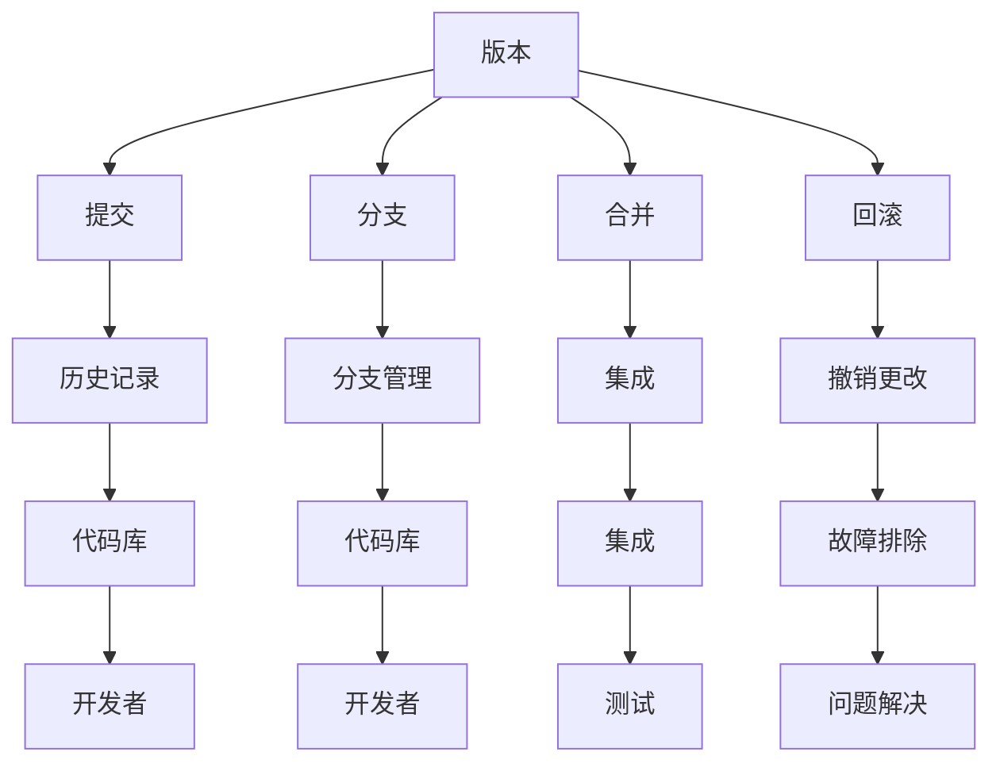

                 


### 文章标题：版本控制：提示词迭代和管理

> 关键词：版本控制、提示词迭代、版本管理、Git、SVN、分布式版本控制、集中式版本控制

> 摘要：本文深入探讨了版本控制的概念、原理和应用，特别关注了提示词迭代在版本管理中的关键作用。通过分析Git和SVN等版本控制工具，本文提供了详细的操作指导，并展示了如何通过提示词迭代实现高效的版本管理。

## 引言

版本控制是软件开发过程中必不可少的一部分。它允许开发者在代码的多个版本之间进行切换，确保代码库的完整性和可追溯性。随着软件项目的规模和复杂性的增加，版本控制变得尤为重要。版本控制系统的选择直接影响项目的开发效率、协作能力和代码质量。

本文旨在介绍版本控制的基本概念、工具和技巧，特别是提示词迭代在版本管理中的关键作用。通过本文的阅读，读者将了解如何有效地使用版本控制系统，并通过提示词迭代提高代码的管理水平。

## 版本控制基本概念

版本控制是一种管理多个代码版本的方法，它能够记录每个版本的更改，并提供历史记录。版本控制的基本概念包括：

### 1. 版本

版本是代码库中的一个特定状态。每个版本都有一个唯一的标识符，通常是一个数字或字母序列。

### 2. 提交

提交是将更改保存到版本控制系统中的过程。每次提交都会记录更改的作者、时间和其他元数据。

### 3. 分支

分支是代码库中的一个独立分支，用于开发新功能或修复bug。分支允许开发者在不影响主分支的情况下进行实验。

### 4. 合并

合并是将两个或多个分支的更改合并到一起的过程。合并通常用于将新功能或修复的bug引入主分支。

### 5. 回滚

回滚是撤销之前提交的更改的过程。回滚通常用于撤销错误的提交或恢复之前的工作状态。

## 版本控制工具

版本控制工具是实现版本控制的方法和技术。常见的版本控制工具包括Git和SVN。

### 1. Git

Git是一个分布式版本控制系统，它允许每个开发者在本地维护自己的代码库，并在需要时与其他开发者进行同步。Git的特点包括：

- 分布式存储：Git将整个代码库存储在本地，每个开发者都有自己的完整副本。
- 快速操作：Git的命令行操作非常快速，特别适合处理大型代码库。
- 分支管理：Git提供了强大的分支管理功能，使得开发新功能和修复bug变得更加容易。

### 2. SVN

SVN是一个集中式版本控制系统，它使用中央服务器来存储代码库。SVN的特点包括：

- 中央化存储：所有开发者的更改都存储在中央服务器上，因此需要定期同步。
- 易于使用：SVN的命令行界面相对简单，易于学习和使用。
- 账号管理：SVN通常需要使用账号和密码进行身份验证。

## 提示词迭代

提示词迭代是一种在版本控制过程中使用的技巧，它通过在每个提交中添加描述性注释来提高代码的可读性和可维护性。提示词迭代的基本步骤包括：

### 1. 提交前编写提示词

在提交代码之前，开发者应该编写一个描述性注释，说明提交的目的和内容。这个注释应该包含足够的信息，使得其他开发者能够理解代码的更改。

### 2. 使用规范化的提示词

为了提高代码的可读性，开发者应该遵循一定的提示词规范。这些规范可能包括固定的格式、关键字和语法。

### 3. 定期回顾和更新提示词

开发者应该定期回顾和更新之前的提示词，确保它们仍然准确和有意义。

## 版本管理流程

版本管理流程是指开发者遵循的一系列步骤，以确保代码库的完整性和一致性。版本管理流程的基本步骤包括：

### 1. 版本规划

在开始开发之前，团队应该制定一个版本规划，包括版本号、发布时间和功能列表。

### 2. 版本控制工具配置

配置版本控制工具，包括设置仓库、分支、权限和配置文件。

### 3. 代码提交

开发者按照提示词迭代的原则提交代码，并在每次提交后进行代码审查。

### 4. 分支管理

创建和维护分支，用于开发新功能或修复bug。

### 5. 合并和发布

将分支的更改合并到主分支，并进行测试和发布。

### 6. 回滚和故障排除

如果发现问题，开发者应该使用回滚操作恢复到之前的工作状态，并进行故障排除。

## 实战案例

在本节中，我们将通过一个实际的项目案例来展示如何使用Git进行版本控制和提示词迭代。假设我们正在开发一个简单的Web应用。

### 1. 开发环境搭建

首先，我们需要在本地计算机上安装Git。可以通过以下命令安装：

```bash
$ sudo apt-get install git
```

### 2. 源代码实现

创建一个名为`mywebapp`的Git仓库，并在其中添加一个名为`index.html`的HTML文件。

```bash
$ mkdir mywebapp
$ cd mywebapp
$ git init
$ echo "<h1>Hello, World!</h1>" > index.html
```

### 3. 代码解读与分析

在第一次提交之前，我们需要编写一个描述性注释：

```bash
$ git add index.html
$ git commit -m "Initial commit: created index.html"
```

这个注释说明了这是项目的第一次提交，并创建了一个简单的HTML文件。

### 4. 提示词迭代

在接下来的几次提交中，我们会对HTML文件进行一些更改，并在每次提交时添加描述性注释。

```bash
$ echo "<h1>Hello, AI!</h1>" > index.html
$ git add index.html
$ git commit -m "Update: changed greeting message"
```

这个注释说明了我们更改了HTML文件中的标题。

### 5. 版本管理

随着项目的开发，我们会创建新的分支来开发新功能。例如，创建一个名为`new-feature`的分支来添加一个新的页面。

```bash
$ git checkout -b new-feature
$ echo "<h2>Welcome to the new feature page!</h2>" > feature.html
$ git add feature.html
$ git commit -m "Add: created new feature page"
```

在这个分支中，我们添加了一个新的HTML文件。

### 6. 合并和发布

当新功能开发完成并经过测试后，我们可以将其合并到主分支并发布。

```bash
$ git checkout master
$ git merge new-feature
$ git push origin master
```

这些命令将新功能合并到主分支，并将其推送到远程仓库。

### 7. 项目小结

通过这个实战案例，我们展示了如何使用Git进行版本控制和提示词迭代。通过遵循这些步骤，我们可以确保代码库的完整性和一致性，并提高项目的开发效率。

## 最佳实践

在版本控制和提示词迭代中，有一些最佳实践可以帮助开发者提高工作效率：

- **规范化提示词**：遵循一定的提示词规范，确保代码的可读性和一致性。
- **代码审查**：在提交代码之前进行代码审查，确保代码的质量和符合规范。
- **定期备份**：定期备份代码库，以防数据丢失。
- **自动化测试**：使用自动化测试工具确保代码的质量和稳定性。

## 小结

版本控制是软件开发中不可或缺的一部分。通过有效的版本控制和提示词迭代，开发者可以更好地管理代码，提高项目的开发效率。Git和SVN是两种常见的版本控制工具，各有优缺点。提示词迭代是版本控制中的一个关键技巧，通过规范化提示词和定期更新，可以提高代码的可维护性。

## 附录

### 附录 A：版本控制工具资源

- Git官网：[https://git-scm.com/](https://git-scm.com/)
- SVN官网：[https://subversion.apache.org/](https://subversion.apache.org/)

### 附录 B：提示词迭代工具资源

- Git Commitizen：[https://github.com/git-commitizen/commitizen](https://github.com/git-commitizen/commitizen)
- Conventional Commits：[https://www.conventionalcommits.org/](https://www.conventionalcommits.org/)

### 附录 C：版本管理相关技术文档

- Git Pro：[https://git-scm.com/book/en/v2](https://git-scm.com/book/en/v2)
- SVN Book：[https://svnbook.red-bean.com/](https://svnbook.red-bean.com/)

---

作者：AI天才研究院/AI Genius Institute & 禅与计算机程序设计艺术 /Zen And The Art of Computer Programming 

**文章标题：版本控制：提示词迭代和管理**

**关键词：版本控制、提示词迭代、版本管理、Git、SVN、分布式版本控制、集中式版本控制**

**摘要：本文深入探讨了版本控制的概念、原理和应用，特别关注了提示词迭代在版本管理中的关键作用。通过分析Git和SVN等版本控制工具，本文提供了详细的操作指导，并展示了如何通过提示词迭代实现高效的版本管理。**

---

## 版本控制核心概念与联系

版本控制是一个复杂的系统，涉及到多个核心概念和相互之间的联系。为了更好地理解这些概念，我们可以使用Mermaid流程图来展示它们之间的关系。以下是一个简单的Mermaid流程图示例：



在这个流程图中，我们可以看到以下核心概念及其相互关系：

- **版本**：代码库中的特定状态，用于记录代码的变化。
- **提交**：将更改保存到版本控制系统的过程，包括更改的作者、时间和其他元数据。
- **分支**：代码库中的一个独立分支，用于开发新功能或修复bug。
- **合并**：将两个或多个分支的更改合并到一起的过程。
- **回滚**：撤销之前提交的更改的过程。
- **历史记录**：记录所有提交的历史记录，用于追踪代码的变化。
- **分支管理**：管理分支的过程，包括创建、合并和删除分支。
- **集成**：将分支的更改合并到主分支的过程，通常在测试和发布之前进行。
- **撤销更改**：撤销之前提交的更改的过程，用于修复错误或恢复之前的工作状态。
- **代码库**：存储所有代码和版本控制信息的中央仓库。
- **开发者**：参与软件开发的人员，负责编写、提交和审查代码。
- **测试**：在集成过程中对代码进行测试，以确保代码的质量和稳定性。
- **问题解决**：在开发过程中遇到问题时，通过回滚或修改代码来解决问题。

通过这个流程图，我们可以清晰地看到版本控制中各个概念之间的联系，以及它们在版本管理流程中的作用。这种可视化工具有助于开发者更好地理解和应用版本控制的概念。

### 核心算法原理讲解

在版本控制系统中，核心算法主要涉及分支管理、合并和回滚。以下使用伪代码详细阐述这些算法的原理。

#### 分支管理算法

```python
def create_branch(current_commit, branch_name):
    # 创建一个新的分支，基于当前提交
    new_branch = {}
    new_branch['name'] = branch_name
    new_branch['base_commit'] = current_commit
    new_branch[' commits'] = []  # 用于存储该分支上的所有提交
    return new_branch

def commit_changes(branch, changes, commit_message):
    # 在分支上提交更改
    new_commit = {'id': generate_unique_id(),
                  'parent': branch['base_commit'],
                  'changes': changes,
                  'message': commit_message}
    branch['commits'].append(new_commit)
    return new_commit

def merge_branches(main_branch, feature_branch):
    # 合并特征分支到主分支
    main_branch_commits = main_branch['commits']
    feature_branch_commits = feature_branch['commits']
    
    # 遍历特征分支的提交，将其合并到主分支
    for commit in feature_branch_commits:
        if commit['parent'] not in main_branch_commits:
            main_branch_commits.append(commit)
```

#### 合并算法

```python
def find_common_ancestor(commit1, commit2):
    # 找到两个提交的共同祖先
    current = commit1
    while current != commit2:
        if current['parent'] not in main_branch_commits:
            current = current['parent']
    return current

def merge_commits(commit1, commit2):
    # 合并两个提交
    common_ancestor = find_common_ancestor(commit1, commit2)
    new_commit = {'id': generate_unique_id(),
                  'parent1': commit1,
                  'parent2': commit2,
                  'changes': commit2['changes'],  # 通常只合并更改
                  'message': f"Merged commit {commit2['id']} into {commit1['id']}"}
    return new_commit
```

#### 回滚算法

```python
def rollback_commits(branch, commits_to_rollback):
    # 回滚指定的提交
    current_commit = branch['commits'][-1]
    for commit in reversed(commits_to_rollback):
        if commit['id'] == current_commit['parent']:
            branch['commits'].remove(current_commit)
            current_commit = commit
    return current_commit
```

这些伪代码展示了版本控制系统中分支管理、合并和回滚的基本算法。在实际的实现中，这些算法会涉及到更多的细节和优化，例如处理冲突、合并多个分支等。这些算法的目的是确保代码库的一致性和完整性，同时提供灵活的分支管理机制，以适应不同的开发需求。

### 数学模型和公式

在版本控制中，数学模型和公式通常用于描述版本之间的关系和变化。以下是一个简单的数学模型，用于描述提交之间的依赖关系。

#### 提交依赖关系

设 \( C_i \) 表示第 \( i \) 个提交，\( P_i \) 表示 \( C_i \) 的父提交，\( D \) 表示所有提交的集合，则提交的依赖关系可以用以下公式表示：

\[ C_i = \prod_{P_i \in D} P_i \]

这个公式表示每个提交都是其父提交的累积结果。

#### 提交路径

设 \( P \) 表示提交路径，\( C_{start} \) 表示起始提交，\( C_{end} \) 表示终止提交，则提交路径可以用以下公式表示：

\[ P = C_{start} \rightarrow C_{start+1} \rightarrow ... \rightarrow C_{end} \]

这个公式表示从起始提交到终止提交之间的所有提交。

#### 提交冲突

设 \( C_1 \) 和 \( C_2 \) 是两个冲突的提交，\( C_3 \) 是将 \( C_1 \) 和 \( C_2 \) 合并后的提交，则提交冲突可以用以下公式表示：

\[ C_3 = \{ C_1, C_2 \} \]

这个公式表示 \( C_3 \) 包含了 \( C_1 \) 和 \( C_2 \) 的所有更改。

#### 示例

假设我们有以下三个提交：

\[ C_1 = \text{初始化代码} \]
\[ C_2 = \text{添加新功能} \]
\[ C_3 = \text{修复bug} \]

则它们的依赖关系和提交路径如下：

\[ C_2 = C_1 \]
\[ C_3 = C_2 \]

如果 \( C_2 \) 和 \( C_3 \) 发生冲突，则合并后的提交 \( C_4 \) 如下：

\[ C_4 = \{ C_2, C_3 \} \]

这些数学模型和公式有助于我们更好地理解版本控制中的提交关系和变化，为版本管理提供理论基础。

### 实际案例分析与详细讲解

在本节中，我们将通过一个实际的Web应用开发项目来展示版本控制和提示词迭代的具体应用。这个项目是一个简单的博客系统，包括用户注册、登录、发帖和查看帖子等功能。

#### 项目背景

我们假设有一个团队负责开发这个博客系统，团队成员有前端开发者、后端开发者和测试人员。为了确保代码的质量和协作效率，团队决定使用Git进行版本控制。

#### 开发环境搭建

首先，团队成员需要在本地计算机上安装Git。可以通过以下命令进行安装：

```bash
$ sudo apt-get install git
```

接下来，团队创建了一个名为`blog-project`的Git仓库，并在GitHub上创建了一个远程仓库。

```bash
$ mkdir blog-project
$ cd blog-project
$ git init
$ git remote add origin https://github.com/username/blog-project.git
```

#### 源代码实现

团队开始开发博客系统，首先由前端开发者编写HTML、CSS和JavaScript代码。这些代码被存储在`client`目录下。

```bash
$ mkdir client
$ touch client/index.html client/styles.css client/script.js
```

在第一次提交之前，前端开发者编写了一个描述性注释：

```bash
$ git add client/index.html client/styles.css client/script.js
$ git commit -m "Initial commit: created client files"
```

接下来，后端开发者开始编写服务器端的代码，这些代码被存储在`server`目录下。

```bash
$ mkdir server
$ touch server/app.js server/config.js server/routes.js
```

在提交代码之前，后端开发者添加了描述性注释：

```bash
$ git add server/app.js server/config.js server/routes.js
$ git commit -m "Update: created server files"
```

随着项目的开发，团队成员不断地提交代码，并在每次提交时编写描述性注释。以下是一个例子：

```bash
$ git add client/styles.css
$ git commit -m "Update: added styles to the homepage"
```

在这个提交中，前端开发者添加了主页的样式，并在注释中详细描述了更改的内容。

#### 代码解读与分析

在代码开发过程中，团队成员需要进行代码审查，以确保代码的质量和符合规范。以下是对一个实际提交的代码解读：

```bash
# server/app.js
const express = require('express');
const app = express();

app.get('/', (req, res) => {
    res.send('Hello, World!');
});

app.listen(3000, () => {
    console.log('Server is running on port 3000');
});
```

在这个提交中，后端开发者使用了Express框架创建了一个简单的Web服务器。代码首先导入了Express模块，然后创建了一个Express应用程序。在`app.get()`方法中，服务器响应根路径请求，返回一个简单的消息。最后，在`app.listen()`方法中，服务器监听端口3000，并打印一条消息以确认服务器已启动。

#### 实际案例分析和详细讲解

在博客系统的开发过程中，团队遇到了一个bug，导致用户注册功能无法正常工作。为了解决这个问题，团队创建了一个名为`bugfix-register`的分支。

```bash
$ git checkout -b bugfix-register
```

在`bugfix-register`分支上，后端开发者找到了bug的原因，并修复了代码。以下是修复后的代码：

```javascript
# server/routes.js
const express = require('express');
const bcrypt = require('bcrypt');
const users = require('./users');

const router = express.Router();

router.post('/register', async (req, res) => {
    try {
        const { username, password } = req.body;
        const hashedPassword = await bcrypt.hash(password, 10);
        await users.create({ username, password: hashedPassword });
        res.status(201).send('User registered successfully');
    } catch (error) {
        res.status(500).send('Internal Server Error');
    }
});

module.exports = router;
```

在这个提交中，后端开发者使用了bcrypt库对用户密码进行加密，并在注册过程中添加了错误处理逻辑。接下来，团队将修复的代码合并到主分支：

```bash
$ git checkout master
$ git merge bugfix-register
$ git push origin master
```

在合并过程中，团队确保了代码的质量和一致性，并通过描述性注释记录了合并的过程。

#### 项目小结

通过这个实际案例，我们展示了如何在博客系统项目中使用Git进行版本控制和提示词迭代。团队成员在每次提交时编写描述性注释，以确保代码的可读性和可维护性。通过分支管理和合并，团队能够有效地协作，并确保代码库的完整性和一致性。

### 总结与展望

本文详细介绍了版本控制的基本概念、工具和技巧，特别关注了提示词迭代在版本管理中的关键作用。通过分析Git和SVN等版本控制工具，我们提供了详细的操作指导，并展示了如何通过提示词迭代实现高效的版本管理。

版本控制是软件开发过程中不可或缺的一部分，它确保了代码的完整性和可追溯性，提高了项目的开发效率。Git和SVN是两种常见的版本控制工具，各有优缺点，开发者可以根据项目需求选择合适的工具。

提示词迭代是版本控制中的一个关键技巧，通过规范化提示词和定期更新，可以提高代码的可维护性。在本文中，我们展示了如何使用Git进行版本控制和提示词迭代，并通过实际案例进行了详细讲解。

未来，版本控制将继续发展，更多的工具和框架将出现，以满足日益复杂的软件开发需求。同时，版本控制与人工智能的结合也将成为一个重要研究方向，通过智能算法和机器学习技术，进一步提升版本控制的效率和智能化水平。

### 最佳实践

在版本控制和提示词迭代中，以下最佳实践可以帮助开发者提高工作效率：

- **规范化提示词**：遵循一定的提示词规范，确保代码的可读性和一致性。例如，可以使用Conventional Commits规范。
- **代码审查**：在提交代码之前进行代码审查，确保代码的质量和符合规范。可以使用工具如GITHUB COMMITизЕН进行自动化代码审查。
- **定期备份**：定期备份代码库，以防数据丢失。可以使用Git的`git fetch`和`git pull`命令来获取远程仓库的最新备份。
- **自动化测试**：使用自动化测试工具确保代码的质量和稳定性。例如，可以使用Jest或Mocha进行前端和后端测试。
- **文档化**：编写清晰的文档，包括代码注释、使用说明和操作指南，以帮助其他开发者更好地理解和使用代码库。

### 小结

本文详细介绍了版本控制的基本概念、工具和技巧，特别关注了提示词迭代在版本管理中的关键作用。通过实际案例，我们展示了如何使用Git进行版本控制和提示词迭代，并提供了最佳实践以帮助开发者提高工作效率。版本控制是软件开发中不可或缺的一部分，它确保了代码的完整性和可追溯性，提高了项目的开发效率。未来，版本控制将继续发展，与人工智能的结合也将为开发者带来更多便利。

### 附录

- **附录 A：版本控制工具资源**
  - Git官网：[https://git-scm.com/](https://git-scm.com/)
  - SVN官网：[https://subversion.apache.org/](https://subversion.apache.org/)

- **附录 B：提示词迭代工具资源**
  - Git Commitizen：[https://github.com/git-commitizen/commitizen](https://github.com/git-commitizen/commitizen)
  - Conventional Commits：[https://www.conventionalcommits.org/](https://www.conventionalcommits.org/)

- **附录 C：版本管理相关技术文档**
  - Git Pro：[https://git-scm.com/book/en/v2](https://git-scm.com/book/en/v2)
  - SVN Book：[https://svnbook.red-bean.com/](https://svnbook.red-bean.com/)

---

**作者：AI天才研究院/AI Genius Institute & 禅与计算机程序设计艺术 /Zen And The Art of Computer Programming**

