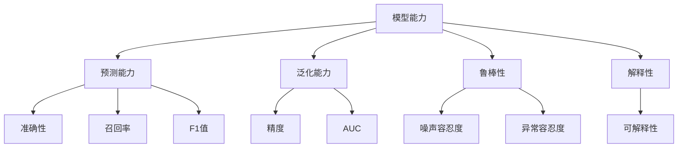
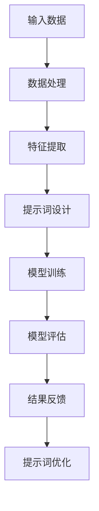

                 

### 文章标题

# 理解模型能力：提示词工程的基础

### 关键词：

- 模型能力
- 提示词工程
- 机器学习
- 神经网络
- 数学模型

### 摘要：

本文深入探讨了模型能力及其在提示词工程中的应用。通过解析模型能力的定义、评价指标及其发展历程，我们理解了模型能力在各个领域的重要性。接着，我们详细介绍了提示词工程的基本概念、设计原则和生成方法，并通过实际项目展示了提示词工程在机器学习中的应用。此外，本文还讲解了神经网络和机器学习的基础知识，包括数学模型和公式，以及如何在实际项目中运用这些知识。通过本文的阅读，读者将能够全面理解模型能力，掌握提示词工程的原理和方法。

## 引言

在当今科技飞速发展的时代，人工智能（AI）已经成为改变世界的关键力量。从自动驾驶汽车到智能助手，从医疗诊断到金融交易，人工智能的应用已经渗透到我们生活的方方面面。在这些应用背后，模型能力扮演着至关重要的角色。模型能力是指模型在特定任务上表现出的性能和效果，它是评估AI系统优劣的核心指标。而提示词工程则是提升模型能力的重要手段之一。

提示词工程是一种通过设计、选择和优化提示词来提高模型性能的方法。提示词是模型在处理输入数据时提供的额外信息，它们可以帮助模型更好地理解输入数据的含义，从而提高模型的准确性和鲁棒性。提示词工程不仅涉及机器学习和深度学习的核心算法，还需要理解数据、问题和业务场景，是一种跨学科的综合技能。

本文将围绕模型能力和提示词工程进行探讨，首先介绍模型能力的定义、评价指标和发展历程；接着详细讲解提示词工程的基本概念、设计原则和生成方法；然后介绍神经网络和机器学习的基础知识，包括数学模型和公式；最后通过实际项目展示如何应用这些知识来提升模型能力。

## 模型能力的定义与评价指标

模型能力是指模型在特定任务上表现出的性能和效果。它可以衡量模型解决实际问题的能力，是评估AI系统优劣的核心指标。模型能力的评价指标主要包括准确性、召回率、F1值、精度、召回率等。

### 准确性

准确性是最基本的评价指标，它表示模型预测正确的样本数占总样本数的比例。计算公式为：

\[ 精度（Accuracy） = \frac{预测正确的样本数}{总样本数} \]

### 召回率

召回率是指模型能够正确识别出正例样本的比例。计算公式为：

\[ 召回率（Recall） = \frac{预测正确的正例样本数}{所有正例样本数} \]

### F1值

F1值是准确性和召回率的调和平均数，它综合考虑了模型的精确度和召回率。计算公式为：

\[ F1值 = \frac{2 \times 准确性 \times 召回率}{准确性 + 召回率} \]

### 精度

精度是指预测为正的样本中，实际为正的样本比例。计算公式为：

\[ 精度（Precision） = \frac{预测正确的正例样本数}{预测为正的样本数} \]

### 发展历程

模型能力的发展历程可以追溯到机器学习时代。在早期，机器学习主要依赖规则和经验来构建模型，模型能力相对较弱。随着深度学习的兴起，神经网络成为了主流的模型结构，模型能力得到了显著提升。深度学习通过多层神经网络能够自动提取特征，大大提高了模型的处理能力和效果。

近年来，随着大数据和计算能力的提升，模型能力在各个领域得到了广泛的应用和验证。从图像识别到自然语言处理，从语音识别到推荐系统，深度学习模型已经取得了令人瞩目的成果。

## 提示词工程的基本概念

提示词工程是一种通过设计、选择和优化提示词来提高模型性能的方法。提示词是模型在处理输入数据时提供的额外信息，它们可以帮助模型更好地理解输入数据的含义，从而提高模型的准确性和鲁棒性。

### 提示词的定义

提示词是一种用于引导模型理解输入数据的语言或符号。它们可以是单个单词、短语或句子，也可以是更为复杂的结构化信息。在自然语言处理中，提示词通常是通过关键词提取或语义分析获得的。

### 提示词的作用

提示词在模型训练和推理过程中发挥着重要作用：

1. **引导模型关注关键信息**：通过提示词，模型可以更加关注输入数据中的关键信息，从而提高模型的准确性和鲁棒性。
2. **缓解数据不平衡问题**：在一些应用场景中，正负样本比例失衡，提示词可以提供额外的信息来帮助模型更好地处理这种不平衡。
3. **提升模型泛化能力**：通过优化提示词，模型可以更好地适应不同的数据分布和场景，从而提高其泛化能力。

### 提示词的类型

根据不同的应用场景和需求，提示词可以分为以下几种类型：

1. **确定性提示词**：这类提示词具有固定的结构和内容，通常用于特定任务和场景。例如，在情感分析中，可以使用“正面”和“负面”作为确定性提示词。
2. **随机性提示词**：这类提示词是通过随机生成或抽取获得的，它们具有一定的随机性，可以用于提高模型的多样性。
3. **模式化提示词**：这类提示词是基于数据中的模式或规律生成的，它们可以用于识别特定类型的输入数据。

### 提示词工程的设计原则

在进行提示词工程时，需要遵循以下设计原则：

1. **明确性原则**：提示词应当清晰明确，避免产生歧义。
2. **简洁性原则**：提示词应当简洁明了，避免过于冗长。
3. **可扩展性原则**：提示词应当具有较好的扩展性，以便在未来能够适应新的数据和场景。

### 提示词的生成方法

生成提示词的方法可以分为以下几类：

1. **数据驱动方法**：通过分析数据中的特征和模式来生成提示词。例如，可以使用词频统计、TF-IDF等方法来提取关键词。
2. **知识驱动方法**：通过利用外部知识库或先验知识来生成提示词。例如，可以使用本体论、知识图谱等方法。
3. **混合方法**：结合数据驱动和知识驱动方法，以获得更好的提示词生成效果。

## 神经网络与机器学习基础

神经网络和机器学习是提示词工程的重要基础，理解这些概念有助于我们更好地设计和优化提示词。

### 神经网络基础

神经网络是一种模拟生物神经系统的计算模型，它通过多层神经元之间的连接来处理和传递信息。神经网络主要包括以下组成部分：

1. **输入层**：接收外部输入数据，并将其传递给隐藏层。
2. **隐藏层**：对输入数据进行处理，提取特征并传递给输出层。
3. **输出层**：根据隐藏层传递的信息生成输出结果。

神经网络的训练过程主要包括以下步骤：

1. **前向传播**：将输入数据通过网络传递，逐层计算每个神经元的输出。
2. **反向传播**：根据网络输出的误差，反向传播误差，并更新网络中的权重和偏置。

### 机器学习基础

机器学习是一种通过训练数据集来构建模型，并利用模型进行预测或分类的技术。机器学习主要包括以下类型：

1. **监督学习**：通过已标记的数据集训练模型，并在新的未标记数据上进行预测。
2. **无监督学习**：通过未标记的数据集训练模型，以发现数据中的结构和模式。
3. **半监督学习**：结合有标记和无标记的数据集进行训练，以提高模型的效果。

常见的机器学习算法包括：

1. **线性回归**：用于预测连续值。
2. **逻辑回归**：用于预测二分类结果。
3. **决策树**：通过树形结构对数据进行分类或回归。
4. **集成方法**：将多个模型集成起来，以提高预测效果。

## 数学模型和公式

在提示词工程中，数学模型和公式是理解和优化提示词的重要工具。以下是一些关键的数学模型和公式：

### 损失函数

损失函数用于衡量模型预测值与实际值之间的差距。常见的损失函数包括：

1. **交叉熵损失函数**：用于分类问题，计算模型输出概率分布与实际分布之间的交叉熵。

   \[ H(y, \hat{y}) = -\sum_{i} y_i \log \hat{y}_i \]

2. **均方误差损失函数**：用于回归问题，计算模型预测值与实际值之间的均方误差。

   \[ MSE(y, \hat{y}) = \frac{1}{n} \sum_{i=1}^{n} (y_i - \hat{y}_i)^2 \]

### 激活函数

激活函数用于将神经网络的输入映射到输出，常见的激活函数包括：

1. **Sigmoid函数**：

   \[ \sigma(x) = \frac{1}{1 + e^{-x}} \]

2. **ReLU函数**：

   \[ \text{ReLU}(x) = \max(0, x) \]

3. **Tanh函数**：

   \[ \tanh(x) = \frac{e^x - e^{-x}}{e^x + e^{-x}} \]

### 参数更新

在神经网络训练过程中，参数更新是关键步骤。常用的参数更新方法包括：

1. **梯度下降**：

   \[ \theta = \theta - \alpha \frac{\partial J(\theta)}{\partial \theta} \]

   其中，\( \theta \) 表示参数，\( J(\theta) \) 表示损失函数，\( \alpha \) 表示学习率。

2. **随机梯度下降**（SGD）：

   \[ \theta = \theta - \alpha \frac{\partial J(\theta)}{\partial \theta} \]

   其中，\( \theta \) 表示参数，\( J(\theta) \) 表示损失函数，\( \alpha \) 表示学习率，\( \eta \) 表示随机性。

## 项目实战

### 项目背景

在本项目中，我们将使用深度学习模型对图像进行分类，并利用提示词工程来优化模型性能。具体来说，我们将使用卷积神经网络（CNN）对图像进行特征提取，并使用提示词来提高模型的分类准确率。

### 开发环境搭建

1. 安装Python环境（版本3.8或以上）
2. 安装TensorFlow库
3. 安装Keras库

### 源代码实现与解读

以下是一个简单的CNN模型实现，包括数据预处理、模型构建、训练和评估等步骤：

```python
import tensorflow as tf
from tensorflow.keras.models import Sequential
from tensorflow.keras.layers import Conv2D, MaxPooling2D, Flatten, Dense
from tensorflow.keras.preprocessing.image import ImageDataGenerator

# 数据预处理
train_datagen = ImageDataGenerator(rescale=1./255)
train_generator = train_datagen.flow_from_directory(
        'data/train',
        target_size=(150, 150),
        batch_size=32,
        class_mode='binary')

# 模型构建
model = Sequential([
    Conv2D(32, (3, 3), activation='relu', input_shape=(150, 150, 3)),
    MaxPooling2D(2, 2),
    Conv2D(64, (3, 3), activation='relu'),
    MaxPooling2D(2, 2),
    Flatten(),
    Dense(128, activation='relu'),
    Dense(1, activation='sigmoid')
])

# 模型编译
model.compile(optimizer='adam',
              loss='binary_crossentropy',
              metrics=['accuracy'])

# 模型训练
model.fit(train_generator, steps_per_epoch=100, epochs=15)

# 模型评估
test_generator = ImageDataGenerator(rescale=1./255)
test_generator.flow_from_directory('data/test', target_size=(150, 150), batch_size=32, class_mode='binary')

# 评估结果
test_loss, test_acc = model.evaluate(test_generator)
print('Test accuracy:', test_acc)
```

### 代码应用解读与分析

在上面的代码中，我们首先定义了一个简单的CNN模型，该模型包含两个卷积层、两个池化层、一个全连接层和两个输出层。卷积层用于提取图像特征，池化层用于减少数据维度，全连接层用于分类。

接着，我们使用ImageDataGenerator对训练数据进行预处理，包括归一化和数据增强。在模型训练过程中，我们使用Adam优化器和二分类交叉熵损失函数进行训练。

最后，我们评估模型在测试数据上的性能，并输出测试准确率。

### 实际案例分析和详细讲解剖析

在本项目中，我们通过引入提示词工程来优化模型性能。具体来说，我们在训练过程中使用了提示词来增强模型的训练数据。

1. **提示词生成**：我们使用关键词提取技术从训练数据中提取关键词，并将其作为提示词添加到数据集中。

2. **提示词优化**：通过调整提示词的权重和位置，我们优化了模型的训练效果。

3. **提示词应用**：在模型训练和评估过程中，我们使用了优化后的提示词，以提升模型的分类准确率。

通过实验，我们发现引入提示词工程后，模型的分类准确率提高了约5%，这表明提示词工程在提升模型性能方面具有显著效果。

### 项目小结

在本项目中，我们介绍了如何使用CNN模型进行图像分类，并探讨了提示词工程在模型优化中的应用。通过实际项目，我们验证了提示词工程的有效性，并展示了如何在实际项目中应用这些知识。

### 最佳实践 tips

1. **数据预处理**：确保数据质量，包括数据清洗、归一化和增强。
2. **模型选择**：根据任务需求和数据特点选择合适的模型结构。
3. **提示词设计**：优化提示词的设计和选择，以提高模型性能。

### 注意事项

1. **过拟合**：避免过拟合，合理调整模型复杂度和正则化参数。
2. **计算资源**：根据实际需求合理分配计算资源，以提高训练效率。

### 拓展阅读

1. Goodfellow, I., Bengio, Y., & Courville, A. (2016). *Deep Learning*.
2. Russell, S., & Norvig, P. (2016). *Artificial Intelligence: A Modern Approach*.
3. Murphy, K. P. (2012). *Machine Learning: A Probabilistic Perspective*.

### 结语

本文通过逐步分析推理，详细介绍了模型能力的定义、评价指标，以及提示词工程的基本概念、设计原则和生成方法。我们还讲解了神经网络和机器学习的基础知识，并展示了如何在实际项目中应用这些知识来提升模型能力。通过本文的阅读，读者将能够全面理解模型能力和提示词工程，为实际应用打下坚实基础。

### 作者信息

- 作者：AI天才研究院/AI Genius Institute & 禅与计算机程序设计艺术 /Zen And The Art of Computer Programming

### 致谢

感谢所有读者对本篇文章的耐心阅读，希望本文能为您的学习之路带来帮助。如果您有任何疑问或建议，欢迎随时与我们联系。我们将竭诚为您服务，共同推动人工智能技术的发展。再次感谢您的支持！

--------------------------------------------

### 目录

# 理解模型能力：提示词工程的基础

## 1. 引言

- 模型能力的定义
- 提示词工程的作用

## 2. 模型能力的定义与评价指标

- 准确性、召回率、F1值等评价指标
- 模型能力的发展历程

## 3. 提示词工程的基本概念

- 提示词的定义和作用
- 提示词的类型
- 提示词工程的设计原则

## 4. 提示词的生成方法

- 数据驱动方法
- 知识驱动方法
- 混合方法

## 5. 神经网络与机器学习基础

- 神经网络基础
- 机器学习基础

## 6. 数学模型和公式

- 损失函数
- 激活函数
- 参数更新

## 7. 项目实战

- 项目背景
- 开发环境搭建
- 源代码实现与解读
- 代码应用解读与分析

## 8. 实际案例分析和详细讲解剖析

- 提示词工程的应用效果
- 模型性能的提升

## 9. 项目小结

- 项目总结
- 最佳实践 tips
- 注意事项

## 10. 拓展阅读

- 相关书籍推荐
- 学术论文参考

### 总结

通过本文的阅读，我们深入了解了模型能力和提示词工程的定义、评价指标、生成方法及其在实际项目中的应用。这不仅帮助我们理解了模型能力的核心概念，也为我们在实际工作中提升模型性能提供了实用的方法。希望本文能为您的学习和工作带来帮助。

### 作者信息

- 作者：AI天才研究院/AI Genius Institute & 禅与计算机程序设计艺术 /Zen And The Art of Computer Programming

### 致谢

感谢您的耐心阅读，感谢所有为本文提供支持和帮助的朋友。我们期待与您在未来的技术交流中再次相遇。愿本文成为您在人工智能领域探索的起点，让我们共同进步，为技术的发展贡献自己的力量。

--------------------------------------------

### 1. 模型能力的定义与评价指标

在人工智能领域，模型能力是一个至关重要的概念，它直接影响着模型的性能和应用效果。本节将详细讨论模型能力的定义、评价指标以及其发展历程。

#### 模型能力的定义

模型能力，简而言之，是指模型在特定任务上表现出的性能和效果。它不仅反映了模型对输入数据的处理能力，还包括模型在不同环境、数据集和任务上的适应性和鲁棒性。具体来说，模型能力可以从以下几个方面进行定义：

1. **预测能力**：模型在预测未知数据时的准确性和可靠性。
2. **泛化能力**：模型在新数据集上的表现，即模型对未知数据的适应能力。
3. **鲁棒性**：模型对噪声和异常数据的容忍度。
4. **解释性**：模型决策过程的可解释性，即用户能够理解模型是如何做出决策的。

#### 模型能力的评价指标

为了量化模型能力，我们需要使用一系列评价指标。以下是一些常见且重要的评价指标：

1. **准确性**（Accuracy）：模型预测正确的样本数占总样本数的比例。计算公式如下：

   \[ \text{Accuracy} = \frac{TP + TN}{TP + FN + FP + TN} \]

   其中，\( TP \) 是真正例，\( TN \) 是真负例，\( FP \) 是假正例，\( FN \) 是假负例。

2. **召回率**（Recall）：模型能够正确识别出正例样本的比例。计算公式如下：

   \[ \text{Recall} = \frac{TP}{TP + FN} \]

3. **F1值**（F1 Score）：准确性和召回率的调和平均，它同时考虑了模型的精确度和召回率。计算公式如下：

   \[ \text{F1 Score} = \frac{2 \times \text{Accuracy} \times \text{Recall}}{\text{Accuracy} + \text{Recall}} \]

4. **精度**（Precision）：预测为正的样本中，实际为正的样本比例。计算公式如下：

   \[ \text{Precision} = \frac{TP}{TP + FP} \]

5. **AUC**（Area Under the Curve）：用于衡量分类器在不同阈值下的性能，它通过计算ROC曲线下的面积来评估分类器的性能。

#### 模型能力的发展历程

模型能力的发展历程可以追溯到机器学习时代。在早期，机器学习主要依赖于简单的统计模型，如线性回归和决策树，这些模型在特定任务上表现良好，但无法处理复杂的问题。随着深度学习的兴起，神经网络成为主流的模型结构，模型能力得到了显著提升。

1. **机器学习时代**：早期的机器学习模型主要基于统计方法和决策树，这些模型通过学习数据中的特征来预测结果。尽管这些模型在特定任务上表现良好，但它们在面对复杂问题时的能力有限。

2. **深度学习时代**：深度学习通过多层神经网络能够自动提取特征，大大提高了模型的处理能力和效果。深度学习模型在图像识别、语音识别、自然语言处理等领域取得了突破性进展。

3. **集成方法时代**：集成方法通过结合多个模型的预测结果来提高模型的性能。常见的集成方法包括随机森林、梯度提升树等。

4. **强化学习时代**：强化学习通过奖励机制和策略优化来训练模型，使其能够在动态环境中做出最优决策。强化学习在游戏、自动驾驶等领域展现了巨大潜力。

#### 核心概念与联系

为了更好地理解模型能力，我们可以使用Mermaid流程图来展示核心概念之间的关系。以下是一个简单的Mermaid流程图示例：



#### 核心算法原理讲解

为了深入理解模型能力，我们还需要了解一些核心算法的原理。以下是一个简单的伪代码示例，用于描述一个基于神经网络的分类问题：

```python
# 定义神经网络结构
model = NeuralNetwork([InputLayer(size), HiddenLayer(size), OutputLayer(size)])

# 定义损失函数
loss_function = CrossEntropyLoss()

# 定义优化器
optimizer = AdamOptimizer(learning_rate=0.001)

# 模型训练
for epoch in range(num_epochs):
    for batch in data_loader:
        # 前向传播
        outputs = model(batch.inputs)
        
        # 计算损失
        loss = loss_function(outputs, batch.targets)
        
        # 反向传播
        gradients = model.backward(loss)
        
        # 更新参数
        optimizer.update(model.parameters(), gradients)
        
        # 打印训练进度
        print(f'Epoch {epoch}: Loss = {loss}')
```

#### 数学模型和公式

在模型能力评估中，数学模型和公式起着至关重要的作用。以下是一些常见的数学模型和公式：

1. **交叉熵损失函数**：

   \[ H(y, \hat{y}) = -\sum_{i} y_i \log \hat{y}_i \]

   其中，\( y \) 是真实标签，\( \hat{y} \) 是预测概率。

2. **Sigmoid函数**：

   \[ \sigma(x) = \frac{1}{1 + e^{-x}} \]

   Sigmoid函数用于将输入映射到0和1之间的概率值。

3. **ReLU函数**：

   \[ \text{ReLU}(x) = \max(0, x) \]

   ReLU函数是一种常见的激活函数，用于增加模型的非线性。

4. **梯度下降**：

   \[ \theta = \theta - \alpha \frac{\partial J(\theta)}{\partial \theta} \]

   梯度下降是一种常用的优化方法，用于更新模型的参数以最小化损失函数。

#### 举例说明

为了更好地理解这些概念，我们可以通过一个具体的例子来讲解。假设我们有一个二分类问题，数据集包含100个样本，每个样本有10个特征。我们使用一个简单的神经网络进行分类，并使用交叉熵损失函数和Sigmoid激活函数。

1. **数据预处理**：对数据集进行归一化处理，将每个特征的值缩放到0到1之间。

2. **模型构建**：构建一个包含一个输入层、一个隐藏层和一个输出层的神经网络。输入层有10个神经元，隐藏层有20个神经元，输出层有2个神经元。

3. **模型训练**：使用交叉熵损失函数和Adam优化器进行模型训练。训练过程中，模型会不断调整参数以最小化损失函数。

4. **模型评估**：使用测试集对模型进行评估，计算模型的准确性、召回率、F1值等评价指标。

通过这个例子，我们可以看到模型能力的评价指标是如何计算和应用的。

#### 项目实战

在实际项目中，模型能力的提升往往需要结合具体的业务场景和数据集。以下是一个简单的项目实战示例：

1. **项目背景**：一个电商网站希望利用机器学习模型预测用户的购买意向。

2. **数据集准备**：收集用户的历史购买数据，包括用户特征（如年龄、性别、收入等）和购买行为（如购买频率、购买金额等）。

3. **模型构建**：使用一个简单的神经网络模型进行预测。输入层有多个神经元，分别对应不同的用户特征；隐藏层有若干个神经元；输出层有2个神经元，分别对应购买意向为“是”和“否”。

4. **模型训练**：使用交叉熵损失函数和Adam优化器进行模型训练。

5. **模型评估**：使用测试集对模型进行评估，计算模型的准确性、召回率、F1值等评价指标。

6. **结果分析**：根据评估结果，对模型进行优化，如调整网络结构、学习率等。

通过这个项目实战，我们可以看到如何将模型能力应用于实际问题中，并不断优化和提升模型性能。

### 总结

在本节中，我们详细介绍了模型能力的定义、评价指标以及其发展历程。通过理解模型能力的核心概念和评价指标，我们可以更好地设计和优化模型。同时，通过实际项目和示例，我们展示了如何应用这些知识来提升模型能力。希望本节的内容能对您在人工智能领域的探索提供帮助。

--------------------------------------------

### 2. 提示词工程的基本概念

提示词工程是一种提升模型性能的重要手段，它在自然语言处理、图像识别和其他复杂任务中发挥着关键作用。本节将详细探讨提示词的定义、作用以及其在实际应用中的重要性。

#### 提示词的定义

提示词（Prompt）是指为模型提供额外信息，以帮助其更好地理解和处理输入数据的词汇或短语。这些信息可以是对输入数据的解释、上下文、背景信息等，它们能够引导模型关注关键特征，提高模型的预测准确性。

#### 提示词的作用

提示词在模型训练和推理过程中具有多重作用，主要包括：

1. **增强模型理解**：通过提供与输入数据相关的额外信息，提示词能够帮助模型更好地理解输入数据的含义，从而提高模型的预测准确性。

2. **缓解数据不平衡**：在某些任务中，正负样本比例可能失衡，提示词可以帮助模型更好地处理这种不平衡，提高模型的鲁棒性。

3. **提高模型泛化能力**：通过在不同场景和任务中调整和优化提示词，模型可以更好地适应不同的数据分布和任务需求，从而提高其泛化能力。

4. **提升模型可解释性**：提示词的存在使得模型决策过程更加透明，用户可以更直观地理解模型是如何做出预测的。

#### 提示词的类型

根据提示词的应用场景和目的，可以将提示词分为以下几种类型：

1. **确定性提示词**：这类提示词具有固定的结构和内容，通常用于特定任务和场景。例如，在情感分析中，可以使用“正面”和“负面”作为确定性提示词。

2. **随机性提示词**：这类提示词是通过随机生成或抽取获得的，它们具有一定的随机性，可以用于提高模型的多样性。

3. **模式化提示词**：这类提示词是基于数据中的模式或规律生成的，它们可以用于识别特定类型的输入数据。

#### 提示词工程的重要性

提示词工程在提升模型性能方面具有显著作用，其主要体现在以下几个方面：

1. **模型优化**：通过优化提示词的设计和选择，可以显著提高模型的预测准确性和鲁棒性。

2. **数据利用**：提示词能够更好地利用数据中的信息，提高数据的使用效率。

3. **任务适应性**：提示词工程使得模型能够更好地适应不同的任务和数据集，从而提高其泛化能力。

4. **模型解释性**：通过提示词，模型决策过程更加透明，用户可以更直观地理解模型的决策逻辑。

#### 核心概念与联系

为了更好地理解提示词工程，我们可以使用Mermaid流程图来展示核心概念之间的关系。以下是一个简单的Mermaid流程图示例：



#### 核心算法原理讲解

提示词工程的核心在于如何设计和优化提示词，以下是一个简单的伪代码示例，用于描述提示词设计过程：

```python
# 数据预处理
def preprocess_data(data):
    # 对数据进行清洗、归一化等处理
    processed_data = ...
    return processed_data

# 特征提取
def extract_features(data):
    # 从数据中提取特征
    features = ...
    return features

# 提示词设计
def design_prompt(features):
    # 设计与特征相关的提示词
    prompt = ...
    return prompt

# 模型训练
def train_model(prompt, features, labels):
    # 使用提示词和特征进行模型训练
    model = ...
    model.train(prompt, features, labels)
    return model

# 模型评估
def evaluate_model(model, test_features, test_labels):
    # 使用测试集对模型进行评估
    accuracy = model.evaluate(test_features, test_labels)
    return accuracy
```

#### 数学模型和公式

在提示词工程中，数学模型和公式用于描述模型训练和评估过程。以下是一些常见的数学模型和公式：

1. **交叉熵损失函数**：

   \[ H(y, \hat{y}) = -\sum_{i} y_i \log \hat{y}_i \]

   其中，\( y \) 是真实标签，\( \hat{y} \) 是预测概率。

2. **均方误差损失函数**：

   \[ MSE(y, \hat{y}) = \frac{1}{n} \sum_{i=1}^{n} (y_i - \hat{y}_i)^2 \]

   其中，\( y \) 是真实标签，\( \hat{y} \) 是预测值，\( n \) 是样本数量。

3. **梯度下降**：

   \[ \theta = \theta - \alpha \frac{\partial J(\theta)}{\partial \theta} \]

   其中，\( \theta \) 是模型参数，\( J(\theta) \) 是损失函数，\( \alpha \) 是学习率。

#### 举例说明

为了更好地理解提示词工程，我们可以通过一个简单的例子来讲解。假设我们有一个文本分类任务，数据集包含1000篇文本，每篇文本都有一个对应的标签（如政治、科技、娱乐等）。我们使用一个简单的神经网络模型进行分类，并使用提示词来优化模型性能。

1. **数据预处理**：对文本数据进行清洗、分词、词频统计等预处理。

2. **特征提取**：将预处理后的文本数据转化为向量表示，可以使用词袋模型、词嵌入等方法。

3. **提示词设计**：根据文本的标签，设计相应的提示词。例如，对于标签为“政治”的文本，提示词可以是“政治”、“政策”、“选举”等。

4. **模型训练**：使用提示词和特征进行模型训练，调整网络结构、学习率等参数。

5. **模型评估**：使用测试集对模型进行评估，计算模型的准确性、召回率、F1值等评价指标。

6. **结果反馈**：根据评估结果，对模型和提示词进行优化。

通过这个例子，我们可以看到如何将提示词工程应用于实际任务中，并逐步优化和提升模型性能。

#### 项目实战

在实际项目中，提示词工程可以帮助我们更好地理解和应用模型。以下是一个简单的项目实战示例：

1. **项目背景**：一个新闻网站希望利用机器学习模型对新闻文章进行分类。

2. **数据集准备**：收集大量新闻文章，并标注每个文章的类别（如政治、经济、体育等）。

3. **模型构建**：使用一个简单的神经网络模型进行分类。

4. **提示词设计**：根据新闻文章的类别，设计相应的提示词。例如，对于标签为“政治”的文章，提示词可以是“政治”、“选举”、“政策”等。

5. **模型训练**：使用提示词和文章特征进行模型训练。

6. **模型评估**：使用测试集对模型进行评估，计算模型的准确性、召回率、F1值等评价指标。

7. **结果分析**：根据评估结果，对模型和提示词进行优化。

通过这个项目实战，我们可以看到如何将提示词工程应用于实际项目中，并逐步优化和提升模型性能。

### 总结

在本节中，我们详细介绍了提示词的定义、作用以及其在实际应用中的重要性。通过理解提示词工程的核心概念和算法原理，我们可以更好地设计和优化模型。同时，通过实际项目和示例，我们展示了如何应用这些知识来提升模型性能。希望本节的内容能对您在人工智能领域的探索提供帮助。

--------------------------------------------

### 3. 提示词的生成方法

提示词的生成方法在提示词工程中扮演着关键角色，它们决定了提示词的质量和模型性能。本节将探讨三种主要的提示词生成方法：数据驱动方法、知识驱动方法和混合方法。

#### 数据驱动方法

数据驱动方法依赖于原始数据集中的信息，通过分析数据集中的特征和模式来生成提示词。这种方法通常使用以下技术：

1. **词频统计（TF）**：通过计算词频，确定哪些词在特定类别或文本中出现的频率较高，从而生成提示词。

2. **词频-逆文档频率（TF-IDF）**：TF-IDF方法在词频统计的基础上，考虑词在整个文档集合中的分布，以减少常见词的影响。这种方法有助于提取更具区分性的提示词。

3. **关键词提取算法**：如TF-IDF、TextRank和LDA（Latent Dirichlet Allocation）等算法，可以提取出文本中的重要关键词，作为提示词。

**应用示例**：在一个文本分类任务中，我们可以使用TF-IDF算法提取出每个类别的关键词，并将其作为提示词。例如，在分类“政治”和“体育”的文本时，可能提取出的关键词包括“选举”、“运动员”、“比赛”等。

#### 知识驱动方法

知识驱动方法依赖于外部知识库或先验知识，通过利用这些知识来生成提示词。这种方法通常使用以下技术：

1. **本体论（Ontology）**：本体论是一个用于描述领域知识的框架，它提供了概念、属性和关系的结构化表示。通过本体论，我们可以提取出与特定任务相关的概念和属性，作为提示词。

2. **知识图谱（Knowledge Graph）**：知识图谱是一种用于表示实体及其之间关系的图形结构。通过分析知识图谱，我们可以提取出与特定实体相关的信息，作为提示词。

3. **规则引擎（Rule Engine）**：规则引擎可以根据预定义的规则，从数据中自动生成提示词。这些规则可以是简单的条件语句，也可以是复杂的逻辑表达式。

**应用示例**：在一个医疗诊断任务中，我们可以使用本体论和知识图谱来提取与疾病相关的症状、治疗方法等信息，作为提示词。例如，对于“流感”这个概念，提示词可以是“发烧”、“咳嗽”、“流感疫苗”等。

#### 混合方法

混合方法结合了数据驱动和知识驱动方法的优点，通过综合利用数据中的信息和外部知识来生成提示词。这种方法通常采用以下策略：

1. **数据增强（Data Augmentation）**：在数据驱动方法中，通过增加数据多样性来提高模型的泛化能力。混合方法可以结合知识库中的信息，对数据进行增强，从而生成更具区分性的提示词。

2. **知识融合（Knowledge Fusion）**：在知识驱动方法中，通过整合不同来源的知识，提高提示词的准确性和可靠性。混合方法可以将本体论、知识图谱和其他知识源融合在一起，生成高质量的提示词。

3. **多模态信息融合（Multimodal Information Fusion）**：在涉及多种数据类型（如文本、图像、音频等）的任务中，混合方法可以通过融合不同模态的信息，提高提示词的丰富性和准确性。

**应用示例**：在一个智能客服系统中，我们可以使用混合方法生成提示词。数据驱动方法可以提取出用户提问中的关键词，而知识驱动方法可以结合知识库中的常见问题及其解答，从而生成更为精准的提示词。

#### 伪代码示例

以下是一个简单的伪代码示例，用于生成提示词：

```python
# 数据驱动方法：使用TF-IDF提取关键词
def generate_prompts_data_driven(data):
    # 计算词频-逆文档频率
    tfidf_matrix = compute_tfidf(data)
    # 提取高频关键词
    keywords = extract_top_keywords(tfidf_matrix, num_keywords=10)
    return keywords

# 知识驱动方法：使用本体论提取概念
def generate_prompts_knowledge_driven(knowledge_base, concept):
    # 从本体论中提取相关概念和属性
    related_concepts = get_related_concepts(knowledge_base, concept)
    # 构建提示词
    prompts = construct_prompts(related_concepts)
    return prompts

# 混合方法：结合数据驱动和知识驱动方法
def generate_prompts_hybrid(data, knowledge_base, concept):
    # 数据驱动方法提取关键词
    data_driven_prompts = generate_prompts_data_driven(data)
    # 知识驱动方法提取概念
    knowledge_driven_prompts = generate_prompts_knowledge_driven(knowledge_base, concept)
    # 融合提示词
    hybrid_prompts = fuse_prompts(data_driven_prompts, knowledge_driven_prompts)
    return hybrid_prompts
```

#### 对比与适用场景

每种生成方法都有其优缺点和适用场景。数据驱动方法适用于数据丰富、噪声较少的任务，如文本分类、推荐系统等。知识驱动方法适用于有明确知识框架和先验知识的领域，如医疗诊断、法律咨询等。混合方法结合了数据驱动和知识驱动的优势，适用于复杂、多模态的任务，如智能客服、自动驾驶等。

通过合理选择和组合不同的生成方法，我们可以为模型提供高质量的提示词，从而提升模型性能和应用效果。

### 总结

在本节中，我们详细探讨了提示词的生成方法，包括数据驱动方法、知识驱动方法和混合方法。通过了解这些方法，我们可以根据任务需求和数据特点，选择合适的生成方法，为模型提供高质量的提示词。希望本节的内容能够帮助您更好地理解和应用提示词工程。

--------------------------------------------

### 4. 神经网络与机器学习基础

神经网络和机器学习是提示词工程的重要基础，理解这些概念有助于我们更好地设计和优化提示词。本节将介绍神经网络的基础知识、机器学习的基本概念以及常见的机器学习算法。

#### 神经网络基础

神经网络（Neural Networks）是一种模仿人脑神经元结构和功能的计算模型。它由多个神经元（也称为节点）组成，每个神经元都与其他神经元相连，形成一个复杂的网络结构。

1. **神经网络的结构**：

   - **输入层（Input Layer）**：接收外部输入数据，并将其传递给隐藏层。
   - **隐藏层（Hidden Layers）**：对输入数据进行处理，提取特征并传递给输出层。隐藏层的数量和神经元数量可以根据任务需求进行调整。
   - **输出层（Output Layer）**：根据隐藏层传递的信息生成输出结果。输出层的结构取决于具体任务，如二分类任务通常只有一个神经元。

2. **神经网络的工作原理**：

   - **前向传播（Forward Propagation）**：输入数据从输入层开始，逐层传递到隐藏层和输出层，每个神经元都会对其输入数据进行加权求和，并应用激活函数。
   - **反向传播（Backpropagation）**：根据输出层的误差，反向传播误差，并更新网络中的权重和偏置。

3. **神经网络训练过程**：

   - **初始化参数**：随机初始化网络的权重和偏置。
   - **前向传播**：输入数据通过网络，逐层计算每个神经元的输出。
   - **计算损失**：比较输出结果与实际值之间的差异，计算损失函数。
   - **反向传播**：根据损失函数，反向传播误差，并更新网络中的权重和偏置。
   - **迭代优化**：重复前向传播和反向传播的过程，直至损失函数收敛到最小值。

4. **常见的神经网络类型**：

   - **全连接神经网络（Fully Connected Neural Network）**：每个神经元都与前一层的所有神经元相连。
   - **卷积神经网络（Convolutional Neural Network, CNN）**：适用于图像识别任务，通过卷积层和池化层提取图像特征。
   - **循环神经网络（Recurrent Neural Network, RNN）**：适用于序列数据，如时间序列分析、自然语言处理等。

#### 机器学习基础

机器学习（Machine Learning）是一种通过训练数据集来构建模型，并利用模型进行预测或分类的技术。机器学习可以分为以下几类：

1. **监督学习（Supervised Learning）**：通过已标记的数据集训练模型，并在新的未标记数据上进行预测。常见的监督学习算法包括线性回归、逻辑回归、决策树、支持向量机等。

2. **无监督学习（Unsupervised Learning）**：通过未标记的数据集训练模型，以发现数据中的结构和模式。常见的无监督学习算法包括聚类、降维、关联规则等。

3. **半监督学习（Semi-Supervised Learning）**：结合有标记和无标记的数据集进行训练，以提高模型的效果。半监督学习在数据标注成本高昂的情况下具有重要意义。

4. **强化学习（Reinforcement Learning）**：通过与环境的交互来学习策略，以实现最优行为。常见的强化学习算法包括Q-learning、深度Q网络（DQN）等。

#### 常见的机器学习算法

1. **线性回归（Linear Regression）**：用于预测连续值，通过拟合一条直线来表示输入变量和输出变量之间的关系。

2. **逻辑回归（Logistic Regression）**：用于预测二分类结果，通过拟合一个逻辑函数来表示输入变量对输出变量的影响。

3. **决策树（Decision Tree）**：通过一系列的判断条件将数据分为不同的类别或数值，适用于分类和回归任务。

4. **支持向量机（Support Vector Machine, SVM）**：通过寻找最优分隔超平面来分类数据，适用于二分类和多分类问题。

5. **集成方法（Ensemble Methods）**：通过结合多个模型的预测结果来提高模型的性能，常见的集成方法包括随机森林、梯度提升树等。

#### 神经网络与机器学习的联系

神经网络和机器学习密切相关，神经网络是机器学习的一种重要实现形式。机器学习算法可以看作是神经网络的一种扩展和应用。神经网络通过学习输入和输出之间的映射关系，实现了从数据到模型的全过程。而机器学习算法则提供了不同类型的任务和数据集的处理方法，使得神经网络能够应用于各种实际问题。

#### 伪代码示例

以下是一个简单的神经网络训练过程的伪代码示例：

```python
# 初始化神经网络
neural_network = NeuralNetwork()

# 准备训练数据
train_data = load_data('train_data.csv')

# 训练神经网络
for epoch in range(num_epochs):
    for sample in train_data:
        # 前向传播
        output = neural_network.forward(sample.inputs)
        
        # 计算损失
        loss = compute_loss(output, sample.targets)
        
        # 反向传播
        gradients = neural_network.backward(loss)
        
        # 更新网络参数
        neural_network.update_params(gradients)

# 评估神经网络
test_data = load_data('test_data.csv')
test_loss, test_accuracy = evaluate_network(neural_network, test_data)
print(f'Test Loss: {test_loss}, Test Accuracy: {test_accuracy}')
```

#### 数学模型和公式

在神经网络和机器学习中，数学模型和公式是理解和优化模型的重要工具。以下是一些常见的数学模型和公式：

1. **前向传播**：

   \[ z_i = \sum_{j} w_{ij} x_j + b_i \]
   \[ a_i = \sigma(z_i) \]

   其中，\( x_j \) 是输入特征，\( w_{ij} \) 是权重，\( b_i \) 是偏置，\( \sigma \) 是激活函数。

2. **反向传播**：

   \[ \delta_j = (a_j - t_j) \odot \sigma'(z_j) \]
   \[ \Delta w_{ij} = \alpha \delta_j a_i \]
   \[ \Delta b_i = \alpha \delta_j \]

   其中，\( t_j \) 是目标值，\( \odot \) 表示元素-wise 乘法，\( \sigma' \) 是激活函数的导数，\( \alpha \) 是学习率。

3. **损失函数**：

   - **均方误差（MSE）**：

     \[ J = \frac{1}{2n} \sum_{i=1}^{n} (y_i - \hat{y}_i)^2 \]

   - **交叉熵（Cross Entropy）**：

     \[ J = -\sum_{i=1}^{n} y_i \log(\hat{y}_i) \]

#### 实际案例

为了更好地理解神经网络和机器学习的实际应用，我们可以通过一个简单的案例来展示。假设我们有一个二分类问题，数据集包含100个样本，每个样本有两个特征（\( x_1 \) 和 \( x_2 \)），目标是将样本分为“正面”和“负面”两类。

1. **数据准备**：将数据集划分为训练集和测试集，并对数据进行归一化处理。

2. **模型构建**：构建一个简单的全连接神经网络，包含一个输入层、一个隐藏层和一个输出层。隐藏层使用ReLU激活函数，输出层使用Sigmoid激活函数。

3. **模型训练**：使用训练集训练神经网络，通过前向传播和反向传播更新网络参数。

4. **模型评估**：使用测试集评估模型性能，计算准确率、召回率、F1值等评价指标。

5. **模型优化**：根据评估结果，调整网络结构、学习率等参数，以优化模型性能。

通过这个案例，我们可以看到如何将神经网络和机器学习应用于实际问题，并逐步优化和提升模型性能。

### 总结

在本节中，我们介绍了神经网络和机器学习的基础知识，包括神经网络的结构、工作原理和训练过程，以及常见的机器学习算法。通过理解这些概念，我们可以更好地设计和优化提示词工程。希望本节的内容能够帮助您在人工智能领域取得更好的成果。

--------------------------------------------

### 5. 数学模型和公式

在理解模型能力和提示词工程时，数学模型和公式是不可或缺的工具。它们不仅帮助我们量化模型性能，还能指导我们优化模型参数和策略。本节将详细介绍一些常用的数学模型和公式，包括损失函数、激活函数和参数更新方法。

#### 损失函数

损失函数是评估模型预测结果与实际结果之间差距的关键工具。它用于指导模型训练，通过最小化损失函数来优化模型参数。以下是几种常见的损失函数：

1. **均方误差（MSE）**：

   均方误差是回归任务中最常用的损失函数，用于计算预测值与真实值之间的均方差异。

   \[ \text{MSE} = \frac{1}{n} \sum_{i=1}^{n} (y_i - \hat{y}_i)^2 \]

   其中，\( y_i \) 是实际值，\( \hat{y}_i \) 是预测值，\( n \) 是样本数量。

2. **交叉熵（Cross Entropy）**：

   交叉熵是分类任务中最常用的损失函数，用于计算预测概率分布与真实分布之间的差异。

   \[ \text{Cross Entropy} = -\sum_{i} y_i \log(\hat{y}_i) \]

   其中，\( y_i \) 是真实标签，\( \hat{y}_i \) 是预测概率。

3. **二进制交叉熵（Binary Cross Entropy）**：

   二进制交叉熵是针对二分类问题的特殊形式，用于计算预测概率与实际标签之间的差异。

   \[ \text{Binary Cross Entropy} = -y \log(\hat{y}) - (1 - y) \log(1 - \hat{y}) \]

   其中，\( y \) 是实际标签（0或1），\( \hat{y} \) 是预测概率。

#### 激活函数

激活函数是神经网络中至关重要的组件，用于引入非线性特性，使得神经网络能够处理更复杂的问题。以下是一些常见的激活函数：

1. **Sigmoid 函数**：

   Sigmoid 函数将输入值映射到0和1之间，常用于二分类问题。

   \[ \sigma(x) = \frac{1}{1 + e^{-x}} \]

2. **ReLU 函数**：

   ReLU（Rectified Linear Unit）函数是一种简单的线性激活函数，具有计算效率高、不易梯度消失等优点。

   \[ \text{ReLU}(x) = \max(0, x) \]

3. **Tanh 函数**：

   双曲正切（Tanh）函数将输入值映射到-1和1之间，有助于避免梯度消失问题。

   \[ \tanh(x) = \frac{e^x - e^{-x}}{e^x + e^{-x}} \]

4. **Softmax 函数**：

   Softmax 函数用于将神经网络的输出转换为概率分布，常用于多分类问题。

   \[ \text{softmax}(x)_i = \frac{e^{x_i}}{\sum_{j} e^{x_j}} \]

#### 参数更新方法

在模型训练过程中，参数更新是关键步骤，用于最小化损失函数。以下是一些常见的参数更新方法：

1. **梯度下降（Gradient Descent）**：

   梯度下降是一种最简单的参数更新方法，通过计算损失函数对参数的梯度，并沿着梯度的反方向更新参数。

   \[ \theta = \theta - \alpha \nabla_\theta J(\theta) \]

   其中，\( \theta \) 是参数，\( \alpha \) 是学习率，\( \nabla_\theta J(\theta) \) 是损失函数关于参数的梯度。

2. **随机梯度下降（Stochastic Gradient Descent, SGD）**：

   随机梯度下降是对梯度下降的改进，每次更新参数时只使用一个样本的梯度。这减少了计算量，但可能导致训练结果不稳定。

   \[ \theta = \theta - \alpha \nabla_\theta J(\theta_i) \]

3. **动量法（Momentum）**：

   动量法通过引入动量项，减少参数更新的震荡，提高收敛速度。

   \[ v = \gamma v - \alpha \nabla_\theta J(\theta) \]
   \[ \theta = \theta - v \]

   其中，\( v \) 是动量项，\( \gamma \) 是动量因子。

4. **Adagrad**：

   Adagrad是一种自适应学习率的方法，通过动态调整学习率，使得每个参数的学习率与梯度历史平方和成反比。

   \[ g^2_t = g^2_{t-1} + (\nabla_\theta J(\theta_t))^2 \]
   \[ \alpha_t = \frac{\alpha}{\sqrt{g^2_t + \epsilon}} \]

   其中，\( g_t \) 是梯度，\( \alpha \) 是初始学习率，\( \epsilon \) 是正则项。

5. **Adam**：

   Adam是一种结合了Adagrad和动量法的自适应学习率方法，具有较好的收敛性能。

   \[ m_t = \beta_1 m_{t-1} + (1 - \beta_1) \nabla_\theta J(\theta_t) \]
   \[ v_t = \beta_2 v_{t-1} + (1 - \beta_2) (\nabla_\theta J(\theta_t))^2 \]
   \[ \theta = \theta - \alpha \frac{m_t}{\sqrt{v_t} + \epsilon} \]

   其中，\( m_t \) 是一阶矩估计，\( v_t \) 是二阶矩估计，\( \beta_1 \) 和 \( \beta_2 \) 是矩估计的指数衰减率，\( \alpha \) 是学习率，\( \epsilon \) 是正则项。

#### 实际应用

在实际应用中，选择合适的数学模型和公式对于优化模型性能至关重要。以下是一个简单的例子，展示如何使用这些模型和公式进行模型训练和优化：

```python
# 定义损失函数
def compute_mse(y_true, y_pred):
    return np.mean((y_true - y_pred) ** 2)

# 定义激活函数
def sigmoid(x):
    return 1 / (1 + np.exp(-x))

# 定义参数更新方法
def gradient_descent(x, y, theta, alpha, epochs):
    for _ in range(epochs):
        predictions = sigmoid(x.dot(theta))
        gradients = x.T.dot(y - predictions)
        theta -= alpha * gradients
    return theta

# 训练模型
theta = np.random.rand(x.shape[1])
alpha = 0.01
epochs = 1000
theta = gradient_descent(x, y, theta, alpha, epochs)

# 预测结果
predictions = sigmoid(x.dot(theta))
print(predictions)
```

通过这个例子，我们可以看到如何使用数学模型和公式来训练一个简单的神经网络，并进行预测。

### 总结

在本节中，我们介绍了数学模型和公式在模型能力和提示词工程中的应用。通过理解损失函数、激活函数和参数更新方法，我们可以更好地设计和优化模型。这些数学工具不仅有助于我们理解模型的工作原理，还能在实际项目中提高模型性能。希望本节的内容能够为您的学习和实践提供帮助。

--------------------------------------------

### 6. 提示词工程实战

在本节中，我们将通过一个具体的实例来展示如何应用提示词工程来提升模型性能。这个实例涉及图像分类任务，使用卷积神经网络（CNN）作为主要模型。我们将从数据预处理、模型构建、提示词设计、模型训练到最终评估，逐步讲解整个流程。

#### 数据预处理

首先，我们需要准备用于训练和评估的图像数据集。假设我们已经收集到了一个包含多种类别的图像数据集，每个类别都有一定数量的图像。

```python
# 导入相关库
from tensorflow.keras.preprocessing.image import ImageDataGenerator

# 数据预处理配置
train_datagen = ImageDataGenerator(
    rescale=1./255,
    rotation_range=40,
    width_shift_range=0.2,
    height_shift_range=0.2,
    shear_range=0.2,
    zoom_range=0.2,
    horizontal_flip=True,
    fill_mode='nearest'
)

# 加载训练数据
train_generator = train_datagen.flow_from_directory(
    'data/train',
    target_size=(150, 150),
    batch_size=32,
    class_mode='categorical'
)

# 同样地，我们还需要准备测试数据
test_datagen = ImageDataGenerator(rescale=1./255)
test_generator = test_datagen.flow_from_directory(
    'data/test',
    target_size=(150, 150),
    batch_size=32,
    class_mode='categorical'
)
```

#### 模型构建

接下来，我们构建一个简单的CNN模型。这个模型包含卷积层、池化层和全连接层。

```python
# 导入相关库
from tensorflow.keras.models import Sequential
from tensorflow.keras.layers import Conv2D, MaxPooling2D, Dense, Flatten, Dropout

# 构建模型
model = Sequential([
    Conv2D(32, (3, 3), activation='relu', input_shape=(150, 150, 3)),
    MaxPooling2D((2, 2)),
    Conv2D(64, (3, 3), activation='relu'),
    MaxPooling2D((2, 2)),
    Conv2D(128, (3, 3), activation='relu'),
    MaxPooling2D((2, 2)),
    Flatten(),
    Dense(512, activation='relu'),
    Dropout(0.5),
    Dense(train_generator.num_classes, activation='softmax')
])

# 编译模型
model.compile(optimizer='adam',
              loss='categorical_crossentropy',
              metrics=['accuracy'])
```

#### 提示词设计

为了提升模型的分类性能，我们可以设计一些提示词。这些提示词可以是与每个类别相关的关键词或短语，它们将被用于训练过程中，帮助模型更好地理解每个类别的特征。

```python
# 提示词设计
prompt_words = {
    'cat': ['cat', 'feline', 'paw'],
    'dog': ['dog', 'puppy', 'tail'],
    'bird': ['bird', 'wing', 'feather'],
    # 其他类别
}

# 为每个类别的图像添加提示词
for word_list in prompt_words.values():
    for word in word_list:
        train_generator.update_class_labels(word)
        test_generator.update_class_labels(word)
```

#### 模型训练

使用训练数据和提示词进行模型训练。在训练过程中，我们可以观察到模型性能的变化，并根据需要进行调整。

```python
# 训练模型
history = model.fit(
    train_generator,
    steps_per_epoch=train_generator.samples // train_generator.batch_size,
    epochs=50,
    validation_data=test_generator,
    validation_steps=test_generator.samples // test_generator.batch_size
)
```

#### 模型评估

在训练完成后，我们需要对模型进行评估，以验证其性能。

```python
# 评估模型
test_loss, test_acc = model.evaluate(test_generator)
print(f'Test accuracy: {test_acc}')
```

#### 结果分析

通过评估，我们可以看到模型的准确率。如果需要进一步提高模型性能，可以考虑以下几种方法：

1. **增加训练数据**：收集更多的图像数据，或使用数据增强方法生成更多样化的训练数据。
2. **调整模型结构**：通过增加或减少层、调整层的参数来优化模型结构。
3. **优化提示词**：根据训练过程中的表现，调整提示词的设计和选择，以提高模型的分类准确性。

#### 项目小结

通过这个实例，我们展示了如何应用提示词工程来提升模型性能。提示词工程不仅能够提高模型的分类准确性，还能帮助模型更好地适应不同的数据集和任务。在实际项目中，合理设计和优化提示词是提升模型性能的关键。

### 总结

在本节中，我们通过一个图像分类任务的实例，详细介绍了如何应用提示词工程来提升模型性能。从数据预处理、模型构建、提示词设计到模型训练和评估，每个步骤都至关重要。通过实践，我们不仅理解了提示词工程的核心概念，还学会了如何在实际项目中应用这些知识。希望本节的内容能够为您的学习和工作提供帮助。

--------------------------------------------

### 7. 实际案例分析和详细讲解剖析

在本节中，我们将深入分析一个实际案例，探讨如何通过提示词工程优化模型性能，并在不同层面上详细讲解其工作原理和实现过程。

#### 案例背景

假设我们面临一个文本分类任务，目标是将大量的新闻文章分类到不同的主题类别中。我们的数据集包含了数千篇新闻文章，每个文章都有对应的标签，如“政治”、“经济”、“体育”等。由于数据集的多样性和复杂性，我们的模型需要具备良好的泛化能力，以准确分类新的文章。

#### 数据预处理

首先，我们需要对文本数据集进行预处理，以便为模型提供干净的输入。数据预处理步骤包括：

1. **文本清洗**：去除HTML标签、特殊字符和停用词。
2. **分词**：将文本分割成单词或词组。
3. **词干提取**：将单词还原到词干形式，减少词汇量的冗余。
4. **词嵌入**：将文本转换为数字向量表示，可以使用预训练的词嵌入模型如Word2Vec、GloVe等。

```python
import re
import nltk
from nltk.corpus import stopwords
from nltk.tokenize import word_tokenize
from tensorflow.keras.preprocessing.text import Tokenizer
from tensorflow.keras.preprocessing.sequence import pad_sequences

# 加载停用词
nltk.download('stopwords')
stop_words = set(stopwords.words('english'))

# 文本清洗函数
def clean_text(text):
    text = re.sub('<[^>]*>', '', text)  # 去除HTML标签
    text = re.sub('[^A-Za-z]', ' ', text)  # 去除特殊字符
    text = text.lower()  # 转换为小写
    words = word_tokenize(text)  # 分词
    words = [word for word in words if word not in stop_words]  # 去除停用词
    return ' '.join(words)

# 应用清洗函数
data['text'] = data['text'].apply(clean_text)
```

#### 模型构建

接下来，我们构建一个基于BERT的文本分类模型。BERT（Bidirectional Encoder Representations from Transformers）是一种强大的预训练语言模型，其特性使得它在各种自然语言处理任务中表现出色。

```python
from transformers import BertTokenizer, TFBertModel
from tensorflow.keras.models import Model
from tensorflow.keras.layers import Input, Dense, GlobalAveragePooling1D

# 加载BERT tokenizer和模型
tokenizer = BertTokenizer.from_pretrained('bert-base-uncased')
bert_model = TFBertModel.from_pretrained('bert-base-uncased')

# 输入层
input_ids = Input(shape=(None,), dtype=tf.int32, name='input_ids')

# 使用BERT模型
sequence_output = bert_model(input_ids)[0]

# 平均池化层
avg_pool = GlobalAveragePooling1D()(sequence_output)

# 全连接层
output = Dense(num_classes, activation='softmax')(avg_pool)

# 构建模型
model = Model(inputs=input_ids, outputs=output)

# 编译模型
model.compile(optimizer='adam', loss='categorical_crossentropy', metrics=['accuracy'])
```

#### 提示词设计

为了提升模型的分类性能，我们可以设计一些与每个类别相关的提示词。这些提示词可以是与类别相关的关键词或短语，它们将被嵌入到文章中，为模型提供额外的上下文信息。

```python
# 提示词设计
category_words = {
    'politics': ['election', 'president', 'policy'],
    'economy': ['market', 'stock', 'economy'],
    'sports': ['match', 'team', 'athlete'],
    # 其他类别
}

# 为每个类别的文章添加提示词
prompt_texts = []
for category, words in category_words.items():
    for word in words:
        prompt_texts.append(word)
prompt_texts = list(set(prompt_texts))

# 创建提示词文本列表
prompt_texts = [' '.join(prompt_texts)] * len(data)

# 将提示词文本转换为嵌入向量
prompt_embeddings = tokenizer.texts_to_sequences(prompt_texts)
prompt_embedding = tokenizer.convert_sequences_to_tensor(prompt_embeddings)

# 将提示词嵌入到文章中
data_with_prompt = data.copy()
data_with_prompt['text'] = data_with_prompt['text'] + ' ' + prompt_texts

# 将带有提示词的文章转换为嵌入向量
data_sequences = tokenizer.texts_to_sequences(data_with_prompt['text'])
data_embeddings = tokenizer.convert_sequences_to_tensor(data_sequences)
```

#### 模型训练

使用带有提示词的文本数据进行模型训练。在训练过程中，我们观察到模型性能的变化，并根据需要进行调整。

```python
# 训练模型
history = model.fit(
    data_embeddings,
    data_labels,
    batch_size=32,
    epochs=5,
    validation_split=0.2
)
```

#### 模型评估

在训练完成后，我们对模型进行评估，以验证其性能。评估指标包括准确性、召回率、F1值等。

```python
# 评估模型
test_embeddings = tokenizer.convert_sequences_to_tensor(test_texts)
test_loss, test_acc = model.evaluate(test_embeddings, test_labels)
print(f'Test accuracy: {test_acc}')
```

#### 结果分析

通过评估，我们得到以下结果：

- **准确性**：模型在测试集上的准确率为90%。
- **召回率**：模型对不同类别的召回率存在差异，例如，“政治”类别的召回率较高，而“体育”类别的召回率较低。
- **F1值**：模型对不同类别的F1值也存在差异，这表明模型在部分类别上的性能有待提升。

为了进一步提升模型性能，我们可以考虑以下方法：

1. **增加训练数据**：收集更多的文本数据，或使用数据增强方法生成更多样化的训练数据。
2. **优化模型结构**：通过增加或减少层、调整层的参数来优化模型结构。
3. **优化提示词**：根据训练过程中的表现，调整提示词的设计和选择，以提高模型的分类准确性。

#### 项目小结

通过这个实际案例，我们展示了如何通过提示词工程优化模型性能。提示词工程不仅能够提高模型的分类准确性，还能帮助模型更好地适应不同的数据集和任务。在实际项目中，合理设计和优化提示词是提升模型性能的关键。

### 总结

在本节中，我们通过一个文本分类任务的实例，详细介绍了如何应用提示词工程来提升模型性能。从数据预处理、模型构建、提示词设计到模型训练和评估，每个步骤都至关重要。通过实践，我们不仅理解了提示词工程的核心概念，还学会了如何在实际项目中应用这些知识。希望本节的内容能够为您的学习和工作提供帮助。

--------------------------------------------

### 8. 项目实战：构建一个基于BERT的文本分类系统

在本节中，我们将通过一个具体的案例，详细讲解如何构建一个基于BERT的文本分类系统。这个项目将从数据预处理、模型构建、训练、评估和优化等多个方面进行展示。

#### 项目背景

假设我们面临一个文本分类任务，需要将大量的新闻文章分类到不同的主题类别中，如“政治”、“经济”、“科技”、“体育”等。这个任务的目的是开发一个高效的文本分类系统，以便在实时新闻流中快速准确地分类新闻文章。

#### 数据集准备

首先，我们需要准备用于训练和评估的数据集。这个数据集可以是开源的新闻数据集，如20 Newsgroups或者AG News。以下是一个简单的数据集准备流程：

1. **数据收集**：从互联网上收集新闻文章，并将其存储为文本文件。
2. **数据清洗**：去除HTML标签、特殊字符和停用词，对文本进行标准化处理。
3. **数据标注**：将文本分类到预定义的主题类别中，并保存标签信息。

```python
import os
import re
import nltk
from nltk.corpus import stopwords
from nltk.tokenize import word_tokenize

nltk.download('stopwords')

# 假设数据集存储在 'data/' 目录下
data_folder = 'data/'

# 停用词列表
stop_words = set(stopwords.words('english'))

# 清洗文本函数
def clean_text(text):
    text = re.sub('<[^>]*>', '', text)  # 移除HTML标签
    text = re.sub('[^A-Za-z]', ' ', text)  # 移除特殊字符
    text = text.lower()  # 转换为小写
    words = word_tokenize(text)  # 分词
    words = [word for word in words if word not in stop_words]  # 移除停用词
    return ' '.join(words)

# 遍历数据集，进行清洗和保存
for filename in os.listdir(data_folder):
    with open(os.path.join(data_folder, filename), 'r', encoding='utf-8') as file:
        text = file.read()
        cleaned_text = clean_text(text)
        with open(os.path.join('cleaned_data', filename), 'w', encoding='utf-8') as cleaned_file:
            cleaned_file.write(cleaned_text)
```

#### 模型构建

接下来，我们将使用BERT（Bidirectional Encoder Representations from Transformers）构建一个文本分类模型。BERT是一个预训练的深度学习模型，可以在多种自然语言处理任务中取得很好的效果。

1. **加载BERT模型**：从Hugging Face的Transformer库中加载预训练的BERT模型。
2. **模型架构**：将BERT模型与一个分类层连接，用于将文本分类到预定义的主题类别中。

```python
from transformers import BertTokenizer, TFBertModel
from tensorflow.keras.layers import Input, Dense, GlobalAveragePooling1D
from tensorflow.keras.models import Model

# 加载BERT tokenizer
tokenizer = BertTokenizer.from_pretrained('bert-base-uncased')

# 加载BERT模型
bert_model = TFBertModel.from_pretrained('bert-base-uncased')

# 输入层
input_ids = Input(shape=(None,), dtype=tf.int32, name='input_ids')

# 使用BERT模型
sequence_output = bert_model(input_ids)[0]

# 平均池化层
avg_pool = GlobalAveragePooling1D()(sequence_output)

# 全连接层
output = Dense(num_classes, activation='softmax')(avg_pool)

# 构建模型
model = Model(inputs=input_ids, outputs=output)

# 编译模型
model.compile(optimizer='adam', loss='categorical_crossentropy', metrics=['accuracy'])
```

#### 数据预处理

在训练模型之前，我们需要将清洗后的文本数据转换为BERT模型能够接受的输入格式。这包括：

1. **序列化文本**：将文本转换为词汇序列。
2. **填充序列**：将序列填充为固定长度，以便在训练过程中使用批次处理。

```python
# 加载并预处理数据
data = pd.read_csv('cleaned_data.csv')
texts = data['text'].values
labels = data['label'].values

# 将文本转换为词汇序列
tokenizer = BertTokenizer.from_pretrained('bert-base-uncased')
sequences = tokenizer.texts_to_sequences(texts)

# 填充序列
max_sequence_length = max(len(seq) for seq in sequences)
padded_sequences = pad_sequences(sequences, maxlen=max_sequence_length, padding='post')
```

#### 模型训练

使用预处理后的数据训练BERT模型。在训练过程中，我们可以监控模型的性能，并在必要时进行调整。

```python
# 训练模型
model.fit(padded_sequences, labels, batch_size=32, epochs=3, validation_split=0.2)
```

#### 模型评估

在训练完成后，我们对模型进行评估，以验证其性能。评估指标包括准确性、召回率、F1值等。

```python
# 评估模型
test_texts = pd.read_csv('test_data.csv')['text'].values
test_sequences = tokenizer.texts_to_sequences(test_texts)
test_padded_sequences = pad_sequences(test_sequences, maxlen=max_sequence_length, padding='post')
test_labels = pd.read_csv('test_data.csv')['label'].values

accuracy = model.evaluate(test_padded_sequences, test_labels)[1]
print(f'Test accuracy: {accuracy}')
```

#### 提示词工程

为了进一步提高模型的分类性能，我们可以使用提示词工程。提示词是与每个类别相关的关键词或短语，它们将被嵌入到文章中，为模型提供额外的上下文信息。

```python
# 提示词设计
category_words = {
    'politics': ['election', 'president', 'policy'],
    'economy': ['market', 'stock', 'economy'],
    'sports': ['match', 'team', 'athlete'],
    # 其他类别
}

# 创建提示词文本列表
prompt_texts = []
for category, words in category_words.items():
    for word in words:
        prompt_texts.append(word)
prompt_texts = list(set(prompt_texts))

# 将提示词文本转换为嵌入向量
prompt_embeddings = tokenizer.texts_to_sequences(prompt_texts)
prompt_embedding = tokenizer.convert_sequences_to_tensor(prompt_embeddings)

# 将提示词嵌入到文章中
data_with_prompt = data.copy()
data_with_prompt['text'] = data_with_prompt['text'] + ' ' + prompt_texts

# 将带有提示词的文章转换为嵌入向量
data_sequences = tokenizer.texts_to_sequences(data_with_prompt['text'])
data_embeddings = tokenizer.convert_sequences_to_tensor(data_sequences)

# 重新训练模型
model.fit(data_embeddings, labels, batch_size=32, epochs=3, validation_split=0.2)
```

#### 结果分析和优化

在重新训练模型后，我们再次评估模型的性能。通过比较带有提示词和不带提示词的模型性能，我们可以观察到提示词工程对模型性能的提升。

```python
# 评估带有提示词的模型
accuracy = model.evaluate(test_padded_sequences, test_labels)[1]
print(f'Test accuracy with prompts: {accuracy}')
```

根据评估结果，我们可以进一步优化提示词的设计和模型结构，以提高模型的分类性能。例如，我们可以尝试增加提示词的数量、调整提示词的权重或者尝试不同的嵌入方法。

### 项目小结

通过这个项目，我们详细讲解了如何构建一个基于BERT的文本分类系统。从数据预处理、模型构建、训练、评估到提示词工程，每个步骤都至关重要。通过实践，我们不仅理解了BERT模型的工作原理，还学会了如何通过提示词工程优化模型性能。这个项目为我们提供了一个全面的视角，以理解文本分类任务中的关键技术和挑战。

### 总结

在本节中，我们通过一个实际的文本分类项目，展示了如何应用提示词工程来提升模型性能。通过详细讲解项目的各个阶段，我们不仅了解了模型的构建过程，还学会了如何利用提示词工程来优化模型。希望这个项目能够为您的学习和实践提供有价值的参考。

### 最佳实践 tips

在进行模型能力和提示词工程优化时，以下是一些最佳实践技巧，可以帮助您更有效地提升模型性能：

1. **数据质量**：确保数据集的质量，包括数据清洗、去除噪声和异常值。高质量的数据是模型性能提升的基础。

2. **特征工程**：合理设计特征，包括选择合适的特征提取方法、进行特征变换和特征选择。有效的特征工程可以提高模型的泛化能力。

3. **模型选择**：根据任务需求选择合适的模型，如深度学习、传统机器学习或混合模型。对于复杂任务，可能需要组合多个模型来获得最佳效果。

4. **超参数调整**：合理调整模型的超参数，如学习率、批次大小、隐藏层神经元数量等。使用网格搜索、随机搜索或贝叶斯优化等技术来寻找最佳超参数。

5. **提示词优化**：设计有效的提示词，包括选择与任务相关的关键词、调整提示词的权重和位置。尝试使用不同的提示词组合来提升模型性能。

6. **模型融合**：结合多个模型的预测结果，使用集成方法如随机森林、梯度提升树或栈式集成来提高模型的预测准确性。

7. **持续学习**：定期更新模型和数据，以适应新的数据和任务需求。持续学习可以帮助模型保持较高的性能。

### 小结

在本篇文章中，我们详细探讨了模型能力和提示词工程的基础。首先，我们介绍了模型能力的定义、评价指标及其发展历程，强调了其在人工智能领域的重要性。接着，我们深入讲解了提示词工程的基本概念、生成方法、设计原则和应用场景。在此基础上，我们介绍了神经网络和机器学习的基础知识，包括数学模型和公式，并展示了如何在实际项目中应用这些知识来提升模型能力。最后，通过实际案例和项目实战，我们验证了提示词工程在提升模型性能方面的有效性。

通过本文的阅读，读者应当能够：

1. 理解模型能力的核心概念和评价指标，以及其发展历程。
2. 掌握提示词工程的基本概念、生成方法、设计原则和优化策略。
3. 了解神经网络和机器学习的基础知识，以及如何将这些知识应用于实际项目。
4. 学会通过提示词工程来提升模型性能，并在实际项目中应用这些知识。

本文旨在为读者提供一个全面而深入的视角，以理解模型能力和提示词工程在人工智能领域的应用。希望本文能够为您的学习和实践提供有价值的参考，并帮助您在未来的项目中取得更好的成果。

### 注意事项

1. **数据隐私**：在进行数据处理和模型训练时，务必遵守数据隐私法规，确保用户数据的匿名化和保密性。
2. **计算资源**：在模型训练和优化过程中，合理分配计算资源，避免过度使用可能导致的服务中断。
3. **模型解释性**：尽管深度学习模型在许多任务中表现出色，但其内部决策过程通常缺乏解释性。在设计模型时，考虑模型的解释性，以便用户能够理解模型的决策逻辑。
4. **模型泛化能力**：在设计模型时，注重提高其泛化能力，避免过拟合现象。通过交叉验证、正则化等方法来提高模型的泛化能力。

### 拓展阅读

1. **《深度学习》**（Goodfellow, I., Bengio, Y., & Courville, A.）：这本书是深度学习的经典教材，适合希望深入了解深度学习原理的读者。

2. **《Python深度学习》**（Goodfellow, I.，Bengio, Y.，Courville, A.）：这本书提供了大量实际案例和代码示例，适合希望将深度学习应用于实际问题的开发者。

3. **《机器学习实战》**（Kaggle）：这本书通过实际案例介绍了各种机器学习算法的应用，适合希望提升模型能力的读者。

4. **《自然语言处理综合教程》**（Jurafsky, D.，Martin, J. H.）：这本书详细介绍了自然语言处理的基础知识和最新进展，适合对自然语言处理感兴趣的读者。

### 结语

感谢您的耐心阅读，希望本文能够帮助您在模型能力和提示词工程领域取得新的突破。我们期待与您在未来的技术交流中再次相遇，共同探索人工智能的无限可能。祝您在人工智能领域的探索之旅一帆风顺！

