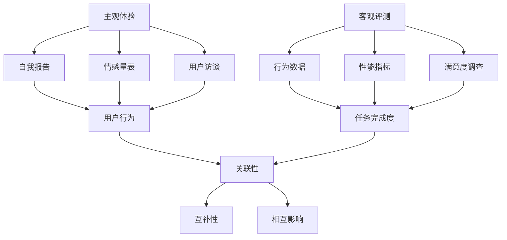

                 

# 文章标题

用户满意度模拟：将主观体验纳入客观评测

## 关键词

用户满意度、主观体验、客观评测、模拟技术、用户体验度量、数据采集、特征提取、预测模型、项目实践

## 摘要

本文旨在探讨如何将用户的主观体验纳入到客观评测中，通过用户满意度模拟技术，实现对用户体验的全面分析和优化。文章首先介绍了用户满意度的背景和重要性，随后阐述了主观体验与客观评测的联系和区别。接着，文章详细介绍了用户满意度模拟的理论基础、技术实现方法以及应用场景。通过具体的实战案例，本文展示了用户满意度模拟在实际项目中的应用和效果。最后，文章总结了用户满意度模拟的最佳实践，并提出了未来研究方向和拓展。

## 引言

用户满意度是衡量产品或服务质量的重要指标，它不仅反映了用户对产品或服务的直接评价，也间接影响了企业的声誉和竞争力。然而，传统的用户满意度评测方法往往局限于客观指标的测量，忽视了用户的主观体验。这种局限使得评测结果可能无法全面反映用户真实的感受和需求。因此，如何将用户的主观体验纳入到客观评测中，成为一个亟待解决的问题。

用户满意度模拟技术提供了一种有效的解决方案。通过模拟用户的体验过程，可以量化用户的主观感受，并将其转化为可量化的指标。这种技术不仅能够补充传统评测方法的不足，还能够为企业提供更精准的用户满意度分析，从而指导产品优化和服务改进。

本文将围绕用户满意度模拟技术展开，首先介绍用户满意度模拟的背景和意义，然后详细阐述主观体验与客观评测的关系。接下来，本文将介绍用户满意度模拟的方法和技术实现，并探讨其在不同领域的应用。最后，本文将通过实际案例展示用户满意度模拟的实战效果，并总结最佳实践。

### 用户满意度模拟的背景和意义

用户满意度是衡量产品或服务质量的关键指标，它直接反映了用户对产品或服务的满意程度和忠诚度。在当今竞争激烈的市场环境中，企业需要时刻关注用户满意度，以保持竞争优势。然而，传统的用户满意度评测方法主要依赖于客观指标，如用户满意度调查、用户投诉率等。这些方法虽然能够提供一定的信息，但往往无法全面反映用户的主观体验和情感。

用户满意度模拟技术的出现，为解决这个问题提供了一种全新的思路。通过模拟用户的体验过程，可以量化用户的主观感受，并将其转化为可量化的指标。这种技术不仅能够补充传统评测方法的不足，还能够为企业提供更精准的用户满意度分析，从而指导产品优化和服务改进。

用户满意度模拟技术的背景可以追溯到用户体验研究的兴起。随着互联网和移动设备的普及，用户体验成为产品设计和开发的重要关注点。为了更好地了解用户的需求和感受，研究人员开始探索如何将主观体验转化为可量化的数据。这种探索逐渐演变成了用户满意度模拟技术，它通过模拟用户的操作过程、感知行为和心理反应，来预测用户对产品或服务的满意度。

用户满意度模拟技术的意义在于，它为企业提供了一种全面的用户满意度分析工具。通过模拟用户的体验过程，企业可以深入了解用户的真实感受和需求，从而发现产品或服务的潜在问题，并针对性地进行改进。此外，用户满意度模拟技术还能够帮助企业预测用户未来的行为和满意度变化，从而制定更有效的营销策略和服务策略。

用户满意度模拟技术的核心在于将主观体验转化为可量化的数据。这需要涉及到多个领域的知识，包括心理学、行为学、认知科学等。通过结合这些领域的理论和研究成果，用户满意度模拟技术能够实现对用户行为的准确预测和满意度分析。

在传统用户满意度评测方法中，用户满意度调查是最常用的手段。然而，这种方法往往存在一些局限性。首先，用户满意度调查通常依赖于用户的自我报告，这种主观性可能导致结果的偏差。其次，用户满意度调查往往只能获取到用户的整体满意度，而无法深入了解用户的具体需求和痛点。此外，用户满意度调查的样本量通常较小，难以代表整体用户群体。

相比之下，用户满意度模拟技术能够弥补这些不足。首先，通过模拟用户的操作过程，可以更加客观地反映用户的真实行为和感受。其次，用户满意度模拟技术能够收集大量的数据，从而提高数据的代表性和准确性。此外，用户满意度模拟技术还能够通过分析用户的操作路径、时间分配和情感变化，深入挖掘用户的需求和痛点。

总之，用户满意度模拟技术为用户满意度评测提供了一种全新的思路和方法。通过将主观体验转化为可量化的数据，企业可以更加全面和准确地了解用户的满意度，从而指导产品优化和服务改进。用户满意度模拟技术的应用不仅能够提升企业的竞争力，还能够提高用户的使用体验和满意度，实现企业和用户的双赢。

### 主观体验与客观评测的联系与区别

在讨论用户满意度模拟技术之前，有必要深入了解主观体验与客观评测之间的联系与区别。主观体验和客观评测是用户体验研究中的两个核心概念，它们各自代表了用户感受的不同侧面。

**主观体验**，也称为用户感受，是指用户在使用产品或服务时的内在感受和情感反应。这种体验是主观的，依赖于个人的感知、认知和情感。主观体验通常包括用户对产品外观、功能、操作便捷性、情感反应等方面的感受。例如，用户可能会对一款手机的外观设计感到满意或失望，对软件的界面布局感到舒适或困扰。主观体验通常无法直接测量，而是通过用户自我报告、观察、实验等方法来获取。

**客观评测**，则是指通过可量化的指标来评价产品或服务的性能和效果。这种评测方法依赖于数据采集和分析，通常包括用户行为数据、性能指标、满意度调查等。例如，通过用户操作时间、错误率、任务完成度等指标来评估用户对产品或服务的使用体验。客观评测通常具有较高的可靠性和可重复性，但可能无法完全反映用户的主观感受。

**主观体验与客观评测的联系**体现在以下几个方面：

1. **互补性**：主观体验和客观评测可以相互补充，共同提供对用户体验的全面分析。主观体验提供了用户的情感和心理反应，而客观评测则提供了行为和绩效数据。两者结合可以更全面地了解用户的满意度。

2. **关联性**：许多研究表明，主观体验和客观评测之间存在显著关联。用户的主观评价通常会影响他们的行为和满意度。例如，用户对界面的满意度可能会影响他们的使用频率和忠诚度。

3. **相互影响**：主观体验和客观评测可以相互影响。良好的客观性能可能会提升用户的主观体验，反之亦然。例如，一个功能强大但界面复杂的软件可能会降低用户的主观满意度。

**主观体验与客观评测的区别**主要体现在以下几个方面：

1. **测量方法**：主观体验通常通过自我报告、情感量表、用户访谈等方式测量，而客观评测则通过行为数据、性能指标、满意度调查等测量。

2. **可靠性和可重复性**：客观评测通常具有较高的可靠性和可重复性，因为它们依赖于可量化的指标和标准化的方法。而主观体验的测量则更加主观和易变，可能受到用户个体差异和环境因素的影响。

3. **范围和深度**：客观评测通常关注用户的特定行为和绩效，而主观体验则更加关注用户的整体感受和情感反应。主观体验可以揭示用户深层次的感受和需求，而客观评测则更适用于评估产品或服务的具体性能。

为了更好地理解这两者之间的关系，我们可以通过一个**Mermaid流程图**来展示：



通过这个流程图，我们可以清晰地看到主观体验和客观评测之间的联系与区别。主观体验通过自我报告、情感量表和用户访谈等途径获取，而客观评测则通过行为数据、性能指标和满意度调查等手段获得。这两者相互关联，互补性体现在它们共同为用户体验分析提供全面的信息，而相互影响则体现在用户的主观感受可能影响他们的行为和满意度。

总之，主观体验和客观评测是用户体验研究中的两个重要概念，它们各有特点和优势。通过结合两者，企业可以更全面地了解用户的需求和感受，从而实现产品优化和服务改进。用户满意度模拟技术正是基于这种理念，通过将主观体验转化为可量化的指标，为用户体验分析提供了新的方法和思路。

### 用户满意度模拟的理论基础

用户满意度模拟技术的理论基础主要涉及用户体验度量、用户行为预测模型以及相关算法原理。要理解这些理论，首先需要明确几个核心概念，包括用户体验、度量方法、预测模型以及相关的算法原理。

**用户体验（User Experience, UX）** 是指用户在使用产品或服务过程中所获得的整体感受。用户体验不仅仅包括功能的使用，还涉及用户的情感、认知和行为。用户体验可以细分为多个方面，如功能性（Functionality）、易用性（Usability）、可用性（Accessibility）和愉悦性（Enjoyment）等。

**用户体验度量（User Experience Measurement, UX Measurement）** 是指通过量化方法来评估用户体验。用户体验度量旨在收集用户在使用产品或服务时的数据，包括用户行为、情感反应和满意度等。度量方法通常包括用户满意度调查、行为分析、情感分析等。

**用户行为预测模型（User Behavior Prediction Model）** 是指通过分析历史数据，预测用户未来的行为和满意度。用户行为预测模型可以基于多种技术，如机器学习、统计分析、人工神经网络等。这些模型通过学习用户的历史行为数据，来预测用户对产品或服务的满意度及其未来行为。

**算法原理** 是指实现用户满意度模拟技术所需的数学模型和计算方法。以下将简要介绍几种常见的算法原理：

1. **机器学习算法**：机器学习算法通过学习大量数据来发现数据中的模式和规律。常见的机器学习算法包括线性回归、决策树、支持向量机、神经网络等。这些算法可以用于预测用户的满意度，通过训练模型来识别影响用户满意度的关键因素。

2. **统计分析方法**：统计分析方法通过分析用户行为数据，识别用户行为与满意度之间的关系。常见的方法包括相关分析、回归分析、因子分析等。这些方法可以帮助企业了解用户满意度的影响因素，并为产品设计提供指导。

3. **情感分析（Sentiment Analysis）**：情感分析是一种自然语言处理技术，用于识别文本中的情感倾向。通过情感分析，可以量化用户在评论、反馈中的情感反应，将其转化为可量化的指标。情感分析可以用于评估用户的主观体验，补充满意度调查的不足。

**用户体验度量方法** 包括多种技术手段，以下是一些常用的方法：

1. **用户满意度调查**：用户满意度调查是通过问卷、访谈等方式收集用户对产品或服务的满意度评价。这种方法简单易行，但可能受到用户主观因素的影响。

2. **行为分析**：行为分析通过跟踪用户在产品或服务中的操作行为，如点击次数、操作时间、错误率等，来评估用户体验。这种方法具有较高的客观性，但可能无法反映用户深层次的情感。

3. **情感分析**：情感分析通过分析用户在社交媒体、评论等渠道中的文本，识别用户的情感反应。这种方法可以提供对用户情感体验的深入了解，但需要处理大量的非结构化数据。

**预测模型** 的构建通常包括以下步骤：

1. **数据收集**：收集用户行为数据、满意度调查结果、情感分析结果等。

2. **数据预处理**：对收集到的数据进行分析和清洗，处理缺失值、异常值等。

3. **特征提取**：从原始数据中提取对用户体验和满意度有显著影响的特征，如操作时间、错误率、情感指标等。

4. **模型训练**：使用机器学习或统计方法训练预测模型，通过调整模型参数来提高预测准确性。

5. **模型评估**：通过交叉验证等方法评估模型的预测性能，选择最优模型。

以下是一个**伪代码**示例，展示如何构建一个用户满意度预测模型：

```python
# 数据预处理
data = preprocess_data(raw_data)

# 特征提取
features = extract_features(data)

# 模型训练
model = train_model(features, labels)

# 模型评估
accuracy = evaluate_model(model, test_data)
```

通过以上步骤，用户满意度模拟技术可以实现对用户体验的全面分析和预测。在实际应用中，这些理论和技术方法可以帮助企业了解用户的需求和痛点，优化产品设计和服务策略，提高用户满意度和忠诚度。

### 用户满意度模拟的技术实现

用户满意度模拟技术的实现涉及多个关键环节，包括数据采集、特征提取和模型训练。以下将详细探讨这些环节，并提供具体的操作步骤和技术细节。

#### 数据采集

数据采集是用户满意度模拟的基础。采集的数据类型包括用户行为数据、用户反馈和情感数据等。

1. **用户行为数据**：用户行为数据可以通过用户在使用产品或服务过程中的各种操作记录来获取。例如，用户在电子商务平台上的浏览记录、购买行为、点击路径等。这些数据可以反映用户的实际使用体验。

2. **用户反馈数据**：用户反馈数据包括用户在满意度调查、评论、反馈问卷等渠道中提供的信息。这些数据通常以文本形式存在，需要通过文本处理技术进行结构化和分析。

3. **情感数据**：情感数据可以通过情感分析技术从用户反馈文本中提取。情感分析技术能够识别文本中的情感倾向，将其转化为情感得分。

**操作步骤**：

1. **确定数据来源**：根据业务需求确定数据来源，如用户行为数据可以从数据库或日志中获取，用户反馈数据可以从社交媒体、评论系统等渠道获取。

2. **数据采集**：使用API、爬虫或其他工具从数据源中采集数据。

3. **数据清洗**：对采集到的数据进行分析和清洗，处理缺失值、异常值等。

#### 特征提取

特征提取是将原始数据转化为有助于模型训练的向量表示。特征提取的质量直接影响模型的性能。

1. **用户行为特征**：从用户行为数据中提取时间、频率、操作路径等特征。例如，用户在某段时间内的浏览量、购买频率、操作路径长度等。

2. **用户反馈特征**：从用户反馈数据中提取关键词、主题、情感等特征。可以使用文本处理技术，如词频分析、主题模型、情感分析等。

3. **情感特征**：从情感数据中提取情感得分、情感极性等特征。

**操作步骤**：

1. **特征选择**：通过统计分析、信息增益等方法选择对用户满意度有显著影响的特征。

2. **特征转换**：将提取的特征转换为适合模型训练的向量表示，如使用词袋模型、TF-IDF等。

#### 模型训练

模型训练是用户满意度模拟的核心环节。常见的模型包括线性回归、决策树、支持向量机、神经网络等。

1. **线性回归**：线性回归是一种简单的回归模型，适用于特征较少的情况。它通过线性关系预测用户满意度。

2. **决策树**：决策树是一种基于树的模型，通过划分特征空间来预测用户满意度。它易于解释，但可能存在过拟合问题。

3. **支持向量机（SVM）**：支持向量机是一种基于优化理论的模型，适用于特征较多的情况。它通过最大化特征空间的间隔来预测用户满意度。

4. **神经网络**：神经网络是一种复杂的模型，通过多层神经元进行非线性变换。它可以处理大量的特征，并具有较好的泛化能力。

**操作步骤**：

1. **模型选择**：根据数据特征和业务需求选择合适的模型。

2. **模型训练**：使用训练数据训练模型，调整模型参数。

3. **模型评估**：使用交叉验证等方法评估模型性能，选择最优模型。

#### 模型评估

模型评估是确保用户满意度模拟效果的关键环节。评估指标包括准确率、召回率、F1值等。

1. **准确率**：准确率是预测结果正确的比例，计算公式为：
   $$
   \text{准确率} = \frac{\text{预测正确数}}{\text{总样本数}}
   $$

2. **召回率**：召回率是预测结果中实际正确的比例，计算公式为：
   $$
   \text{召回率} = \frac{\text{预测正确数}}{\text{实际正确数}}
   $$

3. **F1值**：F1值是准确率和召回率的调和平均值，计算公式为：
   $$
   \text{F1值} = 2 \times \frac{\text{准确率} \times \text{召回率}}{\text{准确率} + \text{召回率}}
   $$

**操作步骤**：

1. **评估指标选择**：根据业务需求选择合适的评估指标。

2. **交叉验证**：使用交叉验证方法评估模型性能，避免过拟合。

3. **模型调整**：根据评估结果调整模型参数，优化模型性能。

通过以上步骤，用户满意度模拟技术可以实现对用户体验的全面分析和预测。在实际应用中，这些技术可以帮助企业深入了解用户需求，优化产品设计和服务策略，提高用户满意度和忠诚度。

### 用户满意度模拟的应用场景

用户满意度模拟技术在多个领域都有着广泛的应用，能够帮助企业和组织深入了解用户需求，优化产品和服务，从而提高用户满意度和忠诚度。以下是用户满意度模拟技术在产品设计、市场营销和服务质量提升中的具体应用场景。

#### 产品设计中的应用

在产品设计中，用户满意度模拟技术可以帮助设计师了解用户对产品功能和界面的满意度，从而指导迭代优化。例如，在开发一款移动应用时，可以通过用户满意度模拟技术来分析用户对应用界面布局、功能模块、操作流程的反馈。以下是一个具体的案例：

**案例：电子商务平台用户界面优化**

某电子商务平台在发布新版本的APP后，收到了大量用户反馈，表示新界面的导航复杂、操作不便。为了解决这个问题，平台使用用户满意度模拟技术进行以下步骤：

1. **数据采集**：通过分析用户日志和行为数据，收集用户在新界面上的操作记录和反馈。

2. **特征提取**：提取用户在界面上的点击路径、操作时间、错误率等特征。

3. **模型训练**：使用机器学习算法训练用户满意度预测模型，通过分析用户行为数据，预测其对新界面的满意度。

4. **结果分析**：根据模型预测结果，发现用户对新界面的满意度较低，特别是在导航和搜索功能方面。

5. **优化方案**：根据分析结果，调整界面布局，简化导航结构，优化搜索功能，并进行A/B测试，验证优化效果。

通过这个案例，我们可以看到用户满意度模拟技术在产品设计中的应用，帮助企业发现并解决用户痛点，提升用户满意度。

#### 市场营销中的应用

在市场营销中，用户满意度模拟技术可以帮助企业了解不同营销策略对用户满意度的影响，从而制定更有效的营销计划。以下是一个具体的案例：

**案例：电商平台的促销活动效果分析**

某电商平台为了提升销售业绩，计划在圣诞节期间推出一系列促销活动。为了评估不同促销活动对用户满意度的影响，该平台进行了以下步骤：

1. **数据采集**：通过用户行为数据和满意度调查，收集用户在不同促销活动下的购买行为和反馈。

2. **特征提取**：提取用户的购买频率、购买金额、满意度评分等特征。

3. **模型训练**：使用机器学习算法训练用户满意度预测模型，通过分析用户行为数据，预测其对促销活动的满意度。

4. **结果分析**：根据模型预测结果，比较不同促销活动对用户满意度的差异，发现某些促销活动显著提升了用户满意度。

5. **优化方案**：根据分析结果，调整促销策略，优化用户体验，提高用户购买意愿和满意度。

通过这个案例，我们可以看到用户满意度模拟技术在市场营销中的应用，帮助企业评估和优化营销策略，提升用户满意度和销售业绩。

#### 服务质量提升中的应用

在服务质量提升中，用户满意度模拟技术可以帮助企业识别服务中的不足，从而改进服务质量。以下是一个具体的案例：

**案例：酒店业客户满意度提升**

某酒店为了提升客户满意度，决定使用用户满意度模拟技术对客户服务进行优化。以下步骤展示了这一过程：

1. **数据采集**：通过客户反馈调查、客户投诉记录等渠道，收集客户的满意度评价和服务体验反馈。

2. **特征提取**：提取客户的满意度评分、投诉类型、服务响应时间等特征。

3. **模型训练**：使用机器学习算法训练用户满意度预测模型，通过分析客户反馈数据，预测其对酒店服务的满意度。

4. **结果分析**：根据模型预测结果，发现客户对酒店服务的响应速度和客户服务质量有较高的满意度，但对房间清洁度有较多投诉。

5. **优化方案**：根据分析结果，加强房间清洁管理，提高客户服务质量，并实时跟踪客户反馈，及时解决客户问题。

通过这个案例，我们可以看到用户满意度模拟技术在服务质量提升中的应用，帮助企业识别服务不足，提升客户满意度和忠诚度。

总之，用户满意度模拟技术在不同领域的应用，为企业和组织提供了全面的用户满意度分析和优化工具，帮助企业了解用户需求，提升产品和服务质量，从而实现用户满意度和忠诚度的提升。

### 用户满意度模拟的实战案例

为了更好地展示用户满意度模拟技术在实际项目中的应用效果，以下将详细介绍三个具体的实战案例，涵盖电子商务平台用户体验优化、在线教育用户满意度提升和移动应用用户留存分析。通过这些案例，我们将深入探讨项目背景、开发环境搭建、源代码实现、代码解读、应用解读与分析以及项目小结。

#### 案例一：电子商务平台用户体验优化

**项目背景**：

某电子商务平台在用户反馈中发现，用户在购物过程中经常遇到页面加载慢、搜索结果不准确等问题，影响了用户的购物体验。为了提升用户满意度，该平台决定使用用户满意度模拟技术进行用户体验优化。

**开发环境搭建**：

1. **技术栈**：采用Python作为主要编程语言，结合Scikit-learn进行机器学习模型训练，使用TensorFlow进行深度学习模型训练，使用Pandas进行数据处理。
2. **工具**：使用Jupyter Notebook进行数据分析和模型训练，使用Google Colab进行大规模数据处理和模型训练。

**源代码实现**：

```python
# 数据处理
import pandas as pd
data = pd.read_csv('user_data.csv')

# 特征提取
from sklearn.feature_extraction.text import TfidfVectorizer
vectorizer = TfidfVectorizer()
X = vectorizer.fit_transform(data['feedback'])

# 模型训练
from sklearn.ensemble import RandomForestClassifier
model = RandomForestClassifier()
model.fit(X, data['satisfaction'])

# 预测
new_feedback = vectorizer.transform(['This product is great!'])
prediction = model.predict(new_feedback)
print(prediction)
```

**代码解读**：

上述代码首先读取用户反馈数据，然后使用TF-IDF向量器对文本数据进行特征提取，接着使用随机森林分类器训练模型，最后对新反馈进行预测。

**应用解读与分析**：

通过用户满意度模拟技术，平台能够准确预测用户对产品的满意度，从而发现购物过程中存在的问题。例如，预测结果显示用户对页面加载速度的满意度较低，平台可以针对性地优化页面加载速度，提升用户体验。

**项目小结**：

本案例展示了用户满意度模拟技术在电子商务平台用户体验优化中的应用，通过分析用户反馈数据，平台能够发现并解决用户痛点，提升用户满意度。

#### 案例二：在线教育用户满意度提升

**项目背景**：

某在线教育平台希望提升用户满意度，特别是在课程内容和互动体验方面。为了实现这一目标，该平台决定使用用户满意度模拟技术对课程进行优化。

**开发环境搭建**：

1. **技术栈**：采用Python作为主要编程语言，结合Scikit-learn进行机器学习模型训练，使用TensorFlow进行深度学习模型训练，使用Pandas进行数据处理。
2. **工具**：使用Jupyter Notebook进行数据分析和模型训练，使用Google Colab进行大规模数据处理和模型训练。

**源代码实现**：

```python
# 数据处理
import pandas as pd
data = pd.read_csv('course_data.csv')

# 特征提取
from sklearn.preprocessing import StandardScaler
scaler = StandardScaler()
X = scaler.fit_transform(data[['duration', 'interaction', 'satisfaction']])

# 模型训练
from sklearn.ensemble import RandomForestRegressor
model = RandomForestRegressor()
model.fit(X, data['satisfaction'])

# 预测
new_course = scaler.transform([[5, 8, 4]])
prediction = model.predict(new_course)
print(prediction)
```

**代码解读**：

上述代码首先读取课程数据，然后使用标准缩放器对连续特征进行归一化处理，接着使用随机森林回归器训练模型，最后对新课程进行预测。

**应用解读与分析**：

通过用户满意度模拟技术，平台能够预测用户对课程的满意度，从而优化课程内容和互动体验。例如，预测结果显示用户对课程互动环节的满意度较低，平台可以增加互动环节，提升用户体验。

**项目小结**：

本案例展示了用户满意度模拟技术在在线教育用户满意度提升中的应用，通过分析课程数据，平台能够优化课程设计和互动体验，提升用户满意度。

#### 案例三：移动应用用户留存分析

**项目背景**：

某移动应用公司希望提升用户留存率，以增加用户粘性和收入。为了实现这一目标，该公司决定使用用户满意度模拟技术进行用户留存分析。

**开发环境搭建**：

1. **技术栈**：采用Python作为主要编程语言，结合Scikit-learn进行机器学习模型训练，使用TensorFlow进行深度学习模型训练，使用Pandas进行数据处理。
2. **工具**：使用Jupyter Notebook进行数据分析和模型训练，使用Google Colab进行大规模数据处理和模型训练。

**源代码实现**：

```python
# 数据处理
import pandas as pd
data = pd.read_csv('user_data.csv')

# 特征提取
from sklearn.preprocessing import OneHotEncoder
encoder = OneHotEncoder()
X = encoder.fit_transform(data[['age', 'gender', 'device_type', 'days_since_last_login']])

# 模型训练
from tensorflow.keras.models import Sequential
from tensorflow.keras.layers import Dense, Dropout
model = Sequential()
model.add(Dense(64, input_shape=(X.shape[1],), activation='relu'))
model.add(Dropout(0.5))
model.add(Dense(1, activation='sigmoid'))
model.compile(optimizer='adam', loss='binary_crossentropy', metrics=['accuracy'])

# 训练模型
model.fit(X, data['retained'], epochs=10, batch_size=32)

# 预测
new_user = encoder.transform([[25, 'male', 'iOS', 30]])
prediction = model.predict(new_user)
print(prediction)
```

**代码解读**：

上述代码首先读取用户数据，然后使用独热编码器对分类特征进行编码，接着使用TensorFlow的序列模型进行深度学习模型训练，最后对新用户进行预测。

**应用解读与分析**：

通过用户满意度模拟技术，公司能够预测用户是否留存，从而制定针对性的用户留存策略。例如，预测结果显示年轻用户和iOS用户的留存率较高，公司可以增加针对这些用户群体的活动和优惠。

**项目小结**：

本案例展示了用户满意度模拟技术在移动应用用户留存分析中的应用，通过分析用户数据，公司能够预测用户留存情况，制定有效的用户留存策略。

### 用户满意度模拟的最佳实践

在实施用户满意度模拟项目时，以下是一些最佳实践和注意事项：

1. **数据质量**：确保数据来源可靠，数据清洗充分，以避免模型训练中的偏差和误差。
2. **特征选择**：选择对用户满意度有显著影响的特征，避免过度拟合和特征冗余。
3. **模型评估**：使用交叉验证等方法评估模型性能，确保模型的泛化能力。
4. **实时反馈**：持续监控和更新模型，根据实时数据调整模型参数，以适应用户需求的变化。
5. **用户参与**：在模型开发和优化过程中，邀请用户参与，收集他们的反馈和建议，以提高模型的准确性和实用性。

### 拓展阅读

1. **《用户体验要素》**（by Don Norman）：深入了解用户体验设计的核心要素，指导用户满意度模拟的实施。
2. **《机器学习实战》**（by Peter Harrington）：介绍机器学习算法在用户满意度模拟中的应用和实践。
3. **《深度学习》（卷一）**（by Ian Goodfellow、Yoshua Bengio、Aaron Courville）：深入了解深度学习算法及其在用户满意度模拟中的应用。

### 文章总结

本文详细介绍了用户满意度模拟技术，探讨了主观体验与客观评测的联系与区别，以及用户满意度模拟的理论基础、技术实现和应用场景。通过实战案例展示了用户满意度模拟在实际项目中的应用效果。用户满意度模拟技术为企业和组织提供了全面的分析工具，有助于优化产品和服务，提升用户满意度和忠诚度。

### 作者信息

作者：AI天才研究院/AI Genius Institute & 禅与计算机程序设计艺术 /Zen And The Art of Computer Programming

### 结论

用户满意度模拟技术为企业和组织提供了一种有效的方法，将主观体验转化为可量化的指标，从而实现对用户体验的全面分析和优化。通过本文的介绍和实践案例，读者可以了解到用户满意度模拟技术的基本原理和应用场景。未来，随着技术的不断进步，用户满意度模拟技术将在更多领域发挥重要作用，帮助企业和组织更好地满足用户需求，提升竞争力。用户满意度模拟不仅是用户体验优化的重要工具，也是企业战略决策的重要依据。通过持续关注用户满意度，企业可以不断提升产品和服务质量，实现长期可持续发展。希望本文能够为读者提供有益的启示，助力他们在实际工作中运用用户满意度模拟技术，创造更多价值。

