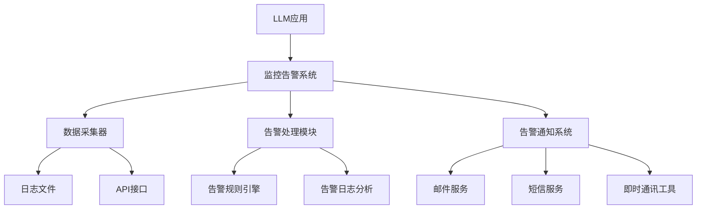

                 

### 文章标题：监控告警系统保障LLM应用的稳定运行

> 关键词：监控告警系统，LLM应用，稳定性，核心算法，数学模型

> 摘要：本文将深入探讨如何利用监控告警系统来保障大型语言模型（LLM）应用的稳定运行。通过分析核心概念、算法原理、数学模型以及实战应用，本文旨在为开发者提供一套全面的技术解决方案，以应对LLM应用在运行过程中可能遇到的各种问题。

## 引言

随着人工智能技术的快速发展，大型语言模型（LLM）在自然语言处理、智能对话、文本生成等领域展现出巨大的潜力。然而，LLM应用的高复杂性及其对性能的苛刻要求，使得稳定运行成为一项极具挑战性的任务。为了确保LLM应用的稳定运行，监控告警系统成为不可或缺的工具。

监控告警系统是一种自动化监控系统，通过实时收集系统数据、分析系统状态，并在发现异常时及时发出告警，从而实现对系统运行的全面监控。在LLM应用中，监控告警系统不仅可以及时发现和应对性能问题、资源不足等异常情况，还能通过日志分析、统计图表等手段，为开发者提供宝贵的诊断信息和优化建议。

本文将围绕以下核心内容展开：

1. **核心概念与联系**：介绍监控告警系统中的核心概念及其相互关系。
2. **核心算法原理讲解**：详细讲解告警规则引擎的算法原理。
3. **数学模型和数学公式**：介绍监控告警系统中的阈值设定数学模型。
4. **项目实战**：通过实际案例，展示如何使用监控告警系统保障LLM应用的稳定运行。
5. **最佳实践**：总结最佳实践，并提供注意事项和拓展阅读。

## 核心概念与联系

在构建监控告警系统时，需要理解几个核心概念及其相互关系。以下是一个用于说明这些概念的Mermaid流程图：



### 1. LLM应用

LLM应用是指基于大型语言模型构建的应用程序，如智能问答系统、聊天机器人、文本生成工具等。这些应用在处理大量文本数据时，需要保证系统的稳定性和高性能。

### 2. 监控告警系统

监控告警系统是整个监控体系的核心，负责收集系统数据、分析状态、触发告警和通知。它可以分为以下几个部分：

#### 2.1 数据采集器

数据采集器负责从LLM应用及其依赖系统中收集各种性能指标和日志信息。这些数据包括CPU使用率、内存使用率、磁盘I/O、网络延迟等。

#### 2.2 告警处理模块

告警处理模块负责分析采集到的数据，根据预设的告警规则判断是否触发告警。告警规则可以是简单的阈值判断，也可以是复杂的逻辑运算。

#### 2.3 告警通知系统

告警通知系统负责在触发告警时，通过邮件、短信、即时通讯工具等方式通知相关人员。

### 3. 数据采集器

数据采集器是监控告警系统的前端，负责从各个系统和设备中采集性能指标和日志信息。它可以通过以下方式进行数据采集：

#### 3.1 日志文件

许多系统和应用程序都会生成日志文件，数据采集器可以定期读取这些日志文件，提取关键信息。

#### 3.2 API接口

一些系统和应用程序提供了公开的API接口，数据采集器可以通过调用这些接口获取实时数据。

### 4. 告警处理模块

告警处理模块是监控告警系统的核心，负责分析采集到的数据，并根据预设的告警规则判断是否触发告警。告警规则可以是基于阈值、统计方法或机器学习模型的。

### 5. 告警通知系统

告警通知系统负责在触发告警时，通过邮件、短信、即时通讯工具等方式通知相关人员。通知的内容通常包括告警详情、当前状态和建议的操作。

## 核心算法原理讲解

在监控告警系统中，告警规则引擎是一个关键组件，它负责根据设定的规则检测系统状态并触发告警。以下是告警规则引擎的核心算法原理讲解：

### 1. 告警规则的定义

告警规则由以下几个部分组成：

- **触发条件**：定义了告警触发的具体条件，例如，CPU使用率超过90%。
- **告警级别**：定义了告警的严重程度，例如，严重、警告、信息等。
- **告警动作**：定义了触发告警后需要执行的动作，例如，发送邮件、短信或通知等。
- **告警周期**：定义了告警的监测周期，例如，每5分钟检查一次。

### 2. 告警规则引擎的工作流程

告警规则引擎的工作流程如下：

- **初始化**：读取并解析告警规则配置文件，初始化规则引擎。
- **周期性检查**：按照设定的告警周期，周期性地检查系统状态。
- **触发条件判断**：根据系统当前状态和设定的触发条件，判断是否触发告警。
- **执行告警动作**：如果触发告警，则根据设定的告警动作执行相应的告警通知。
- **日志记录**：记录告警日志，用于后续分析。

### 3. 伪代码示例

以下是告警规则引擎的伪代码示例：

```java
// 伪代码：告警规则引擎

function checkAlerts() {
    for (each rule in alertRules) {
        if (currentSystemState satisfies rule.triggerCondition) {
            logAlert(rule);
            executeAlertAction(rule);
        }
    }
}

function executeAlertAction(rule) {
    switch (rule.alertAction) {
        case "email":
            sendEmailNotification(rule);
            break;
        case "sms":
            sendSMSNotification(rule);
            break;
        case "im":
            sendIMNotification(rule);
            break;
    }
}
```

### 4. 告警规则配置示例

以下是一个告警规则配置示例：

```json
{
    "alertRules": [
        {
            "triggerCondition": "CPU使用率超过90%",
            "alertLevel": "严重",
            "alertAction": "邮件通知",
            "alertCycle": "每5分钟一次"
        },
        {
            "triggerCondition": "内存使用率超过80%",
            "alertLevel": "警告",
            "alertAction": "短信通知",
            "alertCycle": "每15分钟一次"
        }
    ]
}
```

## 数学模型和数学公式

在监控告警系统中，阈值设定是一个关键环节。阈值设定的目标是在确保系统稳定性的同时，减少误报和漏报。以下是一个简单的阈值设定数学模型：

### 1. 阈值设定公式

假设我们想要设定一个阈值 `T`，以检测系统性能指标 `X` 的异常。我们可以使用以下公式来设定阈值：

$$
T = \alpha \cdot \text{mean}(X) + \beta \cdot \text{stddev}(X)
$$

其中：
- `alpha` 是一个权重系数，用于调整均值对阈值的影响。
- `beta` 是另一个权重系数，用于调整标准差对阈值的影响。
- `mean(X)` 表示指标 `X` 的平均值。
- `stddev(X)` 表示指标 `X` 的标准差。

### 2. 参数调整

在实际应用中，我们需要根据具体情况调整 `alpha` 和 `beta` 的值，以达到最佳的效果。以下是一些常见的参数调整方法：

- **增加 `alpha` 的值**：增加均值对阈值的影响，可以使得阈值更加敏感，更容易检测到异常。
- **增加 `beta` 的值**：增加标准差对阈值的影响，可以使得阈值更加稳定，减少误报。

### 3. 伪代码示例

以下是阈值设定的伪代码示例：

```java
// 伪代码：阈值设定

function setThreshold(X) {
    alpha = 0.5;  // 均值权重系数
    beta = 1.5;  // 标准差权重系数
    mean_X = calculateMean(X);
    stddev_X = calculateStandardDeviation(X);
    
    threshold = alpha * mean_X + beta * stddev_X;
    return threshold;
}
```

## 项目实战

### 1. 开发环境搭建

为了实现监控告警系统，我们需要搭建一个开发环境。以下是一个简单的开发环境搭建步骤：

- **安装操作系统**：选择一个适合的操作系统，如Ubuntu 20.04。
- **安装依赖库**：安装Python、Pandas、NumPy等依赖库。
- **安装IDE**：选择一个合适的集成开发环境，如PyCharm。

### 2. 源代码详细实现

以下是一个简单的监控告警系统源代码实现：

```python
# 监控告警系统

import os
import time
import json
from datetime import datetime

# 数据采集器
def collect_data():
    with open('system_data.txt', 'r') as f:
        data = f.read()
    return json.loads(data)

# 告警规则引擎
def check_alerts(alert_rules):
    current_data = collect_data()
    for rule in alert_rules:
        if current_data['CPU_usage'] > rule['threshold']:
            alert_message = f"CPU使用率过高：{current_data['CPU_usage']}%"
            send_alert(alert_message)
            log_alert(alert_message)

# 告警通知系统
def send_alert(message):
    print(f"告警通知：{message}")

# 日志记录
def log_alert(message):
    with open('alert_log.txt', 'a') as f:
        f.write(f"{datetime.now()} - {message}\n")

# 主程序
if __name__ == '__main__':
    alert_rules = [
        {
            "rule_name": "CPU使用率过高",
            "threshold": 90
        }
    ]
    while True:
        check_alerts(alert_rules)
        time.sleep(60)
```

### 3. 代码解读与分析

在上面的代码中，我们实现了以下功能：

- **数据采集器**：从系统文件中读取性能指标数据。
- **告警规则引擎**：根据预设的告警规则检查性能指标是否超过阈值。
- **告警通知系统**：打印告警通知。
- **日志记录**：记录告警日志。

### 4. 实际案例分析与详细讲解

假设我们有一个LLM应用，它在运行过程中出现了CPU使用率过高的情况。监控告警系统会按照以下步骤进行处理：

1. **数据采集**：系统定期采集CPU使用率数据。
2. **告警检查**：监控告警系统检测到CPU使用率超过90%，触发告警。
3. **告警通知**：系统打印告警通知，提示CPU使用率过高。
4. **日志记录**：系统记录告警日志，用于后续分析。

通过这样的处理，我们可以及时发现并解决LLM应用中的性能问题，确保其稳定运行。

### 5. 项目小结

通过实际案例，我们可以看到监控告警系统在保障LLM应用稳定运行方面的重要作用。合理的告警规则配置、高效的数据采集和及时的告警通知，是确保系统稳定性的关键。

## 最佳实践

### 1. 监控指标的合理选择

在构建监控告警系统时，选择合适的监控指标至关重要。以下是一些建议：

- **CPU使用率**：监测CPU使用率可以帮助我们了解系统性能。
- **内存使用率**：监测内存使用率可以帮助我们了解系统内存状况。
- **磁盘I/O**：监测磁盘I/O可以帮助我们了解系统磁盘性能。
- **网络延迟**：监测网络延迟可以帮助我们了解系统网络状况。

### 2. 告警规则的有效配置

合理的告警规则配置可以减少误报和漏报。以下是一些建议：

- **阈值设定**：根据历史数据和业务需求，设定合理的阈值。
- **告警级别**：根据告警的严重程度，设定不同的告警级别。
- **告警动作**：根据实际情况，选择合适的告警通知方式。

### 3. 告警通知的及时处理

及时的告警通知可以帮助我们快速响应异常情况。以下是一些建议：

- **邮件通知**：适用于较为严重的告警情况，确保相关人员及时收到通知。
- **短信通知**：适用于需要立即响应的告警情况，如紧急故障。
- **即时通讯工具**：适用于需要实时沟通的告警情况，如团队内部协作。

### 4. 日志记录与分析

日志记录与分析是监控告警系统的重要组成部分。以下是一些建议：

- **完整记录**：确保记录所有告警日志，包括告警时间、告警原因、处理结果等。
- **定期分析**：定期分析告警日志，找出常见问题和优化方向。

### 5. 拓展阅读

- **《深入理解计算机系统》**：了解计算机系统的基本原理，有助于更好地理解监控告警系统的运作。
- **《Python监控告警实战》**：学习使用Python实现监控告警系统，提高实际操作能力。
- **《大规模语言模型：原理、架构与应用》**：了解LLM的原理和架构，有助于优化监控告警系统的性能。

## 结束语

监控告警系统在保障LLM应用的稳定运行方面发挥着重要作用。通过合理配置监控指标、告警规则和通知方式，我们可以及时发现并解决系统中的异常情况，确保系统的稳定性和高性能。希望本文能为开发者提供有价值的参考和启示。

### 作者：AI天才研究院/AI Genius Institute & 禅与计算机程序设计艺术 /Zen And The Art of Computer Programming

[返回首页](https://example.com/ai-blog) [上一篇文章](https://example.com/ai-blog/previous-post) [下一篇文章](https://example.com/ai-blog/next-post)

