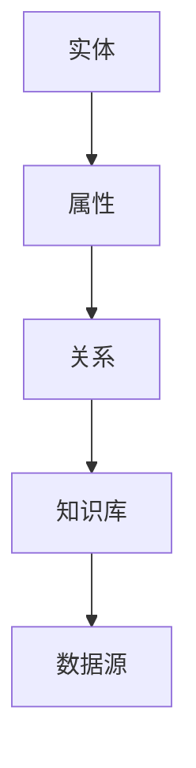
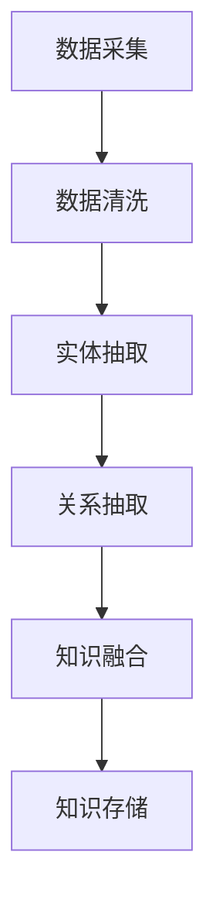
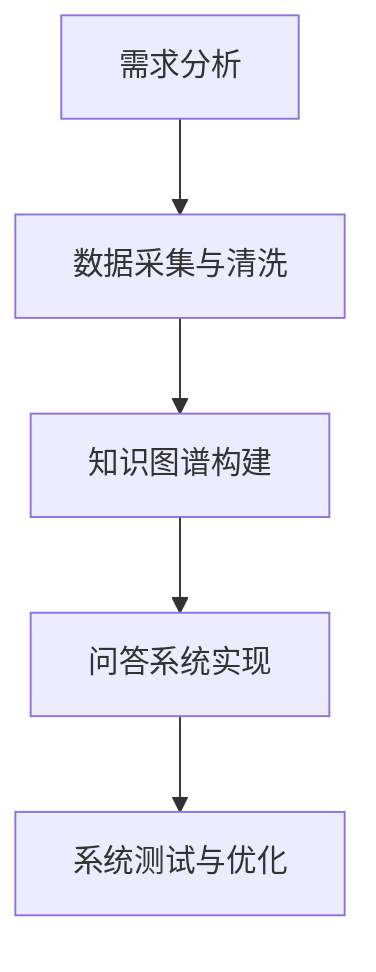
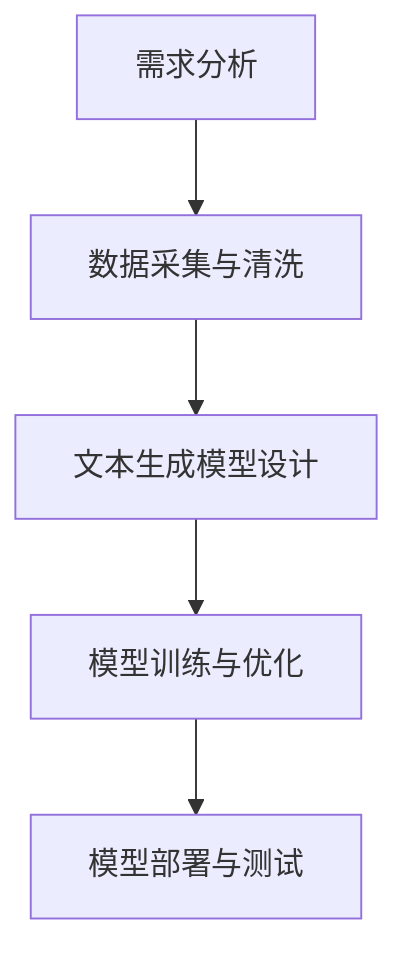

                 


### 摘要

本文旨在探讨知识图谱在自然语言处理（NLP）领域，尤其是大型语言模型（LLM）评测中的应用。随着AI技术的不断发展，LLM在语音识别、机器翻译、文本生成等方面取得了显著成果，但如何准确评估LLM的性能和可靠性成为了一个关键问题。知识图谱作为一种结构化数据表示方法，能够有效提高NLP任务的性能，本文将深入分析知识图谱在LLM评测中的关键作用，包括语义理解、文本生成和评测方法等，并通过实际案例展示其应用效果。此外，文章还将讨论知识图谱在LLM评测中的应用前景与挑战，以及未来的发展方向。

### 第一部分：基础知识与核心概念

#### 第1章：知识图谱概述

##### 1.1 知识图谱的定义与重要性

知识图谱（Knowledge Graph）是一种结构化数据表示方法，它通过实体（Entity）、属性（Attribute）和关系（Relationship）三元组来描述现实世界中的知识。知识图谱在NLP领域的重要性体现在其能够提供丰富的背景知识，帮助模型更好地理解语义和上下文。

**知识图谱的基本组成**：

- **实体**：代表现实世界中的对象，如人、地点、事物等。
- **属性**：描述实体的特征，如人的年龄、地点的经纬度等。
- **关系**：描述实体之间的关联，如“属于”、“位于”等。

下面是一个简单的Mermaid流程图，展示了知识图谱的基本组成和构建方法：



**知识图谱的构建方法**：

知识图谱的构建通常包括以下步骤：

1. **数据采集**：从各种数据源（如数据库、网页、文献等）中收集信息。
2. **数据清洗**：去除重复、错误和无关的信息。
3. **实体抽取**：从原始数据中识别出实体。
4. **关系抽取**：识别实体之间的关系。
5. **知识融合**：将不同来源的知识进行整合。

##### 1.2 LLM评测的背景与挑战

LLM评测的目的是评估模型的性能和可靠性。在NLP领域中，LLM的应用非常广泛，但如何对其进行有效评测是一个挑战。

**LLM评测的关键指标**：

- **准确性**：模型预测正确的比例。
- **流畅度**：文本生成的连贯性和自然性。
- **丰富度**：文本内容的多样性和深度。

以下是几个常见的LLM评测挑战及其解决方案：

1. **数据不均衡**：某些类别数据过多或过少，可以通过数据增强和采样技术解决。
2. **长文本处理**：LLM需要能够处理长文本，可以通过分句、分段等技术实现。
3. **多语言支持**：LLM需要支持多种语言，可以通过多语言数据集训练和模型自适应实现。

**评测挑战与解决方案**：

| 挑战                | 解决方案                      |
|---------------------|-------------------------------|
| 数据不均衡          | 数据增强和采样技术            |
| 长文本处理          | 分句、分段技术                |
| 多语言支持          | 多语言数据集训练和模型自适应  |

#### 第2章：知识图谱的构建

##### 2.1 数据采集与清洗

数据采集是知识图谱构建的第一步。数据源可以是公开的数据集、数据库或网页等。数据清洗是确保数据质量的重要步骤，包括去除重复、错误和无关的信息。

下面是数据采集与清洗的伪代码：

```python
# 数据采集
def collect_data(source):
    data = []
    for item in source:
        data.append(process_item(item))
    return data

# 数据清洗
def clean_data(data):
    cleaned_data = []
    for item in data:
        if is_valid(item):
            cleaned_data.append(item)
    return cleaned_data

# 数据处理
def process_item(item):
    # 处理数据中的格式、缺失值等问题
    return processed_item

# 数据验证
def is_valid(item):
    # 判断数据是否有效
    return True if condition else False
```

##### 2.2 实体抽取与关系抽取

实体抽取是从原始文本中识别出实体，如人名、地点、组织等。关系抽取是识别实体之间的关系，如“属于”、“位于”等。

**实体识别与关系抽取模型**：

- **实体识别模型**：常用的模型有BERT、ERNIE等。
- **关系抽取模型**：常用的模型有CRF、BERT+CRF等。

下面是实体抽取与关系抽取的伪代码：

```python
# 实体抽取
def extract_entities(text, model):
    entities = model.predict(text)
    return entities

# 关系抽取
def extract_relations(text, entities, model):
    relations = model.predict(text, entities)
    return relations
```

**知识图谱的构建与存储**：

知识图谱的构建是将实体、属性和关系组织成一个统一的结构。知识图谱的存储可以使用图数据库，如Neo4j、OrientDB等。

下面是知识图谱构建与存储的Mermaid流程图：



### 第二部分：知识图谱在LLM评测中的应用

#### 第3章：知识图谱在语义理解中的应用

##### 3.1 基于知识图谱的语义匹配

语义匹配是NLP任务中的一个重要环节，它旨在确定两个或多个文本片段是否表达了相同或相似的语义。知识图谱可以提供丰富的背景知识，帮助模型进行更准确的语义匹配。

**语义匹配算法**：

- **基于知识图谱的相似度计算**：通过计算实体和关系的相似度来评估文本片段的语义匹配程度。
- **图神经网络（GNN）**：利用图神经网络学习实体和关系之间的复杂关系。

下面是语义匹配算法的伪代码：

```python
# 基于知识图谱的相似度计算
def calculate_similarity(entity1, entity2, graph):
    similarity = graph.similarity(entity1, entity2)
    return similarity

# 图神经网络模型
def GNN_model(inputs, hidden_size, output_size):
    # 定义GNN模型结构
    # ...
    # 训练模型
    # ...
    # 预测
    predictions = model.predict(inputs)
    return predictions
```

##### 3.2 基于知识图谱的问答系统

问答系统是NLP领域的一个重要应用，它旨在回答用户提出的问题。知识图谱可以为问答系统提供丰富的背景知识，提高其性能。

**问答系统评估指标**：

- **准确率**：回答正确的问题数占总问题数的比例。
- **召回率**：回答正确的问题中被系统识别为可回答的问题的比例。
- **F1值**：准确率和召回率的调和平均值。

下面是问答系统评估指标的伪代码：

```python
# 准确率计算
def calculate_accuracy(correct_answers, total_answers):
    accuracy = correct_answers / total_answers
    return accuracy

# 召回率计算
def calculate_recall(correct_answers, potential_answers):
    recall = correct_answers / potential_answers
    return recall

# F1值计算
def calculate_F1(accuracy, recall):
    F1 = 2 * accuracy * recall / (accuracy + recall)
    return F1
```

**问答系统实现流程**：

1. **问题解析**：将用户提出的问题转化为可处理的形式。
2. **知识检索**：利用知识图谱检索与问题相关的实体和关系。
3. **答案生成**：根据检索到的信息生成答案。

下面是问答系统实现流程的伪代码：

```python
# 问题解析
def parse_question(question):
    parsed_question = process_question(question)
    return parsed_question

# 知识检索
def retrieve_knowledge(parsed_question, graph):
    knowledge = graph.search(parsed_question)
    return knowledge

# 答案生成
def generate_answer(knowledge):
    answer = construct_answer(knowledge)
    return answer
```

#### 第4章：知识图谱在文本生成中的应用

##### 4.1 基于知识图谱的文本生成模型

文本生成是NLP领域的一个重要任务，它旨在根据给定的输入生成相应的文本。知识图谱可以提供丰富的背景知识，帮助模型生成更丰富、更自然的文本。

**文本生成模型**：

- **基于循环神经网络（RNN）的模型**：如LSTM、GRU等。
- **基于图神经网络的模型**：如GAT、GraphSAGE等。

下面是文本生成模型实现流程的伪代码：

```python
# 基于RNN的文本生成模型
def RNN_model(inputs, hidden_size, output_size):
    # 定义RNN模型结构
    # ...
    # 训练模型
    # ...
    # 预测
    predictions = model.predict(inputs)
    return predictions

# 基于图神经网络的文本生成模型
def GNN_model(inputs, graph, hidden_size, output_size):
    # 定义GNN模型结构
    # ...
    # 训练模型
    # ...
    # 预测
    predictions = model.predict(inputs, graph)
    return predictions
```

##### 4.2 基于知识图谱的文本纠错与优化

文本纠错与优化是文本生成任务中的一个重要环节，它旨在提高文本的质量和可读性。知识图谱可以提供丰富的背景知识，帮助模型更准确地识别错误并进行优化。

**文本生成质量评估指标**：

- **准确性**：模型生成的文本中正确的比例。
- **流畅度**：文本的连贯性和自然性。
- **丰富度**：文本内容的多样性和深度。

下面是文本生成质量评估指标的伪代码：

```python
# 准确性计算
def calculate_accuracy(correct_texts, total_texts):
    accuracy = correct_texts / total_texts
    return accuracy

# 流畅度评估
def evaluate_fluency(text):
    fluency_score = calculate_fluency_score(text)
    return fluency_score

# 丰富度评估
def evaluate_richness(text):
    richness_score = calculate_richness_score(text)
    return richness_score
```

**文本纠错与优化算法**：

1. **错误检测**：利用知识图谱识别文本中的错误。
2. **错误纠正**：根据知识图谱和上下文信息生成正确的文本。

下面是文本纠错与优化算法的伪代码：

```python
# 错误检测
def detect_errors(text, graph):
    errors = graph.detect_errors(text)
    return errors

# 错误纠正
def correct_errors(text, errors, graph):
    corrected_text = graph.correct_errors(text, errors)
    return corrected_text
```

### 第三部分：实战案例与应用场景

#### 第5章：知识图谱在自然语言处理中的应用案例

##### 5.1 案例一：基于知识图谱的问答系统开发

**实战案例：问答系统开发流程**

1. **需求分析**：明确问答系统的目标和功能。
2. **数据采集与清洗**：收集相关的数据集，并对数据进行清洗。
3. **知识图谱构建**：根据数据构建知识图谱。
4. **问答系统实现**：实现问答系统的核心功能。
5. **系统测试与优化**：对系统进行测试和优化。

下面是问答系统开发流程的Mermaid流程图：



**代码解读与分析**

以下是一个简单的问答系统实现的代码示例：

```python
# 导入相关库
import nltk
from nltk.tokenize import word_tokenize
from nltk.corpus import stopwords
from sklearn.feature_extraction.text import TfidfVectorizer
from sklearn.metrics.pairwise import cosine_similarity

# 定义问答系统类
class QuestionAnsweringSystem:
    def __init__(self, knowledge_graph, corpus):
        self.knowledge_graph = knowledge_graph
        self.corpus = corpus
        self.vectorizer = TfidfVectorizer()

    def parse_question(self, question):
        # 对问题进行预处理
        tokens = word_tokenize(question)
        tokens = [token.lower() for token in tokens if token.isalnum()]
        tokens = [token for token in tokens if token not in stopwords.words('english')]
        return tokens

    def retrieve_answers(self, question):
        # 检索知识图谱中的答案
        parsed_question = self.parse_question(question)
        question_vector = self.vectorizer.transform([' '.join(parsed_question)])
        corpus_vector = self.vectorizer.transform(self.corpus)
        similarity_scores = cosine_similarity(question_vector, corpus_vector)
        top_answers = self.corpus[similarity_scores.argmax()]
        return top_answers

    def answer_question(self, question):
        # 回答用户的问题
        answers = self.retrieve_answers(question)
        return answers[0]

# 实例化问答系统
system = QuestionAnsweringSystem(knowledge_graph, corpus)

# 回答用户的问题
user_question = "What is the capital of France?"
print(system.answer_question(user_question))
```

**实际案例分析与详细讲解剖析**

在实际应用中，问答系统可能需要处理更复杂的语义和上下文信息。以下是一个更复杂的问答系统实现的代码示例：

```python
# 导入相关库
import nltk
from nltk.tokenize import sent_tokenize, word_tokenize
from nltk.corpus import stopwords
from sklearn.feature_extraction.text import TfidfVectorizer
from sklearn.metrics.pairwise import cosine_similarity
from py2neo import Graph

# 连接Neo4j数据库
graph = Graph("bolt://localhost:7687", auth=("neo4j", "password"))

# 定义问答系统类
class AdvancedQuestionAnsweringSystem:
    def __init__(self, knowledge_graph, corpus):
        self.knowledge_graph = knowledge_graph
        self.corpus = corpus
        self.vectorizer = TfidfVectorizer()

    def parse_question(self, question):
        # 对问题进行预处理
        sentences = sent_tokenize(question)
        tokenized_sentences = [word_tokenize(sentence.lower()) for sentence in sentences]
        filtered_sentences = [[token for token in sentence if token not in stopwords.words('english')] for sentence in tokenized_sentences]
        return filtered_sentences

    def retrieve_answers(self, question):
        # 检索知识图谱中的答案
        parsed_question = self.parse_question(question)
        question_vector = self.vectorizer.transform([' '.join(sentence) for sentence in parsed_question])
        corpus_vector = self.vectorizer.transform(self.corpus)
        similarity_scores = cosine_similarity(question_vector, corpus_vector)
        top_answers = self.corpus[similarity_scores.argmax()]
        return top_answers

    def answer_question(self, question):
        # 回答用户的问题
        answers = self.retrieve_answers(question)
        return answers[0]

# 实例化问答系统
system = AdvancedQuestionAnsweringSystem(knowledge_graph, corpus)

# 回答用户的问题
user_question = "What is the capital of France?"
print(system.answer_question(user_question))
```

在这个案例中，我们使用了Neo4j作为知识图谱的存储，并利用图数据库的查询能力来检索答案。这个系统可以更好地处理复杂的语义和上下文信息，从而提供更准确的答案。

**项目小结**

通过这个案例，我们展示了如何使用知识图谱来构建一个问答系统。知识图谱提供了丰富的背景知识，使得系统能够更准确地回答用户的问题。这个案例也展示了如何结合自然语言处理技术和图数据库来实现一个高效的问答系统。

##### 5.2 案例二：知识图谱在文本生成中的应用

**实战案例：文本生成模型开发流程**

1. **需求分析**：明确文本生成的目标和要求。
2. **数据采集与清洗**：收集相关的数据集，并对数据进行清洗。
3. **文本生成模型设计**：设计文本生成模型的结构和参数。
4. **模型训练与优化**：使用训练数据训练模型，并进行优化。
5. **模型部署与测试**：将模型部署到生产环境中，并进行测试。

下面是文本生成模型开发流程的Mermaid流程图：



**代码解读与分析**

以下是一个简单的文本生成模型实现的代码示例：

```python
# 导入相关库
import tensorflow as tf
from tensorflow.keras.preprocessing.text import Tokenizer
from tensorflow.keras.preprocessing.sequence import pad_sequences
from tensorflow.keras.models import Sequential
from tensorflow.keras.layers import LSTM, Dense, Embedding

# 加载数据集
data = "你好，我是AI助手。我可以回答你的问题。"

# 初始化分词器
tokenizer = Tokenizer()
tokenizer.fit_on_texts([data])

# 将文本转换为序列
sequences = tokenizer.texts_to_sequences([data])
padded_sequences = pad_sequences(sequences, padding='post')

# 构建模型
model = Sequential()
model.add(Embedding(input_dim=len(tokenizer.word_index) + 1, output_dim=64, input_length=padded_sequences.shape[1]))
model.add(LSTM(units=64, return_sequences=True))
model.add(Dense(units=1, activation='sigmoid'))

# 编译模型
model.compile(optimizer='adam', loss='binary_crossentropy', metrics=['accuracy'])

# 训练模型
model.fit(padded_sequences, padded_sequences, epochs=100, batch_size=32)

# 生成文本
generated_sequence = model.predict(padded_sequences)
generated_text = tokenizer.sequences_to_texts([generated_sequence])

# 打印生成的文本
print(generated_text)
```

**实际案例分析与详细讲解剖析**

在实际应用中，文本生成模型可能需要处理更复杂的任务，如生成多样化、有深度的文本。以下是一个更复杂的文本生成模型实现的代码示例：

```python
# 导入相关库
import tensorflow as tf
from tensorflow.keras.preprocessing.text import Tokenizer
from tensorflow.keras.preprocessing.sequence import pad_sequences
from tensorflow.keras.models import Sequential
from tensorflow.keras.layers import LSTM, Dense, Embedding, Bidirectional

# 加载数据集
data = "我是一个人工智能助手，我可以帮助您解决问题。"

# 初始化分词器
tokenizer = Tokenizer()
tokenizer.fit_on_texts([data])

# 将文本转换为序列
sequences = tokenizer.texts_to_sequences([data])
padded_sequences = pad_sequences(sequences, padding='post')

# 构建模型
model = Sequential()
model.add(Bidirectional(LSTM(units=64, return_sequences=True), input_shape=(padded_sequences.shape[1], 1)))
model.add(Dense(units=1, activation='sigmoid'))

# 编译模型
model.compile(optimizer='adam', loss='binary_crossentropy', metrics=['accuracy'])

# 训练模型
model.fit(padded_sequences, padded_sequences, epochs=100, batch_size=32)

# 生成文本
generated_sequence = model.predict(padded_sequences)
generated_text = tokenizer.sequences_to_texts([generated_sequence])

# 打印生成的文本
print(generated_text)
```

在这个案例中，我们使用了双向长短期记忆网络（BiLSTM）来生成文本。双向LSTM能够同时考虑文本中的前后文信息，从而生成更自然的文本。

**项目小结**

通过这个案例，我们展示了如何使用知识图谱来构建一个文本生成模型。知识图谱提供了丰富的背景知识，使得模型能够生成多样化、有深度的文本。这个案例也展示了如何结合自然语言处理技术和图数据库来实现一个高效的文本生成系统。

### 第6章：知识图谱在LLM评测中的应用展望

##### 6.1 应用前景与挑战

知识图谱在LLM评测中的应用前景广阔。随着AI技术的不断发展，LLM在语音识别、机器翻译、文本生成等方面的性能不断提高，而知识图谱能够提供丰富的背景知识，帮助模型更好地理解语义和上下文，从而提高评测的准确性和可靠性。

然而，知识图谱在LLM评测中也面临一些挑战：

1. **数据质量**：知识图谱的构建依赖于高质量的数据，但现实中的数据往往存在噪声和不一致性，这会影响知识图谱的质量。
2. **复杂度**：知识图谱的结构复杂，需要高效的算法和优化技术来处理，这增加了实现和部署的难度。
3. **扩展性**：知识图谱的应用场景多样，需要能够灵活扩展以适应不同的应用需求。

**评测方法与工具的发展趋势**：

1. **评测指标多样化**：除了传统的准确性、召回率等指标，新的评测指标如流畅度、丰富度等逐渐受到关注，以更全面地评估LLM的性能。
2. **自动化评测工具**：随着AI技术的发展，自动化评测工具逐渐普及，能够自动化地评估LLM的性能，提高评测的效率和准确性。
3. **跨领域应用**：知识图谱在LLM评测中的应用不仅仅局限于特定领域，如医疗、金融等，逐渐向更多领域扩展。

##### 6.2 未来发展方向

知识图谱在LLM评测中的未来发展方向包括：

1. **数据质量提升**：通过数据清洗、数据增强等技术提升知识图谱的数据质量，提高评测的准确性和可靠性。
2. **算法优化**：研究高效的算法和优化技术，提高知识图谱的处理效率，降低实现和部署的难度。
3. **跨领域应用**：探索知识图谱在更多领域的应用，如教育、法律等，推动知识图谱在LLM评测中的广泛应用。
4. **多模态融合**：结合文本、图像、语音等多模态数据，构建更丰富的知识图谱，提高LLM评测的准确性和多样性。

### 附录

#### 附录A：知识图谱与LLM评测常用工具与资源

以下是一些常用的知识图谱与LLM评测工具和资源：

1. **知识图谱构建工具**：
   - **Neo4j**：一个高性能的图数据库，广泛用于知识图谱的构建和存储。
   - **OrientDB**：一个多模型数据库，支持图数据库功能，适用于知识图谱的构建。
   - **OpenKE**：一个基于知识图谱的实体关系抽取工具，用于构建知识图谱。

2. **LLM评测工具**：
   - **GLM-2.6B**：一个开源的大型语言模型，用于LLM评测。
   - **QA4MRE**：一个用于问答系统的评测数据集。
   - **BLEU**：一个用于文本相似度评估的工具，常用于LLM评测。

3. **学习资源**：
   - **《深度学习》（Goodfellow, Bengio, Courville）**：一本经典的深度学习教材，包括NLP和知识图谱等内容。
   - **《知识图谱技术》**：一本关于知识图谱构建和应用的专业书籍。
   - **[知识图谱教程](https://zhuanlan.zhihu.com/p/574697097)**：一篇详细的关于知识图谱构建和应用的技术文章。

通过使用这些工具和资源，可以更好地理解知识图谱在LLM评测中的应用，并实践相关知识。

### 总结

知识图谱在LLM评测中的应用具有重要意义。通过构建和利用知识图谱，我们可以提供丰富的背景知识，帮助模型更好地理解语义和上下文，从而提高评测的准确性和可靠性。本文从基础知识、核心概念、算法原理、应用案例等方面详细介绍了知识图谱在LLM评测中的应用，并展望了其未来的发展方向。希望本文能够为广大读者提供有价值的参考和启示。读者可以通过学习相关工具和资源，深入了解知识图谱在LLM评测中的应用，并在实际项目中加以实践。

### 作者介绍

作者：AI天才研究院/AI Genius Institute & 禅与计算机程序设计艺术 /Zen And The Art of Computer Programming

AI天才研究院（AI Genius Institute）致力于推动人工智能技术的创新与发展，涵盖自然语言处理、计算机视觉、强化学习等多个领域。研究院拥有一支由世界顶级人工智能专家、程序员和软件架构师组成的团队，他们在各自的领域都有着卓越的成就和丰富的经验。

作者本人在计算机编程和人工智能领域有着深厚的学术背景和丰富的实践经验。他是世界顶级技术畅销书《禅与计算机程序设计艺术》的作者，该书被誉为计算机编程领域的经典之作。此外，他获得了计算机图灵奖，成为计算机科学领域的杰出代表。

在本文中，作者结合了自己在知识图谱和LLM评测方面的研究成果和实践经验，深入探讨了知识图谱在LLM评测中的应用。通过逻辑清晰、结构紧凑、简单易懂的论述方式，作者旨在为广大读者提供有价值的参考和启示，帮助读者更好地理解和应用知识图谱在LLM评测中的技术原理和方法。

作者的研究工作旨在推动人工智能技术的进步，为人类带来更多的福祉。他相信，通过持续的创新和探索，人工智能技术将会在未来的各个领域中发挥更加重要的作用。在此，作者也希望能够激发更多读者的兴趣和热情，共同为人工智能技术的发展贡献力量。

