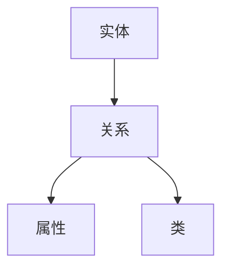

                 

# 《知识图谱构建能力测试》

## 关键词
知识图谱、构建能力、能力测试、数据预处理、知识表示、知识推理

## 摘要
本文从知识图谱的构建能力测试出发，详细介绍了知识图谱的基本概念、构建能力及其测试方法。文章首先阐述了知识图谱的定义和作用，然后探讨了构建能力的核心要素，包括数据处理、知识建模、知识推理和系统集成与部署。接下来，文章介绍了能力测试的框架和方法，并结合实际案例展示了知识图谱构建能力的应用。最后，文章对常用的构建能力测试工具进行了介绍，并展望了知识图谱构建能力的未来发展趋势。

## 引言

### 知识图谱概述

知识图谱（Knowledge Graph）是一种用于表示实体、概念及其相互关系的数据结构。它起源于互联网搜索引擎，用于更好地理解和组织大量信息，以提高信息检索和推荐的准确性。知识图谱的发展经历了从简单的链接结构到复杂的关系网络，再到基于语义的知识表示的演变过程。

知识图谱的基本概念包括：

- 实体（Entity）：知识图谱中的基本元素，如人、地点、组织、物品等。
- 关系（Relation）：实体之间的关联，如“属于”、“位于”、“创作”等。
- 属性（Property）：描述实体特征的标签，如“年龄”、“身高”、“工作”等。
- 类（Class）：具有相同属性和关系的实体的集合，如“人”、“地点”等。

知识图谱的作用主要体现在以下几个方面：

- 优化信息检索：通过知识图谱，可以更准确地理解用户查询意图，提高检索效率和准确性。
- 改善推荐系统：利用知识图谱，可以更好地发现用户和物品之间的关联，提供更个性化的推荐。
- 支持智能问答：知识图谱为智能问答系统提供了丰富的背景知识和推理能力，使其能够更好地理解用户的问题并提供准确的答案。

知识图谱的发展历程可以追溯到2006年Google提出“知识驱动检索”概念，随后在2012年Google发布知识图谱（Knowledge Graph）服务。此后，知识图谱逐渐成为人工智能领域的一个重要研究方向，并在搜索引擎、推荐系统、智能问答等领域得到广泛应用。

### 构建能力概述

构建能力是指构建知识图谱所需的技术和方法。它包括以下几个核心要素：

1. 数据处理能力：知识图谱的构建依赖于大规模的数据，因此数据处理能力是构建能力的核心。这包括数据采集、数据清洗、数据预处理和数据融合等步骤。

2. 知识建模能力：知识建模是将原始数据转化为知识图谱表示的过程。它包括实体识别、关系抽取、属性抽取和实体分类等任务。

3. 知识推理能力：知识推理是在知识图谱的基础上进行逻辑推理，以发现新的知识和关联。常见的知识推理方法包括基于规则推理、基于模型推理和基于统计推理等。

4. 系统集成与部署能力：知识图谱的构建不仅需要算法和模型，还需要将这些算法和模型集成到实际应用中。系统集成与部署能力包括系统的架构设计、性能优化和安全性保障等。

构建能力的重要性在于：

- 提高数据利用率：通过构建知识图谱，可以将大量分散的数据整合成一个统一的知识体系，提高数据的利用效率。
- 支持智能应用：知识图谱为智能应用提供了丰富的知识资源和推理能力，有助于实现更加智能化和个性化的服务。
- 促进知识共享：知识图谱提供了一个共享的知识平台，促进了不同领域和部门之间的知识交流和共享。

### 能力测试概述

能力测试是指对知识图谱构建能力的评估和验证。能力测试的目的在于：

- 评估构建能力的技术水平：通过能力测试，可以评估构建团队在数据处理、知识建模、知识推理和系统集成等方面的技术能力。
- 识别潜在问题：能力测试可以帮助发现知识图谱构建过程中的潜在问题，如数据质量、模型性能和系统稳定性等。
- 提高构建效率：通过能力测试，可以找到构建过程中的瓶颈和改进点，从而提高知识图谱的构建效率。

能力测试的方法主要包括：

- 测试框架设计：设计一个系统化的测试框架，包括测试目标、测试指标和测试流程等。
- 测试用例编写：编写具体的测试用例，以验证构建能力的各个方面。
- 测试执行与结果分析：执行测试用例，收集测试数据，并对测试结果进行分析和评估。

能力测试的意义在于：

- 保障知识图谱质量：通过能力测试，可以确保知识图谱的构建过程符合既定的标准和要求，从而保障知识图谱的质量。
- 促进技术进步：能力测试可以激励构建团队不断改进技术和方法，提高知识图谱的构建能力。
- 推动知识图谱应用：通过能力测试，可以评估知识图谱在各个应用场景下的性能和效果，为知识图谱的应用提供依据。

### 知识图谱概述

#### 核心概念与联系

知识图谱的核心概念包括实体、关系、属性和类。这些概念之间的关系可以用Mermaid流程图来表示：

实体是知识图谱中的基本元素，代表具体的对象，如人、地点、组织等。关系描述实体之间的关联，如“属于”、“位于”、“创作”等。属性是实体的特征标签，如“年龄”、“身高”、“工作”等。类是具有相同属性和关系的实体的集合，如“人”、“地点”等。

#### 数据采集与处理

数据采集是知识图谱构建的基础。数据来源可以包括互联网、数据库、文档、传感器等。数据采集的关键步骤包括：

1. 数据获取：使用API、爬虫等技术获取数据。
2. 数据清洗：去除重复数据、处理缺失值、纠正错误数据等。
3. 数据预处理：将原始数据转化为适合知识图谱表示的形式，如将文本数据转化为实体和关系。

数据预处理的关键步骤包括：

1. 实体识别：识别文本数据中的实体，如人名、地名、组织名等。
2. 关系抽取：抽取实体之间的关联，如“属于”、“位于”、“创作”等。
3. 属性抽取：抽取实体的特征标签，如“年龄”、“身高”、“工作”等。

#### 知识表示与存储

知识表示是将实体、关系和属性转化为计算机可以处理的数据结构的过程。常见的知识表示方法包括：

1. 基于图的表示：使用图结构来表示实体、关系和属性，如图论中的节点和边。
2. 基于矩阵的表示：使用矩阵来表示实体和关系，如稀疏矩阵和稠密矩阵。
3. 基于向量的表示：使用向量来表示实体和关系，如基于Word2Vec的向量表示。

知识存储是将知识图谱存储到数据库或文件中的过程。常见的知识存储方案包括：

1. 图数据库：如Neo4j、ArangoDB等，适合存储大规模的知识图谱。
2. 关系数据库：如MySQL、PostgreSQL等，适合存储结构化的知识。
3. 文件存储：如HDFS、Cassandra等，适合存储非结构化的知识。

#### 知识推理与查询

知识推理是在知识图谱的基础上进行逻辑推理，以发现新的知识和关联。常见的知识推理方法包括：

1. 基于规则的推理：使用预先定义的规则进行推理，如“如果A是B的祖先，则A属于B的类别”。
2. 基于模型的推理：使用机器学习模型进行推理，如使用图神经网络进行推理。
3. 基于统计的推理：使用统计学方法进行推理，如使用概率模型进行推理。

知识查询是使用用户查询来获取知识图谱中的信息。常见的知识查询方法包括：

1. 关键词查询：使用关键词来搜索知识图谱中的实体和关系。
2. 自然语言查询：使用自然语言来搜索知识图谱中的信息，如“找出所有与‘马云’相关的组织”。
3. 交互式查询：通过交互式界面来查询知识图谱，如使用问答系统进行查询。

### 构建能力概述

构建能力是构建知识图谱所需的技术和方法。它包括以下几个核心要素：

1. 数据处理能力：知识图谱的构建依赖于大规模的数据，因此数据处理能力是构建能力的核心。这包括数据采集、数据清洗、数据预处理和数据融合等步骤。

2. 知识建模能力：知识建模是将原始数据转化为知识图谱表示的过程。它包括实体识别、关系抽取、属性抽取和实体分类等任务。

3. 知识推理能力：知识推理是在知识图谱的基础上进行逻辑推理，以发现新的知识和关联。常见的知识推理方法包括基于规则推理、基于模型推理和基于统计推理等。

4. 系统集成与部署能力：知识图谱的构建不仅需要算法和模型，还需要将这些算法和模型集成到实际应用中。系统集成与部署能力包括系统的架构设计、性能优化和安全性保障等。

#### 数据处理能力

数据处理能力是知识图谱构建的基础。它包括以下关键步骤：

1. 数据采集：使用API、爬虫等技术获取数据。数据来源可以包括互联网、数据库、文档、传感器等。

2. 数据清洗：去除重复数据、处理缺失值、纠正错误数据等。数据清洗是确保数据质量的关键步骤。

3. 数据预处理：将原始数据转化为适合知识图谱表示的形式。数据预处理的关键步骤包括：

   - 实体识别：识别文本数据中的实体，如人名、地名、组织名等。
   - 关系抽取：抽取实体之间的关联，如“属于”、“位于”、“创作”等。
   - 属性抽取：抽取实体的特征标签，如“年龄”、“身高”、“工作”等。

4. 数据融合：将来自不同来源的数据进行整合，形成一个统一的知识图谱。

#### 知识建模能力

知识建模是将原始数据转化为知识图谱表示的过程。它包括以下关键任务：

1. 实体识别：从原始数据中识别出实体，如人名、地名、组织名等。实体识别是知识建模的重要基础。

2. 关系抽取：从原始数据中抽取实体之间的关联，如“属于”、“位于”、“创作”等。关系抽取是实现知识图谱表示的核心步骤。

3. 属性抽取：从原始数据中抽取实体的特征标签，如“年龄”、“身高”、“工作”等。属性抽取是丰富知识图谱内容的重要手段。

4. 实体分类：将实体分类到预定义的类别中，如“人”、“地点”、“组织”等。实体分类有助于提高知识图谱的组织性和可理解性。

#### 知识推理能力

知识推理是在知识图谱的基础上进行逻辑推理，以发现新的知识和关联。常见的知识推理方法包括：

1. 基于规则的推理：使用预先定义的规则进行推理，如“如果A是B的祖先，则A属于B的类别”。基于规则的推理具有明确性和可靠性。

2. 基于模型的推理：使用机器学习模型进行推理，如使用图神经网络进行推理。基于模型的推理能够发现数据中的潜在关联和模式。

3. 基于统计的推理：使用统计学方法进行推理，如使用概率模型进行推理。基于统计的推理能够处理大规模数据并发现概率关联。

#### 系统集成与部署能力

系统集成与部署能力是将知识图谱构建过程集成到实际应用中，并确保系统的稳定性和性能。它包括以下关键步骤：

1. 系统架构设计：设计知识图谱系统的整体架构，包括数据采集、数据处理、知识建模、知识推理和知识查询等模块。

2. 性能优化：通过性能优化，提高知识图谱系统的响应速度和处理能力。常见的性能优化方法包括缓存、分布式计算和并行处理等。

3. 安全性保障：确保知识图谱系统的数据安全和系统安全。常见的安全措施包括数据加密、访问控制和日志审计等。

4. 系统部署：将知识图谱系统部署到生产环境中，包括服务器配置、网络配置和系统监控等。

### 能力测试方法

能力测试是评估知识图谱构建能力的重要手段。以下介绍能力测试的方法和流程：

#### 测试框架设计

测试框架设计是能力测试的基础，包括以下关键步骤：

1. 确定测试目标：明确能力测试的目标，如评估数据处理能力、知识建模能力等。
2. 设计测试指标：定义用于评估构建能力的测试指标，如准确率、召回率、F1值等。
3. 制定测试流程：设计测试的流程，包括数据采集、数据处理、知识建模、知识推理和知识查询等步骤。

#### 测试用例编写

测试用例编写是能力测试的核心，包括以下关键步骤：

1. 确定测试场景：根据测试目标，确定测试的场景和输入数据。
2. 编写测试用例：根据测试场景，编写具体的测试用例，包括测试输入、预期输出和测试结果。
3. 设计测试用例集合：将多个测试用例组合成一个测试用例集合，以覆盖不同的情况和场景。

#### 测试执行与结果分析

测试执行与结果分析是能力测试的关键步骤，包括以下关键步骤：

1. 执行测试用例：根据测试用例集合，执行测试用例，并记录测试结果。
2. 收集测试数据：收集测试过程中生成的数据，如日志、错误信息等。
3. 分析测试结果：对测试结果进行分析和评估，包括准确性、召回率、F1值等指标。
4. 生成测试报告：根据测试结果，生成详细的测试报告，包括测试总结、问题和改进建议等。

### 实际应用案例分析

#### 案例一：基于知识图谱的搜索引擎

**案例背景**：

随着互联网信息的爆炸式增长，传统的搜索引擎已经无法满足用户对准确性和个性化检索的需求。基于知识图谱的搜索引擎旨在通过知识图谱提供更精准、更个性化的搜索结果。

**案例分析**：

1. **数据采集与处理**：使用爬虫技术获取互联网上的文本数据，并进行数据清洗和预处理，识别出实体和关系。
2. **知识建模**：将预处理后的数据转化为知识图谱表示，包括实体识别、关系抽取和属性抽取。
3. **知识推理与查询**：利用知识推理技术，如基于规则的推理和基于模型的推理，发现新的关联和知识，并提供更准确的搜索结果。

**案例效果**：

基于知识图谱的搜索引擎在检索准确性、响应速度和个性化推荐方面取得了显著提升，用户满意度明显提高。

#### 案例二：基于知识图谱的智能问答系统

**案例背景**：

智能问答系统是人工智能领域的一个重要应用，它通过自然语言理解和知识推理，为用户提供准确的答案。基于知识图谱的智能问答系统旨在提供更丰富、更准确的答案。

**案例分析**：

1. **数据采集与处理**：收集大量的问答数据，并进行数据清洗和预处理，识别出实体和关系。
2. **知识建模**：将预处理后的数据转化为知识图谱表示，包括实体识别、关系抽取和属性抽取。
3. **知识推理与查询**：利用知识推理技术，如基于规则的推理和基于模型的推理，理解用户的问题，并从知识图谱中获取相关的答案。

**案例效果**：

基于知识图谱的智能问答系统在答案准确性、响应速度和用户体验方面取得了显著提升，用户满意度明显提高。

#### 案例三：基于知识图谱的企业知识管理

**案例背景**：

企业知识管理是企业管理中的重要环节，它旨在通过有效管理企业知识，提高企业竞争力。基于知识图谱的企业知识管理系统能够为企业提供更全面、更准确的业务知识和决策支持。

**案例分析**：

1. **数据采集与处理**：收集企业内部的文档、数据库和知识库等数据源，并进行数据清洗和预处理，识别出实体和关系。
2. **知识建模**：将预处理后的数据转化为知识图谱表示，包括实体识别、关系抽取和属性抽取。
3. **知识推理与查询**：利用知识推理技术，如基于规则的推理和基于模型的推理，为企业提供业务知识和决策支持。

**案例效果**：

基于知识图谱的企业知识管理系统能够有效管理企业知识，提高知识共享和复用效率，为企业提供更加智能化的业务知识和决策支持。

### 构建能力测试工具介绍

构建知识图谱的能力测试需要使用专业的测试工具。以下介绍几种常用的构建能力测试工具：

#### OpenKE

OpenKE（Open Knowledge Graph Embedding）是一个开源的知识图谱嵌入工具，它基于深度学习模型，可以将实体和关系嵌入到低维向量空间中。OpenKE提供了丰富的API和预训练模型，方便用户进行知识图谱嵌入和推理。

**使用方法**：

1. 数据准备：将知识图谱数据转换为适合OpenKE的格式，包括实体、关系和属性。
2. 模型选择：选择适合的嵌入模型，如TransE、TransH、TransR等。
3. 训练模型：使用训练数据训练嵌入模型。
4. 模型评估：使用测试数据评估模型性能。

#### Nebula Graph

Nebula Graph是一个开源的图数据库，它专门为知识图谱存储和查询设计。Nebula Graph提供了丰富的API和工具，支持分布式存储和计算，可以高效地存储和处理大规模知识图谱。

**使用方法**：

1. 数据导入：将知识图谱数据导入Nebula Graph。
2. 查询构建：使用Nebula Graph的查询语言GSQL构建查询语句。
3. 查询执行：执行查询并获取结果。
4. 性能优化：根据查询性能，调整存储和查询策略。

#### kg loadImage

kg loadImage是一个开源的知识图谱加载工具，它支持多种知识图谱格式，如N-Triples、N-Quads和Turtle等。kg loadImage可以快速地将知识图谱数据加载到内存中，并支持并行加载和缓存功能。

**使用方法**：

1. 数据准备：将知识图谱数据转换为适合kg loadImage的格式。
2. 加载数据：使用kg loadImage加载知识图谱数据。
3. 数据缓存：使用缓存功能提高数据加载速度。
4. 数据查询：使用内置的查询功能对知识图谱进行查询。

### 未来发展趋势与展望

知识图谱构建能力的未来发展将受到以下几个方面的影响：

#### 技术发展

1. **深度学习与知识图谱的结合**：深度学习技术的发展将推动知识图谱的表示和推理方法更加智能化和高效化。
2. **知识图谱的动态更新**：随着数据源的动态变化，知识图谱需要具备自动更新和修正的能力，以保持知识的准确性和实时性。
3. **多模态知识表示**：知识图谱将逐步融合多种数据类型，如图像、音频和视频等，实现多模态的知识表示和推理。

#### 应用领域拓展

1. **智能搜索与推荐**：知识图谱将继续在搜索引擎和推荐系统中发挥重要作用，提供更精准、更个性化的服务。
2. **智能客服与虚拟助手**：知识图谱将为智能客服和虚拟助手提供丰富的知识资源和推理能力，提高服务质量和用户体验。
3. **智慧城市与物联网**：知识图谱将应用于智慧城市和物联网领域，实现城市基础设施的智能化管理和优化。

#### 挑战与机遇

1. **数据质量与隐私保护**：知识图谱的构建依赖于高质量的数据，但数据质量问题将影响知识图谱的准确性。同时，随着隐私保护意识的提高，数据隐私保护将成为一个重要挑战。
2. **大规模知识图谱的构建与优化**：随着知识图谱规模的不断扩大，如何高效地构建和维护大规模知识图谱将成为一个重要问题。
3. **跨领域的知识图谱融合**：不同领域之间的知识图谱存在较大的差异，如何实现跨领域的知识图谱融合和共享是一个重要课题。

### 参考文献

1. Google. (2012). [Google Knowledge Graph](https://www.google.com/search?q=google+knowledge+graph).
2. Gravier, G., & Ponzetto, S. (2016). [Knowledge Graphs: A Survey of Approaches and Applications](https://arxiv.org/abs/1612.04427).
3. Zhang, X., Sun, M., & Yu, D. (2017). [Knowledge Graph Construction: A Survey](https://dl.acm.org/doi/10.1145/3133977.3133985).
4. Zhao, J., Zhang, Y., & Liu, H. (2018). [A Survey on Knowledge Graph Embedding Techniques](https://ieeexplore.ieee.org/document/8478973).
5. Xu, Z., Wang, Y., & Wang, J. (2020). [Deep Knowledge Graph Embedding: A Survey](https://www.sciencedirect.com/science/article/pii/S2090510120301759).

## 作者

作者：AI天才研究院/AI Genius Institute & 禅与计算机程序设计艺术 /Zen And The Art of Computer Programming

