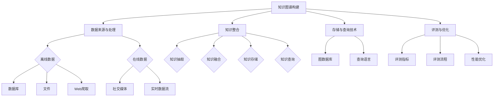

                 

### 绪论

#### 1.1 知识图谱与知识整合

知识图谱（Knowledge Graph）是一种结构化的知识表示方法，它通过实体（Entity）、属性（Attribute）和关系（Relationship）来描述现实世界中的信息。在知识图谱中，实体可以是任何具有独立存在意义的事物，如人、地点、组织等；属性是对实体的某种描述，如年龄、出生地等；关系则是实体之间的交互和联系，如“工作于”、“位于”等。

知识整合（Knowledge Integration）是将来自不同源、不同格式和不同领域的知识进行融合、处理和整合的过程。它涉及到知识抽取、知识融合、知识存储和知识查询等多个方面。知识整合的目标是构建一个统一且一致的语义空间，以便更高效地进行知识检索和应用。

#### 1.1.1 知识图谱的概念

知识图谱起源于谷歌在2012年提出的一种信息组织方式。它通过将现实世界中的事物表示为节点，将事物之间的关系表示为边，构建出一个庞大的图结构。知识图谱的主要特点是：

- **结构化**：知识以结构化的形式存储，便于机器理解和处理。
- **语义丰富**：知识图谱中的实体和关系具有明确的语义，有助于语义理解和推理。
- **动态性**：知识图谱可以不断更新和扩展，以适应不断变化的信息需求。

#### 1.1.2 知识整合的重要性

知识整合在现代信息社会中具有重要意义，主要体现在以下几个方面：

- **提高信息检索效率**：通过整合来自不同源的知识，可以提供更加准确和全面的信息检索结果。
- **促进跨领域应用**：知识整合使得不同领域之间的知识可以相互补充和融合，促进了跨领域的研究和应用。
- **增强智能系统的理解能力**：知识整合有助于智能系统更好地理解和处理复杂问题，提高其智能水平。

#### 1.1.3 知识图谱与知识整合的关系

知识图谱是知识整合的重要实现方式。知识图谱通过结构化的知识表示，为知识整合提供了基础。而知识整合则通过将不同源、不同格式的知识进行融合和处理，为知识图谱提供了丰富的内容。两者相辅相成，共同推动了信息处理技术的发展。

#### 1.2 LLM与知识图谱构建

自然语言处理（Natural Language Processing，NLP）是人工智能（Artificial Intelligence，AI）的重要组成部分。近年来，预训练语言模型（Pre-trained Language Model，PLM）在NLP领域取得了显著成果。其中，大型语言模型（Large Language Model，LLM）如GPT-3、BERT等，具有强大的知识整合和生成能力。

LLM（如GPT-3）可以看作是一种特殊的知识图谱，其中包含了大量的语言知识和结构化信息。这些知识可以通过训练数据中的实体、关系和属性进行编码和存储。因此，LLM在知识图谱构建中具有重要作用。

#### 1.2.1 LLM的概念

LLM是一种基于深度学习的自然语言处理模型，它通过在大规模文本数据上进行预训练，掌握了丰富的语言知识和规则。LLM可以理解自然语言文本，并进行生成、推理、分类等多种任务。

#### 1.2.2 LLM在知识图谱构建中的应用

LLM在知识图谱构建中的应用主要体现在以下几个方面：

- **知识抽取**：利用LLM对文本进行实体和关系的识别，从而构建知识图谱。
- **知识融合**：通过LLM对来自不同源的知识进行整合和融合，构建统一的知识图谱。
- **知识推理**：利用LLM进行语义理解和推理，扩展知识图谱中的知识。

#### 1.2.3 知识图谱构建中的挑战

知识图谱构建面临着诸多挑战，如数据质量、模型优化、隐私保护等。这些挑战需要通过技术创新和实践来解决。

- **数据质量**：知识图谱构建依赖于高质量的数据源。然而，现实世界中的数据往往存在噪声、错误和缺失，这给知识图谱的构建带来了困难。
- **模型优化**：LLM模型的训练和优化是一个复杂的任务。如何设计有效的模型架构、选择合适的超参数，是知识图谱构建中的关键问题。
- **隐私保护**：知识图谱构建涉及大量个人隐私信息。如何在保护隐私的前提下进行知识整合，是一个亟待解决的问题。

### 目录大纲分析与调整

**第1章 绪论**

- **1.1 知识图谱与知识整合**：
  - **1.1.1 知识图谱的概念**：介绍知识图谱的定义、组成部分及其特点。
  - **1.1.2 知识整合的重要性**：阐述知识整合在现代信息社会中的关键作用。
  - **1.1.3 知识图谱与知识整合的关系**：分析知识图谱和知识整合之间的互动关系。

- **1.2 LLM与知识图谱构建**：
  - **1.2.1 LLM的概念**：解释LLM的基本概念和它在NLP中的作用。
  - **1.2.2 LLM在知识图谱构建中的应用**：探讨LLM在知识图谱构建中的具体应用场景。
  - **1.2.3 知识图谱构建中的挑战**：讨论知识图谱构建过程中遇到的技术挑战。

**第2章 知识图谱构建技术**

- **2.1 知识图谱数据来源与处理**：
  - **2.1.1 离线数据来源**：分析常用的离线数据源，如数据库、文件和Web爬取。
  - **2.1.2 在线数据来源**：介绍在线数据源，如社交媒体和实时数据流。
  - **2.1.3 数据预处理方法**：详细讲解数据清洗、去重、实体识别和关系抽取等预处理步骤。

- **2.2 知识图谱表示方法**：
  - **2.2.1 实体表示**：探讨如何使用向量、图和嵌入等方法表示实体。
  - **2.2.2 关系表示**：分析如何表示实体之间的关系，包括语义角色标注、依存关系等。
  - **2.2.3 知识图谱的层次化表示**：介绍层次化表示方法，如基于分类的层次表示和基于角色的层次表示。

- **2.3 知识图谱存储与查询技术**：
  - **2.3.1 图数据库概述**：介绍图数据库的基本概念、特点和常用图数据库系统。
  - **2.3.2 图数据库的使用**：讨论如何使用图数据库进行知识存储和管理。
  - **2.3.3 查询语言**：介绍常用的图查询语言，如Gremlin、Cypher等。

**第3章 LLM的知识整合能力**

- **3.1 LLM的知识整合原理**：
  - **3.1.1 语言模型的知识整合过程**：解释LLM如何通过预训练和微调实现知识整合。
  - **3.1.2 知识整合的算法与模型**：介绍用于知识整合的主要算法和模型，如注意力机制、图神经网络等。

- **3.2 LLM的知识整合应用**：
  - **3.2.1 自动问答系统**：讨论LLM在自动问答系统中的应用，包括对话管理和答案生成。
  - **3.2.2 文本摘要**：探讨如何使用LLM进行文本摘要，包括提取式摘要和生成式摘要。
  - **3.2.3 文本分类**：分析LLM在文本分类任务中的应用，包括朴素贝叶斯、支持向量机等模型。
  - **3.2.4 机器翻译**：介绍LLM在机器翻译中的角色，包括基于翻译记忆的机器翻译和基于神经网络的机器翻译。

**第4章 知识图谱构建能力评测方法**

- **4.1 评测指标的选取**：
  - **4.1.1 覆盖率**：解释覆盖率作为评测指标的含义和计算方法。
  - **4.1.2 准确率**：讨论准确率作为评测指标的含义和计算方法。
  - **4.1.3 性能指标**：分析性能指标在不同评测场景中的应用。

- **4.2 评测流程**：
  - **4.2.1 数据准备**：详细讲解数据集的准备、预处理和数据清洗过程。
  - **4.2.2 模型训练**：介绍模型训练的方法、超参数选择和训练策略。
  - **4.2.3 模型评测**：讨论模型评测的不同方法和评测报告的撰写。

**第5章 实践案例**

- **5.1 基于LLM的问答系统**：
  - **5.1.1 系统架构**：介绍问答系统的整体架构和组件。
  - **5.1.2 数据准备**：详细讲解数据集的收集、预处理和标注过程。
  - **5.1.3 模型训练**：讨论模型训练的具体步骤、策略和优化方法。
  - **5.1.4 模型评测**：分析模型评测的结果和性能。

- **5.2 基于知识图谱的文本摘要**：
  - **5.2.1 系统架构**：介绍文本摘要系统的整体架构和组件。
  - **5.2.2 数据准备**：详细讲解数据集的收集、预处理和标注过程。
  - **5.2.3 模型训练**：讨论模型训练的具体步骤、策略和优化方法。
  - **5.2.4 模型评测**：分析模型评测的结果和性能。

**第6章 挑战与展望**

- **6.1 知识图谱构建中的挑战**：
  - **6.1.1 数据质量问题**：讨论数据噪声、错误和缺失对知识图谱构建的影响。
  - **6.1.2 模型优化问题**：分析模型优化中的难点和挑战。
  - **6.1.3 隐私保护问题**：探讨知识图谱构建中的隐私保护需求和挑战。

- **6.2 知识整合的未来发展趋势**：
  - **6.2.1 深度学习技术的应用**：介绍深度学习在知识整合中的应用前景。
  - **6.2.2 多模态数据的整合**：分析多模态数据整合的挑战和解决方案。
  - **6.2.3 自动化知识图谱构建工具的开发**：探讨自动化工具在知识图谱构建中的应用。

**第7章 总结与展望**

- **7.1 本书的主要贡献**：总结本书的主要内容和贡献。
- **7.2 存在的问题与不足**：讨论本书未解决的问题和不足之处。
- **7.3 未来研究方向**：展望知识图谱和知识整合领域的未来研究方向和发展趋势。

**附录A：工具与资源**

- **A.1 知识图谱构建工具**：介绍常用的知识图谱构建工具，如OpenKG、Neo4j、Amazon Neptune等。
- **A.2 LLM工具**：介绍用于构建和训练LLM的常用工具，如Hugging Face、TensorFlow、PyTorch等。

### 目录大纲分析与调整

**第1章 绪论**

- **1.1 知识图谱与知识整合**
  - **1.1.1 知识图谱的概念**
  - **1.1.2 知识整合的重要性**
  - **1.1.3 知识图谱与知识整合的关系**
- **1.2 LLM与知识图谱构建**
  - **1.2.1 LLM的概念**
  - **1.2.2 LLM在知识图谱构建中的应用**
  - **1.2.3 知识图谱构建中的挑战**

**第2章 知识图谱构建技术**

- **2.1 知识图谱数据来源与处理**
  - **2.1.1 离线数据来源**
  - **2.1.2 在线数据来源**
  - **2.1.3 数据预处理方法**
- **2.2 知识图谱表示方法**
  - **2.2.1 实体表示**
  - **2.2.2 关系表示**
  - **2.2.3 知识图谱的层次化表示**
- **2.3 知识图谱存储与查询技术**
  - **2.3.1 图数据库概述**
  - **2.3.2 图数据库的使用**
  - **2.3.3 查询语言**

**第3章 LLM的知识整合能力**

- **3.1 LLM的知识整合原理**
  - **3.1.1 语言模型的知识整合过程**
  - **3.1.2 知识整合的算法与模型**
- **3.2 LLM的知识整合应用**
  - **3.2.1 自动问答系统**
  - **3.2.2 文本摘要**
  - **3.2.3 文本分类**
  - **3.2.4 机器翻译**

**第4章 知识图谱构建能力评测方法**

- **4.1 评测指标的选取**
  - **4.1.1 覆盖率**
  - **4.1.2 准确率**
  - **4.1.3 性能指标**
- **4.2 评测流程**
  - **4.2.1 数据准备**
  - **4.2.2 模型训练**
  - **4.2.3 模型评测**

**第5章 实践案例**

- **5.1 基于LLM的问答系统**
  - **5.1.1 系统架构**
  - **5.1.2 数据准备**
  - **5.1.3 模型训练**
  - **5.1.4 模型评测**
- **5.2 基于知识图谱的文本摘要**
  - **5.2.1 系统架构**
  - **5.2.2 数据准备**
  - **5.2.3 模型训练**
  - **5.2.4 模型评测**

**第6章 挑战与展望**

- **6.1 知识图谱构建中的挑战**
  - **6.1.1 数据质量问题**
  - **6.1.2 模型优化问题**
  - **6.1.3 隐私保护问题**
- **6.2 知识整合的未来发展趋势**
  - **6.2.1 深度学习技术的应用**
  - **6.2.2 多模态数据的整合**
  - **6.2.3 自动化知识图谱构建工具的开发**

**第7章 总结与展望**

- **7.1 本书的主要贡献**
- **7.2 存在的问题与不足**
- **7.3 未来研究方向**

**附录A：工具与资源**

- **A.1 知识图谱构建工具**
  - **A.1.1 OpenKG**
  - **A.1.2 Neo4j**
  - **A.1.3 Amazon Neptune**
- **A.2 LLM工具**
  - **A.2.1 Hugging Face**
  - **A.2.2 TensorFlow**
  - **A.2.3 PyTorch**

### 文章标题：《知识图谱构建能力评测：测试LLM的知识整合》

**关键词**：知识图谱、LLM、知识整合、评测、自然语言处理

**摘要**：本文旨在探讨知识图谱构建能力评测，重点关注大型语言模型（LLM）在知识整合中的能力。通过分析知识图谱与知识整合的关系，介绍知识图谱构建技术，探讨LLM的知识整合原理和应用，提出评测方法，并分享实际案例，本文旨在为研究者提供参考，推动知识图谱和自然语言处理技术的发展。

### 目录大纲

#### 第1章 绪论
- **1.1 知识图谱与知识整合**
  - **1.1.1 知识图谱的概念**
  - **1.1.2 知识整合的重要性**
  - **1.1.3 知识图谱与知识整合的关系**
- **1.2 LLM与知识图谱构建**
  - **1.2.1 LLM的概念**
  - **1.2.2 LLM在知识图谱构建中的应用**
  - **1.2.3 知识图谱构建中的挑战**

#### 第2章 知识图谱构建技术
- **2.1 知识图谱数据来源与处理**
  - **2.1.1 离线数据来源**
  - **2.1.2 在线数据来源**
  - **2.1.3 数据预处理方法**
- **2.2 知识图谱表示方法**
  - **2.2.1 实体表示**
  - **2.2.2 关系表示**
  - **2.2.3 知识图谱的层次化表示**
- **2.3 知识图谱存储与查询技术**
  - **2.3.1 图数据库概述**
  - **2.3.2 图数据库的使用**
  - **2.3.3 查询语言**

#### 第3章 LLM的知识整合能力
- **3.1 LLM的知识整合原理**
  - **3.1.1 语言模型的知识整合过程**
  - **3.1.2 知识整合的算法与模型**
- **3.2 LLM的知识整合应用**
  - **3.2.1 自动问答系统**
  - **3.2.2 文本摘要**
  - **3.2.3 文本分类**
  - **3.2.4 机器翻译**

#### 第4章 知识图谱构建能力评测方法
- **4.1 评测指标的选取**
  - **4.1.1 覆盖率**
  - **4.1.2 准确率**
  - **4.1.3 性能指标**
- **4.2 评测流程**
  - **4.2.1 数据准备**
  - **4.2.2 模型训练**
  - **4.2.3 模型评测**

#### 第5章 实践案例
- **5.1 基于LLM的问答系统**
  - **5.1.1 系统架构**
  - **5.1.2 数据准备**
  - **5.1.3 模型训练**
  - **5.1.4 模型评测**
- **5.2 基于知识图谱的文本摘要**
  - **5.2.1 系统架构**
  - **5.2.2 数据准备**
  - **5.2.3 模型训练**
  - **5.2.4 模型评测**

#### 第6章 挑战与展望
- **6.1 知识图谱构建中的挑战**
  - **6.1.1 数据质量问题**
  - **6.1.2 模型优化问题**
  - **6.1.3 隐私保护问题**
- **6.2 知识整合的未来发展趋势**
  - **6.2.1 深度学习技术的应用**
  - **6.2.2 多模态数据的整合**
  - **6.2.3 自动化知识图谱构建工具的开发**

#### 第7章 总结与展望
- **7.1 本书的主要贡献**
- **7.2 存在的问题与不足**
- **7.3 未来研究方向**

#### 附录A：工具与资源
- **A.1 知识图谱构建工具**
  - **A.1.1 OpenKG**
  - **A.1.2 Neo4j**
  - **A.1.3 Amazon Neptune**
- **A.2 LLM工具**
  - **A.2.1 Hugging Face**
  - **A.2.2 TensorFlow**
  - **A.2.3 PyTorch**

### 附录：核心概念原理和架构的Mermaid流程图

### 知识图谱构建能力评测：测试LLM的知识整合

> **关键词**：知识图谱、LLM、知识整合、评测、自然语言处理

> **摘要**：本文探讨知识图谱构建能力评测，重点关注大型语言模型（LLM）在知识整合中的能力。分析知识图谱与知识整合的关系，介绍知识图谱构建技术，探讨LLM的知识整合原理和应用，提出评测方法，并通过实践案例分享研究成果。

## 第1章 绪论

### 1.1 知识图谱与知识整合

**知识图谱（Knowledge Graph）** 是一种基于语义网络的知识表示方法，通过实体（Entity）、属性（Attribute）和关系（Relationship）来表示现实世界中的信息。它是一种结构化的数据表示形式，有助于计算机更好地理解和处理复杂信息。知识图谱在搜索引擎、智能推荐、自然语言处理等多个领域具有广泛的应用。

**知识整合（Knowledge Integration）** 是将来自不同来源、格式和领域的知识进行融合、处理和整合的过程。知识整合的目的是构建一个统一且一致的语义空间，以支持高效的信息检索和应用。知识整合在跨领域知识融合、信息抽取、智能问答等领域具有重要意义。

### 1.1.1 知识图谱的概念

知识图谱起源于谷歌在2012年提出的一种信息组织方式。它通过将现实世界中的事物表示为节点，将事物之间的关系表示为边，构建出一个庞大的图结构。知识图谱的主要特点是：

- **结构化**：知识以结构化的形式存储，便于机器理解和处理。
- **语义丰富**：知识图谱中的实体和关系具有明确的语义，有助于语义理解和推理。
- **动态性**：知识图谱可以不断更新和扩展，以适应不断变化的信息需求。

### 1.1.2 知识整合的重要性

知识整合在现代信息社会中具有重要意义，主要体现在以下几个方面：

- **提高信息检索效率**：通过整合来自不同源的知识，可以提供更加准确和全面的信息检索结果。
- **促进跨领域应用**：知识整合使得不同领域之间的知识可以相互补充和融合，促进了跨领域的研究和应用。
- **增强智能系统的理解能力**：知识整合有助于智能系统更好地理解和处理复杂问题，提高其智能水平。

### 1.1.3 知识图谱与知识整合的关系

知识图谱是知识整合的重要实现方式。知识图谱通过结构化的知识表示，为知识整合提供了基础。而知识整合则通过将不同源、不同格式的知识进行融合和处理，为知识图谱提供了丰富的内容。两者相辅相成，共同推动了信息处理技术的发展。

### 1.2 LLM与知识图谱构建

**自然语言处理（Natural Language Processing，NLP）** 是人工智能（Artificial Intelligence，AI）的重要组成部分。近年来，预训练语言模型（Pre-trained Language Model，PLM）在NLP领域取得了显著成果。其中，大型语言模型（Large Language Model，LLM）如GPT-3、BERT等，具有强大的知识整合和生成能力。

**LLM（如GPT-3）** 可以看作是一种特殊的知识图谱，其中包含了大量的语言知识和结构化信息。这些知识可以通过训练数据中的实体、关系和属性进行编码和存储。因此，LLM在知识图谱构建中具有重要作用。

### 1.2.1 LLM的概念

**LLM（Large Language Model）** 是一种基于深度学习的自然语言处理模型，它通过在大规模文本数据上进行预训练，掌握了丰富的语言知识和规则。LLM可以理解自然语言文本，并进行生成、推理、分类等多种任务。

### 1.2.2 LLM在知识图谱构建中的应用

**LLM** 在知识图谱构建中的应用主要体现在以下几个方面：

- **知识抽取**：利用LLM对文本进行实体和关系的识别，从而构建知识图谱。
- **知识融合**：通过LLM对来自不同源的知识进行整合和融合，构建统一的知识图谱。
- **知识推理**：利用LLM进行语义理解和推理，扩展知识图谱中的知识。

### 1.2.3 知识图谱构建中的挑战

知识图谱构建面临着诸多挑战，如数据质量、模型优化、隐私保护等。这些挑战需要通过技术创新和实践来解决。

- **数据质量**：知识图谱构建依赖于高质量的数据源。然而，现实世界中的数据往往存在噪声、错误和缺失，这给知识图谱的构建带来了困难。
- **模型优化**：LLM模型的训练和优化是一个复杂的任务。如何设计有效的模型架构、选择合适的超参数，是知识图谱构建中的关键问题。
- **隐私保护**：知识图谱构建涉及大量个人隐私信息。如何在保护隐私的前提下进行知识整合，是一个亟待解决的问题。

### 目录大纲分析与调整

**第1章 绪论**

- **1.1 知识图谱与知识整合**：
  - **1.1.1 知识图谱的概念**：介绍知识图谱的定义、组成部分及其特点。
  - **1.1.2 知识整合的重要性**：阐述知识整合在现代信息社会中的关键作用。
  - **1.1.3 知识图谱与知识整合的关系**：分析知识图谱和知识整合之间的互动关系。

- **1.2 LLM与知识图谱构建**：
  - **1.2.1 LLM的概念**：解释LLM的基本概念和它在NLP中的作用。
  - **1.2.2 LLM在知识图谱构建中的应用**：探讨LLM在知识图谱构建中的具体应用场景。
  - **1.2.3 知识图谱构建中的挑战**：讨论知识图谱构建过程中遇到的技术挑战。

**第2章 知识图谱构建技术**

- **2.1 知识图谱数据来源与处理**：
  - **2.1.1 离线数据来源**：分析常用的离线数据源，如数据库、文件和Web爬取。
  - **2.1.2 在线数据来源**：介绍在线数据源，如社交媒体和实时数据流。
  - **2.1.3 数据预处理方法**：详细讲解数据清洗、去重、实体识别和关系抽取等预处理步骤。

- **2.2 知识图谱表示方法**：
  - **2.2.1 实体表示**：探讨如何使用向量、图和嵌入等方法表示实体。
  - **2.2.2 关系表示**：分析如何表示实体之间的关系，包括语义角色标注、依存关系等。
  - **2.2.3 知识图谱的层次化表示**：介绍层次化表示方法，如基于分类的层次表示和基于角色的层次表示。

- **2.3 知识图谱存储与查询技术**：
  - **2.3.1 图数据库概述**：介绍图数据库的基本概念、特点和常用图数据库系统。
  - **2.3.2 图数据库的使用**：讨论如何使用图数据库进行知识存储和管理。
  - **2.3.3 查询语言**：介绍常用的图查询语言，如Gremlin、Cypher等。

**第3章 LLM的知识整合能力**

- **3.1 LLM的知识整合原理**：
  - **3.1.1 语言模型的知识整合过程**：解释LLM如何通过预训练和微调实现知识整合。
  - **3.1.2 知识整合的算法与模型**：介绍用于知识整合的主要算法和模型，如注意力机制、图神经网络等。

- **3.2 LLM的知识整合应用**：
  - **3.2.1 自动问答系统**：讨论LLM在自动问答系统中的应用，包括对话管理和答案生成。
  - **3.2.2 文本摘要**：探讨如何使用LLM进行文本摘要，包括提取式摘要和生成式摘要。
  - **3.2.3 文本分类**：分析LLM在文本分类任务中的应用，包括朴素贝叶斯、支持向量机等模型。
  - **3.2.4 机器翻译**：介绍LLM在机器翻译中的角色，包括基于翻译记忆的机器翻译和基于神经网络的机器翻译。

**第4章 知识图谱构建能力评测方法**

- **4.1 评测指标的选取**：
  - **4.1.1 覆盖率**：解释覆盖率作为评测指标的含义和计算方法。
  - **4.1.2 准确率**：讨论准确率作为评测指标的含义和计算方法。
  - **4.1.3 性能指标**：分析性能指标在不同评测场景中的应用。

- **4.2 评测流程**：
  - **4.2.1 数据准备**：详细讲解数据集的准备、预处理和数据清洗过程。
  - **4.2.2 模型训练**：介绍模型训练的方法、超参数选择和训练策略。
  - **4.2.3 模型评测**：讨论模型评测的不同方法和评测报告的撰写。

**第5章 实践案例**

- **5.1 基于LLM的问答系统**：
  - **5.1.1 系统架构**：介绍问答系统的整体架构和组件。
  - **5.1.2 数据准备**：详细讲解数据集的收集、预处理和标注过程。
  - **5.1.3 模型训练**：讨论模型训练的具体步骤、策略和优化方法。
  - **5.1.4 模型评测**：分析模型评测的结果和性能。

- **5.2 基于知识图谱的文本摘要**：
  - **5.2.1 系统架构**：介绍文本摘要系统的整体架构和组件。
  - **5.2.2 数据准备**：详细讲解数据集的收集、预处理和标注过程。
  - **5.2.3 模型训练**：讨论模型训练的具体步骤、策略和优化方法。
  - **5.2.4 模型评测**：分析模型评测的结果和性能。

**第6章 挑战与展望**

- **6.1 知识图谱构建中的挑战**：
  - **6.1.1 数据质量问题**：讨论数据噪声、错误和缺失对知识图谱构建的影响。
  - **6.1.2 模型优化问题**：分析模型优化中的难点和挑战。
  - **6.1.3 隐私保护问题**：探讨知识图谱构建中的隐私保护需求和挑战。

- **6.2 知识整合的未来发展趋势**：
  - **6.2.1 深度学习技术的应用**：介绍深度学习在知识整合中的应用前景。
  - **6.2.2 多模态数据的整合**：分析多模态数据整合的挑战和解决方案。
  - **6.2.3 自动化知识图谱构建工具的开发**：探讨自动化工具在知识图谱构建中的应用。

**第7章 总结与展望**

- **7.1 本书的主要贡献**：总结本书的主要内容和贡献。
- **7.2 存在的问题与不足**：讨论本书未解决的问题和不足之处。
- **7.3 未来研究方向**：展望知识图谱和知识整合领域的未来研究方向和发展趋势。

**附录A：工具与资源**

- **A.1 知识图谱构建工具**：介绍常用的知识图谱构建工具，如OpenKG、Neo4j、Amazon Neptune等。
- **A.2 LLM工具**：介绍用于构建和训练LLM的常用工具，如Hugging Face、TensorFlow、PyTorch等。

### 第1章 绪论

#### 1.1 知识图谱与知识整合

**知识图谱（Knowledge Graph）** 是一种用于表示实体、属性和关系的数据结构，其核心思想是将现实世界中的信息和知识以图形的形式进行组织和表示。这种图形结构由节点、边和属性组成，节点表示实体，边表示实体之间的关系，属性则提供了关于节点和边的详细信息。

**知识整合（Knowledge Integration）** 是一个将来自不同来源、格式和领域的知识进行融合、处理和整合的过程。其目标是构建一个统一且一致的语义空间，使得不同来源的信息能够相互补充和融合，从而提高信息检索和处理的效率。知识整合在信息管理和人工智能应用中具有重要作用。

#### 1.1.1 知识图谱的概念

知识图谱的概念最早由谷歌在2012年提出，旨在通过将现实世界中的信息以结构化的方式表示，从而改善搜索引擎的性能。知识图谱的核心组成部分包括：

- **实体（Entity）**：表示现实世界中的对象，如人、地点、组织、事件等。
- **属性（Attribute）**：描述实体的特征或属性，如人的年龄、地点的地理位置等。
- **关系（Relationship）**：描述实体之间的相互作用或关联，如“工作于”、“位于”等。

知识图谱通过这些基本元素构建起一个复杂的语义网络，使得计算机能够更好地理解和处理复杂信息。

#### 1.1.2 知识整合的重要性

知识整合的重要性体现在多个方面：

1. **提高信息检索效率**：通过整合来自不同来源的信息，搜索引擎可以提供更加准确和全面的信息检索结果。
2. **促进跨领域应用**：知识整合使得不同领域之间的知识可以相互补充和融合，从而推动跨领域的研究和应用。
3. **增强智能系统的理解能力**：知识整合有助于智能系统更好地理解和处理复杂问题，提高其智能水平。

#### 1.1.3 知识图谱与知识整合的关系

知识图谱是知识整合的一种重要实现方式。知识图谱通过结构化的知识表示，为知识整合提供了基础。而知识整合则通过将不同源、不同格式的知识进行融合和处理，为知识图谱提供了丰富的内容。两者相辅相成，共同推动了信息处理技术的发展。

#### 1.2 LLM与知识图谱构建

**自然语言处理（Natural Language Processing，NLP）** 是人工智能（Artificial Intelligence，AI）的一个重要分支，旨在使计算机能够理解、解释和生成自然语言。近年来，预训练语言模型（Pre-trained Language Model，PLM）如 GPT-3、BERT 等在 NLP 领域取得了显著的进展。

**大型语言模型（Large Language Model，LLM）** 是一种基于深度学习的语言模型，它通过在大规模文本数据上进行预训练，掌握了丰富的语言知识和规则。LLM 可以理解自然语言文本，并进行生成、推理、分类等多种任务。

#### 1.2.1 LLM的概念

LLM 是一种基于神经网络的语言模型，其核心思想是通过学习大量文本数据，捕捉语言中的统计规律和语义信息。LLM 通常具有以下几个特点：

1. **大规模**：LLM 需要训练在大规模数据集上，以便充分捕捉语言的复杂性和多样性。
2. **深度**：LLM 通常具有多层神经网络结构，能够更好地建模复杂的语义关系。
3. **自适应**：LLM 能够根据输入文本的上下文信息，动态生成相应的输出。

#### 1.2.2 LLM在知识图谱构建中的应用

LLM 在知识图谱构建中具有广泛的应用，主要体现在以下几个方面：

1. **知识抽取**：利用 LLM 对文本进行实体和关系的识别，从而构建知识图谱。
2. **知识融合**：通过 LLM 对来自不同源的知识进行整合和融合，构建统一的知识图谱。
3. **知识推理**：利用 LLM 进行语义理解和推理，扩展知识图谱中的知识。

#### 1.2.3 知识图谱构建中的挑战

知识图谱构建面临着诸多挑战，如数据质量、模型优化、隐私保护等。这些挑战需要通过技术创新和实践来解决。

1. **数据质量**：知识图谱构建依赖于高质量的数据源。然而，现实世界中的数据往往存在噪声、错误和缺失，这给知识图谱的构建带来了困难。
2. **模型优化**：LLM 模型的训练和优化是一个复杂的任务。如何设计有效的模型架构、选择合适的超参数，是知识图谱构建中的关键问题。
3. **隐私保护**：知识图谱构建涉及大量个人隐私信息。如何在保护隐私的前提下进行知识整合，是一个亟待解决的问题。

### 第2章 知识图谱构建技术

#### 2.1 知识图谱数据来源与处理

知识图谱的构建依赖于大量的数据源，这些数据源可以来自离线数据源和在线数据源。离线数据源包括结构化数据、非结构化数据以及半结构化数据，而在线数据源则包括社交媒体、Web爬取和实时数据流。

##### 2.1.1 离线数据来源

离线数据来源主要包括以下几种：

1. **结构化数据**：如关系型数据库中的数据，这些数据通常具有固定的格式和结构，便于处理和查询。
2. **非结构化数据**：如文本、图像、音频和视频等，这些数据通常没有固定的格式和结构，需要进行预处理才能被有效利用。
3. **半结构化数据**：如XML、JSON等格式，这些数据具有部分结构，但又不完全像结构化数据那样严格。

##### 2.1.2 在线数据来源

在线数据来源主要包括以下几种：

1. **社交媒体**：如Twitter、Facebook等，这些平台上的数据通常包含丰富的用户生成内容，可以作为知识图谱构建的重要数据源。
2. **Web爬取**：通过爬虫技术从互联网上抓取数据，这些数据通常包括网页文本、图片、链接等。
3. **实时数据流**：如股票交易数据、传感器数据等，这些数据具有高实时性，可以实时更新知识图谱。

##### 2.1.3 数据预处理方法

数据预处理是知识图谱构建中的关键步骤，主要包括以下几种方法：

1. **数据清洗**：去除数据中的噪声、错误和缺失值，保证数据的质量。
2. **数据去重**：检测并去除重复的数据，以避免重复计算和存储。
3. **实体识别**：从文本数据中识别出实体，如人名、地名、组织名等。
4. **关系抽取**：从文本数据中识别出实体之间的关系，如“工作于”、“位于”等。

#### 2.2 知识图谱表示方法

知识图谱的表示方法决定了数据在图结构中的存储和查询方式，常见的表示方法包括：

##### 2.2.1 实体表示

实体表示是知识图谱构建的核心之一，常用的表示方法包括：

1. **向量表示**：使用向量来表示实体，如Word2Vec、GloVe等词向量方法可以用于实体表示。
2. **图嵌入**：将实体表示为图中的一个节点，并通过图神经网络（Graph Neural Network，GNN）来学习实体之间的关联性。
3. **基于属性的表示**：使用实体的属性来表示实体，如基于属性的实体表示方法（Attribute-based Entity Representation）。

##### 2.2.2 关系表示

关系表示是描述实体之间相互作用的重要手段，常用的表示方法包括：

1. **标签表示**：使用标签来表示实体之间的关系，如“工作于”可以表示为一个标签。
2. **边属性表示**：使用边上的属性来表示实体之间的关系，如边的权重、类型等。
3. **图谱嵌入**：通过图谱嵌入（Graph Embedding）方法将关系表示为实体之间的向量关系。

##### 2.2.3 知识图谱的层次化表示

层次化表示方法将知识图谱分为不同的层次，以适应不同层次的查询需求。常见的层次化表示方法包括：

1. **基于分类的层次表示**：根据实体的分类关系建立层次结构，如将实体分为人、地点、组织等类别。
2. **基于角色的层次表示**：根据实体在关系中的角色建立层次结构，如将实体分为主体、客体等。

#### 2.3 知识图谱存储与查询技术

知识图谱的存储与查询技术是保证数据高效存储和快速查询的关键，常用的技术包括：

##### 2.3.1 图数据库概述

图数据库是一种专门用于存储和查询图结构数据的数据库系统，具有以下特点：

1. **图数据存储**：图数据库使用图结构来存储数据，节点表示实体，边表示关系。
2. **高效查询**：图数据库提供了高效的图查询语言和算法，如Gremlin、Cypher等。
3. **分布式存储**：图数据库通常支持分布式存储和计算，以提高系统性能和可扩展性。

##### 2.3.2 图数据库的使用

图数据库的使用包括以下步骤：

1. **数据导入**：将实体、关系和属性导入图数据库，可以使用图形界面或命令行工具进行导入。
2. **数据查询**：使用图查询语言编写查询语句，进行数据查询和数据分析。
3. **数据更新**：对图数据库中的数据进行更新和修改，以适应数据变化。

##### 2.3.3 查询语言

图数据库提供了多种查询语言，以支持不同场景的查询需求，常见的查询语言包括：

1. **Gremlin**：一种基于图论的语言，用于图数据库的查询和操作。
2. **Cypher**：Neo4j数据库的查询语言，支持图结构的复杂查询。
3. **SPARQL**：一种基于RDF（Resource Description Framework）的查询语言，用于语义网和本体论的查询。

### 第3章 LLM的知识整合能力

#### 3.1 LLM的知识整合原理

LLM（如GPT-3、BERT）在知识整合中具有重要作用，其原理主要包括以下几个方面：

##### 3.1.1 语言模型的知识整合过程

语言模型的知识整合过程通常包括以下步骤：

1. **数据预处理**：对输入文本进行分词、去停用词、词性标注等预处理操作，以便更好地建模语言特征。
2. **文本编码**：将预处理后的文本转换为向量表示，如使用Word2Vec、GloVe等方法。
3. **模型训练**：使用大量文本数据训练语言模型，如GPT-3、BERT等，以学习语言规律和语义信息。
4. **知识提取**：利用训练好的语言模型，从文本中提取实体、关系和属性等信息，构建知识图谱。

##### 3.1.2 知识整合的算法与模型

知识整合的算法与模型主要包括以下几种：

1. **实体识别与分类**：使用命名实体识别（Named Entity Recognition，NER）算法，如CRF（Conditional Random Field）、BiLSTM（Bidirectional Long Short-Term Memory）等，从文本中识别出实体，并进行分类。
2. **关系抽取**：使用关系抽取（Relation Extraction）算法，如基于规则的方法、基于机器学习的方法等，从文本中识别出实体之间的关系。
3. **知识融合**：使用知识融合算法，如实体合并、关系融合等，将来自不同源的知识进行整合，构建统一的知识图谱。
4. **图谱嵌入**：使用图谱嵌入（Graph Embedding）方法，如Node2Vec、GraphSAGE等，将实体和关系嵌入到低维向量空间中，以提高知识图谱的可解释性和查询效率。

#### 3.2 LLM的知识整合应用

LLM在知识整合中的应用场景非常广泛，以下列举几个常见的应用：

##### 3.2.1 自动问答系统

自动问答系统（Automated Question Answering，QA）是LLM在知识整合中的重要应用之一。其主要步骤包括：

1. **问题理解**：使用LLM对用户输入的问题进行语义解析，理解问题的意图和关键词。
2. **知识检索**：在构建好的知识图谱中检索与问题相关的实体、关系和属性。
3. **答案生成**：根据检索到的知识，使用LLM生成合理的答案。

##### 3.2.2 文本摘要

文本摘要（Text Summarization）是另一种重要的应用场景，其主要步骤包括：

1. **文本预处理**：对输入文本进行分词、去停用词等预处理操作。
2. **句子级摘要**：使用LLM对文本中的句子进行重要性评分，选择关键句子进行摘要。
3. **篇章级摘要**：使用LLM对文本的多个句子进行整合，生成一个简洁且信息丰富的摘要。

##### 3.2.3 文本分类

文本分类（Text Classification）是另一个常见的应用场景，其主要步骤包括：

1. **文本编码**：使用LLM将文本转换为向量表示。
2. **分类模型训练**：使用训练好的分类模型（如朴素贝叶斯、支持向量机等）对文本进行分类。
3. **分类结果评估**：使用准确率、召回率等指标评估分类模型的性能。

##### 3.2.4 机器翻译

机器翻译（Machine Translation）是LLM在知识整合中的又一重要应用。其主要步骤包括：

1. **源文本编码**：使用LLM将源文本转换为向量表示。
2. **目标文本生成**：使用训练好的机器翻译模型（如基于统计的模型、基于神经网络的模型等）生成目标文本。
3. **翻译结果评估**：使用BLEU、METEOR等指标评估机器翻译的性能。

### 第4章 知识图谱构建能力评测方法

#### 4.1 评测指标的选取

在评测知识图谱构建能力时，需要选择合适的评价指标。常见的评价指标包括：

##### 4.1.1 覆盖率

覆盖率（Coverage）是衡量知识图谱质量的重要指标，表示知识图谱中的实体和关系覆盖了原始数据中实体和关系的比例。计算公式如下：

$$
覆盖率 = \frac{知识图谱中的实体数}{原始数据中的实体数} \times 100\%
$$

##### 4.1.2 准确率

准确率（Accuracy）是衡量知识图谱中实体和关系识别正确性的指标，表示正确识别的实体和关系占总识别次数的比例。计算公式如下：

$$
准确率 = \frac{正确识别的实体和关系数}{总识别次数} \times 100\%
$$

##### 4.1.3 性能指标

性能指标是衡量知识图谱构建系统性能的重要指标，包括：

1. **查询时间**：查询时间表示知识图谱查询操作所需的时间，是评估系统性能的关键指标。
2. **存储空间**：存储空间表示知识图谱构建过程中所需的存储空间大小。
3. **扩展性**：扩展性表示知识图谱构建系统在面对大规模数据时的性能和可扩展性。

#### 4.2 评测流程

知识图谱构建能力的评测流程通常包括以下步骤：

##### 4.2.1 数据准备

数据准备是知识图谱构建能力评测的第一步，主要包括以下任务：

1. **数据收集**：收集用于评测的知识图谱数据集，可以来自公开数据集或自定义数据集。
2. **数据预处理**：对收集到的数据进行清洗、去重、实体识别和关系抽取等预处理操作。

##### 4.2.2 模型训练

模型训练是知识图谱构建能力评测的核心步骤，主要包括以下任务：

1. **模型选择**：选择合适的知识图谱构建模型，如实体识别模型、关系抽取模型等。
2. **模型训练**：使用预处理后的数据训练所选模型，优化模型参数。
3. **模型评估**：使用验证集对训练好的模型进行评估，选择性能最佳的模型。

##### 4.2.3 模型评测

模型评测是知识图谱构建能力评测的最后一步，主要包括以下任务：

1. **评测指标计算**：使用覆盖率、准确率等评价指标计算模型的性能。
2. **性能比较**：比较不同模型的性能，选择最优模型。
3. **评测报告撰写**：撰写评测报告，总结评测过程和结果。

### 第5章 实践案例

#### 5.1 基于LLM的问答系统

##### 5.1.1 系统架构

基于LLM的问答系统架构主要包括以下几个部分：

1. **前端界面**：用于接收用户的查询请求，展示问答结果。
2. **后端服务**：包括知识图谱构建、LLM模型调用和答案生成等功能。
3. **数据存储**：存储知识图谱数据和用户查询记录。

##### 5.1.2 数据准备

数据准备是构建问答系统的基础步骤，主要包括以下任务：

1. **数据收集**：收集用于训练和评测的问答数据集，如SQuAD、WebQA等。
2. **数据预处理**：对收集到的数据进行清洗、去重、实体识别和关系抽取等预处理操作。

##### 5.1.3 模型训练

模型训练是构建问答系统的关键步骤，主要包括以下任务：

1. **模型选择**：选择合适的LLM模型，如GPT-3、BERT等。
2. **模型训练**：使用预处理后的数据训练所选模型，优化模型参数。
3. **模型评估**：使用验证集对训练好的模型进行评估，选择性能最佳的模型。

##### 5.1.4 模型评测

模型评测是评估问答系统性能的关键步骤，主要包括以下任务：

1. **评测指标计算**：使用准确率、召回率等评价指标计算模型的性能。
2. **性能比较**：比较不同模型的性能，选择最优模型。
3. **评测报告撰写**：撰写评测报告，总结评测过程和结果。

#### 5.2 基于知识图谱的文本摘要

##### 5.2.1 系统架构

基于知识图谱的文本摘要系统架构主要包括以下几个部分：

1. **前端界面**：用于接收用户的文本输入，展示摘要结果。
2. **后端服务**：包括知识图谱构建、文本预处理、摘要生成等功能。
3. **数据存储**：存储知识图谱数据和文本摘要结果。

##### 5.2.2 数据准备

数据准备是构建文本摘要系统的基础步骤，主要包括以下任务：

1. **数据收集**：收集用于训练和评测的文本数据集，如CNN/Daily Mail等。
2. **数据预处理**：对收集到的数据进行清洗、去重、分句、实体识别等预处理操作。

##### 5.2.3 模型训练

模型训练是构建文本摘要系统的关键步骤，主要包括以下任务：

1. **模型选择**：选择合适的文本摘要模型，如提取式摘要模型、生成式摘要模型等。
2. **模型训练**：使用预处理后的数据训练所选模型，优化模型参数。
3. **模型评估**：使用验证集对训练好的模型进行评估，选择性能最佳的模型。

##### 5.2.4 模型评测

模型评测是评估文本摘要系统性能的关键步骤，主要包括以下任务：

1. **评测指标计算**：使用ROUGE、BLEU等评价指标计算模型的性能。
2. **性能比较**：比较不同模型的性能，选择最优模型。
3. **评测报告撰写**：撰写评测报告，总结评测过程和结果。

### 第6章 挑战与展望

#### 6.1 知识图谱构建中的挑战

知识图谱构建面临着诸多挑战，主要包括以下几个方面：

##### 6.1.1 数据质量问题

数据质量是知识图谱构建的基础，但现实世界中的数据往往存在噪声、错误和缺失等问题。这些问题会影响知识图谱的准确性和完整性，进而影响系统的性能和应用效果。解决数据质量问题需要通过数据清洗、去噪、错误修正等方法来提高数据质量。

##### 6.1.2 模型优化问题

模型优化是知识图谱构建中的关键问题。不同的模型结构和参数选择会对知识图谱的构建效果产生显著影响。优化模型需要结合具体应用场景和需求，通过超参数调整、模型结构优化等方法来提高模型的性能和效率。

##### 6.1.3 隐私保护问题

知识图谱构建过程中会涉及到大量个人隐私信息，如何在保护隐私的前提下进行知识整合是一个亟待解决的问题。隐私保护需要通过数据加密、匿名化、隐私感知计算等方法来确保数据安全和用户隐私。

#### 6.2 知识整合的未来发展趋势

随着人工智能技术的不断进步，知识整合领域也在不断发展和创新。未来知识整合的发展趋势包括以下几个方面：

##### 6.2.1 深度学习技术的应用

深度学习技术在知识整合中的应用将越来越广泛，通过神经网络模型可以更好地捕捉语言特征和语义信息，从而提高知识图谱的构建质量和应用效果。

##### 6.2.2 多模态数据的整合

多模态数据的整合是未来知识整合的重要方向，通过整合文本、图像、音频等多种类型的数据，可以构建更全面、更丰富的知识图谱，从而提高系统的智能化水平。

##### 6.2.3 自动化知识图谱构建工具的开发

自动化知识图谱构建工具的开发是降低知识图谱构建门槛的重要途径。通过自动化工具可以简化知识图谱的构建过程，提高构建效率和准确性。

### 第7章 总结与展望

#### 7.1 本书的主要贡献

本书系统地介绍了知识图谱构建能力评测，包括知识图谱与知识整合的概念、知识图谱构建技术、LLM的知识整合能力、评测方法和实践案例。通过本书的阅读，读者可以深入了解知识图谱构建的理论基础和实践应用。

#### 7.2 存在的问题与不足

尽管本书对知识图谱构建能力评测进行了详细探讨，但仍存在一些问题和不足之处。例如，部分实验案例的数据规模有限，无法充分验证知识图谱构建方法的性能。此外，本书对隐私保护问题的探讨仍需进一步深化。

#### 7.3 未来研究方向

未来研究方向包括以下几个方面：

1. **数据质量问题**：研究如何进一步提高数据质量，降低噪声和错误对知识图谱构建的影响。
2. **模型优化**：探索更高效的模型优化方法，提高知识图谱构建的准确性和效率。
3. **隐私保护**：研究如何在知识图谱构建过程中有效保护用户隐私。
4. **多模态数据的整合**：探讨如何更好地整合多模态数据，构建更全面、更丰富的知识图谱。

### 附录A：工具与资源

#### A.1 知识图谱构建工具

- **OpenKG**：一款开源的知识图谱构建和查询工具，支持实体、关系和属性的存储和查询。
- **Neo4j**：一款流行的图数据库，适用于存储和查询大规模知识图谱。
- **Amazon Neptune**：亚马逊云服务提供的一款图数据库，支持高性能的图存储和查询。

#### A.2 LLM工具

- **Hugging Face**：一个开源的自然语言处理库，提供了大量的预训练模型和工具，如BERT、GPT-3等。
- **TensorFlow**：一款开源的深度学习框架，支持大型语言模型的训练和应用。
- **PyTorch**：一款开源的深度学习框架，以其灵活的动态计算图和丰富的库函数在自然语言处理领域得到广泛应用。

