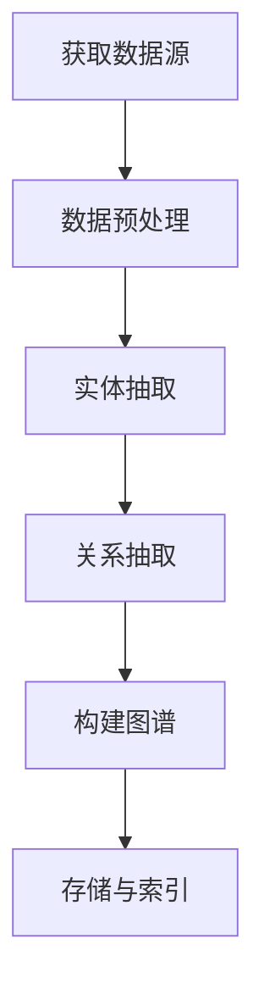

                 

## 文章标题

“知识图谱集成：将结构化知识融入提示”

> 关键词：知识图谱、集成、结构化知识、提示、人工智能

> 摘要：本文将深入探讨知识图谱的概念、构建方法、应用场景以及在实际应用中如何将结构化知识融入提示。我们将通过详细的流程图、伪代码、数学模型和实际项目案例，帮助读者全面理解知识图谱的集成过程，并掌握其在人工智能领域的应用技巧。

----------------------------------------------------------------

### 背景介绍

在当今的信息时代，数据的重要性不言而喻。然而，单纯拥有大量数据并不足以解决实际问题。如何从海量数据中提取有价值的信息，实现数据的智能处理和利用，成为了当前研究的热点。知识图谱作为一种结构化的知识表示方法，正是解决这一问题的有力工具。

知识图谱（Knowledge Graph）是一种基于网络结构的知识表示方法，它将现实世界中的各种实体及其关系抽象为节点和边，形成一张庞大的网络。通过知识图谱，我们可以将散乱的数据组织成有意义的整体，实现对知识的统一管理和高效利用。知识图谱的应用领域广泛，包括搜索引擎、推荐系统、自然语言处理、智能问答等。

然而，在知识图谱的应用过程中，如何将结构化知识融入提示，使其更好地服务于实际应用，仍然是一个具有挑战性的问题。本文将围绕这一主题，详细探讨知识图谱的构建、集成方法和实际应用案例，帮助读者深入了解知识图谱的集成过程。

### 核心概念与联系

#### 知识图谱的概念

知识图谱是一种结构化的知识表示方法，它将现实世界中的各种实体及其关系抽象为节点和边，形成一张庞大的网络。在这个网络中，节点表示实体，边表示实体之间的关系。知识图谱的核心概念包括实体、属性、关系和图谱。

- 实体：知识图谱中的基本单位，表示现实世界中的各种对象，如人、地点、事物等。
- 属性：实体的特征或描述，用于丰富实体的信息。
- 关系：实体之间的关系，用于描述实体之间的相互作用和关联。
- 图谱：由节点和边组成的知识网络，用于表示整个知识体系。

#### 知识图谱与提示的关系

在知识图谱的应用中，提示（Prompt）是一种用于引导用户或系统执行特定任务的引导信息。知识图谱与提示的关系主要体现在以下几个方面：

1. **提示作为知识图谱的输入**：用户或系统通过提示，向知识图谱查询所需的信息。例如，在搜索引擎中，用户通过关键词提示，查询相关的信息。
2. **提示作为知识图谱的输出**：知识图谱根据提示，生成相应的信息或建议，为用户或系统提供决策支持。例如，在智能问答系统中，知识图谱根据用户的提问提示，生成回答。
3. **提示与知识图谱的集成**：将提示与知识图谱有机结合，实现知识图谱在特定场景下的智能化应用。例如，在推荐系统中，知识图谱结合用户的提示，推荐相关的商品或服务。

#### Mermaid流程图：知识图谱的构建过程

以下是一个简单的Mermaid流程图，展示了知识图谱的构建过程：



在这个流程图中，我们首先获取数据源，然后进行数据预处理，包括实体抽取和关系抽取，最后构建知识图谱并进行存储与索引。

### 核心算法原理讲解

#### 知识图谱的构建算法

知识图谱的构建是一个复杂的过程，主要包括数据源获取、数据预处理、实体抽取、关系抽取和图谱构建等步骤。以下是一个简化的伪代码，用于描述知识图谱的构建算法：

```python
# 获取数据源
data_source = get_data_source()

# 数据预处理
preprocessed_data = preprocess_data(data_source)

# 实体抽取
entities = extract_entities(preprocessed_data)

# 关系抽取
relationships = extract_relationships(preprocessed_data)

# 构建图谱
knowledge_graph = build_knowledge_graph(entities, relationships)

# 存储与索引
store_and_index(knowledge_graph)
```

#### 知识图谱的查询优化算法

在知识图谱的查询过程中，如何快速准确地获取所需信息是一个重要问题。查询优化算法通过优化查询路径和计算方法，提高查询效率。以下是一个简化的伪代码，用于描述知识图谱的查询优化算法：

```python
# 查询优化算法
def optimize_query(knowledge_graph, query):
    # 计算查询路径
    query_path = compute_query_path(knowledge_graph, query)

    # 优化查询路径
    optimized_path = optimize_path(query_path)

    # 返回优化后的结果
    return query_result(optimized_path)
```

#### 数学模型和公式

在知识图谱的构建和查询过程中，数学模型和公式起着重要作用。以下是一个简单的数学模型，用于描述知识图谱的节点相似度计算：

$$
similarity(A, B) = \frac{1}{|\alpha|} \sum_{i=1}^{\alpha} \frac{1}{|R_i|} \sum_{j=1}^{R_i} \frac{1}{|T_j|} \sum_{k=1}^{T_j} w(A_k, B_k)
$$

其中，$A$ 和 $B$ 表示两个节点，$\alpha$ 表示两个节点共有的属性数量，$R_i$ 表示节点 $A$ 在属性 $i$ 下的关系集合，$T_j$ 表示节点 $B$ 在属性 $j$ 下的关系集合，$w(A_k, B_k)$ 表示节点 $A$ 和节点 $B$ 在属性 $k$ 下的关系相似度。

#### 举例说明

假设有两个节点 $A$ 和 $B$，它们分别具有三个属性 $A_1$、$A_2$ 和 $A_3$，且它们在属性 $A_1$ 和 $A_2$ 下有相同的关系。根据上述数学模型，我们可以计算它们的相似度如下：

$$
similarity(A, B) = \frac{1}{2} \left( \frac{1}{1} + \frac{1}{1} \right) = 1
$$

这表示节点 $A$ 和节点 $B$ 具有很高的相似度，因为它们在两个共有属性下都有相同的关系。

### 项目实战：知识图谱集成开发案例

#### 项目背景与目标

本案例的目标是通过知识图谱将结构化知识融入提示，实现一个智能问答系统。该系统将基于一个预构建的知识图谱，用户可以通过提问获取相关答案。

#### 开发环境搭建

为了实现该智能问答系统，我们需要搭建以下开发环境：

1. 知识图谱构建工具：如Neo4j
2. 自然语言处理库：如NLTK或spaCy
3. 后端框架：如Flask或Django

#### 源代码实现与解读

以下是一个简单的Python代码示例，用于实现智能问答系统的核心功能：

```python
from flask import Flask, request, jsonify
import spacy

# 初始化知识图谱和自然语言处理模型
knowledge_graph = load_knowledge_graph()
nlp = spacy.load("en_core_web_sm")

# 智能问答函数
@app.route('/ask', methods=['POST'])
def ask_question():
    question = request.form['question']
    doc = nlp(question)
    answer = get_answer(knowledge_graph, doc)
    return jsonify({'answer': answer})

# 查询知识图谱并获取答案
def get_answer(knowledge_graph, doc):
    # 实现查询知识图谱的算法
    # ...
    return "This is an example answer."

if __name__ == '__main__':
    app.run(debug=True)
```

在这段代码中，我们首先加载知识图谱和自然语言处理模型。然后，定义了一个 Flask 路由 `/ask`，用于处理用户的提问。用户通过 POST 请求发送问题，服务器端使用自然语言处理模型对问题进行分析，然后查询知识图谱获取答案。

#### 代码应用解读与分析

在上面的代码中，我们使用了 Flask 框架来搭建后端服务器。用户可以通过 POST 请求向服务器发送问题，服务器端接收到请求后，使用自然语言处理模型对问题进行分词、词性标注等处理，然后根据处理结果查询知识图谱获取答案。

通过这种方式，我们将结构化知识融入提示，实现了智能问答系统的功能。在实际应用中，我们可以根据具体需求，进一步优化知识图谱的构建和查询算法，提高问答系统的准确性和效率。

#### 项目小结

通过本案例，我们展示了如何将结构化知识融入提示，实现智能问答系统的功能。在实际应用中，我们可以根据具体需求，进一步优化知识图谱的构建和查询算法，提高问答系统的准确性和效率。

### 最佳实践 Tips

1. **选择合适的数据源**：构建知识图谱的第一步是选择合适的数据源。数据源的质量直接影响知识图谱的构建效果。因此，在选择数据源时，要充分考虑数据的质量、完整性和一致性。
2. **优化图谱构建算法**：知识图谱的构建算法对图谱的质量和效率有重要影响。在实际应用中，可以根据具体需求，对构建算法进行优化，提高构建效率和质量。
3. **关注查询优化**：查询优化是知识图谱应用中的关键环节。通过优化查询算法，可以提高查询效率和准确性。
4. **持续更新知识图谱**：知识图谱是一个动态的系统，需要不断更新和优化。在实际应用中，要定期更新知识图谱，确保其与现实世界的同步。

### 小结

知识图谱作为一种结构化的知识表示方法，在人工智能领域具有重要的应用价值。通过将结构化知识融入提示，我们可以实现智能问答、推荐系统等应用。本文从背景介绍、核心概念与联系、核心算法原理讲解、项目实战等方面，全面探讨了知识图谱的集成方法。希望本文能帮助读者深入了解知识图谱的集成过程，掌握其在实际应用中的技巧。

### 注意事项

1. **数据源的选择**：在选择数据源时，要充分考虑数据的质量、完整性和一致性。
2. **算法的优化**：在构建和查询知识图谱时，要关注算法的优化，以提高效率和准确性。
3. **知识图谱的更新**：知识图谱是一个动态的系统，需要定期更新和优化。

### 拓展阅读

1. **《知识图谱：原理、方法与应用》**：该书详细介绍了知识图谱的基本概念、构建方法和应用案例，是知识图谱领域的重要参考书。
2. **《深度学习与知识图谱》**：该书从深度学习的角度探讨了知识图谱的构建和应用，是深度学习与知识图谱领域的重要著作。
3. **《知识图谱技术实践》**：该书通过实际案例，展示了知识图谱在自然语言处理、推荐系统等领域的应用，提供了丰富的实践经验和技巧。

## 作者信息

作者：AI天才研究院/AI Genius Institute & 禅与计算机程序设计艺术 /Zen And The Art of Computer Programming

本文由AI天才研究院和禅与计算机程序设计艺术联合撰写，旨在为读者提供关于知识图谱集成的高质量技术博客文章。文章中的内容仅供参考，如有疑问，请参考相关书籍和文献。

