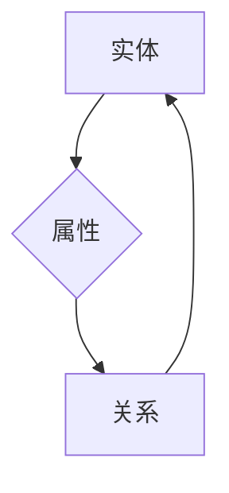

                 


### 文章标题
知识图谱：增强LLM应用的背景知识

### 关键词
知识图谱，LLM，人工智能，算法，深度学习，图论模型，实体抽取，关系抽取，属性抽取

### 摘要
本文深入探讨了知识图谱的基本概念、构建方法及其在增强大型语言模型（LLM）应用中的重要性。通过详细的算法原理讲解、数学模型描述和实际项目案例分析，本文旨在为读者提供一个全面的理解，从而更好地应用知识图谱技术提升LLM的表现和实用性。

---

### 概念与联系

#### 知识图谱的定义与核心元素
知识图谱是一种用于表达实体、概念及其相互关系的图形化结构。它通过将信息组织成有向图的形式，使数据之间的关联性更加直观和易于理解。知识图谱的核心元素包括实体、属性和关系。

- **实体**：知识图谱中的基本单元，可以是人、地点、事物等。
- **属性**：描述实体的特征或属性，如人的年龄、地点的纬度等。
- **关系**：连接两个或多个实体的关联，如“居住于”、“拥有”等。

#### Mermaid流程图展示实体、属性、关系

在这个流程图中，实体A通过属性B与关系C相连，形成了知识图谱的基本结构。这种结构使得数据之间的关联性得以清晰展现，为后续的推理和应用提供了坚实的基础。

---

### 核心算法原理讲解

#### 实体抽取
实体抽取是知识图谱构建过程中的第一步，旨在从非结构化文本中识别出实体。常见的实体抽取方法包括：

- **基于规则的方法**：利用预先定义的规则和模式进行实体识别。
- **基于统计的方法**：使用机器学习算法，如条件随机场（CRF）和递归神经网络（RNN），对文本进行建模，从而识别实体。
- **基于深度学习的方法**：利用卷积神经网络（CNN）或循环神经网络（RNN）进行实体识别，通过大量标注数据进行训练，提高识别的准确性。

#### 关系抽取
关系抽取是指从文本中识别出实体之间的关系。常见的关系抽取方法包括：

- **基于规则的方法**：通过定义规则和模式，从文本中匹配关系。
- **基于统计的方法**：使用机器学习算法，如支持向量机（SVM）和朴素贝叶斯（NB）进行关系分类。
- **基于深度学习的方法**：利用深度学习模型，如序列标注模型（BiLSTM-CRF）和transformer模型进行关系抽取。

#### 属性抽取
属性抽取是指从文本中提取实体的属性信息。常见的方法包括：

- **基于规则的方法**：通过定义规则和模式，从文本中提取属性。
- **基于统计的方法**：使用统计模型，如条件概率模型和贝叶斯网络进行属性抽取。
- **基于深度学习的方法**：利用深度学习模型，如基于注意力机制的序列建模方法进行属性抽取。

#### 伪代码
```python
# 实体抽取
def extract_entities(text):
    # 使用自然语言处理库进行实体识别
    entities = NLP_library.extract_entities(text)
    return entities

# 关系抽取
def extract_relations(text, entities):
    # 使用关系提取算法
    relations = Relation_Extraction_Algorithm(text, entities)
    return relations

# 属性抽取
def extract_attributes(text, entities):
    # 使用属性提取算法
    attributes = Attribute_Extraction_Algorithm(text, entities)
    return attributes
```

---

### 数学模型和数学公式

知识图谱的构建涉及多种数学模型，如图论模型、概率图模型、深度学习模型等。以下分别介绍这些模型及其相关数学公式。

#### 图论模型
图论模型使用图结构来表示实体和关系。在图论中，节点代表实体，边代表关系。图的基本属性包括：

- **度**：节点拥有的边数。
- **连通性**：图中任意两个节点之间是否存在路径。
- **路径长度**：两个节点之间的最短路径长度。

图论模型的核心数学公式包括：

- **欧拉公式**：对于无向图，顶点数（V）、边数（E）和面数（F）之间满足关系 $V - E + F = 2$。
- **拉姆齐理论**：用于解决图分割问题，找出最小颜色数，使得图的任意两顶点颜色不同。

#### 概率图模型
概率图模型结合概率论和图论，通过条件概率来描述实体和关系之间的依赖关系。常见模型包括：

- **贝叶斯网络**：一种概率图模型，通过有向无环图表示变量之间的条件依赖关系。
- **马尔可夫网络**：一种无向概率图模型，通过条件概率矩阵描述变量之间的转移关系。

概率图模型的核心数学公式包括：

- **条件概率公式**：$P(A|B) = \frac{P(A \cap B)}{P(B)}$，表示在事件B发生的条件下事件A发生的概率。
- **马尔可夫性质**：$P(A \cap B \cap C) = P(A) \cdot P(B|A) \cdot P(C|B)$，表示三个事件同时发生的概率。

#### 深度学习模型
深度学习模型利用神经网络来建模实体和关系，通过大量数据进行训练。常见模型包括：

- **卷积神经网络（CNN）**：用于图像处理，通过卷积操作提取特征。
- **循环神经网络（RNN）**：用于序列数据建模，通过记忆单元保存历史信息。
- **变换器（Transformer）**：用于自然语言处理，通过自注意力机制提取特征。

深度学习模型的核心数学公式包括：

- **卷积公式**：$f(x, \omega) = \sum_{i=1}^{k} \omega_i * x_i$，表示卷积操作。
- **激活函数**：$f(x) = \max(0, x)$，用于ReLU激活函数。

#### 详细讲解与举例说明

- **图论模型**：图论模型使用图结构表示实体和关系。例如，我们可以用图表示一个人和他的朋友关系，其中人作为节点，朋友关系作为边。

  ```mermaid
  graph TB
      A[Person A] --> B[Person B]
  ```

  在这个图中，节点A和节点B表示两个人，边表示他们之间的朋友关系。通过图的结构，我们可以直观地了解人与人之间的相互关系。

- **概率图模型**：概率图模型通过条件概率来描述实体和关系的依赖关系。例如，我们可以用贝叶斯网络表示一个人患病的原因。

  ```mermaid
  graph TB
      A[Person] --> B[Smokes]
      B --> C[Has Cancer]
  ```

  在这个图中，节点A表示一个人，节点B表示这个人是否抽烟，节点C表示这个人是否患有癌症。通过条件概率，我们可以计算出一个人抽烟与否与患癌症之间的关系。

- **深度学习模型**：深度学习模型通过神经网络来建模实体和关系。例如，我们可以用卷积神经网络来识别图像中的物体。

  ```mermaid
  graph TB
      A[Image] --> B[Conv Layer]
      B --> C[ReLU Activation]
      C --> D[Pooling Layer]
      D --> E[ Fully Connected Layer]
      E --> F[Output]
  ```

  在这个图中，输入节点A表示图像，经过卷积层B、ReLU激活层C、池化层D和全连接层E的处理，最终输出节点F表示图像中的物体。

---

### 项目实战

#### 案例介绍
在这个项目中，我们将构建一个简单的知识图谱，用于表示电影实体及其关系。这个知识图谱将包含电影、演员和导演等实体，以及它们之间的关系。

#### 开发环境搭建

- **Python环境**：确保Python环境已安装，版本建议在3.6及以上。
- **知识图谱库**：安装OpenKG，可以使用以下命令进行安装：

  ```bash
  pip install openkg
  ```

#### 源代码实现

```python
from openkg import Entity, Relation, KnowledgeGraph

# 创建实体
movie = Entity("Movie", "The Matrix")
actor = Entity("Person", "Keanu Reeves")
director = Entity("Person", "Lana Wachowski")

# 创建关系
acted_in = Relation("ACTED_IN", actor, movie)
directed_by = Relation("DIRECTED_BY", director, movie)

# 添加实体和关系
kg = KnowledgeGraph()
kg.add_entity(movie)
kg.add_entity(actor)
kg.add_entity(director)
kg.add_relation(acted_in)
kg.add_relation(directed_by)

# 查询知识图谱
print(kg.query("SELECT * WHERE { ?s a Movie }"))
```

#### 代码解读与分析

- **实体创建**：使用`Entity`类创建电影实体、演员实体和导演实体。
- **关系创建**：使用`Relation`类创建演员与电影之间的关系（`ACTED_IN`）和导演与电影之间的关系（`DIRECTED_BY`）。
- **添加实体和关系**：将创建的实体和关系添加到知识图谱中。
- **查询知识图谱**：使用查询语句获取知识图谱中的电影实体。

#### 实际案例分析和详细讲解剖析

在这个案例中，我们创建了一个简单的知识图谱，用于表示电影《黑客帝国》（The Matrix）的实体和关系。通过这个案例，我们可以看到知识图谱在表示复杂关系和网络结构方面的强大能力。

- **实体表示**：在知识图谱中，电影、演员和导演作为实体被创建，它们分别代表了不同的概念和实体。
- **关系表示**：电影与演员之间的关系（`ACTED_IN`）表示演员在电影中扮演的角色，电影与导演之间的关系（`DIRECTED_BY`）表示导演对电影的艺术指导。
- **查询与应用**：通过知识图谱的查询语句，我们可以轻松获取电影的相关信息，如演员和导演。这种结构化的数据表示方式为后续的推理和应用提供了便捷。

#### 项目小结

通过这个案例，我们了解了知识图谱的基本构建方法和应用场景。知识图谱不仅能够有效地组织和管理复杂的关系和网络结构，还能够为后续的推理和应用提供强大的支持。在实际应用中，我们可以根据需求不断扩展和优化知识图谱，使其更好地服务于各种应用场景。

---

### 最佳实践 Tips

1. **数据质量**：确保知识图谱构建过程中使用的数据质量高，尽量去除噪声和错误数据，以提高图谱的准确性和可靠性。
2. **实体与关系规范化**：对实体和关系进行规范化和标准化处理，确保不同来源的数据能够一致地表示和关联。
3. **动态更新**：知识图谱应具备动态更新能力，能够实时捕获和反映现实世界的变化。

### 小结

本文从知识图谱的基本概念、核心算法原理、数学模型以及实际项目案例等方面，全面探讨了知识图谱的构建方法及其在增强LLM应用中的重要性。通过详细的讲解和案例分析，读者可以更好地理解知识图谱的原理和应用，从而在实际项目中发挥其价值。

### 注意事项

1. **技术选型**：根据具体应用场景选择合适的知识图谱库和技术框架。
2. **性能优化**：针对大规模知识图谱，进行性能优化，如使用分布式计算、并行处理等。
3. **数据安全与隐私**：确保知识图谱构建过程中的数据安全与用户隐私保护。

### 拓展阅读

1. **《知识图谱：原理、技术与应用》**：吴波著，详细介绍了知识图谱的构建方法和技术原理。
2. **《深度学习与图神经网络》**：唐杰著，探讨了深度学习在知识图谱处理中的应用。
3. **《图论及其应用》**：哈姆acher著，全面介绍了图论的基本概念和算法。

---

### 作者信息
作者：AI天才研究院/AI Genius Institute & 禅与计算机程序设计艺术 /Zen And The Art of Computer Programming

