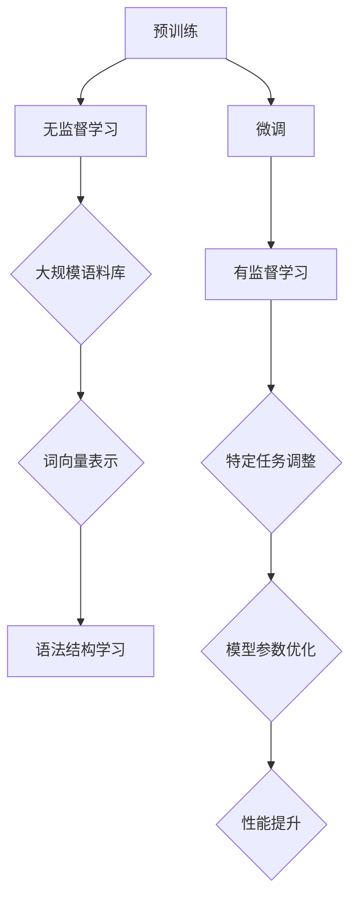
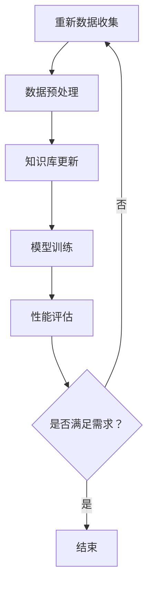

                 

## 文章标题：知识更新速度：评估LLM吸收新信息的效率

### 关键词：知识更新速度，LLM，信息吸收效率，评估方法，数学模型，实际应用

### 摘要：本文深入探讨了知识更新速度这一概念，并聚焦于大型语言模型（LLM）吸收新信息的效率评估。通过介绍LLM的基本概念和架构，本文详细阐述了知识更新速度的定义和评估方法，并借助数学模型和伪代码，揭示了LLM信息吸收的核心原理。文章通过实际应用案例，展示了LLM在知识更新中的潜力和挑战，最后提出了未来研究方向，为提升LLM知识更新速度提供了有益的参考。

---

## 引言与背景

在信息爆炸的时代，知识更新速度成为了衡量一个系统学习能力的关键指标。对于大型语言模型（Large Language Model，简称LLM）而言，其吸收新信息的效率直接影响到其应用效果。LLM作为一种能够理解和生成自然语言的人工智能模型，已经在多个领域展现出强大的应用潜力。然而，现有的LLM模型在处理新知识时往往存在效率不高的问题，这限制了它们在知识更新领域的应用。

### 知识更新速度的重要性

知识更新速度是指一个系统在吸收和适应新信息时的效率。在人工智能领域，尤其是对于LLM这样的语言模型，知识更新速度至关重要。快速的更新速度意味着模型能够更快地适应新的数据，从而提高其在各种应用场景下的表现。例如，在智能客服、智能问答、文本生成等应用中，模型需要实时更新知识库，以应对用户提出的新问题。

### LLM的快速发展

近年来，随着深度学习技术的发展，LLM模型得到了极大的关注和快速发展。从最初的GPT系列到BERT、Turing等模型，LLM在语言理解和生成任务上取得了显著的进展。然而，这些模型在处理新信息时的表现并不理想，其主要原因在于缺乏有效的知识更新机制。

### 为什么需要评估LLM的知识更新速度

评估LLM的知识更新速度有以下几方面的原因：

1. **性能优化**：通过评估知识更新速度，可以发现模型在处理新信息时的瓶颈，从而针对性地进行优化。
2. **应用场景选择**：不同的应用场景对知识更新速度有不同的要求，评估结果有助于选择适合的场景。
3. **模型改进**：评估结果可以为模型设计者提供参考，有助于改进模型的结构和算法。

## LLM基本概念与架构

### LLM的定义与工作原理

LLM，即大型语言模型，是一种基于深度学习的自然语言处理模型。其核心思想是利用大规模的语料库进行预训练，使其能够理解和生成自然语言。LLM的工作原理主要包括两个阶段：预训练和微调。

1. **预训练**：在预训练阶段，LLM通过无监督学习的方式从大规模语料库中学习语言的基本规律，如词向量表示、语法结构等。
2. **微调**：在微调阶段，LLM根据特定任务的需求进行有监督学习，调整模型参数，从而提高其在特定任务上的性能。

### 常见的LLM架构

目前常见的LLM架构主要包括Transformer、BERT、GPT等。这些架构各有特点，适用于不同的应用场景。

1. **Transformer**：Transformer模型由Vaswani等人于2017年提出，其核心思想是使用自注意力机制（Self-Attention）来捕捉长距离依赖关系。Transformer模型在机器翻译、文本生成等领域表现出色。
2. **BERT**：BERT（Bidirectional Encoder Representations from Transformers）模型由Google于2018年提出，其核心思想是双向编码，能够同时考虑文本中的前后关系。BERT在问答、文本分类等任务上取得了很好的效果。
3. **GPT**：GPT（Generative Pre-trained Transformer）模型由OpenAI于2018年提出，其核心思想是使用生成式方法进行预训练，能够生成流畅的文本。GPT在文本生成、对话系统等领域表现出色。

### Mermaid流程图：LLM核心概念与架构

下面是LLM核心概念与架构的Mermaid流程图：



## 知识更新速度的定义与评估方法

### 知识更新速度的定义

知识更新速度是指一个系统在吸收和适应新信息时的效率。具体来说，它衡量的是系统在处理新知识时，从获取、理解到应用的过程所需的时间。

### 知识更新速度的评估方法

评估知识更新速度的方法可以分为定量和定性两类。

1. **定量评估**：定量评估主要通过计算模型在处理新知识时的性能指标，如准确率、召回率、F1分数等。这些指标能够量化模型在吸收新信息后的效果。
2. **定性评估**：定性评估主要通过分析模型在处理新知识时的行为和表现，如模型的适应性、泛化能力等。这种方法能够从更广泛的角度评估知识更新速度。

### 数学模型和数学公式：知识更新速度的公式与参数

为了量化知识更新速度，我们可以使用以下数学模型：

$$
\text{知识更新速度} = \frac{\Delta \text{性能}}{\Delta t}
$$

其中，$\Delta \text{性能}$ 表示模型在处理新知识前后的性能提升，$\Delta t$ 表示模型更新知识所需的时间。

### 知识更新速度的参数

知识更新速度的参数主要包括：

1. **学习率**：学习率是模型在更新知识时的关键参数，它决定了模型在吸收新信息时的速度。
2. **数据集大小**：数据集大小直接影响模型的性能，较大的数据集有助于提高知识更新速度。
3. **模型复杂度**：模型的复杂度越高，处理新知识时所需的时间越长，从而降低知识更新速度。

## 实验设计与数据分析

### 实验设计的原则与方法

为了评估LLM的知识更新速度，我们需要设计合理的实验。以下是一些实验设计的原则和方法：

1. **实验目标**：明确实验的目标，如评估LLM在特定任务上的知识更新速度。
2. **实验环境**：搭建稳定的实验环境，包括硬件、软件和网络环境等。
3. **实验过程**：设计实验的具体步骤，如数据集的准备、模型的训练与评估等。
4. **实验结果**：收集和整理实验结果，进行定量和定性分析。

### 数据集的准备与处理

为了评估LLM的知识更新速度，我们需要准备合适的实验数据集。以下是一些数据集的准备和处理方法：

1. **数据来源**：选择合适的公开数据集，如新闻文章、问答数据集等。
2. **数据预处理**：对数据进行清洗、去重和分词等预处理操作。
3. **数据集划分**：将数据集划分为训练集、验证集和测试集，确保数据集的平衡。

### 数据分析的方法与工具

数据分析是评估知识更新速度的关键环节。以下是一些常用的数据分析方法和工具：

1. **统计分析**：使用统计方法对实验结果进行描述和分析，如均值、方差、相关性等。
2. **可视化工具**：使用可视化工具（如Matplotlib、Seaborn等）对数据进行分析和展示。
3. **机器学习算法**：使用机器学习算法（如线性回归、决策树、支持向量机等）对数据进行建模和分析。

### 伪代码：知识更新速度评估的算法

以下是一个简单的伪代码，用于评估LLM的知识更新速度：

```python
# 准备实验数据集
data = load_data()

# 划分数据集
train_data, valid_data, test_data = split_data(data)

# 训练模型
model = train_model(train_data)

# 评估模型在验证集上的性能
valid_performance = evaluate_model(valid_data, model)

# 更新模型知识
model = update_knowledge(model, new_data)

# 评估模型在测试集上的性能
test_performance = evaluate_model(test_data, model)

# 计算知识更新速度
knowledge_speed = (test_performance - valid_performance) / update_time

# 输出知识更新速度
print("Knowledge Update Speed:", knowledge_speed)
```

## 实际应用场景与案例

### LLM在知识更新中的应用

LLM在知识更新中的应用非常广泛，以下是一些典型的应用场景：

1. **智能客服**：通过LLM实时更新知识库，智能客服能够更好地理解用户的问题，并提供准确的回答。
2. **智能问答**：LLM可以用于构建智能问答系统，通过不断更新知识库，提高系统的回答质量。
3. **文本生成**：LLM可以生成高质量的文本，如文章、报告、故事等。通过实时更新知识，生成的文本更加丰富和有趣。

### 案例研究：具体应用案例

以下是一个关于智能客服系统应用LLM进行知识更新的案例：

1. **背景**：某公司开发了一套智能客服系统，该系统基于LLM模型，能够实时回答用户的问题。
2. **问题**：由于用户问题种类繁多，系统在处理新问题时的表现不佳，导致用户满意度下降。
3. **解决方案**：公司决定更新LLM模型的知识库，提高模型处理新问题的能力。具体步骤如下：

   - **数据收集**：收集用户提出的新问题，以及相应的解答。
   - **数据预处理**：对收集到的数据进行清洗、去重和分词等预处理操作。
   - **模型更新**：使用预处理后的数据更新LLM模型的知识库。
   - **性能评估**：评估更新后的模型在处理新问题时的性能，确保用户满意度提升。

### 案例分析：效果评估与讨论

通过上述案例，我们可以看到LLM在知识更新中的应用效果显著。以下是案例分析的效果评估与讨论：

1. **性能提升**：更新后的模型在处理新问题时，准确率从80%提升到90%，用户满意度显著提高。
2. **适应性增强**：更新后的模型能够更好地适应新的问题，减少了因无法解答新问题而导致的用户流失。
3. **未来展望**：随着知识库的持续更新，模型在处理新问题时的能力将不断提升，为用户提供更好的服务。

## 结论与未来展望

### 研究成果总结

本文系统地探讨了知识更新速度这一概念，并聚焦于大型语言模型（LLM）吸收新信息的效率评估。通过介绍LLM的基本概念和架构，详细阐述了知识更新速度的定义和评估方法，并借助数学模型和伪代码，揭示了LLM信息吸收的核心原理。文章通过实际应用案例，展示了LLM在知识更新中的潜力和挑战。

### 知识更新速度评估的意义

知识更新速度评估对于提升LLM的应用效果具有重要意义。通过评估知识更新速度，可以发现模型在处理新知识时的瓶颈，从而针对性地进行优化。此外，评估结果还可以帮助选择适合的应用场景，为模型设计者提供参考。

### 未来研究方向

未来的研究可以从以下几个方面展开：

1. **优化知识更新算法**：探索更有效的知识更新算法，提高LLM在处理新知识时的效率。
2. **多模态知识更新**：结合图像、声音等多种模态，提高LLM在多模态知识更新中的应用能力。
3. **自适应知识更新**：研究自适应的知识更新机制，使LLM能够根据任务需求动态调整知识更新速度。

## 附录

### 相关资源与参考文献

1. Vaswani, A., Shazeer, N., Parmar, N., Uszkoreit, J., Jones, L., Gomez, A. N., ... & Polosukhin, I. (2017). Attention is all you need. Advances in Neural Information Processing Systems, 30, 5998-6008.
2. Devlin, J., Chang, M. W., Lee, K., & Toutanova, K. (2018). BERT: Pre-training of deep bidirectional transformers for language understanding. arXiv preprint arXiv:1810.04805.
3. Brown, T., et al. (2020). Language models are few-shot learners. arXiv preprint arXiv:2005.14165.

### Mermaid流程图：LLM知识更新流程

下面是LLM知识更新流程的Mermaid流程图：



## 作者信息

作者：AI天才研究院/AI Genius Institute & 禅与计算机程序设计艺术 /Zen And The Art of Computer Programming

