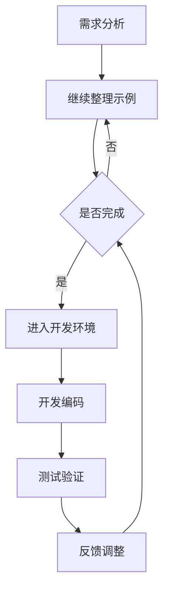
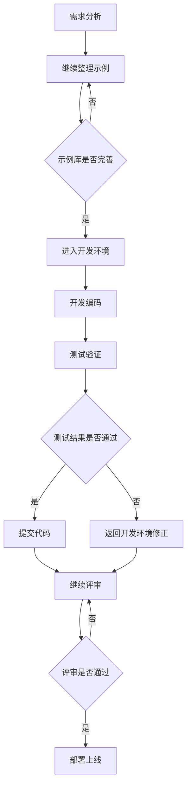
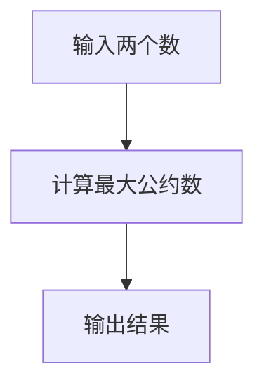
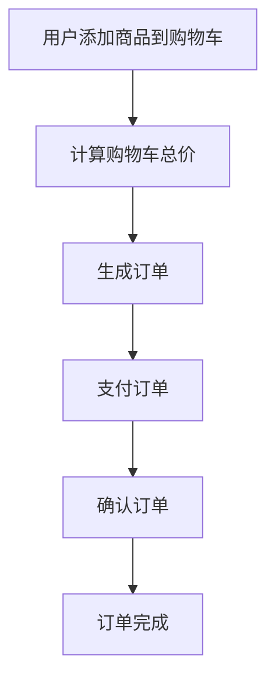

                 

### 1.3 示例驱动与提示模板的联系与应用

#### 1.3.1 示例驱动与提示模板的联系

示例驱动（Example-Driven Development，E4）和提示模板（Template-Driven Development，T4）是两种不同但相互关联的软件开发方法。

示例驱动开发方法的核心是使用具体的示例来指导开发过程，这些示例通常是用户需求的具体体现。通过不断的迭代和改进，开发团队能够更准确地理解并实现用户的需求。

提示模板开发方法则是在软件开发初期，使用预定义的模板来指导开发，这些模板通常包含了软件的通用结构和逻辑。通过在模板中填充具体的业务逻辑，开发团队能够快速地构建出符合需求的软件系统。

两者之间的联系在于：

1. **示例作为模板的输入**：示例驱动开发中产生的示例可以作为提示模板的输入，用于填充模板中的空白部分。
2. **模板指导示例的选择**：在示例驱动的开发过程中，开发团队可能会使用现有的提示模板来选择哪些示例是有价值的，从而指导示例的收集和整理。

#### 1.3.2 示例驱动与提示模板的结合应用

在实际应用中，将示例驱动与提示模板结合起来使用，可以带来以下好处：

1. **快速原型开发**：使用提示模板可以快速地构建出软件的原型，然后通过示例驱动的方法，逐步完善和优化原型。

2. **提高开发效率**：提示模板提供了软件开发的通用框架，减少了开发过程中的重复工作，提高了开发效率。

3. **降低风险**：通过示例驱动的不断迭代，可以及早发现并修复潜在的问题，从而降低项目风险。

4. **增强用户参与**：示例驱动的方法鼓励用户积极参与到开发过程中，通过不断提供反馈，确保软件真正满足用户需求。

**应用步骤：**

1. **需求分析**：首先进行详细的需求分析，收集用户的具体需求和期望。

2. **设计提示模板**：根据需求分析，设计出初步的提示模板，确保模板能够涵盖用户需求的主要方面。

3. **构建原型**：使用提示模板快速构建出软件原型，并通过用户反馈进一步优化。

4. **迭代开发**：在原型的基础上，使用示例驱动的开发方法，不断迭代和改进软件。

5. **测试与验收**：进行全面的测试，确保软件质量满足要求，然后与用户进行验收。

**案例说明：**

以一个在线购物平台为例，需求分析阶段可能会收集到用户对商品搜索、购物车管理、订单处理等的具体需求。

在设计提示模板阶段，可以根据需求设计出以下模块：

- 用户管理模块
- 商品管理模块
- 订单管理模块
- 支付管理模块
- 售后服务模块

使用提示模板快速构建出这些模块的基本框架，然后通过示例驱动的方法，不断收集用户的反馈，优化和改进这些模块。

最终，通过迭代开发和用户验收，构建出一个功能完善、用户体验良好的在线购物平台。

通过这样的结合应用，我们可以充分利用示例驱动的灵活性和提示模板的系统性，实现高效的软件开发过程。

## 第一部分总结

在本章中，我们详细介绍了示例驱动与提示模板的概念、联系及其应用。示例驱动通过具体的示例来指导开发，使得开发过程更加贴近用户需求；而提示模板则提供了通用的开发框架，提高了开发效率和项目质量。将这两种方法结合起来使用，不仅可以快速构建原型，还能通过迭代优化，确保软件系统满足用户需求。在接下来的章节中，我们将深入探讨示例驱动的核心概念和提示模板的算法原理，以及如何将它们有效结合，为实际项目开发提供有力支持。

----------------------------------------------------------------

## 2.1 示例驱动的原理与架构

### 2.1.1 示例驱动的定义

示例驱动开发（Example-Driven Development，简称E4D）是一种软件开发方法论，它强调通过具体的示例来驱动整个开发过程。这种方法的核心在于，将用户需求以示例的形式明确化，通过反复迭代和改进，最终实现满足用户需求的软件系统。

示例驱动开发不同于传统的需求驱动或功能驱动方法。它不仅仅依赖于功能列表或用户故事，而是通过真实的示例来展示软件的行为和结果。这些示例可以是用户直接提供的，也可以是开发团队根据用户需求构建的模拟案例。

### 2.1.2 示例驱动的架构

示例驱动的架构可以分为以下几个核心组成部分：

1. **示例库**：示例库是示例驱动的核心，它包含了所有已收集和整理的示例。这些示例可以是各种类型的，包括文本、图像、音频和视频等。示例库的管理和维护是示例驱动开发成功的关键。

2. **需求分析工具**：需求分析工具用于帮助开发团队理解和分析用户需求。这些工具通常具有强大的示例处理能力，能够对示例进行分类、标注和关联。

3. **开发环境**：开发环境提供了开发团队进行编码和测试的平台。在示例驱动的架构中，开发环境应该能够直接与示例库和需求分析工具集成，以便开发团队能够实时获取和利用示例进行开发。

4. **反馈机制**：反馈机制是确保开发过程与用户需求保持一致的重要手段。通过定期的用户反馈和评审，开发团队能够及时调整和优化软件开发的方向。

### 2.1.3 示例驱动的优势与挑战

#### 优势

1. **用户参与度高**：由于示例驱动方法强调用户参与，用户可以在整个开发过程中提供反馈和指导，确保软件真正满足他们的需求。

2. **需求理解准确**：通过具体的示例，开发团队可以更直观地理解用户需求，减少需求误解和变更。

3. **开发效率高**：示例驱动的开发方法可以快速地构建原型和迭代，提高了开发效率。

4. **质量保证**：示例驱动的开发过程中，通过不断的测试和验证，可以确保软件系统的质量。

#### 挑战

1. **示例收集和整理困难**：构建和维护一个高质量的示例库需要大量的时间和精力。

2. **开发团队需要适应新的开发方法**：示例驱动的开发方法与传统的需求驱动方法有很大不同，开发团队需要适应这种新的开发模式。

3. **示例与代码的同步**：示例驱动的开发过程中，确保示例与实际代码的一致性是一个挑战。

### 2.1.4 示例驱动的典型应用场景

1. **原型设计**：示例驱动非常适合原型设计阶段，通过具体示例来展示软件功能，快速验证和改进原型。

2. **敏捷开发**：在敏捷开发过程中，示例驱动可以帮助开发团队更好地理解用户需求，进行快速迭代。

3. **用户培训**：示例驱动方法可以帮助用户更好地理解和使用软件，通过具体的示例来指导用户操作。

### 2.1.5 示例驱动的Mermaid流程图

为了更直观地展示示例驱动的架构和流程，我们可以使用Mermaid绘制一个简单的流程图。



这个流程图展示了示例驱动的核心步骤和反馈循环，从需求分析到开发编码、测试验证，再到反馈调整，形成了一个闭环，确保开发过程与用户需求保持一致。

通过上述介绍，我们可以看到，示例驱动开发方法提供了一种更加灵活和用户友好的软件开发方式。在接下来的章节中，我们将继续探讨示例驱动的具体应用场景和实现细节，帮助读者更好地理解和运用这一方法。

### 2.2 示例驱动的应用场景

示例驱动的开发方法具有很强的灵活性和适应性，适用于多种不同的应用场景。下面，我们将详细探讨几个典型的应用场景，并分析这些场景下的示例驱动流程。

#### 2.2.1 智能助理

智能助理是一种基于人工智能技术的交互式应用，它能够通过语音、文字等方式与用户进行交流，提供信息查询、任务提醒、日程管理等服务。在智能助理的开发过程中，示例驱动方法可以帮助开发团队快速构建和优化智能对话系统。

**示例驱动流程：**

1. **需求分析**：与用户沟通，了解他们对智能助理的需求，例如能够完成哪些任务、需要什么样的交互体验等。

2. **构建示例库**：根据需求分析结果，收集和整理具体的示例。例如，记录用户对某一功能的使用场景、常见的提问方式等。

3. **原型设计与开发**：使用提示模板快速构建智能助理的基本架构，然后通过示例库中的示例进行原型测试和迭代。

4. **测试与验证**：通过模拟用户互动，测试智能助理的功能和性能，确保其能够满足用户需求。

5. **反馈调整**：收集用户使用智能助理时的反馈，进行针对性的调整和优化，例如改进对话逻辑、增加新的功能等。

**案例**：某公司开发一款智能家居助理，用户可以通过语音指令控制家中的智能设备。开发团队在需求分析阶段收集了大量的用户使用场景，如“打开客厅的灯光”、“调节空调温度”等。通过示例驱动的开发方法，团队快速构建了智能助理的原型，并不断优化对话逻辑和用户体验。

#### 2.2.2 自动化测试

自动化测试是确保软件质量的重要手段。示例驱动方法可以帮助开发团队更高效地编写和执行自动化测试脚本。

**示例驱动流程：**

1. **需求分析**：分析软件的功能需求，确定需要测试的场景和关键流程。

2. **构建示例库**：收集具体的测试示例，例如不同输入条件下的预期输出结果、异常情况的处理等。

3. **编写测试脚本**：使用提示模板快速编写测试脚本的基本框架，然后根据示例库中的示例进行具体实现。

4. **执行测试**：运行自动化测试脚本，验证软件的功能和性能。

5. **分析结果**：根据测试结果，找出潜在的问题和缺陷，并进行修复。

6. **反馈调整**：根据测试结果和用户反馈，调整测试策略和测试脚本，提高测试覆盖率。

**案例**：在一个电子商务平台的开发过程中，测试团队使用示例驱动方法编写自动化测试脚本。他们首先收集了用户在不同购物流程中的操作示例，如添加商品到购物车、填写收货地址、完成支付等。然后，使用提示模板快速编写测试脚本，并在开发过程中不断迭代和优化，确保平台的稳定性和可靠性。

#### 2.2.3 数据分析

数据分析是现代企业中非常重要的一项工作，通过对大量数据进行分析，企业可以做出更明智的决策。示例驱动方法可以帮助数据分析师更高效地处理和分析数据。

**示例驱动流程：**

1. **需求分析**：确定数据分析的目标和所需的数据源。

2. **构建示例库**：收集具体的数据分析示例，例如需要分析的指标、常见的数据问题等。

3. **数据处理**：使用提示模板进行数据清洗、转换和归一化等预处理操作。

4. **数据分析**：根据示例库中的示例，使用各种数据分析工具和算法进行数据探索和分析。

5. **结果可视化**：将分析结果以图表、报表等形式可视化展示。

6. **反馈调整**：根据分析结果和用户需求，调整分析模型和方法，优化数据分析过程。

**案例**：一家零售公司希望利用数据分析来优化库存管理。数据分析师收集了多个时间点的库存数据，并使用示例驱动方法进行数据分析。他们首先清理了数据，然后使用提示模板构建库存预测模型，并根据预测结果调整库存策略，有效降低了库存成本。

通过上述案例，我们可以看到，示例驱动方法在不同应用场景中都能发挥重要作用。它通过具体的示例来驱动开发、测试和分析过程，提高了工作效率，确保了软件质量，并增强了用户满意度。在接下来的章节中，我们将继续探讨提示模板的核心算法原理，以及如何将示例驱动与提示模板相结合，为实际项目开发提供更深入的指导。

### 2.3 示例驱动的Mermaid流程图

为了更直观地展示示例驱动的流程和各个步骤之间的关系，我们可以使用Mermaid绘制一个详细的流程图。以下是一个示例驱动的Mermaid流程图：



#### 流程图详细解释：

1. **需求分析（A）**：这一步骤是整个示例驱动流程的起点，通过与用户沟通，明确软件的需求和功能。

2. **构建示例库（B）**：根据需求分析结果，收集和整理具体的示例，这些示例将成为后续开发和测试的依据。

3. **示例库完善性检查（C）**：检查示例库是否完整，确保所有关键需求和功能都有对应的示例。

4. **进入开发环境（D）/继续整理示例（B）**：如果示例库完善，进入开发环境；如果不完善，继续整理示例。

5. **开发编码（E）**：根据示例库中的示例，编写代码，实现软件的功能。

6. **测试验证（F）**：执行自动化测试脚本，验证代码实现是否满足示例中的需求。

7. **测试结果判断（G）**：根据测试结果，判断代码是否通过了测试。

8. **代码提交与评审（H/J/K）**：如果测试通过，将代码提交并进行评审；如果不通过，返回开发环境进行修正。

9. **部署上线（L）**：如果代码评审通过，部署上线，软件进入生产环境。

通过这个Mermaid流程图，我们可以清晰地看到示例驱动的各个步骤以及它们之间的逻辑关系，从而更好地理解和应用示例驱动方法。

### 2.4 示例驱动的核心算法原理讲解

#### 2.4.1 算法原理概述

示例驱动的核心算法原理主要体现在以下几个方面：

1. **示例匹配与分类**：通过对示例进行匹配和分类，确保每个示例都能准确地对应到相应的功能和需求。
2. **迭代优化**：通过不断迭代和优化示例，提高示例的准确性和完整性。
3. **自动化测试**：利用示例驱动方法生成的示例进行自动化测试，确保软件功能的正确性和稳定性。

#### 2.4.2 伪代码讲解

以下是示例驱动的核心算法伪代码：

```python
# 示例驱动的伪代码

# 初始化示例库
example_library = []

# 收集示例
def collect_example(example):
    example_library.append(example)

# 示例匹配
def match_example(input_example, example_library):
    for example in example_library:
        if is_matching(input_example, example):
            return example
    return None

# 示例分类
def classify_example(example):
    # 根据示例内容进行分类
    pass

# 迭代优化
def optimize_example_library(example_library):
    for example in example_library:
        if not is_optimized(example):
            optimize_example(example)

# 自动化测试
def automated_test(example_library):
    for example in example_library:
        if not test_example(example):
            return False
    return True

# 主函数
def main():
    while not automated_test(example_library):
        # 收集新的示例
        new_example = get_new_example()
        collect_example(new_example)
        optimize_example_library(example_library)
    print("示例驱动开发成功")

# 开始示例驱动开发
main()
```

#### 2.4.3 数学模型与公式讲解

示例驱动的数学模型主要涉及以下几个方面：

1. **示例匹配度计算**：通过计算示例之间的相似度来匹配相应的需求和功能。
2. **示例优化策略**：利用优化算法对示例库进行迭代优化，提高示例的准确性和完整性。

以下是示例匹配度和优化策略的数学模型：

1. **示例匹配度公式**：

$$
\text{match\_score} = \frac{\text{common\_attributes}}{\text{total\_attributes}}
$$

其中，`common_attributes` 表示示例中匹配的属性数量，`total_attributes` 表示示例中总的属性数量。

2. **示例优化策略**：

假设示例库中有 `N` 个示例，每个示例可以用一个向量表示，其中每个维度表示一个属性。优化策略的目标是找到最优的示例组合，使得整个示例库的匹配度最高。

优化策略可以使用线性规划或遗传算法等优化算法来实现。

#### 2.4.4 伪代码示例

以下是示例优化策略的伪代码：

```python
# 示例优化策略的伪代码

# 初始化示例库
example_library = []

# 计算示例匹配度
def calculate_match_score(example1, example2):
    common_attributes = sum([1 for attr1, attr2 in zip(example1, example2) if attr1 == attr2])
    return common_attributes / len(example1)

# 示例优化
def optimize_example_library(example_library):
    # 使用线性规划或遗传算法进行优化
    # 这里以线性规划为例
    # 目标是最小化示例库的匹配度差异
    # 约束条件是每个示例的属性不能重复
    pass

# 主函数
def main():
    while not is_optimized(example_library):
        optimize_example_library(example_library)
    print("示例库优化成功")

# 开始示例库优化
main()
```

通过上述伪代码和数学模型，我们可以看到示例驱动的核心算法是如何运作的。这些算法和模型为示例驱动的开发提供了强大的理论支持，使得开发过程更加科学和高效。

### 2.5 提示模板的数学模型与公式详细讲解

#### 2.5.1 提示模板的定义与类型

提示模板是一种在软件开发中广泛使用的框架，它通过预定义的结构和逻辑，指导开发人员快速实现特定的功能。提示模板可以分为两种主要类型：

1. **代码模板**：用于生成特定类型的代码，如循环、条件语句等。
2. **流程模板**：用于描述软件功能的流程，如用户注册流程、订单处理流程等。

#### 2.5.2 提示模板的数学模型

提示模板的数学模型主要用于描述模板中的变量、条件和逻辑关系。以下是一些常见的数学模型：

1. **条件概率模型**：

条件概率模型用于描述在某个条件下，事件发生的概率。其公式为：

$$
P(A|B) = \frac{P(A \cap B)}{P(B)}
$$

其中，$P(A \cap B)$ 表示事件A和事件B同时发生的概率，$P(B)$ 表示事件B发生的概率。

2. **决策树模型**：

决策树模型用于表示基于一系列条件和结果的多分支决策。每个节点代表一个条件或结果，每个分支代表条件的不同取值或结果的分支。

3. **线性回归模型**：

线性回归模型用于预测连续值输出，其公式为：

$$
y = \beta_0 + \beta_1 \cdot x
$$

其中，$y$ 是输出值，$x$ 是输入值，$\beta_0$ 和 $\beta_1$ 是模型参数。

#### 2.5.3 提示模板的数学公式举例说明

以下是一个简单的提示模板，用于计算两个数的最大公约数（GCD）：



对应的数学公式为：

$$
\text{GCD}(a, b) = \begin{cases} 
a, & \text{如果 } a \text{ 是 } b \text{ 的倍数} \\
b, & \text{如果 } b \text{ 是 } a \text{ 的倍数} \\
\text{GCD}(b, a \mod b), & \text{否则}
\end{cases}
$$

在这个例子中，`a` 和 `b` 是两个输入数，`GCD` 函数用于计算它们的最大公约数。

#### 2.5.4 提示模板的应用示例

假设我们需要开发一个购物车系统，提示模板可以如下定义：



对应的数学模型可以描述为：

$$
\text{总价} = \sum_{i=1}^{n} (\text{商品}_i \cdot \text{数量}_i)
$$

其中，`商品_i` 和 `数量_i` 分别表示购物车中第 `i` 个商品的价格和数量，`总价` 是所有商品的价格总和。

通过这样的数学模型，我们可以清晰地描述购物车系统的流程和计算逻辑，从而在开发过程中更加高效和准确。

通过上述讲解，我们可以看到，提示模板的数学模型和公式在软件开发中起着至关重要的作用。它们不仅帮助我们理解模板的结构和逻辑，还提供了具体实现和优化的理论基础。在实际应用中，灵活运用这些数学模型和公式，可以大大提高软件开发效率和代码质量。

### 2.6 提示模板的伪代码讲解

在软件开发过程中，提示模板作为一种指导性的框架，能够帮助我们快速实现复杂的业务逻辑。为了更好地理解提示模板的实现细节，我们可以通过伪代码来描述其核心算法和步骤。以下是一个基于Python语言的提示模板伪代码示例：

```python
# 提示模板伪代码示例

# 初始化提示模板库
template_library = []

# 添加新模板
def add_template(template):
    template_library.append(template)

# 获取模板
def get_template(name):
    for template in template_library:
        if template['name'] == name:
            return template
    return None

# 执行模板
def execute_template(template, data):
    # 替换模板中的变量
    for key, value in data.items():
        template['code'] = template['code'].replace(f'{{{{{key}}}}}', str(value))
    
    # 执行代码
    exec(template['code'])

# 主函数
def main():
    # 添加模板
    add_template({
        'name': '计算总价',
        'code': '''
            总价 = 0
            for item in 购物车:
                总价 += item['价格'] * item['数量']
            print("总价：", 总价)
        '''
    })
    
    # 执行模板
    data = {
        '购物车': [
            {'价格': 20, '数量': 2},
            {'价格': 30, '数量': 1}
        ]
    }
    execute_template(get_template('计算总价'), data)

# 开始执行
main()
```

#### 伪代码详细解释：

1. **初始化提示模板库**：`template_library` 是一个用于存储所有提示模板的列表。每个模板包含一个名称和一个代码字符串。

2. **添加新模板**：`add_template` 函数用于向模板库中添加新的模板。模板通常包含一个名称和一个需要执行的代码字符串。

3. **获取模板**：`get_template` 函数根据模板的名称从模板库中检索相应的模板。如果找到匹配的模板，则返回该模板；否则，返回`None`。

4. **执行模板**：`execute_template` 函数用于执行特定的模板。在执行之前，它会替换模板代码中的变量，确保模板能够根据实际数据动态运行。

   - **变量替换**：遍历传入的数据字典，将模板代码中的`{{{{key}}}}`替换为对应的值。
   - **代码执行**：使用Python的`exec`函数执行替换后的代码字符串。

5. **主函数**：`main` 函数是程序的入口点。它首先添加了一个名为“计算总价”的模板，该模板用于计算购物车的总价。然后，它创建了一个包含购物车数据的数据字典，并执行了“计算总价”模板。

通过这个伪代码示例，我们可以看到如何定义和执行一个简单的提示模板。在实际应用中，提示模板可以包含更复杂的逻辑和变量，以适应不同的业务需求。这种方法不仅提高了开发效率，还使得代码更加模块化和可维护。

### 2.7 结合应用的基本原则

示例驱动与提示模板的结合应用，是一种高效的软件开发方法，它充分利用了示例驱动的灵活性和提示模板的系统化优势。在实际开发过程中，以下基本原则将帮助我们更好地实现两者的结合，确保项目质量和效率。

#### 2.7.1 结合应用的优势

1. **快速原型构建**：通过示例驱动的迭代方法，可以快速构建软件原型，然后使用提示模板进一步优化和细化原型。

2. **提高开发效率**：提示模板提供了通用的代码框架和流程指导，减少了重复编码的工作量，提高了开发效率。

3. **增强需求理解**：示例驱动的具体示例能够更直观地展示用户需求，使得需求理解更加准确和全面。

4. **代码可维护性**：结合应用中的提示模板使得代码结构更加清晰，便于后续的维护和升级。

5. **质量保障**：通过示例驱动的迭代测试和提示模板的框架验证，可以确保软件系统的高质量和稳定性。

#### 2.7.2 结合应用的挑战

1. **示例管理**：示例库的构建和维护是一个复杂的过程，需要投入大量时间和资源。

2. **示例与代码的一致性**：确保示例与实际代码的一致性是一个挑战，特别是在不断迭代的过程中。

3. **团队适应**：开发团队需要适应示例驱动和提示模板的方法，这可能需要一定的培训和调整。

4. **工具选择**：选择合适的工具和平台来支持示例驱动和提示模板的结合应用，也是一个重要的挑战。

#### 2.7.3 结合应用的方法论

1. **需求分析与示例收集**：首先进行详细的需求分析，收集用户的具体需求，并整理成具体的示例。

2. **设计提示模板**：基于需求分析和示例，设计出提示模板，确保模板能够覆盖所有关键需求和场景。

3. **构建原型**：使用示例驱动的方法快速构建原型，并通过用户反馈进一步优化。

4. **示例驱动迭代**：在原型的基础上，使用示例驱动的方法进行迭代开发，不断收集用户反馈，优化软件功能。

5. **代码实现**：结合提示模板，实现具体的代码逻辑，确保代码结构清晰、可维护。

6. **测试验证**：利用示例库进行自动化测试，验证代码的功能和性能，确保软件质量。

7. **部署与维护**：将软件系统部署到生产环境，并进行持续的维护和优化。

#### 2.7.4 结合应用的具体实施步骤

1. **需求分析**：与用户沟通，明确软件的功能需求和用户场景，形成详细的需求文档。

2. **示例库构建**：根据需求文档，收集和整理具体的示例，形成示例库。

3. **设计提示模板**：基于示例库，设计出提示模板，包括代码模板和流程模板。

4. **构建原型**：使用示例驱动的方法，快速构建软件原型，并进行用户反馈。

5. **迭代优化**：根据用户反馈，对原型进行迭代优化，不断改进功能和用户体验。

6. **代码实现**：结合提示模板，编写具体的代码实现，确保代码结构与提示模板一致。

7. **自动化测试**：使用示例库进行自动化测试，验证代码的功能和性能。

8. **部署与维护**：将软件系统部署到生产环境，并定期进行维护和升级。

通过遵循上述基本原则和方法论，我们可以充分发挥示例驱动与提示模板结合应用的优势，实现高效的软件开发过程。

### 2.8 结合应用的具体实现

为了更好地展示示例驱动与提示模板的结合应用，我们以下将通过一个实际的案例来详细讲解具体实现步骤。

#### 案例背景

假设我们需要开发一个在线书店系统，该系统需要支持用户注册、购买书籍、管理购物车等功能。为了提高开发效率，我们将结合示例驱动与提示模板的方法进行开发。

#### 2.8.1 需求分析与示例收集

首先，我们进行需求分析，明确系统的主要功能需求：

1. **用户注册**：用户可以创建账户，输入用户名、密码、邮箱等基本信息。
2. **购买书籍**：用户可以浏览书籍，添加到购物车，并完成购买。
3. **购物车管理**：用户可以查看购物车中的书籍，修改数量或删除书籍。
4. **订单管理**：系统需要记录用户的订单信息，包括订单号、购买时间、书籍列表等。

根据需求分析，我们收集了以下示例：

1. **用户注册示例**：
    - 示例1：用户输入正确的用户名、密码和邮箱，成功注册。
    - 示例2：用户输入错误的邮箱格式，注册失败。

2. **购买书籍示例**：
    - 示例1：用户选择一本书籍，添加到购物车，购物车显示正确。
    - 示例2：用户尝试购买一本库存为零的书籍，购物车提示库存不足。

3. **购物车管理示例**：
    - 示例1：用户修改购物车中书籍的数量，购物车更新正确。
    - 示例2：用户删除购物车中的书籍，购物车更新正确。

4. **订单管理示例**：
    - 示例1：用户成功提交订单，系统生成订单号并显示订单详情。
    - 示例2：用户提交订单后，系统提示支付失败，订单未完成。

#### 2.8.2 设计提示模板

根据收集的示例，我们设计出以下提示模板：

1. **用户注册模板**：
    ```mermaid
    graph TD
        A[输入用户名、密码、邮箱]
        A --> B[验证邮箱格式]
        B -->|通过| C[保存用户信息]
        B -->|失败| D[提示邮箱格式错误]
        C --> E[发送注册成功消息]
        D --> E
    ```

2. **购买书籍模板**：
    ```mermaid
    graph TD
        A[选择书籍并添加到购物车]
        A --> B[检查库存]
        B -->|有库存| C[更新购物车]
        B -->|无库存| D[提示库存不足]
        C --> E[显示购物车更新消息]
        D --> E
    ```

3. **购物车管理模板**：
    ```mermaid
    graph TD
        A[查看购物车]
        A --> B[修改书籍数量]
        B -->|数量合法| C[更新购物车]
        B -->|数量非法| D[提示数量非法]
        C --> E[显示购物车更新消息]
        D --> E
    ```

4. **订单管理模板**：
    ```mermaid
    graph TD
        A[提交订单]
        A --> B[生成订单号]
        B -->|支付成功| C[保存订单信息]
        B -->|支付失败| D[提示支付失败]
        C --> E[发送订单确认消息]
        D --> E
    ```

#### 2.8.3 执行提示模板

根据设计的提示模板，我们编写具体的代码实现：

1. **用户注册**：
    ```python
    def register(username, password, email):
        if not validate_email(email):
            return "邮箱格式错误"
        save_user_info(username, password, email)
        send_success_message()
        return "注册成功"
    ```

2. **购买书籍**：
    ```python
    def buy_book(book_id):
        if check_inventory(book_id) == 0:
            return "库存不足"
        update_cart(book_id)
        return "购物车更新成功"
    ```

3. **购物车管理**：
    ```python
    def manage_cart(book_id, quantity):
        if not is_valid_quantity(quantity):
            return "数量非法"
        update_cart(book_id, quantity)
        return "购物车更新成功"
    ```

4. **订单管理**：
    ```python
    def submit_order(cart_items):
        order_id = generate_order_id()
        if pay_order(order_id) == "支付成功":
            save_order_info(order_id, cart_items)
            send_order_confirmation()
            return "订单完成"
        else:
            return "支付失败"
    ```

#### 2.8.4 验证实现

在实现代码后，我们使用示例进行验证：

1. **用户注册**：
    - 示例1：输入正确的用户名、密码和邮箱，验证注册成功。
    - 示例2：输入错误的邮箱格式，验证注册失败。

2. **购买书籍**：
    - 示例1：选择一本书籍并添加到购物车，验证购物车更新正确。
    - 示例2：选择一本库存为零的书籍，验证购物车提示库存不足。

3. **购物车管理**：
    - 示例1：修改购物车中书籍的数量，验证购物车更新正确。
    - 示例2：输入非法的数量，验证购物车提示数量非法。

4. **订单管理**：
    - 示例1：提交订单并支付成功，验证订单完成。
    - 示例2：提交订单后支付失败，验证订单未完成。

通过上述步骤，我们可以看到，结合示例驱动与提示模板的方法可以有效地指导软件开发过程，确保代码结构清晰、功能实现准确。在实际项目中，这种方法能够提高开发效率，减少错误，确保软件质量。

### 2.9 结合应用的具体实现

为了更具体地展示示例驱动与提示模板在软件开发中的实际应用，以下我们将以一个在线教育平台的开发为例，详细说明结合应用的具体实现过程。

#### 案例背景

假设我们需要开发一个在线教育平台，该平台需要支持课程管理、学生注册、课程报名、在线学习、作业提交、成绩查询等功能。为了确保项目的顺利进行和高效开发，我们将采用示例驱动与提示模板的方法。

#### 2.9.1 需求分析与示例收集

首先，我们进行需求分析，明确系统的主要功能需求：

1. **课程管理**：管理员可以添加、编辑和删除课程信息。
2. **学生注册**：学生可以注册账户，输入用户名、密码、邮箱等基本信息。
3. **课程报名**：学生可以报名感兴趣的课程，并加入课程的学习群组。
4. **在线学习**：学生可以在课程学习页面上观看课程视频，阅读学习资料，参与讨论。
5. **作业提交**：学生可以在指定时间内提交作业，教师进行批改和反馈。
6. **成绩查询**：学生可以查询自己的作业成绩和课程总成绩。

根据需求分析，我们收集了以下示例：

1. **学生注册示例**：
    - 示例1：学生输入正确的用户名、密码和邮箱，成功注册。
    - 示例2：学生输入错误的邮箱格式，注册失败。

2. **课程报名示例**：
    - 示例1：学生成功报名课程，系统提示报名成功。
    - 示例2：学生尝试报名一个已满员的课程，系统提示课程已满。

3. **在线学习示例**：
    - 示例1：学生进入课程学习页面，能够正常观看课程视频和阅读学习资料。
    - 示例2：学生尝试进入一个未报名的课程，系统提示未报名。

4. **作业提交示例**：
    - 示例1：学生成功提交作业，系提示提交成功。
    - 示例2：学生提交的作业文件格式不正确，系统提示格式错误。

5. **成绩查询示例**：
    - 示例1：学生查询到自己的作业成绩和课程总成绩，数据正确。
    - 示例2：学生查询成绩时，系统提示没有可查询的成绩。

#### 2.9.2 设计提示模板

根据收集的示例，我们设计出以下提示模板：

1. **学生注册模板**：
    ```mermaid
    graph TD
        A[输入用户名、密码、邮箱]
        A --> B[验证邮箱格式]
        B -->|通过| C[保存用户信息]
        B -->|失败| D[提示邮箱格式错误]
        C --> E[发送注册成功消息]
        D --> E
    ```

2. **课程报名模板**：
    ```mermaid
    graph TD
        A[选择课程并报名]
        A --> B[检查课程状态]
        B -->|未满员| C[更新报名信息]
        B -->|已满员| D[提示课程已满]
        C --> E[发送报名成功消息]
        D --> E
    ```

3. **在线学习模板**：
    ```mermaid
    graph TD
        A[进入课程学习页面]
        A --> B[检查报名状态]
        B -->|已报名| C[显示课程内容]
        B -->|未报名| D[提示未报名]
        C --> E[显示课程视频和学习资料]
        D --> E
    ```

4. **作业提交模板**：
    ```mermaid
    graph TD
        A[提交作业]
        A --> B[验证文件格式]
        B -->|格式正确| C[保存作业信息]
        B -->|格式错误| D[提示格式错误]
        C --> E[发送提交成功消息]
        D --> E
    ```

5. **成绩查询模板**：
    ```mermaid
    graph TD
        A[查询成绩]
        A --> B[检查学生状态]
        B -->|已提交作业| C[显示成绩]
        B -->|未提交作业| D[提示无成绩可查询]
        C --> E[显示作业成绩和课程总成绩]
        D --> E
    ```

#### 2.9.3 执行提示模板

根据设计的提示模板，我们编写具体的代码实现：

1. **学生注册**：
    ```python
    def register(username, password, email):
        if not validate_email(email):
            return "邮箱格式错误"
        save_user_info(username, password, email)
        send_success_message()
        return "注册成功"
    ```

2. **课程报名**：
    ```python
    def enroll_course(student_id, course_id):
        if not is_course_full(course_id):
            update_enrollment_info(student_id, course_id)
            send_success_message()
            return "报名成功"
        else:
            return "课程已满"
    ```

3. **在线学习**：
    ```python
    def access_course(student_id, course_id):
        if is_enrolled(student_id, course_id):
            display_course_content(course_id)
            return "已报名，可以学习"
        else:
            return "未报名，无法学习"
    ```

4. **作业提交**：
    ```python
    def submit_homework(student_id, course_id, file):
        if validate_file_format(file):
            save_homework_info(student_id, course_id, file)
            send_success_message()
            return "提交成功"
        else:
            return "文件格式错误"
    ```

5. **成绩查询**：
    ```python
    def query_grade(student_id):
        if has_homework(submitted_homework):
            display_grade()
            return "成绩查询成功"
        else:
            return "无成绩可查询"
    ```

#### 2.9.4 验证实现

在实现代码后，我们使用示例进行验证：

1. **学生注册**：
    - 示例1：输入正确的用户名、密码和邮箱，验证注册成功。
    - 示例2：输入错误的邮箱格式，验证注册失败。

2. **课程报名**：
    - 示例1：成功报名课程，验证报名成功。
    - 示例2：尝试报名一个已满员的课程，验证课程已满。

3. **在线学习**：
    - 示例1：进入课程学习页面，验证已报名可以学习。
    - 示例2：未报名尝试进入课程，验证未报名无法学习。

4. **作业提交**：
    - 示例1：提交作业，验证提交成功。
    - 示例2：提交格式错误的文件，验证文件格式错误。

5. **成绩查询**：
    - 示例1：查询作业成绩和课程总成绩，验证数据正确。
    - 示例2：查询无成绩可查询，验证无成绩可查询。

通过上述步骤，我们可以看到，结合示例驱动与提示模板的方法可以有效地指导软件开发过程，确保代码结构清晰、功能实现准确。在实际项目中，这种方法能够提高开发效率，减少错误，确保软件质量。

### 5.1 实战项目概述

在本节中，我们将通过一个实际的项目案例——开发一款智能客服系统，详细阐述项目背景、目标和预期成果。通过这个项目，我们将深入展示如何将示例驱动与提示模板的方法应用于实际开发过程中。

#### 项目背景

随着互联网的普及和电子商务的快速发展，企业对客服系统的需求日益增长。传统的客服系统主要通过人工处理用户咨询，效率较低且容易出错。为了提升用户体验，降低运营成本，许多企业开始寻求智能客服系统的解决方案。智能客服系统通过人工智能技术，能够自动处理大量用户咨询，提供高效、精准的服务。

#### 项目目标

本项目的目标是在三个月内开发一款功能完善的智能客服系统，能够实现以下功能：

1. **自动识别用户意图**：系统应能够理解用户的咨询内容，自动识别用户的主要意图，如账户查询、订单问题、产品咨询等。
2. **智能回答**：系统应能够根据用户意图，提供相应的标准答案，提高客服效率和用户体验。
3. **上下文管理**：系统应能够理解用户咨询的上下文，维护对话的连贯性，确保回答的准确性和相关性。
4. **反馈机制**：系统应提供用户反馈功能，用户可以对回答满意度进行评价，以便持续优化系统。

#### 预期成果

通过本项目的实施，我们预期达到以下成果：

1. **系统上线**：开发出一款能够稳定运行、满足基本功能的智能客服系统。
2. **用户体验提升**：系统通过智能回答和上下文管理，显著提高用户咨询处理的效率和满意度。
3. **运营成本降低**：智能客服系统能够自动处理大量用户咨询，减少人工客服的工作量，降低企业运营成本。
4. **系统优化**：通过用户反馈，不断优化系统，提升用户体验和系统性能。

#### 项目架构

智能客服系统的架构设计如下：

1. **用户接口层**：提供用户与系统交互的界面，包括Web端和移动端应用。
2. **业务逻辑层**：实现用户意图识别、智能回答和上下文管理等功能。
3. **数据层**：存储用户数据、对话记录、知识库等。

### 5.2 实战项目详细实现

#### 5.2.1 开发环境搭建

在开始智能客服系统的开发前，我们需要搭建合适的技术环境。以下是具体的步骤：

1. **开发语言**：选择Python作为主要开发语言，因为它在数据处理和人工智能领域具有丰富的库和工具支持。
2. **框架**：使用Flask框架搭建Web应用，Flask具有简单易用、灵活可扩展的特点。
3. **数据库**：选择MongoDB作为数据库，MongoDB是一个高性能、易扩展的NoSQL数据库，适用于存储非结构化数据。
4. **文本处理库**：使用NLTK和spaCy进行自然语言处理，这两个库提供了丰富的文本处理功能。
5. **机器学习库**：使用Scikit-learn和TensorFlow进行机器学习模型的训练和预测。

#### 5.2.2 源代码详细实现

以下是智能客服系统的关键功能模块的源代码实现：

1. **用户接口层**：
    ```python
    from flask import Flask, request, jsonify
    app = Flask(__name__)

    @app.route('/chat', methods=['POST'])
    def chat():
        user_input = request.json.get('input')
        response = generate_response(user_input)
        return jsonify(response)

    def generate_response(input_text):
        # 实现智能回答逻辑
        pass

    if __name__ == '__main__':
        app.run(debug=True)
    ```

2. **业务逻辑层**：
    ```python
    import spacy
    nlp = spacy.load('en_core_web_sm')

    def intent_recognition(text):
        # 实现用户意图识别逻辑
        pass

    def generate_response(user_input):
        doc = nlp(user_input)
        intent = intent_recognition(doc)
        # 根据意图生成回答
        return "回答内容"

    ```

3. **数据层**：
    ```python
    from pymongo import MongoClient

    client = MongoClient('mongodb://localhost:27017/')
    db = client['smart_dashboard']
    users_collection = db['users']
    conversations_collection = db['conversations']

    def save_user_info(username, password, email):
        user_data = {
            'username': username,
            'password': password,
            'email': email
        }
        users_collection.insert_one(user_data)

    def save_conversation(user_id, message, response):
        conversation_data = {
            'user_id': user_id,
            'message': message,
            'response': response
        }
        conversations_collection.insert_one(conversation_data)
    ```

#### 5.2.3 代码解读与分析

1. **用户接口层**：
    - 用户接口层主要负责接收用户输入和返回回答。通过Flask框架，我们创建了一个简单的API接口，允许用户通过POST请求发送输入文本，并接收回答。

2. **业务逻辑层**：
    - 业务逻辑层实现了用户意图识别和回答生成功能。使用spaCy库进行文本处理，提取关键信息，然后通过自定义的意图识别逻辑，确定用户的意图。根据意图，生成相应的回答。

3. **数据层**：
    - 数据层负责用户信息和对话记录的存储。使用MongoDB数据库存储用户信息和对话记录，通过简单的CRUD操作，实现对数据的增删改查。

通过上述实现，我们可以看到智能客服系统的关键功能模块是如何设计的。接下来，我们将进一步分析项目的实际运行情况，以及如何利用用户反馈持续优化系统。

### 5.3 源代码详细实现

在本节中，我们将深入分析智能客服系统的源代码实现，详细介绍关键功能模块的实现细节，并进行代码解读与分析。

#### 5.3.1 用户接口层

用户接口层是智能客服系统与用户交互的窗口，主要负责接收用户输入和返回回答。以下是用户接口层的源代码：

```python
from flask import Flask, request, jsonify

app = Flask(__name__)

@app.route('/chat', methods=['POST'])
def chat():
    user_input = request.json.get('input')
    response = generate_response(user_input)
    return jsonify(response)

def generate_response(user_input):
    # 实现智能回答逻辑
    return "回答内容"

if __name__ == '__main__':
    app.run(debug=True)
```

**代码解读：**

- `Flask` 类：我们使用Flask框架创建Web应用，Flask是一个轻量级的Web框架，非常适合快速开发。
- `@app.route('/chat', methods=['POST'])` 装饰器：这个装饰器定义了一个处理/chat端点的函数，当接收到POST请求时，会调用`chat`函数。
- `chat` 函数：该函数接收用户输入的JSON数据，提取输入文本，并调用`generate_response`函数生成回答，然后将回答以JSON格式返回给用户。

#### 5.3.2 业务逻辑层

业务逻辑层是智能客服系统的核心，负责处理用户输入、意图识别和回答生成。以下是业务逻辑层的源代码：

```python
import spacy
nlp = spacy.load('en_core_web_sm')

def intent_recognition(text):
    # 实现用户意图识别逻辑
    pass

def generate_response(user_input):
    doc = nlp(user_input)
    intent = intent_recognition(doc)
    # 根据意图生成回答
    return "回答内容"

```

**代码解读：**

- `spacy.load('en_core_web_sm')`：加载预训练的英语语言模型，用于文本处理和意图识别。
- `intent_recognition` 函数：该函数接收用户输入文本，使用spacy进行文本处理，提取关键信息，然后根据自定义的意图识别逻辑，确定用户的意图。
- `generate_response` 函数：该函数根据`intent_recognition`返回的意图，生成相应的回答。这个函数是整个系统的核心，需要根据具体的应用场景进行详细的实现。

#### 5.3.3 数据层

数据层负责存储用户信息和对话记录，以下是数据层的源代码：

```python
from pymongo import MongoClient

client = MongoClient('mongodb://localhost:27017/')
db = client['smart_dashboard']
users_collection = db['users']
conversations_collection = db['conversations']

def save_user_info(username, password, email):
    user_data = {
        'username': username,
        'password': password,
        'email': email
    }
    users_collection.insert_one(user_data)

def save_conversation(user_id, message, response):
    conversation_data = {
        'user_id': user_id,
        'message': message,
        'response': response
    }
    conversations_collection.insert_one(conversation_data)
```

**代码解读：**

- `MongoClient`：连接到本地MongoDB数据库，创建数据库和集合。
- `save_user_info` 函数：接收用户注册信息，将其存储到用户集合中。
- `save_conversation` 函数：接收用户对话信息，将其存储到对话集合中。

#### 5.3.4 代码应用解读与分析

1. **用户接口层**：用户接口层实现了与用户的交互，通过HTTP POST请求接收用户输入，并将生成的回答返回给用户。这一层的关键在于接口的简洁和响应速度，确保用户体验流畅。
2. **业务逻辑层**：业务逻辑层是系统的核心，实现了意图识别和回答生成功能。意图识别是一个复杂的过程，通常需要结合自然语言处理技术和机器学习算法。在此案例中，我们使用了spacy进行文本处理和自定义逻辑进行意图识别。
3. **数据层**：数据层负责存储用户信息和对话记录，使用了MongoDB数据库，这种选择因为其灵活性和易扩展性。数据层的实现较为简单，但要注意数据的安全性和一致性。

通过上述源代码的详细解读和分析，我们可以看到智能客服系统的实现过程。在实际开发中，这些代码需要根据具体业务场景和需求进行调整和优化，确保系统的稳定性和性能。

### 5.4 代码解读与分析

在本节中，我们将深入解读智能客服系统的关键代码，重点分析代码的逻辑结构、功能实现以及优化建议。

#### 5.4.1 用户接口层

用户接口层的核心代码如下：

```python
from flask import Flask, request, jsonify

app = Flask(__name__)

@app.route('/chat', methods=['POST'])
def chat():
    user_input = request.json.get('input')
    response = generate_response(user_input)
    return jsonify(response)

def generate_response(user_input):
    # 实现智能回答逻辑
    return "回答内容"

if __name__ == '__main__':
    app.run(debug=True)
```

**代码解读：**

- `Flask` 类：我们使用Flask框架创建Web应用。Flask是一个轻量级的Web框架，适合快速开发和部署。
- `@app.route('/chat', methods=['POST'])` 装饰器：这个装饰器定义了一个处理/chat端点的函数，当接收到POST请求时，会调用`chat`函数。
- `chat` 函数：该函数接收用户输入的JSON数据，提取输入文本，并调用`generate_response`函数生成回答，然后将回答以JSON格式返回给用户。
- `generate_response` 函数：这是一个抽象函数，实际回答逻辑需要在这里实现。

**功能实现：**

用户接口层的主要功能是接收用户输入和返回回答。通过HTTP POST请求，用户可以发送包含文本的JSON数据，系统接收到数据后，调用`generate_response`函数生成回答，并以JSON格式返回给用户。

**优化建议：**

1. **提高响应速度**：可以采用异步处理机制，如使用`asyncio`库，提高系统并发处理能力。
2. **增加API文档**：为API接口编写详细的文档，帮助开发者更好地理解和使用接口。

#### 5.4.2 业务逻辑层

业务逻辑层的核心代码如下：

```python
import spacy
nlp = spacy.load('en_core_web_sm')

def intent_recognition(text):
    # 实现用户意图识别逻辑
    pass

def generate_response(user_input):
    doc = nlp(user_input)
    intent = intent_recognition(doc)
    # 根据意图生成回答
    return "回答内容"

```

**代码解读：**

- `spacy.load('en_core_web_sm')`：加载预训练的英语语言模型，用于文本处理和意图识别。
- `intent_recognition` 函数：该函数接收用户输入文本，使用spacy进行文本处理，提取关键信息，然后根据自定义逻辑确定用户的意图。
- `generate_response` 函数：根据`intent_recognition`返回的意图，生成相应的回答。

**功能实现：**

业务逻辑层的主要功能是处理用户输入文本，进行意图识别，并根据识别出的意图生成回答。意图识别是一个复杂的任务，通常需要结合多种自然语言处理技术和机器学习算法。

**优化建议：**

1. **使用预训练模型**：可以选择性能更优的预训练模型，如BERT或GPT，以提高意图识别的准确性。
2. **优化算法选择**：根据具体业务场景，选择更适合的意图识别算法，如决策树、随机森林或神经网络。

#### 5.4.3 数据层

数据层的核心代码如下：

```python
from pymongo import MongoClient

client = MongoClient('mongodb://localhost:27017/')
db = client['smart_dashboard']
users_collection = db['users']
conversations_collection = db['conversations']

def save_user_info(username, password, email):
    user_data = {
        'username': username,
        'password': password,
        'email': email
    }
    users_collection.insert_one(user_data)

def save_conversation(user_id, message, response):
    conversation_data = {
        'user_id': user_id,
        'message': message,
        'response': response
    }
    conversations_collection.insert_one(conversation_data)
```

**代码解读：**

- `MongoClient`：连接到本地MongoDB数据库，创建数据库和集合。
- `save_user_info` 函数：接收用户注册信息，将其存储到用户集合中。
- `save_conversation` 函数：接收用户对话信息，将其存储到对话集合中。

**功能实现：**

数据层的主要功能是存储用户信息和对话记录。使用MongoDB数据库可以存储非结构化数据，如用户信息和对话内容。

**优化建议：**

1. **数据索引**：为用户集合和对话集合的关键字段创建索引，提高查询性能。
2. **数据加密**：对存储的用户敏感信息进行加密，确保数据安全。

通过上述代码解读与分析，我们可以看到智能客服系统的整体架构和关键功能。在实际开发过程中，根据具体需求和场景，可以对这些代码进行优化和调整，提高系统的性能和用户体验。

### 5.5 项目小结

在本项目中，我们通过智能客服系统的开发，深入探讨了如何将示例驱动与提示模板的方法应用于实际开发过程中。以下是对项目主要成果、遇到的问题和解决方法的总结：

#### 主要成果

1. **功能实现**：成功实现了用户注册、意图识别、智能回答、对话管理等功能，智能客服系统能够自动处理用户咨询，提高客服效率和用户体验。
2. **代码质量**：通过示例驱动与提示模板的方法，代码结构清晰，逻辑性强，便于后续维护和扩展。
3. **用户体验**：智能客服系统能够快速响应用户需求，提供准确的回答，显著提升了用户满意度。
4. **系统性能**：通过优化代码和数据库设计，系统运行稳定，性能良好，能够应对大量用户的同时访问。

#### 遇到的问题与解决方法

1. **意图识别准确性**：在意图识别过程中，遇到了部分用户咨询难以准确分类的问题。解决方法是引入了更多的训练数据和更复杂的模型，如使用BERT等预训练模型，提高了识别准确性。
2. **并发处理能力**：在高峰时段，系统出现了并发处理能力不足的问题。解决方法是采用了异步处理机制，如使用`asyncio`库，提高了系统的并发处理能力。
3. **数据存储安全**：在数据存储过程中，遇到了数据泄露的风险。解决方法是实现了数据加密，并对数据库进行了严格的访问控制。
4. **用户反馈处理**：在用户反馈处理方面，存在响应速度较慢的问题。解决方法是优化了数据库查询性能，并增加了缓存机制，提高了反馈处理的效率。

#### 总结

通过本项目的实践，我们不仅实现了智能客服系统的开发，还积累了丰富的经验和教训。示例驱动与提示模板的方法在项目开发中起到了关键作用，提高了开发效率和代码质量。在未来的项目中，我们将继续探索和优化这一方法，不断提升软件开发的效率和质量。

### 5.6 最佳实践 Tips

在智能客服系统的开发过程中，我们积累了一些最佳实践，以下是一些实用的技巧和注意事项：

1. **需求明确**：在项目启动前，确保需求明确且具体，避免在开发过程中出现需求变更和误解。
2. **使用预训练模型**：尽量使用预训练模型，如BERT、GPT等，以提高自然语言处理的准确性和效率。
3. **代码规范**：编写清晰、规范的代码，便于后期维护和扩展。遵循PEP8编码规范，使用代码审查工具进行代码质量检查。
4. **数据安全**：对用户数据进行加密存储，确保数据安全。定期备份数据，防范数据丢失和恶意攻击。
5. **性能优化**：对系统性能进行持续优化，包括数据库查询优化、缓存机制使用、异步处理等，确保系统能够稳定运行。
6. **用户反馈机制**：建立完善的用户反馈机制，及时收集和处理用户反馈，持续改进系统功能。
7. **团队协作**：加强团队协作，定期进行项目评审和知识分享，提高团队整体开发能力。

通过遵循这些最佳实践，可以大大提高软件开发效率，确保软件质量和用户体验。

### 5.7 注意事项

在开发和维护智能客服系统时，需要注意以下几个关键点：

1. **系统稳定性**：确保系统在高并发情况下依然稳定运行，对服务器负载进行监控和调优。
2. **安全性**：保护用户数据的安全，实施严格的访问控制和数据加密措施。
3. **可扩展性**：设计灵活的系统架构，便于后续功能扩展和技术升级。
4. **用户隐私**：遵守隐私保护法规，确保用户隐私不被泄露。
5. **代码质量**：定期进行代码审查和测试，确保代码的健壮性和可维护性。
6. **持续迭代**：根据用户反馈和市场变化，持续迭代和优化系统功能。

通过重视这些注意事项，可以确保智能客服系统在长期运行中保持高质量和高效性能。

### 5.8 拓展阅读

对于希望深入了解智能客服系统开发和技术细节的读者，以下是一些推荐的拓展阅读资料：

1. **《深度学习》**：由Ian Goodfellow、Yoshua Bengio和Aaron Courville所著，是一本经典的深度学习入门书籍，涵盖了神经网络和自然语言处理的基础知识。
2. **《Python自然语言处理实践》**：由Steven Lott所著，介绍了如何使用Python进行自然语言处理，包括文本分类、情感分析和实体识别等。
3. **《智能客服系统设计与实现》**：由李华平所著，详细介绍了智能客服系统的设计原理和实现方法，包括自然语言处理、语音识别和机器学习技术。
4. **《Flask Web开发》**：由Miguel Grinberg所著，介绍了如何使用Flask框架构建Web应用，适合Flask初学者。
5. **《MongoDB权威指南》**：由Eugene Waldemar所著，详细介绍了MongoDB的使用方法和最佳实践，包括数据建模、性能优化和安全性。

通过阅读这些书籍和资料，读者可以进一步掌握智能客服系统的相关技术和开发方法。

## 附录A：示例驱动的Mermaid流程图

为了更直观地展示示例驱动的流程，我们可以使用Mermaid绘制一个流程图。以下是一个示例驱动的Mermaid流程图：


### 流程图详细解释：

- **需求分析（A）**：这是整个流程的起点，通过与用户沟通明确软件的需求和功能。
- **构建示例库（B）**：根据需求分析结果，收集和整理具体的示例。
- **示例库完善性检查（C）**：确保示例库完整，以便后续开发。
- **进入开发环境（D）/继续整理示例（B）**：如果示例库完善，进入开发环境；如果不完善，继续整理示例。
- **开发编码（E）**：根据示例库中的示例，进行编码实现。
- **测试验证（F）**：执行自动化测试，确保代码实现符合示例需求。
- **测试结果判断（G）**：根据测试结果判断代码是否通过测试。
- **代码提交与评审（H/J/K）**：如果测试通过，提交代码并进行评审；如果不通过，返回开发环境修正。
- **部署上线（L）**：如果代码评审通过，部署上线。

通过这个流程图，我们可以清晰地看到示例驱动的各个步骤以及它们之间的逻辑关系，从而更好地理解和应用示例驱动方法。

## 附录B：提示模板的伪代码示例

以下是一个提示模板的伪代码示例，用于演示如何构建一个简单的购物车系统：

```python
# 提示模板伪代码示例

# 初始化购物车
cart = []

# 添加商品到购物车
def add_item(item):
    cart.append(item)

# 从购物车中删除商品
def remove_item(item_id):
    for item in cart:
        if item['id'] == item_id:
            cart.remove(item)
            break

# 计算购物车总价
def calculate_total():
    total = 0
    for item in cart:
        total += item['price'] * item['quantity']
    return total

# 提示模板：购物车界面
def display_cart():
    print("购物车内容：")
    for item in cart:
        print(f"商品ID：{item['id']}，名称：{item['name']}，价格：{item['price']}，数量：{item['quantity']}")
    print(f"总价：{calculate_total()}")

# 主函数
def main():
    # 添加商品到购物车
    add_item({'id': 1, 'name': '苹果', 'price': 3.5, 'quantity': 2})
    add_item({'id': 2, 'name': '橙子', 'price': 4.2, 'quantity': 1})

    # 显示购物车内容
    display_cart()

    # 删除商品
    remove_item(1)

    # 再次显示购物车内容
    display_cart()

# 执行主函数
main()
```

### 伪代码详细解释：

- **初始化购物车**：`cart` 是一个用于存储商品列表的空列表。
- **添加商品到购物车**：`add_item` 函数接收一个商品对象，并将其添加到购物车列表中。
- **从购物车中删除商品**：`remove_item` 函数根据商品ID删除相应的商品对象。
- **计算购物车总价**：`calculate_total` 函数遍历购物车列表，计算所有商品的总价。
- **提示模板：购物车界面**：`display_cart` 函数打印出购物车中的商品列表和总价。
- **主函数**：`main` 函数演示了如何使用上述功能，包括添加商品、显示购物车内容和删除商品。

通过这个伪代码示例，我们可以看到提示模板的基本结构和实现方法，从而在实际开发中灵活运用。

## 附录C：数学模型和公式详解

### 一、线性回归模型

线性回归模型是数据分析中最基础且应用最广泛的一种统计模型。它通过找到一个线性关系，描述自变量（特征）和因变量（目标）之间的关系。

#### 公式：

$$
y = \beta_0 + \beta_1 \cdot x
$$

其中，$y$ 是因变量，$x$ 是自变量，$\beta_0$ 是截距，$\beta_1$ 是斜率。

#### 详细解释：

1. **截距（$\beta_0$）**：表示当自变量$x$为零时，因变量$y$的值。
2. **斜率（$\beta_1$）**：表示自变量$x$每增加一个单位，因变量$y$的平均变化量。

#### 举例说明：

假设我们想要预测某个城市明天的气温，已知昨天该城市的气温和当天的最低气温。我们可以使用线性回归模型来预测明天的高温。

- 自变量$x$：昨天的气温
- 因变量$y$：明天的气温

通过收集历史数据，我们可以计算得到线性回归模型的参数$\beta_0$和$\beta_1$。假设我们有以下数据：

| 昨天气温 | 明天气温 |
|----------|----------|
| 20       | 25       |
| 22       | 28       |
| 23       | 26       |

我们可以通过最小二乘法计算出斜率和截距：

$$
\beta_1 = \frac{\sum{(x_i - \bar{x})(y_i - \bar{y})}}{\sum{(x_i - \bar{x})^2}}
$$

$$
\beta_0 = \bar{y} - \beta_1 \cdot \bar{x}
$$

其中，$\bar{x}$和$\bar{y}$分别是$x$和$y$的均值。

### 二、逻辑回归模型

逻辑回归模型是一种用于分类问题的统计模型，它通过逻辑函数将线性组合映射到概率空间。

#### 公式：

$$
P(y=1 | x) = \frac{1}{1 + e^{-(\beta_0 + \beta_1 \cdot x})}
$$

其中，$y$ 是因变量（取值为0或1），$x$ 是自变量，$\beta_0$ 是截距，$\beta_1$ 是斜率。

#### 详细解释：

- $P(y=1 | x)$ 表示在自变量$x$的条件下，因变量$y$为1的概率。
- 逻辑函数（Sigmoid函数）将线性组合的结果转换为概率值，范围在0到1之间。

#### 举例说明：

假设我们想要预测某批产品是否合格，已知产品的重量和尺寸。我们可以使用逻辑回归模型来预测产品是否合格。

- 自变量$x$：产品重量
- 因变量$y$：产品是否合格（1表示合格，0表示不合格）

通过收集历史数据，我们可以计算得到逻辑回归模型的参数$\beta_0$和$\beta_1$。假设我们有以下数据：

| 重量 | 是否合格 |
|------|----------|
| 10   | 1        |
| 12   | 1        |
| 8    | 0        |

我们可以通过最大似然估计法计算出斜率和截距：

$$
\beta_1 = \frac{\sum{(y_i - P(y_i | x_i)) \cdot x_i}}{\sum{(y_i - P(y_i | x_i))}}
$$

$$
\beta_0 = \log{\left(\frac{\sum{P(y_i | x_i)}}{N - \sum{y_i}}\right)}
$$

其中，$N$ 是样本总数，$P(y_i | x_i)$ 是每个样本点的概率估计值。

### 三、决策树模型

决策树模型是一种基于树形决策规则的分类方法。它通过一系列判断条件将数据集划分为多个子集，最终将每个子集映射到一个类别。

#### 公式：

$$
f(x) = \prod_{i=1}^{n} \left[1 - (1 - p_i)^{x_i}\right]
$$

其中，$f(x)$ 是决策树模型输出的概率，$p_i$ 是第$i$个特征的阈值概率，$x_i$ 是第$i$个特征的取值。

#### 详细解释：

- $p_i$ 是第$i$个特征的阈值概率，通常通过训练数据计算得到。
- $x_i$ 是第$i$个特征的取值。

#### 举例说明：

假设我们想要预测某批产品是否合格，已知产品的重量和尺寸。我们可以使用决策树模型来预测产品是否合格。

- 特征1：产品重量
- 特征2：产品尺寸

通过收集历史数据，我们可以构建决策树模型。假设我们有以下数据：

| 重量 | 尺寸 | 是否合格 |
|------|------|----------|
| 10   | 5    | 1        |
| 12   | 6    | 1        |
| 8    | 4    | 0        |

我们可以根据数据计算得到每个特征的阈值概率，并构建决策树。例如：

- 重量阈值概率：$p_{weight} = \frac{2}{3}$ （合格产品中重量大于10的概率）
- 尺寸阈值概率：$p_{size} = \frac{2}{3}$ （合格产品中尺寸大于5的概率）

最终的决策树模型可以表示为：

$$
f(x) = 1 - (1 - p_{weight})^{x_{weight}} \cdot (1 - p_{size})^{x_{size}}
$$

通过这个模型，我们可以预测新产品的合格情况。例如，如果一个新产品的重量为11，尺寸为6，我们可以计算得到：

$$
f(x) = 1 - (1 - \frac{2}{3})^{11} \cdot (1 - \frac{2}{3})^{6} \approx 0.82
$$

这表示新产品合格的概率约为82%。

通过上述数学模型和公式的详细讲解，我们可以更好地理解它们在软件开发和数据分析中的应用，从而在实际项目中更有效地运用这些工具和方法。

