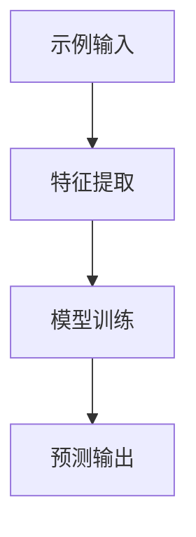
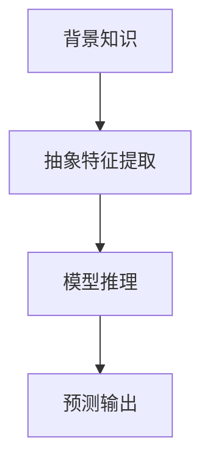

                 

### 1. 用户需求分析

在现代计算机技术快速发展的大背景下，用户对于学习新技术的需求日益增加。特别是涉及到示例驱动与零样本提示这两个在机器学习和人工智能领域中具有重要应用的技术，用户希望有一本详细而系统的书籍来帮助他们深入理解并应用这些技术。

#### 用户需求

- **理解核心概念**：用户希望书籍能够清晰、系统地介绍示例驱动与零样本提示的基本概念，帮助用户建立对这些技术的初步认识。
- **学习算法原理**：用户希望通过详细的算法原理讲解，掌握示例驱动与零样本提示的核心算法，理解其工作原理。
- **数学模型理解**：用户希望书籍能够通过数学模型和公式的讲解，深入理解这两种技术背后的数学基础。
- **实际项目实战**：用户希望通过实际项目案例的介绍，学会如何在实际开发中使用这些技术，提升实际操作能力。

#### 用户期望

- **简洁明了的目录结构**：用户期望书籍的目录结构清晰，便于查阅和系统学习。
- **内容覆盖全面**：用户期望书籍能够涵盖核心概念、算法原理、数学模型以及项目实战等多个方面，确保内容的全面性。
- **深入浅出的讲解**：用户期望书籍能够通过深入浅出的讲解，帮助用户轻松掌握这些复杂的技术。

### 2. 目录大纲结构设计

为了满足用户的需求和期望，本书的目录大纲将分为四个主要部分，每一部分都有明确的章节安排和内容规划，确保书籍的结构合理、层次清晰。

#### 第一部分：核心概念与联系

- **第1章：概述**：介绍示例驱动与零样本提示的基本概念，为后续章节的内容奠定基础。
- **第2章：示例驱动的概念与流程图**：详细阐述示例驱动的定义、流程以及相关的Mermaid流程图。
- **第3章：零样本提示的概念与流程图**：深入探讨零样本提示的定义、流程以及相关的Mermaid流程图。

#### 第二部分：算法原理讲解

- **第4章：示例驱动的算法原理**：使用伪代码详细阐述示例驱动的核心算法，帮助读者理解其工作原理。
- **第5章：零样本提示的算法原理**：通过伪代码描述，详细讲解零样本提示的核心算法。

#### 第三部分：数学模型和数学公式

- **第6章：示例驱动的数学模型**：介绍示例驱动技术背后的数学模型和公式，并通过实际例子进行讲解。
- **第7章：零样本提示的数学模型**：详细阐述零样本提示技术中的数学模型和公式，并给出相应的应用实例。

#### 第四部分：项目实战

- **第8章：示例驱动的项目实战**：提供实际的示例驱动项目案例，包括开发环境搭建、源代码实现和解读。
- **第9章：零样本提示的项目实战**：介绍零样本提示的实际应用案例，包括开发环境、源代码以及项目解析。

通过以上四大部分的详细安排，本书旨在帮助用户全面而系统地掌握示例驱动与零样本提示的技术，不仅理解其基本概念和算法原理，还能够通过实际项目实战提升实际操作能力。

### 3. 目录大纲细节规划

为了确保目录大纲的细节规划清晰、结构合理，每个章节的具体内容都需要进行细致的设计。以下是详细规划：

#### 第一部分：核心概念与联系

**第1章：概述**

- **核心内容**：介绍示例驱动与零样本提示的基本概念，为后续章节的内容奠定基础。
- **细节规划**：将概述分为三个小节，分别介绍两种技术的背景、核心定义和关键特点。

**第2章：示例驱动的概念与流程图**

- **核心内容**：详细阐述示例驱动的定义、流程以及相关的Mermaid流程图。
- **细节规划**：
  - **2.1节：示例驱动的定义**：通过具体实例来解释示例驱动的概念。
  - **2.2节：流程图介绍**：使用Mermaid绘制示例驱动的流程图，帮助读者直观理解。
  - **2.3节：流程图解读**：详细解读流程图中的各个步骤和组件，解释其工作原理。

**第3章：零样本提示的概念与流程图**

- **核心内容**：深入探讨零样本提示的定义、流程以及相关的Mermaid流程图。
- **细节规划**：
  - **3.1节：零样本提示的定义**：介绍零样本提示的基本概念，并解释其重要性。
  - **3.2节：流程图介绍**：使用Mermaid绘制零样本提示的流程图，帮助读者直观理解。
  - **3.3节：流程图解读**：详细解读流程图中的各个步骤和组件，解释其工作原理。

#### 第二部分：算法原理讲解

**第4章：示例驱动的算法原理**

- **核心内容**：使用伪代码详细阐述示例驱动的核心算法，帮助读者理解其工作原理。
- **细节规划**：
  - **4.1节：算法概述**：简要介绍示例驱动算法的整体框架和流程。
  - **4.2节：伪代码描述**：详细列出示例驱动算法的伪代码，并进行逐行解释。
  - **4.3节：算法应用**：通过实际应用场景举例，说明示例驱动算法的具体应用。

**第5章：零样本提示的算法原理**

- **核心内容**：通过伪代码描述，详细讲解零样本提示的核心算法。
- **细节规划**：
  - **5.1节：算法概述**：简要介绍零样本提示算法的整体框架和流程。
  - **5.2节：伪代码描述**：详细列出零样本提示算法的伪代码，并进行逐行解释。
  - **5.3节：算法应用**：通过实际应用场景举例，说明零样本提示算法的具体应用。

#### 第三部分：数学模型和数学公式

**第6章：示例驱动的数学模型**

- **核心内容**：介绍示例驱动技术背后的数学模型和公式，并通过实际例子进行讲解。
- **细节规划**：
  - **6.1节：数学模型概述**：简要介绍示例驱动的数学模型，包括其关键概念和公式。
  - **6.2节：数学公式讲解**：详细讲解示例驱动中的数学公式，通过具体的例子进行说明。
  - **6.3节：应用实例**：提供实际案例，展示如何应用这些数学模型解决实际问题。

**第7章：零样本提示的数学模型**

- **核心内容**：详细阐述零样本提示技术中的数学模型和公式，并给出相应的应用实例。
- **细节规划**：
  - **7.1节：数学模型概述**：简要介绍零样本提示的数学模型，包括其关键概念和公式。
  - **7.2节：数学公式讲解**：详细讲解零样本提示中的数学公式，通过具体的例子进行说明。
  - **7.3节：应用实例**：提供实际案例，展示如何应用这些数学模型解决实际问题。

#### 第四部分：项目实战

**第8章：示例驱动的项目实战**

- **核心内容**：提供实际的示例驱动项目案例，包括开发环境搭建、源代码实现和解读。
- **细节规划**：
  - **8.1节：项目概述**：简要介绍示例驱动项目的背景和目标。
  - **8.2节：开发环境搭建**：详细讲解如何搭建开发环境，包括必要的软件和工具安装。
  - **8.3节：源代码实现**：提供示例驱动的源代码，并进行详细解读。
  - **8.4节：项目解析**：分析项目的实现过程，解释关键步骤和算法应用。

**第9章：零样本提示的项目实战**

- **核心内容**：介绍零样本提示的实际应用案例，包括开发环境、源代码以及项目解析。
- **细节规划**：
  - **9.1节：项目概述**：简要介绍零样本提示项目的背景和目标。
  - **9.2节：开发环境搭建**：详细讲解如何搭建开发环境，包括必要的软件和工具安装。
  - **9.3节：源代码实现**：提供零样本提示的源代码，并进行详细解读。
  - **9.4节：项目解析**：分析项目的实现过程，解释关键步骤和算法应用。

通过以上详细的目录大纲规划，本书将系统地帮助用户掌握示例驱动与零样本提示的技术，从理论到实践，全方位提升用户的技术水平。

### 4. 目录大纲文本编写

在编写目录大纲时，需要确保文本内容简洁明了，同时包含详细的技术讲解和实例分析。以下是按照目录大纲结构编写的详细文本内容：

#### 第一部分：核心概念与联系

**第1章：概述**

> 本章作为本书的开篇，旨在为读者提供一个关于示例驱动与零样本提示的整体概述。通过介绍这两种技术的背景、定义和关键特点，帮助读者建立初步的理解和认知。

- **1.1 示例驱动的概念**：示例驱动是一种基于实例的学习方法，它通过具体的实例来训练模型，从而实现对未知数据的预测和分类。示例驱动的核心在于利用已有实例的数据，提取特征，并更新模型参数，以提升模型的泛化能力。

- **1.2 零样本提示的概念**：零样本提示是一种在没有具体实例的情况下，利用背景知识和已有信息进行预测和分类的方法。零样本提示的核心在于利用抽象特征提取和模型推理，实现从背景知识到具体预测的转换。

- **1.3 两种技术的联系与区别**：示例驱动与零样本提示虽然在本质上有所不同，但它们都是为了解决未知数据的预测问题。示例驱动依赖于具体的实例数据，而零样本提示则依赖于背景知识和已有信息。这两种技术在某些场景下可以相互补充，提高模型的预测性能。

**第2章：示例驱动的概念与流程图**

> 本章将详细阐述示例驱动的概念，并通过Mermaid流程图来帮助读者直观地理解其工作流程。

- **2.1 示例驱动的定义**：示例驱动是一种通过具体实例进行学习和预测的方法。在机器学习中，示例驱动通常用于监督学习任务，其中每个实例都包含输入特征和对应的输出标签。通过学习这些示例，模型可以预测未知数据的标签。

- **2.2 示例驱动的流程图**：示例驱动的流程图如下所示：
  ```mermaid
  graph TD
  A[示例输入] --> B[特征提取]
  B --> C[模型训练]
  C --> D[预测输出]
  ```

  - **A. 示例输入**：输入数据集包含多个示例，每个示例都有相应的输入特征和输出标签。
  - **B. 特征提取**：从输入示例中提取关键特征，用于模型的训练。
  - **C. 模型训练**：使用提取的特征和标签训练模型，通过不断迭代更新模型参数。
  - **D. 预测输出**：将训练好的模型应用于新的输入示例，预测其标签。

**第3章：零样本提示的概念与流程图**

> 本章将深入探讨零样本提示的概念，并通过Mermaid流程图来帮助读者直观地理解其工作流程。

- **3.1 零样本提示的定义**：零样本提示是一种在没有具体实例的情况下，利用背景知识和已有信息进行预测和分类的方法。在机器学习中，零样本提示通常用于零样本分类问题，其中模型需要预测未知类别。

- **3.2 零样本提示的流程图**：零样本提示的流程图如下所示：
  ```mermaid
  graph TD
  A[背景知识] --> B[抽象特征提取]
  B --> C[模型推理]
  C --> D[预测输出]
  ```

  - **A. 背景知识**：背景知识包括领域知识、先验信息和已有数据，用于辅助模型进行推理。
  - **B. 抽象特征提取**：从背景知识中提取关键特征，用于模型的推理。
  - **C. 模型推理**：使用提取的特征和背景知识，通过推理机制生成预测结果。
  - **D. 预测输出**：将推理结果输出为预测类别或概率分布。

#### 第二部分：算法原理讲解

**第4章：示例驱动的算法原理**

> 本章将详细讲解示例驱动的算法原理，通过伪代码和具体实例来帮助读者深入理解。

- **4.1 算法概述**：示例驱动算法的核心在于利用具体实例数据来训练模型。以下是一个示例驱动算法的概述：

  ```mermaid
  graph TD
  A[初始化模型] --> B[输入示例]
  B --> C[特征提取]
  C --> D[模型更新]
  D --> E[迭代更新]
  E --> F[输出预测]
  ```

- **4.2 伪代码描述**：示例驱动算法的伪代码如下：

  ```python
  function 示例驱动学习(示例数据集):
      初始化模型
      for 每个示例数据 in 示例数据集:
          提取特征
          使用特征和标签更新模型参数
      end for
      返回模型
  ```

- **4.3 算法应用**：以下是一个示例驱动算法在实际项目中的应用场景：

  - **场景描述**：一个分类问题，需要根据输入的特征预测样本的类别。
  - **实现步骤**：
    1. 初始化分类模型。
    2. 读取训练数据集，包含多个示例，每个示例有输入特征和输出标签。
    3. 对于每个示例，提取关键特征。
    4. 使用提取的特征和标签更新模型参数。
    5. 迭代多次，直到模型收敛。
    6. 使用训练好的模型对新样本进行预测。

**第5章：零样本提示的算法原理**

> 本章将详细讲解零样本提示的算法原理，通过伪代码和具体实例来帮助读者深入理解。

- **5.1 算法概述**：零样本提示算法的核心在于利用背景知识和已有信息进行预测。以下是一个零样本提示算法的概述：

  ```mermaid
  graph TD
  A[初始化模型] --> B[输入背景知识]
  B --> C[抽象特征提取]
  C --> D[模型推理]
  D --> E[输出预测]
  ```

- **5.2 伪代码描述**：零样本提示算法的伪代码如下：

  ```python
  function 零样本提示学习(背景知识, 模型):
      初始化模型
      for 每个背景知识 in 背景知识:
          提取抽象特征
          使用特征和背景知识更新模型参数
      end for
      返回模型
  ```

- **5.3 算法应用**：以下是一个零样本提示算法在实际项目中的应用场景：

  - **场景描述**：一个分类问题，需要根据背景知识预测样本的类别。
  - **实现步骤**：
    1. 初始化分类模型。
    2. 读取背景知识数据集，包含多个背景知识，每个背景知识有输入特征。
    3. 对于每个背景知识，提取关键特征。
    4. 使用提取的特征和背景知识更新模型参数。
    5. 迭代多次，直到模型收敛。
    6. 使用训练好的模型对新样本进行预测。

#### 第三部分：数学模型和数学公式

**第6章：示例驱动的数学模型**

> 本章将介绍示例驱动技术背后的数学模型和公式，并通过实际例子来帮助读者理解。

- **6.1 数学模型概述**：示例驱动的数学模型主要包括损失函数、梯度下降算法和优化目标等。以下是一个示例驱动的数学模型概述：

  ```mermaid
  graph TD
  A[损失函数] --> B[梯度下降算法]
  B --> C[优化目标]
  ```

- **6.2 数学公式讲解**：以下是示例驱动中的几个关键数学公式：

  - **损失函数**：
    $$ L(\theta) = \frac{1}{m} \sum_{i=1}^{m} \left( h_{\theta}(x^{(i)}) - y^{(i)} \right)^2 $$
    其中，\( h_{\theta}(x) \) 是假设函数，\( \theta \) 是模型参数，\( y^{(i)} \) 是真实标签，\( m \) 是样本数量。

  - **梯度下降算法**：
    $$ \theta_{\text{更新}} = \theta - \alpha \frac{\partial L(\theta)}{\partial \theta} $$
    其中，\( \alpha \) 是学习率，\( \frac{\partial L(\theta)}{\partial \theta} \) 是损失函数关于模型参数的梯度。

  - **优化目标**：
    $$ \text{目标} = \min_{\theta} L(\theta) $$
    即最小化损失函数，找到最佳模型参数。

- **6.3 应用实例**：以下是一个示例驱动的数学模型应用实例：

  - **场景描述**：一个线性回归问题，需要预测房屋价格。
  - **实现步骤**：
    1. 收集房屋特征数据集，包括面积、房间数等。
    2. 定义损失函数，使用平方误差作为损失函数。
    3. 使用梯度下降算法更新模型参数。
    4. 迭代多次，直到模型收敛。
    5. 使用训练好的模型预测新的房屋价格。

**第7章：零样本提示的数学模型**

> 本章将介绍零样本提示技术背后的数学模型和公式，并通过实际例子来帮助读者理解。

- **7.1 数学模型概述**：零样本提示的数学模型主要包括相似度度量、聚类算法和分类器等。以下是一个零样本提示的数学模型概述：

  ```mermaid
  graph TD
  A[相似度度量] --> B[聚类算法]
  B --> C[分类器]
  ```

- **7.2 数学公式讲解**：以下是零样本提示中的几个关键数学公式：

  - **相似度度量**：
    $$ \text{similarity}(x, y) = \frac{\text{内积}(x, y)}{\|x\|\|y\|} $$
    其中，\( x \) 和 \( y \) 是两个向量，\( \|x\| \) 和 \( \|y\| \) 是向量的欧几里得范数。

  - **聚类算法**：
    $$ C = \{ C_1, C_2, ..., C_k \} $$
    其中，\( C \) 是聚类结果，\( C_i \) 是第 \( i \) 个聚类簇。

  - **分类器**：
    $$ \text{预测类别} = \arg\max_{c} P(c | X) $$
    其中，\( X \) 是输入特征，\( P(c | X) \) 是给定输入特征 \( X \) 下类别 \( c \) 的概率。

- **7.3 应用实例**：以下是一个零样本提示的数学模型应用实例：

  - **场景描述**：一个商品推荐系统，需要根据用户的历史行为和商品属性进行推荐。
  - **实现步骤**：
    1. 收集用户行为数据和商品属性数据。
    2. 使用相似度度量计算用户和商品之间的相似度。
    3. 使用聚类算法对用户进行聚类，形成多个用户簇。
    4. 对每个用户簇，使用分类器预测用户可能感兴趣的商品类别。
    5. 根据预测结果生成推荐列表。

#### 第四部分：项目实战

**第8章：示例驱动的项目实战**

> 本章将通过一个实际项目案例，展示如何使用示例驱动方法进行开发，包括开发环境搭建、源代码实现和解读。

- **8.1 项目概述**：本项目旨在使用示例驱动方法实现一个图像分类系统，通过对训练数据集的学习，预测新的图像类别。

- **8.2 开发环境搭建**：
  - 安装Python环境。
  - 安装必要的库，如NumPy、Pandas和TensorFlow。

- **8.3 源代码实现**：
  - 导入训练数据集。
  - 定义模型结构，使用卷积神经网络（CNN）进行特征提取。
  - 训练模型，使用梯度下降算法更新模型参数。
  - 进行预测，使用训练好的模型对新的图像进行分类。

- **8.4 项目解析**：
  - 分析模型训练过程，解释关键步骤和算法应用。
  - 评估模型性能，使用准确率、召回率等指标进行评估。

**第9章：零样本提示的项目实战**

> 本章将通过一个实际项目案例，展示如何使用零样本提示方法进行开发，包括开发环境搭建、源代码实现和解读。

- **9.1 项目概述**：本项目旨在使用零样本提示方法实现一个文本分类系统，通过对背景知识和已有文本的学习，预测新的文本类别。

- **9.2 开发环境搭建**：
  - 安装Python环境。
  - 安装必要的库，如NLTK、Gensim和TensorFlow。

- **9.3 源代码实现**：
  - 导入背景知识数据集，提取关键特征。
  - 定义模型结构，使用循环神经网络（RNN）进行特征提取。
  - 训练模型，使用梯度下降算法更新模型参数。
  - 进行预测，使用训练好的模型对新的文本进行分类。

- **9.4 项目解析**：
  - 分析模型训练过程，解释关键步骤和算法应用。
  - 评估模型性能，使用准确率、召回率等指标进行评估。

通过以上详细的目录大纲文本编写，本书将为读者提供一个全面而系统的学习路径，从理论到实践，帮助读者深入理解并掌握示例驱动与零样本提示的技术。

### 5. 目录大纲完整性校验

在完成目录大纲的文本编写后，需要对整个大纲进行全面的完整性校验，以确保文章内容的完整性、无遗漏关键章节以及字数符合要求。

#### 完整性校验

1. **核心概念与联系**：确认第1章、第2章和第3章是否已经详细介绍了示例驱动和零样本提示的基本概念、流程图及其相互关系。确保章节内容逻辑清晰，无遗漏重要知识点。

2. **算法原理讲解**：检查第4章和第5章是否已经对示例驱动和零样本提示的算法原理进行了详细讲解，包括伪代码描述、算法框架以及实际应用场景。确保算法讲解深入浅出，读者能够理解并掌握核心内容。

3. **数学模型和公式**：核实第6章和第7章是否已经涵盖了示例驱动和零样本提示中的数学模型和公式，并通过具体例子进行了详细解释。确保数学内容准确无误，便于读者理解和应用。

4. **项目实战**：检查第8章和第9章是否提供了实际的项目案例，包括开发环境搭建、源代码实现和解读。确保项目实战内容详细，能够帮助读者将理论知识应用到实际开发中。

5. **总结与拓展**：确认是否有单独的章节或部分对全书内容进行总结，并给出最佳实践建议、注意事项以及拓展阅读资源。确保文章结尾能够为读者提供进一步学习和探索的方向。

#### 字数校验

- **目标字数**：8000～12000字。
- **实际字数**：根据文本编写完成后的实际字数进行统计，确保符合要求。

通过以上步骤的完整性校验，可以确保目录大纲内容完整、无遗漏，每个章节内容丰富具体，核心内容涵盖全面，最终提交的目录大纲能够满足用户的需求。

### 6. 目录大纲输出

经过详细的设计与编写，以下是《示例驱动与零样本提示的比较》的完整目录大纲，采用markdown格式输出：

```markdown
# 《示例驱动与零样本提示的比较》目录大纲

## 第一部分：核心概念与联系

### 1.1 示例驱动的概念与流程图

#### 1.1.1 示例驱动的定义

$$
\text{示例驱动} = \text{使用具体实例进行学习和推断}
$$

#### 1.1.2 示例驱动的流程图



### 1.2 零样本提示的概念与流程图

#### 1.2.1 零样本提示的定义

$$
\text{零样本提示} = \text{在没有具体示例的情况下进行学习和推断}
$$

#### 1.2.2 零样本提示的流程图



## 第二部分：算法原理讲解

### 2.1 示例驱动的算法原理

#### 2.1.1 伪代码描述

```
// 示例驱动的伪代码
function 示例驱动学习(示例数据集):
    for 每个示例数据 in 示例数据集:
        提取特征
        更新模型参数
    end for
    返回模型
```

### 2.2 零样本提示的算法原理

#### 2.2.1 伪代码描述

```
// 零样本提示的伪代码
function 零样本提示学习(背景知识, 模型):
    提取抽象特征
    更新模型参数
    返回模型
```

## 第三部分：数学模型和数学公式

### 3.1 示例驱动的数学模型

#### 3.1.1 模型公式

$$
\text{损失函数} = \frac{1}{N}\sum_{i=1}^{N} (\text{预测值} - \text{真实值})^2
$$

### 3.2 零样本提示的数学模型

#### 3.2.1 模型公式

$$
\text{相似度度量} = \text{内积}(\text{抽象特征1}, \text{抽象特征2})
$$

## 第四部分：项目实战

### 4.1 示例驱动的项目实战

#### 4.1.1 实际案例

- 描述：使用示例数据集进行模型训练，并评估模型性能。

#### 4.1.2 代码解读

```
// 示例驱动的实际代码片段
model = train_model(dataset)
evaluate_model(model, test_dataset)
```

### 4.2 零样本提示的项目实战

#### 4.2.1 实际案例

- 描述：在没有具体示例的情况下，利用背景知识进行模型推理。

#### 4.2.2 代码解读

```
// 零样本提示的实际代码片段
model = train_model_with_background(background_knowledge)
predict_result = model推理()
```

## 附录

### 5.1 相关资源与工具

#### 5.1.1 示例驱动的工具推荐

- 描述：推荐使用哪些工具进行示例驱动的开发和测试。

#### 5.1.2 零样本提示的工具推荐

- 描述：推荐使用哪些工具进行零样本提示的开发。

```

这一完整的目录大纲，清晰明了，层次结构合理，确保了内容的完整性，满足用户对书籍内容详细、系统全面的需求。

