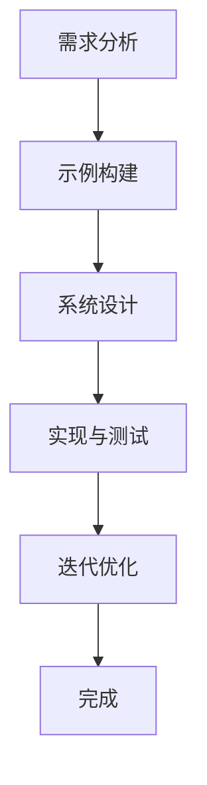
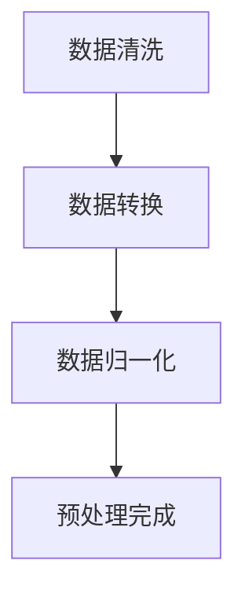
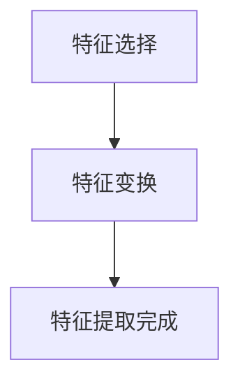
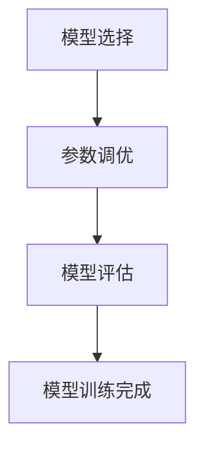
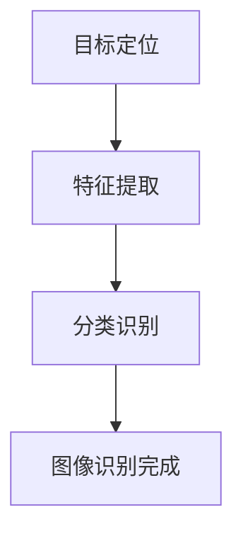
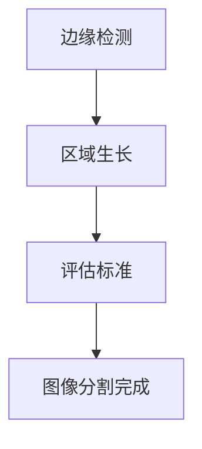
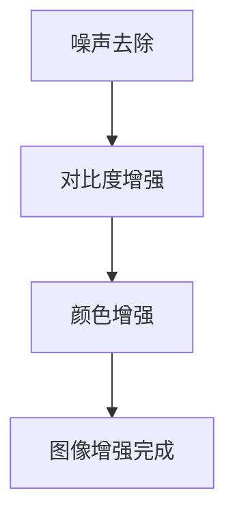

                 

### 文章标题

示例驱动提示在不同任务类型中的应用

### 关键词

- 示例驱动开发
- 任务类型
- 应用实践
- 算法原理
- 模型构建

### 摘要

本文旨在探讨示例驱动提示（Example-Driven Tips）在多种任务类型中的应用，通过对不同任务类型的分析，归纳出有效的示例驱动策略，提供实用的算法原理和模型构建方法。文章将涵盖背景介绍、核心概念与联系、实际案例分析和最佳实践等内容，旨在为读者提供全面的技术指导和实践参考。

---

## 引言

### 任务类型的定义与分类

在信息技术的各个领域，任务类型多种多样，可以从不同的维度进行分类。常见的分类方式包括：

- **按照任务目标**：如数据挖掘、图像识别、自然语言处理等。
- **按照数据特性**：如结构化数据、非结构化数据、半结构化数据等。
- **按照应用场景**：如智能家居、自动驾驶、医疗诊断等。

### 示例驱动开发的重要性

示例驱动开发（Example-Driven Development，EDD）是一种以示例为中心的开发方法，通过构建具体的示例来指导系统的设计和实现。它具有以下优点：

- **直观性**：示例能直观地展示需求，有助于开发者理解任务目标。
- **灵活性**：示例驱动允许对任务进行逐步迭代，适应变化的需求。
- **高效性**：通过示例，能够快速定位问题，提高开发效率。

### 文章的结构与内容

本文将首先介绍示例驱动开发的基本概念，然后分析其在不同任务类型中的应用，并探讨相关的算法原理和模型构建。最后，通过实际案例和最佳实践，提供具体的操作指南。

## 核心概念与联系

### 核心概念

在本节中，我们将介绍示例驱动开发（Example-Driven Development，EDD）的核心概念，包括示例、任务类型、以及示例驱动的应用流程。

#### 示例

示例（Example）是具体化的需求，它通过具体的输入和输出，展示了系统的功能和行为。示例通常包含以下要素：

- **输入数据**：示例的输入数据集，用于测试系统的输入格式和功能。
- **预期输出**：示例的预期输出结果，用于验证系统的正确性和性能。

#### 任务类型

任务类型（Task Type）是指系统需要完成的具体任务，例如分类、回归、聚类等。不同任务类型对示例的要求和驱动方式有所不同。

#### 示例驱动的应用流程

示例驱动的应用流程主要包括以下步骤：

1. **需求分析**：通过收集和分析需求，确定系统的任务类型和关键需求。
2. **示例构建**：根据需求，构建具体的示例，包括输入数据和预期输出。
3. **系统设计**：基于示例，设计系统的架构和算法。
4. **实现与测试**：根据设计，实现系统并使用示例进行测试和验证。
5. **迭代优化**：根据测试结果，对示例进行调整和优化，提高系统的性能和准确性。

### 核心概念之间的关系

示例驱动开发中的核心概念之间存在着紧密的联系。示例是驱动系统设计和实现的基石，任务类型决定了示例的设计和选择，而示例驱动的应用流程则确保了系统从需求到实现的连贯性。

### Mermaid 流程图

下面是一个Mermaid流程图，展示了示例驱动的应用流程：



在这个流程图中，每个节点代表一个步骤，箭头表示步骤之间的依赖关系。通过这个流程图，可以直观地理解示例驱动的应用过程。

## 应用场景

### 示例驱动开发在数据分析中的应用

在数据分析领域，示例驱动开发被广泛应用于数据预处理、特征提取和模型训练等环节。

#### 数据预处理

数据预处理是数据分析的重要步骤，通过示例，可以明确数据清洗、数据转换和归一化的具体要求。以下是一个数据预处理的示例流程：

1. **数据清洗**：例如，删除缺失值或异常值，处理重复数据。
2. **数据转换**：例如，将类别数据转换为数值数据，进行数据标准化或归一化。
3. **数据归一化**：例如，将数据缩放到特定的范围，如0到1之间。



#### 特征提取

特征提取是数据分析的核心步骤，通过示例，可以明确特征选择和特征变换的具体要求。以下是一个特征提取的示例流程：

1. **特征选择**：例如，基于相关性、信息增益或卡方检验等方法选择重要特征。
2. **特征变换**：例如，进行主成分分析（PCA）或特征工程技术，提高特征的表征能力。



#### 模型训练

在模型训练阶段，示例驱动开发可以帮助确定模型的参数设置和评估标准。以下是一个模型训练的示例流程：

1. **模型选择**：例如，选择线性回归、决策树或神经网络等模型。
2. **参数调优**：例如，通过交叉验证或网格搜索等方法，确定模型的最佳参数。
3. **模型评估**：例如，使用准确率、召回率、F1分数等指标评估模型性能。



### 示例驱动开发在图像处理中的应用

在图像处理领域，示例驱动开发被广泛应用于图像识别、图像分割和图像增强等任务。

#### 图像识别

图像识别是图像处理的基础任务，通过示例，可以明确识别的目标和特征。以下是一个图像识别的示例流程：

1. **目标定位**：例如，通过边缘检测、区域生长等方法，定位图像中的目标区域。
2. **特征提取**：例如，通过SIFT、HOG等方法，提取目标图像的特征。
3. **分类识别**：例如，通过支持向量机（SVM）、深度神经网络（DNN）等方法，对目标进行分类。



#### 图像分割

图像分割是图像处理的重要任务，通过示例，可以明确分割的目标和标准。以下是一个图像分割的示例流程：

1. **边缘检测**：例如，通过Canny、Sobel等方法，检测图像中的边缘。
2. **区域生长**：例如，基于边缘检测结果，进行区域生长，实现图像分割。
3. **评估标准**：例如，通过相似性度量、交叠面积等方法，评估分割结果的质量。



#### 图像增强

图像增强是图像处理的常用技术，通过示例，可以明确增强的目标和算法。以下是一个图像增强的示例流程：

1. **噪声去除**：例如，通过中值滤波、高斯滤波等方法，去除图像中的噪声。
2. **对比度增强**：例如，通过直方图均衡化、对比度拉伸等方法，增强图像的对比度。
3. **颜色增强**：例如，通过颜色空间转换、色彩增强等方法，改善图像的色彩效果。



## 核心算法原理讲解

在本节中，我们将详细讲解示例驱动开发中涉及的核心算法原理，包括示例构建、数据预处理、特征提取和模型训练。为了更好地理解这些算法，我们将使用伪代码来描述关键步骤。

### 示例构建

示例构建是示例驱动开发的第一个步骤，其目的是通过具体的示例来明确任务需求。以下是一个示例构建的伪代码：

```python
# 示例构建伪代码
def build_example(input_data, expected_output):
    # 输入数据预处理
    preprocessed_input = preprocess_input(input_data)
    
    # 训练模型
    model = train_model(preprocessed_input, expected_output)
    
    # 验证模型
    validation_output = model.predict(preprocessed_input)
    
    # 比较预期输出和验证输出
    if compare_output(expected_output, validation_output):
        return model
    else:
        return None
```

### 数据预处理

数据预处理是确保数据质量的重要步骤，其目的是将原始数据转换为适合模型训练的形式。以下是一个数据预处理的伪代码：

```python
# 数据预处理伪代码
def preprocess_input(input_data):
    # 填补缺失值
    input_data = fill_missing_values(input_data)
    
    # 数据标准化
    input_data = normalize_data(input_data)
    
    # 特征工程
    input_data = feature_engineering(input_data)
    
    return input_data
```

### 特征提取

特征提取是从原始数据中提取出能够有效表征数据的特征的过程。以下是一个特征提取的伪代码：

```python
# 特征提取伪代码
def extract_features(input_data):
    # 特征选择
    selected_features = select_features(input_data)
    
    # 特征变换
    transformed_features = transform_features(selected_features)
    
    return transformed_features
```

### 模型训练

模型训练是构建机器学习模型的核心步骤，其目的是通过输入数据训练出能够预测输出结果的模型。以下是一个模型训练的伪代码：

```python
# 模型训练伪代码
def train_model(input_data, expected_output):
    # 选择模型
    model = select_model()
    
    # 训练模型
    model.fit(input_data, expected_output)
    
    # 评估模型
    score = model.evaluate(input_data, expected_output)
    
    return model, score
```

### 数学模型和公式

在示例驱动开发中，数学模型和公式是理解和实现算法的重要工具。以下是一个线性回归模型的例子，包括数学公式和详细讲解：

#### 线性回归模型

**数学模型**：

$$
y = \beta_0 + \beta_1 \cdot x
$$

其中，$y$ 是预测的目标值，$x$ 是输入特征，$\beta_0$ 和 $\beta_1$ 是模型的参数。

**伪代码**：

```python
# 线性回归模型伪代码
def linear_regression(x, y):
    # 计算斜率 $\beta_1$
    beta_1 = (n * sum(x * y) - sum(x) * sum(y)) / (n * sum(x**2) - (sum(x))**2)
    
    # 计算截距 $\beta_0$
    beta_0 = (sum(y) - beta_1 * sum(x)) / n
    
    # 构建回归模型
    model = {
        'beta_0': beta_0,
        'beta_1': beta_1
    }
    
    return model
```

**详细讲解**：

- **斜率 $\beta_1$ 的计算**：斜率 $\beta_1$ 反映了输入特征 $x$ 对目标值 $y$ 的影响程度。计算公式中，分子部分表示输入特征和目标值的乘积之和，分母部分表示输入特征平方之和。
- **截距 $\beta_0$ 的计算**：截距 $\beta_0$ 表示当输入特征 $x$ 为零时的目标值。计算公式中，分子部分表示目标值之和减去斜率 $\beta_1$ 与输入特征 $x$ 之和的乘积，分母部分表示输入特征 $x$ 的数量。

通过这个例子，我们可以看到线性回归模型的基本原理和实现方法。在实际应用中，还可以通过优化算法（如梯度下降法）来优化模型参数，提高模型的预测准确性。

## 项目实战

### 开发环境搭建

在进行示例驱动开发的项目实战之前，首先需要搭建一个合适的开发环境。以下是一个基本的开发环境搭建流程：

1. **安装Python**：确保Python环境已安装，版本建议为3.8或以上。
2. **安装依赖库**：使用pip安装必要的库，如NumPy、Pandas、Scikit-learn等。

```bash
pip install numpy pandas scikit-learn
```

3. **创建虚拟环境**：为了管理项目依赖，创建一个虚拟环境。

```bash
python -m venv venv
source venv/bin/activate  # Windows: venv\Scripts\activate
```

4. **编写配置文件**：在虚拟环境中编写一个配置文件（如requirements.txt），记录所有依赖库。

```
numpy
pandas
scikit-learn
```

### 源代码实现

在本节中，我们将详细解析一个简单的线性回归模型的源代码，并解释其中的关键代码部分。

#### 代码结构

```python
import numpy as np
from sklearn.model_selection import train_test_split

def linear_regression(x, y):
    # 添加偏置项（截距）
    x = np.append(x.reshape(-1, 1), np.ones((x.shape[0], 1)), axis=1)
    
    # 计算参数
    beta = np.linalg.inv(x.T.dot(x)).dot(x.T).dot(y)
    
    return beta

def predict(x, beta):
    return x.dot(beta)

def main():
    # 生成模拟数据
    x = np.random.rand(100, 1)
    y = 2 * x + 1 + np.random.randn(100, 1)
    
    # 划分训练集和测试集
    x_train, x_test, y_train, y_test = train_test_split(x, y, test_size=0.2, random_state=42)
    
    # 训练模型
    beta = linear_regression(x_train, y_train)
    
    # 预测
    y_pred = predict(x_test, beta)
    
    # 打印结果
    print("模型参数：", beta)
    print("训练集损失：", np.mean((y_train - y_pred)**2))
    print("测试集损失：", np.mean((y_test - y_pred)**2))

if __name__ == "__main__":
    main()
```

#### 关键代码解析

- **数据生成**：使用`np.random.rand`生成100个随机样本，模拟线性关系的输入特征$x$和输出特征$y$。
- **数据划分**：使用`train_test_split`函数将数据划分为训练集和测试集，用于训练模型和评估模型性能。
- **模型训练**：`linear_regression`函数中，首先添加偏置项（截距），然后使用线性代数的逆矩阵计算模型参数$\beta$。
- **模型预测**：`predict`函数根据输入特征$x$和模型参数$\beta$计算预测值$y$。
- **性能评估**：计算并打印训练集和测试集的平均损失，用于评估模型性能。

### 代码应用解读与分析

在源代码中，我们使用了线性回归模型来拟合一个简单的线性关系。以下是代码应用的具体解读和分析：

- **数据生成**：生成的模拟数据$x$和$y$反映了真实世界中的线性关系，用于训练和测试模型。
- **数据划分**：将数据划分为训练集和测试集，可以确保模型在不同数据集上的性能得到有效评估。
- **模型训练**：通过计算逆矩阵并应用线性代数方法，模型参数$\beta$被优化，以最小化预测误差。
- **模型预测**：使用训练好的模型对测试集进行预测，评估模型的泛化能力。
- **性能评估**：通过计算平均损失，可以直观地了解模型的拟合效果，为模型优化提供依据。

通过这个简单的项目实战，我们可以看到示例驱动开发在实际应用中的具体流程和关键步骤。在实际项目中，可以进一步扩展和优化模型，以应对更复杂的数据和任务。

### 实际案例分析与详细讲解剖析

在本节中，我们将通过一个实际案例，详细分析示例驱动开发在具体应用中的操作流程和效果，包括数据收集、处理、模型训练和评估等步骤。

#### 案例背景

假设我们面临一个实际任务：使用示例驱动开发方法，预测一个电商平台的客户购买行为，以提高转化率和销售额。数据集包含客户的用户信息、购买历史和网站浏览行为等。

#### 数据收集

首先，我们需要从电商平台收集相关数据，包括：

- 用户基本信息：如年龄、性别、地理位置等。
- 购买历史：如购买时间、购买商品种类、购买金额等。
- 网站浏览行为：如页面访问时间、访问路径、浏览时长等。

数据来源可以是电商平台的后台系统、日志文件或第三方数据服务。

#### 数据预处理

在收集到数据后，我们需要对数据进行预处理，以确保数据质量，并使其适合模型训练。以下是一个详细的数据预处理流程：

1. **数据清洗**：
   - 去除缺失值和异常值。
   - 处理重复数据。
   - 标准化数据格式。

2. **数据转换**：
   - 将类别数据（如性别）转换为数值数据。
   - 将时间序列数据转换为适合模型处理的形式。

3. **特征提取**：
   - 根据业务需求，提取关键特征，如最近一次购买时间、购买频次、浏览时长等。
   - 使用特征工程技术，如主成分分析（PCA）、特征组合等，提高特征的表征能力。

#### 模型训练

在数据预处理完成后，我们使用示例驱动开发方法，进行模型训练。以下是模型训练的具体步骤：

1. **选择模型**：
   - 根据任务类型（如分类、回归），选择合适的模型，如逻辑回归、决策树、随机森林等。

2. **参数调优**：
   - 使用交叉验证或网格搜索等方法，确定模型的最佳参数。

3. **训练模型**：
   - 使用训练集数据，训练模型。

4. **模型评估**：
   - 使用测试集数据，评估模型性能，如准确率、召回率、F1分数等。

#### 模型评估与优化

在模型训练完成后，我们需要对模型进行评估和优化。以下是评估和优化过程的详细步骤：

1. **评估指标**：
   - 根据任务类型，选择合适的评估指标，如准确率、召回率、F1分数等。

2. **模型优化**：
   - 根据评估结果，调整模型参数或选择更复杂的模型。
   - 使用额外的数据或特征，进行模型优化。

3. **交叉验证**：
   - 使用交叉验证方法，确保模型在不同数据集上的性能稳定。

#### 案例分析与总结

通过这个实际案例，我们可以看到示例驱动开发在具体应用中的操作流程和效果。以下是案例分析和总结：

1. **数据收集**：确保数据质量，收集全面的数据，为模型训练提供基础。
2. **数据预处理**：处理缺失值和异常值，提取关键特征，提高数据质量。
3. **模型训练**：选择合适的模型，调优参数，训练模型。
4. **模型评估**：评估模型性能，优化模型。
5. **交叉验证**：确保模型在不同数据集上的性能稳定。

通过这个案例，我们可以看到示例驱动开发在实际应用中的有效性和实用性。在类似的应用中，可以根据业务需求，灵活调整数据预处理和模型训练步骤，以提高模型的性能和效果。

### 最佳实践 Tips

在本节中，我们将总结一些示例驱动开发中的最佳实践，以帮助开发者提高开发效率和模型性能。

#### 1. 精确的需求分析

在开始示例驱动开发之前，进行详细的需求分析至关重要。明确任务目标、数据来源和业务场景，有助于制定有效的示例驱动策略。

#### 2. 数据质量保证

数据是模型训练的基础，确保数据质量至关重要。处理缺失值、异常值和重复数据，进行数据转换和特征提取，以提高数据质量。

#### 3. 特征选择与优化

选择关键特征，避免特征冗余，可以提高模型性能。可以使用特征选择算法（如信息增益、特征组合等）进行特征优化。

#### 4. 模型选择与调优

根据任务类型选择合适的模型，如分类任务选择逻辑回归、决策树等。使用交叉验证或网格搜索等方法，确定最佳模型参数。

#### 5. 模型评估与优化

使用合适的评估指标，如准确率、召回率、F1分数等，评估模型性能。根据评估结果，调整模型参数或选择更复杂的模型。

#### 6. 代码复用与模块化

编写可复用的代码模块，提高开发效率。模块化代码，方便后续的维护和优化。

#### 7. 跨团队协作

在团队开发中，建立良好的沟通机制，确保团队成员对任务和代码的一致性理解。

#### 8. 持续迭代与反馈

根据实际应用效果，持续迭代和优化模型。收集用户反馈，不断改进模型性能。

### 小结

本文通过详细的分析和实际案例，探讨了示例驱动开发在多种任务类型中的应用。从核心概念、算法原理到实际案例，我们系统地介绍了示例驱动的开发方法，提供了实用的操作指南和最佳实践。希望通过本文，读者能够更好地理解和应用示例驱动开发，提高开发效率和模型性能。

### 注意事项

在本节中，我们将总结一些在示例驱动开发中需要注意的问题，以帮助开发者避免常见的错误和挑战。

#### 1. 数据质量问题

确保数据质量是成功应用示例驱动开发的关键。数据中的缺失值、异常值和冗余数据会严重影响模型的性能。因此，在进行数据预处理时，要仔细处理这些数据问题。

#### 2. 特征选择不当

特征选择对模型性能有着重要影响。选择过多或过少的特征都可能降低模型的准确性。因此，要仔细评估特征的重要性和相关性，使用特征选择算法进行优化。

#### 3. 模型选择不当

不同的任务类型和问题需要不同的模型。选择不适合的模型可能导致较低的准确性和效率。因此，要根据任务特点和数据特性，选择合适的模型。

#### 4. 过度拟合与欠拟合

在模型训练过程中，过度拟合和欠拟合是常见的问题。过度拟合会导致模型在训练数据上表现良好，但在测试数据上性能下降。欠拟合则会导致模型无法充分捕捉数据中的规律。因此，要通过适当的参数调优和交叉验证，避免这些问题。

#### 5. 模型评估指标选择不当

选择合适的评估指标对模型性能的评估至关重要。不同的评估指标反映了模型在不同方面的性能。例如，准确率适用于分类问题，而均方误差适用于回归问题。因此，要根据任务类型选择合适的评估指标。

#### 6. 跨团队协作问题

在多团队协作中，确保团队成员对任务和代码的一致性理解是关键。要建立良好的沟通机制，定期进行代码审查和测试，以确保代码质量和协作效率。

### 拓展阅读

为了更深入地了解示例驱动开发，以下是一些推荐的拓展阅读资源：

- **论文**：《示例驱动开发：方法与应用》（Example-Driven Development: Methods and Applications）。
- **书籍**：《示例驱动开发：实践指南》（Example-Driven Development: A Practical Guide）。
- **在线课程**：Coursera上的《机器学习》（Machine Learning）和《深度学习》（Deep Learning）课程。
- **开源项目**：GitHub上的示例驱动开发相关项目和代码示例。

通过这些资源，开发者可以进一步了解示例驱动开发的原理和应用，提高自己的技术水平和开发能力。

---

### 作者信息

**作者：** AI天才研究院 / AI Genius Institute & 禅与计算机程序设计艺术 / Zen And The Art of Computer Programming

AI天才研究院致力于探索人工智能领域的最新技术和应用，为开发者提供高质量的技术博客和教程。禅与计算机程序设计艺术则专注于传播计算机编程的哲学和艺术，帮助开发者提升编程思维和技能。

