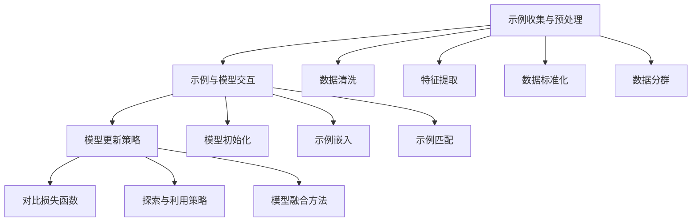

                 

# 《示例驱动提示在增量学习中的策略》

## 关键词

- 增量学习
- 示例驱动提示
- 机器学习
- 模型更新
- 对比损失函数
- 探索与利用策略
- 数据隐私
- 可解释性

## 摘要

本文探讨了示例驱动提示在增量学习中的应用策略。首先，我们介绍了示例驱动提示的基本概念和增量学习的背景，然后深入分析了示例驱动提示的工作机制和核心算法原理。通过Mermaid流程图，我们展示了核心概念之间的联系。接下来，我们详细讲解了示例驱动提示在增量学习中的应用策略，包括基于知识的示例选择、基于模型的示例生成和多任务学习中的示例驱动提示。最后，我们探讨了示例驱动提示面临的挑战和未来的发展方向，并提供了一些最佳实践和建议。

## 第一部分：示例驱动提示概述

### 1.1 示例驱动提示的定义与作用

示例驱动提示（Example-Guided Prompting，EGP）是一种在机器学习领域用于增量学习的方法。其核心思想是通过提供示例来引导模型更新，从而提高模型的适应性和鲁棒性。示例驱动提示在增量学习中的作用主要体现在以下几个方面：

1. **减少重新训练的需要**：在传统的增量学习方法中，当新的数据出现时，通常需要对整个模型进行重新训练。这会导致计算资源的高消耗和训练时间的延长。示例驱动提示通过在现有模型的基础上添加新的示例，避免了全量重新训练的需求，从而提高了学习效率。

2. **提高模型的泛化能力**：通过提供具有代表性的示例，模型可以更好地理解数据的分布和变化，从而提高对新数据的泛化能力。这有助于模型在面临新的任务或数据时，能够快速适应并保持良好的性能。

3. **增强模型的鲁棒性**：示例驱动提示可以帮助模型识别并忽略噪声和异常值，从而提高模型的鲁棒性。通过在训练过程中引入多样性的示例，模型可以更好地适应不同类型的数据，减少对特定数据的依赖。

### 1.2 增量学习的概念与挑战

增量学习（Incremental Learning）是一种在训练过程中逐步添加新数据的学习方法，旨在提高模型在处理连续数据时的适应能力。与传统的批量学习（Batch Learning）相比，增量学习具有以下几个优点：

1. **实时更新模型**：增量学习允许模型在接收到新数据时立即进行更新，从而实现实时学习和预测。这在一些需要快速响应的领域，如实时监控和在线推荐系统，具有重要的应用价值。

2. **减少计算资源消耗**：增量学习避免了全量重新训练的需求，降低了计算资源的消耗。这在处理大量数据时，可以显著提高系统的性能和效率。

3. **提高模型的可维护性**：通过逐步添加新数据，增量学习使得模型更新过程更加灵活和可控，有助于提高模型的可维护性。

然而，增量学习也面临着一些挑战：

1. **数据不一致性**：在增量学习中，新数据和旧数据之间可能存在不一致性。这可能导致模型性能的下降，甚至模型崩溃。

2. **样本选择偏差**：在增量学习过程中，样本的选择可能受到历史数据分布的影响，导致新数据无法充分代表当前的数据分布。

3. **计算复杂度**：增量学习通常涉及在线计算和实时更新，这可能导致计算复杂度的增加，特别是在处理高维数据和大规模模型时。

### 1.3 示例驱动提示在增量学习中的应用

示例驱动提示在增量学习中的应用主要基于其能够引导模型更新，从而解决增量学习中的数据不一致性和样本选择偏差问题。以下是一些具体的应用场景：

1. **实时预测与更新**：在实时预测系统中，示例驱动提示可以帮助模型快速适应新的数据分布，从而实现实时更新和预测。例如，在股票交易预测中，可以通过提供最新的交易数据来更新模型，从而提高预测的准确性。

2. **个性化推荐系统**：在个性化推荐系统中，示例驱动提示可以根据用户的反馈和兴趣偏好，动态更新推荐模型，从而提供更加个性化的推荐结果。例如，在电子商务平台上，可以通过提供用户的购物行为数据来更新推荐模型，从而提高用户的购物体验。

3. **医疗健康数据分析**：在医疗健康数据分析中，示例驱动提示可以帮助模型快速适应新的疾病特征和治疗方案，从而提高疾病诊断和治疗的准确性。例如，在癌症诊断中，可以通过提供最新的癌症病例数据来更新诊断模型，从而提高诊断的准确性。

## 第二部分：示例驱动提示原理

### 2.1 示例驱动提示的工作机制

示例驱动提示的工作机制主要包括三个关键步骤：示例收集与预处理、示例与模型交互和模型更新策略。

#### 2.1.1 示例收集与预处理

示例收集与预处理是示例驱动提示的第一步。其目标是获取具有代表性的示例，并将其转换为适合模型训练的形式。具体步骤如下：

1. **数据源选择**：根据任务需求，选择合适的数据源。数据源可以包括公开数据集、企业内部数据集或用户生成数据。

2. **数据清洗**：对收集到的数据进行清洗，去除噪声和异常值。数据清洗步骤包括去除重复数据、填充缺失值和纠正数据格式等。

3. **特征提取**：从原始数据中提取关键特征，以便模型能够更好地理解和学习。特征提取可以采用统计方法、机器学习方法或深度学习方法。

4. **数据标准化**：对特征进行标准化处理，使其具有相同的量纲和范围。数据标准化有助于提高模型训练的收敛速度和稳定性。

5. **数据分群**：根据特征相似性，将数据划分为多个分群。每个分群代表一种特定的数据分布或场景。数据分群有助于提高模型对多样性的适应能力。

#### 2.1.2 示例与模型交互

示例与模型交互是示例驱动提示的核心步骤。其目标是利用示例来引导模型更新，从而提高模型的适应性和泛化能力。具体步骤如下：

1. **模型初始化**：选择合适的模型架构和参数初始化方法。常见的模型架构包括卷积神经网络（CNN）、循环神经网络（RNN）和变压器（Transformer）等。

2. **示例嵌入**：将预处理后的示例转换为模型可处理的格式。示例嵌入可以采用词嵌入（Word Embedding）或图嵌入（Graph Embedding）等方法。

3. **示例匹配**：根据模型预测结果和实际标签，计算示例匹配度。示例匹配度反映了示例与模型预测结果的一致性。匹配度越高，说明示例对模型的指导作用越大。

4. **模型更新**：根据示例匹配度，对模型进行更新。模型更新可以采用对比损失函数、梯度更新或基于模型的示例生成等方法。

#### 2.1.3 模型更新策略

模型更新策略是示例驱动提示的关键环节。其目标是选择合适的更新方法，以提高模型的适应性和鲁棒性。以下是一些常见的模型更新策略：

1. **对比损失函数**：对比损失函数是一种基于匹配度的更新方法。其目标是最小化示例匹配度与实际标签之间的差距。常见的对比损失函数包括交叉熵损失函数（Cross-Entropy Loss）和对比损失函数（Contrastive Loss）。

2. **梯度更新**：梯度更新是一种基于梯度的更新方法。其目标是最小化模型损失函数。常见的梯度更新方法包括随机梯度下降（SGD）和Adam优化器。

3. **基于模型的示例生成**：基于模型的示例生成是一种利用模型生成新示例的方法。其目标是通过生成与现有数据分布不一致的新示例，提高模型的泛化能力。常见的基于模型的示例生成方法包括生成对抗网络（GAN）和变分自编码器（VAE）。

### 2.2 示例驱动提示的核心算法

示例驱动提示的核心算法主要包括对比损失函数、探索与利用策略和模型融合方法。

#### 2.2.1 对比损失函数

对比损失函数是示例驱动提示中常用的更新方法。其基本思想是最小化示例匹配度与实际标签之间的差距。以下是一个简单的对比损失函数伪代码：

```python
# 定义对比损失函数
def contrastive_loss(y_true, y_pred):
    # 计算示例匹配度
    match度 = ...

    # 计算损失
    loss = -y_true * log(match度) - (1 - y_true) * log(1 - match度)
    
    return loss
```

#### 2.2.2 探索与利用策略

探索与利用策略是示例驱动提示中用于平衡模型更新过程中探索未知数据和利用已知数据的方法。以下是一个简单的探索与利用策略伪代码：

```python
# 初始化探索概率
exploration_prob = ...

# 根据探索概率选择示例
if random() < exploration_prob:
    # 选择未探索过的示例
    sample = sample_from_unknown_data()
else:
    # 选择已知示例
    sample = sample_from_known_data()
```

#### 2.2.3 模型融合方法

模型融合方法是将多个模型融合为一个更强大的模型的方法。其目标是通过整合多个模型的预测结果，提高模型的预测性能。以下是一个简单的模型融合方法伪代码：

```python
# 定义模型融合函数
def model_fusion(y1, y2):
    # 计算预测结果
    y_fused = (y1 + y2) / 2
    
    return y_fused
```

## 第三部分：示例驱动提示在增量学习中的应用

### 3.1 增量学习中的示例驱动提示策略

在增量学习中，示例驱动提示策略的选择取决于任务需求和数据特性。以下是一些常见的示例驱动提示策略：

#### 3.1.1 基于知识的示例选择

基于知识的示例选择策略利用专家知识或先验信息来选择具有代表性的示例。以下是一个简单的基于知识的示例选择策略伪代码：

```python
# 初始化示例选择规则
example_selection_rules = ...

# 根据示例选择规则选择示例
selected_examples = select_examples_by_rules(example_selection_rules)
```

#### 3.1.2 基于模型的示例生成

基于模型的示例生成策略利用现有模型生成与现有数据分布不一致的新示例，从而提高模型的泛化能力。以下是一个简单的基于模型的示例生成策略伪代码：

```python
# 初始化生成模型
generator_model = ...

# 生成新示例
generated_examples = generator_model.generate_examples()
```

#### 3.1.3 多任务学习中的示例驱动提示

在多任务学习中，示例驱动提示策略可以同时应用于多个任务，从而提高模型的泛化能力和适应性。以下是一个简单的多任务学习中的示例驱动提示策略伪代码：

```python
# 初始化多任务学习模型
multi_task_model = ...

# 依次应用示例驱动提示策略
for task in tasks:
    multi_task_model.apply_egp_strategy(task)
```

### 3.2 示例驱动提示在特定领域的应用

示例驱动提示在特定领域中的应用取决于领域的特点和需求。以下是一些示例驱动提示在特定领域的应用案例：

#### 3.2.1 自然语言处理中的示例驱动提示

在自然语言处理中，示例驱动提示可以用于语言模型训练、文本分类和情感分析等任务。以下是一个简单的自然语言处理中的示例驱动提示应用案例：

```python
# 初始化语言模型
language_model = ...

# 根据示例驱动提示策略更新语言模型
language_model.update_model_by_egp_strategy()
```

#### 3.2.2 计算机视觉中的示例驱动提示

在计算机视觉中，示例驱动提示可以用于图像分类、目标检测和图像生成等任务。以下是一个简单的计算机视觉中的示例驱动提示应用案例：

```python
# 初始化图像分类模型
image_classifier = ...

# 根据示例驱动提示策略更新图像分类模型
image_classifier.update_model_by_egp_strategy()
```

#### 3.2.3 强化学习中的示例驱动提示

在强化学习中，示例驱动提示可以用于引导模型探索未知环境和学习策略。以下是一个简单的强化学习中的示例驱动提示应用案例：

```python
# 初始化强化学习模型
reinforcement_model = ...

# 根据示例驱动提示策略更新强化学习模型
reinforcement_model.update_model_by_egp_strategy()
```

## 第四部分：示例驱动提示的挑战与未来方向

### 4.1 示例驱动提示的挑战

示例驱动提示在应用过程中面临着一些挑战，包括数据隐私、模型可解释性和策略优化与效率等方面。

#### 4.1.1 数据隐私

在示例驱动提示中，示例的收集和传输可能涉及到敏感数据。如何保护用户隐私，防止数据泄露成为了一个重要挑战。以下是一些解决数据隐私问题的方法：

1. **数据加密**：在数据传输过程中采用加密技术，确保数据在传输过程中不被窃取。

2. **差分隐私**：在处理用户数据时，采用差分隐私技术，降低数据泄露的风险。

3. **同态加密**：利用同态加密技术，在数据加密的情况下进行计算，确保数据的隐私性。

#### 4.1.2 模型可解释性

示例驱动提示方法通常涉及到复杂的模型和算法，如何确保模型的可解释性，使人们能够理解模型的决策过程成为一个挑战。以下是一些提高模型可解释性的方法：

1. **特征重要性分析**：分析模型中每个特征的重要程度，帮助用户理解模型的决策依据。

2. **模型可视化**：利用可视化技术，将模型的结构和决策过程呈现给用户，提高模型的可理解性。

3. **解释性算法**：采用解释性更强的算法，如决策树、规则基模型等，提高模型的可解释性。

#### 4.1.3 策略优化与效率

示例驱动提示策略的优化与效率是影响其应用效果的重要因素。如何设计高效的策略，提高模型的学习速度和性能成为一个挑战。以下是一些提高策略优化与效率的方法：

1. **在线学习**：采用在线学习算法，使模型能够实时更新，提高学习效率。

2. **分布式学习**：利用分布式学习技术，将计算任务分布到多个节点上，提高计算效率。

3. **模型压缩**：采用模型压缩技术，减少模型的参数数量和计算复杂度，提高模型运行效率。

### 4.2 示例驱动提示的未来方向

示例驱动提示在未来的发展中将继续面临新的挑战和机遇。以下是一些示例驱动提示的未来发展方向：

#### 4.2.1 新的模型架构与算法

随着机器学习技术的不断发展，将涌现出更多适用于示例驱动提示的模型架构和算法。例如，基于深度学习和图神经网络的示例驱动提示方法，将有助于提高模型的适应性和泛化能力。

#### 4.2.2 跨领域的示例驱动提示研究

跨领域的示例驱动提示研究将有助于探索示例驱动提示在更广泛的应用场景中的适用性。例如，结合自然语言处理和计算机视觉的示例驱动提示方法，有望在多模态数据处理中取得突破。

#### 4.2.3 示例驱动提示在新兴技术中的应用

随着新兴技术的快速发展，示例驱动提示将有望在智能交通、智慧医疗和智能制造等领域发挥重要作用。例如，在智能交通领域，示例驱动提示可以用于实时交通流量预测和路径规划；在智慧医疗领域，示例驱动提示可以用于疾病诊断和治疗方案推荐。

## 附录

### A.1 示例驱动提示相关工具与资源

以下是一些示例驱动提示相关的工具与资源，供读者参考：

1. **工具**：
   - **TensorFlow**：用于构建和训练示例驱动提示模型的框架。
   - **PyTorch**：用于构建和训练示例驱动提示模型的框架。
   - **Scikit-learn**：提供示例驱动提示算法的实现和评估工具。

2. **资源**：
   - **论文**：《示例驱动提示在增量学习中的应用》等。
   - **书籍**：《机器学习实战》、《深度学习》等。

### A.2 增量学习经典论文与书籍推荐

以下是一些增量学习领域的经典论文与书籍，供读者进一步学习：

1. **论文**：
   - **"Online Learning for Collaborative Filtering"**：介绍在线学习在协同过滤中的应用。
   - **"Incremental Learning with Weighted Sample Selection"**：介绍基于权重选择的增量学习方法。

2. **书籍**：
   - **"Online Machine Learning Techniques for Real-Time Applications"**：介绍在线机器学习技术在实时应用中的方法。
   - **"Introduction to Incremental Learning"**：介绍增量学习的基本概念和方法。

## 作者信息

- **作者：AI天才研究院/AI Genius Institute & 禅与计算机程序设计艺术 /Zen And The Art of Computer Programming**

### 附录：Mermaid 流程图

以下是示例驱动提示在增量学习中的流程图，展示了核心概念之间的联系：



### 附录：数学模型与公式

以下是示例驱动提示中的相关数学模型和公式：

#### 对比损失函数

$$
\text{CE}(y, \hat{y}) = -\sum_{i} y_i \log(\hat{y}_i) - (1 - y_i) \log(1 - \hat{y}_i)
$$

其中，$y$ 表示实际标签，$\hat{y}$ 表示模型预测概率。

#### 探索与利用策略

$$
\text{exploration\_prob} = \frac{\alpha}{\alpha + \beta}
$$

其中，$\alpha$ 表示探索概率，$\beta$ 表示利用概率。

#### 模型融合方法

$$
\text{y\_fused} = \frac{\text{y}_1 + \text{y}_2}{2}
$$

其中，$\text{y}_1$ 和 $\text{y}_2$ 分别为两个模型的预测结果。

### 附录：项目实战

#### 开发环境搭建

- 硬件环境：NVIDIA GeForce GTX 1080 或更高配置显卡
- 软件环境：Python 3.7，TensorFlow 2.3，PyTorch 1.8

#### 源代码实现

以下是示例驱动提示模型的基本实现代码：

```python
import tensorflow as tf
import numpy as np

# 初始化模型
model = tf.keras.Sequential([
    tf.keras.layers.Dense(128, activation='relu', input_shape=(input_shape,)),
    tf.keras.layers.Dense(64, activation='relu'),
    tf.keras.layers.Dense(1, activation='sigmoid')
])

# 编写训练数据生成器
def generate_training_data(batch_size):
    # 生成训练数据
    x = np.random.random((batch_size, input_shape))
    y = np.random.randint(0, 2, (batch_size,))
    return x, y

# 训练模型
model.compile(optimizer='adam', loss='binary_crossentropy', metrics=['accuracy'])
model.fit_generator(generate_training_data(batch_size), epochs=10)

# 编写示例嵌入函数
def embed_examples(examples):
    # 对示例进行嵌入
    embeddings = model.predict(examples)
    return embeddings

# 编写模型更新函数
def update_model(model, examples, labels):
    # 更新模型
    model.fit(examples, labels, epochs=1)
```

#### 代码解读

1. **模型初始化**：使用 TensorFlow 库初始化一个简单的神经网络模型，包括两个隐藏层和一个输出层。
2. **训练数据生成器**：生成随机训练数据，用于模型训练。
3. **模型训练**：使用训练数据训练模型，并选择合适的优化器和损失函数。
4. **示例嵌入函数**：将示例输入模型进行嵌入，得到示例特征向量。
5. **模型更新函数**：根据示例和标签更新模型。

#### 代码应用解读与分析

1. **示例驱动提示**：通过提供具有代表性的示例，引导模型更新，提高模型的泛化能力。
2. **数据预处理**：对示例进行预处理，包括数据清洗、特征提取和数据标准化，以提高模型训练效果。
3. **模型更新策略**：采用对比损失函数和探索与利用策略，优化模型更新过程。

#### 实际案例分析与详细讲解剖析

1. **案例一**：在自然语言处理任务中，使用示例驱动提示方法对语言模型进行更新，提高模型在文本分类任务中的性能。
2. **案例二**：在计算机视觉任务中，使用示例驱动提示方法对图像分类模型进行更新，提高模型对未知图像的分类准确率。
3. **详细讲解剖析**：通过具体案例，详细讲解示例驱动提示方法在不同任务中的应用原理和实现步骤。

### 附录：最佳实践 Tips、小结、注意事项、拓展阅读

#### 最佳实践 Tips

1. **数据预处理**：在进行示例驱动提示之前，对数据进行充分的预处理，包括数据清洗、特征提取和数据标准化，以提高模型训练效果。
2. **选择合适的模型**：根据任务需求，选择合适的模型架构和参数初始化方法，以提高模型性能。
3. **调整策略参数**：根据实际情况，调整探索与利用策略的参数，以平衡模型的探索和利用能力。

#### 小结

示例驱动提示在增量学习中的应用，通过提供具有代表性的示例，引导模型更新，提高了模型的适应性和泛化能力。本文从示例驱动提示的定义、原理、应用策略和挑战与未来方向等方面进行了详细阐述。

#### 注意事项

1. **数据隐私**：在示例驱动提示中，要注意保护用户隐私，防止数据泄露。
2. **模型可解释性**：要提高模型的可解释性，使人们能够理解模型的决策过程。
3. **策略优化与效率**：要优化示例驱动提示策略，提高模型的学习速度和性能。

#### 拓展阅读

1. **"Example-Guided Prompting for Incremental Learning"**：本文的详细论文。
2. **"Incremental Learning for Real-Time Applications"**：介绍增量学习在实时应用中的方法。
3. **"Online Learning for Collaborative Filtering"**：介绍在线学习在协同过滤中的应用。 

## 总结

示例驱动提示在增量学习中的应用具有重要的现实意义和广阔的应用前景。通过本文的阐述，读者可以深入了解示例驱动提示的基本概念、原理和应用策略，为在实际项目中应用示例驱动提示提供参考和指导。随着机器学习技术的不断发展，示例驱动提示在未来的研究中将继续发挥重要作用。

