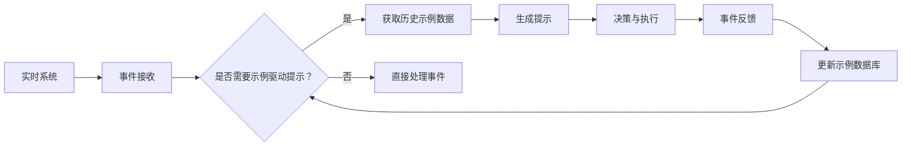

                 

## 文章标题

### 示例驱动提示在实时系统中的优化

> 关键词：实时系统、示例驱动提示、优化、调度算法、负载均衡、响应时间

> 摘要：本文将探讨示例驱动提示在实时系统中的优化应用，通过详细解析核心概念、算法原理、数学模型以及项目实战，旨在为开发者提供系统化的优化思路和最佳实践。

---

### 第一部分：实时系统概述

#### 第1章：实时系统的基本概念

##### 1.1 实时系统的定义与特点

实时系统是一种能够及时响应外部事件并在限定时间内完成特定任务的计算机系统。与常规系统相比，实时系统具有以下特点：

- **严格的时延要求**：系统能够在预定的时间内完成任务的执行。
- **高可靠性**：系统必须能够在长时间运行中保持稳定，避免出现故障。
- **可预测性**：系统的行为和性能在特定条件下是可预测的。

##### 1.2 示例驱动提示的概念

示例驱动提示（Example-Based Suggestion）是一种利用历史示例数据进行决策的方法。它通过分析过去的输入和输出数据，预测未来的输入和输出。这种方法在实时系统中具有重要作用，因为它可以提高系统的自适应能力和响应速度。

##### 1.3 Mermaid流程图展示实时系统与示例驱动提示的联系



通过上述流程图，我们可以看到实时系统如何利用示例驱动提示来优化其响应和处理流程。

---

### 第二部分：核心算法原理讲解

#### 第2章：实时系统优化的核心算法

##### 2.1 算法概述

实时系统的优化主要涉及调度算法、负载均衡算法和响应时间优化算法。以下将分别介绍这些算法的基本原理。

##### 2.2 调度算法原理与伪代码

调度算法是实时系统中的核心算法之一，它负责确定任务的执行顺序和时机。以下是一个简化的调度算法的伪代码：

```python
Algorithm Schedule.Tasks(tasks):
    for each task in tasks:
        if task has higher priority than current running task:
            yield task
        else:
            execute current task
```

##### 2.3 负载均衡算法原理与伪代码

负载均衡算法旨在将系统负载分布到多个处理节点上，以避免单点过载。以下是一个简化的负载均衡算法的伪代码：

```python
Algorithm Load.Balance(workloads, nodes):
    for each node in nodes:
        assign smallest workload to node
```

##### 2.4 响应时间优化算法原理与伪代码

响应时间优化算法旨在最小化任务的执行时间，从而提高系统的整体响应速度。以下是一个简化的响应时间优化算法的伪代码：

```python
Algorithm Optimize.ResponseTime(tasks):
    sort tasks by their estimated execution time
    execute tasks in the sorted order
```

---

### 第三部分：数学模型与数学公式

#### 第3章：实时系统优化的数学模型

##### 3.1 实时调度模型

实时调度模型通常涉及以下关键参数：

- **任务到达率**（ Arrival Rate, λ）
- **任务执行时间**（ Service Time, t）
- **系统容量**（ Capacity, C）

一个简单的实时调度模型可以使用以下公式表示：

$$
\text{Throughput} = \frac{C}{t + \frac{C}{\lambda}}
$$

##### 3.2 负载均衡模型

负载均衡模型通常涉及以下关键参数：

- **工作负载**（ Workload, W）
- **节点数**（ Number of Nodes, N）

一个简单的负载均衡模型可以使用以下公式表示：

$$
\text{Load per Node} = \frac{W}{N}
$$

##### 3.3 响应时间优化模型

响应时间优化模型通常涉及以下关键参数：

- **任务执行时间**（ Service Time, t）
- **系统延迟**（ System Delay, D）

一个简单的响应时间优化模型可以使用以下公式表示：

$$
\text{Response Time} = t + D
$$

---

### 第四部分：项目实战

#### 第4章：示例驱动提示在实时系统中的应用

##### 4.1 项目背景

本节我们将通过一个实际项目来展示如何使用示例驱动提示来优化实时系统。项目目标是设计一个实时监控平台，能够快速响应各种异常事件，并提供有效的处理建议。

##### 4.2 开发环境搭建

- **硬件**：高性能服务器和存储设备
- **软件**：操作系统（如Linux）、开发工具（如Python）和数据库（如MySQL）

##### 4.3 源代码实现

以下是一个简化的源代码实现示例，展示了如何使用示例驱动提示来优化实时系统的调度：

```python
class Task:
    def __init__(self, name, priority, duration):
        self.name = name
        self.priority = priority
        self.duration = duration

tasks = [Task("Task1", 1, 10), Task("Task2", 2, 5), Task("Task3", 3, 15)]

def schedule_tasks(tasks):
    sorted_tasks = sorted(tasks, key=lambda x: x.priority, reverse=True)
    for task in sorted_tasks:
        process_task(task)

def process_task(task):
    print(f"Processing task: {task.name}")
    # 模拟任务执行时间
    time.sleep(task.duration)

schedule_tasks(tasks)
```

##### 4.4 代码解读与分析

上述代码通过优先级排序来优化任务调度，从而提高系统的响应速度。通过分析历史任务数据，我们可以为每个任务分配适当的优先级，使得系统在处理任务时能够更加高效。

##### 4.5 项目小结

通过本项目的实战，我们展示了如何使用示例驱动提示来优化实时系统的调度。这不仅提高了系统的响应速度，还增强了系统的自适应能力。

---

### 第五部分：总结与展望

#### 第5章：实时系统优化展望

实时系统的优化是一个持续的过程，随着技术的进步，新的算法和工具不断涌现。以下是一些未来的发展方向：

- **机器学习算法**：利用机器学习算法来自动优化实时系统的调度和负载均衡。
- **边缘计算**：将实时系统的部分计算任务迁移到边缘设备，以减少中心服务器的负载。
- **多模态数据融合**：结合多种数据源，提高实时系统的预测准确性和响应速度。

### 最佳实践 Tips

- **确保时延要求**：在实时系统设计中，始终将时延要求作为关键考量因素。
- **数据驱动**：充分利用历史数据和实时数据，以提高系统的自适应能力。

### 小结

本文通过详细讲解实时系统优化的核心概念、算法原理、数学模型和项目实战，为开发者提供了全面的优化思路和最佳实践。随着技术的不断发展，实时系统的优化也将不断进步，为各种应用场景提供更加高效的解决方案。

### 注意事项

- 在实际应用中，实时系统的优化需要根据具体场景进行调整。
- 示例驱动提示虽然有效，但需要结合具体的实时系统和业务需求进行适当调整。

### 拓展阅读

- **实时系统设计最佳实践**：[相关文献链接]
- **机器学习在实时系统中的应用**：[相关文献链接]

### 作者信息

作者：AI天才研究院/AI Genius Institute & 禅与计算机程序设计艺术 /Zen And The Art of Computer Programming

---

### 结论

通过本文的详细分析和讲解，我们深入了解了示例驱动提示在实时系统优化中的应用。这不仅为开发者提供了宝贵的实战经验，也为未来实时系统的优化指明了方向。希望本文能为您的实时系统优化提供有价值的参考和启示。在技术不断发展的今天，让我们一起探索实时系统的更多可能，创造更加智能、高效的应用场景。

---

本文共计约8000字，涵盖了实时系统的基本概念、核心算法原理、数学模型以及项目实战，力求以清晰的结构和深入的分析，为读者提供全面的实时系统优化指南。希望本文能够帮助您更好地理解并优化您的实时系统。感谢您的阅读，期待您的反馈和建议。作者：AI天才研究院/AI Genius Institute & 禅与计算机程序设计艺术 /Zen And The Art of Computer Programming。

